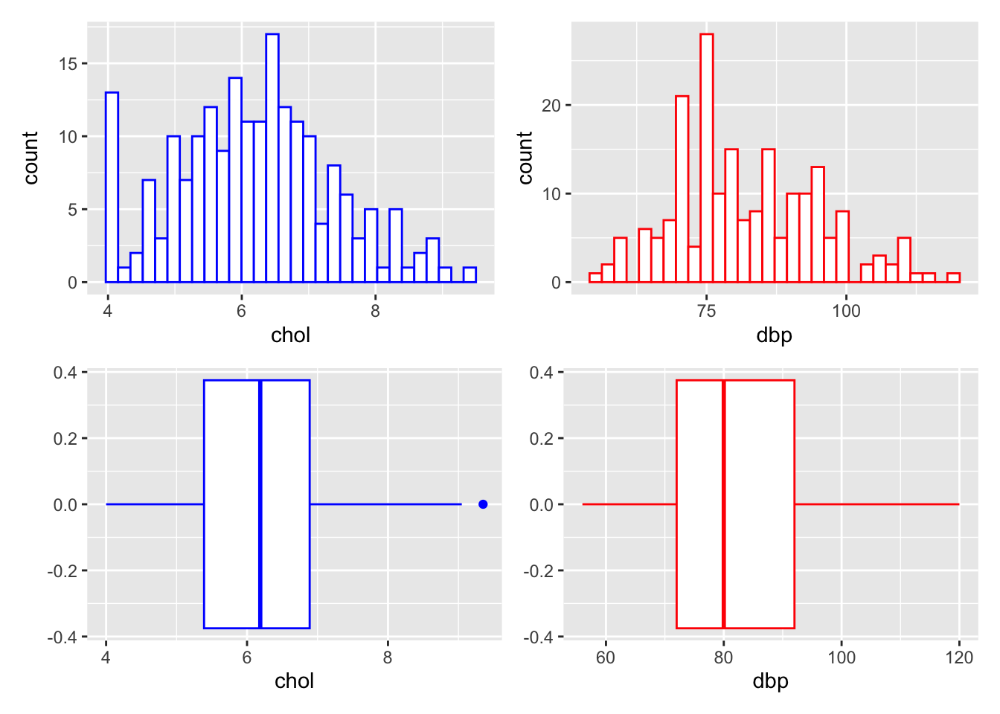
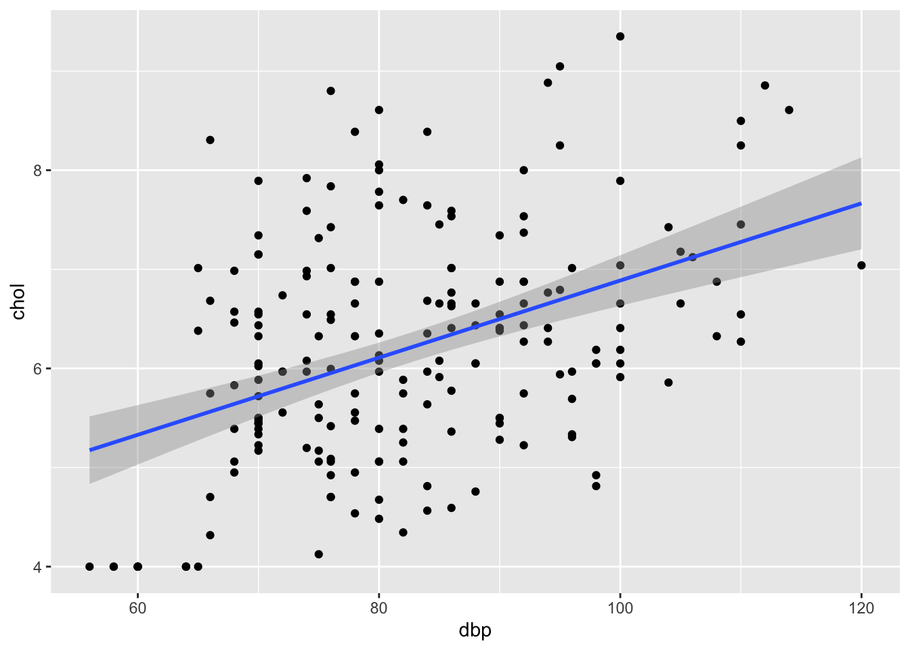
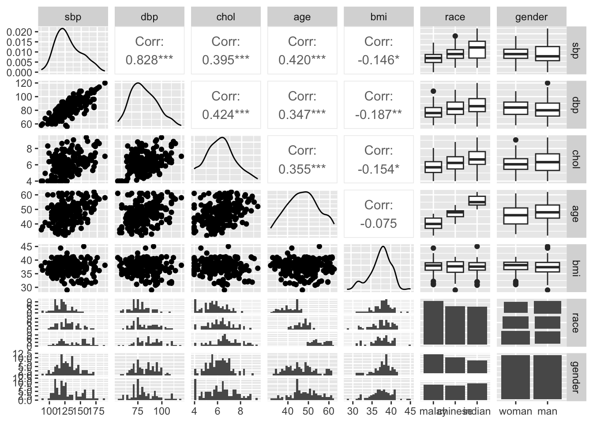
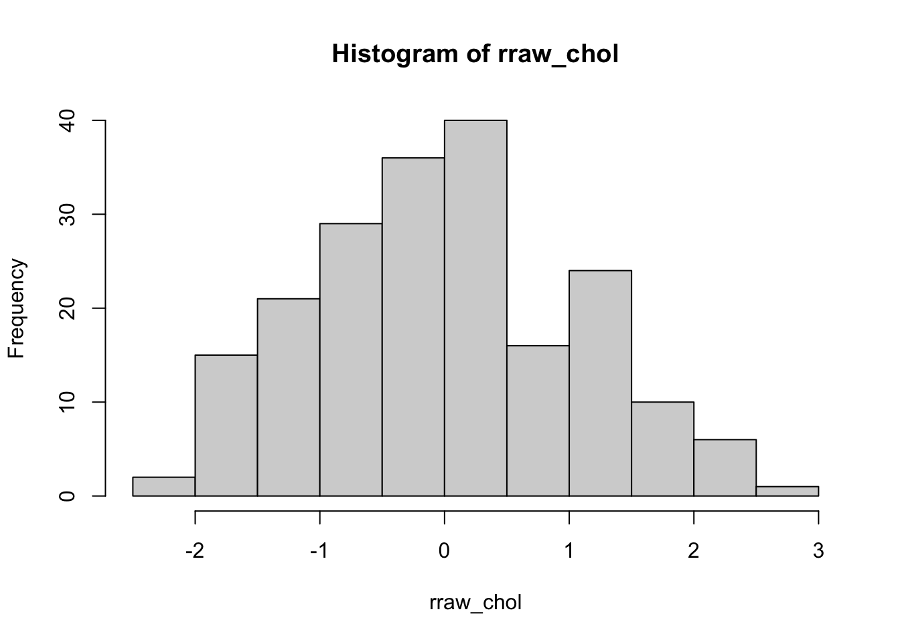
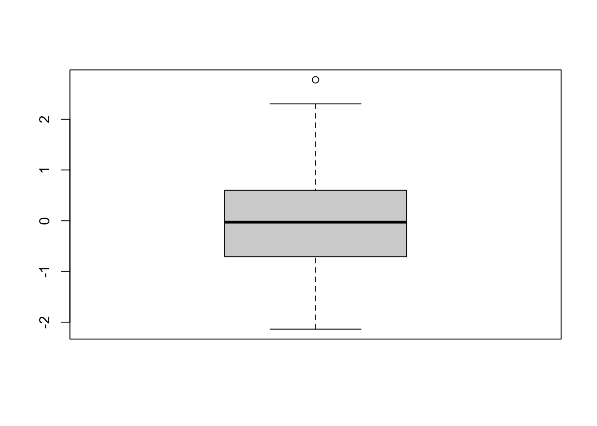
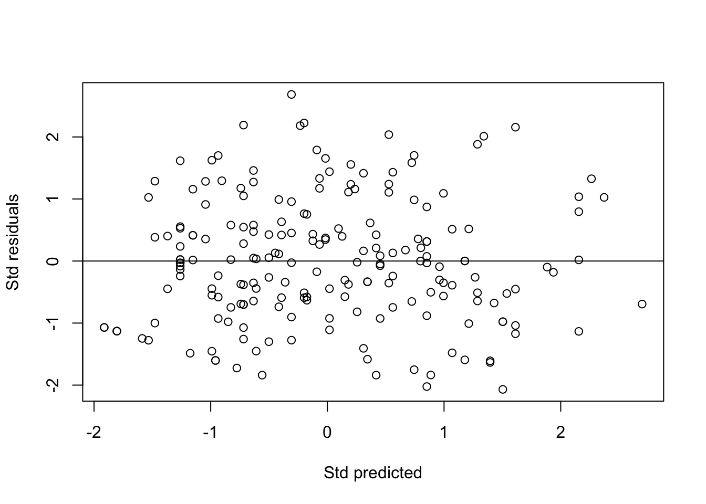
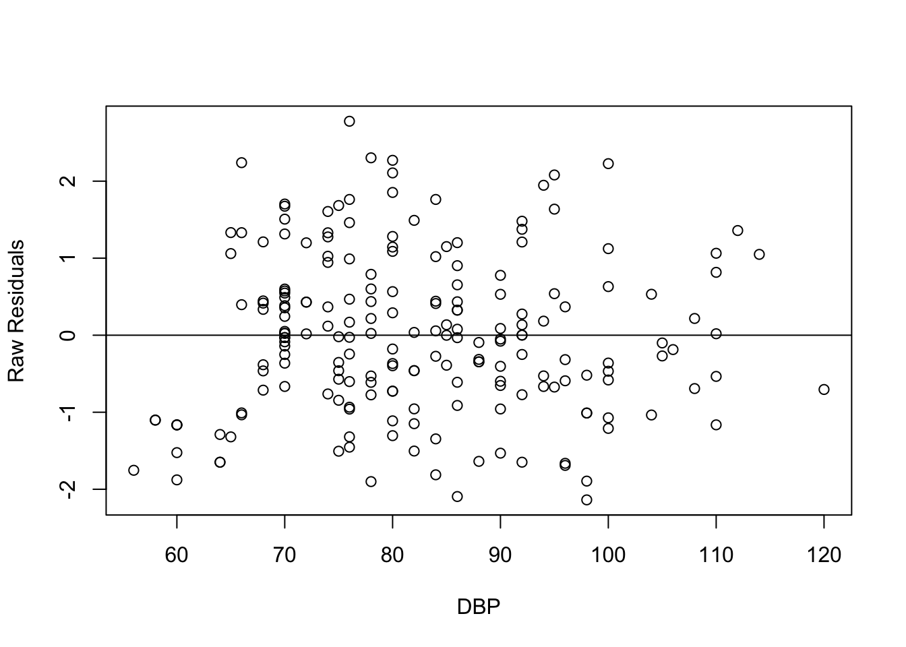

# Linear Regression {#lin-reg}

## Introduction

### Background
Linear regression \@ref(lin-reg) is one of the most common statistical analyses in medical and health sciences. Linear regression \@ref(lin-reg) models the linear (i.e. straight line) relationship between:

- **outcome**: numerical variable (e.g. blood pressure, BMI, cholesterol level).
- **predictors/independent variables**: numerical variables and categorical variables (e.g. gender, race, education level).

In simple words, we might be interested in knowing the relationship between the cholesterol level and its associated factors, for example gender, age, BMI and lifestyle. This can be explored by a Linear regression\index{Linear regression} analysis.

Linear regression\index{Linear regression} is a type of Generalized linear models (GLMs)\index{Generalized linear models (GLMs)}, which also includes other outcome types, for example categorical and count. In subsequent chapters, we will cover these outcome types in form of logistic regression\index{Logistic regression} and Poisson regression\index{Poisson regression}. Basically, the relationship between the outcome and predictors in a linear regression\index{Linear regression} is structured as follows,

$$\begin{aligned}
numerical\ outcome = &\ numerical\ predictors \\
& + categorical\ predictors
\end{aligned}$$

More appropriate forms of this relationship will explained later under simple and multiple linear regressions sections.

### Objectives
After completing this chapter, the readers are expected to

- understand the concept of simple and multiple linear regression\index{Multiple linear regression (MLR)} 
- perform simple linear regression\index{Simple linear regression (SLR)}
- perform multiple linear regression\index{Multiple linear regression (MLR)}
- perform model fit\index{Model fit} assessment of linear regression models
- present and interpret the results of linear regression analyses

## Prepare R Environment for Analysis

### Libraries
For this chapter, we will be using the following packages:

- **foreign**\index{foreign}: for reading SPSS\index{SPSS} and STATA\index{STATA} datasets
- **tidyverse**\index{tidyverse}: a general and powerful package for data transformation
- **psych**\index{psych}: for descriptive statistics
- **gtsummary**\index{gtsummary}: for coming up with nice tables for results and plotting the graphs
- **ggplot2**\index{ggplot2}, **ggpubr**\index{ggpubr}, **GGally**\index{GGally}: for plotting the graphs
- **rsq**\index{rsq}: for getting $R^2$ value from a GLM model
- **broom**\index{broom}: for tidying up the results
- **car**\index{car}: for `vif()` function

These are loaded as follows using the function `library()`,


```r
library(foreign)
library(tidyverse)
library(psych)
library(gtsummary)
library(ggplot2)
library(GGally)
library(rsq)
library(broom)
library(car)
```

### Dataset
We will use the `coronary.dta` dataset in STATA\index{STATA} format. The dataset contains the total cholesterol level, their individual characteristics and intervention groups in a hypothetical clinical trial. The dataset contains 200 observations for nine variables:

1. _id_: Subjects' ID.
2. _cad_: Coronary artery disease status (categorical) {no cad, cad}.
2. _sbp_ : Systolic blood pressure in mmHg (numerical).
2. _dbp_ : Diastolic blood pressure in mmHg (numerical).
2. _chol_: Total cholesterol level in mmol/L (numerical).
2. _age_: Age in years (numerical).
2. _bmi_: Body mass index (numerical).
2. _race_: Race of the subjects (categorical) {malay, chinese, indian}.
2. _gender_: Gender of the subjects (categorical) {woman, man}.

The dataset is loaded as follows,

```r
coronary = read.dta("data/coronary.dta")
```

We then look at the basic structure of the dataset,

```r
str(coronary)
#> 'data.frame':	200 obs. of  9 variables:
#>  $ id    : num  1 14 56 61 62 64 69 108 112 134 ...
#>  $ cad   : Factor w/ 2 levels "no cad","cad": 1 1 1 1 1 1 2 1 1 1 ...
#>  $ sbp   : num  106 130 136 138 115 124 110 112 138 104 ...
#>  $ dbp   : num  68 78 84 100 85 72 80 70 85 70 ...
#>  $ chol  : num  6.57 6.33 5.97 7.04 6.66 ...
#>  $ age   : num  60 34 36 45 53 43 44 50 43 48 ...
#>  $ bmi   : num  38.9 37.8 40.5 37.6 40.3 ...
#>  $ race  : Factor w/ 3 levels "malay","chinese",..: 3 1 1 1 3 1 1 2 2 2 ...
#>  $ gender: Factor w/ 2 levels "woman","man": 1 1 1 1 2 2 2 1 1 2 ...
#>  - attr(*, "datalabel")= chr "Written by R.              "
#>  - attr(*, "time.stamp")= chr ""
#>  - attr(*, "formats")= chr [1:9] "%9.0g" "%9.0g" "%9.0g" "%9.0g" ...
#>  - attr(*, "types")= int [1:9] 100 108 100 100 100 100 100 108 108
#>  - attr(*, "val.labels")= chr [1:9] "" "cad" "" "" ...
#>  - attr(*, "var.labels")= chr [1:9] "id" "cad" "sbp" "dbp" ...
#>  - attr(*, "version")= int 7
#>  - attr(*, "label.table")=List of 3
#>   ..$ cad   : Named int [1:2] 1 2
#>   .. ..- attr(*, "names")= chr [1:2] "no cad" "cad"
#>   ..$ race  : Named int [1:3] 1 2 3
#>   .. ..- attr(*, "names")= chr [1:3] "malay" "chinese" "indian"
#>   ..$ gender: Named int [1:2] 1 2
#>   .. ..- attr(*, "names")= chr [1:2] "woman" "man"
```

## Simple Linear Regression\index{Simple linear regression (SLR)}

### About Simple Linear Regression\index{Simple linear regression (SLR)}
Simple linear regression (SLR)\index{Simple linear regression (SLR)} models _linear_ (straight line) relationship between:

- **outcome**: numerical variable.
- **ONE predictor**: numerical/categorical variable.
    
_Note_: When the predictor is a categorical variable, this is typically analyzed by one-way ANOVA\index{ANOVA}. However, SLR can also handle a categorical variable in the GLM framework.

We may formally represent SLR in form of an equation as follows,

$$numerical\ outcome = intercept + coefficient \times predictor$$
or in a shorter form using mathematical notations,

$$\hat y = b_0 + b_1x_1$$
where $\hat y$ (pronounced y hat) is the predicted value of the outcome y.

### Data exploration
Let say, for the SLR we are interested in knowing whether diastolic blood pressure (predictor) is associated with the cholesterol level (outcome). We explore the variables by obtaining the descriptive statistics and plotting the data distribution.

We obtain the descriptive statistics of the variables,

```r
coronary %>% select(chol, dbp) %>% describe()
#>      vars   n  mean    sd median trimmed   mad min    max
#> chol    1 200  6.20  1.18   6.19    6.18  1.18   4   9.35
#> dbp     2 200 82.31 12.90  80.00   81.68 14.83  56 120.00
#>      range skew kurtosis   se
#> chol  5.35 0.18    -0.31 0.08
#> dbp  64.00 0.42    -0.33 0.91
```
and the histograms\index{Histogram} and box-and-whiskers plots\index{Box-and-whiskers plot},

```r
library(patchwork)

hist_chol = ggplot(coronary, aes(chol)) + 
  geom_histogram(color = "blue", fill = "white")
hist_dbp = ggplot(coronary, aes(dbp)) + 
  geom_histogram(color = "red", fill = "white")
bplot_chol = ggplot(coronary, aes(chol)) + 
  geom_boxplot(color = "blue", )
bplot_dbp = ggplot(coronary, aes(dbp)) + 
  geom_boxplot(color = "red")

(hist_chol + hist_dbp)/(bplot_chol + bplot_dbp)
```



### Univariable analysis
For the analysis, we fit the SLR model, which consists of only one predictor (univariable). Here, `chol` is specified as the outcome, and `dbp` as the predictor. In `glm`, the formula is specified as `outcome ~ predictor`. Here, we specify `chol ~ dbp` as the formula in `glm`.

We fit and view the summary information of the model as,

```r
slr_chol = glm(chol ~ dbp, data = coronary)
summary(slr_chol)
#> 
#> Call:
#> glm(formula = chol ~ dbp, data = coronary)
#> 
#> Deviance Residuals: 
#>     Min       1Q   Median       3Q      Max  
#> -1.9967  -0.8304  -0.1292   0.7734   2.8470  
#> 
#> Coefficients:
#>             Estimate Std. Error t value       Pr(>|t|)    
#> (Intercept) 2.995134   0.492092   6.087 0.000000005876 ***
#> dbp         0.038919   0.005907   6.589 0.000000000392 ***
#> ---
#> Signif. codes:  
#> 0 '***' 0.001 '**' 0.01 '*' 0.05 '.' 0.1 ' ' 1
#> 
#> (Dispersion parameter for gaussian family taken to be 1.154763)
#> 
#>     Null deviance: 278.77  on 199  degrees of freedom
#> Residual deviance: 228.64  on 198  degrees of freedom
#> AIC: 600.34
#> 
#> Number of Fisher Scoring iterations: 2
```

We can tidy up the glm output and obtain the 95% confidence interval (CI) using `tidy()` from the `broom`\index{broom} package,

```r
tidy(slr_chol, conf.int = TRUE)
#> # A tibble: 2 × 7
#>   term        estimate std.error statistic  p.value conf.low
#>   <chr>          <dbl>     <dbl>     <dbl>    <dbl>    <dbl>
#> 1 (Intercept)   3.00     0.492        6.09 5.88e- 9   2.03  
#> 2 dbp           0.0389   0.00591      6.59 3.92e-10   0.0273
#> # ℹ 1 more variable: conf.high <dbl>
```

From the output above, we pay attention at these results:

- coefficients, $b$ -- column `estimate`.
- 95% CI -- columns `conf.low` and `conf.high`.
- _P_-value -- column `p.value`.

### Model fit\index{Model fit} assessment
It is important to assess to what extend the SLR model reflects the data. First, we can assess this by $R^2$, which is the percentage of the variance for the outcome that is explained by the predictor. In simpler words, to what extend the variation in the values of the outcome is caused/explained by the predictor. This ranges from 0% (the predictor does not explain the outcome at all) to 100% (the predictor explains the outcome perfectly). Here, we obtain the $R^2$ values,

```r
rsq(slr_chol)
#> [1] 0.1798257
```
  
Next, we can assess the model fit\index{Model fit} by a scatter plot,

```r
plot_slr = ggplot(coronary, aes(x = dbp, y = chol)) + 
  geom_point() + geom_smooth(method = lm)
plot_slr
```


This plot allows the assessment of normality\index{Normality}, linearity\index{Linearity} and equal variance\index{Equal variance} assumptions. We expect an elliptical/oval shape (normality\index{Normality}) and equal scatter of dots above and below the prediction line (equal variance\index{Equal variance}). These aspects indicate a linear relationship between `chol` and `dbp` (linearity\index{Linearity}).

### Presentation and interpretation
To present the result, we can use `tbl_regression()` to come up with a nice table. We use `slr_chol` of the `glm` output with `tbl_regression()` in the `gtsummary`\index{gtsummary} package.

```r
tbl_regression(slr_chol, intercept = TRUE)
```


```{=html}
<div id="kehribeowf" style="padding-left:0px;padding-right:0px;padding-top:10px;padding-bottom:10px;overflow-x:auto;overflow-y:auto;width:auto;height:auto;">
<style>#kehribeowf table {
  font-family: system-ui, 'Segoe UI', Roboto, Helvetica, Arial, sans-serif, 'Apple Color Emoji', 'Segoe UI Emoji', 'Segoe UI Symbol', 'Noto Color Emoji';
  -webkit-font-smoothing: antialiased;
  -moz-osx-font-smoothing: grayscale;
}

#kehribeowf thead, #kehribeowf tbody, #kehribeowf tfoot, #kehribeowf tr, #kehribeowf td, #kehribeowf th {
  border-style: none;
}

#kehribeowf p {
  margin: 0;
  padding: 0;
}

#kehribeowf .gt_table {
  display: table;
  border-collapse: collapse;
  line-height: normal;
  margin-left: auto;
  margin-right: auto;
  color: #333333;
  font-size: 16px;
  font-weight: normal;
  font-style: normal;
  background-color: #FFFFFF;
  width: auto;
  border-top-style: solid;
  border-top-width: 2px;
  border-top-color: #A8A8A8;
  border-right-style: none;
  border-right-width: 2px;
  border-right-color: #D3D3D3;
  border-bottom-style: solid;
  border-bottom-width: 2px;
  border-bottom-color: #A8A8A8;
  border-left-style: none;
  border-left-width: 2px;
  border-left-color: #D3D3D3;
}

#kehribeowf .gt_caption {
  padding-top: 4px;
  padding-bottom: 4px;
}

#kehribeowf .gt_title {
  color: #333333;
  font-size: 125%;
  font-weight: initial;
  padding-top: 4px;
  padding-bottom: 4px;
  padding-left: 5px;
  padding-right: 5px;
  border-bottom-color: #FFFFFF;
  border-bottom-width: 0;
}

#kehribeowf .gt_subtitle {
  color: #333333;
  font-size: 85%;
  font-weight: initial;
  padding-top: 3px;
  padding-bottom: 5px;
  padding-left: 5px;
  padding-right: 5px;
  border-top-color: #FFFFFF;
  border-top-width: 0;
}

#kehribeowf .gt_heading {
  background-color: #FFFFFF;
  text-align: center;
  border-bottom-color: #FFFFFF;
  border-left-style: none;
  border-left-width: 1px;
  border-left-color: #D3D3D3;
  border-right-style: none;
  border-right-width: 1px;
  border-right-color: #D3D3D3;
}

#kehribeowf .gt_bottom_border {
  border-bottom-style: solid;
  border-bottom-width: 2px;
  border-bottom-color: #D3D3D3;
}

#kehribeowf .gt_col_headings {
  border-top-style: solid;
  border-top-width: 2px;
  border-top-color: #D3D3D3;
  border-bottom-style: solid;
  border-bottom-width: 2px;
  border-bottom-color: #D3D3D3;
  border-left-style: none;
  border-left-width: 1px;
  border-left-color: #D3D3D3;
  border-right-style: none;
  border-right-width: 1px;
  border-right-color: #D3D3D3;
}

#kehribeowf .gt_col_heading {
  color: #333333;
  background-color: #FFFFFF;
  font-size: 100%;
  font-weight: normal;
  text-transform: inherit;
  border-left-style: none;
  border-left-width: 1px;
  border-left-color: #D3D3D3;
  border-right-style: none;
  border-right-width: 1px;
  border-right-color: #D3D3D3;
  vertical-align: bottom;
  padding-top: 5px;
  padding-bottom: 6px;
  padding-left: 5px;
  padding-right: 5px;
  overflow-x: hidden;
}

#kehribeowf .gt_column_spanner_outer {
  color: #333333;
  background-color: #FFFFFF;
  font-size: 100%;
  font-weight: normal;
  text-transform: inherit;
  padding-top: 0;
  padding-bottom: 0;
  padding-left: 4px;
  padding-right: 4px;
}

#kehribeowf .gt_column_spanner_outer:first-child {
  padding-left: 0;
}

#kehribeowf .gt_column_spanner_outer:last-child {
  padding-right: 0;
}

#kehribeowf .gt_column_spanner {
  border-bottom-style: solid;
  border-bottom-width: 2px;
  border-bottom-color: #D3D3D3;
  vertical-align: bottom;
  padding-top: 5px;
  padding-bottom: 5px;
  overflow-x: hidden;
  display: inline-block;
  width: 100%;
}

#kehribeowf .gt_spanner_row {
  border-bottom-style: hidden;
}

#kehribeowf .gt_group_heading {
  padding-top: 8px;
  padding-bottom: 8px;
  padding-left: 5px;
  padding-right: 5px;
  color: #333333;
  background-color: #FFFFFF;
  font-size: 100%;
  font-weight: initial;
  text-transform: inherit;
  border-top-style: solid;
  border-top-width: 2px;
  border-top-color: #D3D3D3;
  border-bottom-style: solid;
  border-bottom-width: 2px;
  border-bottom-color: #D3D3D3;
  border-left-style: none;
  border-left-width: 1px;
  border-left-color: #D3D3D3;
  border-right-style: none;
  border-right-width: 1px;
  border-right-color: #D3D3D3;
  vertical-align: middle;
  text-align: left;
}

#kehribeowf .gt_empty_group_heading {
  padding: 0.5px;
  color: #333333;
  background-color: #FFFFFF;
  font-size: 100%;
  font-weight: initial;
  border-top-style: solid;
  border-top-width: 2px;
  border-top-color: #D3D3D3;
  border-bottom-style: solid;
  border-bottom-width: 2px;
  border-bottom-color: #D3D3D3;
  vertical-align: middle;
}

#kehribeowf .gt_from_md > :first-child {
  margin-top: 0;
}

#kehribeowf .gt_from_md > :last-child {
  margin-bottom: 0;
}

#kehribeowf .gt_row {
  padding-top: 8px;
  padding-bottom: 8px;
  padding-left: 5px;
  padding-right: 5px;
  margin: 10px;
  border-top-style: solid;
  border-top-width: 1px;
  border-top-color: #D3D3D3;
  border-left-style: none;
  border-left-width: 1px;
  border-left-color: #D3D3D3;
  border-right-style: none;
  border-right-width: 1px;
  border-right-color: #D3D3D3;
  vertical-align: middle;
  overflow-x: hidden;
}

#kehribeowf .gt_stub {
  color: #333333;
  background-color: #FFFFFF;
  font-size: 100%;
  font-weight: initial;
  text-transform: inherit;
  border-right-style: solid;
  border-right-width: 2px;
  border-right-color: #D3D3D3;
  padding-left: 5px;
  padding-right: 5px;
}

#kehribeowf .gt_stub_row_group {
  color: #333333;
  background-color: #FFFFFF;
  font-size: 100%;
  font-weight: initial;
  text-transform: inherit;
  border-right-style: solid;
  border-right-width: 2px;
  border-right-color: #D3D3D3;
  padding-left: 5px;
  padding-right: 5px;
  vertical-align: top;
}

#kehribeowf .gt_row_group_first td {
  border-top-width: 2px;
}

#kehribeowf .gt_row_group_first th {
  border-top-width: 2px;
}

#kehribeowf .gt_summary_row {
  color: #333333;
  background-color: #FFFFFF;
  text-transform: inherit;
  padding-top: 8px;
  padding-bottom: 8px;
  padding-left: 5px;
  padding-right: 5px;
}

#kehribeowf .gt_first_summary_row {
  border-top-style: solid;
  border-top-color: #D3D3D3;
}

#kehribeowf .gt_first_summary_row.thick {
  border-top-width: 2px;
}

#kehribeowf .gt_last_summary_row {
  padding-top: 8px;
  padding-bottom: 8px;
  padding-left: 5px;
  padding-right: 5px;
  border-bottom-style: solid;
  border-bottom-width: 2px;
  border-bottom-color: #D3D3D3;
}

#kehribeowf .gt_grand_summary_row {
  color: #333333;
  background-color: #FFFFFF;
  text-transform: inherit;
  padding-top: 8px;
  padding-bottom: 8px;
  padding-left: 5px;
  padding-right: 5px;
}

#kehribeowf .gt_first_grand_summary_row {
  padding-top: 8px;
  padding-bottom: 8px;
  padding-left: 5px;
  padding-right: 5px;
  border-top-style: double;
  border-top-width: 6px;
  border-top-color: #D3D3D3;
}

#kehribeowf .gt_last_grand_summary_row_top {
  padding-top: 8px;
  padding-bottom: 8px;
  padding-left: 5px;
  padding-right: 5px;
  border-bottom-style: double;
  border-bottom-width: 6px;
  border-bottom-color: #D3D3D3;
}

#kehribeowf .gt_striped {
  background-color: rgba(128, 128, 128, 0.05);
}

#kehribeowf .gt_table_body {
  border-top-style: solid;
  border-top-width: 2px;
  border-top-color: #D3D3D3;
  border-bottom-style: solid;
  border-bottom-width: 2px;
  border-bottom-color: #D3D3D3;
}

#kehribeowf .gt_footnotes {
  color: #333333;
  background-color: #FFFFFF;
  border-bottom-style: none;
  border-bottom-width: 2px;
  border-bottom-color: #D3D3D3;
  border-left-style: none;
  border-left-width: 2px;
  border-left-color: #D3D3D3;
  border-right-style: none;
  border-right-width: 2px;
  border-right-color: #D3D3D3;
}

#kehribeowf .gt_footnote {
  margin: 0px;
  font-size: 90%;
  padding-top: 4px;
  padding-bottom: 4px;
  padding-left: 5px;
  padding-right: 5px;
}

#kehribeowf .gt_sourcenotes {
  color: #333333;
  background-color: #FFFFFF;
  border-bottom-style: none;
  border-bottom-width: 2px;
  border-bottom-color: #D3D3D3;
  border-left-style: none;
  border-left-width: 2px;
  border-left-color: #D3D3D3;
  border-right-style: none;
  border-right-width: 2px;
  border-right-color: #D3D3D3;
}

#kehribeowf .gt_sourcenote {
  font-size: 90%;
  padding-top: 4px;
  padding-bottom: 4px;
  padding-left: 5px;
  padding-right: 5px;
}

#kehribeowf .gt_left {
  text-align: left;
}

#kehribeowf .gt_center {
  text-align: center;
}

#kehribeowf .gt_right {
  text-align: right;
  font-variant-numeric: tabular-nums;
}

#kehribeowf .gt_font_normal {
  font-weight: normal;
}

#kehribeowf .gt_font_bold {
  font-weight: bold;
}

#kehribeowf .gt_font_italic {
  font-style: italic;
}

#kehribeowf .gt_super {
  font-size: 65%;
}

#kehribeowf .gt_footnote_marks {
  font-size: 75%;
  vertical-align: 0.4em;
  position: initial;
}

#kehribeowf .gt_asterisk {
  font-size: 100%;
  vertical-align: 0;
}

#kehribeowf .gt_indent_1 {
  text-indent: 5px;
}

#kehribeowf .gt_indent_2 {
  text-indent: 10px;
}

#kehribeowf .gt_indent_3 {
  text-indent: 15px;
}

#kehribeowf .gt_indent_4 {
  text-indent: 20px;
}

#kehribeowf .gt_indent_5 {
  text-indent: 25px;
}
</style>
<table class="gt_table" data-quarto-disable-processing="false" data-quarto-bootstrap="false">
  <thead>
    
    <tr class="gt_col_headings">
      <th class="gt_col_heading gt_columns_bottom_border gt_left" rowspan="1" colspan="1" scope="col" id="&lt;strong&gt;Characteristic&lt;/strong&gt;"><strong>Characteristic</strong></th>
      <th class="gt_col_heading gt_columns_bottom_border gt_center" rowspan="1" colspan="1" scope="col" id="&lt;strong&gt;Beta&lt;/strong&gt;"><strong>Beta</strong></th>
      <th class="gt_col_heading gt_columns_bottom_border gt_center" rowspan="1" colspan="1" scope="col" id="&lt;strong&gt;95% CI&lt;/strong&gt;&lt;span class=&quot;gt_footnote_marks&quot; style=&quot;white-space:nowrap;font-style:italic;font-weight:normal;&quot;&gt;&lt;sup&gt;1&lt;/sup&gt;&lt;/span&gt;"><strong>95% CI</strong><span class="gt_footnote_marks" style="white-space:nowrap;font-style:italic;font-weight:normal;"><sup>1</sup></span></th>
      <th class="gt_col_heading gt_columns_bottom_border gt_center" rowspan="1" colspan="1" scope="col" id="&lt;strong&gt;p-value&lt;/strong&gt;"><strong>p-value</strong></th>
    </tr>
  </thead>
  <tbody class="gt_table_body">
    <tr><td headers="label" class="gt_row gt_left">(Intercept)</td>
<td headers="estimate" class="gt_row gt_center">3.0</td>
<td headers="ci" class="gt_row gt_center">2.0, 4.0</td>
<td headers="p.value" class="gt_row gt_center"><0.001</td></tr>
    <tr><td headers="label" class="gt_row gt_left">dbp</td>
<td headers="estimate" class="gt_row gt_center">0.04</td>
<td headers="ci" class="gt_row gt_center">0.03, 0.05</td>
<td headers="p.value" class="gt_row gt_center"><0.001</td></tr>
  </tbody>
  
  <tfoot class="gt_footnotes">
    <tr>
      <td class="gt_footnote" colspan="4"><span class="gt_footnote_marks" style="white-space:nowrap;font-style:italic;font-weight:normal;"><sup>1</sup></span> CI = Confidence Interval</td>
    </tr>
  </tfoot>
</table>
</div>
```

Here, we use `intercept = TRUE` to include the intercept value in the table. By default, this is omitted by the `tbl_regression()`.

It is also very informative to present the model equation,

$$chol = 3.0 + 0.04\times dbp$$

Based on the $R^2$ (which was 0.18), table and model equation, we may interpret the results as follows:

- 1mmHg increase in DBP causes 0.04mmol/L increase in cholesterol level.
- DBP explains 18% of the variance in cholesterol level.

## Multiple Linear Regression\index{Multiple linear regression (MLR)}

### About Multiple Linear Regression\index{Multiple linear regression (MLR)}
Multiple linear regression (MLR)\index{Multiple linear regression (MLR)} models _linear_ relationship between:

- **outcome**: numerical variable.
- **MORE than one predictors**: numerical and categorical variables.

We may formally represent MLR in form of an equation,

$$\begin{aligned}
numerical\ outcome = &\ intercept \\
& + coefficients \times numerical\ predictors \\
& + coefficients \times categorical\ predictors
\end{aligned}$$
or in a shorter form,

$$\hat y = b_0 + b_1x_1 + b_2x_2 + ... + b_px_p$$
where we have _p_ predictors.

Whenever the predictor is a categorical variable with more than two levels, we use dummy variable(s)\index{Dummy variable}. There is no issue with binary categorical variable. For the variable with more than two levels, the number of dummy variables\index{Dummy variable} (i.e. once turned into several binary variables\index{Binary variable}) equals number of levels minus one. For example, whenever we have four levels, we will obtain three dummy (binary) variables. As we will see later, `glm` will automatically do this for `factor` variable and provide separate estimates for each dummy variable\index{Dummy variable}.

### Data exploration
Now, for the MLR we are no longer restricted to one predictor. Let say, we are interested in knowing the relationship between blood pressure (SBP and DBP), age, BMI, race and render as the predictors and the cholesterol level (outcome). As before, we explore the variables by the descriptive statistics,

```r
# numerical
coronary %>% select(-id, -cad, -race, -gender) %>% describe()
#>      vars   n   mean    sd median trimmed   mad   min
#> sbp     1 200 130.18 19.81 126.00  128.93 17.79 88.00
#> dbp     2 200  82.31 12.90  80.00   81.68 14.83 56.00
#> chol    3 200   6.20  1.18   6.19    6.18  1.18  4.00
#> age     4 200  47.33  7.34  47.00   47.28  8.15 32.00
#> bmi     5 200  37.45  2.68  37.80   37.65  2.37 28.99
#>         max range  skew kurtosis   se
#> sbp  187.00 99.00  0.53    -0.37 1.40
#> dbp  120.00 64.00  0.42    -0.33 0.91
#> chol   9.35  5.35  0.18    -0.31 0.08
#> age   62.00 30.00  0.05    -0.78 0.52
#> bmi   45.03 16.03 -0.55     0.42 0.19
# categorical
coronary %>% select(race, gender) %>% tbl_summary()
```


```{=html}
<div id="spnrbjqllx" style="padding-left:0px;padding-right:0px;padding-top:10px;padding-bottom:10px;overflow-x:auto;overflow-y:auto;width:auto;height:auto;">
<style>#spnrbjqllx table {
  font-family: system-ui, 'Segoe UI', Roboto, Helvetica, Arial, sans-serif, 'Apple Color Emoji', 'Segoe UI Emoji', 'Segoe UI Symbol', 'Noto Color Emoji';
  -webkit-font-smoothing: antialiased;
  -moz-osx-font-smoothing: grayscale;
}

#spnrbjqllx thead, #spnrbjqllx tbody, #spnrbjqllx tfoot, #spnrbjqllx tr, #spnrbjqllx td, #spnrbjqllx th {
  border-style: none;
}

#spnrbjqllx p {
  margin: 0;
  padding: 0;
}

#spnrbjqllx .gt_table {
  display: table;
  border-collapse: collapse;
  line-height: normal;
  margin-left: auto;
  margin-right: auto;
  color: #333333;
  font-size: 16px;
  font-weight: normal;
  font-style: normal;
  background-color: #FFFFFF;
  width: auto;
  border-top-style: solid;
  border-top-width: 2px;
  border-top-color: #A8A8A8;
  border-right-style: none;
  border-right-width: 2px;
  border-right-color: #D3D3D3;
  border-bottom-style: solid;
  border-bottom-width: 2px;
  border-bottom-color: #A8A8A8;
  border-left-style: none;
  border-left-width: 2px;
  border-left-color: #D3D3D3;
}

#spnrbjqllx .gt_caption {
  padding-top: 4px;
  padding-bottom: 4px;
}

#spnrbjqllx .gt_title {
  color: #333333;
  font-size: 125%;
  font-weight: initial;
  padding-top: 4px;
  padding-bottom: 4px;
  padding-left: 5px;
  padding-right: 5px;
  border-bottom-color: #FFFFFF;
  border-bottom-width: 0;
}

#spnrbjqllx .gt_subtitle {
  color: #333333;
  font-size: 85%;
  font-weight: initial;
  padding-top: 3px;
  padding-bottom: 5px;
  padding-left: 5px;
  padding-right: 5px;
  border-top-color: #FFFFFF;
  border-top-width: 0;
}

#spnrbjqllx .gt_heading {
  background-color: #FFFFFF;
  text-align: center;
  border-bottom-color: #FFFFFF;
  border-left-style: none;
  border-left-width: 1px;
  border-left-color: #D3D3D3;
  border-right-style: none;
  border-right-width: 1px;
  border-right-color: #D3D3D3;
}

#spnrbjqllx .gt_bottom_border {
  border-bottom-style: solid;
  border-bottom-width: 2px;
  border-bottom-color: #D3D3D3;
}

#spnrbjqllx .gt_col_headings {
  border-top-style: solid;
  border-top-width: 2px;
  border-top-color: #D3D3D3;
  border-bottom-style: solid;
  border-bottom-width: 2px;
  border-bottom-color: #D3D3D3;
  border-left-style: none;
  border-left-width: 1px;
  border-left-color: #D3D3D3;
  border-right-style: none;
  border-right-width: 1px;
  border-right-color: #D3D3D3;
}

#spnrbjqllx .gt_col_heading {
  color: #333333;
  background-color: #FFFFFF;
  font-size: 100%;
  font-weight: normal;
  text-transform: inherit;
  border-left-style: none;
  border-left-width: 1px;
  border-left-color: #D3D3D3;
  border-right-style: none;
  border-right-width: 1px;
  border-right-color: #D3D3D3;
  vertical-align: bottom;
  padding-top: 5px;
  padding-bottom: 6px;
  padding-left: 5px;
  padding-right: 5px;
  overflow-x: hidden;
}

#spnrbjqllx .gt_column_spanner_outer {
  color: #333333;
  background-color: #FFFFFF;
  font-size: 100%;
  font-weight: normal;
  text-transform: inherit;
  padding-top: 0;
  padding-bottom: 0;
  padding-left: 4px;
  padding-right: 4px;
}

#spnrbjqllx .gt_column_spanner_outer:first-child {
  padding-left: 0;
}

#spnrbjqllx .gt_column_spanner_outer:last-child {
  padding-right: 0;
}

#spnrbjqllx .gt_column_spanner {
  border-bottom-style: solid;
  border-bottom-width: 2px;
  border-bottom-color: #D3D3D3;
  vertical-align: bottom;
  padding-top: 5px;
  padding-bottom: 5px;
  overflow-x: hidden;
  display: inline-block;
  width: 100%;
}

#spnrbjqllx .gt_spanner_row {
  border-bottom-style: hidden;
}

#spnrbjqllx .gt_group_heading {
  padding-top: 8px;
  padding-bottom: 8px;
  padding-left: 5px;
  padding-right: 5px;
  color: #333333;
  background-color: #FFFFFF;
  font-size: 100%;
  font-weight: initial;
  text-transform: inherit;
  border-top-style: solid;
  border-top-width: 2px;
  border-top-color: #D3D3D3;
  border-bottom-style: solid;
  border-bottom-width: 2px;
  border-bottom-color: #D3D3D3;
  border-left-style: none;
  border-left-width: 1px;
  border-left-color: #D3D3D3;
  border-right-style: none;
  border-right-width: 1px;
  border-right-color: #D3D3D3;
  vertical-align: middle;
  text-align: left;
}

#spnrbjqllx .gt_empty_group_heading {
  padding: 0.5px;
  color: #333333;
  background-color: #FFFFFF;
  font-size: 100%;
  font-weight: initial;
  border-top-style: solid;
  border-top-width: 2px;
  border-top-color: #D3D3D3;
  border-bottom-style: solid;
  border-bottom-width: 2px;
  border-bottom-color: #D3D3D3;
  vertical-align: middle;
}

#spnrbjqllx .gt_from_md > :first-child {
  margin-top: 0;
}

#spnrbjqllx .gt_from_md > :last-child {
  margin-bottom: 0;
}

#spnrbjqllx .gt_row {
  padding-top: 8px;
  padding-bottom: 8px;
  padding-left: 5px;
  padding-right: 5px;
  margin: 10px;
  border-top-style: solid;
  border-top-width: 1px;
  border-top-color: #D3D3D3;
  border-left-style: none;
  border-left-width: 1px;
  border-left-color: #D3D3D3;
  border-right-style: none;
  border-right-width: 1px;
  border-right-color: #D3D3D3;
  vertical-align: middle;
  overflow-x: hidden;
}

#spnrbjqllx .gt_stub {
  color: #333333;
  background-color: #FFFFFF;
  font-size: 100%;
  font-weight: initial;
  text-transform: inherit;
  border-right-style: solid;
  border-right-width: 2px;
  border-right-color: #D3D3D3;
  padding-left: 5px;
  padding-right: 5px;
}

#spnrbjqllx .gt_stub_row_group {
  color: #333333;
  background-color: #FFFFFF;
  font-size: 100%;
  font-weight: initial;
  text-transform: inherit;
  border-right-style: solid;
  border-right-width: 2px;
  border-right-color: #D3D3D3;
  padding-left: 5px;
  padding-right: 5px;
  vertical-align: top;
}

#spnrbjqllx .gt_row_group_first td {
  border-top-width: 2px;
}

#spnrbjqllx .gt_row_group_first th {
  border-top-width: 2px;
}

#spnrbjqllx .gt_summary_row {
  color: #333333;
  background-color: #FFFFFF;
  text-transform: inherit;
  padding-top: 8px;
  padding-bottom: 8px;
  padding-left: 5px;
  padding-right: 5px;
}

#spnrbjqllx .gt_first_summary_row {
  border-top-style: solid;
  border-top-color: #D3D3D3;
}

#spnrbjqllx .gt_first_summary_row.thick {
  border-top-width: 2px;
}

#spnrbjqllx .gt_last_summary_row {
  padding-top: 8px;
  padding-bottom: 8px;
  padding-left: 5px;
  padding-right: 5px;
  border-bottom-style: solid;
  border-bottom-width: 2px;
  border-bottom-color: #D3D3D3;
}

#spnrbjqllx .gt_grand_summary_row {
  color: #333333;
  background-color: #FFFFFF;
  text-transform: inherit;
  padding-top: 8px;
  padding-bottom: 8px;
  padding-left: 5px;
  padding-right: 5px;
}

#spnrbjqllx .gt_first_grand_summary_row {
  padding-top: 8px;
  padding-bottom: 8px;
  padding-left: 5px;
  padding-right: 5px;
  border-top-style: double;
  border-top-width: 6px;
  border-top-color: #D3D3D3;
}

#spnrbjqllx .gt_last_grand_summary_row_top {
  padding-top: 8px;
  padding-bottom: 8px;
  padding-left: 5px;
  padding-right: 5px;
  border-bottom-style: double;
  border-bottom-width: 6px;
  border-bottom-color: #D3D3D3;
}

#spnrbjqllx .gt_striped {
  background-color: rgba(128, 128, 128, 0.05);
}

#spnrbjqllx .gt_table_body {
  border-top-style: solid;
  border-top-width: 2px;
  border-top-color: #D3D3D3;
  border-bottom-style: solid;
  border-bottom-width: 2px;
  border-bottom-color: #D3D3D3;
}

#spnrbjqllx .gt_footnotes {
  color: #333333;
  background-color: #FFFFFF;
  border-bottom-style: none;
  border-bottom-width: 2px;
  border-bottom-color: #D3D3D3;
  border-left-style: none;
  border-left-width: 2px;
  border-left-color: #D3D3D3;
  border-right-style: none;
  border-right-width: 2px;
  border-right-color: #D3D3D3;
}

#spnrbjqllx .gt_footnote {
  margin: 0px;
  font-size: 90%;
  padding-top: 4px;
  padding-bottom: 4px;
  padding-left: 5px;
  padding-right: 5px;
}

#spnrbjqllx .gt_sourcenotes {
  color: #333333;
  background-color: #FFFFFF;
  border-bottom-style: none;
  border-bottom-width: 2px;
  border-bottom-color: #D3D3D3;
  border-left-style: none;
  border-left-width: 2px;
  border-left-color: #D3D3D3;
  border-right-style: none;
  border-right-width: 2px;
  border-right-color: #D3D3D3;
}

#spnrbjqllx .gt_sourcenote {
  font-size: 90%;
  padding-top: 4px;
  padding-bottom: 4px;
  padding-left: 5px;
  padding-right: 5px;
}

#spnrbjqllx .gt_left {
  text-align: left;
}

#spnrbjqllx .gt_center {
  text-align: center;
}

#spnrbjqllx .gt_right {
  text-align: right;
  font-variant-numeric: tabular-nums;
}

#spnrbjqllx .gt_font_normal {
  font-weight: normal;
}

#spnrbjqllx .gt_font_bold {
  font-weight: bold;
}

#spnrbjqllx .gt_font_italic {
  font-style: italic;
}

#spnrbjqllx .gt_super {
  font-size: 65%;
}

#spnrbjqllx .gt_footnote_marks {
  font-size: 75%;
  vertical-align: 0.4em;
  position: initial;
}

#spnrbjqllx .gt_asterisk {
  font-size: 100%;
  vertical-align: 0;
}

#spnrbjqllx .gt_indent_1 {
  text-indent: 5px;
}

#spnrbjqllx .gt_indent_2 {
  text-indent: 10px;
}

#spnrbjqllx .gt_indent_3 {
  text-indent: 15px;
}

#spnrbjqllx .gt_indent_4 {
  text-indent: 20px;
}

#spnrbjqllx .gt_indent_5 {
  text-indent: 25px;
}
</style>
<table class="gt_table" data-quarto-disable-processing="false" data-quarto-bootstrap="false">
  <thead>
    
    <tr class="gt_col_headings">
      <th class="gt_col_heading gt_columns_bottom_border gt_left" rowspan="1" colspan="1" scope="col" id="&lt;strong&gt;Characteristic&lt;/strong&gt;"><strong>Characteristic</strong></th>
      <th class="gt_col_heading gt_columns_bottom_border gt_center" rowspan="1" colspan="1" scope="col" id="&lt;strong&gt;N = 200&lt;/strong&gt;&lt;span class=&quot;gt_footnote_marks&quot; style=&quot;white-space:nowrap;font-style:italic;font-weight:normal;&quot;&gt;&lt;sup&gt;1&lt;/sup&gt;&lt;/span&gt;"><strong>N = 200</strong><span class="gt_footnote_marks" style="white-space:nowrap;font-style:italic;font-weight:normal;"><sup>1</sup></span></th>
    </tr>
  </thead>
  <tbody class="gt_table_body">
    <tr><td headers="label" class="gt_row gt_left">race</td>
<td headers="stat_0" class="gt_row gt_center"><br /></td></tr>
    <tr><td headers="label" class="gt_row gt_left">    malay</td>
<td headers="stat_0" class="gt_row gt_center">73 (37%)</td></tr>
    <tr><td headers="label" class="gt_row gt_left">    chinese</td>
<td headers="stat_0" class="gt_row gt_center">64 (32%)</td></tr>
    <tr><td headers="label" class="gt_row gt_left">    indian</td>
<td headers="stat_0" class="gt_row gt_center">63 (32%)</td></tr>
    <tr><td headers="label" class="gt_row gt_left">gender</td>
<td headers="stat_0" class="gt_row gt_center"><br /></td></tr>
    <tr><td headers="label" class="gt_row gt_left">    woman</td>
<td headers="stat_0" class="gt_row gt_center">100 (50%)</td></tr>
    <tr><td headers="label" class="gt_row gt_left">    man</td>
<td headers="stat_0" class="gt_row gt_center">100 (50%)</td></tr>
  </tbody>
  
  <tfoot class="gt_footnotes">
    <tr>
      <td class="gt_footnote" colspan="2"><span class="gt_footnote_marks" style="white-space:nowrap;font-style:italic;font-weight:normal;"><sup>1</sup></span> n (%)</td>
    </tr>
  </tfoot>
</table>
</div>
```

and the pairs plot, where we focus on the distribution of the data by histograms and box-and-whiskers plots\index{Box-and-whiskers plot}. The pairs plot also includes information on the bivariate correlation statistics between the numerical variables.

```r
coronary %>% select(-id, -cad) %>% ggpairs()
```



### Univariable analysis
For the univariable analysis in the context of MLR, we aim to select variables that are worthwhile to be included in the multivariable model\index{Multivariable model}.

In the context of **exploratory research**\index{Exploratory research}, we want to choose only variables with _P_-values < 0.25 to be included in MLR. To obtain the _P_-values, you may perform separate SLRs for each of the predictors (on your own). However, obtaining _P_-value for each predictor is easy by `add1()` function. Here, we use likelihood ratio test (LRT) using `test = "LRT"` option to obtain the _P_-values. We start with an intercept only model `slr_chol0` using `chol ~ 1` formula specification in the `glm` followed by `add1()`. `add1()` will test each predictor one by one.

```r
slr_chol0 = glm(chol ~ 1, data = coronary)  # intercept only model
add1(slr_chol0, scope = ~ sbp + dbp + age + bmi + race + gender, 
     test = "LRT")
#> Single term additions
#> 
#> Model:
#> chol ~ 1
#>        Df Deviance    AIC scaled dev.        Pr(>Chi)    
#> <none>      278.77 637.99                                
#> sbp     1   235.36 606.14      33.855 0.0000000059384 ***
#> dbp     1   228.64 600.34      39.648 0.0000000003042 ***
#> age     1   243.68 613.08      26.911 0.0000002130129 ***
#> bmi     1   272.17 635.20       4.792         0.02859 *  
#> race    2   241.68 613.43      28.561 0.0000006280216 ***
#> gender  1   277.45 639.04       0.952         0.32933    
#> ---
#> Signif. codes:  
#> 0 '***' 0.001 '**' 0.01 '*' 0.05 '.' 0.1 ' ' 1
```
From the output, all variables are important with _P_ < .25 except `gender`. These variables, excluding `gender`, are candidates in this variable selection\index{Variable selection} step.

However, please keep in mind that in the context of **confirmatory research**\index{Confirmatory research}, the variables that we want to include are not merely based on _P_-values alone. It is important to consider expert judgement\index{Expert judgement} as well.

### Multivariable analysis
Multivariable analysis involves more than one predictors. In the univariable variable selection\index{Variable selection}, we decided on several potential predictors. For MLR, we (judiciously) included these variables in an MLR model. In the present dataset, we have the following considerations:

- including both SBP and DBP is redundant, because both represent the blood pressure. These variables are also highly correlated. This is indicated by the correlation value, _r_ = 0.828 and scatter plot for the SBP-DBP pair in the pairs plot in the data exploration step.
- `gender` was not sigficant, thus we may exclude the variable.
- let say, as advised by experts in the field, we should exclude `age` in the modelling.

Now, given these considerations, we perform MLR with the selected variables,

```r
mlr_chol = glm(chol ~ dbp + bmi + race, data = coronary)
summary(mlr_chol)
#> 
#> Call:
#> glm(formula = chol ~ dbp + bmi + race, data = coronary)
#> 
#> Deviance Residuals: 
#>      Min        1Q    Median        3Q       Max  
#> -2.18698  -0.73076  -0.01935   0.63476   2.91524  
#> 
#> Coefficients:
#>              Estimate Std. Error t value   Pr(>|t|)    
#> (Intercept)  4.870859   1.245373   3.911   0.000127 ***
#> dbp          0.029500   0.006203   4.756 0.00000383 ***
#> bmi         -0.038530   0.028099  -1.371   0.171871    
#> racechinese  0.356642   0.181757   1.962   0.051164 .  
#> raceindian   0.724716   0.190625   3.802   0.000192 ***
#> ---
#> Signif. codes:  
#> 0 '***' 0.001 '**' 0.01 '*' 0.05 '.' 0.1 ' ' 1
#> 
#> (Dispersion parameter for gaussian family taken to be 1.083909)
#> 
#>     Null deviance: 278.77  on 199  degrees of freedom
#> Residual deviance: 211.36  on 195  degrees of freedom
#> AIC: 590.63
#> 
#> Number of Fisher Scoring iterations: 2
```

From the output above, for each variable, we focus these results:

- coefficients, $b$s -- column `estimate`.
- 95% CIs -- columns `conf.low` and `conf.high`.
- _P_-values -- column `p.value`.

Note that for a categorical variable with more than two categories, the estimates are obtained for each dummy variable\index{Dummy variable}. In our case, `race` consists of Malay, Chinese and Indian. From the output, the dummy variables\index{Dummy variable} are `racechinese` representing Chinese vs Malay and `raceindian` representing Indian vs Malay dummy variables\index{Dummy variable}, where Malay is set as the baseline comparison group.

We also notice that some variables are not significant at significance level of 0.05, namely `bmi` and `racechinese`. As for `racechinese` dummy variable\index{Dummy variable}, because this forms part of the `race` variable, we accept the variable because it is marginally insignificant (0.0512 vs 0.05) and the other dummy variable\index{Dummy variable} `raceindian` is significant.

#### Stepwise automatic variable selection\index{Variable selection} {-}
We noted that not all variables included in the model are significant. In our case, we may remove `bmi` because it is not statistically significant. But in exploratory research\index{Exploratory research} where we have hundreds of variables, it is impossible to select variables by eye-ball judgement. So, in this case, how to perform the variable selection\index{Variable selection}? To explore the significance of the variables, we may perform stepwise automatic selection. It is important to know stepwise selection\index{Stepwise selection} is meant for exploratory research\index{Exploratory research}. For confirmatory analysis, it is important to rely on expert opinion for the variable selection\index{Variable selection}. We may perform forward, backward or both forward and backward selection combined.

_Forward selection_\index{Forward selection} starts with an intercept only or empty model without variable. It proceeds by adding one variable after another. In R, Akaike information criterion (AIC\index{AIC}) is used as the comparative goodness-of-fit measure and model quality. In the stepwise selection\index{Stepwise selection}, it seeks to find the model with the lowest AIC\index{AIC} iteratively and the steps are shown in the output. More information about AIC\index{AIC} can be referred to @hu2007 and @aic-wiki.

```r
# forward
mlr_chol_stepforward = step(slr_chol0, scope = ~ dbp + bmi + race, 
                            direction = "forward")
#> Start:  AIC=637.99
#> chol ~ 1
#> 
#>        Df Deviance    AIC
#> + dbp   1   228.64 600.34
#> + race  2   241.68 613.43
#> + bmi   1   272.17 635.20
#> <none>      278.77 637.99
#> 
#> Step:  AIC=600.34
#> chol ~ dbp
#> 
#>        Df Deviance    AIC
#> + race  2   213.40 590.55
#> <none>      228.64 600.34
#> + bmi   1   227.04 600.94
#> 
#> Step:  AIC=590.55
#> chol ~ dbp + race
#> 
#>        Df Deviance    AIC
#> <none>      213.40 590.55
#> + bmi   1   211.36 590.63
```

_Backward selection_\index{Backward selection} starts with a model containing all variables. Then, it proceeds by removing one variable after another, of which it aims to find the model with the lowest AIC\index{AIC}.

```r
# backward
mlr_chol_stepback = step(mlr_chol, direction = "backward")
#> Start:  AIC=590.63
#> chol ~ dbp + bmi + race
#> 
#>        Df Deviance    AIC
#> - bmi   1   213.40 590.55
#> <none>      211.36 590.63
#> - race  2   227.04 600.94
#> - dbp   1   235.88 610.58
#> 
#> Step:  AIC=590.55
#> chol ~ dbp + race
#> 
#>        Df Deviance    AIC
#> <none>      213.40 590.55
#> - race  2   228.64 600.34
#> - dbp   1   241.68 613.43
```

_Bidirectional selection_\index{Bidirectional selection}, as implemented in R, starts as with the model with all variables. Then, it proceeds with removing or adding variables, which combines both forward and backward selection methods. It stops once it finds the model with the lowest AIC\index{AIC}.

```r
# both
mlr_chol_stepboth = step(mlr_chol, direction = "both")
#> Start:  AIC=590.63
#> chol ~ dbp + bmi + race
#> 
#>        Df Deviance    AIC
#> - bmi   1   213.40 590.55
#> <none>      211.36 590.63
#> - race  2   227.04 600.94
#> - dbp   1   235.88 610.58
#> 
#> Step:  AIC=590.55
#> chol ~ dbp + race
#> 
#>        Df Deviance    AIC
#> <none>      213.40 590.55
#> + bmi   1   211.36 590.63
#> - race  2   228.64 600.34
#> - dbp   1   241.68 613.43
```

#### Preliminary model {-}
Let say, after considering the _P_-value, stepwise selection\index{Stepwise selection} (in exploratory research\index{Exploratory research}) and expert opinion, we decided that our preliminary model is,

`chol ~ dbp + race`

and we fit the model again to view basic information of the model,

```r
mlr_chol_sel = glm(chol ~ dbp + race, data = coronary)
summary(mlr_chol_sel)
#> 
#> Call:
#> glm(formula = chol ~ dbp + race, data = coronary)
#> 
#> Deviance Residuals: 
#>     Min       1Q   Median       3Q      Max  
#> -2.1378  -0.7068  -0.0289   0.5997   2.7778  
#> 
#> Coefficients:
#>             Estimate Std. Error t value       Pr(>|t|)    
#> (Intercept) 3.298028   0.486213   6.783 0.000000000136 ***
#> dbp         0.031108   0.006104   5.096 0.000000813502 ***
#> racechinese 0.359964   0.182149   1.976       0.049534 *  
#> raceindian  0.713690   0.190883   3.739       0.000243 ***
#> ---
#> Signif. codes:  
#> 0 '***' 0.001 '**' 0.01 '*' 0.05 '.' 0.1 ' ' 1
#> 
#> (Dispersion parameter for gaussian family taken to be 1.088777)
#> 
#>     Null deviance: 278.77  on 199  degrees of freedom
#> Residual deviance: 213.40  on 196  degrees of freedom
#> AIC: 590.55
#> 
#> Number of Fisher Scoring iterations: 2
rsq(mlr_chol_sel)
#> [1] 0.2345037
```

### Interaction\index{Interaction}
Interaction\index{Interaction} is the combination of predictors that requires interpretation of their regression coefficients separately based on the levels of the predictor. For example, we need separate interpretation of the coefficient for `dbp` depending on `race` group: Malay, Chinese or Indian. This makes interpreting our analysis complicated as we can no longer interpret each coefficient on its own. So, most of the time, we pray not to have interaction\index{Interaction} in our regression model. We fit the model with a two-way interaction\index{Interaction} term,

```r
summary(glm(chol ~ dbp * race, data = coronary))
#> 
#> Call:
#> glm(formula = chol ~ dbp * race, data = coronary)
#> 
#> Deviance Residuals: 
#>      Min        1Q    Median        3Q       Max  
#> -2.10485  -0.77524  -0.02423   0.58059   2.74380  
#> 
#> Coefficients:
#>                 Estimate Std. Error t value Pr(>|t|)    
#> (Intercept)      2.11114    0.92803   2.275 0.024008 *  
#> dbp              0.04650    0.01193   3.897 0.000134 ***
#> racechinese      1.95576    1.28477   1.522 0.129572    
#> raceindian       2.41530    1.25766   1.920 0.056266 .  
#> dbp:racechinese -0.02033    0.01596  -1.273 0.204376    
#> dbp:raceindian  -0.02126    0.01529  -1.391 0.165905    
#> ---
#> Signif. codes:  
#> 0 '***' 0.001 '**' 0.01 '*' 0.05 '.' 0.1 ' ' 1
#> 
#> (Dispersion parameter for gaussian family taken to be 1.087348)
#> 
#>     Null deviance: 278.77  on 199  degrees of freedom
#> Residual deviance: 210.95  on 194  degrees of freedom
#> AIC: 592.23
#> 
#> Number of Fisher Scoring iterations: 2
```
From the output, there is no evidence that suggests the presence of interaction\index{Interaction} because the included interaction\index{Interaction} term was insignificant. In R, it is easy to fit interaction\index{Interaction} by `*`, e.g. `dbp * race` will automatically includes all variables involved. This is equal to specifiying `glm(chol ~ dbp + race + dbp:race, data = coronary)`, where we can use `:` to include the interaction\index{Interaction}.

### Model fit\index{Model fit} assessment
For MLR, we assess the model fit\index{Model fit} by $R^2$ and histogram and scatter plots of residuals. Residuals, in simple term, are the discrepancies between the observed values (dots) and the predicted values (by the fit MLR model). So, the lesser the discrepancies, the better is the model fit\index{Model fit}.

#### Percentage of variance explained, $R^2$ {-}
First, we obtain the $R^2$ values. In comparison to the $R^2$ obtained for the SLR, we include `adj = TRUE` here to obtain an adjusted $R^2$. The adjusted $R^2$ here is the $R^2$ with penalty for the number of predictors _p_. This discourages including too many variables, which might be unnecessary.

```r
rsq(mlr_chol_sel, adj = TRUE)
#> [1] 0.2227869
```

#### Histogram and box-and-whiskers plot {-}
Second, we plot a histogram and a box-and-whiskers plot to assess the normality\index{Normality} of raw/unstandardized residuals\index{Unstandardized residuals} of the MLR model. We expect normally distributed residuals to indicate a good fit of the MLR model. Here, we have a normally distributed residuals.

```r
rraw_chol = resid(mlr_chol_sel)
hist(rraw_chol)
```



```r
boxplot(rraw_chol)
```



#### Scatter plots {-}
Third, we plot a standardized residuals\index{Standardized residuals} (Y-axis) vs standardized predicted values\index{Standardized predicted values} (X-axis). Similar to the one for SLR, this plot allows assessment of normality\index{Normality}, linearity\index{Linearity} and equal variance\index{Equal variance} assumptions. The dots should form elliptical/oval shape (normality\index{Normality}) and scattered roughly equal above and below the zero line (equal variance\index{Equal variance}). Both these indicate linearity\index{Linearity}. Our plot below shows that the assumptions are met.

```r
rstd_chol = rstandard(mlr_chol_sel)  # standardized residuals
pstd_chol = scale(predict(mlr_chol_sel))  # standardized predicted values
plot(rstd_chol ~ pstd_chol, xlab = "Std predicted", ylab = "Std residuals")
abline(0, 0)  # normal, linear, equal variance
```



In addition to the standardized residuals\index{Standardized residuals} vs standardized predicted values\index{Standardized predicted values} plot, for numerical predictors, we assess the linear relationship between the raw residuals and the observed values of the numerical predictors. We plot the raw residuals vs numerical predictor below. The plot interpreted in similar way to the standardized residuals\index{Standardized residuals} vs standardized predicted values\index{Standardized predicted values} plot. The plot shows good linearity\index{Linearity} between the residuals and the numerical predictor.

```r
plot(rraw_chol ~ coronary$dbp, xlab = "DBP", ylab = "Raw Residuals")
abline(0, 0)
```



### Presentation and interpretation
After passing all the assumption checks, we may now decide on our final model. We may rename the preliminary model `mlr_chol_sel` to `mlr_chol_final` for easier reference. 

```r
mlr_chol_final = mlr_chol_sel
```

Similar to SLR, we use `tbl_regression()` to come up with a nice table to present the results.

```r
tbl_regression(mlr_chol_final, intercept = TRUE)
```


```{=html}
<div id="huoxboortw" style="padding-left:0px;padding-right:0px;padding-top:10px;padding-bottom:10px;overflow-x:auto;overflow-y:auto;width:auto;height:auto;">
<style>#huoxboortw table {
  font-family: system-ui, 'Segoe UI', Roboto, Helvetica, Arial, sans-serif, 'Apple Color Emoji', 'Segoe UI Emoji', 'Segoe UI Symbol', 'Noto Color Emoji';
  -webkit-font-smoothing: antialiased;
  -moz-osx-font-smoothing: grayscale;
}

#huoxboortw thead, #huoxboortw tbody, #huoxboortw tfoot, #huoxboortw tr, #huoxboortw td, #huoxboortw th {
  border-style: none;
}

#huoxboortw p {
  margin: 0;
  padding: 0;
}

#huoxboortw .gt_table {
  display: table;
  border-collapse: collapse;
  line-height: normal;
  margin-left: auto;
  margin-right: auto;
  color: #333333;
  font-size: 16px;
  font-weight: normal;
  font-style: normal;
  background-color: #FFFFFF;
  width: auto;
  border-top-style: solid;
  border-top-width: 2px;
  border-top-color: #A8A8A8;
  border-right-style: none;
  border-right-width: 2px;
  border-right-color: #D3D3D3;
  border-bottom-style: solid;
  border-bottom-width: 2px;
  border-bottom-color: #A8A8A8;
  border-left-style: none;
  border-left-width: 2px;
  border-left-color: #D3D3D3;
}

#huoxboortw .gt_caption {
  padding-top: 4px;
  padding-bottom: 4px;
}

#huoxboortw .gt_title {
  color: #333333;
  font-size: 125%;
  font-weight: initial;
  padding-top: 4px;
  padding-bottom: 4px;
  padding-left: 5px;
  padding-right: 5px;
  border-bottom-color: #FFFFFF;
  border-bottom-width: 0;
}

#huoxboortw .gt_subtitle {
  color: #333333;
  font-size: 85%;
  font-weight: initial;
  padding-top: 3px;
  padding-bottom: 5px;
  padding-left: 5px;
  padding-right: 5px;
  border-top-color: #FFFFFF;
  border-top-width: 0;
}

#huoxboortw .gt_heading {
  background-color: #FFFFFF;
  text-align: center;
  border-bottom-color: #FFFFFF;
  border-left-style: none;
  border-left-width: 1px;
  border-left-color: #D3D3D3;
  border-right-style: none;
  border-right-width: 1px;
  border-right-color: #D3D3D3;
}

#huoxboortw .gt_bottom_border {
  border-bottom-style: solid;
  border-bottom-width: 2px;
  border-bottom-color: #D3D3D3;
}

#huoxboortw .gt_col_headings {
  border-top-style: solid;
  border-top-width: 2px;
  border-top-color: #D3D3D3;
  border-bottom-style: solid;
  border-bottom-width: 2px;
  border-bottom-color: #D3D3D3;
  border-left-style: none;
  border-left-width: 1px;
  border-left-color: #D3D3D3;
  border-right-style: none;
  border-right-width: 1px;
  border-right-color: #D3D3D3;
}

#huoxboortw .gt_col_heading {
  color: #333333;
  background-color: #FFFFFF;
  font-size: 100%;
  font-weight: normal;
  text-transform: inherit;
  border-left-style: none;
  border-left-width: 1px;
  border-left-color: #D3D3D3;
  border-right-style: none;
  border-right-width: 1px;
  border-right-color: #D3D3D3;
  vertical-align: bottom;
  padding-top: 5px;
  padding-bottom: 6px;
  padding-left: 5px;
  padding-right: 5px;
  overflow-x: hidden;
}

#huoxboortw .gt_column_spanner_outer {
  color: #333333;
  background-color: #FFFFFF;
  font-size: 100%;
  font-weight: normal;
  text-transform: inherit;
  padding-top: 0;
  padding-bottom: 0;
  padding-left: 4px;
  padding-right: 4px;
}

#huoxboortw .gt_column_spanner_outer:first-child {
  padding-left: 0;
}

#huoxboortw .gt_column_spanner_outer:last-child {
  padding-right: 0;
}

#huoxboortw .gt_column_spanner {
  border-bottom-style: solid;
  border-bottom-width: 2px;
  border-bottom-color: #D3D3D3;
  vertical-align: bottom;
  padding-top: 5px;
  padding-bottom: 5px;
  overflow-x: hidden;
  display: inline-block;
  width: 100%;
}

#huoxboortw .gt_spanner_row {
  border-bottom-style: hidden;
}

#huoxboortw .gt_group_heading {
  padding-top: 8px;
  padding-bottom: 8px;
  padding-left: 5px;
  padding-right: 5px;
  color: #333333;
  background-color: #FFFFFF;
  font-size: 100%;
  font-weight: initial;
  text-transform: inherit;
  border-top-style: solid;
  border-top-width: 2px;
  border-top-color: #D3D3D3;
  border-bottom-style: solid;
  border-bottom-width: 2px;
  border-bottom-color: #D3D3D3;
  border-left-style: none;
  border-left-width: 1px;
  border-left-color: #D3D3D3;
  border-right-style: none;
  border-right-width: 1px;
  border-right-color: #D3D3D3;
  vertical-align: middle;
  text-align: left;
}

#huoxboortw .gt_empty_group_heading {
  padding: 0.5px;
  color: #333333;
  background-color: #FFFFFF;
  font-size: 100%;
  font-weight: initial;
  border-top-style: solid;
  border-top-width: 2px;
  border-top-color: #D3D3D3;
  border-bottom-style: solid;
  border-bottom-width: 2px;
  border-bottom-color: #D3D3D3;
  vertical-align: middle;
}

#huoxboortw .gt_from_md > :first-child {
  margin-top: 0;
}

#huoxboortw .gt_from_md > :last-child {
  margin-bottom: 0;
}

#huoxboortw .gt_row {
  padding-top: 8px;
  padding-bottom: 8px;
  padding-left: 5px;
  padding-right: 5px;
  margin: 10px;
  border-top-style: solid;
  border-top-width: 1px;
  border-top-color: #D3D3D3;
  border-left-style: none;
  border-left-width: 1px;
  border-left-color: #D3D3D3;
  border-right-style: none;
  border-right-width: 1px;
  border-right-color: #D3D3D3;
  vertical-align: middle;
  overflow-x: hidden;
}

#huoxboortw .gt_stub {
  color: #333333;
  background-color: #FFFFFF;
  font-size: 100%;
  font-weight: initial;
  text-transform: inherit;
  border-right-style: solid;
  border-right-width: 2px;
  border-right-color: #D3D3D3;
  padding-left: 5px;
  padding-right: 5px;
}

#huoxboortw .gt_stub_row_group {
  color: #333333;
  background-color: #FFFFFF;
  font-size: 100%;
  font-weight: initial;
  text-transform: inherit;
  border-right-style: solid;
  border-right-width: 2px;
  border-right-color: #D3D3D3;
  padding-left: 5px;
  padding-right: 5px;
  vertical-align: top;
}

#huoxboortw .gt_row_group_first td {
  border-top-width: 2px;
}

#huoxboortw .gt_row_group_first th {
  border-top-width: 2px;
}

#huoxboortw .gt_summary_row {
  color: #333333;
  background-color: #FFFFFF;
  text-transform: inherit;
  padding-top: 8px;
  padding-bottom: 8px;
  padding-left: 5px;
  padding-right: 5px;
}

#huoxboortw .gt_first_summary_row {
  border-top-style: solid;
  border-top-color: #D3D3D3;
}

#huoxboortw .gt_first_summary_row.thick {
  border-top-width: 2px;
}

#huoxboortw .gt_last_summary_row {
  padding-top: 8px;
  padding-bottom: 8px;
  padding-left: 5px;
  padding-right: 5px;
  border-bottom-style: solid;
  border-bottom-width: 2px;
  border-bottom-color: #D3D3D3;
}

#huoxboortw .gt_grand_summary_row {
  color: #333333;
  background-color: #FFFFFF;
  text-transform: inherit;
  padding-top: 8px;
  padding-bottom: 8px;
  padding-left: 5px;
  padding-right: 5px;
}

#huoxboortw .gt_first_grand_summary_row {
  padding-top: 8px;
  padding-bottom: 8px;
  padding-left: 5px;
  padding-right: 5px;
  border-top-style: double;
  border-top-width: 6px;
  border-top-color: #D3D3D3;
}

#huoxboortw .gt_last_grand_summary_row_top {
  padding-top: 8px;
  padding-bottom: 8px;
  padding-left: 5px;
  padding-right: 5px;
  border-bottom-style: double;
  border-bottom-width: 6px;
  border-bottom-color: #D3D3D3;
}

#huoxboortw .gt_striped {
  background-color: rgba(128, 128, 128, 0.05);
}

#huoxboortw .gt_table_body {
  border-top-style: solid;
  border-top-width: 2px;
  border-top-color: #D3D3D3;
  border-bottom-style: solid;
  border-bottom-width: 2px;
  border-bottom-color: #D3D3D3;
}

#huoxboortw .gt_footnotes {
  color: #333333;
  background-color: #FFFFFF;
  border-bottom-style: none;
  border-bottom-width: 2px;
  border-bottom-color: #D3D3D3;
  border-left-style: none;
  border-left-width: 2px;
  border-left-color: #D3D3D3;
  border-right-style: none;
  border-right-width: 2px;
  border-right-color: #D3D3D3;
}

#huoxboortw .gt_footnote {
  margin: 0px;
  font-size: 90%;
  padding-top: 4px;
  padding-bottom: 4px;
  padding-left: 5px;
  padding-right: 5px;
}

#huoxboortw .gt_sourcenotes {
  color: #333333;
  background-color: #FFFFFF;
  border-bottom-style: none;
  border-bottom-width: 2px;
  border-bottom-color: #D3D3D3;
  border-left-style: none;
  border-left-width: 2px;
  border-left-color: #D3D3D3;
  border-right-style: none;
  border-right-width: 2px;
  border-right-color: #D3D3D3;
}

#huoxboortw .gt_sourcenote {
  font-size: 90%;
  padding-top: 4px;
  padding-bottom: 4px;
  padding-left: 5px;
  padding-right: 5px;
}

#huoxboortw .gt_left {
  text-align: left;
}

#huoxboortw .gt_center {
  text-align: center;
}

#huoxboortw .gt_right {
  text-align: right;
  font-variant-numeric: tabular-nums;
}

#huoxboortw .gt_font_normal {
  font-weight: normal;
}

#huoxboortw .gt_font_bold {
  font-weight: bold;
}

#huoxboortw .gt_font_italic {
  font-style: italic;
}

#huoxboortw .gt_super {
  font-size: 65%;
}

#huoxboortw .gt_footnote_marks {
  font-size: 75%;
  vertical-align: 0.4em;
  position: initial;
}

#huoxboortw .gt_asterisk {
  font-size: 100%;
  vertical-align: 0;
}

#huoxboortw .gt_indent_1 {
  text-indent: 5px;
}

#huoxboortw .gt_indent_2 {
  text-indent: 10px;
}

#huoxboortw .gt_indent_3 {
  text-indent: 15px;
}

#huoxboortw .gt_indent_4 {
  text-indent: 20px;
}

#huoxboortw .gt_indent_5 {
  text-indent: 25px;
}
</style>
<table class="gt_table" data-quarto-disable-processing="false" data-quarto-bootstrap="false">
  <thead>
    
    <tr class="gt_col_headings">
      <th class="gt_col_heading gt_columns_bottom_border gt_left" rowspan="1" colspan="1" scope="col" id="&lt;strong&gt;Characteristic&lt;/strong&gt;"><strong>Characteristic</strong></th>
      <th class="gt_col_heading gt_columns_bottom_border gt_center" rowspan="1" colspan="1" scope="col" id="&lt;strong&gt;Beta&lt;/strong&gt;"><strong>Beta</strong></th>
      <th class="gt_col_heading gt_columns_bottom_border gt_center" rowspan="1" colspan="1" scope="col" id="&lt;strong&gt;95% CI&lt;/strong&gt;&lt;span class=&quot;gt_footnote_marks&quot; style=&quot;white-space:nowrap;font-style:italic;font-weight:normal;&quot;&gt;&lt;sup&gt;1&lt;/sup&gt;&lt;/span&gt;"><strong>95% CI</strong><span class="gt_footnote_marks" style="white-space:nowrap;font-style:italic;font-weight:normal;"><sup>1</sup></span></th>
      <th class="gt_col_heading gt_columns_bottom_border gt_center" rowspan="1" colspan="1" scope="col" id="&lt;strong&gt;p-value&lt;/strong&gt;"><strong>p-value</strong></th>
    </tr>
  </thead>
  <tbody class="gt_table_body">
    <tr><td headers="label" class="gt_row gt_left">(Intercept)</td>
<td headers="estimate" class="gt_row gt_center">3.3</td>
<td headers="ci" class="gt_row gt_center">2.3, 4.3</td>
<td headers="p.value" class="gt_row gt_center"><0.001</td></tr>
    <tr><td headers="label" class="gt_row gt_left">dbp</td>
<td headers="estimate" class="gt_row gt_center">0.03</td>
<td headers="ci" class="gt_row gt_center">0.02, 0.04</td>
<td headers="p.value" class="gt_row gt_center"><0.001</td></tr>
    <tr><td headers="label" class="gt_row gt_left">race</td>
<td headers="estimate" class="gt_row gt_center"><br /></td>
<td headers="ci" class="gt_row gt_center"><br /></td>
<td headers="p.value" class="gt_row gt_center"><br /></td></tr>
    <tr><td headers="label" class="gt_row gt_left">    malay</td>
<td headers="estimate" class="gt_row gt_center">—</td>
<td headers="ci" class="gt_row gt_center">—</td>
<td headers="p.value" class="gt_row gt_center"><br /></td></tr>
    <tr><td headers="label" class="gt_row gt_left">    chinese</td>
<td headers="estimate" class="gt_row gt_center">0.36</td>
<td headers="ci" class="gt_row gt_center">0.00, 0.72</td>
<td headers="p.value" class="gt_row gt_center">0.050</td></tr>
    <tr><td headers="label" class="gt_row gt_left">    indian</td>
<td headers="estimate" class="gt_row gt_center">0.71</td>
<td headers="ci" class="gt_row gt_center">0.34, 1.1</td>
<td headers="p.value" class="gt_row gt_center"><0.001</td></tr>
  </tbody>
  
  <tfoot class="gt_footnotes">
    <tr>
      <td class="gt_footnote" colspan="4"><span class="gt_footnote_marks" style="white-space:nowrap;font-style:italic;font-weight:normal;"><sup>1</sup></span> CI = Confidence Interval</td>
    </tr>
  </tfoot>
</table>
</div>
```


It will be useful to be able to save the output in the spreadsheet format for later use. We can use `tidy()` function in this case and export it to a .csv file,

```r
tib_mlr = tidy(mlr_chol_final, conf.int = TRUE)
write.csv(tib_mlr, "mlr_final.csv")
```

Then, we present the model equation. Cholesterol level in mmol/L can be predicted by its predictors as given by,

$$chol = 3.30 + 0.03\times dbp + 0.36\times race\ (chinese) + 0.71\times race\ (indian)$$
Based on the adjusted $R^2$, table and model equation, we may interpret the results as follows:

- 1mmHg increase in DBP causes 0.03mmol/L increase in cholesterol, while controlling for the effect of race.
- Likewise, 10mmHg increase in DBP causes 0.03 x 10 = 0.3mmol/L increase in cholesterol, while controlling for the effect of race.
- Being Chinese causes 0.36mmol/L increase in cholesterol in comparison to Malay, while controlling for the effect of DBP.
- Being Indian causes 0.71mmol/L increase in cholesterol in comparison to Malay, while controlling for the effect of DBP.
- DBP and race explains 22.3% variance in cholesterol.

For each of this interpretation, please keep in mind to also consider the 95% CI of each of coefficient. For example, being Indian causes 0.71mmol/L increase in cholesterol in comparison to Malay, where this may range from 0.34mmol/L to 1.1mmol/L based on the 95% CI.

## Prediction
In some situations, it is useful to use the SLR/MLR model for prediction. For example, we may want to predict the cholesterol level of a patient given some clinical characteristics. We can use the final model above for prediction. For starter, let us view the predicted values for our sample,

```r
coronary$pred_chol = predict(mlr_chol_final)
head(coronary)
#>   id    cad sbp dbp   chol age  bmi   race gender pred_chol
#> 1  1 no cad 106  68 6.5725  60 38.9 indian  woman  6.127070
#> 2 14 no cad 130  78 6.3250  34 37.8  malay  woman  5.724461
#> 3 56 no cad 136  84 5.9675  36 40.5  malay  woman  5.911109
#> 4 61 no cad 138 100 7.0400  45 37.6  malay  woman  6.408839
#> 5 62 no cad 115  85 6.6550  53 40.3 indian    man  6.655908
#> 6 64 no cad 124  72 5.9675  43 37.6  malay    man  5.537812
```
Compare the predicted values with the observed cholesterol level. Recall that we already checked this for the model fit\index{Model fit} assessment before.

It is more useful to predict for newly observed data. Let us try predicting the cholesterol level for an Indian patient with DBP = 90mmHg,

```r
predict(mlr_chol_final, list(dbp = 90, race = "indian"))
#>        1 
#> 6.811448
```

Now, we also do so the data with many more patients,

```r
new_data = data.frame(dbp = c(90, 90, 90), 
                      race = c("malay", "chinese", "indian"))
predict(mlr_chol_final, new_data)
#>        1        2        3 
#> 6.097758 6.457722 6.811448
new_data$pred_chol = predict(mlr_chol_final, new_data)
new_data
#>   dbp    race pred_chol
#> 1  90   malay  6.097758
#> 2  90 chinese  6.457722
#> 3  90  indian  6.811448
```

## Summary
In this chapter, we went through the basics about SLR and MLR. We performed the analysis for each and learned how to assess the model fit\index{Model fit} for the regression models. We learned how to nicely present and interpret the results. In addition, we also learned how to utilize the model for prediction.
