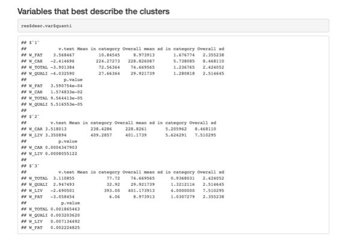

# 💻 Second Intermediate Sample Questions {#int-samp-q-second}

Hi guys, these are the sample questions that prof Dabo gave us to exercise yourself. As you may notice most of them are open questions on very superifical theory concepts, no indeep math or _heavy_ calculations (matrix products, dot products etc.). So please my suggestion is to review **carefully the slides** and just learn the basic R commands to execute analysis on a higer level! 🍀

## 👨‍🎓 2023/2024 (2nd intermediate)

::: {#dabo1 .exercise}

**Basic Understanding:**

a) What does PCA stand for?
a) Briefly explain the primary objective of Principal Component Analysis.
a) How does PCA help in dimensionality reduction?

:::

----

::: {#dabo2 .exercise}

**Library and Data Loading:**

a) Which R library is commonly used for performing PCA?
a) Write the command to load the library FactomineR for PCA.
a) How do you read a dataset into R for PCA analysis?

:::

----

::: {#dabo3 .exercise}

**Data Preparation:**

a) Explain the importance of scaling or standardizing variables before applying PCA.
a) Write the R command to standardize a data matrix.

:::

----

::: {#dabo4 .exercise}

**PCA Execution:**

a) What function in R is used to perform PCA?
a) Provide the basic syntax for running PCA on a dataset named « my_data."

:::

----

::: {#dabo5 .exercise}

**Interpretation of Results:**

a) How can you access the proportion of variance explained by each principal component in the following R script?
a) What is the significance of the eigenvalues and eigenvectors in PCA?

:::

----

::: {#dabo6 .exercise}

**Selecting Principal Components:**

a) How can you determine the optimal number of principal components to retain in R?
a) Write the R command to extract the loadings of principal components.

:::

----

::: {#dabo7 .exercise}

**The inertia of a centered matrix of n individuals and p quantitative variables is**

a) p
a) The sum of variances of the p variables
a) None of the responses are true

:::

----

::: {#dabo8 .exercise}

**The principal components (coordinates of the individuals) are un-correlated**

a) TRUE
a) FALSE

:::

----

::: {#dabo9 .exercise}

**In a normed PCA, the mean eigen-values is **

a) 1
a) 2
a) 3

:::

----

::: {#dabo10 .exercise}

Let **Z** be a matrix **(50 rows and 4 columns)** of centered and reduced quantitative data, with a correlation matrix R (of dimension **4**) and three eigenvalues are **2, 1 and 0.4.**

a) Give the maximum number of eigen-values
a) Give the remaining eigen-values

:::

----

::: {#dabo11 .exercise}

A dataset **X** gives, for **23 Charolais and Zebus cattles**, **6 different weights**, in kg: live weight (W_LIV), carcass weight (W_CAR), prime meat weight (W_QUALI), total meat weight (W_TOTAL), fat meat weight (W_FAT), bone weight (W_BO) and the cattle type (Type).

a) How do you interpret the following correlation matrix plot?

a) How many components would you choose regarding the following figures (giving the eigen-values and correlation between the components and the variables) 

a) Interpret the following figure:

:::

----

::: {#dabo12 .exercise}

**Scree Plot:**

a) What is the purpose of a scree plot in PCA?

a) How do you generate and interpret the following scree plot ?

:::

----

::: {#dabo13 .exercise}

**Scree Plot:**

a) Briefly explain the main objective of Correspondence Analysis (CA).
a) How is CA different from Principal Component Analysis (PCA)?
a) Provide an example of a scenario where CA would be a suitable analysis.

:::

----

::: {#dabo14 .exercise}

**Correspondence Analysis:**

a) Briefly explain the main objective of Correspondence Analysis (CA).
a) How is CA different from Principal Component Analysis (PCA)?
a) Provide an example of a scenario where CA would be a suitable analysis.

:::

----

::: {#dabo14 .exercise}

**CA Execution:**

a) Provide the basic syntax for running CA on a contingency table named "my_table."

:::

----

::: {#dabo14 .exercise}

**Interpretation of Results:**

a) How can you access the row and column scores of the CA results in R?

:::

----

::: {#dabo15 .exercise}

**Visualization:**

a) Write the R command to create a biplot for a Correspondence Analysis result.
a) How can you visually assess the relationships between rows and columns in a CA plot?

:::

----

----

::: {#dabo16 .exercise}

**E3:**

a) Write the R command to extract the contributions of dimensions in CA (write it in general)

:::

----

::: {#dabo17 .exercise}

**Disjunctive table:**

a) Construct the disjunctive table of the following data

> library(tibble)
> disj_table = tribble(
>   ~Var1, ~Var2, ~Var3,
>    "CB",   "YB",    "F",
>    "CB",   "YV",    "F",
>    "CC",   "YB",    "M",
>    "CC",   "YM",    "F",
>    "CR",   "YV",    "M",
>    "CB",   "YB",    "M"
>)

:::

----

::: {#dabo18 .exercise}

**Chi-Square Test:**

a) What is the role of the chi-square test in Correspondence Analysis?
a) How can you perform a chi-square test on a CA result in R?

:::

----

::: {#dabo19 .exercise}

**Clustering:**

a) What is the main goal of clustering algorithms?

:::

----

::: {#dabo20 .exercise}

**K-Means Clustering:**

a) What is the fundamental concept behind K-means clustering?
a) Explain the meaning of centroids in the context of K-means clustering.
a) Write the R command to perform K-means clustering on a dataset named "my_data."

:::

----

::: {#dabo21 .exercise}

**Hierarchical Clustering:**

a) Briefly explain how hierarchical clustering works.
a) Write the R command to conduct hierarchical clustering on a dataset.

:::

----

::: {#dabo22 .exercise}

**Interpretation of Clustering Results:**

a) How do you interpret the following output of a clustering analysis on the cattle data?

:::

----

::: {#dabo23 .exercise}

**Classification:**

a) What is the main goal of a classification ?
a) Provide an example of a real-world application where classification analysis could be beneficial.
a) How can classification be used in medical diagnosis or fraud detection?

:::

::: {#dabo26 .exercise}

What does PCA stand for?

a) Primary Component Analysis
a) Principal Component Algorithm
a) Principal Component Analysis
a) Primary Component Algorithm

:::

----

::: {#dabo27 .exercise}

In PCA, what is the primary goal?

a) Reduce dimensionality while preserving variance
a) Increase dimensionality for better visualization
a) Minimize all components equally
a) Focus on individual components only

:::

----

::: {#dabo28 .exercise}

Which R function is commonly used to perform PCA?

a) kmeans()
a) PCA()
a) prcomp()
a) corresp()

:::

----

::: {#dabo29 .exercise}

What is the purpose of a scree plot in PCA?

a) Visualize the clusters in data
a) Assess the quality of clustering
a) Evaluate the distribution of data
a) Display the eigenvalues of principal components

:::

----

::: {#dabo30 .exercise}

How do you determine the optimal number of principal components to retain in PCA?

a) Use hierarchical clustering
a) Examine the scree plot
a) Apply k-means clustering
a) Perform a chi-square test

:::

----

::: {#dabo31 .exercise}

What is the primary application of Correspondence Analysis (CA)?

a) Reducing dimensionality of numerical data
a) Analyzing relationships in categorical data
a) Classifying data points into clusters
a) Predicting future values in a time series

:::

----

::: {#dabo32 .exercise}

Which R library is commonly used for Correspondence Analysis?

a) cluster
a) caret
a) ca
a) factoextra
a) FactomineR

:::

----

::: {#dabo33 .exercise}

What is the role of the chi-square test in Correspondence Analysis?

a) Assess the significance of relationships
a) Determine the optimal number of clusters
a) Evaluate the distribution of data
a) Visualize the proximity between data points

:::

----

::: {#dabo34 .exercise}

What is the primary goal of clustering algorithms?

a) Dimensionality reduction
a) Classification
a) Grouping similar data points
a) Visualization of data

:::

----

::: {#dabo35 .exercise}

Which R function is commonly used for K-means clustering?

a) hierarch()
a) PCA()
a) kmeans()
a) prcomp()

:::

----

::: {#dabo36 .exercise}

How can you visually assess relationships between rows and columns in a clustering plot?

a) Scree plot
a) Dendrogram
a) Silhouette plot
a) Biplot

:::

----

::: {#dabo37 .exercise}

What is the primary goal of a classification algorithm?

a) Group similar data points
a) Predict numerical values
a) Assign labels to data points
a) Visualize high-dimensional data

:::

----

::: {#dabo38 .exercise}

Which algorithm is commonly used for binary classification tasks? (Answers can be mnore than one)

a) Decision Trees
a) K-means
a) LDA
a) Logistic Regression

:::

----

::: {#dabo39 .exercise}

Which metric is commonly used to evaluate the performance of a classification model?

a) R-squared
a) Mean Absolute Error
a) Silhouette Score
a) Accuracy

:::

## solutions

::: {.answer data-latex=""}
**Answer to Question** \@ref(exr:dabo7):

a) p
a) **The sum of variances of the p variables**
a) None of the responses are true

:::

::: {.answer data-latex=""}
**Answer to Question** \@ref(exr:dabo8):

a) **TRUE**
a) FALSE

:::

::: {.answer data-latex=""}
**Answer to Question** \@ref(exr:dabo9):

a) **1**
a) 2
a) 3

:::

::: {.answer data-latex=""}
**Answer to Question** \@ref(exr:dabo32):

a) cluster
a) caret
a) ca
a) factoextra
a) **FactomineR**

:::

::: {.answer data-latex=""}
**Answer to Question** \@ref(exr:dabo34):

a) Dimensionality reduction
a) Classification
a) **Grouping similar data points**
a) Visualization of data

:::

::: {.answer data-latex=""}
**Answer to Question** \@ref(exr:dabo35):

a) hierarch()
a) PCA()
a) **kmeans()**
a) prcomp()a

:::

::: {.answer data-latex=""}
**Answer to Question** \@ref(exr:dabo36):

a) Scree plot
a) **Dendrogram**
a) Silhouette plot
a) Biplot

:::

::: {.answer data-latex=""}
**Answer to Question** \@ref(exr:dabo37):

a) Group similar data points
a) Predict numerical values
a) **Assign labels to data points**
a) Visualize high-dimensional data

:::

::: {.answer data-latex=""}
**Answer to Question** \@ref(exr:dabo38):

a) **Decision Trees**
a) K-means
a) **LDA**
a) **Logistic Regression**

:::

::: {.answer data-latex=""}
**Answer to Question** \@ref(exr:dabo39):

a) R-squared
a) Mean Absolute Error
a) Silhouette Score
a) **Accuracy**

:::

