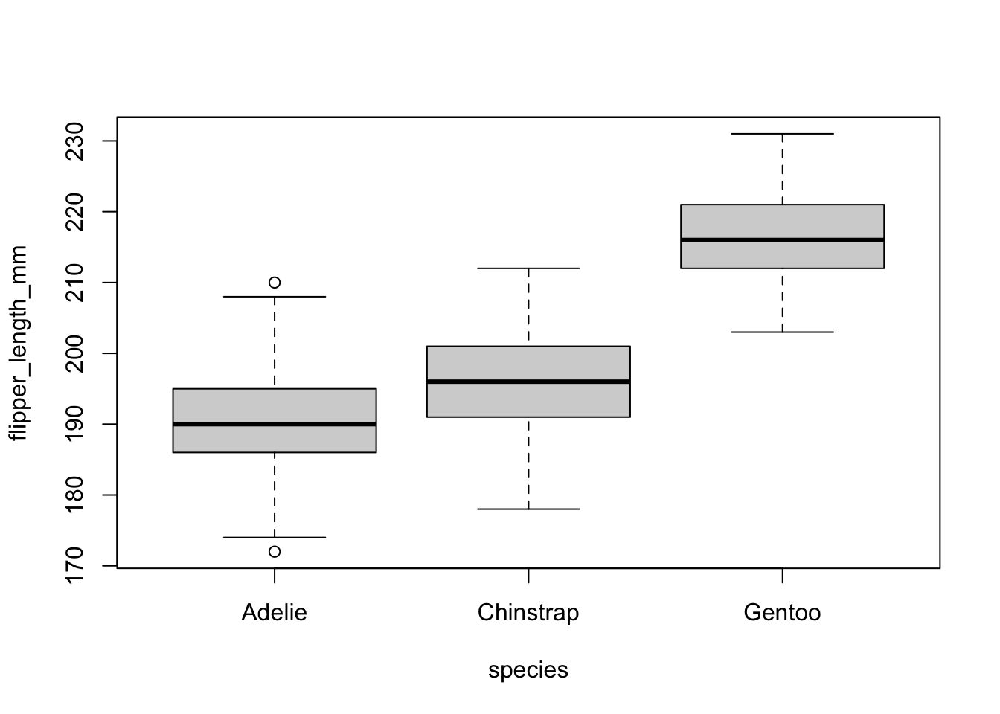

# 💻 ANOVA {#anova}

**ANOVA** (ANalysis Of VAriance) is a statistical test to determine whether two or more population means are different. In other words, it is used to compare two or more groups to see if they are significantly different.

In practice, however, the:

- Student t-test is used to compare 2 groups;
- ANOVA generalizes the t-test beyond 2 groups, so it is used to compare 3 or more groups.

Although ANOVA is used to make inference about means of different groups, the method is called “analysis of variance.” It is called like this because it compares the “between” variance (the variance between the different groups) and the variance “within” (the variance within each group). If the between variance is significantly larger than the within variance, the group means are declared to be different. Otherwise, we cannot conclude one way or the other. The two variances are compared to each other by taking the ratio:

$\frac{var(between)}{var(within)}$


Below are the assumptions of the ANOVA, how to test them and which other tests exist if an assumption is not met:

- **variable type**: ANOVA requires a mix of one continuous quantitative dependent variable (which corresponds to the measurements to which the question relates) and one qualitative independent variable (with at least 2 levels which will determine the groups to compare).
- **Independence**: the data, collected from a representative and randomly selected portion of the total population, should be independent between groups and within each group.
- **Normality**
- **Equality of variances**: the variances of the different groups should be equal in the populations (an assumption called homogeneity of the variances, or even sometimes referred as homoscedasticity, as opposed to heteroscedasticity if variances are different across groups)
- **Outliers**: there should not be significant outliers in different groups.


There are a bunch of cases you should be dealing with, here they are:

-  Check that your observations are independent.
  - Sample sizes:
    - In case of small samples, test the normality of residuals:
      - If normality is assumed, test the homogeneity of the variances:
        - If variances are equal, use ANOVA.
        - If variances are not equal, use the Welch ANOVA.
      - If normality is not assumed, use the Kruskal-Wallis test.
  - In case of large samples normality is assumed, so test the homogeneity of the variances:
    - If variances are equal, use ANOVA.
    - If variances are not equal, use the Welch ANOVA.


## `aov()` function

Data for this exercise is the penguins dataset (an alternative to the well-known iris dataset), accessible via the `{palmerpenguins}` package:


```r
# install.packages("palmerpenguins")
library(palmerpenguins)


pinguini = penguins[,c("species", "flipper_length_mm")]
```

The dataset contains data for 344 penguins of 3 different species (Adelie, Chinstrap and Gentoo). The dataset contains 8 variables, but we focus only on the flipper length i.e. `flipper_length_mm` and the species i.e. `species`, so we keep only those 2 variables.

We may want to give a quick check to the groups for a visual inspection:


```r
 boxplot(flipper_length_mm ~ species,
  data = pinguini
)
```




then `aov()`. the fuction take **2** arguments: 

- `formula`: left side the numeric variable, right side groups i.e. `var ~ groups` (much like linear regression) 
- `data`: your data

Please refer to \ref(tips) to undestand why data needs to come to longer format to be able to use that.


```r
anova_pinguini =aov(flipper_length_mm ~ species,
  data = pinguini
)

anova_pinguini
#> Call:
#>    aov(formula = flipper_length_mm ~ species, data = pinguini)
#> 
#> Terms:
#>                  species Residuals
#> Sum of Squares  52473.28  14953.26
#> Deg. of Freedom        2       339
#> 
#> Residual standard error: 6.641529
#> Estimated effects may be unbalanced
#> 2 observations deleted due to missingness
```


## exercises


::: {.exercise #anova1}
Let's assume to have a sample with this data and respective belonging group:

    x<-c(12,23,12,13,14,21,23,24,30,21,12,13,14,15,16)
    
    z<-c(1,1,1,1,1,2,2,2,2,2,3,3,3,3,3)

perform anova test with `aov()` function testing if there is significant differences between group **1**, **2** and **3**.

:::

You specify the formula, where `x` is the continous variable and `y` is the group variable.
This is how you solve it.

----

::: {.exercise #anova2}
Let's consider the `diet` dataset in [this link here](https://www.kaggle.com/code/evitaginiyatullina/one-way-anova-comparison/data) The data set contains information on 76 people who undertook one of three diets (referred to as diet A, B and C). There is background information such as age, gender, and height. The aim of the study was to see which diet was best for losing weight. 

to read data first dowload it from the link, then move data inside your R project. then run these commands:

    diet = read.csv("< the dataset name>.csv")

We will be using variable `Diet`, `pre.weight` and  `weight6weeks`

1. read data from kaggle
1. compute mean weights for each group
1. calculate anova on Diet against the weight cut

:::


----

::: {.exercise #anova3}

We recruit 90 people to participate in an experiment in which we randomly assign 30 people to follow either program A, program B, or program C for one month.

    #make this example reproducible
    set.seed(0)
    
    #create data frame
    data <- data.frame(program = rep(c("A", "B", "C"), each = 30),
                       weight_loss = c(runif(30, 0, 3),
                                       runif(30, 0, 5),
                                       runif(30, 1, 7)))
                                       


1. plot boxplot of weight_loss ~ program Hint: use `boxplot()` function specifying the formula.
1. fit 1 way anova to test difference in weight loss for each program.
                                       
:::

-----

::: {.exercise #anova4}
Consider the maximum size of 4 fish each from 3 populations (n=12). We want to use a model that will help us examine the question of whether the mean maximum fish size differs among populations.


    size <- c(3,4,5,6,4,5,6,7,7,8,9,10)
    pop <- c("A","A","A","A","B","B","B","B","C","C","C","C")
    
  
1. visualize it through boxplot
1. Using  ANOVA model test whether any group means differ from another. 

:::


-----

::: {.exercise #anova5}

Let's consider 6 different insect sprays in `InsectSprays` contained in R. Let's assume  we are interested in testing if there was a difference in the number of insects found in the field after each spraying, use varibales `count` and `spray`.

:::


## solutions


::: {.answer data-latex=""}
**Answer to Exercise \@ref(exr:anova1)**:

    x <- c(12,23,12,13,14,21,23,24,30,21,12,13,14,15,16) 
    z <- c(1,1,1,1,1,2,2,2,2,2,3,3,3,3,3)
    anova <- aov( x ~ z ) 
    summary(anova)

            Df Sum Sq Mean Sq F value Pr(>F)
    z            1    1.6    1.60   0.047  **0.832**
    Residuals   13  446.1   34.32

The ANOVA (formula: x ~ z) suggests that the main effect of z is statistically not significant and very small
(F(1, 13) = 0.05, p = 0.832; Eta2 = 3.57e-03, 95% CI [0.00, 1.00]). That means that group means are not that different
one from the other

:::


::: {.answer data-latex=""}
**Answer to Exercise \@ref(exr:anova2)**:

At first you have to download data from https://www.kaggle.com/code/evitaginiyatullina/one-way-anova-comparison/data, then read data with:

    diet <- read.csv("<your_dataset_name>.csv")
    
then you have to compute mean weights for each group


    # Compute mean weights for each group
    mean_weights <- tapply(diet$weight6weeks, diet$Diet, mean)
    
    # Calculate one-way ANOVA on Diet against weight cut
    anova_result <- aov(weight6weeks ~ Diet, data = diet)
    
    # Summary of ANOVA
    summary(anova_result)


:::


::: {.answer data-latex=""}
**Answer to Exercise \@ref(exr:anova3)**:

Plot a boxplot of weight_loss by program

    boxplot(weight_loss ~ program, data = data, xlab = "Program", ylab = "Weight Loss", main = "Weight Loss by Program")

    
Perform one-way ANOVA to test differences in weight loss by program


    anova_result <- aov(weight_loss ~ program, data = data)
    summary(anova_result)
    
The boxplot will provide a visual representation of the weight loss distribution by program, and the ANOVA will test if there are statistically significant differences in weight loss among the programs.
    
:::


::: {.answer data-latex=""}
**Answer to Exercise \@ref(exr:anova4)**:

at first you need a dataframe right?

    # Create a data frame
    data <- data.frame(size, pop)

Visualize the data through a boxplot

    boxplot(size ~ pop, data = data, xlab = "Population", ylab = "Maximum Fish Size", main = "Boxplot of Maximum Fish Size by Population")

Perform one-way ANOVA to test for differences among group means
 
    anova_result <- aov(size ~ pop, data = data)

Summary of ANOVA

    summary(anova_result)

:::

::: {.answer data-latex=""}
**Answer to Exercise \@ref(exr:anova5)**:

First, load the dataset if it's not already loaded:

    data(InsectSprays)
    
Visualize the data through a boxplot to get an initial understanding of the distribution of counts for each type of insect spray:

    
    boxplot(count ~ spray, data = InsectSprays, xlab = "Insect Spray", ylab = "Number of Insects",
            main = "Number of Insects by Insect Spray")


Perform a one-way ANOVA to test for differences in the number of insects found among the different insect sprays:
    
    anova_result <- aov(count ~ spray, data = InsectSprays)
    
    # Summary of ANOVA
    summary(anova_result)

The boxplot will provide a visual representation of the distribution of counts by insect spray, and the ANOVA analysis will help you determine if there are statistically significant differences in the means of insect counts among the different sprays.

:::


