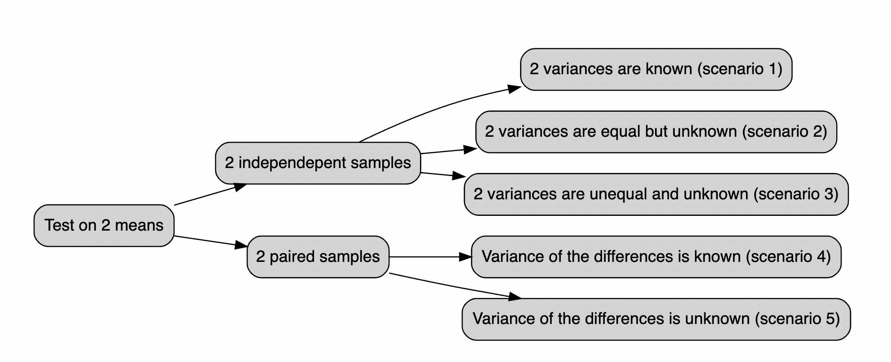

# (PART\*) Additional Resources {.unnumbered}

# 💻 Intermediate preparation {#int-prep}

Intermediate test topics should include:
 - **hypothesis tests on means**
 - **anova**
 - **simple + multiple regression (adj-R2 + collinearity + dummy vars)**
 - **logistic regression**

Below you find a review of core concepts and a bunch of exercises which in some way may resemble intermediate ones.

## 🪨 core concepts of T test 

recall from [Arbia's slide](https://drive.google.com/file/d/1UqDW1UG5CY3wbW2SisCqzoPtK7ZpvQs7/view?usp=sharing) 69 that we are focusing on test on **mean** and that steps for calculating statistical tests generally are:
 
1. Develop the null Hypothesis
2. Specify the level of Significance $\alpha$
3. Collect the sample data and compute the test statistic.

then _pvalues_:
4. Use the value of the test statistic to compute the p-value
5. Reject $H_0$ if p-value $ < \alpha$ 

Notice that Z-test are not really used since we almost always do not know the variance $\sigma^2$  of the distribution. So instead of Standard Normal distribution we use Student's **T distribution**, doing t-tests. That's the t test stat:

$$
t = \frac{(m - \mu_0)}{S/\sqrt{n}}
$$

Below all the possible cases you should be dealing with:

<div class="figure">

<p class="caption">(\#fig:ttest)The t.test vademecum</p>
</div>


## `t.test()` function


The `t.test()` function may run one and two sample t-tests on data vectors. The function has several parameters and is invoked as follows:


```r
t.test(x, y = NULL, alternative = c("two.sided", "less", "greater"), mu = 0, 
        paired = FALSE, var.equal = FALSE, conf.level = 0.95)
```

In this case, `x` is a numeric vector of data values, and `y` is optional. If `y` is not included, the function does a one-sample t-test on the data in `x`; if it is included, the function runs a two-sample t-test on both `x` and `y`.

The `mu` (i.e. $\mu$) argument returns a number showing the real value of the mean (or difference in means if a two sample test is used) under the null hypothesis. The test conducts a two-sided t-test by default; however, you may perform an alternative hypothesis by changing the `alternative` argument to `"greater"` or `"less"`, depending on whether the alternative hypothesis is that the mean is larger than or smaller than `mu`. Consider the following:


```r
t.test(x, alternative = "less", mu = 25)
```


…performs a one-sample t-test on the data contained in `x` where the null hypothesis is that $ \mu  =  25$ and the alternative is that $  \mu < 25 $

The `paired` argument will indicate whether or not you want a paired t-test. The default is set to `FALSE` but can be set to `TRUE` if you desire to perform a paired t-test. We do paired test when we are considering pre-post treatment test or when we are considering couples of individuals.

When doing a two-sample t-test, the `var.equal` option specifies whether or not to assume equal variances. The default assumption is unequal variance and the Welsh approximation to degrees of freedom; however, you may change this to `TRUE` to pool the variance.

Finally, the `conf.level` parameter specifies the degree of confidence in the reported confidence interval for $\mu$ in the one-sample and for $\mu_1 - \mu_2$ two-sample cases. Below a very simple example:


To use the `lm()` function in R for linear modeling, you can create a Markdown document to explain its usage and its various arguments. Below is an example of how to create a conceptual guide in RMarkdown format:

## Linear Modeling with lm() in R

## Introduction

The `lm()` function in R is used for performing linear regression modeling. Linear regression is a statistical method that models the relationship between a dependent variable and one or more independent variables. In this document, we will explore how to use the `lm()` function and its various arguments for linear modeling.

## Basic Usage

To perform linear modeling with `lm()`, you need to specify the formula of the linear regression model. The basic syntax is as follows:


```r
model <- lm(dependent_variable ~ independent_variable, data = your_data)
```

- `dependent_variable`: The variable you want to predict.
- `independent_variable`: The variable(s) used to make the prediction.
- `data`: The data frame containing your variables.

## Arguments

### Formula

The formula is at the core of the `lm()` function and specifies the relationship between the dependent and independent variables. It follows the `Y ~ X` pattern, where `Y` is the dependent variable, and `X` is the independent variable. You can include multiple independent variables and interactions by using `+` and `*`. For example:


```r
model <- lm(y ~ x1 + x2 + x1*x2, data = your_data)
```

### Data

The `data` argument should point to the data frame where your variables are located. This argument helps R locate the variables specified in the formula.

### Subset

You can use the `subset` argument to specify a subset of your data for modeling. This is useful when you want to focus on a specific portion of your dataset.


```r
model <- lm(y ~ x, data = your_data, subset = condition)
```

### Weight

The `weight` argument allows you to assign different weights to each data point. This can be useful when you want to give more importance to certain observations.


```r
model <- lm(y ~ x, data = your_data, weights = weight_variable)
```

### Na.action

The `na.action` argument controls how missing values are treated. By default, `na.action = na.fail`, which means the model will fail if there are missing values in your data. You can also use `na.omit` to automatically remove rows with missing values.


```r
model <- lm(y ~ x, data = your_data, na.action = na.omit)
```

### Other Arguments

There are additional arguments for controlling aspects of the modeling process, such as `offset`, `method`, and `control`. You can refer to the R documentation for a complete list of available arguments and their descriptions.

## VIF (Variance Inflation Factor)

The Variance Inflation Factor (VIF) is a measure used to detect multicollinearity in a linear regression model. Multicollinearity occurs when independent variables in the model are highly correlated, making it challenging to determine the individual effect of each variable on the dependent variable. The `VIF` function from the `regclass` package in R can help us identify multicollinearity in our linear regression model.

### Calculating VIF

To calculate the VIF for the independent variables in your model, you can use the `VIF()` function. First, make sure you have the `regclass` package installed and loaded:


```r
install.packages("regclass")
library(regclass)
```

Next, you can calculate VIF for your linear regression model as follows:


```r
# Fit a linear regression model
model <- lm(formula  = y ~ x1 + x2 + x3, data = your_data)

# Calculate VIF
vif_results <- VIF(model)
```

The `VIF()` function takes the linear regression model as its argument and returns a data frame with VIF values for each independent variable. Higher VIF values indicate stronger multicollinearity, typically with a threshold of 5 or 10 as a rule of thumb.

### Interpreting VIF

- If VIF is close to 1, it suggests that the variable is not highly correlated with other independent variables, indicating no significant multicollinearity.

- If VIF is greater than 1 but less than a chosen threshold (e.g., 5 or 10), it suggests some correlation but not necessarily problematic multicollinearity.

- If VIF is significantly greater than the chosen threshold (e.g., 10), it indicates a high degree of multicollinearity, and you may need to consider removing or combining variables to address this issue.

### Addressing Multicollinearity

If you detect problematic multicollinearity with high VIF values, you can take several steps to address the issue:

1. **Remove one of the correlated variables:** If two or more variables are highly correlated, removing one of them can often resolve the multicollinearity issue.

2. **Combine correlated variables:** You can create new variables that are combinations of highly correlated variables, reducing multicollinearity.

3. **Collect more data:** Sometimes, multicollinearity can be alleviated by collecting more data, especially if the sample size is small.

4. **Regularization techniques:** Consider using regularization techniques like Ridge or Lasso regression, which can handle multicollinearity by adding penalties to the coefficients of correlated variables.

VIF analysis is a crucial step in assessing the quality of your linear regression model and ensuring the independence of your independent variables.


## ANOVA (Analysis of Variance)

ANOVA, or Analysis of Variance, is a statistical technique used to analyze the differences among group means in a dataset. It is particularly useful when you want to compare the means of more than two groups. The `aov()` function in R is commonly used to perform ANOVA.

### Performing ANOVA with `aov()`

To perform ANOVA using the `aov()` function, you need to specify a formula that describes the relationship between the dependent variable and the grouping factor (categorical variable). The basic syntax is as follows:


```r
anova_model <- aov(dependent_variable ~ grouping_factor, data = your_data)
```

- `dependent_variable`: The continuous variable you want to analyze.
- `grouping_factor`: The categorical variable that defines the groups.
- `data`: The data frame containing your variables.

### ANOVA Tables

Once you've created the ANOVA model, you can obtain an ANOVA table using the `summary()` function applied to the `aov` object:


```r
summary(anova_model)
```

This table provides various statistics, including the sum of squares, degrees of freedom, F-statistic, and p-value, which allow you to assess the significance of differences among group means.

### Interpreting ANOVA

- The F-statistic in the ANOVA table tests whether there are significant differences among the group means. A small p-value (< 0.05) suggests that there are significant differences.

- If the ANOVA is not statistically significant, it indicates that there are no significant differences among the group means.

### Assumptions of ANOVA

ANOVA assumes that the variances of the groups are equal (homogeneity of variances) and that the data are normally distributed. Violations of these assumptions may lead to inaccurate results. You can check the homogeneity of variances using tests like Levene's test or Bartlett's test and assess the normality of data using normal probability plots or statistical tests like the Shapiro-Wilk test.


## Logistic Regression with `glm()`

Logistic regression is a statistical technique used for modeling the relationship between a binary dependent variable (0/1, Yes/No, True/False) and one or more independent variables. The `glm()` function in R is commonly used to perform logistic regression.

### Performing Logistic Regression with `glm()`

To perform logistic regression using the `glm()` function, you need to specify a formula that describes the relationship between the binary dependent variable and the independent variables. The basic syntax is as follows:


```r
logistic_model <- glm(formula = dependent_variable ~ independent_variable1 + independent_variable2, family = "binomial", data = your_data)
```

- `dependent_variable`: The binary dependent variable you want to model.
- `independent_variable1`, `independent_variable2`, etc.: The independent variables that influence the probability of the binary outcome.
- `family`: Specify the family argument as `binomial` to indicate logistic regression.
- `data`: The data frame containing your variables.

### Model Summary

After creating the logistic regression model, you can obtain a summary of the model's coefficients, standard errors, z-values, and p-values using the `summary()` function applied to the `glm` object:


```r
summary(logistic_model)
```

This summary provides valuable information about the influence of the independent variables on the log-odds of the binary outcome.

### Interpreting Logistic Regression

- The coefficients in the summary indicate the direction and strength of the relationship between the independent variables and the log-odds of the binary outcome.

- Positive coefficients suggest an increase in the log-odds, while negative coefficients suggest a decrease.

- The odds ratio (exp(coef)) can be used to interpret the change in the odds of the binary outcome for a one-unit change in the independent variable.

- A significant p-value (< 0.05) for a coefficient suggests that the independent variable has a significant effect on the binary outcome.

- The null hypothesis in logistic regression is that there is no relationship between the independent variable and the binary outcome.

### Model Evaluation

To evaluate the performance of your logistic regression model, you can assess its accuracy, sensitivity, specificity, and other metrics using techniques like cross-validation and ROC analysis. You can also plot the ROC curve and calculate the AUC (Area Under the Curve) to assess the model's predictive power.

### Assumptions of Logistic Regression

Logistic regression assumes that the log-odds of the binary outcome are a linear combination of the independent variables. It is important to check for violations of this assumption, which can be done through residual analysis.

## Poisson Regression with `glm()`

Poisson regression is a statistical technique used to model the relationship between a count-dependent variable (typically non-negative integers) and one or more independent variables. The `glm()` function in R is commonly used to perform Poisson regression.

### Performing Poisson Regression with `glm()`

To perform Poisson regression using the `glm()` function, you need to specify a formula that describes the relationship between the count-dependent variable and the independent variables. The basic syntax is as follows:


```r
poisson_model <- glm(formula = count_dependent_variable ~ independent_variable1 + independent_variable2, family = "poisson", data = your_data)
```

- `count_dependent_variable`: The count-dependent variable you want to model.
- `independent_variable1`, `independent_variable2`, etc.: The independent variables that influence the count-dependent variable.
- `family`: Specify the family argument as `poisson` to indicate Poisson regression.
- `data`: The data frame containing your variables.

### Model Summary

After creating the Poisson regression model, you can obtain a summary of the model's coefficients, standard errors, z-values, and p-values using the `summary()` function applied to the `glm` object:


```r
summary(poisson_model)
```

This summary provides information about the influence of the independent variables on the expected count of the dependent variable.

### Interpreting Poisson Regression

- The coefficients in the summary indicate the direction and strength of the relationship between the independent variables and the expected count of the dependent variable.

- Positive coefficients suggest an increase in the expected count, while negative coefficients suggest a decrease.

- The exponential of the coefficients (exp(coef)) can be used to interpret the multiplicative effect of a one-unit change in the independent variable on the expected count.

- A significant p-value (< 0.05) for a coefficient suggests that the independent variable has a significant effect on the expected count.

- The null hypothesis in Poisson regression is that there is no relationship between the independent variable and the expected count.


## class exercises, do it in groups 👯

first guided,

::: {.exercise #ttest1}
A state Highway Patrol periodically samples vehicle at various location on a 
particular roadway. The sample of vehicle speed is used to test the hypothesis H0 
for which the mean is less than equal to **65**

The locations where $H_0$ is rejected are deemed the best locations for radar traps.
At location F, a sample of **64** vehicles shows a mean speed of **66.2 mph** with a std 
dev of **4.2 mph**. Use a $\alpha  = 0.05$ to test the hypothesis.

:::


---

::: {.exercise #ttest6}
Let's assume to have dataset `midwest` in `ggplot2` package: this contains demographic information of midwest counties from 2000 US census.
Besides all the other variables we are interested in `percollege` which describes the Percent college educated in midwest. 

1. test if the midwest average is less than the national average (i.e. ***35%**) with a p-value < .02.

:::

----

::: {.exercise #ttest2}
Download the datafile ‘prawnGR.CSV’ from the [Data link](https://alexd106.github.io/intro2R/data.html) and save it to the data directory (Remember R projects and working directory). Import these data into R and assign to a variable with an appropriate name. These data were collected from an experiment to investigate the difference in growth rate of the **giant tiger prawn** (Penaeus monodon) fed either an artificial or natural diet. 

1. Have a quick look at the structure of this dataset.
1. plot the growth rate versus the diet using an appropriate plot.
1. How many observations are there in each diet treatment?
1. You want to compare the difference in growth rate between the two diets using a two sample t-test. 
1. Conduct a two sample t-test using the t.test() using the argument `var.equal = TRUE` to perform the t-test assuming equal variances. What is the null hypothesis you want to test? Do you reject or fail to reject the null hypothesis? What is the value of the t statistic, degrees of freedom and p value? How would you summarise these summary statistics in a report?

:::


----

::: {.exercise #ttest3}
A new coach has been hired at an athletics school, and the effectiveness of the new type of training will be evaluated by comparing the average times of 10 centimeters. The times in seconds before and after each athlete's competition are repeated.ù

    before_training: =  c(12.9, 13.5, 12.8, 15.6, 17.2, 19.2, 12.6, 15.3, 14.4, 11.3)
    after_training = c( 12.7, 13.6, 12.0, 15.2, 16.8, 20.0, 12.0, 15.9, 16.0, 11.1)

We are up against two groups of trained competitors, as measurements were taken on the same athletes before and after the competition. To determine if there has been an improvement, a deterioration, or if the time averages have remained essentially constant (i.e., H0). Conduct a test t of student for paired changes if the difference significant to a 95% confidence level?

:::

----

::: {.exercise #ttest4}
Following exercise 4 Assume that the club management, based on the statistics, fires this coach who has not improved and hires another more promising coach. Following the second training session, we record the athletes' times:

    before training: 12.9, 13.5, 12.8, 15.6, 17.2, 19.2, 12.6, 15.3, 14.4, 11.3
    after training: 12.0, 12.2, 11.2, 13.0, 15.0, 15.8, 12.2, 13.4, 12.9, 11.0

:::

----

::: {.exercise #ttest5}
Let's assume `genderweight` in `datarium` package, containing the weight of 40 individuals (20 women and 20 men).

1. which are the mean weights for male and females?
1. test is they are statistically significant with 95% confidence level

:::


::: {.exercise #anova1}
Let's assume to have a sample with this data and respective belonging group:

    x<-c(12,23,12,13,14,21,23,24,30,21,12,13,14,15,16)
    
    z<-c(1,1,1,1,1,2,2,2,2,2,3,3,3,3,3)

perform anova test with `aov()` function testing if there is significant differences between group **1**, **2** and **3**.

:::

You specify the formula, where `x` is the continous variable and `y` is the group variable.
This is how you solve it.

---

::: {.exercise #anova2}
Assume you have a dataset named `PlantGrowth` with variables `weight` (dependent variable) and `group` (categorical independent variable).

1. Perform an ANOVA analysis to compare the means of `weight` among different `group` levels.
2. Check the p-value and determine whether there are significant differences among the group means.

:::


----


::: {.exercise #anova3}

We recruit 90 people to participate in an experiment in which we randomly assign 30 people to follow either program A, program B, or program C for one month.

    #make this example reproducible
    set.seed(0)
    
    #create data frame
    data <- data.frame(program = rep(c("A", "B", "C"), each = 30),
                       weight_loss = c(runif(30, 0, 3),
                                       runif(30, 0, 5),
                                       runif(30, 1, 7)))
                                       


1. plot boxplot of weight_loss ~ program Hint: use `boxplot()` function specifying the formula.
1. fit 1 way anova to test difference in weight loss for each program.
                                       
:::

-----

::: {.exercise #anova4}
Consider the maximum size of 4 fish each from 3 populations (n=12). We want to use a model that will help us examine the question of whether the mean maximum fish size differs among populations.


    size <- c(3,4,5,6,4,5,6,7,7,8,9,10)
    pop <- c("A","A","A","A","B","B","B","B","C","C","C","C")
    
  
1. visualize it through boxplot
1. Using  ANOVA model test whether any group means differ from another. 

:::


-----

::: {.exercise #anova5}

Let's consider 6 different insect sprays in `InsectSprays` contained in R. Let's assume  we are interested in testing if there was a difference in the number of insects found in the field after each spraying, use varibales `count` and `spray`.

:::

----

::: {.exercise #anova6}
Let's consider the `diet` dataset in [this link here](https://www.kaggle.com/code/evitaginiyatullina/one-way-anova-comparison/data) The data set contains information on 76 people who undertook one of three diets (referred to as diet A, B and C). There is background information such as age, gender, and height. The aim of the study was to see which diet was best for losing weight. 

to read data first dowload it from the link, then move data inside your R project. then run these commands:

    diet = read.csv("< the dataset name>.csv")

We will be using variable `Diet`, `pre.weight` and  `weight6weeks`

1. read data from kaggle
1. compute mean weights for each group
1. calculate anova on Diet against the weight cut

:::


----


::: {.exercise #lr1}

Use the built-in `mtcars` dataset with variables mpg (miles per gallon) and vs (engine type: 0 = V-shaped, 1 = straight).

- Fit a logistic regression model to predict vs (engine type) based on mpg.
- Interpret the coefficients of the logistic regression model.


:::


----


::: {.exercise #pr1}

Use the built-in `mtcars` dataset with variables `mpg` (miles per gallon) and `gear` (number of forward gears).

- Fit a Poisson regression model to predict gear based on mpg.
- Interpret the coefficients of the Poisson regression model.

:::


----


## solutions


::: {.answer data-latex=""}
**Answer to Exercise \@ref(exr:ttest1)**:

Sample random data from a Normal distribution with a given mean and sd.
Then define **H0** and **H1**. In the end run hte test.

    x <- rnorm(n = 64, mean = 66.2, sd = 4.2)
    test<-t.test(x, mu = 65, alternative = "less")


    t = 1.469, df = 63, p-value = 0.9266
    alternative hypothesis: true mean is less than 65
    95 percent confidence interval:
     -Inf 66.80805
    sample estimates:
    mean of x 
    65.84629 

The One Sample t-test testing the difference between x (mean = 65.85)
and mu = 65 suggests that the effect is positive, statistically not
significant, and very small (difference = 0.85, 95% CI [-Inf, 66.81],
t(63) = 1.47, p = **0.927**
:::


::: {.answer data-latex=""}
**Answer to Exercise \@ref(exr:anova1)**:

    x <- c(12,23,12,13,14,21,23,24,30,21,12,13,14,15,16) 
    z <- c(1,1,1,1,1,2,2,2,2,2,3,3,3,3,3)
    anova <- aov( x ~ z ) 
    summary(anova)

            Df Sum Sq Mean Sq F value Pr(>F)
    z            1    1.6    1.60   0.047  **0.832**
    Residuals   13  446.1   34.32

The ANOVA (formula: x ~ z) suggests that the main effect of z is statistically not significant and very small
(F(1, 13) = 0.05, p = 0.832; Eta2 = 3.57e-03, 95% CI [0.00, 1.00]). That means that group means are not that different
one from the other

:::


::: {.answer data-latex=""}
**Answer to Exercise \@ref(exr:anova6)**:

Assuming you have the 'plant_growth' dataset

    # 1. Perform ANOVA
    anova_model <- aov(weight ~ group, data = plant_growth)
    
    # 2. Check p-value
    summary(anova_model)


:::


::: {.answer data-latex=""}
**Answer to Exercise \@ref(exr:lr1)**:

    data(mtcars)

Convert vs to a factor variable

    mtcars$vs <- as.factor(mtcars$vs)

Fit a logistic regression model
  
    logistic_model <- glm(vs ~ mpg, family = binomial, data = mtcars)

Interpret coefficients

    summary(logistic_model)

:::


::: {.answer data-latex=""}
**Answer to Exercise \@ref(exr:pr1)**:


    data(mtcars)

Fit a Poisson regression model

    poisson_model <- glm(gear ~ mpg, family = poisson, data = mtcars)

Interpret coefficients

    summary(poisson_model)

:::


## 🍬 tips and tricks{#tips}

Yout might be interested in standardizing/fornalize how you say things with a statistical jargon, `report` does that for you.
you simply pass the test, wether it is ANOVA or t.test object inside report `report()`. Do you rememer the function `summary()` we have been using for linear regression? This is exactly that, but for both ANOVA and t tests.


```r
# install.packages("remotes")
# remotes::install_github("easystats/report")
library(report)

x <- rnorm(n = 64, mean = 66.2, sd = 4.2)
test<-t.test(x, mu = 65, alternative = "less")
report(test)
#> Effect sizes were labelled following Cohen's (1988)
#> recommendations.
#> 
#> The One Sample t-test testing the difference between x
#> (mean = 66.07) and mu = 65 suggests that the effect is
#> positive, statistically not significant, and small
#> (difference = 1.07, 95% CI [-Inf, 66.93], t(63) = 2.07, p =
#> 0.978; Cohen's d = 0.26, 95% CI [-Inf, 0.47])
```


----

when you have data in `longer` fromat there a different in syntax when you specify t test and it pretty much follows the one for linear models i.e. `lm()`.
let's look at it.

we may have something like:


```r
library(tibble)
longer = tribble( 
  ~group, ~var,
  "a",   10,
  "b",   24, 
  "a",   31,
  "a",   75,
  "b",   26,
  "a",   8,
  "b",   98,
  "b",   62,
  )
wider = tribble( 
  ~group_a, ~group_b,
   10,       24,
   31,       26,
   75,       98,
   8,        62
  )

```

Those are exaclty the same dataset but arranged in a different format. We are used to the _wider_ format but iut might happen that we bump into the _longer_ one. What do we do? There'sa trick for that, let's say you want to test if the mean are statistically different with a 95% confidence level, the instead of supplying `x` and `y` to `t.test()` you would follow pretty much the syntax for linear models `lm()`:


```r

test_for_wider_format = t.test(var~group, data =  longer)
test_for_wider_format
#> 
#> 	Welch Two Sample t-test
#> 
#> data:  var by group
#> t = -0.91809, df = 5.9192, p-value = 0.3944
#> alternative hypothesis: true difference in means between group a and group b is not equal to 0
#> 95 percent confidence interval:
#>  -78.99271  35.99271
#> sample estimates:
#> mean in group a mean in group b 
#>            31.0            52.5
```
what we conclude? we conclude that:  Effect sizes were labelled following Cohen's (1988) recommendations.

The Welch Two Sample t-test testing the difference of var by group (mean in group a = 31.00, mean in group b = 52.50) suggests that the effect is negative, statistically not significant, and medium (difference = -21.50, 95% CI [-78.99, 35.99], t(5.92) = -0.92, p = 0.394; Cohen's d = -0.75, 95% CI [-2.39, 0.94])


## further exercies 🏋️

::: {.exercise #paired1}

We have the test scores of students before and after an intervention. How can we assess if the intervention had a statistically significant effect on the scores? Specify the type of test to use and the assumptions involved.

:::

::: {.exercise #mtcars1}

Using the dataset mtcars, write the R command to calculate the mean and standard deviation of the disp variable grouped by cyl.

:::

::: {.exercise #mean_diff1}

Explain how you would assess if the mean difference between two groups is statistically significant, without running any R code.

:::

::: {.exercise #boston1}

Use the Boston dataset in MASS to create a histogram for the variable crim. Report the R code you used.

:::

::: {.exercise #pvalue1}

Describe the meaning of the p-value in the context of hypothesis testing.

:::

::: {.exercise #temp_diff1}

Given a dataset with daily temperatures recorded for two cities over one year, write the R code to perform a hypothesis test to determine if there is a significant difference in mean temperature between the cities. Specify which test should be used.

:::

::: {.exercise #corr1}

Given X = c(10, 12, 15, 20) and Y = c(11, 14, 16, 18), calculate the Pearson correlation coefficient between X and Y using R.

:::

::: {.exercise #errors1}

Explain the concept of Type I and Type II errors in hypothesis testing.

:::

::: {.exercise #plantgrowth1}

Using the PlantGrowth dataset in R, calculate the mean of weight for each level of group and plot a boxplot of weight grouped by group.

:::

::: {.exercise #ttest1}

Run a one-sample t-test to test if the mean of hp in mtcars is different from 120. Write the R code.

:::

::: {.exercise #iris1}

Using the dataset iris, write the R code to test for a significant difference between the average Sepal.Length of setosa and versicolor species.

:::

::: {.exercise #poisson1}

Write an R function to simulate 500 observations from a Poisson distribution with a lambda of 3 and plot its histogram.

:::

::: {.exercise #multicollinearity1}

Describe how to check for multicollinearity in a multiple regression model in R.

:::

::: {.exercise #airquality1}

Using the airquality dataset, calculate the correlation matrix for Ozone, Solar.R, Wind, and Temp.

:::

::: {.exercise #paired2}

Perform a paired t-test using the before and after variables where before = c(5, 7, 8, 6, 10) and after = c(6, 8, 9, 7, 12). Report the p-value.

:::

::: {.exercise #lr1}

Using the dataset mtcars, perform a linear regression with mpg as the dependent variable and hp and wt as independent variables. Report the adjusted R-squared.

:::

::: {.exercise #density1}

Write the R code to create a density plot of the variable Sepal.Length for each species in the iris dataset.

:::

::: {.exercise #anova1}

Using iris, perform a one-way ANOVA to test if the mean Sepal.Length differs across the three species.

:::

::: {.exercise #ci1}

Define the term “confidence interval” in the context of statistical estimation.

:::

::: {.exercise #stepwise1}

Using the mtcars dataset, refit a multiple linear regression model with mpg as the dependent variable and hp, wt, and drat as independent variables. Use stepwise regression to iteratively remove insignificant predictors. Report the final model with the significant coefficients.

:::

::: {.exercise #anova2}

Using the dataset ToothGrowth, perform a one-way ANOVA with the function aov() to test if the mean tooth length differs across the supplement types and doses.

:::

::: {.exercise #anova3}

We recruit 90 people to participate in an experiment in which we randomly assign 30 people to follow either program A, program B, or program C for one month.

    #make this example reproducible
    set.seed(0)
    
    #create data frame
    data <- data.frame(program = rep(c("A", "B", "C"), each = 30),
                       weight_loss = c(runif(30, 0, 3),
                                       runif(30, 0, 5),
                                       runif(30, 1, 7)))

1. plot boxplot of weight_loss ~ program Hint: use `boxplot()` function specifying the formula.
1. fit 1 way anova to test difference in weight loss for each program.

:::

::: {.answer data-latex=""}
**Answer to Exercise \@ref(exr:paired1)**:

The appropriate test to use is the paired t-test. This test is used when we have two related samples, such as before and after measurements for the same individuals, and we want to determine if there is a statistically significant difference between the means. The assumptions include that the differences are normally distributed and the data is paired.

:::

::: {.answer data-latex=""}
**Answer to Exercise \@ref(exr:mtcars1)**:

The `dplyr` package is used to calculate the mean and standard deviation of the `disp` variable grouped by `cyl`:

    library(dplyr)
    mtcars %>% group_by(cyl) %>% summarise(mean_disp = mean(disp), sd_disp = sd(disp))

:::

::: {.answer data-latex=""}
**Answer to Exercise \@ref(exr:mean_diff1)**:

To assess if the mean difference between two groups is statistically significant, we can use a hypothesis test such as the independent t-test. This involves setting up null and alternative hypotheses, calculating the test statistic, and comparing it to a critical value or using the p-value to determine significance, typically using a significance level (e.g., 0.05).

:::

::: {.answer data-latex=""}
**Answer to Exercise \@ref(exr:boston1)**:

To create a histogram of the `crim` variable from the Boston dataset, use the following code:

    library(MASS)
    data(Boston)
    hist(Boston$crim, main = "Histogram of crim", xlab = "Crime rate per capita")

:::

::: {.answer data-latex=""}
**Answer to Exercise \@ref(exr:pvalue1)**:

The p-value is the probability of obtaining test results at least as extreme as the observed results, under the assumption that the null hypothesis is true. A smaller p-value indicates stronger evidence against the null hypothesis, and if the p-value is below a chosen significance level (e.g., 0.05), we reject the null hypothesis.

:::

::: {.answer data-latex=""}
**Answer to Exercise \@ref(exr:temp_diff1)**:

The appropriate test to use is the two-sample t-test, as we are comparing the means of two independent groups. The R code is as follows:

    t.test(temp_city1, temp_city2, var.equal = TRUE)

:::

::: {.answer data-latex=""}
**Answer to Exercise \@ref(exr:corr1)**:

To calculate the Pearson correlation coefficient between vectors `X` and `Y`:

    X <- c(10, 12, 15, 20)
    Y <- c(11, 14, 16, 18)
    cor(X, Y)

:::

::: {.answer data-latex=""}
**Answer to Exercise \@ref(exr:errors1)**:

A Type I error occurs when we reject a true null hypothesis (false positive), while a Type II error occurs when we fail to reject a false null hypothesis (false negative).

:::

::: {.answer data-latex=""}
**Answer to Exercise \@ref(exr:plantgrowth1)**:

To calculate the mean of `weight` for each level of `group` and plot a boxplot of `weight` grouped by `group`:

    data(PlantGrowth)
    aggregate(weight ~ group, data = PlantGrowth, mean)
    boxplot(weight ~ group, data = PlantGrowth, main = "Boxplot of Weight by Group")

:::

::: {.answer data-latex=""}
**Answer to Exercise \@ref(exr:ttest1)**:

To run a one-sample t-test to test if the mean of `hp` in `mtcars` is different from 120:

    t.test(mtcars$hp, mu = 120)

:::

::: {.answer data-latex=""}
**Answer to Exercise \@ref(exr:iris1)**:

To test for a significant difference between the average `Sepal.Length` of setosa and versicolor species:

    t.test(Sepal.Length ~ Species, data = subset(iris, Species %in% c("setosa", "versicolor")))

:::

::: {.answer data-latex=""}
**Answer to Exercise \@ref(exr:poisson1)**:

To simulate 500 observations from a Poisson distribution with a lambda of 3 and plot its histogram:

    set.seed(0)
    poisson_data <- rpois(500, lambda = 3)
    hist(poisson_data, main = "Histogram of Poisson Distribution", xlab = "Values")

:::

::: {.answer data-latex=""}
**Answer to Exercise \@ref(exr:multicollinearity1)**:

To check for multicollinearity, we can use the Variance Inflation Factor (VIF). A VIF value greater than 10 indicates high multicollinearity:

    library(car)
    vif(model)

:::

::: {.answer data-latex=""}
**Answer to Exercise \@ref(exr:airquality1)**:

To calculate the correlation matrix for `Ozone`, `Solar.R`, `Wind`, and `Temp` in the `airquality` dataset:

    airquality_subset <- airquality[, c("Ozone", "Solar.R", "Wind", "Temp")]
    cor(airquality_subset, use = "complete.obs")

:::

::: {.answer data-latex=""}
**Answer to Exercise \@ref(exr:paired2)**:

To perform a paired t-test using the `before` and `after` variables:

    before <- c(5, 7, 8, 6, 10)
    after <- c(6, 8, 9, 7, 12)
    t.test(before, after, paired = TRUE)

:::

::: {.answer data-latex=""}
**Answer to Exercise \@ref(exr:lr1)**:

To perform a linear regression with `mpg` as the dependent variable and `hp` and `wt` as independent variables, and report the adjusted R-squared:

    model <- lm(mpg ~ hp + wt, data = mtcars)
    summary(model)$adj.r.squared

:::

::: {.answer data-latex=""}
**Answer to Exercise \@ref(exr:density1)**:

To create a density plot of the variable `Sepal.Length` for each species in the `iris` dataset:

    library(ggplot2)
    ggplot(iris, aes(x = Sepal.Length, fill = Species)) +
      geom_density(alpha = 0.5) +
      labs(title = "Density Plot of Sepal.Length by Species")

:::

::: {.answer data-latex=""}
**Answer to Exercise \@ref(exr:anova1)**:

To perform a one-way ANOVA to test if the mean `Sepal.Length` differs across the three species:

    aov_model <- aov(Sepal.Length ~ Species, data = iris)
    summary(aov_model)

:::

::: {.answer data-latex=""}
**Answer to Exercise \@ref(exr:ci1)**:

A confidence interval is a range of values, derived from sample statistics, that is likely to contain the population parameter with a specified level of confidence (e.g., 95%). It provides an estimated range that is expected to include the true parameter value.

:::

::: {.answer data-latex=""}
**Answer to Exercise \@ref(exr:stepwise1)**:

To refit a multiple linear regression model with `mpg` as the dependent variable and `hp`, `wt`, and `drat` as independent variables, using stepwise regression:

    library(MASS)
    initial_model <- lm(mpg ~ hp + wt + drat, data = mtcars)
    stepwise_model <- stepAIC(initial_model, direction = "both")
    summary(stepwise_model)

:::

::: {.answer data-latex=""}
**Answer to Exercise \@ref(exr:anova2)**:

To perform a one-way ANOVA using the `ToothGrowth` dataset to test if the mean tooth length differs across the supplement types and doses:

    data(ToothGrowth)
    aov_model <- aov(len ~ supp * dose, data = ToothGrowth)
    summary(aov_model)

:::

::: {.answer data-latex=""}
**Answer to Exercise \@ref(exr:anova3)**:

To plot a boxplot of `weight_loss` by `program` and fit a one-way ANOVA to test the difference in weight loss for each program:

    # Plot boxplot
    boxplot(weight_loss ~ program, data = data, main = "Boxplot of Weight Loss by Program", xlab = "Program", ylab = "Weight Loss")
    
    # Fit one-way ANOVA
    aov_model <- aov(weight_loss ~ program, data = data)
    summary(aov_model)

:::


