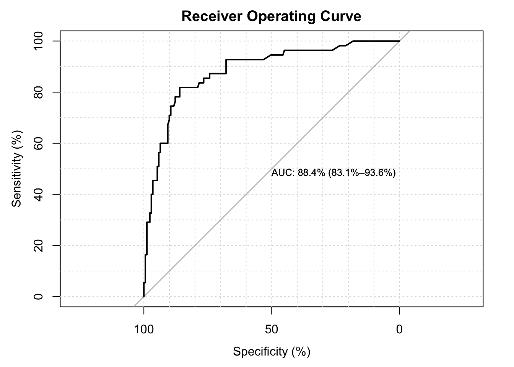

# 💻 Binary Logistic Regression {#log-reg}

## Objectives

At the end of the chapter, the readers will be  

- to understand the concept of simple and multiple binary logistic regression \@ref(log-reg)
- to perform simple binary logistic regression \@ref(log-reg)
- to perform multiple binary logistic regression \@ref(log-reg)
- to perform model assessment of binary logistic regression
- to present and interpret results from binary logsitic regression

## Background 

The logistic model\index{Logistic model} (or logit model\index{Logit model}) is used to model the probability of a certain class or event existing such as pass or fail, win or lose, alive or dead or healthy or sick. More specifically, binary logistic regression is used to model the relationship between a covariate or a set of covariates and an outcome variables which is a binary variable\index{Binary variable}.

A binary variable\index{Binary variable} is a categorical outcome has two categories or levels. In medical and health research, binary outcome variable is very common. Some example where the outcome is binary include:

- survival status when the status of cancer patients at the end of treatment are coded as either alive or dead
- relapse status when the status of a patient is coded as either relapse or not relapse
- satisfaction level when patients who come to clinics are asked if they are satisfied or not satisfied with the service 
- glucose control when patients were categorized as either good control or poor control based on Hba1c 

In a binary logistic regression model, the dependent variable has two levels (categorical). When the outcome variable has more than two levels or categories, the analysis are modeled by multinomial logistic regression and, if the multiple categories are ordered, by ordinal logistic regression\index{Ordinal logistic regression} (for example the proportional odds ordinal logistic model). 


## Further readings

There are a number of good references to help readers understand binary logistic regression better. The references that we list below also contains workflow that will be useful for readers when modelling logistic regression\index{Logistic regression}. 

We highly recommend readers to read 

- the Applied Logistic Regression book [@hosmer2013applied]
- the Logistic Regression\index{Logistic regression}: Self Learning Text [@kleinbaum2010logistic]
- the workflow from A Handbook of Statistical Analyses Using R [@R-HSAUR]

## Dataset

We will use a dataset named `stroke.dta` which in STATA\index{STATA} format. These data come from a study of hospitalized stroke patients. They original dataset contain 12 variables but our main variables of interest are:

- status : Status of patient during hospitalization (alive or dead)
- gcs : Glasgow Coma Scale on admission (range from 3 to 15)
- stroke_type : IS (Ischaemic Stroke) or HS (Haemorrhagic Stroke)
- sex : female or male
- dm : History of Diabetes (yes or no)
- sbp : Systolic Blood Pressure (mmHg)
- age : age of patient on admission

The outcome variable is variable status. It is labelled as either dead or alive which is the outcome of each patient during hospitalization.   

## logit and logistic models\index{Logistic model}

The simple binary logit and logistic models\index{Logistic model} refer to a a model with only one covariate (also known as independent variable). For example, if the covariate is gcs (Glasgow Coma Scale), the simple logit model\index{Logit model} is written as:

$$\hat{g}(x)= ln\left[ \frac{\hat\pi(x)}{1 - {\hat\pi(x)}} \right]$$

where $\hat{g}(x)$ is the log odds\index{Log odds} for death for a given value of gcs. And the odds for death for a given value of GCS is written as $= \hat\beta_0 + \hat\beta_1(gcs)$


And the simple logistic model\index{Logistic model} is also written as:

$$\hat{\pi}(x) = \frac{exp^{\hat{\beta}_{0} + \hat{\beta}_{1}{gcs}}}{1 + exp^{\hat{\beta}_{0} + \hat{\beta}_{1}{gcs}}}$$
The $\pi(x) = E(Y|x)$ represents the conditional mean of $Y$ given $x$ when the logistic distribution is used. This is also simply known as the predicted probability of death for given value of gcs. 

If we have decided (based on our clinical expertise and literature review) that a model that could explain death consists of gcs, stroke type, sex, dm, age and sbp, then the logit model\index{Logit model} can be expanded to:

$$\hat{g}(x)  = \hat\beta_0 + \hat\beta_1(gcs) + \hat\beta_2(stroke type) + \hat\beta_3(sex)+ \hat\beta_4(dm) + \hat\beta_5(sbp) +  \hat\beta_6(age)$$
This is the odds for death given certain value of gcs, sbp and age and certain categories of stroke stype, sex and diabetes. While the probability of deaths is 

$$\hat{\pi}(x) = \frac{exp^{\hat\beta_0 + \hat\beta_1(gcs) + \hat\beta_2(stroke type) + \hat\beta_3(sex)+ \hat\beta_4(dm) + \hat\beta_5(sbp) + \hat\beta_6(age)})}{1 + exp^{\hat\beta_0 + \hat\beta_1(gcs) + \hat\beta_2(stroke type) + \hat\beta_3(sex)+ \hat\beta_4(dm) + \hat\beta_5(sbp) + \hat\beta_6(age)}}$$

In many datasets, some of the independent variables are discrete, nominal scale variables such as race, sex, treatment group, and so forth. And because of that it is inappropriate to include them in the model as if they were interval scale variables. Though in many software, they are represented by numbers, but these numbers are used merely identifiers.

In this situation, we will use a method called design variables (or dummy variables\index{Dummy variable}). Suppose, for example, assuming that one of the independent variables is obesity type, which is now coded as “Class 1”, “Class 2” and “Class 3”. In this case, there are 3 levels or categories, hence two design variables ($D - 1$) are necessary, let's say D1 and D2. One possible coding strategy is that when the patient is in “Class 1” then the two design variables, for D1 and D2 would both be set equal to zero. In this example, "Class 1" is the reference category. When the patient is in “Class 2”, then D1 is set as 1 and D2 as 0; when the patient is in "Class 3", the we will set D1 as 0 and D2 and 1. All these coding assignment can be done automatically in the software. But to interpret, we must know which category is the reference.  


## Prepare environment for analysis

### Creating a RStudio project

Start a new analysis task by creating a new RStudio project. To do this,

1. Go to File
2. Click New Project
3. Choose New Directory or Existing Directory. 

This directory points to the folder that usually contains the dataset to be analyzed. This is called as the working directory. Make sure there is a folder named as `data` in the folder. If there is not, create one. Make sure the dataset `stroke.dta` is inside the `data` folder in the working directory.

### Loading libraries

Next, we will load the necessary packages. We will use 5 packages

1. the built in **stat**\index{stat} package - to run Generalized Linear Model. This is already loaded by default.
2. **haven**\index{haven} - to read SPSS\index{SPSS}, STATA\index{STATA} and SAS\index{SAS} dataset
3. **tidyverse**\index{tidyverse} - to perform data transformation 
4. **gtsummary**\index{gtsummary} - to provide nice results in a table  
4. **broom**\index{broom} - to tidy up the results 
5. **LogisticDx**\index{LogisticDX} - to do model assessment
6. **here**\index{here} - to ensure proper directory     

To load these packages, we will use the function `library()`:


```r
library(haven)
library(tidyverse)
#> ── Attaching packages ─────────────────── tidyverse 1.3.2 ──
#> ✔ ggplot2 3.4.3     ✔ purrr   1.0.2
#> ✔ tibble  3.2.1     ✔ stringr 1.5.0
#> ✔ tidyr   1.3.0     ✔ forcats 1.0.0
#> ✔ readr   2.1.2     
#> ── Conflicts ────────────────────── tidyverse_conflicts() ──
#> ✖ lubridate::as.difftime() masks base::as.difftime()
#> ✖ lubridate::date()        masks base::date()
#> ✖ dplyr::filter()          masks stats::filter()
#> ✖ kableExtra::group_rows() masks dplyr::group_rows()
#> ✖ lubridate::intersect()   masks base::intersect()
#> ✖ dplyr::lag()             masks stats::lag()
#> ✖ lubridate::setdiff()     masks base::setdiff()
#> ✖ lubridate::union()       masks base::union()
library(gtsummary)
#> #BlackLivesMatter
library(broom)
library(LogisticDx)
library(here)
#> here() starts at /Users/niccolo/Desktop/r_projects/sbd_24_25
```

## Read data

WE will read data in the working directory into our R environment. Remember the dataset is in the STATA\index{STATA} format.  


```r
fatal <- read_dta(here('data','stroke.dta'))
```


Take a peek at data. Check 

- variable names
- variable types 


```r
glimpse(fatal)
#> Rows: 226
#> Columns: 7
#> $ sex         <dbl+lbl> 1, 1, 1, 2, 1, 2, 2, 1, 2, 2, 1, 2…
#> $ status      <dbl+lbl> 1, 1, 1, 1, 1, 1, 2, 1, 1, 2, 1, 1…
#> $ gcs         <dbl> 13, 15, 15, 15, 15, 15, 13, 15, 15, 10…
#> $ sbp         <dbl> 143, 150, 152, 215, 162, 169, 178, 180…
#> $ dm          <dbl+lbl> 0, 0, 0, 1, 1, 1, 1, 0, 1, 1, 0, 1…
#> $ age         <dbl> 50, 58, 64, 50, 65, 78, 66, 72, 61, 64…
#> $ stroke_type <dbl+lbl> 0, 0, 0, 0, 0, 0, 0, 0, 0, 0, 0, 0…
```


## Explore data

Variables sex, status, dm and stroke type are labelled variable. This means eventhough they are coded as numbers but the numbers represent the groups or categories or levels of the variables. Basically, they are categorical variables.

We will transform all of them to factor variables\index{Factor variable}. We can quickly do this using the function `across()`. Below, we will transform all labelled variables to factor variables\index{Factor variable}:


```r
fatal <- 
  fatal %>%
  mutate(across(where(is.labelled), as_factor))
```

Now, we can look at the summary statistics


```r
fatal %>%
  tbl_summary() %>%
  as_hux_table()
```


```{=html}
<table class="huxtable" style="border-collapse: collapse; border: 0px; margin-bottom: 2em; margin-top: 2em; ; margin-left: auto; margin-right: auto;  " id="tab:unnamed-chunk-5">
<caption style="caption-side: top; text-align: center;">(#tab:unnamed-chunk-5) </caption><col><col><tr>
<th style="vertical-align: top; text-align: left; white-space: normal; border-style: solid solid solid solid; border-width: 0pt 0pt 0.4pt 0pt;    padding: 6pt 6pt 6pt 6pt; font-weight: normal;"><p><strong>Characteristic</strong></p>
</th><th style="vertical-align: top; text-align: center; white-space: normal; border-style: solid solid solid solid; border-width: 0pt 0pt 0.4pt 0pt;    padding: 6pt 6pt 6pt 6pt; font-weight: normal;"><p><strong>N = 226</strong></p>
</th></tr>
<tr>
<td style="vertical-align: top; text-align: left; white-space: normal; border-style: solid solid solid solid; border-width: 0.4pt 0pt 0pt 0pt;    padding: 6pt 6pt 6pt 6pt; font-weight: normal;">sex</td><td style="vertical-align: top; text-align: center; white-space: normal; border-style: solid solid solid solid; border-width: 0.4pt 0pt 0pt 0pt;    padding: 6pt 6pt 6pt 6pt; font-weight: normal;"></td></tr>
<tr>
<td style="vertical-align: top; text-align: left; white-space: normal; padding: 6pt 6pt 6pt 15pt; font-weight: normal;">male</td><td style="vertical-align: top; text-align: center; white-space: normal; padding: 6pt 6pt 6pt 6pt; font-weight: normal;">97 (43%)</td></tr>
<tr>
<td style="vertical-align: top; text-align: left; white-space: normal; padding: 6pt 6pt 6pt 15pt; font-weight: normal;">female</td><td style="vertical-align: top; text-align: center; white-space: normal; padding: 6pt 6pt 6pt 6pt; font-weight: normal;">129 (57%)</td></tr>
<tr>
<td style="vertical-align: top; text-align: left; white-space: normal; padding: 6pt 6pt 6pt 6pt; font-weight: normal;">alive or dead</td><td style="vertical-align: top; text-align: center; white-space: normal; padding: 6pt 6pt 6pt 6pt; font-weight: normal;"></td></tr>
<tr>
<td style="vertical-align: top; text-align: left; white-space: normal; padding: 6pt 6pt 6pt 15pt; font-weight: normal;">alive</td><td style="vertical-align: top; text-align: center; white-space: normal; padding: 6pt 6pt 6pt 6pt; font-weight: normal;">171 (76%)</td></tr>
<tr>
<td style="vertical-align: top; text-align: left; white-space: normal; padding: 6pt 6pt 6pt 15pt; font-weight: normal;">dead</td><td style="vertical-align: top; text-align: center; white-space: normal; padding: 6pt 6pt 6pt 6pt; font-weight: normal;">55 (24%)</td></tr>
<tr>
<td style="vertical-align: top; text-align: left; white-space: normal; padding: 6pt 6pt 6pt 6pt; font-weight: normal;">earliest Glasgow Coma Scale</td><td style="vertical-align: top; text-align: center; white-space: normal; padding: 6pt 6pt 6pt 6pt; font-weight: normal;">15.0 (10.0, 15.0)</td></tr>
<tr>
<td style="vertical-align: top; text-align: left; white-space: normal; padding: 6pt 6pt 6pt 6pt; font-weight: normal;">earliest systolic BP (mmHg)</td><td style="vertical-align: top; text-align: center; white-space: normal; padding: 6pt 6pt 6pt 6pt; font-weight: normal;">161 (143, 187)</td></tr>
<tr>
<td style="vertical-align: top; text-align: left; white-space: normal; padding: 6pt 6pt 6pt 6pt; font-weight: normal;">diabetes (yes or no)</td><td style="vertical-align: top; text-align: center; white-space: normal; padding: 6pt 6pt 6pt 6pt; font-weight: normal;">138 (61%)</td></tr>
<tr>
<td style="vertical-align: top; text-align: left; white-space: normal; padding: 6pt 6pt 6pt 6pt; font-weight: normal;">age in years</td><td style="vertical-align: top; text-align: center; white-space: normal; padding: 6pt 6pt 6pt 6pt; font-weight: normal;">61 (52, 69)</td></tr>
<tr>
<td style="vertical-align: top; text-align: left; white-space: normal; padding: 6pt 6pt 6pt 6pt; font-weight: normal;">Ischaemic Stroke or Haemorrhagic</td><td style="vertical-align: top; text-align: center; white-space: normal; padding: 6pt 6pt 6pt 6pt; font-weight: normal;"></td></tr>
<tr>
<td style="vertical-align: top; text-align: left; white-space: normal; padding: 6pt 6pt 6pt 15pt; font-weight: normal;">Ischaemic Stroke</td><td style="vertical-align: top; text-align: center; white-space: normal; padding: 6pt 6pt 6pt 6pt; font-weight: normal;">149 (66%)</td></tr>
<tr>
<td style="vertical-align: top; text-align: left; white-space: normal; border-style: solid solid solid solid; border-width: 0pt 0pt 0.8pt 0pt;    padding: 6pt 6pt 6pt 15pt; font-weight: normal;">Haemorrhagic</td><td style="vertical-align: top; text-align: center; white-space: normal; border-style: solid solid solid solid; border-width: 0pt 0pt 0.8pt 0pt;    padding: 6pt 6pt 6pt 6pt; font-weight: normal;">77 (34%)</td></tr>
<tr>
<td colspan="2" style="vertical-align: top; text-align: left; white-space: normal; border-style: solid solid solid solid; border-width: 0.8pt 0pt 0pt 0pt;    padding: 6pt 6pt 6pt 6pt; font-weight: normal;">n (%); Median (IQR)</td></tr>
</table>

```


or to get summary statistics for each status category:


```r
fatal %>%
  tbl_summary(by = status) %>%
  as_hux_table()
```


```{=html}
<table class="huxtable" style="border-collapse: collapse; border: 0px; margin-bottom: 2em; margin-top: 2em; ; margin-left: auto; margin-right: auto;  " id="tab:unnamed-chunk-6">
<caption style="caption-side: top; text-align: center;">(#tab:unnamed-chunk-6) </caption><col><col><col><tr>
<th style="vertical-align: top; text-align: left; white-space: normal; border-style: solid solid solid solid; border-width: 0pt 0pt 0.4pt 0pt;    padding: 6pt 6pt 6pt 6pt; font-weight: normal;"><p><strong>Characteristic</strong></p>
</th><th style="vertical-align: top; text-align: center; white-space: normal; border-style: solid solid solid solid; border-width: 0pt 0pt 0.4pt 0pt;    padding: 6pt 6pt 6pt 6pt; font-weight: normal;"><p><strong>alive</strong>, N = 171</p>
</th><th style="vertical-align: top; text-align: center; white-space: normal; border-style: solid solid solid solid; border-width: 0pt 0pt 0.4pt 0pt;    padding: 6pt 6pt 6pt 6pt; font-weight: normal;"><p><strong>dead</strong>, N = 55</p>
</th></tr>
<tr>
<td style="vertical-align: top; text-align: left; white-space: normal; border-style: solid solid solid solid; border-width: 0.4pt 0pt 0pt 0pt;    padding: 6pt 6pt 6pt 6pt; font-weight: normal;">sex</td><td style="vertical-align: top; text-align: center; white-space: normal; border-style: solid solid solid solid; border-width: 0.4pt 0pt 0pt 0pt;    padding: 6pt 6pt 6pt 6pt; font-weight: normal;"></td><td style="vertical-align: top; text-align: center; white-space: normal; border-style: solid solid solid solid; border-width: 0.4pt 0pt 0pt 0pt;    padding: 6pt 6pt 6pt 6pt; font-weight: normal;"></td></tr>
<tr>
<td style="vertical-align: top; text-align: left; white-space: normal; padding: 6pt 6pt 6pt 15pt; font-weight: normal;">male</td><td style="vertical-align: top; text-align: center; white-space: normal; padding: 6pt 6pt 6pt 6pt; font-weight: normal;">81 (47%)</td><td style="vertical-align: top; text-align: center; white-space: normal; padding: 6pt 6pt 6pt 6pt; font-weight: normal;">16 (29%)</td></tr>
<tr>
<td style="vertical-align: top; text-align: left; white-space: normal; padding: 6pt 6pt 6pt 15pt; font-weight: normal;">female</td><td style="vertical-align: top; text-align: center; white-space: normal; padding: 6pt 6pt 6pt 6pt; font-weight: normal;">90 (53%)</td><td style="vertical-align: top; text-align: center; white-space: normal; padding: 6pt 6pt 6pt 6pt; font-weight: normal;">39 (71%)</td></tr>
<tr>
<td style="vertical-align: top; text-align: left; white-space: normal; padding: 6pt 6pt 6pt 6pt; font-weight: normal;">earliest Glasgow Coma Scale</td><td style="vertical-align: top; text-align: center; white-space: normal; padding: 6pt 6pt 6pt 6pt; font-weight: normal;">15.0 (14.0, 15.0)</td><td style="vertical-align: top; text-align: center; white-space: normal; padding: 6pt 6pt 6pt 6pt; font-weight: normal;">8.0 (5.0, 11.0)</td></tr>
<tr>
<td style="vertical-align: top; text-align: left; white-space: normal; padding: 6pt 6pt 6pt 6pt; font-weight: normal;">earliest systolic BP (mmHg)</td><td style="vertical-align: top; text-align: center; white-space: normal; padding: 6pt 6pt 6pt 6pt; font-weight: normal;">160 (143, 186)</td><td style="vertical-align: top; text-align: center; white-space: normal; padding: 6pt 6pt 6pt 6pt; font-weight: normal;">162 (140, 199)</td></tr>
<tr>
<td style="vertical-align: top; text-align: left; white-space: normal; padding: 6pt 6pt 6pt 6pt; font-weight: normal;">diabetes (yes or no)</td><td style="vertical-align: top; text-align: center; white-space: normal; padding: 6pt 6pt 6pt 6pt; font-weight: normal;">100 (58%)</td><td style="vertical-align: top; text-align: center; white-space: normal; padding: 6pt 6pt 6pt 6pt; font-weight: normal;">38 (69%)</td></tr>
<tr>
<td style="vertical-align: top; text-align: left; white-space: normal; padding: 6pt 6pt 6pt 6pt; font-weight: normal;">age in years</td><td style="vertical-align: top; text-align: center; white-space: normal; padding: 6pt 6pt 6pt 6pt; font-weight: normal;">61 (53, 68)</td><td style="vertical-align: top; text-align: center; white-space: normal; padding: 6pt 6pt 6pt 6pt; font-weight: normal;">62 (50, 73)</td></tr>
<tr>
<td style="vertical-align: top; text-align: left; white-space: normal; padding: 6pt 6pt 6pt 6pt; font-weight: normal;">Ischaemic Stroke or Haemorrhagic</td><td style="vertical-align: top; text-align: center; white-space: normal; padding: 6pt 6pt 6pt 6pt; font-weight: normal;"></td><td style="vertical-align: top; text-align: center; white-space: normal; padding: 6pt 6pt 6pt 6pt; font-weight: normal;"></td></tr>
<tr>
<td style="vertical-align: top; text-align: left; white-space: normal; padding: 6pt 6pt 6pt 15pt; font-weight: normal;">Ischaemic Stroke</td><td style="vertical-align: top; text-align: center; white-space: normal; padding: 6pt 6pt 6pt 6pt; font-weight: normal;">132 (77%)</td><td style="vertical-align: top; text-align: center; white-space: normal; padding: 6pt 6pt 6pt 6pt; font-weight: normal;">17 (31%)</td></tr>
<tr>
<td style="vertical-align: top; text-align: left; white-space: normal; border-style: solid solid solid solid; border-width: 0pt 0pt 0.8pt 0pt;    padding: 6pt 6pt 6pt 15pt; font-weight: normal;">Haemorrhagic</td><td style="vertical-align: top; text-align: center; white-space: normal; border-style: solid solid solid solid; border-width: 0pt 0pt 0.8pt 0pt;    padding: 6pt 6pt 6pt 6pt; font-weight: normal;">39 (23%)</td><td style="vertical-align: top; text-align: center; white-space: normal; border-style: solid solid solid solid; border-width: 0pt 0pt 0.8pt 0pt;    padding: 6pt 6pt 6pt 6pt; font-weight: normal;">38 (69%)</td></tr>
<tr>
<td colspan="3" style="vertical-align: top; text-align: left; white-space: normal; border-style: solid solid solid solid; border-width: 0.8pt 0pt 0pt 0pt;    padding: 6pt 6pt 6pt 6pt; font-weight: normal;">n (%); Median (IQR)</td></tr>
</table>

```


## Estimate the regression parameters

We now can perform binary logistic regression to estimate the regression parameters $\hat\beta_s$ or the log odds\index{Log odds}. Usually, we can do this in two steps:

1.  The simple binary logistic regression\index{Simple binary logistic regression} or the univariable logistic regression. In this analysis, there is only one independent variable or covariate in the model. This is also known as the crude or unadjusted analysis. 
2.  The multiple binary logistic regression\index{Multiple binary logistic regression} or the multivariable logistic regression. Here, we expand our model and include two or more independent variables (covariates). This is a adjusted model and we can obtain the estimate of a particular covariate independent of the other covariates in the model.  

## Simple binary logistic regression\index{Simple binary logistic regression} 

The simple binary logistic regression\index{Simple binary logistic regression} has a dependent variable and only one independent (covariate) variable. in our dataset, for example, we can have 

1.  status as the dependent variable.
2.  gcs as the independent variable. 

The independent variable can be a numerical or a categorical variable. To estimate the log odds\index{Log odds} (the regression parameters, $\beta$) for the covariate Glasgow Coma Scale (GCS), we can write the logit model\index{Logit model} as: 

$$log\frac{p(status = dead)}{1 - p(status = dead)}  = \hat\beta_0 + \hat\beta_1(gcs)$$

In R, we use the `glm()` function to estimate the regression parameters and other parameters of interest. Let's run the model with gcs as the covariate and name the model as `fatal_glm_1`


```r
fatal_glm_1 <- 
  glm(status ~ gcs, 
      data = fatal, 
      family = binomial(link = 'logit'))
```

To get the summarized result of the model, we will use the `summary()` function:


```r
summary(fatal_glm_1)
#> 
#> Call:
#> glm(formula = status ~ gcs, family = binomial(link = "logit"), 
#>     data = fatal)
#> 
#> Deviance Residuals: 
#>     Min       1Q   Median       3Q      Max  
#> -2.1179  -0.3921  -0.3921  -0.3921   2.2820  
#> 
#> Coefficients:
#>             Estimate Std. Error z value           Pr(>|z|)
#> (Intercept)  3.29479    0.60432   5.452 0.0000000497803390
#> gcs         -0.38811    0.05213  -7.446 0.0000000000000964
#>                
#> (Intercept) ***
#> gcs         ***
#> ---
#> Signif. codes:  
#> 0 '***' 0.001 '**' 0.01 '*' 0.05 '.' 0.1 ' ' 1
#> 
#> (Dispersion parameter for binomial family taken to be 1)
#> 
#>     Null deviance: 250.83  on 225  degrees of freedom
#> Residual deviance: 170.92  on 224  degrees of freedom
#> AIC: 174.92
#> 
#> Number of Fisher Scoring iterations: 5
```

To get the model summary in a data frame format, so we can edit more easily, we can use the `tidy()` function from the **broom**\index{broom} package. The package also contains other functions to provide other parameters useful for us later. 

The function `conf.int()` will provide the confidence intervals (CI). The default is set at the $95%$ level:


```r
tidy(fatal_glm_1, conf.int = TRUE)
#> # A tibble: 2 × 7
#>   term        estimate std.error statistic  p.value conf.low
#>   <chr>          <dbl>     <dbl>     <dbl>    <dbl>    <dbl>
#> 1 (Intercept)    3.29     0.604       5.45 4.98e- 8    2.17 
#> 2 gcs           -0.388    0.0521     -7.45 9.64e-14   -0.497
#> # ℹ 1 more variable: conf.high <dbl>
```

The estimates here are the log odds\index{Log odds} for death for a given value of gcs. In this example, each unit increase in gcs, the crude or unadjusted log odds\index{Log odds} for death due to stroke change by a factor $-0.388$ with $95%$ CI ranges from $-0.497  and 	-0.292$.    

Now, let's use another covariate, `stroke_type`. Stroke type has 2 levels or categories; Haemorrhagic Stroke (HS) and Ischaemic Stroke (IS). HS is known to cause higher risk for deaths in stroke. We will model stroke type (`stroke_type`), name the model as `fatal_glm_2` and show the result using `tidy()`


```r
fatal_glm_2 <- 
  glm(status ~ stroke_type, 
      data = fatal, 
      family = binomial(link = 'logit'))
tidy(fatal_glm_2, conf.int = TRUE)
#> # A tibble: 2 × 7
#>   term        estimate std.error statistic  p.value conf.low
#>   <chr>          <dbl>     <dbl>     <dbl>    <dbl>    <dbl>
#> 1 (Intercept)    -2.05     0.258     -7.95 1.80e-15    -2.59
#> 2 stroke_typ…     2.02     0.344      5.88 4.05e- 9     1.36
#> # ℹ 1 more variable: conf.high <dbl>
```

It seems that patients with Haemorrhagic Stroke (HS) had higher log odds\index{Log odds} for death during admission - by a factor $2.02$ - than patients with Ischaemic Stroke (IS).  

## Multiple binary logistic regression\index{Multiple binary logistic regression} 

The is strong motivation to include other covariates in the model. This is because

- It is unlikely that only one variable (gcs or stroke type) that is related with stroke. For example, cardiovascular disease has many factors that affect the outcome. So, it makes more sense to consider adding other seemingly important independent variable in the model. 
- by adding more covariates in the model, we can estimate the adjusted log odds\index{Log odds}. These are the log odds\index{Log odds} of a particular covariate independent of other covariates.
- we can add other covariate to adjust for the confounding effects
- interaction\index{Interaction} (the product of two covariates) can also be estimated

To add or not to add variables is a big subject on its own. Usually it is governed by clinical experience, subject matter experts and some preliminary analysis. 

Let's expand our model and include gcs, stroke type, sex, dm, sbp and age in the model. We will name this model as `fatal_mv`. To run this model and get the estimates in R: 


```r
fatal_mv1 <- 
  glm(status ~ gcs + stroke_type + sex + dm + sbp + age, 
      data = fatal, 
      family = binomial(link = 'logit'))

summary(fatal_mv1)
#> 
#> Call:
#> glm(formula = status ~ gcs + stroke_type + sex + dm + sbp + age, 
#>     family = binomial(link = "logit"), data = fatal)
#> 
#> Deviance Residuals: 
#>     Min       1Q   Median       3Q      Max  
#> -2.3715  -0.4687  -0.3280  -0.1921   2.5150  
#> 
#> Coefficients:
#>                           Estimate Std. Error z value
#> (Intercept)             -0.1588269  1.6174965  -0.098
#> gcs                     -0.3284640  0.0557574  -5.891
#> stroke_typeHaemorrhagic  1.2662764  0.4365882   2.900
#> sexfemale                0.4302901  0.4362742   0.986
#> dmyes                    0.4736670  0.4362309   1.086
#> sbp                      0.0008612  0.0060619   0.142
#> age                      0.0242321  0.0154010   1.573
#>                              Pr(>|z|)    
#> (Intercept)                   0.92178    
#> gcs                     0.00000000384 ***
#> stroke_typeHaemorrhagic       0.00373 ** 
#> sexfemale                     0.32399    
#> dmyes                         0.27756    
#> sbp                           0.88703    
#> age                           0.11562    
#> ---
#> Signif. codes:  
#> 0 '***' 0.001 '**' 0.01 '*' 0.05 '.' 0.1 ' ' 1
#> 
#> (Dispersion parameter for binomial family taken to be 1)
#> 
#>     Null deviance: 250.83  on 225  degrees of freedom
#> Residual deviance: 159.34  on 219  degrees of freedom
#> AIC: 173.34
#> 
#> Number of Fisher Scoring iterations: 5
```

We could get a cleaner result in a data frame format (and you can edit in spreadsheet easily) by using `tidy()`:


```r
log_odds <- tidy(fatal_mv1, 
                 conf.int = TRUE)
log_odds
#> # A tibble: 7 × 7
#>   term         estimate std.error statistic p.value conf.low
#>   <chr>           <dbl>     <dbl>     <dbl>   <dbl>    <dbl>
#> 1 (Intercept)  -1.59e-1   1.62      -0.0982 9.22e-1 -3.38   
#> 2 gcs          -3.28e-1   0.0558    -5.89   3.84e-9 -0.444  
#> 3 stroke_type…  1.27e+0   0.437      2.90   3.73e-3  0.411  
#> 4 sexfemale     4.30e-1   0.436      0.986  3.24e-1 -0.420  
#> 5 dmyes         4.74e-1   0.436      1.09   2.78e-1 -0.368  
#> 6 sbp           8.61e-4   0.00606    0.142  8.87e-1 -0.0110 
#> 7 age           2.42e-2   0.0154     1.57   1.16e-1 -0.00520
#> # ℹ 1 more variable: conf.high <dbl>
```

We could see in the multivariable model\index{Multivariable model}, that

- with one unit increase in Glasgow Coma Scale (GCS), the log odds\index{Log odds} for death during hospitalization equals to $-0.328$, adjusting for other covariates
- patients with HS has $1.266$ times the log odds\index{Log odds} for death as compared to patients with IS, adjusting for other covariates.
- female patients have $0.430$ times the log odds\index{Log odds} for death as compared to male patients, adjusting for other covariates
- patients with diabetes mellitus had $0.474$ times the log odds\index{Log odds} for deaths as compared to patients with no diabetes mellitus
- With one mmHg increase in systolic blood pressure, the log odds\index{Log odds} for deaths change by a factor of $0.00086$, when adjusting for other variables.  
- with an increase in one year of age, the log odds\index{Log odds} for deaths change by a factor of $0.024$, when adjusting for other variables.  

## Convert the log odds\index{Log odds} to odds ratio\index{Odds ratio}

For lay person, it is difficult to interpret the log odds\index{Log odds}. It is easier to interpret using the odds ratio\index{Odds ratio}. To do this, we can use the argument `exponentiate = TRUE` in the `tidy()` function. However, we also know that the odds ratio\index{Odds ratio} can be easily calculate by $\exp^{\beta_i}$


```r
odds_ratio <- tidy(fatal_mv1,
                   exponentiate = TRUE,  
                   conf.int = TRUE)
odds_ratio
#> # A tibble: 7 × 7
#>   term         estimate std.error statistic p.value conf.low
#>   <chr>           <dbl>     <dbl>     <dbl>   <dbl>    <dbl>
#> 1 (Intercept)     0.853   1.62      -0.0982 9.22e-1   0.0341
#> 2 gcs             0.720   0.0558    -5.89   3.84e-9   0.641 
#> 3 stroke_type…    3.55    0.437      2.90   3.73e-3   1.51  
#> 4 sexfemale       1.54    0.436      0.986  3.24e-1   0.657 
#> 5 dmyes           1.61    0.436      1.09   2.78e-1   0.692 
#> 6 sbp             1.00    0.00606    0.142  8.87e-1   0.989 
#> 7 age             1.02    0.0154     1.57   1.16e-1   0.995 
#> # ℹ 1 more variable: conf.high <dbl>
```

## Making inference 

Let us combine the results from the log odds\index{Log odds} and the odds ratio\index{Odds ratio} and rename the table properly.


```r
tab_logistic <- bind_cols(log_odds, odds_ratio) 
#> New names:
#> • `term` -> `term...1`
#> • `estimate` -> `estimate...2`
#> • `std.error` -> `std.error...3`
#> • `statistic` -> `statistic...4`
#> • `p.value` -> `p.value...5`
#> • `conf.low` -> `conf.low...6`
#> • `conf.high` -> `conf.high...7`
#> • `term` -> `term...8`
#> • `estimate` -> `estimate...9`
#> • `std.error` -> `std.error...10`
#> • `statistic` -> `statistic...11`
#> • `p.value` -> `p.value...12`
#> • `conf.low` -> `conf.low...13`
#> • `conf.high` -> `conf.high...14`
tab_logistic %>% 
  select(term...1, estimate...2, std.error...3, 
         estimate...9, conf.low...13, conf.high...14 ,p.value...5) %>%
  rename(covariate = term...1, 
         log_odds = estimate...2,
         SE = std.error...3,
         odds_ratio = estimate...9,
         lower_OR = conf.low...13, 
         upper_OR = conf.high...14,
         p.val = p.value...5) 
#> # A tibble: 7 × 7
#>   covariate    log_odds      SE odds_ratio lower_OR upper_OR
#>   <chr>           <dbl>   <dbl>      <dbl>    <dbl>    <dbl>
#> 1 (Intercept)  -1.59e-1 1.62         0.853   0.0341   20.3  
#> 2 gcs          -3.28e-1 0.0558       0.720   0.641     0.799
#> 3 stroke_type…  1.27e+0 0.437        3.55    1.51      8.45 
#> 4 sexfemale     4.30e-1 0.436        1.54    0.657     3.69 
#> 5 dmyes         4.74e-1 0.436        1.61    0.692     3.87 
#> 6 sbp           8.61e-4 0.00606      1.00    0.989     1.01 
#> 7 age           2.42e-2 0.0154       1.02    0.995     1.06 
#> # ℹ 1 more variable: p.val <dbl>
```

In the model, it means that:

- if **gcs** increases by 1 unit (when *stroke type* is adjusted), the log odds\index{Log odds} for death changes by a factor $-0.32$ or the odds for death changes by a factor $0.72$ (odds for death reduces for $28\%$). The the $95\%CI$ are between $21\%,36\%$, adjusting for other covariates.
- patients with HS has $3.55\%$ times higher odds for stroke deaths - with $95\%CI : 17\%, 85\%$ - as compared to patients with HS, adjusting for other independent variables.
- female patients have $53\%$ higher odds for death as compared to female patients ($p = 0.154$), adjusting for other covariates
- patients with diabetes mellitus had $60.6\%$ higher odds for deaths compared to patients with no diabetes mellitus though the p value is above $5\%$ ($p = 0.642\%$)
- With one mmHg increase in systolic blood pressure, the odds for death change by a factor $1.00086$, when adjusting for other variables. The p value is also larger than $5\%$.  
- with an increase in one year of age, the odds for deaths increase by a factor of $1.025$, when adjusting for other variables. However, the p value is $0.115$  


## Model comparison

It is not advisable to assess the important of variables based on their p-values or the Wald statistics. The better way is to use likelihood ratio to compare models and assess the importance of variables. 

For example, is there any statistical difference between model 1 (`fatal_mv`) and model 2 (`fatal_glm_1`) if we set the level of significance at $5\%$?


```r
anova( fatal_glm_1, fatal_mv1, test = 'Chisq')
#> Analysis of Deviance Table
#> 
#> Model 1: status ~ gcs
#> Model 2: status ~ gcs + stroke_type + sex + dm + sbp + age
#>   Resid. Df Resid. Dev Df Deviance Pr(>Chi)  
#> 1       224     170.92                       
#> 2       219     159.34  5   11.582  0.04098 *
#> ---
#> Signif. codes:  
#> 0 '***' 0.001 '**' 0.01 '*' 0.05 '.' 0.1 ' ' 1
```

Both models are different statistically (at $5\%$ level). Hence, we prefer to keep model `fatal_mv1`.  

Now let's be economical, and just keep gcs, stroke type and age in the model. And let's name this model as `fatal_mv2`


```r
fatal_mv2 <- 
  glm(status ~ gcs + stroke_type + age, 
      data = fatal,
      family = binomial(link = 'logit'))
```

And perform model comparison again


```r
anova( fatal_mv1, 
       fatal_mv2, test = 'Chisq')
#> Analysis of Deviance Table
#> 
#> Model 1: status ~ gcs + stroke_type + sex + dm + sbp + age
#> Model 2: status ~ gcs + stroke_type + age
#>   Resid. Df Resid. Dev Df Deviance Pr(>Chi)
#> 1       219     159.34                     
#> 2       222     161.51 -3  -2.1743    0.537
```

The p-value is above the threshold of $5\%$, so we can not reject the null hypothesis that say both models are not statistically different. So by obeying the Occam's razor principle, we will choose a simpler model that is model `fatal_mv2` for further exploration. 


## Adding an interaction\index{Interaction} term

Interaction\index{Interaction} effects occur when the effect of one variable depends on the value of another variable. Interaction\index{Interaction} effects are common in regression analysis, ANOVA\index{ANOVA}, and designed experiments. 

Interaction\index{Interaction} involves two risk factors (and their effect on one disease outcome). If the effect of one risk factor is the same within strata defined by the other, then there is NO interaction\index{Interaction}. When the effect of one risk factor is different within strata defined by the other, then there is an interaction\index{Interaction} (biological) 

(Statistical) interaction\index{Interaction} can be measured based on the ways that risks are calculated (modeling). The presence of interaction\index{Interaction} based on measurements is called statistical interaction\index{Interaction}, and inherently it may not reflect the true biological interaction\index{Interaction}.

Let's add an interaction\index{Interaction} between stroke type and diabetes:


```r
fatal_mv2_ia <- 
  glm(status ~ gcs + stroke_type + stroke_type:gcs + age, 
      data = fatal, 
      family = binomial(link = 'logit'))
tidy(fatal_mv2_ia)
#> # A tibble: 5 × 5
#>   term                  estimate std.error statistic p.value
#>   <chr>                    <dbl>     <dbl>     <dbl>   <dbl>
#> 1 (Intercept)             0.508     1.37       0.371 7.10e-1
#> 2 gcs                    -0.320     0.0800    -4.01  6.19e-5
#> 3 stroke_typeHaemorrha…   1.61      1.30       1.24  2.17e-1
#> 4 age                     0.0236    0.0147     1.60  1.09e-1
#> 5 gcs:stroke_typeHaemo…  -0.0347    0.111     -0.312 7.55e-1
```


$$\hat{g}(x)  = \hat\beta_0 + \hat\beta_1(gcs) + \hat\beta_2(stroke type) + \hat\beta_3(age)+ \hat\beta_4(gcs \times stroke_type)$$

To decide if an interaction\index{Interaction} term should stay in the model, we suggest you to consider the biological and statistical significance. If you think the interaction\index{Interaction} justifies both reasons, then it is preferred you keep the interaction\index{Interaction} term in the model. For example, for our model:

- the coefficient for the interaction\index{Interaction} term for stroke type and gcs is not significant at %5\%$ level.
- after getting further advice from the stroke experts, we believe that the effect of gcs on stroke death is not largely different between different stroke type

And because of both reasons, we have decided not to keep the interaction\index{Interaction} for gcs and stroke type in the model. 


## Prediction from binary logistic regression

We can use the `broom::augment()` function to calculate the

1. log odds\index{Log odds} 
2. probability
2. residuals
3. hat values
4. Cooks distance
5. standardized residuals\index{Standardized residuals}

### Predict the log odds\index{Log odds}

To obtain the `.fitted` column (representing the estimated log odds\index{Log odds} for death) for each patient, we can run: 


```r
log_odds_mv2 <- augment(fatal_mv2)
log_odds_mv2 %>%
  slice(1:10)
#> # A tibble: 10 × 10
#>    status   gcs stroke_type    age .fitted .resid .std.resid
#>    <fct>  <dbl> <fct>        <dbl>   <dbl>  <dbl>      <dbl>
#>  1 alive     13 Ischaemic S…    50   -2.49 -0.398     -0.400
#>  2 alive     15 Ischaemic S…    58   -2.98 -0.314     -0.315
#>  3 alive     15 Ischaemic S…    64   -2.84 -0.337     -0.338
#>  4 alive     15 Ischaemic S…    50   -3.17 -0.287     -0.288
#>  5 alive     15 Ischaemic S…    65   -2.82 -0.341     -0.342
#>  6 alive     15 Ischaemic S…    78   -2.51 -0.395     -0.397
#>  7 dead      13 Ischaemic S…    66   -2.12  2.11       2.12 
#>  8 alive     15 Ischaemic S…    72   -2.65 -0.369     -0.370
#>  9 alive     15 Ischaemic S…    61   -2.91 -0.325     -0.326
#> 10 dead      10 Ischaemic S…    64   -1.15  1.69       1.70 
#> # ℹ 3 more variables: .hat <dbl>, .sigma <dbl>,
#> #   .cooksd <dbl>
```

The `slice()` gives the snapshot of the data. In this case, we choose the first 10 patients. 

### Predict the probabilities

To obtain the `.fitted` column (representing the estimated probabilities for death) for each patient, we can run: 


```r
prob_mv2 <- 
  augment(fatal_mv2, 
          type.predict = "response")
prob_mv2 %>%
  slice(1:10)
#> # A tibble: 10 × 10
#>    status   gcs stroke_type    age .fitted .resid .std.resid
#>    <fct>  <dbl> <fct>        <dbl>   <dbl>  <dbl>      <dbl>
#>  1 alive     13 Ischaemic S…    50  0.0763 -0.398     -0.400
#>  2 alive     15 Ischaemic S…    58  0.0482 -0.314     -0.315
#>  3 alive     15 Ischaemic S…    64  0.0551 -0.337     -0.338
#>  4 alive     15 Ischaemic S…    50  0.0403 -0.287     -0.288
#>  5 alive     15 Ischaemic S…    65  0.0564 -0.341     -0.342
#>  6 alive     15 Ischaemic S…    78  0.0750 -0.395     -0.397
#>  7 dead      13 Ischaemic S…    66  0.107   2.11       2.12 
#>  8 alive     15 Ischaemic S…    72  0.0658 -0.369     -0.370
#>  9 alive     15 Ischaemic S…    61  0.0516 -0.325     -0.326
#> 10 dead      10 Ischaemic S…    64  0.241   1.69       1.70 
#> # ℹ 3 more variables: .hat <dbl>, .sigma <dbl>,
#> #   .cooksd <dbl>
```

## Model fitness\index{Model fit}

We will assess the overall model fitness\index{Model fit} by checking the

- the area under the curve
- the Hosmer-Lemeshow test
- the modidied Hosmer-Lemeshow test
- the Oseo Rojek test

The p-values of bigger than 0.05 indicates that there is no significant difference between the observed data and the predicted data (from our model). That supports the good fit of the model. 


```r
fit_m <- gof(fatal_mv2, 
             g = 8)
#> Setting levels: control = 0, case = 1
#> Setting direction: controls < cases
```


The area under the curve is $87.2\%$. The values of above 80 are considered to have good discriminating effect. 


```r
fit_m$gof
#>          test  stat       val df      pVal
#> 1:         HL chiSq  4.622183  6 0.5930997
#> 2:        mHL     F  1.071882  7 0.3844230
#> 3:       OsRo     Z -0.501724 NA 0.6158617
#> 4: SstPgeq0.5     Z  1.348843 NA 0.1773873
#> 5:   SstPl0.5     Z  1.516578 NA 0.1293733
#> 6:    SstBoth chiSq  4.119387  2 0.1274931
#> 7: SllPgeq0.5 chiSq  1.579811  1 0.2087879
#> 8:   SllPl0.5 chiSq  2.311910  1 0.1283862
#> 9:    SllBoth chiSq  2.341198  2 0.3101811
```

The Hosmer Lemeshow, modified Hosmer Lemeshow and Oseo Rojek are all above $5\%$ values which are supportive of good fit of the model. 

## Presentation

The **gtsummary**\index{gtsummary} package has a useful function `tbld_regression()` to produce a formatted table suitable for publication. 

This is the table for adjusted log odds ratio\index{Log odds ratio}:


```r
tbl_regression(fatal_mv2)
```


```{=html}
<div id="apastfeyai" style="padding-left:0px;padding-right:0px;padding-top:10px;padding-bottom:10px;overflow-x:auto;overflow-y:auto;width:auto;height:auto;">
<style>#apastfeyai table {
  font-family: system-ui, 'Segoe UI', Roboto, Helvetica, Arial, sans-serif, 'Apple Color Emoji', 'Segoe UI Emoji', 'Segoe UI Symbol', 'Noto Color Emoji';
  -webkit-font-smoothing: antialiased;
  -moz-osx-font-smoothing: grayscale;
}

#apastfeyai thead, #apastfeyai tbody, #apastfeyai tfoot, #apastfeyai tr, #apastfeyai td, #apastfeyai th {
  border-style: none;
}

#apastfeyai p {
  margin: 0;
  padding: 0;
}

#apastfeyai .gt_table {
  display: table;
  border-collapse: collapse;
  line-height: normal;
  margin-left: auto;
  margin-right: auto;
  color: #333333;
  font-size: 16px;
  font-weight: normal;
  font-style: normal;
  background-color: #FFFFFF;
  width: auto;
  border-top-style: solid;
  border-top-width: 2px;
  border-top-color: #A8A8A8;
  border-right-style: none;
  border-right-width: 2px;
  border-right-color: #D3D3D3;
  border-bottom-style: solid;
  border-bottom-width: 2px;
  border-bottom-color: #A8A8A8;
  border-left-style: none;
  border-left-width: 2px;
  border-left-color: #D3D3D3;
}

#apastfeyai .gt_caption {
  padding-top: 4px;
  padding-bottom: 4px;
}

#apastfeyai .gt_title {
  color: #333333;
  font-size: 125%;
  font-weight: initial;
  padding-top: 4px;
  padding-bottom: 4px;
  padding-left: 5px;
  padding-right: 5px;
  border-bottom-color: #FFFFFF;
  border-bottom-width: 0;
}

#apastfeyai .gt_subtitle {
  color: #333333;
  font-size: 85%;
  font-weight: initial;
  padding-top: 3px;
  padding-bottom: 5px;
  padding-left: 5px;
  padding-right: 5px;
  border-top-color: #FFFFFF;
  border-top-width: 0;
}

#apastfeyai .gt_heading {
  background-color: #FFFFFF;
  text-align: center;
  border-bottom-color: #FFFFFF;
  border-left-style: none;
  border-left-width: 1px;
  border-left-color: #D3D3D3;
  border-right-style: none;
  border-right-width: 1px;
  border-right-color: #D3D3D3;
}

#apastfeyai .gt_bottom_border {
  border-bottom-style: solid;
  border-bottom-width: 2px;
  border-bottom-color: #D3D3D3;
}

#apastfeyai .gt_col_headings {
  border-top-style: solid;
  border-top-width: 2px;
  border-top-color: #D3D3D3;
  border-bottom-style: solid;
  border-bottom-width: 2px;
  border-bottom-color: #D3D3D3;
  border-left-style: none;
  border-left-width: 1px;
  border-left-color: #D3D3D3;
  border-right-style: none;
  border-right-width: 1px;
  border-right-color: #D3D3D3;
}

#apastfeyai .gt_col_heading {
  color: #333333;
  background-color: #FFFFFF;
  font-size: 100%;
  font-weight: normal;
  text-transform: inherit;
  border-left-style: none;
  border-left-width: 1px;
  border-left-color: #D3D3D3;
  border-right-style: none;
  border-right-width: 1px;
  border-right-color: #D3D3D3;
  vertical-align: bottom;
  padding-top: 5px;
  padding-bottom: 6px;
  padding-left: 5px;
  padding-right: 5px;
  overflow-x: hidden;
}

#apastfeyai .gt_column_spanner_outer {
  color: #333333;
  background-color: #FFFFFF;
  font-size: 100%;
  font-weight: normal;
  text-transform: inherit;
  padding-top: 0;
  padding-bottom: 0;
  padding-left: 4px;
  padding-right: 4px;
}

#apastfeyai .gt_column_spanner_outer:first-child {
  padding-left: 0;
}

#apastfeyai .gt_column_spanner_outer:last-child {
  padding-right: 0;
}

#apastfeyai .gt_column_spanner {
  border-bottom-style: solid;
  border-bottom-width: 2px;
  border-bottom-color: #D3D3D3;
  vertical-align: bottom;
  padding-top: 5px;
  padding-bottom: 5px;
  overflow-x: hidden;
  display: inline-block;
  width: 100%;
}

#apastfeyai .gt_spanner_row {
  border-bottom-style: hidden;
}

#apastfeyai .gt_group_heading {
  padding-top: 8px;
  padding-bottom: 8px;
  padding-left: 5px;
  padding-right: 5px;
  color: #333333;
  background-color: #FFFFFF;
  font-size: 100%;
  font-weight: initial;
  text-transform: inherit;
  border-top-style: solid;
  border-top-width: 2px;
  border-top-color: #D3D3D3;
  border-bottom-style: solid;
  border-bottom-width: 2px;
  border-bottom-color: #D3D3D3;
  border-left-style: none;
  border-left-width: 1px;
  border-left-color: #D3D3D3;
  border-right-style: none;
  border-right-width: 1px;
  border-right-color: #D3D3D3;
  vertical-align: middle;
  text-align: left;
}

#apastfeyai .gt_empty_group_heading {
  padding: 0.5px;
  color: #333333;
  background-color: #FFFFFF;
  font-size: 100%;
  font-weight: initial;
  border-top-style: solid;
  border-top-width: 2px;
  border-top-color: #D3D3D3;
  border-bottom-style: solid;
  border-bottom-width: 2px;
  border-bottom-color: #D3D3D3;
  vertical-align: middle;
}

#apastfeyai .gt_from_md > :first-child {
  margin-top: 0;
}

#apastfeyai .gt_from_md > :last-child {
  margin-bottom: 0;
}

#apastfeyai .gt_row {
  padding-top: 8px;
  padding-bottom: 8px;
  padding-left: 5px;
  padding-right: 5px;
  margin: 10px;
  border-top-style: solid;
  border-top-width: 1px;
  border-top-color: #D3D3D3;
  border-left-style: none;
  border-left-width: 1px;
  border-left-color: #D3D3D3;
  border-right-style: none;
  border-right-width: 1px;
  border-right-color: #D3D3D3;
  vertical-align: middle;
  overflow-x: hidden;
}

#apastfeyai .gt_stub {
  color: #333333;
  background-color: #FFFFFF;
  font-size: 100%;
  font-weight: initial;
  text-transform: inherit;
  border-right-style: solid;
  border-right-width: 2px;
  border-right-color: #D3D3D3;
  padding-left: 5px;
  padding-right: 5px;
}

#apastfeyai .gt_stub_row_group {
  color: #333333;
  background-color: #FFFFFF;
  font-size: 100%;
  font-weight: initial;
  text-transform: inherit;
  border-right-style: solid;
  border-right-width: 2px;
  border-right-color: #D3D3D3;
  padding-left: 5px;
  padding-right: 5px;
  vertical-align: top;
}

#apastfeyai .gt_row_group_first td {
  border-top-width: 2px;
}

#apastfeyai .gt_row_group_first th {
  border-top-width: 2px;
}

#apastfeyai .gt_summary_row {
  color: #333333;
  background-color: #FFFFFF;
  text-transform: inherit;
  padding-top: 8px;
  padding-bottom: 8px;
  padding-left: 5px;
  padding-right: 5px;
}

#apastfeyai .gt_first_summary_row {
  border-top-style: solid;
  border-top-color: #D3D3D3;
}

#apastfeyai .gt_first_summary_row.thick {
  border-top-width: 2px;
}

#apastfeyai .gt_last_summary_row {
  padding-top: 8px;
  padding-bottom: 8px;
  padding-left: 5px;
  padding-right: 5px;
  border-bottom-style: solid;
  border-bottom-width: 2px;
  border-bottom-color: #D3D3D3;
}

#apastfeyai .gt_grand_summary_row {
  color: #333333;
  background-color: #FFFFFF;
  text-transform: inherit;
  padding-top: 8px;
  padding-bottom: 8px;
  padding-left: 5px;
  padding-right: 5px;
}

#apastfeyai .gt_first_grand_summary_row {
  padding-top: 8px;
  padding-bottom: 8px;
  padding-left: 5px;
  padding-right: 5px;
  border-top-style: double;
  border-top-width: 6px;
  border-top-color: #D3D3D3;
}

#apastfeyai .gt_last_grand_summary_row_top {
  padding-top: 8px;
  padding-bottom: 8px;
  padding-left: 5px;
  padding-right: 5px;
  border-bottom-style: double;
  border-bottom-width: 6px;
  border-bottom-color: #D3D3D3;
}

#apastfeyai .gt_striped {
  background-color: rgba(128, 128, 128, 0.05);
}

#apastfeyai .gt_table_body {
  border-top-style: solid;
  border-top-width: 2px;
  border-top-color: #D3D3D3;
  border-bottom-style: solid;
  border-bottom-width: 2px;
  border-bottom-color: #D3D3D3;
}

#apastfeyai .gt_footnotes {
  color: #333333;
  background-color: #FFFFFF;
  border-bottom-style: none;
  border-bottom-width: 2px;
  border-bottom-color: #D3D3D3;
  border-left-style: none;
  border-left-width: 2px;
  border-left-color: #D3D3D3;
  border-right-style: none;
  border-right-width: 2px;
  border-right-color: #D3D3D3;
}

#apastfeyai .gt_footnote {
  margin: 0px;
  font-size: 90%;
  padding-top: 4px;
  padding-bottom: 4px;
  padding-left: 5px;
  padding-right: 5px;
}

#apastfeyai .gt_sourcenotes {
  color: #333333;
  background-color: #FFFFFF;
  border-bottom-style: none;
  border-bottom-width: 2px;
  border-bottom-color: #D3D3D3;
  border-left-style: none;
  border-left-width: 2px;
  border-left-color: #D3D3D3;
  border-right-style: none;
  border-right-width: 2px;
  border-right-color: #D3D3D3;
}

#apastfeyai .gt_sourcenote {
  font-size: 90%;
  padding-top: 4px;
  padding-bottom: 4px;
  padding-left: 5px;
  padding-right: 5px;
}

#apastfeyai .gt_left {
  text-align: left;
}

#apastfeyai .gt_center {
  text-align: center;
}

#apastfeyai .gt_right {
  text-align: right;
  font-variant-numeric: tabular-nums;
}

#apastfeyai .gt_font_normal {
  font-weight: normal;
}

#apastfeyai .gt_font_bold {
  font-weight: bold;
}

#apastfeyai .gt_font_italic {
  font-style: italic;
}

#apastfeyai .gt_super {
  font-size: 65%;
}

#apastfeyai .gt_footnote_marks {
  font-size: 75%;
  vertical-align: 0.4em;
  position: initial;
}

#apastfeyai .gt_asterisk {
  font-size: 100%;
  vertical-align: 0;
}

#apastfeyai .gt_indent_1 {
  text-indent: 5px;
}

#apastfeyai .gt_indent_2 {
  text-indent: 10px;
}

#apastfeyai .gt_indent_3 {
  text-indent: 15px;
}

#apastfeyai .gt_indent_4 {
  text-indent: 20px;
}

#apastfeyai .gt_indent_5 {
  text-indent: 25px;
}
</style>
<table class="gt_table" data-quarto-disable-processing="false" data-quarto-bootstrap="false">
  <thead>
    
    <tr class="gt_col_headings">
      <th class="gt_col_heading gt_columns_bottom_border gt_left" rowspan="1" colspan="1" scope="col" id="&lt;strong&gt;Characteristic&lt;/strong&gt;"><strong>Characteristic</strong></th>
      <th class="gt_col_heading gt_columns_bottom_border gt_center" rowspan="1" colspan="1" scope="col" id="&lt;strong&gt;log(OR)&lt;/strong&gt;&lt;span class=&quot;gt_footnote_marks&quot; style=&quot;white-space:nowrap;font-style:italic;font-weight:normal;&quot;&gt;&lt;sup&gt;1&lt;/sup&gt;&lt;/span&gt;"><strong>log(OR)</strong><span class="gt_footnote_marks" style="white-space:nowrap;font-style:italic;font-weight:normal;"><sup>1</sup></span></th>
      <th class="gt_col_heading gt_columns_bottom_border gt_center" rowspan="1" colspan="1" scope="col" id="&lt;strong&gt;95% CI&lt;/strong&gt;&lt;span class=&quot;gt_footnote_marks&quot; style=&quot;white-space:nowrap;font-style:italic;font-weight:normal;&quot;&gt;&lt;sup&gt;1&lt;/sup&gt;&lt;/span&gt;"><strong>95% CI</strong><span class="gt_footnote_marks" style="white-space:nowrap;font-style:italic;font-weight:normal;"><sup>1</sup></span></th>
      <th class="gt_col_heading gt_columns_bottom_border gt_center" rowspan="1" colspan="1" scope="col" id="&lt;strong&gt;p-value&lt;/strong&gt;"><strong>p-value</strong></th>
    </tr>
  </thead>
  <tbody class="gt_table_body">
    <tr><td headers="label" class="gt_row gt_left">earliest Glasgow Coma Scale</td>
<td headers="estimate" class="gt_row gt_center">-0.34</td>
<td headers="ci" class="gt_row gt_center">-0.45, -0.24</td>
<td headers="p.value" class="gt_row gt_center"><0.001</td></tr>
    <tr><td headers="label" class="gt_row gt_left">Ischaemic Stroke or Haemorrhagic</td>
<td headers="estimate" class="gt_row gt_center"><br /></td>
<td headers="ci" class="gt_row gt_center"><br /></td>
<td headers="p.value" class="gt_row gt_center"><br /></td></tr>
    <tr><td headers="label" class="gt_row gt_left">    Ischaemic Stroke</td>
<td headers="estimate" class="gt_row gt_center">—</td>
<td headers="ci" class="gt_row gt_center">—</td>
<td headers="p.value" class="gt_row gt_center"><br /></td></tr>
    <tr><td headers="label" class="gt_row gt_left">    Haemorrhagic</td>
<td headers="estimate" class="gt_row gt_center">1.2</td>
<td headers="ci" class="gt_row gt_center">0.38, 2.1</td>
<td headers="p.value" class="gt_row gt_center">0.004</td></tr>
    <tr><td headers="label" class="gt_row gt_left">age in years</td>
<td headers="estimate" class="gt_row gt_center">0.02</td>
<td headers="ci" class="gt_row gt_center">0.00, 0.05</td>
<td headers="p.value" class="gt_row gt_center">0.11</td></tr>
  </tbody>
  
  <tfoot class="gt_footnotes">
    <tr>
      <td class="gt_footnote" colspan="4"><span class="gt_footnote_marks" style="white-space:nowrap;font-style:italic;font-weight:normal;"><sup>1</sup></span> OR = Odds Ratio, CI = Confidence Interval</td>
    </tr>
  </tfoot>
</table>
</div>
```


And this is the table for adjusted odds ratio\index{Odds ratio}:


```r
tbl_regression(fatal_mv2, exponentiate = TRUE)
```


```{=html}
<div id="svmnepaqap" style="padding-left:0px;padding-right:0px;padding-top:10px;padding-bottom:10px;overflow-x:auto;overflow-y:auto;width:auto;height:auto;">
<style>#svmnepaqap table {
  font-family: system-ui, 'Segoe UI', Roboto, Helvetica, Arial, sans-serif, 'Apple Color Emoji', 'Segoe UI Emoji', 'Segoe UI Symbol', 'Noto Color Emoji';
  -webkit-font-smoothing: antialiased;
  -moz-osx-font-smoothing: grayscale;
}

#svmnepaqap thead, #svmnepaqap tbody, #svmnepaqap tfoot, #svmnepaqap tr, #svmnepaqap td, #svmnepaqap th {
  border-style: none;
}

#svmnepaqap p {
  margin: 0;
  padding: 0;
}

#svmnepaqap .gt_table {
  display: table;
  border-collapse: collapse;
  line-height: normal;
  margin-left: auto;
  margin-right: auto;
  color: #333333;
  font-size: 16px;
  font-weight: normal;
  font-style: normal;
  background-color: #FFFFFF;
  width: auto;
  border-top-style: solid;
  border-top-width: 2px;
  border-top-color: #A8A8A8;
  border-right-style: none;
  border-right-width: 2px;
  border-right-color: #D3D3D3;
  border-bottom-style: solid;
  border-bottom-width: 2px;
  border-bottom-color: #A8A8A8;
  border-left-style: none;
  border-left-width: 2px;
  border-left-color: #D3D3D3;
}

#svmnepaqap .gt_caption {
  padding-top: 4px;
  padding-bottom: 4px;
}

#svmnepaqap .gt_title {
  color: #333333;
  font-size: 125%;
  font-weight: initial;
  padding-top: 4px;
  padding-bottom: 4px;
  padding-left: 5px;
  padding-right: 5px;
  border-bottom-color: #FFFFFF;
  border-bottom-width: 0;
}

#svmnepaqap .gt_subtitle {
  color: #333333;
  font-size: 85%;
  font-weight: initial;
  padding-top: 3px;
  padding-bottom: 5px;
  padding-left: 5px;
  padding-right: 5px;
  border-top-color: #FFFFFF;
  border-top-width: 0;
}

#svmnepaqap .gt_heading {
  background-color: #FFFFFF;
  text-align: center;
  border-bottom-color: #FFFFFF;
  border-left-style: none;
  border-left-width: 1px;
  border-left-color: #D3D3D3;
  border-right-style: none;
  border-right-width: 1px;
  border-right-color: #D3D3D3;
}

#svmnepaqap .gt_bottom_border {
  border-bottom-style: solid;
  border-bottom-width: 2px;
  border-bottom-color: #D3D3D3;
}

#svmnepaqap .gt_col_headings {
  border-top-style: solid;
  border-top-width: 2px;
  border-top-color: #D3D3D3;
  border-bottom-style: solid;
  border-bottom-width: 2px;
  border-bottom-color: #D3D3D3;
  border-left-style: none;
  border-left-width: 1px;
  border-left-color: #D3D3D3;
  border-right-style: none;
  border-right-width: 1px;
  border-right-color: #D3D3D3;
}

#svmnepaqap .gt_col_heading {
  color: #333333;
  background-color: #FFFFFF;
  font-size: 100%;
  font-weight: normal;
  text-transform: inherit;
  border-left-style: none;
  border-left-width: 1px;
  border-left-color: #D3D3D3;
  border-right-style: none;
  border-right-width: 1px;
  border-right-color: #D3D3D3;
  vertical-align: bottom;
  padding-top: 5px;
  padding-bottom: 6px;
  padding-left: 5px;
  padding-right: 5px;
  overflow-x: hidden;
}

#svmnepaqap .gt_column_spanner_outer {
  color: #333333;
  background-color: #FFFFFF;
  font-size: 100%;
  font-weight: normal;
  text-transform: inherit;
  padding-top: 0;
  padding-bottom: 0;
  padding-left: 4px;
  padding-right: 4px;
}

#svmnepaqap .gt_column_spanner_outer:first-child {
  padding-left: 0;
}

#svmnepaqap .gt_column_spanner_outer:last-child {
  padding-right: 0;
}

#svmnepaqap .gt_column_spanner {
  border-bottom-style: solid;
  border-bottom-width: 2px;
  border-bottom-color: #D3D3D3;
  vertical-align: bottom;
  padding-top: 5px;
  padding-bottom: 5px;
  overflow-x: hidden;
  display: inline-block;
  width: 100%;
}

#svmnepaqap .gt_spanner_row {
  border-bottom-style: hidden;
}

#svmnepaqap .gt_group_heading {
  padding-top: 8px;
  padding-bottom: 8px;
  padding-left: 5px;
  padding-right: 5px;
  color: #333333;
  background-color: #FFFFFF;
  font-size: 100%;
  font-weight: initial;
  text-transform: inherit;
  border-top-style: solid;
  border-top-width: 2px;
  border-top-color: #D3D3D3;
  border-bottom-style: solid;
  border-bottom-width: 2px;
  border-bottom-color: #D3D3D3;
  border-left-style: none;
  border-left-width: 1px;
  border-left-color: #D3D3D3;
  border-right-style: none;
  border-right-width: 1px;
  border-right-color: #D3D3D3;
  vertical-align: middle;
  text-align: left;
}

#svmnepaqap .gt_empty_group_heading {
  padding: 0.5px;
  color: #333333;
  background-color: #FFFFFF;
  font-size: 100%;
  font-weight: initial;
  border-top-style: solid;
  border-top-width: 2px;
  border-top-color: #D3D3D3;
  border-bottom-style: solid;
  border-bottom-width: 2px;
  border-bottom-color: #D3D3D3;
  vertical-align: middle;
}

#svmnepaqap .gt_from_md > :first-child {
  margin-top: 0;
}

#svmnepaqap .gt_from_md > :last-child {
  margin-bottom: 0;
}

#svmnepaqap .gt_row {
  padding-top: 8px;
  padding-bottom: 8px;
  padding-left: 5px;
  padding-right: 5px;
  margin: 10px;
  border-top-style: solid;
  border-top-width: 1px;
  border-top-color: #D3D3D3;
  border-left-style: none;
  border-left-width: 1px;
  border-left-color: #D3D3D3;
  border-right-style: none;
  border-right-width: 1px;
  border-right-color: #D3D3D3;
  vertical-align: middle;
  overflow-x: hidden;
}

#svmnepaqap .gt_stub {
  color: #333333;
  background-color: #FFFFFF;
  font-size: 100%;
  font-weight: initial;
  text-transform: inherit;
  border-right-style: solid;
  border-right-width: 2px;
  border-right-color: #D3D3D3;
  padding-left: 5px;
  padding-right: 5px;
}

#svmnepaqap .gt_stub_row_group {
  color: #333333;
  background-color: #FFFFFF;
  font-size: 100%;
  font-weight: initial;
  text-transform: inherit;
  border-right-style: solid;
  border-right-width: 2px;
  border-right-color: #D3D3D3;
  padding-left: 5px;
  padding-right: 5px;
  vertical-align: top;
}

#svmnepaqap .gt_row_group_first td {
  border-top-width: 2px;
}

#svmnepaqap .gt_row_group_first th {
  border-top-width: 2px;
}

#svmnepaqap .gt_summary_row {
  color: #333333;
  background-color: #FFFFFF;
  text-transform: inherit;
  padding-top: 8px;
  padding-bottom: 8px;
  padding-left: 5px;
  padding-right: 5px;
}

#svmnepaqap .gt_first_summary_row {
  border-top-style: solid;
  border-top-color: #D3D3D3;
}

#svmnepaqap .gt_first_summary_row.thick {
  border-top-width: 2px;
}

#svmnepaqap .gt_last_summary_row {
  padding-top: 8px;
  padding-bottom: 8px;
  padding-left: 5px;
  padding-right: 5px;
  border-bottom-style: solid;
  border-bottom-width: 2px;
  border-bottom-color: #D3D3D3;
}

#svmnepaqap .gt_grand_summary_row {
  color: #333333;
  background-color: #FFFFFF;
  text-transform: inherit;
  padding-top: 8px;
  padding-bottom: 8px;
  padding-left: 5px;
  padding-right: 5px;
}

#svmnepaqap .gt_first_grand_summary_row {
  padding-top: 8px;
  padding-bottom: 8px;
  padding-left: 5px;
  padding-right: 5px;
  border-top-style: double;
  border-top-width: 6px;
  border-top-color: #D3D3D3;
}

#svmnepaqap .gt_last_grand_summary_row_top {
  padding-top: 8px;
  padding-bottom: 8px;
  padding-left: 5px;
  padding-right: 5px;
  border-bottom-style: double;
  border-bottom-width: 6px;
  border-bottom-color: #D3D3D3;
}

#svmnepaqap .gt_striped {
  background-color: rgba(128, 128, 128, 0.05);
}

#svmnepaqap .gt_table_body {
  border-top-style: solid;
  border-top-width: 2px;
  border-top-color: #D3D3D3;
  border-bottom-style: solid;
  border-bottom-width: 2px;
  border-bottom-color: #D3D3D3;
}

#svmnepaqap .gt_footnotes {
  color: #333333;
  background-color: #FFFFFF;
  border-bottom-style: none;
  border-bottom-width: 2px;
  border-bottom-color: #D3D3D3;
  border-left-style: none;
  border-left-width: 2px;
  border-left-color: #D3D3D3;
  border-right-style: none;
  border-right-width: 2px;
  border-right-color: #D3D3D3;
}

#svmnepaqap .gt_footnote {
  margin: 0px;
  font-size: 90%;
  padding-top: 4px;
  padding-bottom: 4px;
  padding-left: 5px;
  padding-right: 5px;
}

#svmnepaqap .gt_sourcenotes {
  color: #333333;
  background-color: #FFFFFF;
  border-bottom-style: none;
  border-bottom-width: 2px;
  border-bottom-color: #D3D3D3;
  border-left-style: none;
  border-left-width: 2px;
  border-left-color: #D3D3D3;
  border-right-style: none;
  border-right-width: 2px;
  border-right-color: #D3D3D3;
}

#svmnepaqap .gt_sourcenote {
  font-size: 90%;
  padding-top: 4px;
  padding-bottom: 4px;
  padding-left: 5px;
  padding-right: 5px;
}

#svmnepaqap .gt_left {
  text-align: left;
}

#svmnepaqap .gt_center {
  text-align: center;
}

#svmnepaqap .gt_right {
  text-align: right;
  font-variant-numeric: tabular-nums;
}

#svmnepaqap .gt_font_normal {
  font-weight: normal;
}

#svmnepaqap .gt_font_bold {
  font-weight: bold;
}

#svmnepaqap .gt_font_italic {
  font-style: italic;
}

#svmnepaqap .gt_super {
  font-size: 65%;
}

#svmnepaqap .gt_footnote_marks {
  font-size: 75%;
  vertical-align: 0.4em;
  position: initial;
}

#svmnepaqap .gt_asterisk {
  font-size: 100%;
  vertical-align: 0;
}

#svmnepaqap .gt_indent_1 {
  text-indent: 5px;
}

#svmnepaqap .gt_indent_2 {
  text-indent: 10px;
}

#svmnepaqap .gt_indent_3 {
  text-indent: 15px;
}

#svmnepaqap .gt_indent_4 {
  text-indent: 20px;
}

#svmnepaqap .gt_indent_5 {
  text-indent: 25px;
}
</style>
<table class="gt_table" data-quarto-disable-processing="false" data-quarto-bootstrap="false">
  <thead>
    
    <tr class="gt_col_headings">
      <th class="gt_col_heading gt_columns_bottom_border gt_left" rowspan="1" colspan="1" scope="col" id="&lt;strong&gt;Characteristic&lt;/strong&gt;"><strong>Characteristic</strong></th>
      <th class="gt_col_heading gt_columns_bottom_border gt_center" rowspan="1" colspan="1" scope="col" id="&lt;strong&gt;OR&lt;/strong&gt;&lt;span class=&quot;gt_footnote_marks&quot; style=&quot;white-space:nowrap;font-style:italic;font-weight:normal;&quot;&gt;&lt;sup&gt;1&lt;/sup&gt;&lt;/span&gt;"><strong>OR</strong><span class="gt_footnote_marks" style="white-space:nowrap;font-style:italic;font-weight:normal;"><sup>1</sup></span></th>
      <th class="gt_col_heading gt_columns_bottom_border gt_center" rowspan="1" colspan="1" scope="col" id="&lt;strong&gt;95% CI&lt;/strong&gt;&lt;span class=&quot;gt_footnote_marks&quot; style=&quot;white-space:nowrap;font-style:italic;font-weight:normal;&quot;&gt;&lt;sup&gt;1&lt;/sup&gt;&lt;/span&gt;"><strong>95% CI</strong><span class="gt_footnote_marks" style="white-space:nowrap;font-style:italic;font-weight:normal;"><sup>1</sup></span></th>
      <th class="gt_col_heading gt_columns_bottom_border gt_center" rowspan="1" colspan="1" scope="col" id="&lt;strong&gt;p-value&lt;/strong&gt;"><strong>p-value</strong></th>
    </tr>
  </thead>
  <tbody class="gt_table_body">
    <tr><td headers="label" class="gt_row gt_left">earliest Glasgow Coma Scale</td>
<td headers="estimate" class="gt_row gt_center">0.71</td>
<td headers="ci" class="gt_row gt_center">0.64, 0.79</td>
<td headers="p.value" class="gt_row gt_center"><0.001</td></tr>
    <tr><td headers="label" class="gt_row gt_left">Ischaemic Stroke or Haemorrhagic</td>
<td headers="estimate" class="gt_row gt_center"><br /></td>
<td headers="ci" class="gt_row gt_center"><br /></td>
<td headers="p.value" class="gt_row gt_center"><br /></td></tr>
    <tr><td headers="label" class="gt_row gt_left">    Ischaemic Stroke</td>
<td headers="estimate" class="gt_row gt_center">—</td>
<td headers="ci" class="gt_row gt_center">—</td>
<td headers="p.value" class="gt_row gt_center"><br /></td></tr>
    <tr><td headers="label" class="gt_row gt_left">    Haemorrhagic</td>
<td headers="estimate" class="gt_row gt_center">3.40</td>
<td headers="ci" class="gt_row gt_center">1.46, 7.97</td>
<td headers="p.value" class="gt_row gt_center">0.004</td></tr>
    <tr><td headers="label" class="gt_row gt_left">age in years</td>
<td headers="estimate" class="gt_row gt_center">1.02</td>
<td headers="ci" class="gt_row gt_center">1.00, 1.05</td>
<td headers="p.value" class="gt_row gt_center">0.11</td></tr>
  </tbody>
  
  <tfoot class="gt_footnotes">
    <tr>
      <td class="gt_footnote" colspan="4"><span class="gt_footnote_marks" style="white-space:nowrap;font-style:italic;font-weight:normal;"><sup>1</sup></span> OR = Odds Ratio, CI = Confidence Interval</td>
    </tr>
  </tfoot>
</table>
</div>
```


## Resources

