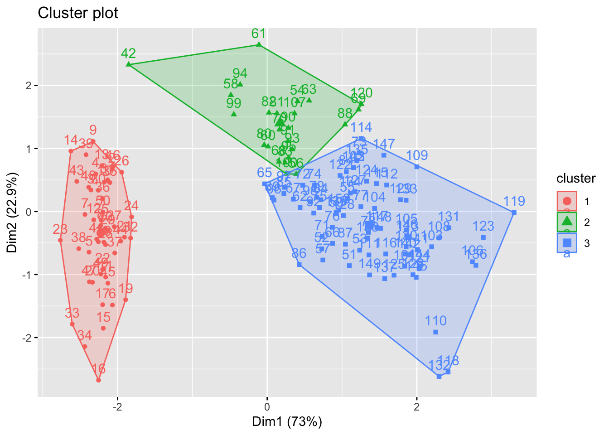
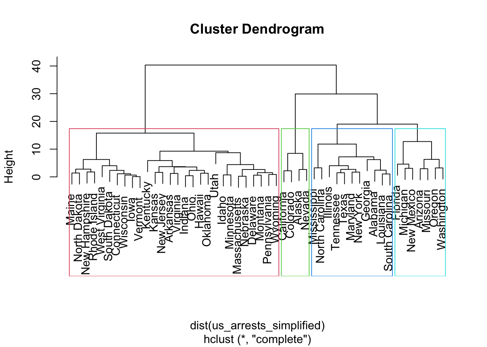
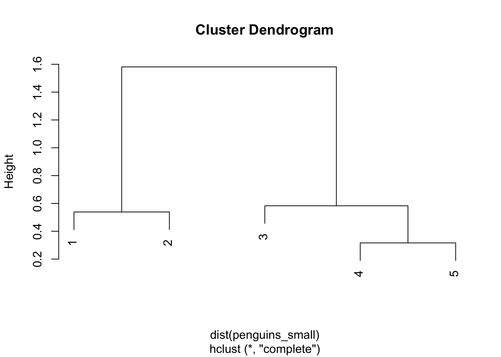
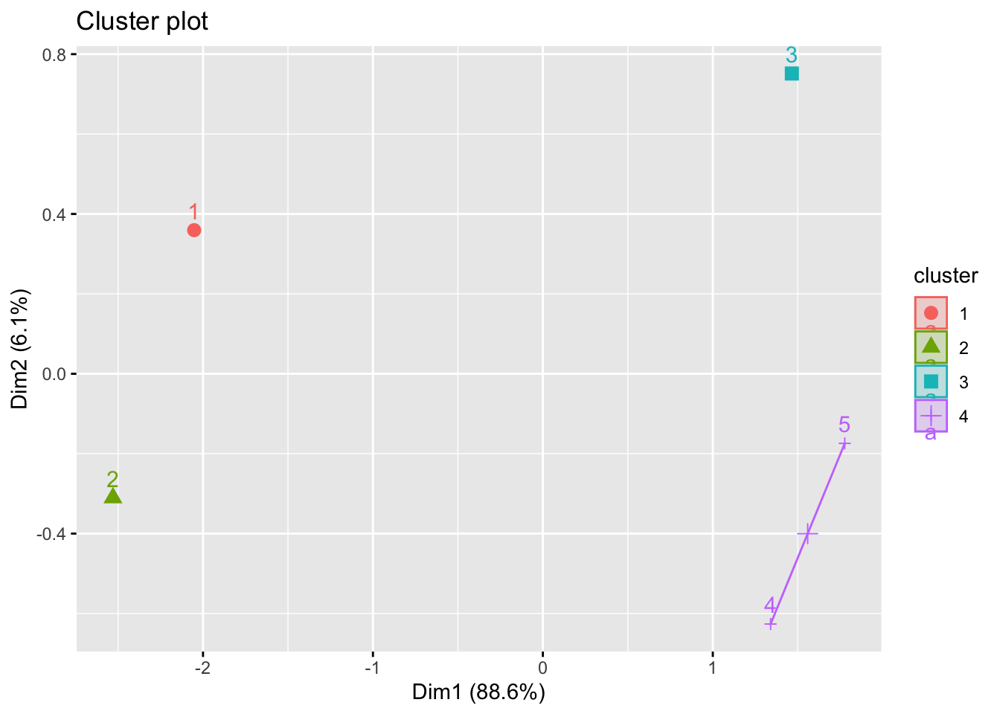

# 💻 Hierarchical Clustering {#hier-clust}

Hierarchical clustering is a machine learning technique used to group data points into clusters based on their similarity. It works by creating a hierarchical tree-like structure of clusters, where each cluster is divided into smaller clusters until all data points are grouped together. This technique is useful for finding patterns in data and can be used for a variety of applications, such as customer segmentation, image recognition, and anomaly detection.

If you are stuck either ask to the TA or team work! Collaboration is always key 👯‍♂️!

Remember also that if you want to visualize clusters you may think to use `fviz_cluster()` from lib `factoextra`. you just simply define which observation belogs to which group taking advantage of the `cutree` function. Below a minimal example


```r
library(cluster)  # clustering algorithms
library(factoextra) #
```


```r
df <- iris[, 1:4]
df <- na.omit(df)
df <- scale(df)
 
# Dissimilarity matrix
d <- dist(df, method = "euclidean")

# Hierarchical clustering using Complete Linkage
hc1 <- hclust(d, method = "complete" )

# Cut tree into 3 groups
sub_grps <- cutree(hc1, k = 3)
 
# Visualize the result in a scatter plot
fviz_cluster(list(data = df, cluster = sub_grps))
```



## 19.1 Exercises 👨‍💻

### Exercise 19.1

Consider the USArrests data which is by default installed with R. We will now perform hierarchical clustering on the states.

1. compute the distance matrix of for data USArrests.
2. Using hierarchical clustering though funtion hclust with complete linkage and Euclidean distance, cluster the states.
3. Cut the dendrogram at a height that results in 4 distinct clusters. Which states belong to which clusters?
4. It's also possible to draw the dendrogram with a border around the clusters when they are 4. The argument border is used to specify the border colors for the rectangles:
5. Visualise results with scatterplot
6. Let's say you are interested in clustering data USArrests for just Murder and Rape. What are the results?

Remember how to use hclust.

::: {.answer data-latex=""}
**Answer to Question 19.1:**


```r
# Distance matrix
d <- dist(USArrests)

set.seed(28)
hc_complete = hclust(dist(USArrests),method="complete")
plot(hc_complete)

sub_groups = cutree(hc_complete, k = 4)
rect.hclust(hc_complete, k = 4, border = 2:5)
```


```r

library(factoextra)
fviz_cluster(list(data = dist(USArrests), cluster = sub_groups))
```


```r

library(dplyr)
us_arrests_simplified = select(USArrests, Murder, Rape)
hc_complete_simple = hclust(dist(us_arrests_simplified), method="complete")
plot(hc_complete_simple)
rect.hclust(hc_complete_simple, k = 4, border = 2:5)
```


:::

### Exercise 19.2

suppose you measure a small sample of penguins 🐧. Measurament are stored into the following dataframe:


```r
penguins_small <- data.frame(
    depth = c(2.5, 2.7, 3.2, 3.5, 3.6),
    length = c(5.5, 6.0, 4.5, 5.0, 4.7)
)
```

Fit hierarchical clustering and visualize it both through dendogram and scatterplot

::: {.answer data-latex=""}
**Answer to Question 19.2:**

At first visualise clusters through dendogram


```r
penguin_cluster <- hclust(dist(penguins_small), method = "complete")
plot(penguin_cluster)
```



then with scatter:


```r
library(factoextra)
penguins_subgroups = cutree(penguin_cluster, k = 4)
fviz_cluster(list(data = dist(penguins_small), cluster = penguins_subgroups))
```


:::

### Exercise 19.3

The coleman data set in the robustbase library lists summary statistics for 20 different schools in the northeast US.

The six variables measured on each school include demographic information (such as percent of white-collar fathers) and characteristics of each school (such as staff salaries per pupil).

Perform a hierarchical cluster of this data using all explanatory variables.

If we cluster individuals in 9 groups how many individuals fall in the largest cluster ?

::: {.answer data-latex=""}
**Answer to Question 19.3:**


```r
library(robustbase)
data(coleman)

# Perform hierarchical clustering
hc_coleman <- hclust(dist(coleman), method = "complete")
plot(hc_coleman)

# Cut into 9 groups
sub_groups_coleman <- cutree(hc_coleman, k = 9)

# Find the largest cluster
table(sub_groups_coleman)
max(table(sub_groups_coleman))
```
:::

