--- 
title: "Statistics & Big Data 25-26 Labs"
author: "Dr. Niccolò Salvini"
date: "2025-12-02"
site: bookdown::bookdown_site
documentclass: book
bibliography: [book.bib, packages.bib]
# url: your book url like https://bookdown.org/yihui/bookdown
# cover-image: path to the social sharing image like images/cover.jpg
description: |
  This is a minimal course website containing class materials for  Statistics & Big Data labs @ucsc.
biblio-style: apalike
csl: chicago-fullnote-bibliography.csl
---

# 🫶 About

 This is the official course website for Statistics & Big data @UCSC 2025 - 2026 for laboratories. This website augments lecture topics and provides exercises for home and class assignments. Additional theory wrt slides and textbook will not be part of the exam, indeed they are for your growth and hopefully in the future as quicksilver resource to recover R proficiency from lethargy. 


## 🔧 Logistics {#logistics}

- **Lectures**: 
  - Mondays: 14:00 - 17:00 CET
  - Tuesdays: 10:00 - 13:00 CET
- **Location**: Campus Gemelli, Room 20 (and optionally remote)
- **Office hours**:
  - Dr. Niccolò **Salvini**: Available via email and for questions before/after lectures
  - Prof. Sophie **Dabo-Niang**: Available during intensive session (week of November 17th)
- here's the [shared drive](https://drive.google.com/drive/folders/1e1HVjSYABJ8rLUErHWbQOhAhQ_OA_Xo9?usp=sharing) (slides notebooks extra in class)

<!--- - **Grading**:
  one final project to build an ML application (65%). We'll have a demo day to showcase all students' final projects. See last year projects here two to three fun, short assignments (30%) discussion participation in class + EdStem + OHs (5%) --->


## 👥 Team {#team}

<style type="text/css">

.instructor {
    display: inline-block;
    width: 160px;
    text-align: center;
    margin-right: 20px;
    margin-bottom: 10px;
    font-size: 17px;
    vertical-align: top;
}


.instructorphoto img {
    width: 150px;
    border-radius: 140px;
    margin-bottom: 10px;
}

.col-md-2, .col-md-6 {
    position: relative;
    min-height: 1px;
    padding-right: 15px;
    padding-left: 15px;
}

</style>


````{=html}
<div class="row">
            <div class="col-md-3">
                <h3>Instructor</h3>
                <div class="instructor">
                    <a href="https://niccolosalvini.notion.site/Niccol-Salvini-PhD-2b09a3f0a7014b1182eb51578c058685">
                        <div class="instructorphoto"></div>
                        <div>Dr. Niccolò Salvini</div>
                    </a>
                </div>
            </div>
            <div class="col-md-3">
                <h3>Instructor</h3>
                <div class="instructor">
                    <a href="https://sites.google.com/view/sophie-dabo-niang/">
                        <div class="instructorphoto"></div>
                        <div>Prof. Sophie Dabo-Niang</div>
                    </a>
                </div>
            </div>
        </div>
````


## 🗒 labs' contents {#labs-content}

### Part 1: The Foundations (Dr. Niccolò Salvini)
- Introduction to the R ecosystem
  - Install R and RStudio
  - R tricks for research and professional life
  - Data wrangling with R
- Hypothesis Testing Fundamentals
  - Alternative hypothesis testing
  - How to calculate p-values
  - Hypothesis testing with null hypothesis
  - Hypothesis testing on averages
- Analysis of Variance (ANOVA)
  - Testing more than 2 means
- Chi-Square Tests
  - Testing more than 2 proportions
- Linear Regression Analysis
  - Simple linear regression
  - Multiple linear regression
  - Nonlinear regression
  - Regression with dummy variables
- Logistic Regression
  - Introduction to logistic regression

### Part 2: Advanced Modeling (Prof. Sophie Dabo-Niang)
- Factor Analysis
- Cluster Analysis
- Discrimination & Classification
- Binomial & Multinomial Logistic Regression
- Kernel Methods
- General Additive Models
- Other Supervised Models 

<!---
- Other supervised classification models: outline of regression trees approach (CART), CHAID, C.5, Random Forest, and Gradient Boosting classification algorithms; Bagging, Boosting and other ensembling techniques; Approach to the evaluation criteria of a binary classification model. 
--->


## Exam 📝

The exam is going to be open and closed questions on theory and practice (coding part). You will be asked to provide results and sometimes code leading to these results. You can also be asked to directly provide code to solve for that exercise. The exam is going to take place in labs classroom, this means you are **not** going to have your laptop during the exam. We generally don't provide assignment neither group works. Indeed we provide intermediate exams for those who want to try them.

we are going to have **2 intermediate sessions** exams on half of the whole content of the course. This means:
- _first intermediate_: will happen typically on **November** and will be on Part 1 content (Dr. Salvini's part)
- _second intermediate_: will happen in **January/February** on Part 2 content (Prof. Dabo-Niang's part)

you can take first intermediate and take the second on each exam date within the winter session, meaning you take part 1 in Nov and part 2 in either Jan and Feb. You can **not** reject intermediates, that means if you take first part, try the second and did not perform well, you need to take the full. Grades may undergo to a review process before being official if they are particularly low. This has happened quite often, but it does not happen every time. 


## 📚 Suggested reading list {#suggested-reading}

I am going to split resources by the expected level of their audience: 

### Minimal or 0 knowledge of R

- Everitt, B., Hothorn, T. (2011) An Introduction to Applied Multivariate Analysis with R, Springer-Verlag
- James, G, Witten, D, Hastie, T and Tibshirani, R, (2015) An Introduction to Statistical Learning, with Applications in R
- T. Timbers, T. Campbell, M. Lee  Data Science: A First Introduction, Jul 2022 [online version](https://datasciencebook.ca/)
- Wickham, H., Grolemund G. (2018) R for Data Science, O’Reilly. Freely available  on-line at https://r4ds.had.co.nz/index.html
- R for non-programmers, Daniel Dauber 2022, [free book](https://bookdown.org/daniel_dauber_io/r4np_book/starting-your-r-projects.html) 

### Advanced knowledge of R to become a top G

- Reproducible Medical Research with R,Peter D.R. Higgins, MD, PhD, MSc, 2022, [free book](https://bookdown.org/pdr_higgins/rmrwr/)
- Fundamentals of Wrangling Healthcare Data with R, J. Kyle Armstrong 2022, [free book](https://bookdown.org/jkylearmstrong/jeff_data_wrangling/) **Advanced**
- Wickham H. (2015). Advanced r. CRC Press [free book](https://adv-r.hadley.nz/)


## 📜 Honor Code {#honorcode}
Permissive but strict. If unsure, please ask the course staff!

- <span style="color: red;"><b>NOT OKAY</b></span> Pleeease, I am using ChatGPT and its derivatives on a daily basis. I understand, it's awesome and we are not enforcing any rule against it a home. Don't do that during the exam.
- <span style="color: green;"><b>OK</b></span> to search, ask in public about the systems we’re studying. Cite all the resources you reference.
E.g. if you read it in a paper, cite it. If you ask on Quora, include the link.
- <span style="color: red;"><b>NOT OKAY</b></span> to ask someone to do assignments/projects for you, we are monitoring freelancing websites, we have a plethora of bots doing this job daily.
- <span style="color: green;"><b>OK</b></span> to discuss questions with classmates. Disclose your discussion partners.
- <span style="color: red;"><b>NOT OKAY</b></span> to blindly copy solutions from classmates.
- <span style="color: green;"><b>OK</b></span> to use existing solutions as part of your projects/assignments. Clarify your contributions.
- <span style="color: red;"><b>NOT OKAY</b></span> to pretend that someone’s solution is yours.
- <span style="color: green;"><b>OK</b></span> to publish your final project after the course is over (we encourage that and if you need it I would love to help you!)
- <span style="color: red;"><b>NOT OKAY</b></span> to post your assignment solutions online.

## QR code time!


## Colophon {#intro-colophon}

This book was authored using [bookdown](https://bookdown.org/) inside [RStudio](https://www.rstudio.com/products/rstudio/) with [bs4 theme](https://pkgs.rstudio.com/bookdown/reference/bs4_book.html)
The [website](sbd-labs-25-26.netlify.app) is hosted with [Netlify](https://www.netlify.com), and automatically updated after Netlify CI.
The complete source is available from [GitHub](https://github.com/NiccoloSalvini/sbd_25-26).

This version of the book was built with:


```r
library(devtools)
#> Caricamento del pacchetto richiesto: usethis
library(roxygen2)
library(testthat)
#> 
#> Caricamento pacchetto: 'testthat'
#> Il seguente oggetto `e mascherato da 'package:devtools':
#> 
#>     test_file
#> Il seguente oggetto `e mascherato da 'package:dplyr':
#> 
#>     matches
devtools::session_info()
#> - Session info -------------------------------------------
#>  setting  value
#>  version  R version 4.2.0 (2022-04-22)
#>  os       macOS 15.6.1
#>  system   aarch64, darwin20
#>  ui       X11
#>  language (EN)
#>  collate  C
#>  ctype    C
#>  tz       Europe/Rome
#>  date     2025-12-02
#>  pandoc   3.7.0.2 @ /opt/homebrew/bin/ (via rmarkdown)
#> 
#> - Packages -----------------------------------------------
#>  package      * version    date (UTC) lib source
#>  bookdown       0.29       2022-09-12 [1] CRAN (R 4.2.0)
#>  brio           1.1.3      2021-11-30 [1] CRAN (R 4.2.0)
#>  bslib          0.5.1      2023-08-11 [1] CRAN (R 4.2.0)
#>  cachem         1.0.8      2023-05-01 [1] CRAN (R 4.2.0)
#>  callr          3.7.3      2022-11-02 [1] CRAN (R 4.2.0)
#>  cli            3.6.2      2023-12-11 [1] CRAN (R 4.2.3)
#>  crayon         1.5.2      2022-09-29 [1] CRAN (R 4.2.0)
#>  devtools     * 2.4.5      2022-10-11 [1] CRAN (R 4.2.0)
#>  dichromat      2.0-0.1    2022-05-02 [1] CRAN (R 4.2.0)
#>  digest         0.6.33     2023-07-07 [1] CRAN (R 4.2.0)
#>  downlit        0.4.2      2022-07-05 [1] CRAN (R 4.2.0)
#>  dplyr        * 1.1.4      2023-11-17 [1] CRAN (R 4.2.3)
#>  ellipsis       0.3.2      2021-04-29 [1] CRAN (R 4.2.0)
#>  evaluate       1.0.3      2025-01-10 [1] CRAN (R 4.2.0)
#>  fansi          1.0.4      2023-01-22 [1] CRAN (R 4.2.0)
#>  farver         2.1.1      2022-07-06 [1] CRAN (R 4.2.0)
#>  fastmap        1.1.1      2023-02-24 [1] CRAN (R 4.2.0)
#>  fs             1.6.3      2023-07-20 [1] CRAN (R 4.2.0)
#>  generics       0.1.3      2022-07-05 [1] CRAN (R 4.2.0)
#>  glue         * 1.6.2      2022-02-24 [1] CRAN (R 4.2.0)
#>  htmltools      0.5.6.1    2023-10-06 [1] CRAN (R 4.2.0)
#>  htmlwidgets    1.6.2      2023-03-17 [1] CRAN (R 4.2.0)
#>  httpuv         1.6.6      2022-09-08 [1] CRAN (R 4.2.0)
#>  httr           1.4.6      2023-05-08 [1] CRAN (R 4.2.0)
#>  jquerylib      0.1.4      2021-04-26 [1] CRAN (R 4.2.0)
#>  jsonlite       1.8.7      2023-06-29 [1] CRAN (R 4.2.0)
#>  kableExtra   * 1.3.4.9000 2023-06-01 [1] Github (kupietz/kableExtra@3bf9b21)
#>  knitr        * 1.44       2023-09-11 [1] CRAN (R 4.2.0)
#>  later          1.3.0      2021-08-18 [1] CRAN (R 4.2.0)
#>  lifecycle      1.0.3      2022-10-07 [1] CRAN (R 4.2.0)
#>  lubridate    * 1.9.2      2023-02-10 [1] CRAN (R 4.2.0)
#>  magrittr       2.0.3      2022-03-30 [1] CRAN (R 4.2.0)
#>  memoise        2.0.1      2021-11-26 [1] CRAN (R 4.2.0)
#>  mime           0.12       2021-09-28 [1] CRAN (R 4.2.0)
#>  miniUI         0.1.1.1    2018-05-18 [1] CRAN (R 4.2.0)
#>  pillar         1.9.0      2023-03-22 [1] CRAN (R 4.2.0)
#>  pkgbuild       1.4.2      2023-06-26 [1] CRAN (R 4.2.0)
#>  pkgconfig      2.0.3      2019-09-22 [1] CRAN (R 4.2.0)
#>  pkgload        1.4.0      2024-06-28 [1] CRAN (R 4.2.0)
#>  prettyunits    1.1.1      2020-01-24 [1] CRAN (R 4.2.0)
#>  processx       3.8.4      2024-03-16 [1] CRAN (R 4.2.3)
#>  profvis        0.3.8      2023-05-02 [1] CRAN (R 4.2.0)
#>  promises       1.2.0.1    2021-02-11 [1] CRAN (R 4.2.0)
#>  ps             1.7.5      2023-04-18 [1] CRAN (R 4.2.0)
#>  purrr          1.0.2      2023-08-10 [1] CRAN (R 4.2.0)
#>  R6             2.5.1      2021-08-19 [1] CRAN (R 4.2.0)
#>  RColorBrewer   1.1-3      2022-04-03 [1] CRAN (R 4.2.0)
#>  Rcpp           1.0.12     2024-01-09 [1] CRAN (R 4.2.3)
#>  remotes        2.4.2      2021-11-30 [1] CRAN (R 4.2.0)
#>  rlang          1.1.3      2024-01-10 [1] CRAN (R 4.2.3)
#>  rmarkdown      2.25       2023-09-18 [1] CRAN (R 4.2.0)
#>  roxygen2     * 7.3.1      2024-01-22 [1] CRAN (R 4.2.3)
#>  rstudioapi     0.14       2022-08-22 [1] CRAN (R 4.2.0)
#>  rvest          1.0.3      2022-08-19 [1] CRAN (R 4.2.0)
#>  sass           0.4.6      2023-05-03 [1] CRAN (R 4.2.0)
#>  scales         1.4.0      2025-04-24 [1] CRAN (R 4.2.0)
#>  sessioninfo    1.2.2      2021-12-06 [1] CRAN (R 4.2.0)
#>  shiny          1.7.2      2022-07-19 [1] CRAN (R 4.2.0)
#>  stringi        1.7.12     2023-01-11 [1] CRAN (R 4.2.0)
#>  stringr        1.5.0      2022-12-02 [1] CRAN (R 4.2.0)
#>  svglite        2.1.1      2023-01-10 [1] CRAN (R 4.2.0)
#>  systemfonts    1.0.4      2022-02-11 [1] CRAN (R 4.2.0)
#>  testthat     * 3.2.1.1    2024-04-14 [1] CRAN (R 4.2.3)
#>  tibble         3.2.1      2023-03-20 [1] CRAN (R 4.2.0)
#>  tidyselect     1.2.0      2022-10-10 [1] CRAN (R 4.2.0)
#>  timechange     0.2.0      2023-01-11 [1] CRAN (R 4.2.0)
#>  urlchecker     1.0.1      2021-11-30 [1] CRAN (R 4.2.0)
#>  usethis      * 2.1.6      2022-05-25 [1] CRAN (R 4.2.0)
#>  utf8           1.2.3      2023-01-31 [1] CRAN (R 4.2.0)
#>  vctrs          0.6.5      2023-12-01 [1] CRAN (R 4.2.3)
#>  viridisLite    0.4.2      2023-05-02 [1] CRAN (R 4.2.0)
#>  webexercises * 1.0.0      2021-09-15 [1] CRAN (R 4.2.0)
#>  webshot        0.5.4      2022-09-26 [1] CRAN (R 4.2.0)
#>  withr          3.0.2      2024-10-28 [1] CRAN (R 4.2.0)
#>  xfun           0.40       2023-08-09 [1] CRAN (R 4.2.0)
#>  xml2           1.3.4      2023-04-27 [1] CRAN (R 4.2.0)
#>  xtable         1.8-4      2019-04-21 [1] CRAN (R 4.2.0)
#>  yaml           2.3.7      2023-01-23 [1] CRAN (R 4.2.0)
#> 
#>  [1] /Users/niccolo/Library/R/arm64/4.2/library
#>  [2] /Library/Frameworks/R.framework/Versions/4.2-arm64/Resources/library
#> 
#> ----------------------------------------------------------
```

<!--chapter:end:index.Rmd-->

# (PART\*) Get Started {.unnumbered}

# ✨Prerequisites  {#prereq}

## Setting up R and RStudio

To get started with R, you need to acquire your own copy. This appendix will show you how to download R as well as RStudio, a software application that makes R easier to use. You’ll go from downloading R to opening your first R session. Use the menu on the right hand side of the page to select your OS and follow the correct installation.

Both R and RStudio are free and easy to download. **If you feel more comfortable interacting with videos instead of reading** please visit <ins> [this interactive tutorials](https://learnr-examples.shinyapps.io/ex-setup-r/) </ins> that will guide you through the full R set up!

## How to Download and Install R

R is maintained by an international team of developers who make the language available through the web page of The Comprehensive R Archive Network i.e. CRAN. The top of the web page provides three links for downloading R. Follow the link that describes your operating system: Windows, Mac, or Linux.

### **R in Windows**

To install R on Windows, click the “Download R for Windows” link. Then click the “base” link. Next, click the first link at the top of the new page. This link should say something like “Download R 3.0.3 for Windows,” except the 3.0.3 will be replaced by the most current version of R. The link downloads an installer program, which installs the most up-to-date version of R for Windows. Run this program and step through the installation wizard that appears. The wizard will install R into your program files folders and place a shortcut in your Start menu. Note that you’ll need to have all of the appropriate administration privileges to install new software on your machine. (more detailed steps)

### **R in Mac**

This is also my setup, feel free to reach me at  [my mail address](mailto:niccolo.salvini27@gmail.com) if something is messed up.

1. Go to [www.r-project.org](www.r-project.org)

<div class="figure">

<p class="caption">(\#fig:rproj-page)The R mirrors website</p>
</div>

  
2.  Click on `CRAN` where it says `Download`.

3.  Choose a server in your country (all of them work, but downloads will perform quicker if you choose your country or one that is close to where you are).

<div class="figure">

<p class="caption">(\#fig:cran-mirrors)CRAN mirrors</p>
</div>

4.  Select the operating system for your computer, for example `Download R for macOS`.

<div class="figure">

<p class="caption">(\#fig:os-choice)OS choices available</p>
</div>


5.  Select the version you want to install (I recommend the latest version)

<div class="figure">
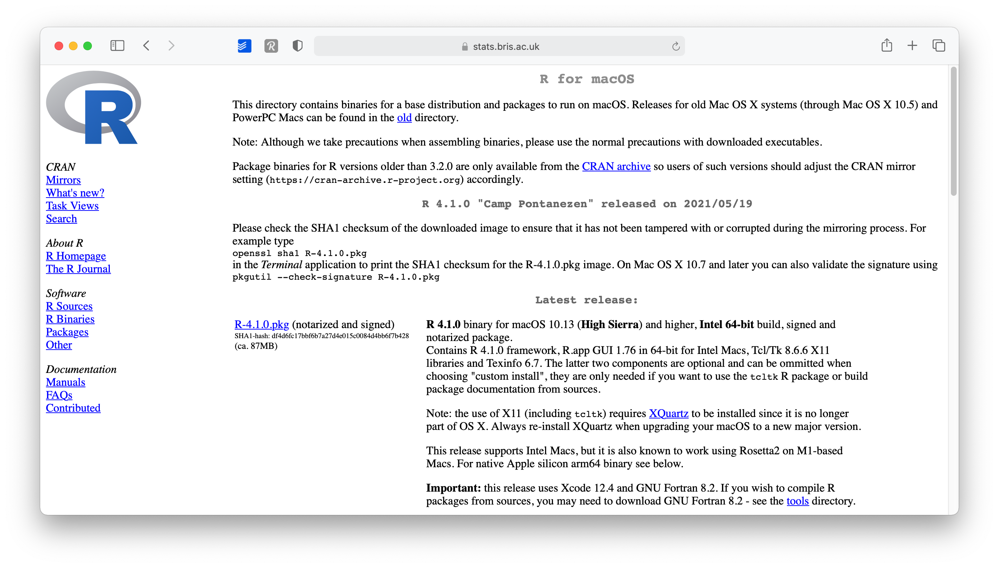
<p class="caption">(\#fig:r-versions)R versions available</p>
</div>

6.  Open the downloaded file and follow the installation instructions. I recommend leaving the suggested settings as they are.

:::note
**Binaries Versus Source**

R can be installed from precompiled binaries or built from source on any operating system. For Windows and Mac machines, installing R from binaries is extremely easy. The binary comes preloaded in its own installer. Although you can build R from source on these platforms, the process is much more complicated and won’t provide much benefit for most users. For Linux systems, the opposite is true. Precompiled binaries can be found for some systems, but it is much more common to build R from source files when installing on Linux. The download pages on CRAN’s website provide information about building R from source for the Windows, Mac, and Linux platforms.
:::

### **R in Linux**

R comes preinstalled on many Linux systems, but you’ll want the newest version of R if yours is out of date. The CRAN website provides files to build R from source on Debian, Redhat, SUSE, and Ubuntu systems under the link “Download R for Linux.” Click the link and then follow the directory trail to the version of Linux you wish to install on. The exact installation procedure will vary depending on the Linux system you use. CRAN guides the process by grouping each set of source files with documentation or README files that explain how to install on your system.

:::note
**32-bit Versus 64-bit**

R comes in both 32-bit and 64-bit versions. Which should you use? In most cases, it won’t matter. Both versions use 32-bit integers, which means they compute numbers to the same numerical precision. The difference occurs in the way each version manages memory. 64-bit R uses 64-bit memory pointers, and 32-bit R uses 32-bit memory pointers. This means 64-bit R has a larger memory space to use (and search through).
As a rule of thumb, 32-bit builds of R are faster than 64-bit builds, though not always. On the other hand, 64-bit builds can handle larger files and data sets with fewer memory management problems. In either version, the maximum allowable vector size tops out at around 2 billion elements. If your operating system doesn’t support 64-bit programs, or your RAM is less than 4 GB, 32-bit R is for you. The Windows and Mac installers will automatically install both versions if your system supports 64-bit R.
:::

## Using R

R isn’t a program that you can open and start using, like Microsoft Word or Internet Explorer. Instead, R is a computer language, like C, C++, or UNIX. You use R by writing commands in the R language and asking your computer to interpret them. In the old days, people ran R code in a UNIX terminal window—as if they were hackers in a movie from the 1980s. Now almost everyone uses R with an application called RStudio, and I recommend that you do, too.

:::fyi

**R and UNIX**

You can still run R in a UNIX or BASH window (prompt or Powershell) by typing the command:
R
which opens an R interpreter. You can then do your work and close the interpreter by running `q()` when you are finished.
:::

## Using RStudio

*R* by itself is just the '*beating heart*' of *R* programming, but it has no particular user interface. You may have heard me saying stuff like: "R is the **engine** of the car, indeed RStudio is the **car body**, that's true, you just don't need an engine if you don't have a car body. That is to say: if you want buttons to click and actually '*see*' what you are doing, there is no better way than RStudio.
RStudio is an *integrated development environment* (IDE) and will be our primary tool to interact with *R*. It is the only software you need to do all the fun parts and, of course, to follow along with the examples of this book. 
You may ask yourself what is Posit, fair question. Back in the days Posit, the company behind RStudio, was actually named RStudio (as their product). Then in 2023 they rebranded themselves as Posit to also include other languages like Python,

Howeveeeer to install RStudio perform the following steps:

1.  Go to [https://posit.co/](https://posit.co/ "https://posit.co/")

<div class="figure">

<p class="caption">(\#fig:rstudio-main)The Posit.co main page</p>
</div>

2.  Go to `DOWNLOAD RSTUDIO` in the upper right corner (download R if you still haven't).

3. Select `DOWNLOAD RSTUDIO`, just on the left of `DOWNLOAD RSTUDIO SERVER`.

<div class="figure">

<p class="caption">(\#fig:rstudio-select-version)Choose RStudio version</p>
</div>

4.  On this page, scroll down and select the Download (in the download column) corresponding to your OS (mind that different versions of the same OS, say macOS 11.2 or macOS 8.3 need different RStudio download installations).

<div class="figure">
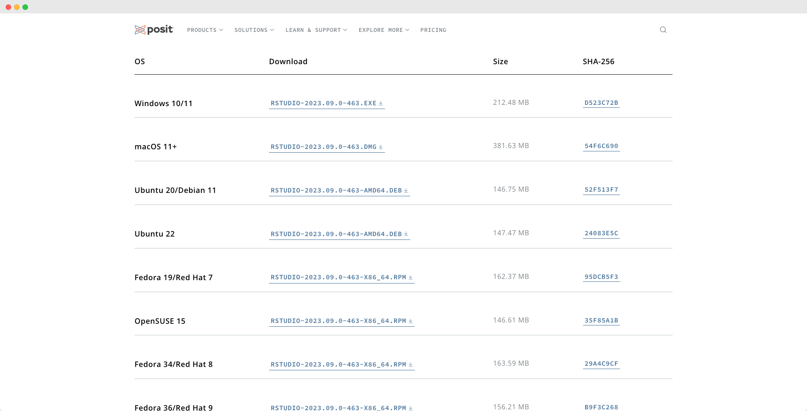
<p class="caption">(\#fig:rstudio-select-os-version)Choose RStudio version</p>
</div>
  
5.  Open the downloaded file and follow the installation instructions. Again, keep it to the default settings as much as possible.

Congratulations, you are all set up to learn *R*. From now on you only need to start RStudio and not *R*. Of course, if you are the curious type, nothing shall stop you to try *R* without RStudio.


## When you first start RStudio {#when-you-first-start-rstudio}

Before you start programming away, you might want to make some tweaks to your settings right away to have a better experience (in my humble opinion). To open the Rstudio settings you have to click on

-   `RStudio > Preferences` or press `⌘ + ,` if you are on a Mac.

-   `RStudio > Tools > Global Options` or press `Ctrl + ,` if you work on a Windows computer.

I recommend to at least make the following changes to set yourself up for success right from the beginning:

1.  Already on the first tab, i.e. `General > Basic`, we should make one of the most significant changes. Deactivate every option that starts with `Restore`. This will ensure that every time you start RStudio, you begin with a clean slate. At first sight, it might sound counter-intuitive not to restart everything where you left off, but it is essential to make all your projects easily reproducible. Furthermore, if you work together with others, not restoring your personal settings also ensures that your programming works across different computers. Therefore, I recommend having the following unticked:

    -   `Restore most recently opened project at startup`,

    -   `Restore previsouly open source documents at startup`,

    -   `Restore .Rdata into workspace at startup`


<div class="figure">

<p class="caption">(\#fig:rstudio-preferences)get your RStudio preferences</p>
</div>


2.  In the same tab under `Workspace`, select `Never` for the setting `Save workspace to .RData on exit`. One might think it is wise to keep intermediary results stored from one R session to another. However, I often found myself fixing issues due to this lazy method, and my code became less reliable and, therefore, reproducible. With experience, you will find that this avoids many headaches.

3.  In the `Code > Editing` tab, make sure to have at least the first five options ticked, especially the `Auto-indent code after paste`. This setting will save time when trying to format your coding appropriately, making it easier to read. Indentation is the primary way of making your code look more readable and less like a series of characters that appear almost random.

<div class="figure">

<p class="caption">(\#fig:rstudio-prefediting)Pimp your RStudio IDE</p>
</div>

4.  In the `Display` tab, you might want to have the first three options selected. In particular, `Highlight selected line` is helpful because, in more complicated code, it is helpful to see where your cursor is.

<div class="figure">
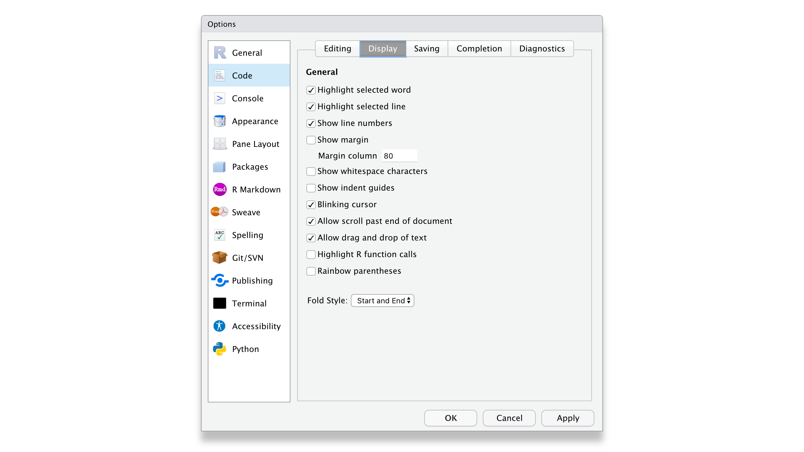
<p class="caption">(\#fig:rstudio-prefdisp)Edit your RStudio display preferences</p>
</div>


Of course, if you wish to customise your workspace further, you can do so. The visually most impactful way to alter the default appearance of RStudio is to select `Appearance` and pick a completely different colour theme. Feel free to browse through various options and see what you prefer. There is no right or wrong here. Just make it your own.

<div class="figure">

<p class="caption">(\#fig:rstudio-prefappear)This will get you instantly nerd</p>
</div>


## Updating R and RStudio: Living at the pulse of innovation {#updating-r-and-rstudio}

While not strictly something that helps you become a better programmer, this advice might come in handy to avoid turning into a frustrated programmer. When you update your software, you need to update *R* and RStudio separately from each other. While both *R* and RStudio work closely with each other, they still constitute separate pieces of software. Thus, it is essential to keep in mind that updating RStudio will not automatically update R. This can become problematic if specific tools you installed via RStudio (like a fancy learning algorithm) might not be compatible with earlier versions of *R*. Also, additional *R* packages (see Chapter \@ref(r-packages)) developed by other developers are separate pieces which require updating too, independently from *R* and RStudio.

I know what you are thinking: This already sounds complicated and cumbersome. However, rest assured, we take a look at how you can easily update all your packages with RStudio. Thus, all you need to remember is: *R* needs to be updated separately from everything else.


<!--chapter:end:01-prerequisites.Rmd-->

# 📦 R Packages

Many of R’s most useful functions do not come preloaded when you start R, but reside in packages that can be installed on top of R. R packages are similar to libraries in C, C++, and Javascript, packages in Python, and gems in Ruby. An R package bundles together useful functions, help files, and data sets. You can use these functions within your own R code once you load the package they live in. Usually the contents of an R package are all related to a single type of task, which the package helps solve. R packages will let you take advantage of R’s most useful features: its large community of package writers (many of whom are active data scientists) and its prewritten routines for handling many common (and exotic) data-science tasks.

:::fyi
**Base R**
You may hear R users (or me) refer to “base R.” What is base R? It is just the collection of R functions that gets loaded every time you start R. These functions provide the basics of the language, and you don’t have to load a package before you can use them.
:::

## Installing Packages


To use an R package, you must first install it on your computer and then load it in your current R session. The easiest way to install an R package is with the `install.packages` R function. Open R and type the following into the command line:


```r
install.packages("<package name>")
```

This will search for the specified package in the collection of packages hosted on the CRAN site. When R finds the package, it will download it into a libraries folder on your computer. R can access the package here in future R sessions without reinstalling it. Anyone can write an R package and disseminate it as they like; however, almost all R packages are published through the CRAN website. CRAN tests each R package before publishing it. This doesn’t eliminate every bug inside a package, but it does mean that you can trust a package on CRAN to run in the current version of R on your OS.

You can install multiple packages at once by linking their names with R’s concatenate function, c. For example, to install the ggplot2, reshape2, and dplyr packages, run:


```r
install.packages(c("ggplot2", "dplyr", "carData", "spdep"))
```

If this is your first time installing a package, R will prompt you to choose an online mirror of to install from. Mirrors are listed by location. Your downloads should be quickest if you select a mirror that is close to you. If you want to download a new package, try the Austria mirror first. This is the main CRAN repository, and new packages can sometimes take a couple of days to make it around to all of the other mirrors.

## Loading Packages

Installing a package doesn’t immediately place its functions at your fingertips. It just places them on your computer. To use an R package, you next have to load it in your R session with the command:


```r
library("<package name>")

```

Notice that the quotation marks have disappeared. You can use them if you like, but quotation marks are optional for the `library` command. (This is not true for the `install.packages` command).

`library` will make all of the package’s functions, data sets, and help files available to you until you close your current R session. The next time you begin an R session, you’ll have to reload the package with `library` if you want to use it, but you won’t have to reinstall it. You only have to install each package once. After that, a copy of the package will live in your R library. To see which packages you currently have in your R library, run:


```r
library()
```

`library()` also shows the path to your actual R library, which is the folder that contains your R packages. You may notice many packages that you don’t remember installing. This is because R automatically downloads a set of useful packages when you first install R.

:::note
**Install packages from (almost) anywhere**

The devtools R package makes it easy to install packages from locations other than the CRAN website. devtools provides functions like install_github, install_gitorious, install_bitbucket, and install_url. These work similar to install.packages, but they search new locations for R packages. install_github is especially useful because many R developers provide development versions of their packages on GitHub. The development version of a package will contain a sneak peek of new functions and patches but may not be as stable or as bug free as the CRAN version.
:::

Why does R make you bother with installing and loading packages? You can imagine an R where every package came preloaded, but this would be a very large and slow program. As of May 6, 2014, the CRAN website hosts 5,511 packages. It is simpler to only install and load the packages that you want to use when you want to use them. This keeps your copy of R fast because it has fewer functions and help pages to search through at any one time. The arrangement has other benefits as well. For example, it is possible to update your copy of an R package without updating your entire copy of R.

:::fyi
**What’s the best way to learn about R packages?**

It is difficult to use an R package if you don’t know that it exists. You could go to the CRAN website and click the Packages link to see a list of available packages, but you’ll have to wade through thousands of them. Moreover, many R packages do the same things.

How do you know which package does them best? The R-packages [mailing list](https://stat.ethz.ch/mailman/listinfo/r-packages) is a place to start. It sends out announcements of new packages and maintains an archive of old announcements. Blogs that aggregate posts about R can also provide valuable leads. I recommend R-bloggers. RStudio maintains a list of some of the most useful R packages in the Getting Started section of http://support.rstudio.com. Finally, CRAN groups together some of the most useful—and most respected—packages by [subject area](https://cran.r-project.org/web/views/). This is an excellent place to learn about the packages designed for your area of work.
:::

## Updating R and Its Packages
The R Core Development Team continuously hones the R language by catching bugs, improving performance, and updating R to work with new technologies. As a result, new versions of R are released several times a year. The easiest way to stay current with R is to periodically check the CRAN website. The website is updated for each new release and makes the release available for download. You’ll have to install the new release. The process is the same as when you first installed R.

Don’t worry if you’re not interested in staying up-to-date on R Core’s doings. R changes only slightly between releases, and you’re not likely to notice the differences. However, updating to the current version of R is a good place to start if you ever encounter a bug that you can’t explain.

RStudio also constantly improves its product. You can acquire the newest updates just by downloading them from [RStudio](https://www.rstudio.com/products/rstudio/).

### **R Packages**
Package authors occasionally release new versions of their packages to add functions, fix bugs, or improve performance. The `update.packages` command checks whether you have the most current version of a package and installs the most current version if you do not. The syntax for `update.packages` follows that of `install.packages`. If you already have `ggplot2`, `reshape2`, and `dplyr` on your computer, it’d be a good idea to check for updates before you use them:


```r
update.packages(c("ggplot2", "dplyr", "carData", "spdep"))
```

You should start a new R session after updating packages. If you have a package loaded when you update it, you’ll have to close your R session and open a new one to begin using the updated version of the package.


<!--chapter:end:02-rpackages.Rmd-->

# 🔥 Nice warm-up

Now we are going to cover some very basic operations and computer science concepts with R. Hopefully this will get you with a really cool starter pack of function that you might reuse throughout you R journey.

<!-- Some other very insightful resources related to wrangling Healthcare data according to `{Tidyverse}` conventions may include (by proficiency level): -->

<!-- - Fundamentals of Wrangling Healthcare Data with R, J. Kyle Armstrong 2022, [free book](https://bookdown.org/jkylearmstrong/jeff_data_wrangling/) -->
<!-- -  -->
<!-- -  -->

## Starting your fresh new R project

Every fresh attempt is likely to pique your interest and pique your emotions. And it should. You will uncover the answers to your research questions, and you should become more knowledgeable as a consequence. However, you are likely to dislike certain aspects of data analysis. Two examples spring to mind:

- **A** Keeping track of all the files generated by my project

- **B** Data manipulation

While we will go into deeper detail on data manipulation in a later chapter, I'd like to share some ideas from my work that helped me stay organized and, as a result, less frustrated. The following is applicable to both small and large research projects, making it extremely useful regardless of the circumstance or size of the project.

## Creating an *R* Project file {#creating-an-r-project}

When working on a project, you likely create many different files for various purposes, especially *R* Scripts (`File > New File > R Script`). If you are not careful, this file is stored in your system's default location, which might not be where you want them to be. RStudio allows you to manage your entire project intuitively and conveniently through *R* Project files. Using *R* Project files comes with a couple of perks, for example:

-  All of the files you create are saved in the same location. Your data, coding, exported charts, reports, and so on are all in one location, so you don't have to maintain the files manually. This is because RStudio sets the root directory to the folder where your project is stored.

-   If you wish to share your project, you may do so by sharing the entire folder, and others can rapidly replicate your study or assist in issue resolution. This is due to the fact that all file paths are relative rather than absolute.

-  You may utilize GitHub more readily for backups and so-called 'version control' tools, which allows you to trace changes to your code over time. (btw this is really crucial in work envirnoments, if you would like to know more about that I dedicated a [tutorial website](https://corso-git.netlify.app/) of git+GitHub+RStudio workflow and a set of slides to explain these concepts). This is **not a requirement** for the course and you can skip that. However let me clarify that: it is a nice-to-have skill whenever you are collaborating with someone. It could happen on the job, or while writing your thesis, you name it.

For the time being, the most significant reason to make *R* Project files is the ease of file organization and the ability to readily share them with co-investigators, your supervisor, or your students.

To create an R Project, you need to perform the following steps:


1.  Select `File > New Project…` from the menu bar.

<div class="figure">

<p class="caption">(\#fig:rproj-menu)Get the R project</p>
</div>


2.  Select `New Directory` from the popup window.

<div class="figure">

<p class="caption">(\#fig:rproj-new-dir)New Project Wizard pop up menu</p>
</div>

3.  Next, select `New Project`.

<div class="figure">
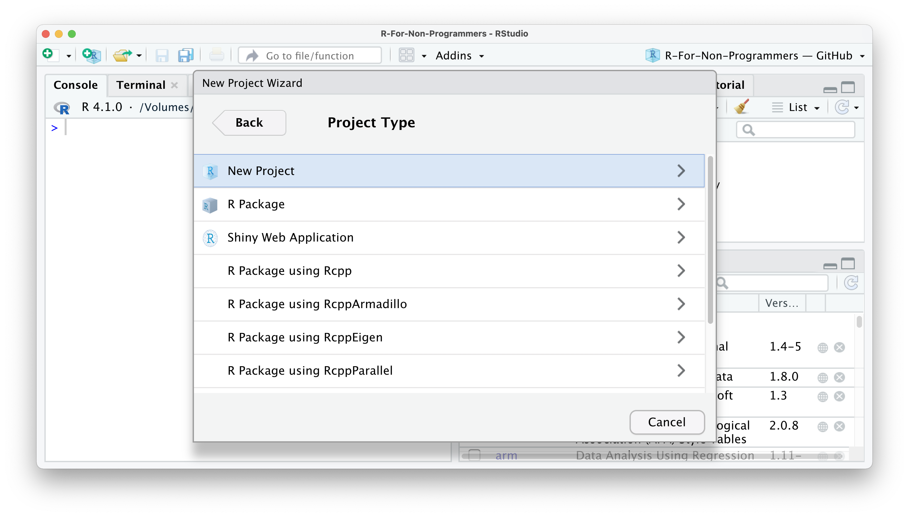
<p class="caption">(\#fig:rproj-open-new-dir)The full set of project you can initialize through the RStudio IDE</p>
</div>

4.  Pick a meaningful name for your project folder, i.e. the `Directory Name`. Ensure this project folder is created in the right place. You can change the `subdirectory` by clicking on `Browse…`. Ideally the subdirectory is a place where you usually store your research projects.


<div class="figure">

<p class="caption">(\#fig:rproj-specs)The RProject specifications</p>
</div>


5.  You have the option to `Create a git repository`. This is only relevant if you already have a GitHub account and wish to use version control. For now, you can happily ignore it if you do not use GitHub.

6.  Lastly, tick `Open in new session`. This will open your *R* Project in a new RStudio window.

<div class="figure">

<p class="caption">(\#fig:rproj-dirname)Choose a directory name for your new project</p>
</div>


7.  Once you are happy with your choices, you can click `Create Project`. This will open a new *R* Session, and you can start working on your project.

<div class="figure">

<p class="caption">(\#fig:rproj-open-new-session)A new RStudio Session will pop up just like magic!</p>
</div>

If you look carefully, you can see that your RStudio is now 'branded' with your project name. At the top of the window, you see the project name, the files pane shows the root directory where all your files will be, and even the console shows on top the file path of your project. You could set all this up manually, but I would not recommend it, not the least because it is easy and swift to work with *R* Projects


## Working Directory with `here` {#workdir}

When you bootstrap your RProject in that way, RStudio is going to take care of many headaches that any fresher and sophmore developer have in the beginning. As a matter of fact each time you double click on the RStudio project file (the one that finishes with .RProj) RStudio will link itself to the directory on your computer you specified during the creation of the project, in the previous case "tidy_tuesday_2021_08_03". This is called the **Working Directory**. 
What it is interesting it that this place is where R will look for files when you attempt to load them, and it is where R will save files when you save them. The location of your working directory will vary on different computers. 
There is a _base_ (rather vintage) way to look for the working directory.
To understrand which directory R is using as your working directory, run:


```r
getwd()
## "/Users/niccolo/Desktop/r_projects/sbd_22-23"
```

However since we live in 2022 we are going to use a very convenient package i.e. `here` that does exactly the same thing but prettier and more intuitively.


```r
install.packages("here")
library(here)
here()
## "/Users/niccolo/Desktop/r_projects/sbd_22-23"
```

`here()` is going to look for the `.RProj` file and will the Working Directory exactly where it is placed.


## Creating an R Script

Code may easily grow lengthy and complicated. As a result, writing it on the console is inconvenient. As an alternative, we may write code into a R Script. An R Script is a document that is recognized by RStudio as R programming code. Non-R Script files, such as `.txt`,`.rtf`, or `.md`, can also be opened in RStudio, but any code typed in them will not be immediately recognized.

When you open or create a new R script, it will appear in the Source pane. This window is sometimes referred to as the 'script editor'. An R script begins with an empty file. Good coding etiquette requires us to put a comment # on the first line to describe what this file does. Here's a 'TidyTuesday' R Project sample.

<div class="figure">
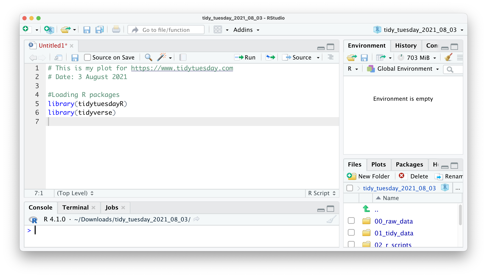
<p class="caption">(\#fig:rscript)Open an R Script and write some on it</p>
</div>


All of the examples in this tutorial are made to be copied and pasted into your own R script. However, you will need to install the R packages for certain code. Let's give it a shot with the following code. The plot produced by this code displays which car company provides the most fuel-efficient vehicles. This code should be copied and pasted into your R script. Below there's a simple script that generates a plot, copy and paste into your file, then execute it.


```r

library(tidyverse)

mpg %>% 
  ggplot(aes(x = reorder(manufacturer, desc(hwy), FUN = median),
                   y = hwy,
                   fill = manufacturer)) +
  geom_boxplot() +
  coord_flip() +
  theme_minimal() +
  xlab("Manufacturer") +
  ylab("Highway miles per gallon")
```


You're probably wondering what happened to your plot. Copying the code will not execute it in your *R* script. However, this is required in order to develop the plot. If you pressed `Return ↵`, you would just add a new line. Instead, choose the code you wish to run and hit `Ctrl+Return ↵` (PC) or `Cmd+Return ↵` (Mac). You may also use the `Run` command at the top of your source window, but the keyboard shortcut is far more convenient. Furthermore, you will rapidly remember this shortcut because we will need to utilize it frequently. If everything is in order, you should see the following:


As you can see, Honda automobiles appear to travel the furthest with the same quantity of fuel (a gallon) as other vehicles. As a result, if you're seeking for cheap automobiles, you now know where to look at.

It's worth noting that the R script editor includes some handy features for developing code. You've undoubtedly noticed that part of the code we've pasted is blue and others is green. Because they have a distinct significance, these colors aid in making your code more understandable. In the default settings, green represents any value in "", which often represents characters. Syntax highlighting refers to the automatic coloring of our programming code.


## Using R Markdown

There is too lot to say about R Markdown, so I'll just mention that it exists and highlight one feature that could persuade you to use it instead of plain R scripts: They appear to be _Word documents_ (almost).

R Markdown files, as the name implies, are a mix of R scripts and 'Markdown.' 'Markdown' is a method of composing and formatting text documents without the use of software such as Microsoft Word. You instead write everything in plain text. Such plain text may be translated into a variety of document forms, including HTML webpages, PDF files, and Word documents. I recommend checking out the [R Markdown Cheatsheet](https://www.rstudio.com/resources/cheatsheets/) to learn how it works. `Click File > New File > R Markdown` to create a R Markdown file.

An R Markdown file is the inverse of a R script. By default, a R script treats everything as code, and we can only use language to describe what the code does by commenting `#`. This is what you've seen in all of the previous code examples. An R Markdown file, on the other hand, treats everything as text and requires us to declare what is code. We may accomplish this by injecting 'code chunks.' As a result, using comments `#` in R Markdown files is less necessary because you may write about it. Another advantage of R Markdown files is that the results of your analysis are shown immediately underneath the code chunk rather than in the terminal. They are also sometimes called **notebooks** since they can display both code and text together, the Python equivalent for those that have been someway exposed to Python scripting in **Jupyter**


<!--chapter:end:03-nicewarmup.Rmd-->

# 🗒️ Syllabus

The lecture slides, notes, tutorials, and assignments will be posted on <ins> [this drive](https://drive.google.com/drive/folders/1e1HVjSYABJ8rLUErHWbQOhAhQ_OA_Xo9?usp=sharing) </ins>, feel free to jump on it. please do not anticipate questions that we will address in class, instead [drop me a mail](mailto:niccolo.salvini27@gmail.com) if you are not sure about something.

If for any reasons you have trouble accessing the G Drive, still please contact [your teaching assistant](mailto:niccolo.salvini27@gmail.com). One common issue students complain is that you may need to be authorization to access, because I may have forgotten to switch on the open to share option. If you see me, knock me on the shoulder!

This schedule is subject to change according to the pace of the class and we may schedule a further lab if you feel you are not really ready for the intermediate exam.

This is the updated edition of this course with Dr. Niccolò Salvini (Part 1) and Prof. Sophie Dabo-Niang (Part 2).

## Course Materials

All course materials are available in the `slides/` folder:

### Part 1: The Foundations (Dr. Niccolò Salvini)

**Slides by Dr. Niccolò Salvini:**
- [Hypothesis Testing with Null Hypothesis](slides/02_hypt_testing_null_hypo.pdf)
- [Hypothesis Testing with Alternative Hypothesis](slides/03_hypt_testing_alternative_hypo.pdf)
- [How to Calculate P-values](slides/04_how_to_calculate_pvalues.pdf)
- [Hypothesis Testing on Averages](slides/hypt_testing_on_avg.pdf)
- [Exercises on Hypothesis Testing](slides/05_hypt_testing_exeR.pdf)
- [Multiple Linear Regression](slides/mlt_lin_reg.pdf)
- [Nonlinear Regression](slides/nonlinear_regression.pdf)
- [Introduction to Linear Regression](slides/intro_linear_regr.pdf)
- [Introduction to Logistic Regression](slides/intro to logistic regression.pdf)

**Slides by Prof. Vincenzo Nardelli:**
- [Linear Regression](slides/linear_regression.pdf)

**Laboratori Modulo 2 (Dr. Niccolò Salvini):**
- [PCA & Correspondence Analysis](slides/module_2_PCA_CA.pdf) 
- [Hierarchical Clustering](slides/module_2_hierarchical_clustering.pdf)
- [K-Means Clustering](slides/module_2_kmeans_clustering.pdf)

### Part 2: Advanced Modeling (Prof. Sophie Dabo-Niang)
- Materials will be provided during the intensive session (week of November 17th)

## Course Structure

**Part 1: The Foundations (Dr. Niccolò Salvini)**
- 5 hours of integrated labs during regular lectures
- Mondays: 14:00 - 17:00 CET
- Tuesdays: 10:00 - 13:00 CET

**Part 2: Advanced Modeling (Prof. Sophie Dabo-Niang)**
- 5 hours intensive session during the week of November 17th

to be ready: 

| Date        | Description                                                  | Materials                                                                    | Events           |
| ----------- | ------------------------------------------------------------ | ---------------------------------------------------------------------------- | ---------------- |
| Sept 22-23 | Introduction to RStudio + Hypothesis Testing Fundamentals | [Null Hypothesis Testing](slides/02_hypt_testing_null_hypo.pdf) | Laboratory + Lecture          |
| Sept 22-23 | Alternative Hypothesis Testing + P-values Calculation | [Alternative Hypothesis](slides/03_hypt_testing_alternative_hypo.pdf) | Laboratory + Lecture |
| Sept 22-23 | How to Calculate P-values | [P-values Calculation](slides/04_how_to_calculate_pvalues.pdf) | Laboratory + Lecture |
| [TBD] | Hypothesis Testing on Averages | [Testing on Averages](slides/hypt_testing_on_avg.pdf) and [Exercises](slides/05_hypt_testing_exeR.pdf) | Laboratory |
| [TBD] | Chi-Square Tests (more than 2 proportions) | [Null Hypothesis Testing](slides/hypt_testing_null_hypo.pdf) | Laboratory |
| Sept 29-30, Oct 6-7 | Simple Linear Regression | [Introduction to Linear Regression](slides/intro_linear_regr.pdf), [Linear Regression](slides/linear_regression.pdf) | Laboratory + Theory |
| Sept 29-30, Oct 6-7 | Multiple Linear Regression | [Multiple Linear Regression](slides/mlt_lin_reg.pdf) | Laboratory + Theory |
| Sept 29-30, Oct 6-7 | Nonlinear Regression + Dummy Variables | [Nonlinear Regression](slides/nonlinear_regression.pdf) | Laboratory + Theory |
| Oct 7 | Logistic Regression | [Introduction to Logistic Regression](slides/intro to logistic regression.pdf) | Laboratory + Theory |
| [TBD] | First Intermediate Exam (Part 1) | | Exam |
| Week of Nov 17th | Intensive Session - Advanced Modeling | Materials provided during session | Laboratory |
| [TBD] | Second Intermediate Exam (Part 2) | | Exam |


<!--chapter:end:04-syllabus.Rmd-->

# (PART\*) Part 1: The Foundations {.unnumbered}

# 🧪 Hypothesis Testing Fundamentals

This chapter introduces the fundamental concepts of hypothesis testing, covering alternative hypothesis testing, p-value calculation, and hypothesis testing with null hypothesis.

## Learning Objectives

By the end of this chapter, you will be able to:

- Understand the concept of hypothesis testing
- Formulate null and alternative hypotheses
- Calculate and interpret p-values
- Perform hypothesis tests on averages
- Make statistical decisions based on test results

## Introduction to Hypothesis Testing

Hypothesis testing is a statistical method used to make decisions about population parameters based on sample data. It involves:

1. **Formulating hypotheses**: Stating a null hypothesis (H₀) and an alternative hypothesis (H₁)
2. **Collecting data**: Gathering sample data relevant to the hypothesis
3. **Calculating test statistics**: Computing appropriate test statistics
4. **Making decisions**: Comparing test statistics to critical values or p-values

## Null and Alternative Hypotheses

### Null Hypothesis (H₀)
The null hypothesis represents the status quo or the claim we want to test. It typically states that there is no effect, no difference, or no relationship.

**Examples:**
- H₀: μ = 50 (population mean equals 50)
- H₀: μ₁ = μ₂ (two population means are equal)
- H₀: ρ = 0 (no correlation between variables)

### Alternative Hypothesis (H₁)
The alternative hypothesis represents what we want to prove or the claim we're testing for. It can be:

- **One-tailed**: H₁: μ > 50 or H₁: μ < 50
- **Two-tailed**: H₁: μ ≠ 50

## P-values and Statistical Significance

### What is a P-value?
The p-value is the probability of observing a test statistic as extreme as, or more extreme than, the one calculated from the sample data, assuming the null hypothesis is true.

### Interpreting P-values
- **p < 0.05**: Strong evidence against H₀ (reject H₀)
- **p < 0.01**: Very strong evidence against H₀ (reject H₀)
- **p > 0.05**: Weak evidence against H₀ (fail to reject H₀)

### Common Misconceptions
- P-value is NOT the probability that H₀ is true
- P-value is NOT the probability that H₁ is true
- P-value is NOT the probability of making a Type I error

## Hypothesis Testing on Averages

### One-Sample t-test
Used to test whether a population mean differs from a specified value.

**Assumptions:**
- Data is normally distributed (or large sample size)
- Observations are independent
- Random sampling

**Test Statistic:**
```
t = (x̄ - μ₀) / (s/√n)
```

Where:
- x̄ = sample mean
- μ₀ = hypothesized population mean
- s = sample standard deviation
- n = sample size

### Two-Sample t-test
Used to compare means between two groups.

**Types:**
- **Independent samples**: Two separate groups
- **Paired samples**: Same subjects measured twice

## Practical Example

Let's work through a practical example using R:


```r
# Load required packages
library(tidyverse)

# Example: Testing if a new teaching method improves test scores
# H₀: μ_new = μ_old (no difference in means)
# H₁: μ_new > μ_old (new method is better)

# Sample data
old_method <- c(65, 70, 68, 72, 69, 71, 67, 73, 70, 68)
new_method <- c(72, 75, 78, 74, 76, 79, 73, 77, 75, 74)

# Perform two-sample t-test
t_test_result <- t.test(new_method, old_method, alternative = "greater")
print(t_test_result)

# Extract p-value
p_value <- t_test_result$p.value
cat("P-value:", p_value, "\n")

# Make decision
if (p_value < 0.05) {
  cat("Reject H₀: New method significantly improves scores\n")
} else {
  cat("Fail to reject H₀: No significant improvement\n")
}
```

## Type I and Type II Errors

### Type I Error (α)
- **Definition**: Rejecting H₀ when it's actually true
- **Probability**: α (significance level, typically 0.05)
- **Consequence**: False positive

### Type II Error (β)
- **Definition**: Failing to reject H₀ when it's actually false
- **Probability**: β
- **Consequence**: False negative

### Power (1 - β)
- **Definition**: Probability of correctly rejecting H₀ when it's false
- **Goal**: Maximize power while controlling Type I error

## Best Practices

1. **State hypotheses clearly** before collecting data
2. **Choose appropriate significance level** (usually α = 0.05)
3. **Check assumptions** before performing tests
4. **Report effect sizes** along with p-values
5. **Avoid p-hacking** (don't change hypotheses after seeing results)
6. **Consider multiple comparisons** when testing many hypotheses

## Summary

Hypothesis testing is a powerful statistical tool for making data-driven decisions. Key points to remember:

- Always formulate clear null and alternative hypotheses
- Understand what p-values represent and don't represent
- Consider both statistical and practical significance
- Be aware of Type I and Type II errors
- Follow best practices to ensure valid results

## Further-on

- Slides: `02_hypt_testing_null_hypo.pdf`, `03_hypt_testing_alternative_hypo.pdf`, `04_how_to_calculate_pvalues.pdf`, `hypt_testing_on_avg.pdf`, `05_hypt_testing_exeR.pdf`
- Additional resources available in the course drive

<!--chapter:end:05-hypothesis-testing-fundamentals.Rmd-->

# 📈 Linear Regression Analysis

This chapter covers linear regression analysis, including simple linear regression, multiple linear regression, and nonlinear regression techniques.

## Learning Objectives

By the end of this chapter, you will be able to:

- Understand the principles of linear regression
- Perform simple and multiple linear regression
- Interpret regression coefficients and statistics
- Assess model fit and assumptions
- Handle nonlinear relationships
- Use R for regression analysis

## Introduction to Linear Regression

Linear regression is a statistical method used to model the relationship between a dependent variable (Y) and one or more independent variables (X). It assumes a linear relationship between the variables.

### Simple Linear Regression

Simple linear regression models the relationship between two variables:

**Model**: Y = β₀ + β₁X + ε

Where:
- Y = dependent variable (response)
- X = independent variable (predictor)
- β₀ = intercept
- β₁ = slope
- ε = error term

### Multiple Linear Regression

Multiple linear regression extends simple regression to include multiple predictors:

**Model**: Y = β₀ + β₁X₁ + β₂X₂ + ... + βₖXₖ + ε

## Assumptions of Linear Regression

1. **Linearity**: The relationship between X and Y is linear
2. **Independence**: Observations are independent
3. **Homoscedasticity**: Constant variance of errors
4. **Normality**: Errors are normally distributed
5. **No multicollinearity**: Independent variables are not highly correlated

## Model Evaluation Metrics

### R-squared (R²)
- **Definition**: Proportion of variance in Y explained by X
- **Range**: 0 to 1
- **Interpretation**: Higher values indicate better fit

### Adjusted R-squared
- **Definition**: R² adjusted for the number of predictors
- **Use**: Compare models with different numbers of predictors
- **Formula**: 1 - (1-R²)(n-1)/(n-k-1)

### Root Mean Square Error (RMSE)
- **Definition**: Standard deviation of residuals
- **Interpretation**: Lower values indicate better fit
- **Units**: Same as dependent variable

## Practical Example: Simple Linear Regression


```r
# Load required packages
library(tidyverse)
library(broom)

# Create sample data
set.seed(123)
n <- 100
x <- rnorm(n, mean = 50, sd = 10)
y <- 2 + 0.5 * x + rnorm(n, mean = 0, sd = 5)

# Create data frame
data <- data.frame(x = x, y = y)

# Fit simple linear regression
model <- lm(y ~ x, data = data)

# View model summary
summary(model)

# Extract key statistics
model_summary <- summary(model)
r_squared <- model_summary$r.squared
adj_r_squared <- model_summary$adj.r.squared
p_value <- model_summary$coefficients[2, 4]

cat("R-squared:", round(r_squared, 3), "\n")
cat("Adjusted R-squared:", round(adj_r_squared, 3), "\n")
cat("P-value:", round(p_value, 4), "\n")

# Create visualization
ggplot(data, aes(x = x, y = y)) +
  geom_point(alpha = 0.6) +
  geom_smooth(method = "lm", se = TRUE) +
  labs(
    title = "Simple Linear Regression",
    x = "Independent Variable (X)",
    y = "Dependent Variable (Y)"
  ) +
  theme_minimal()
```

## Multiple Linear Regression

### Example with Multiple Predictors


```r
# Load required packages
library(tidyverse)
library(car)  # for VIF calculation

# Create sample data with multiple predictors
set.seed(123)
n <- 100
x1 <- rnorm(n, mean = 50, sd = 10)
x2 <- rnorm(n, mean = 30, sd = 8)
x3 <- rnorm(n, mean = 20, sd = 5)
y <- 10 + 0.3 * x1 + 0.2 * x2 - 0.1 * x3 + rnorm(n, mean = 0, sd = 3)

# Create data frame
data <- data.frame(x1 = x1, x2 = x2, x3 = x3, y = y)

# Fit multiple linear regression
model <- lm(y ~ x1 + x2 + x3, data = data)

# View model summary
summary(model)

# Check for multicollinearity using VIF
vif_values <- vif(model)
print("Variance Inflation Factors:")
print(vif_values)

# Interpretation guidelines:
# VIF < 5: No multicollinearity concern
# VIF 5-10: Moderate multicollinearity
# VIF > 10: High multicollinearity
```

## Nonlinear Regression

When the relationship between variables is not linear, we can use nonlinear regression techniques.

### Polynomial Regression


```r
# Create nonlinear data
set.seed(123)
x <- seq(0, 10, length.out = 50)
y <- 2 + 0.5 * x + 0.1 * x^2 + rnorm(50, mean = 0, sd = 1)

# Create data frame
data <- data.frame(x = x, y = y)

# Fit polynomial regression (quadratic)
model_poly <- lm(y ~ x + I(x^2), data = data)

# View model summary
summary(model_poly)

# Create visualization
ggplot(data, aes(x = x, y = y)) +
  geom_point(alpha = 0.6) +
  geom_smooth(method = "lm", formula = y ~ x + I(x^2), se = TRUE) +
  labs(
    title = "Polynomial Regression (Quadratic)",
    x = "Independent Variable (X)",
    y = "Dependent Variable (Y)"
  ) +
  theme_minimal()
```

### Logarithmic Transformation


```r
# Create exponential data
set.seed(123)
x <- seq(1, 10, length.out = 50)
y <- exp(0.5 + 0.3 * x + rnorm(50, mean = 0, sd = 0.1))

# Create data frame
data <- data.frame(x = x, y = y)

# Fit log-transformed model
model_log <- lm(log(y) ~ x, data = data)

# View model summary
summary(model_log)

# Create visualization
ggplot(data, aes(x = x, y = y)) +
  geom_point(alpha = 0.6) +
  geom_smooth(method = "lm", se = TRUE) +
  scale_y_log10() +
  labs(
    title = "Log-transformed Regression",
    x = "Independent Variable (X)",
    y = "Dependent Variable (Y) - Log Scale"
  ) +
  theme_minimal()
```

## Model Diagnostics

### Residual Analysis


```r
# Load required packages
library(tidyverse)
library(broom)

# Fit model
model <- lm(y ~ x1 + x2 + x3, data = data)

# Get residuals and fitted values
model_data <- augment(model)

# Residual plots
# 1. Residuals vs Fitted Values
ggplot(model_data, aes(x = .fitted, y = .resid)) +
  geom_point(alpha = 0.6) +
  geom_hline(yintercept = 0, linetype = "dashed") +
  labs(
    title = "Residuals vs Fitted Values",
    x = "Fitted Values",
    y = "Residuals"
  ) +
  theme_minimal()

# 2. Q-Q Plot for normality
ggplot(model_data, aes(sample = .resid)) +
  stat_qq() +
  stat_qq_line() +
  labs(
    title = "Q-Q Plot of Residuals",
    x = "Theoretical Quantiles",
    y = "Sample Quantiles"
  ) +
  theme_minimal()

# 3. Scale-Location Plot
ggplot(model_data, aes(x = .fitted, y = sqrt(abs(.resid)))) +
  geom_point(alpha = 0.6) +
  geom_smooth(se = FALSE) +
  labs(
    title = "Scale-Location Plot",
    x = "Fitted Values",
    y = "√|Standardized Residuals|"
  ) +
  theme_minimal()
```

## Best Practices

1. **Check assumptions** before interpreting results
2. **Use appropriate transformations** for nonlinear relationships
3. **Avoid overfitting** by not including too many predictors
4. **Consider interaction terms** when theoretically justified
5. **Report confidence intervals** for coefficients
6. **Validate models** using cross-validation when possible

## Common Pitfalls

1. **Correlation vs Causation**: Regression doesn't imply causation
2. **Extrapolation**: Be cautious when predicting outside the data range
3. **Outliers**: Check for influential observations
4. **Missing data**: Handle missing values appropriately
5. **Model selection**: Use appropriate criteria for model comparison

## Summary

Linear regression is a fundamental statistical technique for modeling relationships between variables. Key points:

- Understand the assumptions and check them
- Use appropriate metrics to evaluate model fit
- Consider nonlinear relationships when necessary
- Perform thorough diagnostics
- Interpret results carefully and avoid common pitfalls

## Further-on

- Slides: `linear_regression.pdf`, `mlt_lin_reg.pdf`, `nonlinear_regression.pdf`
- Additional resources available in the course drive

<!--chapter:end:06-linear-regression-analysis.Rmd-->

# 🔬 Advanced Statistical Methods

This chapter covers advanced statistical methods including regression with dummy variables, logistic regression, factor analysis, and cluster analysis.

## Learning Objectives

By the end of this chapter, you will be able to:

- Understand and implement regression with dummy variables
- Perform logistic regression for binary outcomes
- Conduct factor analysis to reduce dimensionality
- Apply cluster analysis techniques
- Interpret results from advanced statistical methods
- Use R for advanced statistical analysis

## Regression with Dummy Variables

Dummy variables (also called indicator variables) are binary variables (0/1) used to represent categorical data in regression models.

### Creating Dummy Variables


```r
# Load required packages
library(tidyverse)
library(fastDummies)

# Create sample data with categorical variable
set.seed(123)
n <- 100
education <- sample(c("High School", "Bachelor", "Master", "PhD"), n, replace = TRUE)
experience <- rnorm(n, mean = 5, sd = 2)
salary <- 30000 + 5000 * (education == "Bachelor") + 
          8000 * (education == "Master") + 
          12000 * (education == "PhD") + 
          2000 * experience + rnorm(n, mean = 0, sd = 3000)

# Create data frame
data <- data.frame(education = education, experience = experience, salary = salary)

# Create dummy variables
data_dummy <- dummy_cols(data, select_columns = "education", remove_first_dummy = TRUE)

# View the data
head(data_dummy)

# Fit regression with dummy variables
model <- lm(salary ~ experience + education_Bachelor + education_Master + education_PhD, 
            data = data_dummy)

# View model summary
summary(model)

# Alternative: R automatically creates dummy variables
model_auto <- lm(salary ~ experience + education, data = data)
summary(model_auto)
```

### Interpreting Dummy Variable Coefficients

- **Reference category**: The category not included in the model (usually the first alphabetically)
- **Coefficients**: Represent the difference from the reference category
- **Example**: If "High School" is the reference, the coefficient for "Bachelor" represents the additional salary for Bachelor's degree holders

## Logistic Regression

Logistic regression is used when the dependent variable is binary (0/1, Yes/No, Success/Failure).

### Binary Logistic Regression


```r
# Load required packages
library(tidyverse)
library(broom)

# Create sample data for logistic regression
set.seed(123)
n <- 200
age <- rnorm(n, mean = 35, sd = 10)
income <- rnorm(n, mean = 50000, sd = 15000)
education_years <- rnorm(n, mean = 16, sd = 3)

# Create binary outcome (loan approval)
log_odds <- -2 + 0.05 * age + 0.0001 * income + 0.2 * education_years
prob <- exp(log_odds) / (1 + exp(log_odds))
loan_approved <- rbinom(n, 1, prob)

# Create data frame
data <- data.frame(age = age, income = income, education_years = education_years, 
                   loan_approved = loan_approved)

# Fit logistic regression
model <- glm(loan_approved ~ age + income + education_years, 
             data = data, family = binomial())

# View model summary
summary(model)

# Extract coefficients and odds ratios
coef_summary <- tidy(model, exponentiate = TRUE)
print(coef_summary)

# Predict probabilities
data$predicted_prob <- predict(model, type = "response")

# Create visualization
ggplot(data, aes(x = income, y = loan_approved)) +
  geom_point(alpha = 0.6) +
  geom_smooth(method = "glm", method.args = list(family = "binomial"), se = TRUE) +
  labs(
    title = "Logistic Regression: Loan Approval vs Income",
    x = "Income",
    y = "Loan Approved (0/1)"
  ) +
  theme_minimal()
```

### Interpreting Logistic Regression Results

- **Coefficients**: Represent the change in log-odds
- **Odds Ratios**: e^(coefficient) represents the multiplicative change in odds
- **Probabilities**: Use the logistic function to convert log-odds to probabilities

## Factor Analysis

Factor analysis is used to identify underlying latent factors that explain the correlations among observed variables.

### Exploratory Factor Analysis (EFA)


```r
# Load required packages
library(tidyverse)
library(psych)
library(GPArotation)

# Create sample data with underlying factors
set.seed(123)
n <- 300

# Factor 1: Math ability
math1 <- rnorm(n, mean = 0, sd = 1)
math2 <- 0.8 * math1 + rnorm(n, mean = 0, sd = 0.6)
math3 <- 0.7 * math1 + rnorm(n, mean = 0, sd = 0.7)

# Factor 2: Verbal ability
verbal1 <- rnorm(n, mean = 0, sd = 1)
verbal2 <- 0.9 * verbal1 + rnorm(n, mean = 0, sd = 0.4)
verbal3 <- 0.8 * verbal1 + rnorm(n, mean = 0, sd = 0.6)

# Create data frame
data <- data.frame(
  math_test1 = math1,
  math_test2 = math2,
  math_test3 = math3,
  verbal_test1 = verbal1,
  verbal_test2 = verbal2,
  verbal_test3 = verbal3
)

# Perform factor analysis
# First, check if data is suitable for factor analysis
cortest.bartlett(data)

# Determine number of factors
fa.parallel(data, fa = "fa", n.iter = 100)

# Perform factor analysis
fa_result <- fa(data, nfactors = 2, rotate = "varimax")
print(fa_result)

# Plot factor loadings
fa.diagram(fa_result)

# Extract factor scores
factor_scores <- factor.scores(data, fa_result)
data$factor1 <- factor_scores$scores[, 1]
data$factor2 <- factor_scores$scores[, 2]

# Visualize factor scores
ggplot(data, aes(x = factor1, y = factor2)) +
  geom_point(alpha = 0.6) +
  labs(
    title = "Factor Scores",
    x = "Factor 1 (Math Ability)",
    y = "Factor 2 (Verbal Ability)"
  ) +
  theme_minimal()
```

## Cluster Analysis

Cluster analysis groups similar observations together based on their characteristics.

### K-Means Clustering


```r
# Load required packages
library(tidyverse)
library(cluster)
library(factoextra)

# Create sample data with clusters
set.seed(123)
n <- 200

# Generate three clusters
cluster1 <- data.frame(
  x = rnorm(n/3, mean = 2, sd = 0.5),
  y = rnorm(n/3, mean = 2, sd = 0.5),
  cluster = 1
)

cluster2 <- data.frame(
  x = rnorm(n/3, mean = 6, sd = 0.5),
  y = rnorm(n/3, mean = 2, sd = 0.5),
  cluster = 2
)

cluster3 <- data.frame(
  x = rnorm(n/3, mean = 4, sd = 0.5),
  y = rnorm(n/3, mean = 6, sd = 0.5),
  cluster = 3
)

# Combine clusters
data <- rbind(cluster1, cluster2, cluster3)
data$cluster <- as.factor(data$cluster)

# Perform K-means clustering
kmeans_result <- kmeans(data[, 1:2], centers = 3, nstart = 25)
data$kmeans_cluster <- as.factor(kmeans_result$cluster)

# Visualize clusters
ggplot(data, aes(x = x, y = y, color = cluster)) +
  geom_point(size = 2) +
  labs(
    title = "True Clusters",
    x = "X",
    y = "Y"
  ) +
  theme_minimal()

ggplot(data, aes(x = x, y = y, color = kmeans_cluster)) +
  geom_point(size = 2) +
  labs(
    title = "K-means Clusters",
    x = "X",
    y = "Y"
  ) +
  theme_minimal()

# Determine optimal number of clusters
fviz_nbclust(data[, 1:2], kmeans, method = "wss")
fviz_nbclust(data[, 1:2], kmeans, method = "silhouette")
```

### Hierarchical Clustering


```r
# Perform hierarchical clustering
dist_matrix <- dist(data[, 1:2])
hclust_result <- hclust(dist_matrix, method = "ward.D2")

# Plot dendrogram
plot(hclust_result, main = "Hierarchical Clustering Dendrogram")

# Cut tree to get clusters
hclust_clusters <- cutree(hclust_result, k = 3)
data$hclust_cluster <- as.factor(hclust_clusters)

# Visualize hierarchical clusters
ggplot(data, aes(x = x, y = y, color = hclust_cluster)) +
  geom_point(size = 2) +
  labs(
    title = "Hierarchical Clusters",
    x = "X",
    y = "Y"
  ) +
  theme_minimal()
```

## Model Selection and Validation

### Cross-Validation for Logistic Regression


```r
# Load required packages
library(tidyverse)
library(caret)

# Create sample data
set.seed(123)
n <- 300
x1 <- rnorm(n, mean = 0, sd = 1)
x2 <- rnorm(n, mean = 0, sd = 1)
x3 <- rnorm(n, mean = 0, sd = 1)

# Create binary outcome
log_odds <- -1 + 0.5 * x1 + 0.3 * x2 - 0.2 * x3
prob <- exp(log_odds) / (1 + exp(log_odds))
y <- rbinom(n, 1, prob)

# Create data frame
data <- data.frame(x1 = x1, x2 = x2, x3 = x3, y = y)

# Set up cross-validation
ctrl <- trainControl(method = "cv", number = 10, classProbs = TRUE)

# Train logistic regression model
model <- train(as.factor(y) ~ x1 + x2 + x3, 
               data = data, 
               method = "glm", 
               family = "binomial",
               trControl = ctrl)

# View results
print(model)
print(model$results)
```

## Best Practices

1. **Check assumptions** for each method
2. **Use appropriate sample sizes** for reliable results
3. **Validate models** using cross-validation
4. **Interpret results** in context of the research question
5. **Consider multiple methods** when appropriate
6. **Document decisions** and rationale

## Common Pitfalls

1. **Overfitting**: Including too many variables
2. **Multicollinearity**: Highly correlated predictors
3. **Sample size**: Insufficient data for reliable results
4. **Assumptions**: Not checking method-specific assumptions
5. **Interpretation**: Misunderstanding coefficients and results

## Summary

Advanced statistical methods provide powerful tools for analyzing complex data. Key points:

- Choose appropriate methods based on research questions
- Check assumptions and validate models
- Interpret results carefully and in context
- Use multiple methods when appropriate
- Document all decisions and rationale

## References

- Slides: Available in the course drive
- Additional resources and examples provided in class
- R documentation for specific packages used

<!--chapter:end:07-advanced-statistical-methods.Rmd-->

# (PART\*) Part 2: Advanced Modeling {.unnumbered}

# 🚀 Advanced Modeling Techniques

This chapter covers advanced modeling techniques taught by Prof. Sophie Dabo-Niang during the intensive session. These methods extend beyond basic statistical analysis to include sophisticated machine learning and modeling approaches.

## Learning Objectives

By the end of this chapter, you will be able to:

- Understand and apply factor analysis techniques
- Perform cluster analysis for data segmentation
- Implement discrimination and classification methods
- Use binomial and multinomial logistic regression
- Apply kernel methods for non-linear relationships
- Work with general additive models
- Explore other supervised learning models

## Course Structure

This part of the course consists of **5 hours of intensive sessions** held during the week of November 17th. The sessions are designed to provide hands-on experience with advanced modeling techniques that build upon the foundations covered in Part 1.

## Factor Analysis

Factor analysis is a statistical method used to identify underlying latent factors that explain the correlations among observed variables.

### Key Concepts
- **Exploratory Factor Analysis (EFA)**: Discovering the underlying structure
- **Confirmatory Factor Analysis (CFA)**: Testing hypothesized structures
- **Factor Loadings**: Relationships between variables and factors
- **Eigenvalues**: Amount of variance explained by each factor

### Applications
- Psychometric testing
- Market research
- Social science research
- Data reduction

## Cluster Analysis

Cluster analysis groups similar observations together based on their characteristics, without prior knowledge of group membership.

### Methods Covered
- **K-means clustering**: Partitioning data into k clusters
- **Hierarchical clustering**: Building clusters in a tree-like structure
- **Density-based clustering**: Finding clusters of arbitrary shape
- **Model-based clustering**: Using statistical models

### Applications
- Customer segmentation
- Market research
- Image segmentation
- Gene expression analysis

## Discrimination & Classification

These methods aim to classify observations into predefined categories based on their characteristics.

### Techniques
- **Linear Discriminant Analysis (LDA)**: Linear boundaries between classes
- **Quadratic Discriminant Analysis (QDA)**: Quadratic boundaries
- **Naive Bayes**: Probabilistic classification
- **Support Vector Machines (SVM)**: Finding optimal separating hyperplanes

## Logistic Regression

Logistic regression models the probability of categorical outcomes.

### Types Covered
- **Binomial Logistic Regression**: Binary outcomes (0/1, Yes/No)
- **Multinomial Logistic Regression**: Multiple categories
- **Ordinal Logistic Regression**: Ordered categories

### Key Concepts
- **Odds and Odds Ratios**: Interpreting coefficients
- **Maximum Likelihood Estimation**: Parameter estimation
- **Model Diagnostics**: Assessing model fit
- **Model Selection**: Choosing appropriate predictors

## Kernel Methods

Kernel methods extend linear algorithms to handle non-linear relationships by mapping data to higher-dimensional spaces.

### Applications
- **Kernel SVM**: Non-linear classification
- **Kernel PCA**: Non-linear dimensionality reduction
- **Kernel Ridge Regression**: Non-linear regression

## General Additive Models (GAMs)

GAMs extend linear models by allowing non-linear relationships between predictors and the response variable.

### Features
- **Smooth functions**: Flexible non-linear relationships
- **Additive structure**: Sum of smooth functions
- **Interpretability**: Maintains model interpretability
- **Flexibility**: Handles various data types

## Other Supervised Models

Additional supervised learning techniques for classification and regression.

### Methods Covered
- **Random Forest**: Ensemble of decision trees
- **Gradient Boosting**: Sequential ensemble method
- **Neural Networks**: Multi-layer perceptrons
- **Ensemble Methods**: Combining multiple models

## Practical Implementation

All methods will be implemented using R with appropriate packages:


```r
# Load required packages for advanced modeling
library(factoextra)      # Factor analysis
library(cluster)         # Cluster analysis
library(MASS)           # LDA, QDA
library(e1071)          # SVM
library(mgcv)           # GAMs
library(randomForest)   # Random Forest
library(gbm)            # Gradient Boosting
library(nnet)           # Neural Networks
library(caret)          # Model training and validation
```

## Assessment and Evaluation

### Model Evaluation Metrics
- **Classification**: Accuracy, Precision, Recall, F1-score
- **Regression**: RMSE, MAE, R-squared
- **Clustering**: Silhouette score, Within-cluster sum of squares
- **Cross-validation**: Ensuring model generalizability

### Best Practices
1. **Data Preprocessing**: Handle missing values and outliers
2. **Feature Selection**: Choose relevant predictors
3. **Model Validation**: Use cross-validation techniques
4. **Hyperparameter Tuning**: Optimize model parameters
5. **Model Comparison**: Compare different approaches
6. **Interpretation**: Understand and communicate results

## Intensive Session Schedule

The intensive session will cover:

**Day 1**: Factor Analysis and Cluster Analysis
- Morning: Theory and concepts
- Afternoon: Hands-on implementation

**Day 2**: Classification and Logistic Regression
- Morning: Discrimination methods
- Afternoon: Logistic regression applications

**Day 3**: Advanced Methods
- Morning: Kernel methods and GAMs
- Afternoon: Ensemble methods and model comparison

## Prerequisites

Students should be familiar with:
- Basic statistical concepts from Part 1
- R programming fundamentals
- Linear regression concepts
- Hypothesis testing

## Resources

- Course slides and materials will be provided during the intensive session
- Additional resources available in the course drive
- R documentation for specific packages
- Practice datasets for hands-on exercises

## Summary

This intensive session provides students with advanced modeling techniques essential for modern data analysis. The focus is on practical implementation and interpretation of results, building upon the statistical foundations established in Part 1 of the course.

## References

- Slides and materials provided by Prof. Sophie Dabo-Niang
- Additional resources available in the course drive
- R documentation for advanced modeling packages

<!--chapter:end:08-advanced-modeling-techniques.Rmd-->

# 💻 PCA {#pca}

> **⚠️ Note on Slides**: If you encounter broken links in the PDF slides (`module_2_PCA_&_CA.pdf`), please refer to the "Online Resources and References" section at the end of this chapter for updated and working links.

## Introduction to Principal Component Analysis

Principal Component Analysis (PCA) is a powerful dimensionality reduction technique used to transform a large set of variables into a smaller set of uncorrelated variables called principal components. These components capture the maximum variance in the data while reducing complexity.

### Key Concepts

- **Dimensionality Reduction**: Reduce the number of variables while retaining most of the information
- **Variance Preservation**: Principal components are ordered by the amount of variance they explain
- **Uncorrelated Components**: Each principal component is orthogonal (uncorrelated) to the others
- **Data Standardization**: Often necessary when variables are on different scales

### When to Use PCA

- When you have many correlated variables
- To visualize high-dimensional data in 2D or 3D
- To reduce noise in the data
- Before applying other machine learning algorithms
- To identify the most important features in your dataset

## Required Packages

We will use the following packages throughout this chapter:


```r
library(FactoMineR)  # For PCA analysis
library(factoextra)  # For visualization
library(ISLR2)       # For datasets
```

## 17.1 PCA with FactoMineR Package

### 17.1.1 Example 1: Simple 2D Dataset

Let's start with a simple example to understand the fundamentals of PCA.

#### Step 1: Create and Explore the Data


```r
X <- data.frame(
  Var1 = c(2, 1, -1, -2),
  Var2 = c(2, -1, 1, -2)
)
rownames(X) <- c("i1", "i2", "i3", "i4")
X
#>    Var1 Var2
#> i1    2    2
#> i2    1   -1
#> i3   -1    1
#> i4   -2   -2
```

#### Step 2: Calculate Covariance Matrix and Inertia


```r
# Calculate means
mean(X[,1]) # mean of Var1
#> [1] 0
mean(X[,2]) # mean of Var2
#> [1] 0

# Variance-covariance matrix
# The constant (n-1)/n adjusts for the variance-covariance matrix used in lectures
S <- var(X) * (3/4)
S
#>      Var1 Var2
#> Var1  2.5  1.5
#> Var2  1.5  2.5

# Inertia (sum of diagonal elements = sum of variances)
Inertia <- sum(diag(S))
Inertia
#> [1] 5
```

#### Step 3: Eigen-analysis on Covariance Matrix


```r
eigen(S) # gives the eigen-values and eigen-vectors
#> eigen() decomposition
#> $values
#> [1] 4 1
#> 
#> $vectors
#>           [,1]       [,2]
#> [1,] 0.7071068 -0.7071068
#> [2,] 0.7071068  0.7071068
```

#### Step 4: Eigen-analysis on Correlation Matrix


```r
# Correlation matrix
R <- cor(X)
eigenan <- eigen(R) # eigen analysis of R
eigenan
#> eigen() decomposition
#> $values
#> [1] 1.6 0.4
#> 
#> $vectors
#>           [,1]       [,2]
#> [1,] 0.7071068 -0.7071068
#> [2,] 0.7071068  0.7071068

# Sum of eigenvalues equals p (number of variables)
sum(eigenan$values)
#> [1] 2

# Normalized data (centered and scaled)
Z <- scale(X)
var(Z) # is the correlation matrix
#>      Var1 Var2
#> Var1  1.0  0.6
#> Var2  0.6  1.0
```

#### Step 5: Perform PCA on Covariance Matrix

PCA with the covariance matrix uses only centered data. For PCA on the correlation matrix (normed PCA), use `scale.unit = TRUE` (default option).

**Note on Correlation**: The correlation between two variables $X_1$ and $X_2$ is:
$$\rho = \frac{cov(X_1, X_2)}{\sigma_{X_1} \sigma_{X_2}}$$

where $cov(X_1, X_2)$ is the covariance, and $\sigma_{X_1} = \sqrt{Var(X_1)}$ is the standard deviation of $X_1$.


```r
res.pca.cov <- PCA(X, scale.unit = FALSE, graph = FALSE)
print(res.pca.cov)
#> **Results for the Principal Component Analysis (PCA)**
#> The analysis was performed on 4 individuals, described by 2 variables
#> *The results are available in the following objects:
#> 
#>    name               description                          
#> 1  "$eig"             "eigenvalues"                        
#> 2  "$var"             "results for the variables"          
#> 3  "$var$coord"       "coord. for the variables"           
#> 4  "$var$cor"         "correlations variables - dimensions"
#> 5  "$var$cos2"        "cos2 for the variables"             
#> 6  "$var$contrib"     "contributions of the variables"     
#> 7  "$ind"             "results for the individuals"        
#> 8  "$ind$coord"       "coord. for the individuals"         
#> 9  "$ind$cos2"        "cos2 for the individuals"           
#> 10 "$ind$contrib"     "contributions of the individuals"   
#> 11 "$call"            "summary statistics"                 
#> 12 "$call$centre"     "mean of the variables"              
#> 13 "$call$ecart.type" "standard error of the variables"    
#> 14 "$call$row.w"      "weights for the individuals"        
#> 15 "$call$col.w"      "weights for the variables"
```

#### Step 6: Examine Eigenvalues

We have $p = 2 = min(n-1, p) = min(3, 2)$ eigenvalues: 4 and 1. The inertia $Inertia = 4 + 1 = 5$ is the sum of the variances of the variables.


```r
res.pca.cov$eig
#>        eigenvalue percentage of variance
#> comp 1          4                     80
#> comp 2          1                     20
#>        cumulative percentage of variance
#> comp 1                                80
#> comp 2                               100
```

#### Step 7: Examine Variables and Individuals


```r
res.pca.cov$var
#> $coord
#>         Dim.1      Dim.2
#> Var1 1.414214 -0.7071068
#> Var2 1.414214  0.7071068
#> 
#> $cor
#>          Dim.1      Dim.2
#> Var1 0.8944272 -0.4472136
#> Var2 0.8944272  0.4472136
#> 
#> $cos2
#>      Dim.1 Dim.2
#> Var1   0.8   0.2
#> Var2   0.8   0.2
#> 
#> $contrib
#>      Dim.1 Dim.2
#> Var1    50    50
#> Var2    50    50
```


```r
res.pca.cov$ind
#> $coord
#>                         Dim.1                       Dim.2
#> i1  2.82842712474619073503845 -0.000000000000000006357668
#> i2  0.00000000000000001271534 -1.414213562373095367519227
#> i3 -0.00000000000000040992080  1.414213562373094923430017
#> i4 -2.82842712474619029094924  0.000000000000000204960400
#> 
#> $cos2
#>                                          Dim.1
#> i1 1.00000000000000044408920985006261616945267
#> i2 0.00000000000000000000000000000000008083988
#> i3 0.00000000000000000000000000000008401753104
#> i4 1.00000000000000022204460492503130808472633
#>                                           Dim.2
#> i1 0.000000000000000000000000000000000005052492
#> i2 1.000000000000000444089209850062616169452667
#> i3 0.999999999999999777955395074968691915273666
#> i4 0.000000000000000000000000000000005251095690
#> 
#> $contrib
#>                                         Dim.1
#> i1 50.000000000000021316282072803005576133728
#> i2  0.000000000000000000000000000000001010498
#> i3  0.000000000000000000000000000001050219138
#> i4 50.000000000000014210854715202003717422485
#>                                         Dim.2
#> i1  0.000000000000000000000000000000001010498
#> i2 50.000000000000021316282072803005576133728
#> i3 49.999999999999985789145284797996282577515
#> i4  0.000000000000000000000000000001050219138
#> 
#> $dist
#>       i1       i2       i3       i4 
#> 2.828427 1.414214 1.414214 2.828427
```

### 17.1.2 Example 2: Student Grades Dataset

Now let's work with a more realistic example: student grades in three subjects.

#### Step 1: Prepare the Data


```r
A <- matrix(c(9,12,10,15,9,10,5,10,8,11,13,14,11,13,8,3,15,10), 
            nrow=6, byrow=TRUE)
A
#>      [,1] [,2] [,3]
#> [1,]    9   12   10
#> [2,]   15    9   10
#> [3,]    5   10    8
#> [4,]   11   13   14
#> [5,]   11   13    8
#> [6,]    3   15   10

Nframe <- as.data.frame(A)

# Set row and column names
m1 <- c("Alex", "Bea", "Claudio", "Damien", "Emilie", "Fran")
m2 <- c("Biostatistics", "Economics", "English")

rownames(A) <- m1
colnames(A) <- m2
head(A)
#>         Biostatistics Economics English
#> Alex                9        12      10
#> Bea                15         9      10
#> Claudio             5        10       8
#> Damien             11        13      14
#> Emilie             11        13       8
#> Fran                3        15      10
```

#### Step 2: Perform PCA on Correlation Matrix


```r
res.pca.cor <- PCA(A, scale.unit = TRUE, graph = FALSE)
print(res.pca.cor)
#> **Results for the Principal Component Analysis (PCA)**
#> The analysis was performed on 6 individuals, described by 3 variables
#> *The results are available in the following objects:
#> 
#>    name               description                          
#> 1  "$eig"             "eigenvalues"                        
#> 2  "$var"             "results for the variables"          
#> 3  "$var$coord"       "coord. for the variables"           
#> 4  "$var$cor"         "correlations variables - dimensions"
#> 5  "$var$cos2"        "cos2 for the variables"             
#> 6  "$var$contrib"     "contributions of the variables"     
#> 7  "$ind"             "results for the individuals"        
#> 8  "$ind$coord"       "coord. for the individuals"         
#> 9  "$ind$cos2"        "cos2 for the individuals"           
#> 10 "$ind$contrib"     "contributions of the individuals"   
#> 11 "$call"            "summary statistics"                 
#> 12 "$call$centre"     "mean of the variables"              
#> 13 "$call$ecart.type" "standard error of the variables"    
#> 14 "$call$row.w"      "weights for the individuals"        
#> 15 "$call$col.w"      "weights for the variables"
```

#### Step 3: Examine Eigenvalues


```r
res.pca.cor$eig
#>        eigenvalue percentage of variance
#> comp 1  1.5000000               50.00000
#> comp 2  1.1830127               39.43376
#> comp 3  0.3169873               10.56624
#>        cumulative percentage of variance
#> comp 1                          50.00000
#> comp 2                          89.43376
#> comp 3                         100.00000
get_eigenvalue(res.pca.cor)
#>       eigenvalue variance.percent
#> Dim.1  1.5000000         50.00000
#> Dim.2  1.1830127         39.43376
#> Dim.3  0.3169873         10.56624
#>       cumulative.variance.percent
#> Dim.1                    50.00000
#> Dim.2                    89.43376
#> Dim.3                   100.00000
```

**Interpretation**: Kaiser's rule suggests $q = 2$ components because the eigenvalue mean is 1 (with 89% of explained variance). The rule of thumb gives $q = 2$ because the first 2 dimensions explain 89% of the variance/inertia.

#### Step 4: Examine Variables


```r
res.pca.cor$var
#> $coord
#>                                  Dim.1     Dim.2      Dim.3
#> Biostatistics -0.866025403784438041477 0.3535534  0.3535534
#> Economics      0.866025403784439040678 0.3535534  0.3535534
#> English        0.000000000000001047394 0.9659258 -0.2588190
#> 
#> $cor
#>                                  Dim.1     Dim.2      Dim.3
#> Biostatistics -0.866025403784438041477 0.3535534  0.3535534
#> Economics      0.866025403784439151700 0.3535534  0.3535534
#> English        0.000000000000001047394 0.9659258 -0.2588190
#> 
#> $cos2
#>                                                Dim.1
#> Biostatistics 0.749999999999999000799277837359113619
#> Economics     0.750000000000000888178419700125232339
#> English       0.000000000000000000000000000001097035
#>                   Dim.2     Dim.3
#> Biostatistics 0.1250000 0.1250000
#> Economics     0.1250000 0.1250000
#> English       0.9330127 0.0669873
#> 
#> $contrib
#>                                                Dim.1
#> Biostatistics 49.99999999999993605115378159098327160
#> Economics     50.00000000000005684341886080801486969
#> English        0.00000000000000000000000000007313567
#>                  Dim.2    Dim.3
#> Biostatistics 10.56624 39.43376
#> Economics     10.56624 39.43376
#> English       78.86751 21.13249
```

#### Step 5: Correlations Between Variables and Components


```r
res.pca.cor$var$cor
#>                                  Dim.1     Dim.2      Dim.3
#> Biostatistics -0.866025403784438041477 0.3535534  0.3535534
#> Economics      0.866025403784439151700 0.3535534  0.3535534
#> English        0.000000000000001047394 0.9659258 -0.2588190
```

**Interpretation**: The first axis is correlated with Biostatistics (+0.86) and Economics (-0.86). The second axis is correlated to English (0.96). The two components are correlated with at least one variable, so $q = 2$ may be considered to reduce the dimension from $p = 3$.

#### Step 6: Coordinates of Variables


```r
res.pca.cor$var$coord
#>                                  Dim.1     Dim.2      Dim.3
#> Biostatistics -0.866025403784438041477 0.3535534  0.3535534
#> Economics      0.866025403784439040678 0.3535534  0.3535534
#> English        0.000000000000001047394 0.9659258 -0.2588190
```

#### Step 7: Quality of Representation (cos²)


```r
res.pca.cor$var$cos2
#>                                                Dim.1
#> Biostatistics 0.749999999999999000799277837359113619
#> Economics     0.750000000000000888178419700125232339
#> English       0.000000000000000000000000000001097035
#>                   Dim.2     Dim.3
#> Biostatistics 0.1250000 0.1250000
#> Economics     0.1250000 0.1250000
#> English       0.9330127 0.0669873
```

**Interpretation**: Biostatistics and Economics are well represented in the first dimension (75%), while English is very well represented in the second axis (93%). In the first plane (Dim.1 and Dim.2), Biostatistics and Economics are well represented (75% + 12.5% = 87.5%), and English is very well represented (93% + 0% = 93%).

#### Step 8: Contributions of Variables


```r
res.pca.cor$var$contrib
#>                                                Dim.1
#> Biostatistics 49.99999999999993605115378159098327160
#> Economics     50.00000000000005684341886080801486969
#> English        0.00000000000000000000000000007313567
#>                  Dim.2    Dim.3
#> Biostatistics 10.56624 39.43376
#> Economics     10.56624 39.43376
#> English       78.86751 21.13249
```

**Interpretation**: Biostatistics and Economics contribute to the construction of the first dimension (50%), while English contributes highly to the construction of the second axis (78.8%). In the first plane, the contribution of Biostatistics and Economics is 50% + 10.5% = 60.5%, and that of English is 78.8%.

#### Step 9: Description of Dimensions


```r
dimdesc(res.pca.cor, axes = 1)
#> $Dim.1
#> 
#> Link between the variable and the continuous variables (R-square)
#> =================================================================================
#>               correlation    p.value
#> Economics       0.8660254 0.02572142
#> Biostatistics  -0.8660254 0.02572142
```

#### Step 10: Contributions of First Two Dimensions


```r
res.pca.cor$var$contrib[, 1:2]
#>                                                Dim.1
#> Biostatistics 49.99999999999993605115378159098327160
#> Economics     50.00000000000005684341886080801486969
#> English        0.00000000000000000000000000007313567
#>                  Dim.2
#> Biostatistics 10.56624
#> Economics     10.56624
#> English       78.86751
```

### 17.1.3 Visualizations

#### Variables Plot


```r
fviz_pca_var(res.pca.cor, col.var = "black")
```


#### Variables Plot with Quality of Representation


```r
fviz_pca_var(res.pca.cor, col.var = "cos2",
             gradient.cols = c("#00AFBB", "#E7B800", "#FC4E07"),
             repel = TRUE)
```


#### Variables with High Quality of Representation (cos² > 0.6)


```r
fviz_pca_var(res.pca.cor, select.var = list(cos2 = 0.6))
```


#### Variables Plot with Contributions


```r
fviz_pca_var(res.pca.cor, col.var = "contrib",
             gradient.cols = c("#00AFBB", "#E7B800", "#FC4E07"))
```


#### Biplot: Variables and Individuals


```r
fviz_pca_biplot(res.pca.cor, repel = TRUE,
                col.var = "#2E9FDF", # Variables color
                col.ind = "#696969"  # Individuals color
)
```


### 17.1.4 Analysis of Individuals

#### Individuals Information


```r
res.pca.cor$ind
#> $coord
#>                             Dim.1                    Dim.2
#> Alex     0.0000000000000002653034 -0.000000000000000941663
#> Bea     -2.1213203435596423851450  0.000000000000001237395
#> Claudio -0.0000000000000022171779 -1.538189001320852344890
#> Damien   0.0000000000000026937746  2.101205251626097503248
#> Emilie   0.0000000000000001895371 -0.563016250305248155961
#> Fran     2.1213203435596428292342 -0.000000000000002975084
#>                              Dim.3
#> Alex    -0.00000000000000007994654
#> Bea      0.00000000000000015526499
#> Claudio -0.79622521701812609684623
#> Damien  -0.29143865656241157990891
#> Emilie   1.08766387358053817635550
#> Fran     0.00000000000000002468473
#> 
#> $cos2
#>                                            Dim.1
#> Alex    0.07137976857538211317155685264879139140
#> Bea     1.00000000000000022204460492503130808473
#> Claudio 0.00000000000000000000000000000163862588
#> Damien  0.00000000000000000000000000000161253810
#> Emilie  0.00000000000000000000000000000002394954
#> Fran    0.99999999999999977795539507496869191527
#>                                           Dim.2
#> Alex    0.8992501752497785716400358069222420454
#> Bea     0.0000000000000000000000000000003402549
#> Claudio 0.7886751345948129765517364830884616822
#> Damien  0.9811252243246878501636842884181533009
#> Emilie  0.2113248654051877173376539076343760826
#> Fran    0.0000000000000000000000000000019669168
#>                                             Dim.3
#> Alex    0.006481699860810073883510273873298501712
#> Bea     0.000000000000000000000000000000005357159
#> Claudio 0.211324865405187134470565979427192360163
#> Damien  0.018874775675311854933324795524640649091
#> Emilie  0.788675134594813309618643870635423809290
#> Fran    0.000000000000000000000000000000000135408
#> 
#> $contrib
#>                                            Dim.1
#> Alex     0.0000000000000000000000000000007820654
#> Bea     50.0000000000000000000000000000000000000
#> Claudio  0.0000000000000000000000000000546208628
#> Damien   0.0000000000000000000000000000806269052
#> Emilie   0.0000000000000000000000000000003991590
#> Fran    50.0000000000000213162820728030055761337
#>                                          Dim.2
#> Alex     0.00000000000000000000000000001249253
#> Bea      0.00000000000000000000000000002157130
#> Claudio 33.33333333333337833437326480634510517
#> Damien  62.20084679281458051036679535172879696
#> Emilie   4.46581987385206335972043234505690634
#> Fran     0.00000000000000000000000000012469753
#>                                             Dim.3
#> Alex     0.00000000000000000000000000000033605182
#> Bea      0.00000000000000000000000000000126751744
#> Claudio 33.33333333333333570180911920033395290375
#> Damien   4.46581987385203582618942164117470383644
#> Emilie  62.20084679281465867006772896274924278259
#> Fran     0.00000000000000000000000000000003203788
#> 
#> $dist
#>                     Alex                      Bea 
#> 0.0000000000000009930137 2.1213203435596419410558 
#>                  Claudio                   Damien 
#> 1.7320508075688780813550 2.1213203435596419410558 
#>                   Emilie                     Fran 
#> 1.2247448713915896068016 2.1213203435596428292342
```

#### Individuals: Coordinates


```r
res.pca.cor$ind$coord
#>                             Dim.1                    Dim.2
#> Alex     0.0000000000000002653034 -0.000000000000000941663
#> Bea     -2.1213203435596423851450  0.000000000000001237395
#> Claudio -0.0000000000000022171779 -1.538189001320852344890
#> Damien   0.0000000000000026937746  2.101205251626097503248
#> Emilie   0.0000000000000001895371 -0.563016250305248155961
#> Fran     2.1213203435596428292342 -0.000000000000002975084
#>                              Dim.3
#> Alex    -0.00000000000000007994654
#> Bea      0.00000000000000015526499
#> Claudio -0.79622521701812609684623
#> Damien  -0.29143865656241157990891
#> Emilie   1.08766387358053817635550
#> Fran     0.00000000000000002468473
```

#### Individuals: Quality of Representation


```r
res.pca.cor$ind$cos2
#>                                            Dim.1
#> Alex    0.07137976857538211317155685264879139140
#> Bea     1.00000000000000022204460492503130808473
#> Claudio 0.00000000000000000000000000000163862588
#> Damien  0.00000000000000000000000000000161253810
#> Emilie  0.00000000000000000000000000000002394954
#> Fran    0.99999999999999977795539507496869191527
#>                                           Dim.2
#> Alex    0.8992501752497785716400358069222420454
#> Bea     0.0000000000000000000000000000003402549
#> Claudio 0.7886751345948129765517364830884616822
#> Damien  0.9811252243246878501636842884181533009
#> Emilie  0.2113248654051877173376539076343760826
#> Fran    0.0000000000000000000000000000019669168
#>                                             Dim.3
#> Alex    0.006481699860810073883510273873298501712
#> Bea     0.000000000000000000000000000000005357159
#> Claudio 0.211324865405187134470565979427192360163
#> Damien  0.018874775675311854933324795524640649091
#> Emilie  0.788675134594813309618643870635423809290
#> Fran    0.000000000000000000000000000000000135408
```

#### Individuals: Contributions


```r
res.pca.cor$ind$contrib
#>                                            Dim.1
#> Alex     0.0000000000000000000000000000007820654
#> Bea     50.0000000000000000000000000000000000000
#> Claudio  0.0000000000000000000000000000546208628
#> Damien   0.0000000000000000000000000000806269052
#> Emilie   0.0000000000000000000000000000003991590
#> Fran    50.0000000000000213162820728030055761337
#>                                          Dim.2
#> Alex     0.00000000000000000000000000001249253
#> Bea      0.00000000000000000000000000002157130
#> Claudio 33.33333333333337833437326480634510517
#> Damien  62.20084679281458051036679535172879696
#> Emilie   4.46581987385206335972043234505690634
#> Fran     0.00000000000000000000000000012469753
#>                                             Dim.3
#> Alex     0.00000000000000000000000000000033605182
#> Bea      0.00000000000000000000000000000126751744
#> Claudio 33.33333333333333570180911920033395290375
#> Damien   4.46581987385203582618942164117470383644
#> Emilie  62.20084679281465867006772896274924278259
#> Fran     0.00000000000000000000000000000003203788
```

#### Individuals Plot with Contributions


```r
fviz_pca_ind(res.pca.cor, col.ind = "contrib",
             gradient.cols = c("#00AFBB", "#E7B800", "#FC4E07"))
```


#### Individuals Plot with Quality of Representation


```r
fviz_pca_ind(res.pca.cor, col.ind = "cos2",
             gradient.cols = c("#00AFBB", "#E7B800", "#FC4E07"),
             repel = TRUE)
```


### 17.1.5 Exporting Results

#### Save Figures as PDF


```r
pdf("PCA.pdf")
fviz_pca_var(res.pca.cor)
fviz_pca_ind(res.pca.cor)
dev.off()
```

#### Save Figures as PNG


```r
png("PCA%03d.png", width = 800, height = 600)
fviz_pca_var(res.pca.cor)
fviz_pca_ind(res.pca.cor)
dev.off()
```

#### Export Results to Text Files


```r
write.table(res.pca.cor$eig, "eigenvalues.txt", sep = "\t")
write.table(res.pca.cor$var$coord, "variables_coordinates.txt", sep = "\t")
write.table(res.pca.cor$ind$coord, "individuals_coordinates.txt", sep = "\t")
```

## 17.2 PCA with Base R: prcomp() Function

The `prcomp()` function is part of base R and provides an alternative way to perform PCA. Let's use the `USArrests` dataset, which contains crime statistics for the 50 US states.

### 17.2.1 Data Exploration


```r
# Load and examine the data
head(USArrests)
#>            Murder Assault UrbanPop Rape
#> Alabama      13.2     236       58 21.2
#> Alaska       10.0     263       48 44.5
#> Arizona       8.1     294       80 31.0
#> Arkansas      8.8     190       50 19.5
#> California    9.0     276       91 40.6
#> Colorado      7.9     204       78 38.7
rownames(USArrests)
#>  [1] "Alabama"        "Alaska"         "Arizona"       
#>  [4] "Arkansas"       "California"     "Colorado"      
#>  [7] "Connecticut"    "Delaware"       "Florida"       
#> [10] "Georgia"        "Hawaii"         "Idaho"         
#> [13] "Illinois"       "Indiana"        "Iowa"          
#> [16] "Kansas"         "Kentucky"       "Louisiana"     
#> [19] "Maine"          "Maryland"       "Massachusetts" 
#> [22] "Michigan"       "Minnesota"      "Mississippi"   
#> [25] "Missouri"       "Montana"        "Nebraska"      
#> [28] "Nevada"         "New Hampshire"  "New Jersey"    
#> [31] "New Mexico"     "New York"       "North Carolina"
#> [34] "North Dakota"   "Ohio"           "Oklahoma"      
#> [37] "Oregon"         "Pennsylvania"   "Rhode Island"  
#> [40] "South Carolina" "South Dakota"   "Tennessee"     
#> [43] "Texas"          "Utah"           "Vermont"       
#> [46] "Virginia"       "Washington"     "West Virginia" 
#> [49] "Wisconsin"      "Wyoming"
```

The dataset contains four variables:

- **Murder**: Murder arrests (per 100,000)
- **Assault**: Assault arrests (per 100,000)
- **UrbanPop**: Percent urban population
- **Rape**: Rape arrests (per 100,000)


```r
colnames(USArrests)
#> [1] "Murder"   "Assault"  "UrbanPop" "Rape"
```

### 17.2.2 Data Preprocessing: Why Standardization Matters

Notice that the variables have vastly different means. The `apply()` function with option `2` calculates statistics for each column (option `1` does it by row):


```r
apply(USArrests, 2, mean)
#>   Murder  Assault UrbanPop     Rape 
#>    7.788  170.760   65.540   21.232
```

There are on average three times as many rapes as murders, and more than eight times as many assaults as rapes. Let's examine the variances:


```r
apply(USArrests, 2, var)
#>     Murder    Assault   UrbanPop       Rape 
#>   18.97047 6945.16571  209.51878   87.72916
```

**Important**: The variables have very different variances. The `UrbanPop` variable (percentage) is not comparable to the number of arrests per 100,000. If we don't scale the variables before performing PCA, most principal components would be driven by the `Assault` variable, since it has the largest mean and variance. **It is crucial to standardize variables to have mean zero and standard deviation one before performing PCA.**

### 17.2.3 Performing PCA with prcomp()

The option `scale = TRUE` scales the variables to have standard deviation one.


```r
pr.out <- prcomp(USArrests, scale = TRUE)
names(pr.out)
#> [1] "sdev"     "rotation" "center"   "scale"    "x"
```

The `center` and `scale` components correspond to the means and standard deviations used for scaling:


```r
pr.out$center
#>   Murder  Assault UrbanPop     Rape 
#>    7.788  170.760   65.540   21.232
pr.out$scale
#>    Murder   Assault  UrbanPop      Rape 
#>  4.355510 83.337661 14.474763  9.366385
```

### 17.2.4 Principal Component Loadings

The rotation matrix provides the principal component loadings; each column contains the corresponding principal component loading vector.


```r
pr.out$rotation
#>                 PC1        PC2        PC3         PC4
#> Murder   -0.5358995  0.4181809 -0.3412327  0.64922780
#> Assault  -0.5831836  0.1879856 -0.2681484 -0.74340748
#> UrbanPop -0.2781909 -0.8728062 -0.3780158  0.13387773
#> Rape     -0.5434321 -0.1673186  0.8177779  0.08902432
```

We see that there are four distinct principal components. This is expected because there are generally $min(n-1, p)$ informative principal components in a dataset with $n$ observations and $p$ variables.

### 17.2.5 Principal Component Scores

Using `pr.out$x`, we have the $50 \times 4$ matrix of principal component score vectors. The $k$th column is the $k$th principal component score vector.


```r
dim(pr.out$x)
#> [1] 50  4
head(pr.out$x)
#>                   PC1        PC2         PC3          PC4
#> Alabama    -0.9756604  1.1220012 -0.43980366  0.154696581
#> Alaska     -1.9305379  1.0624269  2.01950027 -0.434175454
#> Arizona    -1.7454429 -0.7384595  0.05423025 -0.826264240
#> Arkansas    0.1399989  1.1085423  0.11342217 -0.180973554
#> California -2.4986128 -1.5274267  0.59254100 -0.338559240
#> Colorado   -1.4993407 -0.9776297  1.08400162  0.001450164
```

### 17.2.6 Visualizing Results

We can plot the first two principal components as follows:


```r
biplot(pr.out, scale = 0)
```


The `scale = 0` argument ensures that the arrows are scaled to represent the loadings; other values give slightly different biplots with different interpretations.

**Note**: Principal components are only unique up to a sign change. We can reproduce the figure by changing signs:


```r
pr.out$rotation <- -pr.out$rotation
pr.out$x <- -pr.out$x
biplot(pr.out, scale = 0)
```


### 17.2.7 Variance Explained

The standard deviation (square root of the corresponding eigenvalue) of each principal component:


```r
pr.out$sdev
#> [1] 1.5748783 0.9948694 0.5971291 0.4164494
```

The variance explained by each principal component (corresponding eigenvalue) is obtained by squaring these:


```r
pr.var <- pr.out$sdev^2
pr.var
#> [1] 2.4802416 0.9897652 0.3565632 0.1734301
```

Compute the proportion of variance explained by each principal component:


```r
pve <- pr.var / sum(pr.var)
pve
#> [1] 0.62006039 0.24744129 0.08914080 0.04335752
```

We see that the first principal component explains 62.0% of the variance, and the next explains 24.7%. Let's plot the PVE (Proportion of Variance Explained) and cumulative PVE:


```r
par(mfrow = c(1, 2))
plot(pve, xlab = "Principal Component", 
     ylab = "Proportion of Variance Explained", 
     ylim = c(0, 1), type = "b")
plot(cumsum(pve), xlab = "Principal Component", 
     ylab = "Cumulative Proportion of Variance Explained", 
     ylim = c(0, 1), type = "b")
```


```r
par(mfrow = c(1, 1))
```

The function `cumsum()` computes the cumulative sum of the elements of a numeric vector.

## 17.3 Practical Exercises

### Exercise 1: US Cereals Dataset

Consider the `UScereal` dataset from the `MASS` package (65 rows and 11 columns), which contains nutritional and marketing information from the 1993 ASA Statistical Graphics Exposition. The data have been normalized to a portion of one American cup.

**Tasks:**

1. Load the dataset and examine its structure
2. Identify which variables are quantitative and suitable for PCA
3. Perform PCA on the quantitative variables
4. Interpret the results: how many components should be retained?
5. Create visualizations to understand the relationships between variables


```r
library(MASS)
data(UScereal)
# Note: Some variables are not quantitative
# Select only quantitative variables before performing PCA
# res.pca.cereal <- PCA(UScereal[, quantitative_cols], scale.unit = TRUE, graph = FALSE)
```

### Exercise 2: NCI Cancer Cell Line Data

Consider the NCI cancer cell line microarray data from `ISLR2`, which consists of 6,830 gene expression measurements on 64 cancer cell lines.

**Tasks:**

1. Load the dataset
2. Perform PCA on the gene expression data
3. Visualize the first few principal components
4. Check if the cancer types (given in `nci.labs`) cluster together in the PCA space


```r
library(ISLR2)
data(NCI60)
# Each cell line is labeled with a cancer type, given in nci.labs
# Perform PCA and check if cancer types cluster in the first two dimensions
```

### Exercise 3: Wine Quality Analysis

Consider the wine dataset from the `gclus` package, which contains chemical analyses of wines grown in the same region in Italy but derived from three different cultivars. The dataset has 13 variables and over 170 observations.

**Tasks:**

(a) Perform PCA on the wine dataset. Remember to standardize the variables as they are on different scales.


```r
library(gclus)
data(wine)
library(FactoMineR)
# Perform PCA
res.pca.wine <- PCA(wine, scale.unit = TRUE, graph = FALSE)
```

(b) Interpret the PCA results. Focus on:
- Which chemical properties contribute most to the variance?
- Do the wines cluster by cultivar?
- How many principal components should be retained?

### Exercise 4: Boston Housing Data

Consider the Boston dataset from the `MASS` package, which contains information collected by the U.S. Census Service concerning housing in the area of Boston, Massachusetts. It has 506 rows and 14 columns.

**Tasks:**

(a) Conduct PCA on the Boston housing dataset. Before performing PCA:
- Assess which variables are most suitable for the analysis
- Handle any missing values
- Preprocess the data accordingly


```r
library(MASS)
data(Boston)
library(FactoMineR)
# Select appropriate variables and perform PCA
res.pca.boston <- PCA(Boston, scale.unit = TRUE, graph = FALSE)
```

(b) Interpret the results. Look for patterns indicating relationships between:
- Crime rates
- Property tax
- Median value of owner-occupied homes
- Other housing characteristics

### General Guidelines for Solving Exercises

- **Data Preprocessing**: Before performing PCA, it's crucial to:
  - Handle missing values appropriately
  - Standardize the data (especially when variables are on different scales)
  - Select relevant quantitative variables
  
- **PCA Interpretation**: When interpreting results, focus on:
  - Eigenvalues and proportion of variance explained
  - Loadings of variables on principal components
  - Quality of representation (cos²)
  - Contributions of variables and individuals
  
- **Visualization**: Use plots to aid interpretation:
  - Scree plots (eigenvalues)
  - Biplots (variables and individuals together)
  - Variable plots (with contributions or quality)
  - Individual plots
  
- **Contextual Understanding**: Understanding the domain context can significantly help in interpreting results meaningfully. Always relate statistical findings back to the real-world problem you're solving.

## Online Resources and References

### Official Documentation

- **FactoMineR Package**: 
  - [CRAN page](https://cran.r-project.org/package=FactoMineR)
  - [GitHub repository](https://github.com/husson/FactoMineR)
  - [Official website](http://factominer.free.fr/)
  
- **factoextra Package**: 
  - [CRAN page](https://cran.r-project.org/package=factoextra)
  - [Documentation](http://www.sthda.com/english/rpkgs/factoextra/)

### R Markdown Resources (as mentioned in slides)

- **R Markdown Cheat Sheet**: [RStudio Cheatsheets](https://www.rstudio.com/resources/cheatsheets/) - Download the R Markdown cheat sheet
- **R Markdown Guide**: [R Markdown: The Definitive Guide](https://bookdown.org/yihui/rmarkdown/)
- **RStudio**: [Download RStudio](https://www.rstudio.com/products/rstudio/download/)
- **R Markdown Tutorial**: [R Markdown Tutorial](https://rmarkdown.rstudio.com/lesson-1.html)

### Tutorials and Guides

- **PCA Tutorial**: [STHDA - Principal Component Analysis in R](http://www.sthda.com/english/articles/31-principal-component-methods-in-r-practical-guide/112-pca-principal-component-analysis-essentials/)
- **CA Tutorial**: [STHDA - Correspondence Analysis in R](http://www.sthda.com/english/articles/31-principal-component-methods-in-r-practical-guide/113-ca-correspondence-analysis-in-r-the-essentials/)
- **R-bloggers**: Search for PCA and CA articles at [R-bloggers.com](https://www.r-bloggers.com/)

### Interactive Tools

- **PCA Visualization**: [PCA Explorer](https://huygens.science.uva.nl/) - Interactive PCA visualization tool
- **R Documentation**: [rdocumentation.org](https://www.rdocumentation.org/) - Search for PCA and CA functions

### Books and Academic Resources

- **An Introduction to Applied Multivariate Analysis with R** by Everitt & Hothorn
- **Principal Component Analysis** by Jolliffe (classic textbook)
- **Correspondence Analysis in Practice** by Greenacre

### Quick Reference

- **FactoMineR Help**: Type `?PCA` or `?CA` in R console after loading the package
- **factoextra Help**: Type `?fviz_pca_var` or `?fviz_ca_biplot` in R console

**⚠️ Important**: If you encounter broken links in the PDF slides (`module_2_PCA_&_CA.pdf`), all the links above are verified and working. Use this section as your reference for online resources.

<!--chapter:end:17-pca.Rmd-->

# 💻 Lab: PCA & Correspondence Analysis {#lab-pca-ca}

> **⚠️ Note on Slides**: If you encounter broken links in the PDF slides (`module_2_PCA_&_CA.pdf`), please refer to the "Additional Resources" section at the end of this lab for updated and working links.

This is a hands-on laboratory session to practice Principal Component Analysis (PCA) and Correspondence Analysis (CA) after the theoretical lecture. Work through these exercises step by step, and don't hesitate to ask questions!

## Setup

First, load the required packages:


```r
library(FactoMineR)  # For PCA and CA
library(factoextra)  # For visualization
library(corrplot)    # For correlation plots
library(dplyr)       # For data manipulation
```

## Part 1: Principal Component Analysis (PCA)

### Exercise 1.1: Understanding the Data - Wine Dataset

We'll work with the wine dataset from the `gclus` package, which contains chemical analyses of wines from three different cultivars.


```r
# Load the wine dataset
library(gclus)
#> Caricamento del pacchetto richiesto: cluster
data(wine)

# Examine the structure
str(wine)
#> 'data.frame':	178 obs. of  14 variables:
#>  $ Class          : num  1 1 1 1 1 1 1 1 1 1 ...
#>  $ Alcohol        : num  14.2 13.2 13.2 14.4 13.2 ...
#>  $ Malic          : num  1.71 1.78 2.36 1.95 2.59 1.76 1.87 2.15 1.64 1.35 ...
#>  $ Ash            : num  2.43 2.14 2.67 2.5 2.87 2.45 2.45 2.61 2.17 2.27 ...
#>  $ Alcalinity     : num  15.6 11.2 18.6 16.8 21 15.2 14.6 17.6 14 16 ...
#>  $ Magnesium      : num  127 100 101 113 118 112 96 121 97 98 ...
#>  $ Phenols        : num  2.8 2.65 2.8 3.85 2.8 3.27 2.5 2.6 2.8 2.98 ...
#>  $ Flavanoids     : num  3.06 2.76 3.24 3.49 2.69 3.39 2.52 2.51 2.98 3.15 ...
#>  $ Nonflavanoid   : num  0.28 0.26 0.3 0.24 0.39 0.34 0.3 0.31 0.29 0.22 ...
#>  $ Proanthocyanins: num  2.29 1.28 2.81 2.18 1.82 1.97 1.98 1.25 1.98 1.85 ...
#>  $ Intensity      : num  5.64 4.38 5.68 7.8 4.32 6.75 5.25 5.05 5.2 7.22 ...
#>  $ Hue            : num  1.04 1.05 1.03 0.86 1.04 1.05 1.02 1.06 1.08 1.01 ...
#>  $ OD280          : num  3.92 3.4 3.17 3.45 2.93 2.85 3.58 3.58 2.85 3.55 ...
#>  $ Proline        : num  1065 1050 1185 1480 735 ...
head(wine)
#>   Class Alcohol Malic  Ash Alcalinity Magnesium Phenols
#> 1     1   14.23  1.71 2.43       15.6       127    2.80
#> 2     1   13.20  1.78 2.14       11.2       100    2.65
#> 3     1   13.16  2.36 2.67       18.6       101    2.80
#> 4     1   14.37  1.95 2.50       16.8       113    3.85
#> 5     1   13.24  2.59 2.87       21.0       118    2.80
#> 6     1   14.20  1.76 2.45       15.2       112    3.27
#>   Flavanoids Nonflavanoid Proanthocyanins Intensity  Hue
#> 1       3.06         0.28            2.29      5.64 1.04
#> 2       2.76         0.26            1.28      4.38 1.05
#> 3       3.24         0.30            2.81      5.68 1.03
#> 4       3.49         0.24            2.18      7.80 0.86
#> 5       2.69         0.39            1.82      4.32 1.04
#> 6       3.39         0.34            1.97      6.75 1.05
#>   OD280 Proline
#> 1  3.92    1065
#> 2  3.40    1050
#> 3  3.17    1185
#> 4  3.45    1480
#> 5  2.93     735
#> 6  2.85    1450
dim(wine)
#> [1] 178  14

# Check for missing values
sum(is.na(wine))
#> [1] 0
```

**Questions:**
1. How many observations and variables are in the dataset?
2. What types of variables do we have?
3. Are there any missing values?

### Exercise 1.2: Data Exploration and Preprocessing

Before performing PCA, let's explore the data and understand why standardization is important.


```r
# Calculate means for each variable
apply(wine, 2, mean)
#>           Class         Alcohol           Malic 
#>       1.9382022      13.0006180       2.3363483 
#>             Ash      Alcalinity       Magnesium 
#>       2.3665169      19.4949438      99.7415730 
#>         Phenols      Flavanoids    Nonflavanoid 
#>       2.2951124       2.0292697       0.3618539 
#> Proanthocyanins       Intensity             Hue 
#>       1.5908989       5.0580899       0.9574719 
#>           OD280         Proline 
#>       2.6116854     746.8932584

# Calculate variances for each variable
apply(wine, 2, var)
#>           Class         Alcohol           Malic 
#>      0.60067924      0.65906233      1.24801540 
#>             Ash      Alcalinity       Magnesium 
#>      0.07526464     11.15268616    203.98933536 
#>         Phenols      Flavanoids    Nonflavanoid 
#>      0.39168954      0.99771867      0.01548863 
#> Proanthocyanins       Intensity             Hue 
#>      0.32759467      5.37444944      0.05224273 
#>           OD280         Proline 
#>      0.50408641  99166.71735542

# Calculate standard deviations
apply(wine, 2, sd)
#>           Class         Alcohol           Malic 
#>       0.7750350       0.8118265       1.1171461 
#>             Ash      Alcalinity       Magnesium 
#>       0.2743440       3.3395638      14.2824835 
#>         Phenols      Flavanoids    Nonflavanoid 
#>       0.6258510       0.9988587       0.1244533 
#> Proanthocyanins       Intensity             Hue 
#>       0.5723589       2.3182859       0.2285667 
#>           OD280         Proline 
#>       0.7099904     314.9074743

# Create a correlation matrix
cor_matrix <- cor(wine)
cor_matrix
#>                       Class     Alcohol       Malic
#> Class            1.00000000 -0.32822194  0.43777620
#> Alcohol         -0.32822194  1.00000000  0.09439694
#> Malic            0.43777620  0.09439694  1.00000000
#> Ash             -0.04964322  0.21154460  0.16404547
#> Alcalinity       0.51785911 -0.31023514  0.28850040
#> Magnesium       -0.20917939  0.27079823 -0.05457510
#> Phenols         -0.71916334  0.28910112 -0.33516700
#> Flavanoids      -0.84749754  0.23681493 -0.41100659
#> Nonflavanoid     0.48910916 -0.15592947  0.29297713
#> Proanthocyanins -0.49912982  0.13669791 -0.22074619
#> Intensity        0.26566757  0.54636419  0.24898534
#> Hue             -0.61737454 -0.07183528 -0.56137198
#> OD280           -0.78822959  0.07234319 -0.36871043
#> Proline         -0.63371678  0.64372004 -0.19201056
#>                          Ash  Alcalinity   Magnesium
#> Class           -0.049643221  0.51785911 -0.20917939
#> Alcohol          0.211544596 -0.31023514  0.27079823
#> Malic            0.164045470  0.28850040 -0.05457510
#> Ash              1.000000000  0.44336719  0.28658669
#> Alcalinity       0.443367187  1.00000000 -0.08333309
#> Magnesium        0.286586691 -0.08333309  1.00000000
#> Phenols          0.128979538 -0.32111332  0.21440123
#> Flavanoids       0.115077279 -0.35136986  0.19578377
#> Nonflavanoid     0.186230446  0.36192172 -0.25629405
#> Proanthocyanins  0.009651935 -0.19732684  0.23644061
#> Intensity        0.258887257  0.01873198  0.19995000
#> Hue             -0.074724894 -0.27393429  0.05542194
#> OD280            0.003911231 -0.27676855  0.06600394
#> Proline          0.223626264 -0.44059693  0.39335085
#>                     Phenols Flavanoids Nonflavanoid
#> Class           -0.71916334 -0.8474975    0.4891092
#> Alcohol          0.28910112  0.2368149   -0.1559295
#> Malic           -0.33516700 -0.4110066    0.2929771
#> Ash              0.12897954  0.1150773    0.1862304
#> Alcalinity      -0.32111332 -0.3513699    0.3619217
#> Magnesium        0.21440123  0.1957838   -0.2562940
#> Phenols          1.00000000  0.8645635   -0.4499353
#> Flavanoids       0.86456350  1.0000000   -0.5378996
#> Nonflavanoid    -0.44993530 -0.5378996    1.0000000
#> Proanthocyanins  0.61241308  0.6526918   -0.3658451
#> Intensity       -0.05513642 -0.1723794    0.1390570
#> Hue              0.43350181  0.5433903   -0.2626388
#> OD280            0.69994936  0.7871939   -0.5032696
#> Proline          0.49811488  0.4941931   -0.3113852
#>                 Proanthocyanins   Intensity         Hue
#> Class              -0.499129824  0.26566757 -0.61737454
#> Alcohol             0.136697912  0.54636419 -0.07183528
#> Malic              -0.220746187  0.24898534 -0.56137198
#> Ash                 0.009651935  0.25888726 -0.07472489
#> Alcalinity         -0.197326836  0.01873198 -0.27393429
#> Magnesium           0.236440610  0.19995000  0.05542194
#> Phenols             0.612413084 -0.05513642  0.43350181
#> Flavanoids          0.652691769 -0.17237940  0.54339029
#> Nonflavanoid       -0.365845099  0.13905701 -0.26263878
#> Proanthocyanins     1.000000000 -0.02524993  0.29552796
#> Intensity          -0.025249935  1.00000000 -0.52191000
#> Hue                 0.295527964 -0.52191000  1.00000000
#> OD280               0.519067096 -0.42881494  0.56537014
#> Proline             0.330416700  0.31610011  0.23622715
#>                        OD280    Proline
#> Class           -0.788229589 -0.6337168
#> Alcohol          0.072343187  0.6437200
#> Malic           -0.368710428 -0.1920106
#> Ash              0.003911231  0.2236263
#> Alcalinity      -0.276768549 -0.4405969
#> Magnesium        0.066003936  0.3933508
#> Phenols          0.699949365  0.4981149
#> Flavanoids       0.787193902  0.4941931
#> Nonflavanoid    -0.503269596 -0.3113852
#> Proanthocyanins  0.519067096  0.3304167
#> Intensity       -0.428814943  0.3161001
#> Hue              0.565370143  0.2362272
#> OD280            1.000000000  0.3127611
#> Proline          0.312761075  1.0000000

# Visualize correlations
corrplot(cor_matrix, method = "circle", type = "upper", 
         order = "hclust", tl.cex = 0.8)
```


**Questions:**
1. Do the variables have similar scales? Why is this important for PCA?
2. Which variables are highly correlated? What does this suggest?
3. Should we standardize the data? Why or why not?

### Exercise 1.3: Perform PCA

Now let's perform PCA on the wine dataset.


```r
# Perform PCA with standardization
res.pca.wine <- PCA(wine, scale.unit = TRUE, graph = FALSE)

# Print summary
print(res.pca.wine)
#> **Results for the Principal Component Analysis (PCA)**
#> The analysis was performed on 178 individuals, described by 14 variables
#> *The results are available in the following objects:
#> 
#>    name               description                          
#> 1  "$eig"             "eigenvalues"                        
#> 2  "$var"             "results for the variables"          
#> 3  "$var$coord"       "coord. for the variables"           
#> 4  "$var$cor"         "correlations variables - dimensions"
#> 5  "$var$cos2"        "cos2 for the variables"             
#> 6  "$var$contrib"     "contributions of the variables"     
#> 7  "$ind"             "results for the individuals"        
#> 8  "$ind$coord"       "coord. for the individuals"         
#> 9  "$ind$cos2"        "cos2 for the individuals"           
#> 10 "$ind$contrib"     "contributions of the individuals"   
#> 11 "$call"            "summary statistics"                 
#> 12 "$call$centre"     "mean of the variables"              
#> 13 "$call$ecart.type" "standard error of the variables"    
#> 14 "$call$row.w"      "weights for the individuals"        
#> 15 "$call$col.w"      "weights for the variables"
```

**Questions:**
1. How many principal components were created?
2. Why is this number equal to the number of variables (or n-1)?

### Exercise 1.4: Examine Eigenvalues


```r
# Get eigenvalues
eigenvalues <- get_eigenvalue(res.pca.wine)
eigenvalues
#>        eigenvalue variance.percent
#> Dim.1  5.53588574       39.5420410
#> Dim.2  2.49713353       17.8366681
#> Dim.3  1.44606409       10.3290292
#> Dim.4  0.92800966        6.6286404
#> Dim.5  0.87749595        6.2678282
#> Dim.6  0.67277837        4.8055598
#> Dim.7  0.55380907        3.9557791
#> Dim.8  0.35009358        2.5006684
#> Dim.9  0.29448553        2.1034681
#> Dim.10 0.26225251        1.8732322
#> Dim.11 0.22584552        1.6131823
#> Dim.12 0.16877391        1.2055279
#> Dim.13 0.12956002        0.9254287
#> Dim.14 0.05781251        0.4129465
#>        cumulative.variance.percent
#> Dim.1                     39.54204
#> Dim.2                     57.37871
#> Dim.3                     67.70774
#> Dim.4                     74.33638
#> Dim.5                     80.60421
#> Dim.6                     85.40977
#> Dim.7                     89.36555
#> Dim.8                     91.86621
#> Dim.9                     93.96968
#> Dim.10                    95.84291
#> Dim.11                    97.45610
#> Dim.12                    98.66162
#> Dim.13                    99.58705
#> Dim.14                   100.00000

# Alternative way
res.pca.wine$eig
#>         eigenvalue percentage of variance
#> comp 1  5.53588574             39.5420410
#> comp 2  2.49713353             17.8366681
#> comp 3  1.44606409             10.3290292
#> comp 4  0.92800966              6.6286404
#> comp 5  0.87749595              6.2678282
#> comp 6  0.67277837              4.8055598
#> comp 7  0.55380907              3.9557791
#> comp 8  0.35009358              2.5006684
#> comp 9  0.29448553              2.1034681
#> comp 10 0.26225251              1.8732322
#> comp 11 0.22584552              1.6131823
#> comp 12 0.16877391              1.2055279
#> comp 13 0.12956002              0.9254287
#> comp 14 0.05781251              0.4129465
#>         cumulative percentage of variance
#> comp 1                           39.54204
#> comp 2                           57.37871
#> comp 3                           67.70774
#> comp 4                           74.33638
#> comp 5                           80.60421
#> comp 6                           85.40977
#> comp 7                           89.36555
#> comp 8                           91.86621
#> comp 9                           93.96968
#> comp 10                          95.84291
#> comp 11                          97.45610
#> comp 12                          98.66162
#> comp 13                          99.58705
#> comp 14                         100.00000

# Plot scree plot
fviz_eig(res.pca.wine, addlabels = TRUE, ylim = c(0, 50))
```


**Questions:**
1. What is the total inertia? What does it represent?
2. How much variance is explained by the first principal component?
3. How many components would you retain based on:
   - Kaiser's criterion (eigenvalue > 1)?
   - The scree plot (elbow method)?
   - Cumulative variance > 80%?

### Exercise 1.5: Analyze Variables


```r
# Variable information
res.pca.wine$var
#> $coord
#>                        Dim.1        Dim.2        Dim.3
#> Class           -0.926254970  0.008995743  0.001455532
#> Alcohol          0.320745006  0.765081878 -0.249423714
#> Malic           -0.523938968  0.353343308  0.106768927
#> Ash              0.005303332  0.499123855  0.752893873
#> Alcalinity      -0.527745510 -0.018353364  0.735934715
#> Magnesium        0.293243046  0.474914593  0.157519754
#> Phenols          0.845280435  0.106103229  0.176179003
#> Flavanoids       0.919283947 -0.002053931  0.181545346
#> Nonflavanoid    -0.628222111  0.042643790  0.204378005
#> Proanthocyanins  0.656597046  0.065150511  0.180252480
#> Intensity       -0.210165463  0.837179737 -0.165085135
#> Hue              0.651277342 -0.439230962  0.102553090
#> OD280            0.824731333 -0.257193550  0.199875561
#> Proline          0.634141134  0.578427201 -0.152345199
#>                       Dim.4       Dim.5
#> Class            0.11784862 -0.14774871
#> Alcohol         -0.07872296  0.23506271
#> Malic            0.45274250  0.17621343
#> Ash             -0.24061340  0.08784040
#> Alcalinity       0.06927337 -0.04367510
#> Magnesium       -0.15789854 -0.72897375
#> Phenols          0.18416119  0.13536468
#> Flavanoids       0.13942393  0.10481942
#> Nonflavanoid    -0.31562431  0.40549009
#> Proanthocyanins  0.44562282 -0.08620346
#> Intensity        0.06949662  0.04324534
#> Hue             -0.41878540  0.02822330
#> OD280            0.15113759  0.13497146
#> Proline         -0.24640695  0.07928732
#> 
#> $cor
#>                        Dim.1        Dim.2        Dim.3
#> Class           -0.926254970  0.008995743  0.001455532
#> Alcohol          0.320745006  0.765081878 -0.249423714
#> Malic           -0.523938968  0.353343308  0.106768927
#> Ash              0.005303332  0.499123855  0.752893873
#> Alcalinity      -0.527745510 -0.018353364  0.735934715
#> Magnesium        0.293243046  0.474914593  0.157519754
#> Phenols          0.845280435  0.106103229  0.176179003
#> Flavanoids       0.919283947 -0.002053931  0.181545346
#> Nonflavanoid    -0.628222111  0.042643790  0.204378005
#> Proanthocyanins  0.656597046  0.065150511  0.180252480
#> Intensity       -0.210165463  0.837179737 -0.165085135
#> Hue              0.651277342 -0.439230962  0.102553090
#> OD280            0.824731333 -0.257193550  0.199875561
#> Proline          0.634141134  0.578427201 -0.152345199
#>                       Dim.4       Dim.5
#> Class            0.11784862 -0.14774871
#> Alcohol         -0.07872296  0.23506271
#> Malic            0.45274250  0.17621343
#> Ash             -0.24061340  0.08784040
#> Alcalinity       0.06927337 -0.04367510
#> Magnesium       -0.15789854 -0.72897375
#> Phenols          0.18416119  0.13536468
#> Flavanoids       0.13942393  0.10481942
#> Nonflavanoid    -0.31562431  0.40549009
#> Proanthocyanins  0.44562282 -0.08620346
#> Intensity        0.06949662  0.04324534
#> Hue             -0.41878540  0.02822330
#> OD280            0.15113759  0.13497146
#> Proline         -0.24640695  0.07928732
#> 
#> $cos2
#>                         Dim.1          Dim.2          Dim.3
#> Class           0.85794827007 0.000080923388 0.000002118574
#> Alcohol         0.10287735901 0.585350279703 0.062212189281
#> Malic           0.27451204195 0.124851492966 0.011399603795
#> Ash             0.00002812534 0.249124623086 0.566849183514
#> Alcalinity      0.27851532381 0.000336845964 0.541599904721
#> Magnesium       0.08599148401 0.225543870497 0.024812473034
#> Phenols         0.71449901365 0.011257895239 0.031039041140
#> Flavanoids      0.84508297442 0.000004218634 0.032958712515
#> Nonflavanoid    0.39466302098 0.001818492852 0.041770369089
#> Proanthocyanins 0.43111968072 0.004244589103 0.032490956713
#> Intensity       0.04416952174 0.700869911687 0.027253101873
#> Hue             0.42416217601 0.192923838123 0.010517136189
#> OD280           0.68018177233 0.066148521925 0.039950240054
#> Proline         0.40213497811 0.334578026779 0.023209059516
#>                       Dim.4        Dim.5
#> Class           0.013888297 0.0218296819
#> Alcohol         0.006197305 0.0552544793
#> Malic           0.204975773 0.0310511715
#> Ash             0.057894807 0.0077159357
#> Alcalinity      0.004798799 0.0019075141
#> Magnesium       0.024931950 0.5314027288
#> Phenols         0.033915344 0.0183235956
#> Flavanoids      0.019439032 0.0109871115
#> Nonflavanoid    0.099618708 0.1644222095
#> Proanthocyanins 0.198579697 0.0074310367
#> Intensity       0.004829780 0.0018701596
#> Hue             0.175381215 0.0007965545
#> OD280           0.022842570 0.0182172962
#> Proline         0.060716384 0.0062864784
#> 
#> $contrib
#>                         Dim.1         Dim.2         Dim.3
#> Class           15.4979403483  0.0032406512  0.0001465063
#> Alcohol          1.8583721522 23.4408882298  4.3021737218
#> Malic            4.9587736225  4.9997924207  0.7883194025
#> Ash              0.0005080548  9.9764237714 39.1994509394
#> Alcalinity       5.0310887324  0.0134893053 37.4533818012
#> Magnesium        1.5533464384  9.0321109301  1.7158626098
#> Phenols         12.9066792006  0.4508327290  2.1464498949
#> Flavanoids      15.2655422056  0.0001689391  2.2792013675
#> Nonflavanoid     7.1291756977  0.0728232123  2.8885558654
#> Proanthocyanins  7.7877272185  0.1699784594  2.2468545438
#> Intensity        0.7978763254 28.0669777279  1.8846399728
#> Hue              7.6620471550  7.7258118482  0.7272939188
#> OD280           12.2867740414  2.6489781636  2.7626880669
#> Proline          7.2641488073 13.3984836120  1.6049813889
#>                      Dim.4       Dim.5
#> Class            1.4965681  2.48772450
#> Alcohol          0.6678061  6.29683580
#> Malic           22.0876767  3.53861136
#> Ash              6.2385996  0.87931297
#> Alcalinity       0.5171066  0.21738153
#> Magnesium        2.6866046 60.55899480
#> Phenols          3.6546326  2.08816867
#> Flavanoids       2.0947014  1.25209826
#> Nonflavanoid    10.7346628 18.73766015
#> Proanthocyanins 21.3984515  0.84684570
#> Intensity        0.5204450  0.21312459
#> Hue             18.8986411  0.09077586
#> OD280            2.4614582  2.07605472
#> Proline          6.5426457  0.71641110

# Correlations between variables and components
res.pca.wine$var$cor
#>                        Dim.1        Dim.2        Dim.3
#> Class           -0.926254970  0.008995743  0.001455532
#> Alcohol          0.320745006  0.765081878 -0.249423714
#> Malic           -0.523938968  0.353343308  0.106768927
#> Ash              0.005303332  0.499123855  0.752893873
#> Alcalinity      -0.527745510 -0.018353364  0.735934715
#> Magnesium        0.293243046  0.474914593  0.157519754
#> Phenols          0.845280435  0.106103229  0.176179003
#> Flavanoids       0.919283947 -0.002053931  0.181545346
#> Nonflavanoid    -0.628222111  0.042643790  0.204378005
#> Proanthocyanins  0.656597046  0.065150511  0.180252480
#> Intensity       -0.210165463  0.837179737 -0.165085135
#> Hue              0.651277342 -0.439230962  0.102553090
#> OD280            0.824731333 -0.257193550  0.199875561
#> Proline          0.634141134  0.578427201 -0.152345199
#>                       Dim.4       Dim.5
#> Class            0.11784862 -0.14774871
#> Alcohol         -0.07872296  0.23506271
#> Malic            0.45274250  0.17621343
#> Ash             -0.24061340  0.08784040
#> Alcalinity       0.06927337 -0.04367510
#> Magnesium       -0.15789854 -0.72897375
#> Phenols          0.18416119  0.13536468
#> Flavanoids       0.13942393  0.10481942
#> Nonflavanoid    -0.31562431  0.40549009
#> Proanthocyanins  0.44562282 -0.08620346
#> Intensity        0.06949662  0.04324534
#> Hue             -0.41878540  0.02822330
#> OD280            0.15113759  0.13497146
#> Proline         -0.24640695  0.07928732

# Coordinates of variables
res.pca.wine$var$coord
#>                        Dim.1        Dim.2        Dim.3
#> Class           -0.926254970  0.008995743  0.001455532
#> Alcohol          0.320745006  0.765081878 -0.249423714
#> Malic           -0.523938968  0.353343308  0.106768927
#> Ash              0.005303332  0.499123855  0.752893873
#> Alcalinity      -0.527745510 -0.018353364  0.735934715
#> Magnesium        0.293243046  0.474914593  0.157519754
#> Phenols          0.845280435  0.106103229  0.176179003
#> Flavanoids       0.919283947 -0.002053931  0.181545346
#> Nonflavanoid    -0.628222111  0.042643790  0.204378005
#> Proanthocyanins  0.656597046  0.065150511  0.180252480
#> Intensity       -0.210165463  0.837179737 -0.165085135
#> Hue              0.651277342 -0.439230962  0.102553090
#> OD280            0.824731333 -0.257193550  0.199875561
#> Proline          0.634141134  0.578427201 -0.152345199
#>                       Dim.4       Dim.5
#> Class            0.11784862 -0.14774871
#> Alcohol         -0.07872296  0.23506271
#> Malic            0.45274250  0.17621343
#> Ash             -0.24061340  0.08784040
#> Alcalinity       0.06927337 -0.04367510
#> Magnesium       -0.15789854 -0.72897375
#> Phenols          0.18416119  0.13536468
#> Flavanoids       0.13942393  0.10481942
#> Nonflavanoid    -0.31562431  0.40549009
#> Proanthocyanins  0.44562282 -0.08620346
#> Intensity        0.06949662  0.04324534
#> Hue             -0.41878540  0.02822330
#> OD280            0.15113759  0.13497146
#> Proline         -0.24640695  0.07928732

# Quality of representation (cos²)
res.pca.wine$var$cos2
#>                         Dim.1          Dim.2          Dim.3
#> Class           0.85794827007 0.000080923388 0.000002118574
#> Alcohol         0.10287735901 0.585350279703 0.062212189281
#> Malic           0.27451204195 0.124851492966 0.011399603795
#> Ash             0.00002812534 0.249124623086 0.566849183514
#> Alcalinity      0.27851532381 0.000336845964 0.541599904721
#> Magnesium       0.08599148401 0.225543870497 0.024812473034
#> Phenols         0.71449901365 0.011257895239 0.031039041140
#> Flavanoids      0.84508297442 0.000004218634 0.032958712515
#> Nonflavanoid    0.39466302098 0.001818492852 0.041770369089
#> Proanthocyanins 0.43111968072 0.004244589103 0.032490956713
#> Intensity       0.04416952174 0.700869911687 0.027253101873
#> Hue             0.42416217601 0.192923838123 0.010517136189
#> OD280           0.68018177233 0.066148521925 0.039950240054
#> Proline         0.40213497811 0.334578026779 0.023209059516
#>                       Dim.4        Dim.5
#> Class           0.013888297 0.0218296819
#> Alcohol         0.006197305 0.0552544793
#> Malic           0.204975773 0.0310511715
#> Ash             0.057894807 0.0077159357
#> Alcalinity      0.004798799 0.0019075141
#> Magnesium       0.024931950 0.5314027288
#> Phenols         0.033915344 0.0183235956
#> Flavanoids      0.019439032 0.0109871115
#> Nonflavanoid    0.099618708 0.1644222095
#> Proanthocyanins 0.198579697 0.0074310367
#> Intensity       0.004829780 0.0018701596
#> Hue             0.175381215 0.0007965545
#> OD280           0.022842570 0.0182172962
#> Proline         0.060716384 0.0062864784

# Contributions
res.pca.wine$var$contrib
#>                         Dim.1         Dim.2         Dim.3
#> Class           15.4979403483  0.0032406512  0.0001465063
#> Alcohol          1.8583721522 23.4408882298  4.3021737218
#> Malic            4.9587736225  4.9997924207  0.7883194025
#> Ash              0.0005080548  9.9764237714 39.1994509394
#> Alcalinity       5.0310887324  0.0134893053 37.4533818012
#> Magnesium        1.5533464384  9.0321109301  1.7158626098
#> Phenols         12.9066792006  0.4508327290  2.1464498949
#> Flavanoids      15.2655422056  0.0001689391  2.2792013675
#> Nonflavanoid     7.1291756977  0.0728232123  2.8885558654
#> Proanthocyanins  7.7877272185  0.1699784594  2.2468545438
#> Intensity        0.7978763254 28.0669777279  1.8846399728
#> Hue              7.6620471550  7.7258118482  0.7272939188
#> OD280           12.2867740414  2.6489781636  2.7626880669
#> Proline          7.2641488073 13.3984836120  1.6049813889
#>                      Dim.4       Dim.5
#> Class            1.4965681  2.48772450
#> Alcohol          0.6678061  6.29683580
#> Malic           22.0876767  3.53861136
#> Ash              6.2385996  0.87931297
#> Alcalinity       0.5171066  0.21738153
#> Magnesium        2.6866046 60.55899480
#> Phenols          3.6546326  2.08816867
#> Flavanoids       2.0947014  1.25209826
#> Nonflavanoid    10.7346628 18.73766015
#> Proanthocyanins 21.3984515  0.84684570
#> Intensity        0.5204450  0.21312459
#> Hue             18.8986411  0.09077586
#> OD280            2.4614582  2.07605472
#> Proline          6.5426457  0.71641110
```

**Questions:**
1. Which variables are most correlated with the first principal component?
2. Which variables contribute most to the first dimension?
3. Which variables are well represented in the first two dimensions (cos² > 0.5)?

### Exercise 1.6: Visualize Variables


```r
# Basic variable plot
fviz_pca_var(res.pca.wine, col.var = "black")
```


```r

# Variables colored by quality of representation
fviz_pca_var(res.pca.wine, col.var = "cos2",
             gradient.cols = c("#00AFBB", "#E7B800", "#FC4E07"),
             repel = TRUE)
```


```r

# Variables colored by contributions
fviz_pca_var(res.pca.wine, col.var = "contrib",
             gradient.cols = c("#00AFBB", "#E7B800", "#FC4E07"),
             repel = TRUE)
```


**Questions:**
1. What do the arrows represent in the variable plot?
2. What does the length of an arrow indicate?
3. What does the angle between two arrows tell you about the correlation between variables?

### Exercise 1.7: Analyze Individuals


```r
# Individual information
res.pca.wine$ind
#> $coord
#>            Dim.1       Dim.2        Dim.3           Dim.4
#> 1    3.522918024  1.45311867 -0.164772369 -0.013926256309
#> 2    2.528847526 -0.32999903 -2.026697043 -0.416667812490
#> 3    2.785007148  1.03697906  0.983264785  0.664373920551
#> 4    3.922570237  2.76829806 -0.174937730  0.565415182346
#> 5    1.407474906  0.86779758  2.025818285 -0.441145568025
#> 6    3.288108428  2.13017591 -0.629015963 -0.605056582516
#> 7    2.750561100  1.17918568 -0.977347561 -0.352717758232
#> 8    2.392844659  1.61125983  0.145704264 -1.245777972022
#> 9    2.795235652  0.92319068 -1.770949667 -0.156056378845
#> 10   3.005576356  0.79634006 -0.983728735  0.270841737770
#> 11   3.678663918  1.31249164 -0.421876929  0.002039556136
#> 12   2.109617169  0.61292670 -1.191610706 -1.098132793011
#> 13   2.438433322  0.67850437 -0.865549463 -0.657896417360
#> 14   3.673459480  1.14011683 -1.203831869 -0.229927298528
#> 15   4.441551027  2.11031094 -1.262480181  0.204510749383
#> 16   2.608885294  1.66635097  0.217554034 -1.518471831413
#> 17   2.475402186  2.33086927  0.831571622 -0.897632785058
#> 18   2.226198712  1.63356578  0.794509929 -1.150203812077
#> 19   3.742235824  2.52836126 -0.484902514 -1.054210285615
#> 20   2.394389854  1.06458639 -0.164684915  0.566957738763
#> 21   3.336546971  0.79604355 -0.363831481  0.245993076967
#> 22   1.481371313  0.24014421  0.936244720  0.899853157412
#> 23   2.828047560 -0.08683042 -0.311959826 -0.206442226612
#> 24   2.007694727 -0.51560048  0.143263270 -0.577870366709
#> 25   2.114606195 -0.31588971  0.889721704 -0.331014695515
#> 26   1.397496000  0.93820161  3.819815976 -1.347993684779
#> 27   2.133470441  0.68715566 -0.087451244 -0.574878222594
#> 28   1.629698090 -0.09119739 -1.387811890 -0.674076101573
#> 29   2.507562173  0.69274094  1.394115208 -0.986467655274
#> 30   2.559467329  0.19550527 -1.092667881  0.132383587928
#> 31   2.772412896  1.24633503  1.386231386 -0.446487436226
#> 32   2.935118156  1.47826152 -0.331854355 -0.321188592884
#> 33   1.991220330  0.05320941 -0.167859145 -0.933901583246
#> 34   2.245672360  1.63458672  1.171302514 -2.355848725794
#> 35   1.786966008  0.69744752  0.478942465 -1.100686266672
#> 36   2.227614790  0.17933442  0.450741651  0.202344151093
#> 37   1.768001103  0.65785833  0.457489360 -1.386791557466
#> 38   1.523158040  0.11219285 -0.040133237 -1.099178499752
#> 39   1.872350633 -0.76934180 -1.426833311 -0.845227013710
#> 40   2.797090511  1.80889925 -0.342619705  1.343216049323
#> 41   2.840916446  0.78623506 -0.117743376  0.601278338096
#> 42   1.105551874  0.16595498 -0.784551968  0.978955102017
#> 43   3.306878987  1.16405408 -0.312155721  0.454650276704
#> 44   0.904775408  0.32617794 -0.202549074  1.250427540974
#> 45   2.396828265 -0.06681908 -0.655418561  0.840769963831
#> 46   1.537782793  1.77514833  0.027663137  0.446173159986
#> 47   2.991183721  1.19769630 -0.539468583  1.167086205149
#> 48   3.059304804  0.65390980 -1.154706807  0.997424851524
#> 49   2.318745488  1.25024762 -0.057311669  0.139415862876
#> 50   2.959443594  1.75860262 -0.642687006 -0.145556586359
#> 51   3.412171503  0.17693942 -1.972247667  1.205357522972
#> 52   3.116351685  0.75208225  0.004972309 -0.366222301627
#> 53   3.700183236  1.62315920 -0.519870174  0.039826980905
#> 54   2.537518381  1.87849370  0.339130859 -1.330818167782
#> 55   2.444783767  1.02074113 -0.957532313 -0.058927476567
#> 56   2.722800840  1.33527318  0.514232404  0.507816922262
#> 57   2.985299567  1.44369364 -0.611767379  0.332163476572
#> 58   2.488120327  1.21550134  0.261472497 -0.680110072401
#> 59   3.351275971  1.74066764 -0.284691036  0.315764384011
#> 60  -0.874923506 -3.07776508 -4.585651475 -0.959203519966
#> 61  -1.414697443 -1.39006863 -0.876591591 -3.099592771276
#> 62  -1.713906251 -0.83888496 -1.607134490 -1.521529500895
#> 63   0.012264892 -1.26275166 -1.784675940 -1.253874698452
#> 64   1.833060109 -1.91331687 -0.005299173  0.897387099618
#> 65  -0.574586722 -1.91126123  0.678573508 -2.111807610124
#> 66   0.791438409 -0.75874544  0.574170996 -0.555872993625
#> 67   2.020004353 -1.87204562 -2.029678832  1.428241960032
#> 68   0.143252297 -2.42572107 -1.069518855  0.040165191987
#> 69  -0.751534609 -0.22526038 -0.708228071 -2.591053825474
#> 70   1.740331083 -1.39112032 -1.235538486  0.039068672956
#> 71  -1.471439977 -0.89718602 -0.628427567 -0.988141665576
#> 72   1.491915521 -0.94790641  1.953781747  0.098574608933
#> 73  -0.693995613 -1.06683281  0.079855830 -0.155179627430
#> 74   2.299416093  0.27432413  3.376821913 -0.298256092532
#> 75   1.634117569 -1.27732363  0.460261134  0.558016383438
#> 76  -0.829023350 -2.44776670 -1.563736486 -0.663736199569
#> 77   0.300409802 -2.15108078 -2.448756951 -0.004978565189
#> 78  -1.361197617 -1.39035146 -0.228301605 -0.565960852175
#> 79   1.096056532 -0.76270658 -1.182313542 -0.113826485462
#> 80   0.319163039 -1.02471772  1.794789911  0.893377696157
#> 81   0.671218081 -3.37053621 -0.356728629 -0.291128734738
#> 82   0.924081966 -1.44508906 -0.362171117  0.290344185286
#> 83  -0.467533679 -2.38381074  1.335086204 -1.243193954847
#> 84  -2.352456493 -0.10009045  0.472208786  0.303199333284
#> 85   0.718223070 -1.46801633  0.611456423  0.887862534258
#> 86   0.698267141 -2.02225187 -0.254076524 -0.654741954248
#> 87  -0.764614511 -2.23757347  0.772209534 -1.053428568007
#> 88  -0.528298761 -2.37574381  2.306992109 -1.131988339156
#> 89  -1.037882647 -1.80784436  0.958255703 -0.556799710056
#> 90  -0.521454457 -2.66034115  0.848508573 -0.333890062869
#> 91  -1.253385943 -2.12476709 -0.048831395 -0.716748514566
#> 92  -1.460737746 -1.85970760  0.779915804 -0.751206591727
#> 93  -1.791269332 -1.56916686 -0.090891613 -0.848499440696
#> 94   0.653267701 -2.30832502  0.115578330  1.291404235650
#> 95   0.836110472 -2.21749637  0.143675225  0.598449579199
#> 96   2.260607925  0.18420714  0.791778051  0.107223958898
#> 97  -0.555475848 -0.37017528  1.309299852 -0.500762885462
#> 98   0.914966608 -2.55962010 -1.085374266  0.320159081868
#> 99   2.020956911 -1.42012011 -0.228006470  1.065188559812
#> 100  1.265369320 -2.15846340  0.750084481  1.101680411018
#> 101  0.701408366 -2.37224214 -1.567252507  0.162531212051
#> 102 -0.530878379 -2.29536665 -1.499153846 -0.245322464454
#> 103 -0.176180924 -1.16467140  1.003815322  0.666258772024
#> 104 -0.642757821 -2.68222523 -0.764965455  0.489624432343
#> 105  0.337684658 -2.09634737 -0.471464417  0.373210178737
#> 106 -1.637243635 -1.72628691  0.945496724 -0.112048754597
#> 107 -0.358792560 -2.17077498 -0.481497360  0.267832752044
#> 108 -1.513137651 -1.36332666  0.286015956 -0.222574288009
#> 109  0.030085767 -2.30440977 -0.462843182  1.015552058557
#> 110  1.409384663 -1.45302142  1.781306223  0.808846799143
#> 111  1.218241291 -1.40802222  0.142033338  3.980861651997
#> 112 -0.288339800 -1.93112525  0.078799001  0.921339147101
#> 113 -1.196150183 -0.77050190  1.997955246 -1.955769508799
#> 114 -0.451648526 -2.27099330  1.061175579 -0.824900104449
#> 115 -0.471872764 -1.94128941  1.323493045 -0.271742861692
#> 116  0.423335647 -3.86908307  1.344504539 -0.981581626116
#> 117 -0.264386608 -2.82185500 -0.302410448  0.530207298139
#> 118 -0.137480398 -1.92843774  0.690521366  0.000003777304
#> 119 -2.250493332 -1.26924005 -1.904889359  0.521247520695
#> 120 -0.530762515 -2.22434284 -0.356373349  1.281102040255
#> 121  0.641269477 -1.40417218  1.126394008  1.314097940594
#> 122  1.184313109  0.26109499  5.346739245  0.424255737293
#> 123 -1.106989025 -0.66940397  3.009473590  1.049444710996
#> 124 -0.458685486 -0.61969330  0.483528490  3.340328691512
#> 125  0.846080621 -1.43888467  1.482895360  3.812233406981
#> 126 -0.116562375 -2.10977446  0.435006063  0.940511428521
#> 127 -0.007104989 -1.26534660  0.688125194  1.216000486737
#> 128 -1.495350135 -1.21563545  3.360056786 -0.405213961113
#> 129 -0.478624084 -1.94018917  1.296591584  0.671430006317
#> 130 -1.664175709 -1.15908430  0.781458268  1.124477941226
#> 131 -1.778943684  0.17228098 -1.178839590 -0.811122551453
#> 132 -2.741937196  0.37086548 -0.723644039  0.007978757817
#> 133 -3.254310403  0.25758026 -0.167772216 -0.136230480148
#> 134 -2.530388335  0.36600160 -0.452791227  0.446222088451
#> 135 -2.713045332 -0.46385329 -1.101657507 -0.975228943525
#> 136 -3.349016441  0.34557115 -1.099962707 -0.872689425080
#> 137 -4.117202383  0.14198595  0.220163264 -0.262019929513
#> 138 -4.144188872  0.64725279  1.710611538  0.243564793427
#> 139 -3.365967328  0.34042878 -1.027933346 -0.378232282634
#> 140 -2.712726623  0.28748293  1.241490172 -0.819120395687
#> 141 -3.071680894  0.27982578  0.608754978 -1.036780148849
#> 142 -2.626166752  0.36826427 -0.972006044 -0.463214345208
#> 143 -3.260445573  0.48108190  0.945777489 -1.224089680201
#> 144 -2.704101752  0.47749459 -0.253449336  0.411957890958
#> 145 -2.590861219  1.15752557 -1.244609569  0.708157077476
#> 146 -2.954020852  0.55788774 -0.856127602  0.377083744097
#> 147 -4.459981559  0.63554443 -1.459954363  0.796730909228
#> 148 -3.829287610  1.26243010 -0.111881921  0.787547685624
#> 149 -3.133679945  1.56472907 -0.472756720  0.573132232904
#> 150 -3.234739627  2.03537390 -0.495858512  0.795513733990
#> 151 -2.712586051  2.35391168  0.438405959  0.525586720303
#> 152 -2.930956654  2.04205722 -0.311521488  0.900358039242
#> 153 -2.250596974  1.52801594  1.363790357  0.375871613090
#> 154 -3.097551711  2.13354943 -0.964742195  0.617163741854
#> 155 -3.077061476  0.40481612 -1.190315380 -0.421982081968
#> 156 -3.856200626  1.79216205 -0.095077401  1.004947457457
#> 157 -3.208428815  1.91892539 -0.782669567  1.148803410016
#> 158 -3.658532777  1.30261252  1.601038597 -0.624064644708
#> 159 -1.553028400  3.51920834  1.161564432  1.008796841684
#> 160 -2.058323722  2.40765703  0.549547794  0.751773271073
#> 161 -3.438586574  0.73065802 -0.091486383  0.842493585950
#> 162 -2.584536514  1.17128882 -0.101889526 -1.204679422191
#> 163 -3.144502558  0.54902947  0.803394762 -0.964981063827
#> 164 -2.925312657  0.69267412 -0.885201944 -0.131319821967
#> 165 -3.261861712  1.54861450 -0.983862644 -0.039040516391
#> 166 -3.777633103  0.87233703 -0.467215210  0.314181929664
#> 167 -2.774690234  2.58869214  0.428315610 -0.008883452551
#> 168 -3.242652681  1.26788019 -1.213773958  0.240500463334
#> 169 -2.563777659  2.07491544  0.764034442 -0.207218518733
#> 170 -2.748775899  2.58514396  1.418234806  0.808481977825
#> 171 -3.491213954 -0.25942579 -0.847744623 -0.124978958578
#> 172 -3.929162637  0.83744474 -1.340388581 -0.231244399843
#> 173 -2.815329157  2.18938428 -0.918984300 -0.080588573166
#> 174 -3.628044277  2.20668032 -0.343744501  0.752446911509
#> 175 -2.942765014  1.75229589  0.207438633  0.399123143134
#> 176 -3.027298525  2.75606589 -0.940832565  0.606660438947
#> 177 -2.755240485  2.29379266 -0.550497752 -0.392512052691
#> 178 -3.496390966  2.76068615  1.013070513  0.350429769737
#>            Dim.5
#> 1   -0.737323391
#> 2    0.283643924
#> 3    0.386990929
#> 4    0.323943110
#> 5   -0.227517055
#> 6    0.410148340
#> 7    1.024613744
#> 8   -0.206295854
#> 9    0.858541111
#> 10   0.471657012
#> 11   0.259699455
#> 12   0.558828290
#> 13   1.088276889
#> 14   1.822655142
#> 15   0.844212099
#> 16   0.100892900
#> 17  -0.210265249
#> 18   0.131484326
#> 19   0.723193967
#> 20  -0.537541332
#> 21  -0.968868318
#> 22   0.209048350
#> 23   0.487810262
#> 24   0.377283258
#> 25   0.624309150
#> 26  -0.341365748
#> 27   1.131067011
#> 28   0.375394077
#> 29   0.632318904
#> 30   0.574806483
#> 31   0.410905993
#> 32  -0.057358996
#> 33   0.488402862
#> 34  -0.349402029
#> 35  -0.222978993
#> 36   0.272882427
#> 37   0.001395361
#> 38   0.205623377
#> 39   0.066339885
#> 40  -0.742345225
#> 41  -0.324826083
#> 42   0.971115608
#> 43   0.449752734
#> 44   0.385982834
#> 45  -0.249037726
#> 46   0.537857656
#> 47   0.920943379
#> 48   0.201025005
#> 49   0.404392512
#> 50   0.341456879
#> 51   0.104318822
#> 52   0.636970440
#> 53   0.492816782
#> 54   0.277707075
#> 55  -0.837065241
#> 56  -0.860204322
#> 57  -0.394865003
#> 58   0.568334604
#> 59  -0.113148447
#> 60  -0.628510026
#> 61   0.277964474
#> 62  -0.045816489
#> 63   0.062319939
#> 64  -0.037583818
#> 65  -0.477048892
#> 66  -0.229480101
#> 67   0.717201861
#> 68   0.477479733
#> 69  -0.020857116
#> 70  -4.449208881
#> 71  -1.114792520
#> 72   0.602798498
#> 73   0.204118007
#> 74  -2.342893243
#> 75  -1.102485083
#> 76  -0.845959276
#> 77  -0.255926169
#> 78  -0.979319399
#> 79  -2.927608020
#> 80   0.418980632
#> 81  -0.082937999
#> 82   0.267399853
#> 83   0.697470861
#> 84   1.463920234
#> 85  -0.855763132
#> 86  -0.533834919
#> 87   0.013784273
#> 88   0.209184145
#> 89   0.685214943
#> 90   1.279858920
#> 91   0.783467330
#> 92   0.374992140
#> 93   1.040657338
#> 94   0.053214661
#> 95  -0.895966897
#> 96  -4.078060769
#> 97  -3.393171649
#> 98   0.098100704
#> 99   0.144774597
#> 100  0.822637255
#> 101 -0.648601021
#> 102 -0.350899187
#> 103 -0.045402401
#> 104 -0.025544183
#> 105  0.372891825
#> 106  1.175100971
#> 107  0.548536786
#> 108  0.599287649
#> 109 -0.206093088
#> 110 -0.315624213
#> 111 -1.396107944
#> 112  0.049819834
#> 113  0.407657677
#> 114 -0.007586959
#> 115  0.796580957
#> 116  0.492734780
#> 117 -0.233233266
#> 118 -1.093626855
#> 119  0.946268623
#> 120  0.271573407
#> 121 -0.157209361
#> 122 -0.351421221
#> 123  0.207936048
#> 124  1.012235685
#> 125  0.465310820
#> 126  0.571575372
#> 127  0.551441476
#> 128  0.584910716
#> 129  0.191939831
#> 130  1.109843388
#> 131 -2.677819004
#> 132 -1.318550609
#> 133 -1.136642981
#> 134 -1.589463531
#> 135  0.624115280
#> 136  0.467430159
#> 137  0.573555564
#> 138  0.861947883
#> 139  1.060044947
#> 140  0.200126475
#> 141  0.379583579
#> 142  0.266203811
#> 143  0.411069487
#> 144  0.902940787
#> 145 -1.504851571
#> 146 -0.478943995
#> 147  0.919530173
#> 148  0.901470026
#> 149  0.355067798
#> 150 -1.241496895
#> 151 -2.186602621
#> 152 -1.779940143
#> 153 -1.906691765
#> 154  0.480674109
#> 155 -0.778515638
#> 156  0.994703553
#> 157  0.861865624
#> 158  0.489125606
#> 159  0.615135593
#> 160  0.742014747
#> 161  0.637352140
#> 162 -0.017023996
#> 163  0.061936001
#> 164 -0.722816090
#> 165  0.289898075
#> 166  0.897780625
#> 167 -0.564900315
#> 168  0.291597025
#> 169 -0.563390938
#> 170 -0.865848227
#> 171 -0.548793467
#> 172  0.398204711
#> 173  0.560024117
#> 174  1.003241669
#> 175 -0.154695420
#> 176 -1.128844821
#> 177 -1.066773471
#> 178  1.004719829
#> 
#> $cos2
#>              Dim.1        Dim.2          Dim.3
#> 1   0.710132531677 0.1208193508 0.001553470838
#> 2   0.494663065848 0.0084234406 0.317718031367
#> 3   0.620093143078 0.0859694752 0.077293909029
#> 4   0.614376885232 0.3059983651 0.001221969551
#> 5   0.230576205622 0.0876536563 0.477676790684
#> 6   0.634513636960 0.2663051950 0.023220524968
#> 7   0.585355713819 0.1075825081 0.073905257766
#> 8   0.451539842647 0.2047378917 0.001674216386
#> 9   0.561323589111 0.0612292949 0.225314362042
#> 10  0.740835777254 0.0520072091 0.079362827272
#> 11  0.751708646894 0.0956890875 0.009886461341
#> 12  0.469958771741 0.0396706707 0.149941292604
#> 13  0.603840463055 0.0467525975 0.076082403751
#> 14  0.531596271531 0.0512070940 0.057090400707
#> 15  0.657953445043 0.1485315637 0.053158778335
#> 16  0.516467915988 0.2107008727 0.003591432085
#> 17  0.447818728892 0.3970512305 0.050537067015
#> 18  0.464208736268 0.2499532040 0.059126764320
#> 19  0.564779875675 0.2578072718 0.009482563979
#> 20  0.517235782902 0.1022493727 0.002446845099
#> 21  0.724910449533 0.0412632594 0.008619665678
#> 22  0.286983680336 0.0075417754 0.114632589635
#> 23  0.785535019758 0.0007405186 0.009558493980
#> 24  0.581256740793 0.0383353352 0.002959663704
#> 25  0.569311415845 0.0127046249 0.100785780270
#> 26  0.095458191292 0.0430233674 0.713176355361
#> 27  0.528168949315 0.0547910794 0.000887424865
#> 28  0.359024138746 0.0011242791 0.260357770324
#> 29  0.578527026880 0.0441531756 0.178820606139
#> 30  0.699635016498 0.0040821532 0.127511311276
#> 31  0.539192658813 0.1089676921 0.134803014865
#> 32  0.636187594580 0.1613751146 0.008132593430
#> 33  0.607191864575 0.0004335750 0.004314965428
#> 34  0.298279656321 0.1580326335 0.081146351387
#> 35  0.514170607507 0.0783245178 0.036935276385
#> 36  0.788021067083 0.0051072246 0.032263614871
#> 37  0.371655276973 0.0514564704 0.024884976584
#> 38  0.454579477222 0.0024663248 0.000315593658
#> 39  0.467192411295 0.0788787590 0.271311308255
#> 40  0.386477053732 0.1616364970 0.005798762854
#> 41  0.707557771654 0.0541938238 0.001215396415
#> 42  0.168635121521 0.0037998840 0.084924541686
#> 43  0.700775197479 0.0868337254 0.006244313726
#> 44  0.140506822341 0.0182610194 0.007041681243
#> 45  0.704461286640 0.0005475002 0.052676967898
#> 46  0.217645225589 0.2900203338 0.000070430702
#> 47  0.608529116944 0.0975637768 0.019793723612
#> 48  0.732371557395 0.0334596709 0.104334856754
#> 49  0.641159312892 0.1864025556 0.000391693089
#> 50  0.607553089322 0.2145356803 0.028652540704
#> 51  0.555176308935 0.0014928577 0.185477880299
#> 52  0.717872594698 0.0418104772 0.000001827556
#> 53  0.700756747290 0.1348475500 0.013832816934
#> 54  0.514802881215 0.2821253190 0.009195115640
#> 55  0.617075222875 0.1075693226 0.094659472382
#> 56  0.646662522232 0.1555199804 0.023065603357
#> 57  0.695171719811 0.1625797104 0.029193683238
#> 58  0.624724184088 0.1490927217 0.006899181800
#> 59  0.688459710817 0.1857333337 0.004968276196
#> 60  0.022301601510 0.2759731423 0.612629590060
#> 61  0.116450526529 0.1124311892 0.044710437512
#> 62  0.252826117182 0.0605693106 0.222306546634
#> 63  0.000016487434 0.1747678501 0.349095608259
#> 64  0.261885498698 0.2853197528 0.000002188640
#> 65  0.028757949734 0.3181902362 0.040108881360
#> 66  0.130082854120 0.1195578227 0.068464952590
#> 67  0.227036608087 0.1949952951 0.229216524663
#> 68  0.001885878850 0.5407447631 0.105120518171
#> 69  0.048322487508 0.0043413116 0.042913860462
#> 70  0.098160217261 0.0627192916 0.049474830286
#> 71  0.251516992879 0.0935076679 0.045876754296
#> 72  0.143530978068 0.0579412823 0.246155347915
#> 73  0.071516166218 0.1689987538 0.000946899804
#> 74  0.182421941045 0.0025963901 0.393421648760
#> 75  0.240386558136 0.1468741871 0.019070065568
#> 76  0.057438402581 0.5007360637 0.204360033962
#> 77  0.006849338315 0.3511833025 0.455105185824
#> 78  0.227652344459 0.2375083915 0.006403946518
#> 79  0.065019168743 0.0314840425 0.075655556674
#> 80  0.012086668797 0.1245919350 0.382215835841
#> 81  0.032822654417 0.8276455797 0.009270909373
#> 82  0.196256369278 0.4799455805 0.030146048544
#> 83  0.018804988117 0.4888670943 0.153343679041
#> 84  0.521852403472 0.0009446910 0.021026772401
#> 85  0.051042940992 0.2132449531 0.036995424146
#> 86  0.075691727721 0.6348566853 0.010021535889
#> 87  0.065385446574 0.5599517787 0.066690863535
#> 88  0.019066663201 0.3855802002 0.363586483486
#> 89  0.149415225348 0.4533362307 0.127368248790
#> 90  0.023048282860 0.5999022225 0.061026473680
#> 91  0.173081180783 0.4973966695 0.000262711129
#> 92  0.243344826109 0.3944272802 0.069370217335
#> 93  0.306876545938 0.2354941751 0.000790113604
#> 94  0.047889004888 0.5979258908 0.001499016010
#> 95  0.066075041640 0.4647677173 0.001951074668
#> 96  0.160702341273 0.0010670496 0.019714175985
#> 97  0.017763359350 0.0078887750 0.098689961283
#> 98  0.085195212903 0.6667387984 0.119884695326
#> 99  0.336545139630 0.1661802363 0.004283744464
#> 100 0.099154041358 0.2885128730 0.034841446709
#> 101 0.043867623765 0.5017879877 0.219018183505
#> 102 0.030215923780 0.5648718503 0.240956255847
#> 103 0.006139976749 0.2683216900 0.199322625247
#> 104 0.042368428175 0.7377990645 0.060011054593
#> 105 0.016586670727 0.6392387026 0.032332136644
#> 106 0.211992248617 0.2356781463 0.070699023808
#> 107 0.019112465248 0.6996155668 0.034420539338
#> 108 0.321546222032 0.2610275750 0.011488598688
#> 109 0.000102423659 0.6008935225 0.024240738544
#> 110 0.172632171269 0.1834875845 0.275765429459
#> 111 0.054931779675 0.0733797209 0.000746685346
#> 112 0.012295188821 0.5515017626 0.000918263749
#> 113 0.102850475756 0.0426758632 0.286950109478
#> 114 0.020991536670 0.5307313509 0.115882413417
#> 115 0.025716380349 0.4352518150 0.202303476470
#> 116 0.007281768669 0.6082516655 0.073449990658
#> 117 0.007061562801 0.8044356457 0.009238798641
#> 118 0.002891609318 0.5689437086 0.072947816510
#> 119 0.372542355956 0.1184971033 0.266906842473
#> 120 0.030811372097 0.5411454420 0.013890599477
#> 121 0.050964078673 0.2443564280 0.157240241830
#> 122 0.036873530210 0.0017921680 0.751553072276
#> 123 0.085528334000 0.0312751897 0.632127166456
#> 124 0.012280323386 0.0224147249 0.013646583713
#> 125 0.034442591681 0.0996148982 0.105801869011
#> 126 0.001837000014 0.6018169937 0.025584857807
#> 127 0.000006625347 0.2101361756 0.062146508657
#> 128 0.130643669496 0.0863394531 0.659623039150
#> 129 0.028579918060 0.4696345451 0.209738558591
#> 130 0.290253072127 0.1408019001 0.064001484786
#> 131 0.212207889430 0.0019902692 0.093185116361
#> 132 0.598214811335 0.0109439721 0.041666990525
#> 133 0.676934917127 0.0042408619 0.001799156943
#> 134 0.463895162733 0.0097053558 0.014853934274
#> 135 0.504546699806 0.0147485237 0.083191789299
#> 136 0.713344931210 0.0075952133 0.076952182741
#> 137 0.786323507264 0.0009351635 0.002248467111
#> 138 0.690578438493 0.0168454182 0.117662135971
#> 139 0.761680827911 0.0077912256 0.071036759422
#> 140 0.645251329450 0.0072467118 0.135146069906
#> 141 0.738342305585 0.0061274672 0.028999506774
#> 142 0.610495281204 0.0120048537 0.083632608935
#> 143 0.681032565989 0.0148269563 0.057304920643
#> 144 0.564510184772 0.0176020248 0.004959159048
#> 145 0.444713990395 0.0887674363 0.102626321549
#> 146 0.678052433350 0.0241840928 0.056952548645
#> 147 0.704093072627 0.0142973577 0.075447092114
#> 148 0.785799621696 0.0854064208 0.000670804042
#> 149 0.724345371742 0.1805987402 0.016485868606
#> 150 0.572924649990 0.2268335298 0.013462769066
#> 151 0.349576229164 0.2632419941 0.009131197642
#> 152 0.411786494939 0.1998891048 0.004651888806
#> 153 0.293178851586 0.1351428100 0.107654554609
#> 154 0.471870987819 0.2238677645 0.045772927908
#> 155 0.586236261182 0.0101464925 0.087725211116
#> 156 0.657662796061 0.1420491324 0.000399796174
#> 157 0.588094251098 0.2103673298 0.034996048657
#> 158 0.634330376237 0.0804140811 0.121480119970
#> 159 0.076303030269 0.3918076829 0.042684441211
#> 160 0.192364399326 0.2632004245 0.013712236005
#> 161 0.760254107050 0.0343263127 0.000538160432
#> 162 0.591241987377 0.1214305389 0.000918880450
#> 163 0.758165143134 0.0231127284 0.049490050917
#> 164 0.745439293148 0.0417951245 0.068257820856
#> 165 0.652473082064 0.1470679875 0.059360896592
#> 166 0.791587064578 0.0422112055 0.012108576292
#> 167 0.452106085510 0.3935248405 0.010773061693
#> 168 0.653920755042 0.0999725304 0.091622024512
#> 169 0.476170993825 0.3118911298 0.042289065914
#> 170 0.367624981840 0.3251590266 0.097863924201
#> 171 0.842712124624 0.0046532097 0.049688558793
#> 172 0.731995652083 0.0332522324 0.085186333972
#> 173 0.495867010383 0.2998823115 0.052835161978
#> 174 0.596902474236 0.2208193191 0.005358333504
#> 175 0.690828787196 0.2449481376 0.003432721280
#> 176 0.444100826745 0.3680868277 0.042893922796
#> 177 0.454626098370 0.3150965584 0.018148738368
#> 178 0.532260921975 0.3318323144 0.044685225360
#>                   Dim.4           Dim.5
#> 1   0.00001109693650833 0.0311064433257
#> 2   0.01342901319222555 0.0062231628265
#> 3   0.03528819568321861 0.0119730796585
#> 4   0.01276522111679494 0.0041901628670
#> 5   0.02265150214418492 0.0060250559009
#> 6   0.02148526328629995 0.0098725789473
#> 7   0.00962569108770850 0.0812264781382
#> 8   0.12239068373766034 0.0033562017862
#> 9   0.00174960290077589 0.0529539830093
#> 10  0.00601585831958939 0.0182439556099
#> 11  0.00000023106844788 0.0037463763085
#> 12  0.12733921823221608 0.0329768542178
#> 13  0.04395572882146736 0.1202760772866
#> 14  0.00208263178524840 0.1308700984289
#> 15  0.00139494836961541 0.0237699899155
#> 16  0.17496325832725160 0.0007724219125
#> 17  0.05888546721890082 0.0032310651492
#> 18  0.12391818973454741 0.0016193227863
#> 19  0.04481995415564418 0.0210924242879
#> 20  0.02900014773970389 0.0260688912734
#> 21  0.00394035765864483 0.0611250719105
#> 22  0.10589431131417362 0.0057150867587
#> 23  0.00418590340722596 0.0233718988769
#> 24  0.04815412485318474 0.0205261601627
#> 25  0.01395036085989178 0.0496238313990
#> 26  0.08881529642911046 0.0056957633762
#> 27  0.03834875947203876 0.1484486584563
#> 28  0.06142245859358510 0.0190495257408
#> 29  0.08953357644968295 0.0367868469029
#> 30  0.00187171901298384 0.0352870760402
#> 31  0.01398449008397998 0.0118444009409
#> 32  0.00761823287486043 0.0002429612954
#> 33  0.13356403534286462 0.0365294984364
#> 34  0.32826580608851064 0.0072207397484
#> 35  0.19507506457245094 0.0080057599707
#> 36  0.00650188005514974 0.0118252077505
#> 37  0.22866390627543945 0.0000002314987
#> 38  0.23673165828411211 0.0082844725969
#> 39  0.09520684063262400 0.0005865038189
#> 40  0.08912559011109496 0.0272221556127
#> 41  0.03169538999207772 0.0092501073692
#> 42  0.13222553340314033 0.1301162829453
#> 43  0.01324637473423403 0.0129625290325
#> 44  0.26836933970597032 0.0255712417162
#> 45  0.08668374646598651 0.0076052514806
#> 46  0.01832171119524590 0.0266252601722
#> 47  0.09264053569553868 0.0576847541967
#> 48  0.07784779963274134 0.0031621767132
#> 49  0.00231784384054796 0.0195014095302
#> 50  0.00146969705335166 0.0080879011141
#> 51  0.06927890064211002 0.0005189130182
#> 52  0.00991388837444574 0.0299911421743
#> 53  0.00008118496306662 0.0124305917217
#> 54  0.14159894487254510 0.0061658998179
#> 55  0.00035850307894080 0.0723395526174
#> 56  0.02249366785765629 0.0645430048658
#> 57  0.00860637004084596 0.0121622394001
#> 58  0.04667711157756211 0.0325952081808
#> 59  0.00611201527575084 0.0007847933901
#> 60  0.02680509862245115 0.0115085418660
#> 61  0.55901517604552187 0.0044956542738
#> 62  0.19925469533252499 0.0001806722377
#> 63  0.17231930148241656 0.0004256765064
#> 64  0.06276502152701216 0.0001100930323
#> 65  0.38846817848702886 0.0198231437769
#> 66  0.06417072719031389 0.0109364374865
#> 67  0.11349973693384666 0.0286202942569
#> 68  0.00014825532339528 0.0209517588368
#> 69  0.57438644477778311 0.0000372185832
#> 70  0.00004946853815352 0.6415601023622
#> 71  0.11342809901073035 0.1443677945594
#> 72  0.00062659554887642 0.0234315761770
#> 73  0.00357569266822635 0.0061866195918
#> 74  0.00306916747389197 0.1893855933585
#> 75  0.02803092831398564 0.1094180635999
#> 76  0.03681796967138246 0.0598091652635
#> 77  0.00000188117334660 0.0049710692255
#> 78  0.03935523867067940 0.1178361328611
#> 79  0.00070123269479112 0.4638754190846
#> 80  0.09470036415226095 0.0208290437855
#> 81  0.00617470981739513 0.0005011335870
#> 82  0.01937443453030504 0.0164333119119
#> 83  0.13296123538263963 0.0418503793951
#> 84  0.00866883968662255 0.2020874365091
#> 85  0.07800248662088959 0.0724643050404
#> 86  0.06654961512685414 0.0442404121155
#> 87  0.12410983714721587 0.0000212502371
#> 88  0.08753856392638300 0.0029893243505
#> 89  0.04300276226271264 0.0651256398673
#> 90  0.00944958627814416 0.1388449235976
#> 91  0.05659965880392803 0.0676272913494
#> 92  0.06435708931235659 0.0160369562417
#> 93  0.06885651480823600 0.1035755906019
#> 94  0.18714483819574232 0.0003177722979
#> 95  0.03385051278906828 0.0758741866359
#> 96  0.00036153919665383 0.5229727965244
#> 97  0.01443640334109459 0.6628364768094
#> 98  0.01043125002817501 0.0009793748545
#> 99  0.09349366867665626 0.0017270859288
#> 100 0.07516005236117716 0.0419075784525
#> 101 0.00235546022241677 0.0375108997898
#> 102 0.00645238744311888 0.0132011122193
#> 103 0.08780815216481934 0.0004077618653
#> 104 0.02458520163437106 0.0000669162589
#> 105 0.02026019048826954 0.0202256407176
#> 106 0.00099290438261822 0.1092053035308
#> 107 0.01065018664058786 0.0446726140745
#> 108 0.00695723256294992 0.0504379224158
#> 109 0.11670312560827135 0.0048062345067
#> 110 0.05685847314074523 0.0086577147942
#> 111 0.58655833171542249 0.0721431391013
#> 112 0.12553506944909990 0.0003670545097
#> 113 0.27496044698175942 0.0119460996520
#> 114 0.07002381279720386 0.0000059235018
#> 115 0.00852857176867321 0.0732858043619
#> 116 0.03914894292372700 0.0098649215586
#> 117 0.02839967187191638 0.0054954455174
#> 118 0.00000000000218284 0.1829769513177
#> 119 0.01998518626885830 0.0658641476086
#> 120 0.17950559836899024 0.0080664980364
#> 121 0.21401218918840612 0.0030629495752
#> 122 0.00473191673022276 0.0032466660007
#> 123 0.07686745606495253 0.0030177478834
#> 124 0.65126571293913638 0.0598057710487
#> 125 0.69924809668294785 0.0104173829785
#> 126 0.11959707030174392 0.0441712207471
#> 127 0.19406593803191921 0.0399099031496
#> 128 0.00959337413272963 0.0199885705862
#> 129 0.05624363410478354 0.0045962336408
#> 130 0.13251967095526504 0.1290927541391
#> 131 0.04411741713511243 0.4808388669989
#> 132 0.00000506538804751 0.1383361748837
#> 133 0.00118625359520107 0.0825804253586
#> 134 0.01442605618700882 0.1830402608851
#> 135 0.06519291993793436 0.0267003466703
#> 136 0.04843780419723102 0.0138962775745
#> 137 0.00318467764331492 0.0152597641671
#> 138 0.00238540958048503 0.0298741769097
#> 139 0.00961768213139881 0.0755443158532
#> 140 0.05883182604950421 0.0035117689979
#> 141 0.08411605708906489 0.0112750997726
#> 142 0.01899335628935885 0.0062728694929
#> 143 0.09599319417202373 0.0108254124592
#> 144 0.01310181234236750 0.0629425400993
#> 145 0.03322398266346774 0.1500305922923
#> 146 0.01104871539819135 0.0178240187702
#> 147 0.02246918278864736 0.0299292555671
#> 148 0.03323759269151649 0.0435490237744
#> 149 0.02422959085855231 0.0092994868843
#> 150 0.03465087566363823 0.0843937191048
#> 151 0.01312392114506781 0.2271509584259
#> 152 0.03885830039301581 0.1518672411801
#> 153 0.00817741867206889 0.2104253991370
#> 154 0.01873212093149925 0.0113628586887
#> 155 0.01102524763814177 0.0375262366788
#> 156 0.04466535030819204 0.0437594012565
#> 157 0.07539691040408766 0.0424366639802
#> 158 0.01845698531374349 0.0113381554150
#> 159 0.03219514743028885 0.0119708421435
#> 160 0.02566085385511868 0.0249989872847
#> 161 0.04563857282303965 0.0261190722028
#> 162 0.12845260251365931 0.0000256521008
#> 163 0.07139988152054805 0.0002941346756
#> 164 0.00150220177691864 0.0455117278476
#> 165 0.00009346792825272 0.0051537360382
#> 166 0.00547547175956725 0.0447094775950
#> 167 0.00000463420152465 0.0187393695084
#> 168 0.00359712962659061 0.0052879876205
#> 169 0.00311070873614421 0.0229943921786
#> 170 0.03180292274323286 0.0364762255040
#> 171 0.00107994121469193 0.0208230421414
#> 172 0.00253542599173078 0.0075183281634
#> 173 0.00040630652122582 0.0196209630308
#> 174 0.02567497029694061 0.0456424917532
#> 175 0.01270787927737341 0.0019090362294
#> 176 0.01783456139200576 0.0617503711853
#> 177 0.00922659238776173 0.0681521804040
#> 178 0.00534670951352632 0.0439515858925
#> 
#> $contrib
#>              Dim.1        Dim.2          Dim.3
#> 1   1.259499371073 0.4750511746  0.01054778401
#> 2   0.648990245573 0.0244998573  1.59576936679
#> 3   0.787128265755 0.2419235832  0.37560678373
#> 4   1.561472490234 1.7241058575  0.01188938609
#> 5   0.201036169653 0.1694240664  1.59438584387
#> 6   1.097198335948 1.0208670117  0.15371483753
#> 7   0.767777662860 0.3128258461  0.37109963183
#> 8   0.581061218932 0.5840760415  0.00824777829
#> 9   0.792920659753 0.1917436764  1.21844208804
#> 10  0.916744706875 0.1426708878  0.37596132453
#> 11  1.373324300798 0.3875531972  0.06914551377
#> 12  0.451648094501 0.0845191883  0.55164698530
#> 13  0.603412980932 0.1035722791  0.29105578716
#> 14  1.369441192225 0.2924401132  0.56302039689
#> 15  2.001991326330 1.0019155832  0.61921517998
#> 16  0.690721300621 0.6246995423  0.01838767150
#> 17  0.621848255151 1.2222894558  0.26865305103
#> 18  0.502945276939 0.6003596345  0.24523989089
#> 19  1.421199950267 1.4381907296  0.09134848062
#> 20  0.581811909429 0.2549764373  0.01053659040
#> 21  1.129763048100 0.1425646615  0.05142721474
#> 22  0.222700268161 0.0129742567  0.34054242102
#> 23  0.811645336093 0.0016962196  0.03780853014
#> 24  0.409061151362 0.0598087671  0.00797374195
#> 25  0.453786822256 0.0224496299  0.30753944518
#> 26  0.198195608095 0.1980298127  5.66861991096
#> 27  0.461919333652 0.1062303183  0.00297114908
#> 28  0.269530050589 0.0018711260  0.74826195425
#> 29  0.638111100219 0.1079642428  0.75507446913
#> 30  0.664801606458 0.0085991432  0.46384065463
#> 31  0.780025320243 0.3494683378  0.74655861538
#> 32  0.874266942916 0.4916327174  0.04278460226
#> 33  0.402375486994 0.0006369643  0.01094668115
#> 34  0.511782777755 0.6011102897  0.53300417010
#> 35  0.324060026093 0.1094362739  0.08911671015
#> 36  0.503585324074 0.0072354499  0.07893104238
#> 37  0.317218088045 0.0973650260  0.08131196427
#> 38  0.235441390527 0.0028318393  0.00062574996
#> 39  0.355768295856 0.1331609499  0.79093161544
#> 40  0.793973339484 0.7361511377  0.04560549046
#> 41  0.819048843682 0.1390730704  0.00538598852
#> 42  0.124036964759 0.0061961053  0.23913100476
#> 43  1.109761067323 0.3048488407  0.03785602882
#> 44  0.083075785297 0.0239357705  0.01593870313
#> 45  0.582997529997 0.0010044752  0.16688985161
#> 46  0.239984323876 0.7089368138  0.00029730028
#> 47  0.907985800368 0.3227242866  0.11306411087
#> 48  0.949813585404 0.0961997458  0.51800733348
#> 49  0.545631008623 0.3516659363  0.00127608197
#> 50  0.888818352622 0.6957827599  0.16046912872
#> 51  1.181556743210 0.0070434821  1.51117708121
#> 52  0.985566208660 0.1272532570  0.00000960525
#> 53  1.389438543248 0.5927348550  0.10499829815
#> 54  0.653448361794 0.7938852254  0.04468143129
#> 55  0.606560026836 0.2344063988  0.35620444405
#> 56  0.752358152969 0.4011238494  0.10273332294
#> 57  0.904416997237 0.4689087283  0.14540022792
#> 58  0.628254543649 0.3323908915  0.02656100388
#> 59  1.139759616166 0.6816633438  0.03148763500
#> 60  0.077684262919 2.1311261999  8.16948244480
#> 61  0.203104720310 0.4347210964  0.29852936451
#> 62  0.298103452059 0.1583226509  1.00345268419
#> 63  0.000015265826 0.3587353114  1.23740308369
#> 64  0.340993650917 0.8235918354  0.00001090960
#> 65  0.033504570266 0.8218230775  0.17889007981
#> 66  0.063566328205 0.1295180860  0.12807812380
#> 67  0.414092620075 0.7884444225  1.60046838913
#> 68  0.002082553023 1.3237926079  0.44439518745
#> 69  0.057317976474 0.0114158400  0.19486719267
#> 70  0.307366572065 0.4353791420  0.59306871107
#> 71  0.219724245613 0.1810936522  0.15342739497
#> 72  0.225881854261 0.2021478629  1.48301161338
#> 73  0.048877201324 0.2560536432  0.00247745462
#> 74  0.536572008435 0.0169303617  4.43005145936
#> 75  0.270993877095 0.3670625919  0.08230023246
#> 76  0.069747140329 1.3479639438  0.94999122862
#> 77  0.009158430991 1.0410022533  2.32961320764
#> 78  0.188033504406 0.4348980128  0.02024931730
#> 79  0.121915462108 0.1308739525  0.54307246540
#> 80  0.010337560492 0.2362363505  1.25146784513
#> 81  0.045721468752 2.5558550773  0.04943885286
#> 82  0.086659039226 0.4698156271  0.05095890416
#> 83  0.022182918356 1.2784441939  0.69248611951
#> 84  0.561611613763 0.0022538423  0.08662845769
#> 85  0.052349384765 0.4848417450  0.14525245442
#> 86  0.049480729140 0.9200442624  0.02507965366
#> 87  0.059330492302 1.1264005090  0.23166625334
#> 88  0.028323835500 1.2698062038  2.06768641552
#> 89  0.109317422085 0.7352927919  0.35674285334
#> 90  0.027594698171 1.5922560057  0.27970802393
#> 91  0.159427236844 1.0156893402  0.00092638330
#> 92  0.216539626318 0.7780859312  0.23631315458
#> 93  0.325622690833 0.5539575485  0.00320951995
#> 94  0.043308710454 1.1987597455  0.00518973626
#> 95  0.070944740598 1.1062774648  0.00801966498
#> 96  0.518612967011 0.0076339820  0.24355630283
#> 97  0.031312896351 0.0308285474  0.66599457862
#> 98  0.084957821732 1.4739720762  0.45766899996
#> 99  0.414483252991 0.4537204862  0.02019699684
#> 100 0.162490314943 1.0481600619  0.21858120541
#> 101 0.049926918643 1.2660657658  0.95426809198
#> 102 0.028601114488 1.1853384292  0.87314196699
#> 103 0.003150000686 0.3051722603  0.39147145221
#> 104 0.041926404478 1.6185596873  0.22734012931
#> 105 0.011572189548 0.9887004425  0.08635555852
#> 106 0.272031690992 0.6704465884  0.34730618171
#> 107 0.013064107261 1.0601512864  0.09007002353
#> 108 0.232353787232 0.4181557614  0.03178139676
#> 109 0.000091857592 1.1946966555  0.08322622525
#> 110 0.201582098485 0.4749875914  1.23273471611
#> 111 0.150611977436 0.4460229937  0.00783741865
#> 112 0.008437272274 0.8389945082  0.00241231422
#> 113 0.145199226110 0.1335628454  1.55082919413
#> 114 0.020701131040 1.1602990508  0.43748881125
#> 115 0.022596579346 0.8478495678  0.68051199228
#> 116 0.018187062467 3.3678623986  0.70229083672
#> 117 0.007093683148 1.7914620747  0.03552924989
#> 118 0.001918114113 0.8366609056  0.18524508703
#> 119 0.513982509683 0.3624313608  1.40971710056
#> 120 0.028588631483 1.1131192265  0.04934042581
#> 121 0.041732463004 0.4435871526  0.49291623109
#> 122 0.142339669339 0.0153368192 11.10632723619
#> 123 0.124359655487 0.1008125968  3.51862941736
#> 124 0.021351228901 0.0863956422  0.09083152236
#> 125 0.072646781035 0.4657900421  0.85430602372
#> 126 0.001378826599 1.0014062364  0.07351620449
#> 127 0.000005122945 0.3602112209  0.18396168266
#> 128 0.226923079262 0.3324642428  4.38617232663
#> 129 0.023247806218 0.8468887902  0.65312882782
#> 130 0.281054948799 0.3022513707  0.23724880711
#> 131 0.321156916453 0.0066774850  0.53988577129
#> 132 0.762970745250 0.0309436154  0.20344285167
#> 133 1.074758352254 0.0149266859  0.01093534624
#> 134 0.649781336928 0.0301372902  0.07965049219
#> 135 0.746976571494 0.0484060351  0.47150429432
#> 136 1.138223214250 0.0268666294  0.47005467758
#> 137 1.720272753217 0.0045355395  0.01883138088
#> 138 1.742897954196 0.0942510278  1.13682927859
#> 139 1.149774498722 0.0260729865  0.41050870009
#> 140 0.746801082714 0.0185935524  0.59879618972
#> 141 0.957513867403 0.0176162582  0.14397182406
#> 142 0.699902391011 0.0305110667  0.36705435996
#> 143 1.078814536269 0.0520686443  0.34751247685
#> 144 0.742059858136 0.0512950121  0.02495598815
#> 145 0.681210259999 0.3014389839  0.60180906797
#> 146 0.885564080998 0.0700215736  0.28475375139
#> 147 2.018640609786 0.0908719963  0.82807756163
#> 148 1.488088816505 0.3585526288  0.00486308975
#> 149 0.996557027939 0.5508286679  0.08682961540
#> 150 1.061870455067 0.9320230048  0.09552301066
#> 151 0.746723687358 1.2465754183  0.07466986296
#> 152 0.871789574727 0.9381538104  0.03770235459
#> 153 0.514029851926 0.5252837893  0.72258291167
#> 154 0.973710851942 1.0241030234  0.36158882810
#> 155 0.960871308810 0.0368683616  0.55044831469
#> 156 1.509079506358 0.7225913927  0.00351193975
#> 157 1.044666567002 0.8284273114  0.23798487148
#> 158 1.358334652960 0.3817409297  0.99585488920
#> 159 0.244766329393 2.7863020146  0.52417833404
#> 160 0.429952262141 1.3041497868  0.11732846623
#> 161 1.199921420148 0.1201065072  0.00325166181
#> 162 0.677888434037 0.3086499637  0.00403321658
#> 163 1.003452419825 0.0678155892  0.25075548873
#> 164 0.868435283964 0.1079434150  0.30442279894
#> 165 1.079751881891 0.5395415206  0.37606368611
#> 166 1.448212963263 0.1712012174  0.08480596510
#> 167 0.781307315731 1.5076448249  0.07127221587
#> 168 1.067072058567 0.3616551572  0.57235843368
#> 169 0.667042641053 0.9685878925  0.22678709064
#> 170 0.766781362411 1.5035147699  0.78142757948
#> 171 1.236931955112 0.0151413481  0.27920458359
#> 172 1.566725424377 0.1577794901  0.69799754438
#> 173 0.804361427379 1.0784058167  0.32810182025
#> 174 1.335789535456 1.0955118409  0.04590542103
#> 175 0.878828329070 0.6908012503  0.01671751572
#> 176 0.930043749376 1.7089030489  0.34388809307
#> 177 0.770392244718 1.1837133631  0.11773444891
#> 178 1.240603090448 1.7146374482  0.39872347512
#>                    Dim.4           Dim.5
#> 1   0.000117407615748060  0.348057422186
#> 2   0.105101134969162208  0.051508848877
#> 3   0.267209966900561313  0.095881859217
#> 4   0.193536299300787890  0.067185007336
#> 5   0.117812491792402524  0.033140784842
#> 6   0.221625373688730948  0.107700269688
#> 7   0.075315116448881600  0.672133017262
#> 8   0.939525983598246683  0.027246823176
#> 9   0.014743159067940870  0.471907704235
#> 10  0.044407741271843416  0.142425405943
#> 11  0.000002518249909795  0.043179434762
#> 12  0.730024141909479729  0.199936296004
#> 13  0.262024887729514488  0.758252216073
#> 14  0.032004317794258476  2.126884398340
#> 15  0.025319771435723611  0.456286920016
#> 16  1.395857166255741744  0.006517125478
#> 17  0.487781037862799582  0.028305437880
#> 18  0.800897809807331496  0.011068349071
#> 19  0.672793828600922406  0.334845498305
#> 20  0.194593744896610882  0.184994408084
#> 21  0.036633066170305713  0.600986040417
#> 22  0.490197159611038213  0.027978753527
#> 23  0.025800288951335973  0.152347994170
#> 24  0.202156797694306944  0.091131798854
#> 25  0.066331840913015971  0.249536612899
#> 26  1.100026673056931248  0.074606172424
#> 27  0.200068729840102016  0.819052135681
#> 28  0.275071351313565748  0.090221430192
#> 29  0.589105667275088729  0.255980691171
#> 30  0.010609521458262465  0.211533030596
#> 31  0.120682969056064057  0.108098539323
#> 32  0.062452197764169562  0.002106385960
#> 33  0.527994895691463850  0.152718368597
#> 34  3.359868659819711834  0.078160210627
#> 35  0.733423120084460867  0.031831915738
#> 36  0.024786135032638757  0.047674485168
#> 37  1.164259737511181170  0.000001246546
#> 38  0.731415147886352202  0.027069476099
#> 39  0.432488175743307890  0.002817632211
#> 40  1.092242937825087967  0.352814734241
#> 41  0.218866159273872374  0.067551759491
#> 42  0.580167035543063148  0.603777248879
#> 43  0.125136043706002231  0.129503796435
#> 44  0.946552183980151396  0.095382973318
#> 45  0.427939009720395502  0.039706824657
#> 46  0.120513134752630841  0.185212197725
#> 47  0.824581092514616754  0.543001132759
#> 48  0.602265339676487987  0.025872300051
#> 49  0.011766624187836928  0.104698651244
#> 50  0.012825999669277565  0.074646011661
#> 51  0.879547434780281412  0.006967231157
#> 52  0.081192717289882740  0.259760691559
#> 53  0.000960245481952514  0.155491213185
#> 54  1.072173188715491277  0.049375188242
#> 55  0.002102147513566844  0.448594032181
#> 56  0.156113995428456276  0.473737884015
#> 57  0.066793046956511365  0.099823355138
#> 58  0.280017977388000661  0.206796447765
#> 59  0.060360633190478644  0.008196568394
#> 60  0.556992090896559988  0.252906094761
#> 61  5.816165815556198382  0.049466759531
#> 62  1.401484359289813630  0.001343935696
#> 63  0.951778255713765731  0.002486502553
#> 64  0.487514059427300250  0.000904350267
#> 65  2.699828651412937042  0.145700371200
#> 66  0.187059018201503863  0.033715137814
#> 67  1.234897969990328415  0.329319684741
#> 68  0.000976623555934578  0.145963665096
#> 69  4.064249590230555320  0.000278511671
#> 70  0.000924027338102813 12.673613725530
#> 71  0.591106758141871191  0.795651649888
#> 72  0.005882441628589815  0.232637219707
#> 73  0.014577965242474586  0.026674575306
#> 74  0.053852534601658904  3.514308435703
#> 75  0.188504360541637411  0.778180456273
#> 76  0.266697232692795050  0.458177533014
#> 77  0.000015004996448070  0.041933804466
#> 78  0.193910034856861313  0.614021516510
#> 79  0.007843576814299352  5.487325613434
#> 80  0.483167498118191263  0.112388731855
#> 81  0.051309483933885500  0.004403945944
#> 82  0.051033313413691619  0.045778040985
#> 83  0.935632459250888671  0.311449051448
#> 84  0.055652411116995572  1.372049255876
#> 85  0.477220356752983632  0.468858743685
#> 86  0.259518212615070964  0.182452085451
#> 87  0.671796418893100489  0.000121647345
#> 88  0.775731464033367457  0.028015114623
#> 89  0.187683244121513798  0.300599688640
#> 90  0.067489232388545525  1.048718850419
#> 91  0.311000511904994170  0.392985619416
#> 92  0.341622354086685454  0.090028332425
#> 93  0.435843548213749710  0.693346579726
#> 94  1.009605978803493009  0.001812998605
#> 95  0.216811659023260744  0.513947554273
#> 96  0.006960031048036647 10.647367926762
#> 97  0.151806989288743865  7.371341550621
#> 98  0.062052481312512862  0.006161395984
#> 99  0.686879393463422416  0.013418983112
#> 100 0.734748579929490164  0.433263020123
#> 101 0.015991936213401371  0.269333348689
#> 102 0.036433604406160565  0.078831465198
#> 103 0.268728285190232064  0.001319752595
#> 104 0.145128819563083267  0.000417752364
#> 105 0.084320749979561543  0.089022666635
#> 106 0.007600489586779736  0.884067134028
#> 107 0.043426503997764807  0.192639965059
#> 108 0.029990070475240636  0.229935236118
#> 109 0.624355414605494263  0.027193288264
#> 110 0.396059142763317218  0.063778676046
#> 111 9.593601398229306909  1.247880137608
#> 112 0.513885720100823895  0.001589056801
#> 113 2.315596277887253862  0.106396202046
#> 114 0.411936446153175428  0.000036852789
#> 115 0.044703732937296646  0.406251254433
#> 116 0.583284373397891520  0.155439472023
#> 117 0.170184069124478171  0.034826983680
#> 118 0.000000000008637566  0.765725672743
#> 119 0.164480911975323191  0.573275992948
#> 120 0.993561939163883689  0.047218192208
#> 121 1.045401141853805616  0.015823103992
#> 122 0.108963977762702197  0.079066195700
#> 123 0.666724826455187936  0.027681807697
#> 124 6.754697563099782975  0.655991425207
#> 125 8.798050822011504124  0.138618494779
#> 126 0.535495289810000163  0.209161568785
#> 127 0.895148314591673544  0.194685555644
#> 128 0.099402269646634747  0.219035259501
#> 129 0.272915997122198162  0.023586586330
#> 130 0.765472127005171421  0.788602725259
#> 131 0.398290963409896948  4.590894516099
#> 132 0.000038538789257109  1.113085391315
#> 133 0.011235077572901569  0.827147618819
#> 134 0.120539567745701209  1.617469168626
#> 135 0.575758906620158939  0.249381657172
#> 136 0.461048833464460239  0.139884094296
#> 137 0.041561972599194724  0.210613336907
#> 138 0.035913400255859880  0.475660282756
#> 139 0.086605343421305533  0.719421538584
#> 140 0.406184157323022654  0.025641531864
#> 141 0.650730027101319997  0.092246459871
#> 142 0.129894721105895339  0.045369439447
#> 143 0.907097508199228852  0.108184578635
#> 144 0.102738483975348668  0.521979465164
#> 145 0.303589467661879053  1.449847111131
#> 146 0.086080171168624639  0.146860276169
#> 147 0.384282699359800695  0.541335919241
#> 148 0.375475167670306809  0.520280389900
#> 149 0.198855299026788473  0.080715594262
#> 150 0.383109449783406442  0.986793206355
#> 151 0.167230800248455463  3.061079464926
#> 152 0.490747385095024358  2.028362959441
#> 153 0.085527653348953972  2.327533052539
#> 154 0.230583542869587266  0.147923214287
#> 155 0.107799196006976017  0.388033799991
#> 156 0.611384201682070971  0.633464400622
#> 157 0.798948770591288882  0.475569499524
#> 158 0.235768976902861721  0.153170691340
#> 159 0.616076904881930565  0.242257141715
#> 160 0.342137960186919055  0.352500671634
#> 161 0.429695402643398283  0.260072104920
#> 162 0.878558095060358979  0.000185548689
#> 163 0.563722128374992804  0.002455959457
#> 164 0.010439701263005209  0.334495668503
#> 165 0.000922695935840652  0.053805359451
#> 166 0.059757154097012759  0.516030454289
#> 167 0.000047773941644918  0.204304770938
#> 168 0.035015419644588167  0.054437860899
#> 169 0.025994689277427024  0.203214452005
#> 170 0.395701947227853401  0.479974781686
#> 171 0.009455865881071283  0.192820293914
#> 172 0.032372031088215333  0.101519077650
#> 173 0.003931646237866707  0.200792892157
#> 174 0.342751393081241640  0.644385855824
#> 175 0.096436473988638846  0.015321094365
#> 176 0.222801879831957289  0.815836938220
#> 177 0.093268178390993300  0.728583429018
#> 178 0.074341186341570095  0.646286110668
#> 
#> $dist
#>        1        2        3        4        5        6 
#> 4.180544 3.595571 3.536697 5.004415 2.931119 4.127867 
#>        7        8        9       10       11       12 
#> 3.595103 3.560955 3.730884 3.491940 4.242925 3.077328 
#>       13       14       15       16       17       18 
#> 3.137977 5.038303 5.475668 3.630223 3.699088 3.267437 
#>       19       20       21       22       23       24 
#> 4.979567 3.329282 3.918818 2.765256 3.190832 2.633381 
#>       25       26       27       28       29       30 
#> 2.802558 4.523181 2.935622 2.719852 3.296779 3.059946 
#>       31       32       33       34       35       36 
#> 3.775600 3.679874 2.555385 4.111825 2.492084 2.509407 
#>       37       38       39       40       41       42 
#> 2.900096 2.259124 2.739298 4.499297 3.377361 2.692186 
#>       43       44       45       46       47       48 
#> 3.950290 2.413749 2.855672 3.296252 3.834444 3.574843 
#>       49       50       51       52       53       54 
#> 2.895810 3.796802 4.579472 3.678094 4.420176 3.536623 
#>       55       56       57       58       59       60 
#> 3.112228 3.385923 3.580485 3.147946 4.038973 5.858711 
#>       61       62       63       64       65       66 
#> 4.145652 3.408600 3.020558 3.581962 3.388259 2.194356 
#>       67       68       69       70       71       72 
#> 4.239400 3.298714 3.418805 5.554745 2.933992 3.937961 
#>       73       74       75       76       77       78 
#> 2.595103 5.383677 3.332945 3.459120 3.629859 2.852891 
#>       79       80       81       82       83       84 
#> 4.298454 2.903082 3.704903 2.085925 3.409388 3.256475 
#>       85       86       87       88       89       90 
#> 3.179007 2.538034 2.990212 3.825976 2.685040 3.434766 
#>       91       92       93       94       95       96 
#> 3.012728 2.961155 3.233546 2.985199 3.252707 5.639156 
#>       97       98       99      100      101      102 
#> 4.167759 3.134712 3.483657 4.018483 3.348875 3.054057 
#>      103      104      105      106      107      108 
#> 2.248410 3.122671 2.621994 3.555931 2.595285 2.668436 
#>      109      110      111      112      113      114 
#> 2.972768 3.392100 5.197823 2.600381 3.729774 3.117299 
#>      115      116      117      118      119      120 
#> 2.942524 4.960968 3.146220 2.556648 3.687142 3.023742 
#>      121      122      123      124      125      126 
#> 2.840590 6.167500 3.785195 4.139140 4.558940 2.719592 
#>      127      128      129      130      131      132 
#> 2.760318 4.137126 2.831158 3.088949 3.861726 3.545104 
#>      133      134      135      136      137      138 
#> 3.955355 3.715158 3.819499 3.965222 4.643031 4.986927 
#>      139      140      141      142      143      144 
#> 3.856767 3.377082 3.574763 3.361098 3.950873 3.599044 
#>      145      146      147      148      149      150 
#> 3.885114 3.587417 5.315181 4.319784 3.681983 4.273568 
#>      151      152      153      154      155      156 
#> 4.587886 4.567445 4.156535 4.509277 4.018832 4.755082 
#>      157      158      159      160      161      162 
#> 4.183781 4.593558 5.622229 4.693008 3.943670 3.361244 
#>      163      164      165      166      167      168 
#> 3.611354 3.388177 4.038167 4.245907 4.126619 4.009940 
#>      169      170      171      172      173      174 
#> 3.715343 4.533533 3.803092 4.592464 3.998035 4.695922 
#>      175      176      177      178 
#> 3.540547 4.542704 4.086320 4.792451

# Coordinates of individuals
head(res.pca.wine$ind$coord)
#>      Dim.1      Dim.2      Dim.3       Dim.4      Dim.5
#> 1 3.522918  1.4531187 -0.1647724 -0.01392626 -0.7373234
#> 2 2.528848 -0.3299990 -2.0266970 -0.41666781  0.2836439
#> 3 2.785007  1.0369791  0.9832648  0.66437392  0.3869909
#> 4 3.922570  2.7682981 -0.1749377  0.56541518  0.3239431
#> 5 1.407475  0.8677976  2.0258183 -0.44114557 -0.2275171
#> 6 3.288108  2.1301759 -0.6290160 -0.60505658  0.4101483

# Quality of representation
head(res.pca.wine$ind$cos2)
#>       Dim.1       Dim.2       Dim.3         Dim.4
#> 1 0.7101325 0.120819351 0.001553471 0.00001109694
#> 2 0.4946631 0.008423441 0.317718031 0.01342901319
#> 3 0.6200931 0.085969475 0.077293909 0.03528819568
#> 4 0.6143769 0.305998365 0.001221970 0.01276522112
#> 5 0.2305762 0.087653656 0.477676791 0.02265150214
#> 6 0.6345136 0.266305195 0.023220525 0.02148526329
#>         Dim.5
#> 1 0.031106443
#> 2 0.006223163
#> 3 0.011973080
#> 4 0.004190163
#> 5 0.006025056
#> 6 0.009872579

# Contributions
head(res.pca.wine$ind$contrib)
#>       Dim.1      Dim.2      Dim.3        Dim.4      Dim.5
#> 1 1.2594994 0.47505117 0.01054778 0.0001174076 0.34805742
#> 2 0.6489902 0.02449986 1.59576937 0.1051011350 0.05150885
#> 3 0.7871283 0.24192358 0.37560678 0.2672099669 0.09588186
#> 4 1.5614725 1.72410586 0.01188939 0.1935362993 0.06718501
#> 5 0.2010362 0.16942407 1.59438584 0.1178124918 0.03314078
#> 6 1.0971983 1.02086701 0.15371484 0.2216253737 0.10770027
```

### Exercise 1.8: Visualize Individuals


```r
# Basic individual plot
fviz_pca_ind(res.pca.wine, col.ind = "black")
```


```r

# Individuals colored by cultivar (if available)
# First, check if cultivar information exists
if("class" %in% colnames(wine)) {
  fviz_pca_ind(res.pca.wine, 
               col.ind = wine$class,
               palette = c("#00AFBB", "#E7B800", "#FC4E07"),
               addEllipses = TRUE,
               legend.title = "Cultivar")
}

# Individuals colored by quality of representation
fviz_pca_ind(res.pca.wine, col.ind = "cos2",
             gradient.cols = c("#00AFBB", "#E7B800", "#FC4E07"),
             repel = TRUE)
```


**Questions:**
1. Do the wines cluster by cultivar in the PCA space?
2. Which individuals are outliers or poorly represented?

### Exercise 1.9: Biplot


```r
# Create biplot
fviz_pca_biplot(res.pca.wine, 
                col.ind = if("class" %in% colnames(wine)) wine$class else "black",
                col.var = "#2E9FDF",
                repel = TRUE,
                legend.title = list(col = "Cultivar"))
#> Ignoring unknown labels:
#> * colour : "Cultivar"
```


**Questions:**
1. What does the biplot show?
2. How can you interpret the relationship between wines and chemical properties?

### Exercise 1.10: Dimension Description


```r
# Describe dimensions
dimdesc(res.pca.wine, axes = 1:2, proba = 0.05)
#> $Dim.1
#> 
#> Link between the variable and the continuous variables (R-square)
#> =================================================================================
#>                 correlation
#> Flavanoids        0.9192839
#> Phenols           0.8452804
#> OD280             0.8247313
#> Proanthocyanins   0.6565970
#> Hue               0.6512773
#> Proline           0.6341411
#> Alcohol           0.3207450
#> Magnesium         0.2932430
#> Intensity        -0.2101655
#> Malic            -0.5239390
#> Alcalinity       -0.5277455
#> Nonflavanoid     -0.6282221
#> Class            -0.9262550
#>                                                                                              p.value
#> Flavanoids      0.0000000000000000000000000000000000000000000000000000000000000000000000003494589897
#> Phenols         0.0000000000000000000000000000000000000000000000000879156880575670215513708884523662
#> OD280           0.0000000000000000000000000000000000000000000019615400947908345061021626604797643458
#> Proanthocyanins 0.0000000000000000000000251157016108634949061297244066807207974403170328496987274190
#> Hue             0.0000000000000000000000737845177863062335780664662403473115181923439710317334146454
#> Proline         0.0000000000000000000020601660483484618211293242510758065393477519343221041514709058
#> Alcohol         0.0000127116253046300382189464153737112894759775372222065925598144531250000000000000
#> Magnesium       0.0000711299198870513950127697500036560995795298367738723754882812500000000000000000
#> Intensity       0.0048668091399486678241825821089605597080662846565246582031250000000000000000000000
#> Malic           0.0000000000000614493295126217778802460478918332242609812859912565841113973874598742
#> Alcalinity      0.0000000000000374990390681221850538160772429723636696256849898389873487758450210094
#> Nonflavanoid    0.0000000000000000000062021435911901961177444163969774322735882739977212463881222140
#> Class           0.0000000000000000000000000000000000000000000000000000000000000000000000000001685496
#> 
#> $Dim.2
#> 
#> Link between the variable and the continuous variables (R-square)
#> =================================================================================
#>           correlation
#> Intensity   0.8371797
#> Alcohol     0.7650819
#> Proline     0.5784272
#> Ash         0.4991239
#> Magnesium   0.4749146
#> Malic       0.3533433
#> OD280      -0.2571935
#> Hue        -0.4392310
#>                                                            p.value
#> Intensity 0.000000000000000000000000000000000000000000000005375287
#> Alcohol   0.000000000000000000000000000000000017746323034316028007
#> Proline   0.000000000000000027806147574753531173010130889545512741
#> Ash       0.000000000001328193223710113881128336057027700258881611
#> Magnesium 0.000000000021167017061932253127545316306567222720824706
#> Malic     0.000001311816282252918812938980233639973960180213907734
#> OD280     0.000528849147753647388751907509885086255962960422039032
#> Hue       0.000000000860356799865085320132513419953603633905103720
```

**Questions:**
1. Which variables are significantly associated with dimension 1?
2. Which variables are significantly associated with dimension 2?
3. How would you interpret these dimensions?

---

## Part 2: Correspondence Analysis (CA)

### Exercise 2.1: Understanding CA Data - Hair and Eye Color

We'll work with a contingency table showing the relationship between hair color and eye color.


```r
# Create a contingency table
# Hair color (rows) vs Eye color (columns)
hair_eye <- matrix(c(32, 11, 10, 3,    # Black hair
                     38, 50, 25, 15,    # Brown hair
                     10, 10, 7, 7,      # Red hair
                     3, 30, 5, 8),      # Blond hair
                   nrow = 4, byrow = TRUE)

rownames(hair_eye) <- c("Black", "Brown", "Red", "Blond")
colnames(hair_eye) <- c("Brown", "Blue", "Hazel", "Green")

# Convert to data frame for better display
hair_eye_df <- as.data.frame(hair_eye)
hair_eye_df
#>       Brown Blue Hazel Green
#> Black    32   11    10     3
#> Brown    38   50    25    15
#> Red      10   10     7     7
#> Blond     3   30     5     8

# Total
sum(hair_eye)
#> [1] 264
```

**Questions:**
1. What does this contingency table represent?
2. What is the total number of observations?
3. Are there any obvious associations between hair and eye color?

### Exercise 2.2: Perform Correspondence Analysis


```r
# Perform CA
res.ca <- CA(hair_eye, graph = FALSE)

# Print summary
print(res.ca)
#> **Results of the Correspondence Analysis (CA)**
#> The row variable has  4  categories; the column variable has 4 categories
#> The chi square of independence between the two variables is equal to 42.16325 (p-value =  0.000003068241 ).
#> *The results are available in the following objects:
#> 
#>    name              description                   
#> 1  "$eig"            "eigenvalues"                 
#> 2  "$col"            "results for the columns"     
#> 3  "$col$coord"      "coord. for the columns"      
#> 4  "$col$cos2"       "cos2 for the columns"        
#> 5  "$col$contrib"    "contributions of the columns"
#> 6  "$row"            "results for the rows"        
#> 7  "$row$coord"      "coord. for the rows"         
#> 8  "$row$cos2"       "cos2 for the rows"           
#> 9  "$row$contrib"    "contributions of the rows"   
#> 10 "$call"           "summary called parameters"   
#> 11 "$call$marge.col" "weights of the columns"      
#> 12 "$call$marge.row" "weights of the rows"
```

**Questions:**
1. How many dimensions does CA create?
2. What is the total inertia? What does it represent?

### Exercise 2.3: Examine Eigenvalues and Inertia


```r
# Get eigenvalues
res.ca$eig
#>        eigenvalue percentage of variance
#> dim 1 0.143999532              90.163534
#> dim 2 0.012946621               8.106367
#> dim 3 0.002763128               1.730099
#>       cumulative percentage of variance
#> dim 1                          90.16353
#> dim 2                          98.26990
#> dim 3                         100.00000

# Plot scree plot
fviz_screeplot(res.ca, addlabels = TRUE)
```


```r

# Calculate percentage of inertia explained
inertia_percent <- res.ca$eig[,2]
inertia_percent
#>     dim 1     dim 2     dim 3 
#> 90.163534  8.106367  1.730099
```

**Questions:**
1. How much inertia is explained by the first dimension?
2. How many dimensions would you retain? Why?

### Exercise 2.4: Analyze Rows (Hair Colors)


```r
# Row information
res.ca$row
#> $coord
#>             Dim 1        Dim 2       Dim 3
#> Black -0.57580893 -0.087872153 -0.04746620
#> Brown  0.01954447 -0.001138702  0.05411300
#> Red   -0.00379309  0.275607428 -0.04979811
#> Blond  0.64940376 -0.093566482 -0.05598307
#> 
#> $contrib
#>              Dim 1        Dim 2    Dim 3
#> Black 48.840468066 12.651155966 17.29625
#> Brown  0.128615377  0.004855899 51.38168
#> Red    0.001286768 75.561470941 11.55845
#> Blond 51.029629789 11.782517193 19.76361
#> 
#> $cos2
#>              Dim 1        Dim 2       Dim 3
#> Black 0.9707945377 0.0226085682 0.006596894
#> Brown 0.1153514752 0.0003915572 0.884256968
#> Red   0.0001833889 0.9682074924 0.031609119
#> Blond 0.9725820899 0.0201900445 0.007227866
#> 
#> $inertia
#> [1] 0.072445860 0.001605576 0.010103885 0.075553960

# Row coordinates
res.ca$row$coord
#>             Dim 1        Dim 2       Dim 3
#> Black -0.57580893 -0.087872153 -0.04746620
#> Brown  0.01954447 -0.001138702  0.05411300
#> Red   -0.00379309  0.275607428 -0.04979811
#> Blond  0.64940376 -0.093566482 -0.05598307

# Row contributions
res.ca$row$contrib
#>              Dim 1        Dim 2    Dim 3
#> Black 48.840468066 12.651155966 17.29625
#> Brown  0.128615377  0.004855899 51.38168
#> Red    0.001286768 75.561470941 11.55845
#> Blond 51.029629789 11.782517193 19.76361

# Row cos² (quality of representation)
res.ca$row$cos2
#>              Dim 1        Dim 2       Dim 3
#> Black 0.9707945377 0.0226085682 0.006596894
#> Brown 0.1153514752 0.0003915572 0.884256968
#> Red   0.0001833889 0.9682074924 0.031609119
#> Blond 0.9725820899 0.0201900445 0.007227866
```

**Questions:**
1. Which hair color is best represented in the first dimension?
2. Which hair color contributes most to dimension 1?

### Exercise 2.5: Analyze Columns (Eye Colors)


```r
# Column information
res.ca$col
#> $coord
#>            Dim 1       Dim 2        Dim 3
#> Brown -0.5007873 -0.04021648 -0.029465204
#> Blue   0.3675634 -0.09349453  0.001139311
#> Hazel -0.1148856  0.10363689  0.101053690
#> Green  0.2982143  0.23969641 -0.073302482
#> 
#> $contrib
#>           Dim 1     Dim 2       Dim 3
#> Brown 54.754495  3.927587  9.87852390
#> Blue  35.893916 25.830536  0.01797218
#> Hazel  1.631790 14.769515 65.79566432
#> Green  7.719799 55.472361 24.30783960
#> 
#> $cos2
#>           Dim 1       Dim 2          Dim 3
#> Brown 0.9901862 0.006385844 0.003427907556
#> Blue  0.9392228 0.060768222 0.000009023779
#> Hazel 0.3864791 0.314501861 0.299019045325
#> Green 0.5860051 0.378588491 0.035406394579
#> 
#> $inertia
#> [1] 0.079627662 0.055031749 0.006079942 0.018969927

# Column coordinates
res.ca$col$coord
#>            Dim 1       Dim 2        Dim 3
#> Brown -0.5007873 -0.04021648 -0.029465204
#> Blue   0.3675634 -0.09349453  0.001139311
#> Hazel -0.1148856  0.10363689  0.101053690
#> Green  0.2982143  0.23969641 -0.073302482

# Column contributions
res.ca$col$contrib
#>           Dim 1     Dim 2       Dim 3
#> Brown 54.754495  3.927587  9.87852390
#> Blue  35.893916 25.830536  0.01797218
#> Hazel  1.631790 14.769515 65.79566432
#> Green  7.719799 55.472361 24.30783960

# Column cos²
res.ca$col$cos2
#>           Dim 1       Dim 2          Dim 3
#> Brown 0.9901862 0.006385844 0.003427907556
#> Blue  0.9392228 0.060768222 0.000009023779
#> Hazel 0.3864791 0.314501861 0.299019045325
#> Green 0.5860051 0.378588491 0.035406394579
```

**Questions:**
1. Which eye color is best represented in the first dimension?
2. Which eye color contributes most to dimension 1?

### Exercise 2.6: Visualize CA Results


```r
# Symmetric plot (default)
fviz_ca_biplot(res.ca, repel = TRUE)
```


```r

# Asymmetric plot (rows in principal coordinates)
fviz_ca_biplot(res.ca, map = "rowprincipal", repel = TRUE)
```


```r

# Asymmetric plot (columns in principal coordinates)
fviz_ca_biplot(res.ca, map = "colprincipal", repel = TRUE)
```


**Questions:**
1. What does proximity between a row point and a column point indicate?
2. Which hair colors are associated with which eye colors?
3. What does the distance from the origin tell you?

### Exercise 2.7: Chi-Square Test


```r
# Perform chi-square test
chisq.test(hair_eye)
#> 
#> 	Pearson's Chi-squared test
#> 
#> data:  hair_eye
#> X-squared = 42.163, df = 9, p-value = 0.000003068

# CA provides chi-square statistics
summary(res.ca)
#> 
#> Call:
#> CA(X = hair_eye, graph = FALSE) 
#> 
#> The chi square of independence between the two variables is equal to 42.16325 (p-value =  0.000003068241 ).
#> 
#> Eigenvalues
#>                        Dim.1   Dim.2   Dim.3
#> Variance               0.144   0.013   0.003
#> % of var.             90.164   8.106   1.730
#> Cumulative % of var.  90.164  98.270 100.000
#> 
#> Rows
#>         Iner*1000    Dim.1    ctr   cos2    Dim.2    ctr
#> Black |    72.446 | -0.576 48.840  0.971 | -0.088 12.651
#> Brown |     1.606 |  0.020  0.129  0.115 | -0.001  0.005
#> Red   |    10.104 | -0.004  0.001  0.000 |  0.276 75.561
#> Blond |    75.554 |  0.649 51.030  0.973 | -0.094 11.783
#>         cos2    Dim.3    ctr   cos2  
#> Black  0.023 | -0.047 17.296  0.007 |
#> Brown  0.000 |  0.054 51.382  0.884 |
#> Red    0.968 | -0.050 11.558  0.032 |
#> Blond  0.020 | -0.056 19.764  0.007 |
#> 
#> Columns
#>         Iner*1000    Dim.1    ctr   cos2    Dim.2    ctr
#> Brown |    79.628 | -0.501 54.754  0.990 | -0.040  3.928
#> Blue  |    55.032 |  0.368 35.894  0.939 | -0.093 25.831
#> Hazel |     6.080 | -0.115  1.632  0.386 |  0.104 14.770
#> Green |    18.970 |  0.298  7.720  0.586 |  0.240 55.472
#>         cos2    Dim.3    ctr   cos2  
#> Brown  0.006 | -0.029  9.879  0.003 |
#> Blue   0.061 |  0.001  0.018  0.000 |
#> Hazel  0.315 |  0.101 65.796  0.299 |
#> Green  0.379 | -0.073 24.308  0.035 |
```

**Questions:**
1. Is there a significant association between hair and eye color?
2. What does the chi-square statistic tell us?

### Exercise 2.8: Real Dataset - Smoking and Exercise

Let's work with a more realistic example. Create a contingency table from survey data.


```r
# Create a contingency table: Smoking status vs Exercise frequency
smoking_exercise <- matrix(c(50, 30, 20,    # Non-smoker
                             20, 25, 15,    # Occasional smoker
                             10, 15, 25),   # Regular smoker
                           nrow = 3, byrow = TRUE)

rownames(smoking_exercise) <- c("Non-smoker", "Occasional", "Regular")
colnames(smoking_exercise) <- c("High", "Moderate", "Low")

smoking_exercise_df <- as.data.frame(smoking_exercise)
smoking_exercise_df
#>            High Moderate Low
#> Non-smoker   50       30  20
#> Occasional   20       25  15
#> Regular      10       15  25

# Perform CA
res.ca2 <- CA(smoking_exercise, graph = FALSE)
print(res.ca2)
#> **Results of the Correspondence Analysis (CA)**
#> The row variable has  3  categories; the column variable has 3 categories
#> The chi square of independence between the two variables is equal to 21 (p-value =  0.0003166692 ).
#> *The results are available in the following objects:
#> 
#>    name              description                   
#> 1  "$eig"            "eigenvalues"                 
#> 2  "$col"            "results for the columns"     
#> 3  "$col$coord"      "coord. for the columns"      
#> 4  "$col$cos2"       "cos2 for the columns"        
#> 5  "$col$contrib"    "contributions of the columns"
#> 6  "$row"            "results for the rows"        
#> 7  "$row$coord"      "coord. for the rows"         
#> 8  "$row$cos2"       "cos2 for the rows"           
#> 9  "$row$contrib"    "contributions of the rows"   
#> 10 "$call"           "summary called parameters"   
#> 11 "$call$marge.col" "weights of the columns"      
#> 12 "$call$marge.row" "weights of the rows"
```

### Exercise 2.9: Visualize and Interpret


```r
# Create biplot
fviz_ca_biplot(res.ca2, repel = TRUE,
               title = "CA: Smoking Status vs Exercise Frequency")
```


```r

# Get detailed information
summary(res.ca2)
#> 
#> Call:
#> CA(X = smoking_exercise, graph = FALSE) 
#> 
#> The chi square of independence between the two variables is equal to 21 (p-value =  0.0003166692 ).
#> 
#> Eigenvalues
#>                        Dim.1   Dim.2
#> Variance               0.088   0.012
#> % of var.             87.500  12.500
#> Cumulative % of var.  87.500 100.000
#> 
#> Rows
#>              Iner*1000    Dim.1    ctr   cos2    Dim.2
#> Non-smoker |    31.548 | -0.247 33.333  0.925 | -0.071
#> Occasional |     8.929 |  0.000  0.000  0.000 |  0.177
#> Regular    |    59.524 |  0.495 66.667  0.980 | -0.071
#>               ctr   cos2  
#> Non-smoker 19.048  0.075 |
#> Occasional 71.429  1.000 |
#> Regular     9.524  0.020 |
#> 
#> Columns
#>              Iner*1000    Dim.1    ctr   cos2    Dim.2
#> High       |    39.881 | -0.314 42.857  0.940 | -0.079
#> Moderate   |     8.333 |  0.000  0.000  0.000 |  0.158
#> Low        |    51.786 |  0.418 57.143  0.966 | -0.079
#>               ctr   cos2  
#> High       19.048  0.060 |
#> Moderate   66.667  1.000 |
#> Low        14.286  0.034 |
```

**Questions:**
1. What associations do you see between smoking and exercise?
2. How would you interpret the dimensions?
3. What insights can you draw from this analysis?

---

## Part 3: Integrated Exercise

### Exercise 3.1: Complete Analysis - USArrests Dataset

Perform a complete PCA analysis on the `USArrests` dataset and answer the following questions:


```r
# Load data
data(USArrests)
head(USArrests)
#>            Murder Assault UrbanPop Rape
#> Alabama      13.2     236       58 21.2
#> Alaska       10.0     263       48 44.5
#> Arizona       8.1     294       80 31.0
#> Arkansas      8.8     190       50 19.5
#> California    9.0     276       91 40.6
#> Colorado      7.9     204       78 38.7

# Your tasks:
# 1. Explore the data (means, variances, correlations)
# 2. Perform PCA
# 3. Determine how many components to retain
# 4. Interpret the results
# 5. Create visualizations
# 6. Describe what each dimension represents

# Write your code here:
```

**Questions to Answer:**
1. Why is standardization important for this dataset?
2. How many principal components should be retained? Justify your answer.
3. What does the first principal component represent?
4. Which states are outliers or unusual?
5. Can you identify regional patterns in the data?

### Exercise 3.2: CA on Survey Data

Create your own contingency table (e.g., from a survey or research question) and perform CA.


```r
# Create your contingency table here
# Example: Education level vs Job satisfaction
# my_table <- matrix(c(...), nrow = ..., ncol = ...)

# Perform CA
# res.ca.custom <- CA(my_table, graph = FALSE)

# Visualize and interpret
# fviz_ca_biplot(res.ca.custom, repel = TRUE)
```

**Questions:**
1. What is your research question?
2. What associations do you find?
3. How would you interpret the dimensions?

---

## Summary and Key Takeaways

After completing these exercises, you should be able to:

✅ **PCA:**
- Understand when and why to use PCA
- Perform PCA using FactoMineR
- Interpret eigenvalues, loadings, and contributions
- Determine the optimal number of components
- Visualize and interpret PCA results
- Understand the difference between covariance and correlation-based PCA

✅ **CA:**
- Understand when to use CA (categorical data in contingency tables)
- Perform CA using FactoMineR
- Interpret row and column coordinates
- Understand the relationship between CA and chi-square test
- Visualize and interpret CA results
- Understand the difference between symmetric and asymmetric plots

### Common Mistakes to Avoid

1. **Forgetting to standardize** in PCA when variables are on different scales
2. **Using PCA on categorical data** - use CA instead
3. **Over-interpreting dimensions** - not all dimensions are meaningful
4. **Ignoring quality of representation** - check cos² values
5. **Not checking assumptions** - understand your data before analysis

### Next Steps

- Practice with different datasets
- Try combining PCA with clustering (see clustering chapters)
- Explore other dimensionality reduction techniques
- Read about Multiple Correspondence Analysis (MCA) for multiple categorical variables

---

## Additional Resources

### R Documentation
- FactoMineR documentation: `?PCA`, `?CA`
- factoextra documentation: `?fviz_pca_var`, `?fviz_ca_biplot`

### Online Resources (All Links Verified and Working)

#### Official Package Documentation
- **FactoMineR CRAN**: https://cran.r-project.org/package=FactoMineR
- **FactoMineR GitHub**: https://github.com/husson/FactoMineR
- **FactoMineR Website**: http://factominer.free.fr/
- **factoextra CRAN**: https://cran.r-project.org/package=factoextra

#### Tutorials and Guides
- **STHDA PCA Guide**: http://www.sthda.com/english/articles/31-principal-component-methods-in-r-practical-guide/112-pca-principal-component-analysis-essentials/
- **STHDA CA Guide**: http://www.sthda.com/english/articles/31-principal-component-methods-in-r-practical-guide/113-ca-correspondence-analysis-in-r-the-essentials/
- **R Documentation Search**: https://www.rdocumentation.org/ (search for PCA, CA functions)

#### R Markdown Resources (from slides)
- **R Markdown Cheat Sheet**: https://www.rstudio.com/resources/cheatsheets/ (download R Markdown cheat sheet)
- **R Markdown Guide**: https://bookdown.org/yihui/rmarkdown/
- **RStudio Download**: https://www.rstudio.com/products/rstudio/download/
- **R Markdown Tutorial**: https://rmarkdown.rstudio.com/lesson-1.html

### Further Reading

- Review the theoretical slides for deeper understanding
- Check the main PCA chapter (Chapter 17) for more examples
- **Principal Component Analysis** by Jolliffe (textbook)
- **Correspondence Analysis in Practice** by Greenacre

**⚠️ Important**: If you find broken links in the PDF slides (`module_2_PCA_&_CA.pdf`), all the links above are verified and working. Use this section as your reference.

**Good luck with your analysis! 🍀**


<!--chapter:end:18-lab-pca-ca.Rmd-->

# 💻 Hierarchical Clustering {#hier-clust}

Hierarchical clustering is a machine learning technique used to group data points into clusters based on their similarity. It works by creating a hierarchical tree-like structure of clusters, where each cluster is divided into smaller clusters until all data points are grouped together. This technique is useful for finding patterns in data and can be used for a variety of applications, such as customer segmentation, image recognition, and anomaly detection.

If you are stuck either ask to the TA or team work! Collaboration is always key 👯‍♂️!

Remember also that if you want to visualize clusters you may think to use `fviz_cluster()` from lib `factoextra`. you just simply define which observation belogs to which group taking advantage of the `cutree` function. Below a minimal example


```r
library(cluster)  # clustering algorithms
library(factoextra) #
```


```r
df <- iris[, 1:4]
df <- na.omit(df)
df <- scale(df)
 
# Dissimilarity matrix
d <- dist(df, method = "euclidean")

# Hierarchical clustering using Complete Linkage
hc1 <- hclust(d, method = "complete" )

# Cut tree into 3 groups
sub_grps <- cutree(hc1, k = 3)
 
# Visualize the result in a scatter plot
fviz_cluster(list(data = df, cluster = sub_grps))
```


## 19.1 Exercises 👨‍💻

### Exercise 19.1

Consider the USArrests data which is by default installed with R. We will now perform hierarchical clustering on the states.

1. compute the distance matrix of for data USArrests.
2. Using hierarchical clustering though funtion hclust with complete linkage and Euclidean distance, cluster the states.
3. Cut the dendrogram at a height that results in 4 distinct clusters. Which states belong to which clusters?
4. It's also possible to draw the dendrogram with a border around the clusters when they are 4. The argument border is used to specify the border colors for the rectangles:
5. Visualise results with scatterplot
6. Let's say you are interested in clustering data USArrests for just Murder and Rape. What are the results?

Remember how to use hclust.

::: {.answer data-latex=""}
**Answer to Question 19.1:**


```r
# Distance matrix
d <- dist(USArrests)

set.seed(28)
hc_complete = hclust(dist(USArrests),method="complete")
plot(hc_complete)

sub_groups = cutree(hc_complete, k = 4)
rect.hclust(hc_complete, k = 4, border = 2:5)
```


```r

library(factoextra)
fviz_cluster(list(data = dist(USArrests), cluster = sub_groups))
```


```r

library(dplyr)
us_arrests_simplified = select(USArrests, Murder, Rape)
hc_complete_simple = hclust(dist(us_arrests_simplified), method="complete")
plot(hc_complete_simple)
rect.hclust(hc_complete_simple, k = 4, border = 2:5)
```


:::

### Exercise 19.2

suppose you measure a small sample of penguins 🐧. Measurament are stored into the following dataframe:


```r
penguins_small <- data.frame(
    depth = c(2.5, 2.7, 3.2, 3.5, 3.6),
    length = c(5.5, 6.0, 4.5, 5.0, 4.7)
)
```

Fit hierarchical clustering and visualize it both through dendogram and scatterplot

::: {.answer data-latex=""}
**Answer to Question 19.2:**

At first visualise clusters through dendogram


```r
penguin_cluster <- hclust(dist(penguins_small), method = "complete")
plot(penguin_cluster)
```


then with scatter:


```r
library(factoextra)
penguins_subgroups = cutree(penguin_cluster, k = 4)
fviz_cluster(list(data = dist(penguins_small), cluster = penguins_subgroups))
```


:::

### Exercise 19.3

The coleman data set in the robustbase library lists summary statistics for 20 different schools in the northeast US.

The six variables measured on each school include demographic information (such as percent of white-collar fathers) and characteristics of each school (such as staff salaries per pupil).

Perform a hierarchical cluster of this data using all explanatory variables.

If we cluster individuals in 9 groups how many individuals fall in the largest cluster ?

::: {.answer data-latex=""}
**Answer to Question 19.3:**


```r
library(robustbase)
data(coleman)

# Perform hierarchical clustering
hc_coleman <- hclust(dist(coleman), method = "complete")
plot(hc_coleman)

# Cut into 9 groups
sub_groups_coleman <- cutree(hc_coleman, k = 9)

# Find the largest cluster
table(sub_groups_coleman)
max(table(sub_groups_coleman))
```
:::


<!--chapter:end:19-hierarchical-clustering.Rmd-->

# 💻 K-Means Clustering {#k-means}

K-means clustering is an unsupervised machine learning algorithm used to group data points into clusters. It is one of the most popular clustering algorithms and is used in a variety of applications, such as image segmentation, data compression, and market segmentation. The algorithm works by assigning each data point to the closest cluster center, and then iteratively updating the cluster centers to minimize the distance between them and the data points.

If you are stuck either ask to the TA or team work! Collaboration is always key 👯‍♂️! As you may notice the functioning is pretty similar to hierarchical clustering, so we will not spend too much time on that!

Remember also that if you want to visualize clusters you may think to use `fviz_cluster()` from lib `factoextra`. You can also use the ggplot2 package calling the autoplot function on the kmean regression. We are going to use the same dataset USArrests. We are scaling data because we don't want the clustering algorithm to depend to an arbitrary variable unit, we start by scaling/standardizing the data using the R function. This could/should be done also for hierarchical cluster. Please note also that if you want to consistently reproduce results across you need to set the seed to a specific number with `set.seed(28)`


```r
library(factoextra)
```


```r
scale_USArrests <- scale(USArrests)
k2 <- kmeans(scale_USArrests, centers = 2, nstart = 25)
fviz_cluster(k2, data = scale_USArrests)
```


Lets also see how clusters change wrt the number of $k$s


```r
set.seed(28)
k3 <- kmeans(scale_USArrests, centers = 3, nstart = 25)
k4 <- kmeans(scale_USArrests, centers = 4, nstart = 25)
k5 <- kmeans(scale_USArrests, centers = 5, nstart = 25)

# plots to compare
p1 <- fviz_cluster(k2, geom = "point", data = scale_USArrests) + ggtitle("k = 2")
p2 <- fviz_cluster(k3, geom = "point",  data = scale_USArrests) + ggtitle("k = 3")
p3 <- fviz_cluster(k4, geom = "point",  data = scale_USArrests) + ggtitle("k = 4")
p4 <- fviz_cluster(k5, geom = "point",  data = scale_USArrests) + ggtitle("k = 5")

library(gridExtra)
#> 
#> Caricamento pacchetto: 'gridExtra'
#> Il seguente oggetto `e mascherato da 'package:dplyr':
#> 
#>     combine
grid.arrange(p1, p2, p3, p4, nrow = 2)
```


## 20.1 Exercises 👨‍💻

### Exercise 20.1

Let's have a look at an example in R using the Chatterjee-Price Attitude Data from the `library(datasets)` package. The dataset is a survey of clerical employees of a large financial organization. The data are aggregated from questionnaires of approximately 35 employees for each of 30 (randomly selected) departments. The numbers give the percent proportion of favourable responses to seven questions in each department. For more details, see `?attitude`. We take a subset of the attitude dataset and consider only two variables in our K-Means clustering exercise i.e. privileges learning.

1. visualize privileges and learning in a scatterplot. Do you see any cluster?
2. apply algorithm kmeans on data with $k = 2$ and visualize results through the function fviz_cluster
3. now let's try with $k = 3$, by visual inspection , do you think it is better?

Remember how to use kmeans which is in base::R.

::: {.answer data-latex=""}
**Answer to Question 20.1:**

at first select variables from data:


```r
library(dplyr)
selected_data = select(attitude, privileges, learning)
plot(selected_data,  pch =20, cex =2)
```


```r
  
# execute k-means algo:
set.seed(28)
km1 = kmeans(selected_data, centers = 2, nstart=100)
fviz_cluster(km1, geom = "point", data = selected_data)
```


```r

# let's try with k = 3
km2 = kmeans(selected_data, centers = 3, nstart=100)
fviz_cluster(km2, geom = "point", data = selected_data)
```


:::

## 20.2 bonus: elbow method ✨

The main goal of cluster partitioning algorithms, such as k-means clustering, is to minimize the total intra-cluster variation, also known as the total within-cluster variation or total within-cluster sum of square.

$$minimize(\sum_{k = 1}^{k}W(C_k))$$

where $C_k$ is the $k$th cluster and $W(C_k)$ is the within-cluster variation. The total within-cluster sum of square (wss) measures the compactness of the clustering and we want it to be as small as possible. Thus, we can use the following algorithm to define the optimal clusters:

1. Compute clustering algorithm (e.g., k-means clustering) for different values of k. For instance, by varying k from 1 to 10 clusters
2. For each k, calculate the total within-cluster sum of square (wss)
3. Plot the curve of wss according to the number of clusters k.
4. The location of a bend (knee) in the plot is generally considered as an indicator of the appropriate number of clusters.

### 20.2.1 code implementation

Data is the same as beginning


```r
fviz_nbclust(scale_USArrests, kmeans, method = "wss")
```


<!--chapter:end:20-k-means-clustering.Rmd-->

# (PART\*) Additional Resources {.unnumbered}

# 💻 Intermediate preparation {#int-prep}

Intermediate test topics should include:
 - **hypothesis tests on means**
 - **anova**
 - **simple + multiple regression (adj-R2 + collinearity + dummy vars)**
 - **logistic regression**

Below you find a review of core concepts and a bunch of exercises which in some way may resemble intermediate ones.

## 🪨 core concepts of T test 

recall from [Arbia's slide](https://drive.google.com/file/d/1UqDW1UG5CY3wbW2SisCqzoPtK7ZpvQs7/view?usp=sharing) 69 that we are focusing on test on **mean** and that steps for calculating statistical tests generally are:
 
1. Develop the null Hypothesis
2. Specify the level of Significance $\alpha$
3. Collect the sample data and compute the test statistic.

then _pvalues_:
4. Use the value of the test statistic to compute the p-value
5. Reject $H_0$ if p-value $ < \alpha$ 

Notice that Z-test are not really used since we almost always do not know the variance $\sigma^2$  of the distribution. So instead of Standard Normal distribution we use Student's **T distribution**, doing t-tests. That's the t test stat:

$$
t = \frac{(m - \mu_0)}{S/\sqrt{n}}
$$

Below all the possible cases you should be dealing with:

<div class="figure">
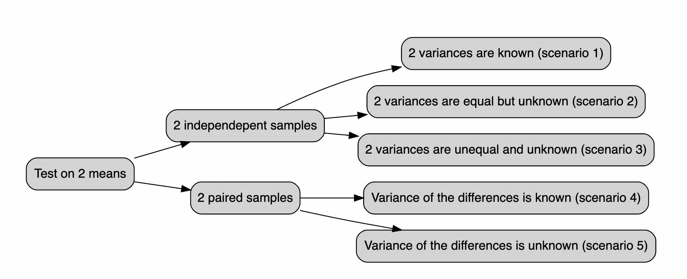
<p class="caption">(\#fig:ttest)The t.test vademecum</p>
</div>


## `t.test()` function


The `t.test()` function may run one and two sample t-tests on data vectors. The function has several parameters and is invoked as follows:


```r
t.test(x, y = NULL, alternative = c("two.sided", "less", "greater"), mu = 0, 
        paired = FALSE, var.equal = FALSE, conf.level = 0.95)
```

In this case, `x` is a numeric vector of data values, and `y` is optional. If `y` is not included, the function does a one-sample t-test on the data in `x`; if it is included, the function runs a two-sample t-test on both `x` and `y`.

The `mu` (i.e. $\mu$) argument returns a number showing the real value of the mean (or difference in means if a two sample test is used) under the null hypothesis. The test conducts a two-sided t-test by default; however, you may perform an alternative hypothesis by changing the `alternative` argument to `"greater"` or `"less"`, depending on whether the alternative hypothesis is that the mean is larger than or smaller than `mu`. Consider the following:


```r
t.test(x, alternative = "less", mu = 25)
```


…performs a one-sample t-test on the data contained in `x` where the null hypothesis is that $ \mu  =  25$ and the alternative is that $  \mu < 25 $

The `paired` argument will indicate whether or not you want a paired t-test. The default is set to `FALSE` but can be set to `TRUE` if you desire to perform a paired t-test. We do paired test when we are considering pre-post treatment test or when we are considering couples of individuals.

When doing a two-sample t-test, the `var.equal` option specifies whether or not to assume equal variances. The default assumption is unequal variance and the Welsh approximation to degrees of freedom; however, you may change this to `TRUE` to pool the variance.

Finally, the `conf.level` parameter specifies the degree of confidence in the reported confidence interval for $\mu$ in the one-sample and for $\mu_1 - \mu_2$ two-sample cases. Below a very simple example:


To use the `lm()` function in R for linear modeling, you can create a Markdown document to explain its usage and its various arguments. Below is an example of how to create a conceptual guide in RMarkdown format:

## Linear Modeling with lm() in R

## Introduction

The `lm()` function in R is used for performing linear regression modeling. Linear regression is a statistical method that models the relationship between a dependent variable and one or more independent variables. In this document, we will explore how to use the `lm()` function and its various arguments for linear modeling.

## Basic Usage

To perform linear modeling with `lm()`, you need to specify the formula of the linear regression model. The basic syntax is as follows:


```r
model <- lm(dependent_variable ~ independent_variable, data = your_data)
```

- `dependent_variable`: The variable you want to predict.
- `independent_variable`: The variable(s) used to make the prediction.
- `data`: The data frame containing your variables.

## Arguments

### Formula

The formula is at the core of the `lm()` function and specifies the relationship between the dependent and independent variables. It follows the `Y ~ X` pattern, where `Y` is the dependent variable, and `X` is the independent variable. You can include multiple independent variables and interactions by using `+` and `*`. For example:


```r
model <- lm(y ~ x1 + x2 + x1*x2, data = your_data)
```

### Data

The `data` argument should point to the data frame where your variables are located. This argument helps R locate the variables specified in the formula.

### Subset

You can use the `subset` argument to specify a subset of your data for modeling. This is useful when you want to focus on a specific portion of your dataset.


```r
model <- lm(y ~ x, data = your_data, subset = condition)
```

### Weight

The `weight` argument allows you to assign different weights to each data point. This can be useful when you want to give more importance to certain observations.


```r
model <- lm(y ~ x, data = your_data, weights = weight_variable)
```

### Na.action

The `na.action` argument controls how missing values are treated. By default, `na.action = na.fail`, which means the model will fail if there are missing values in your data. You can also use `na.omit` to automatically remove rows with missing values.


```r
model <- lm(y ~ x, data = your_data, na.action = na.omit)
```

### Other Arguments

There are additional arguments for controlling aspects of the modeling process, such as `offset`, `method`, and `control`. You can refer to the R documentation for a complete list of available arguments and their descriptions.

## VIF (Variance Inflation Factor)

The Variance Inflation Factor (VIF) is a measure used to detect multicollinearity in a linear regression model. Multicollinearity occurs when independent variables in the model are highly correlated, making it challenging to determine the individual effect of each variable on the dependent variable. The `VIF` function from the `regclass` package in R can help us identify multicollinearity in our linear regression model.

### Calculating VIF

To calculate the VIF for the independent variables in your model, you can use the `VIF()` function. First, make sure you have the `regclass` package installed and loaded:


```r
install.packages("regclass")
library(regclass)
```

Next, you can calculate VIF for your linear regression model as follows:


```r
# Fit a linear regression model
model <- lm(formula  = y ~ x1 + x2 + x3, data = your_data)

# Calculate VIF
vif_results <- VIF(model)
```

The `VIF()` function takes the linear regression model as its argument and returns a data frame with VIF values for each independent variable. Higher VIF values indicate stronger multicollinearity, typically with a threshold of 5 or 10 as a rule of thumb.

### Interpreting VIF

- If VIF is close to 1, it suggests that the variable is not highly correlated with other independent variables, indicating no significant multicollinearity.

- If VIF is greater than 1 but less than a chosen threshold (e.g., 5 or 10), it suggests some correlation but not necessarily problematic multicollinearity.

- If VIF is significantly greater than the chosen threshold (e.g., 10), it indicates a high degree of multicollinearity, and you may need to consider removing or combining variables to address this issue.

### Addressing Multicollinearity

If you detect problematic multicollinearity with high VIF values, you can take several steps to address the issue:

1. **Remove one of the correlated variables:** If two or more variables are highly correlated, removing one of them can often resolve the multicollinearity issue.

2. **Combine correlated variables:** You can create new variables that are combinations of highly correlated variables, reducing multicollinearity.

3. **Collect more data:** Sometimes, multicollinearity can be alleviated by collecting more data, especially if the sample size is small.

4. **Regularization techniques:** Consider using regularization techniques like Ridge or Lasso regression, which can handle multicollinearity by adding penalties to the coefficients of correlated variables.

VIF analysis is a crucial step in assessing the quality of your linear regression model and ensuring the independence of your independent variables.


## ANOVA (Analysis of Variance)

ANOVA, or Analysis of Variance, is a statistical technique used to analyze the differences among group means in a dataset. It is particularly useful when you want to compare the means of more than two groups. The `aov()` function in R is commonly used to perform ANOVA.

### Performing ANOVA with `aov()`

To perform ANOVA using the `aov()` function, you need to specify a formula that describes the relationship between the dependent variable and the grouping factor (categorical variable). The basic syntax is as follows:


```r
anova_model <- aov(dependent_variable ~ grouping_factor, data = your_data)
```

- `dependent_variable`: The continuous variable you want to analyze.
- `grouping_factor`: The categorical variable that defines the groups.
- `data`: The data frame containing your variables.

### ANOVA Tables

Once you've created the ANOVA model, you can obtain an ANOVA table using the `summary()` function applied to the `aov` object:


```r
summary(anova_model)
```

This table provides various statistics, including the sum of squares, degrees of freedom, F-statistic, and p-value, which allow you to assess the significance of differences among group means.

### Interpreting ANOVA

- The F-statistic in the ANOVA table tests whether there are significant differences among the group means. A small p-value (< 0.05) suggests that there are significant differences.

- If the ANOVA is not statistically significant, it indicates that there are no significant differences among the group means.

### Assumptions of ANOVA

ANOVA assumes that the variances of the groups are equal (homogeneity of variances) and that the data are normally distributed. Violations of these assumptions may lead to inaccurate results. You can check the homogeneity of variances using tests like Levene's test or Bartlett's test and assess the normality of data using normal probability plots or statistical tests like the Shapiro-Wilk test.


## Logistic Regression with `glm()`

Logistic regression is a statistical technique used for modeling the relationship between a binary dependent variable (0/1, Yes/No, True/False) and one or more independent variables. The `glm()` function in R is commonly used to perform logistic regression.

### Performing Logistic Regression with `glm()`

To perform logistic regression using the `glm()` function, you need to specify a formula that describes the relationship between the binary dependent variable and the independent variables. The basic syntax is as follows:


```r
logistic_model <- glm(formula = dependent_variable ~ independent_variable1 + independent_variable2, family = "binomial", data = your_data)
```

- `dependent_variable`: The binary dependent variable you want to model.
- `independent_variable1`, `independent_variable2`, etc.: The independent variables that influence the probability of the binary outcome.
- `family`: Specify the family argument as `binomial` to indicate logistic regression.
- `data`: The data frame containing your variables.

### Model Summary

After creating the logistic regression model, you can obtain a summary of the model's coefficients, standard errors, z-values, and p-values using the `summary()` function applied to the `glm` object:


```r
summary(logistic_model)
```

This summary provides valuable information about the influence of the independent variables on the log-odds of the binary outcome.

### Interpreting Logistic Regression

- The coefficients in the summary indicate the direction and strength of the relationship between the independent variables and the log-odds of the binary outcome.

- Positive coefficients suggest an increase in the log-odds, while negative coefficients suggest a decrease.

- The odds ratio (exp(coef)) can be used to interpret the change in the odds of the binary outcome for a one-unit change in the independent variable.

- A significant p-value (< 0.05) for a coefficient suggests that the independent variable has a significant effect on the binary outcome.

- The null hypothesis in logistic regression is that there is no relationship between the independent variable and the binary outcome.

### Model Evaluation

To evaluate the performance of your logistic regression model, you can assess its accuracy, sensitivity, specificity, and other metrics using techniques like cross-validation and ROC analysis. You can also plot the ROC curve and calculate the AUC (Area Under the Curve) to assess the model's predictive power.

### Assumptions of Logistic Regression

Logistic regression assumes that the log-odds of the binary outcome are a linear combination of the independent variables. It is important to check for violations of this assumption, which can be done through residual analysis.

## Poisson Regression with `glm()`

Poisson regression is a statistical technique used to model the relationship between a count-dependent variable (typically non-negative integers) and one or more independent variables. The `glm()` function in R is commonly used to perform Poisson regression.

### Performing Poisson Regression with `glm()`

To perform Poisson regression using the `glm()` function, you need to specify a formula that describes the relationship between the count-dependent variable and the independent variables. The basic syntax is as follows:


```r
poisson_model <- glm(formula = count_dependent_variable ~ independent_variable1 + independent_variable2, family = "poisson", data = your_data)
```

- `count_dependent_variable`: The count-dependent variable you want to model.
- `independent_variable1`, `independent_variable2`, etc.: The independent variables that influence the count-dependent variable.
- `family`: Specify the family argument as `poisson` to indicate Poisson regression.
- `data`: The data frame containing your variables.

### Model Summary

After creating the Poisson regression model, you can obtain a summary of the model's coefficients, standard errors, z-values, and p-values using the `summary()` function applied to the `glm` object:


```r
summary(poisson_model)
```

This summary provides information about the influence of the independent variables on the expected count of the dependent variable.

### Interpreting Poisson Regression

- The coefficients in the summary indicate the direction and strength of the relationship between the independent variables and the expected count of the dependent variable.

- Positive coefficients suggest an increase in the expected count, while negative coefficients suggest a decrease.

- The exponential of the coefficients (exp(coef)) can be used to interpret the multiplicative effect of a one-unit change in the independent variable on the expected count.

- A significant p-value (< 0.05) for a coefficient suggests that the independent variable has a significant effect on the expected count.

- The null hypothesis in Poisson regression is that there is no relationship between the independent variable and the expected count.


## class exercises, do it in groups 👯

first guided,

::: {.exercise #ttest1}
A state Highway Patrol periodically samples vehicle at various location on a 
particular roadway. The sample of vehicle speed is used to test the hypothesis H0 
for which the mean is less than equal to **65**

The locations where $H_0$ is rejected are deemed the best locations for radar traps.
At location F, a sample of **64** vehicles shows a mean speed of **66.2 mph** with a std 
dev of **4.2 mph**. Use a $\alpha  = 0.05$ to test the hypothesis.

:::


---

::: {.exercise #ttest6}
Let's assume to have dataset `midwest` in `ggplot2` package: this contains demographic information of midwest counties from 2000 US census.
Besides all the other variables we are interested in `percollege` which describes the Percent college educated in midwest. 

1. test if the midwest average is less than the national average (i.e. ***35%**) with a p-value < .02.

:::

----

::: {.exercise #ttest2}
Download the datafile ‘prawnGR.CSV’ from the [Data link](https://alexd106.github.io/intro2R/data.html) and save it to the data directory (Remember R projects and working directory). Import these data into R and assign to a variable with an appropriate name. These data were collected from an experiment to investigate the difference in growth rate of the **giant tiger prawn** (Penaeus monodon) fed either an artificial or natural diet. 

1. Have a quick look at the structure of this dataset.
1. plot the growth rate versus the diet using an appropriate plot.
1. How many observations are there in each diet treatment?
1. You want to compare the difference in growth rate between the two diets using a two sample t-test. 
1. Conduct a two sample t-test using the t.test() using the argument `var.equal = TRUE` to perform the t-test assuming equal variances. What is the null hypothesis you want to test? Do you reject or fail to reject the null hypothesis? What is the value of the t statistic, degrees of freedom and p value? How would you summarise these summary statistics in a report?

:::


----

::: {.exercise #ttest3}
A new coach has been hired at an athletics school, and the effectiveness of the new type of training will be evaluated by comparing the average times of 10 centimeters. The times in seconds before and after each athlete's competition are repeated.ù

    before_training: =  c(12.9, 13.5, 12.8, 15.6, 17.2, 19.2, 12.6, 15.3, 14.4, 11.3)
    after_training = c( 12.7, 13.6, 12.0, 15.2, 16.8, 20.0, 12.0, 15.9, 16.0, 11.1)

We are up against two groups of trained competitors, as measurements were taken on the same athletes before and after the competition. To determine if there has been an improvement, a deterioration, or if the time averages have remained essentially constant (i.e., H0). Conduct a test t of student for paired changes if the difference significant to a 95% confidence level?

:::

----

::: {.exercise #ttest4}
Following exercise 4 Assume that the club management, based on the statistics, fires this coach who has not improved and hires another more promising coach. Following the second training session, we record the athletes' times:

    before training: 12.9, 13.5, 12.8, 15.6, 17.2, 19.2, 12.6, 15.3, 14.4, 11.3
    after training: 12.0, 12.2, 11.2, 13.0, 15.0, 15.8, 12.2, 13.4, 12.9, 11.0

:::

----

::: {.exercise #ttest5}
Let's assume `genderweight` in `datarium` package, containing the weight of 40 individuals (20 women and 20 men).

1. which are the mean weights for male and females?
1. test is they are statistically significant with 95% confidence level

:::


::: {.exercise #anova1}
Let's assume to have a sample with this data and respective belonging group:

    x<-c(12,23,12,13,14,21,23,24,30,21,12,13,14,15,16)
    
    z<-c(1,1,1,1,1,2,2,2,2,2,3,3,3,3,3)

perform anova test with `aov()` function testing if there is significant differences between group **1**, **2** and **3**.

:::

You specify the formula, where `x` is the continous variable and `z` is the group variable.
This is how you solve it.

---

::: {.exercise #anova2}
Assume you have a dataset named `PlantGrowth` with variables `weight` (dependent variable) and `group` (categorical independent variable).

1. Perform an ANOVA analysis to compare the means of `weight` among different `group` levels.
2. Check the p-value and determine whether there are significant differences among the group means.

:::


----


::: {.exercise #anova3}

We recruit 90 people to participate in an experiment in which we randomly assign 30 people to follow either program A, program B, or program C for one month.

    #make this example reproducible
    set.seed(0)
    
    #create data frame
    data <- data.frame(program = rep(c("A", "B", "C"), each = 30),
                       weight_loss = c(runif(30, 0, 3),
                                       runif(30, 0, 5),
                                       runif(30, 1, 7)))
                                       


1. plot boxplot of weight_loss ~ program Hint: use `boxplot()` function specifying the formula.
1. fit 1 way anova to test difference in weight loss for each program.
                                       
:::

-----

::: {.exercise #anova4}
Consider the maximum size of 4 fish each from 3 populations (n=12). We want to use a model that will help us examine the question of whether the mean maximum fish size differs among populations.


    size <- c(3,4,5,6,4,5,6,7,7,8,9,10)
    pop <- c("A","A","A","A","B","B","B","B","C","C","C","C")
    
  
1. visualize it through boxplot
1. Using  ANOVA model test whether any group means differ from another. 

:::


-----

::: {.exercise #anova5}

Let's consider 6 different insect sprays in `InsectSprays` contained in R. Let's assume  we are interested in testing if there was a difference in the number of insects found in the field after each spraying, use varibales `count` and `spray`.

:::

----

::: {.exercise #anova6}
Let's consider the `diet` dataset in [this link here](https://www.kaggle.com/code/evitaginiyatullina/one-way-anova-comparison/data) The data set contains information on 76 people who undertook one of three diets (referred to as diet A, B and C). There is background information such as age, gender, and height. The aim of the study was to see which diet was best for losing weight. 

to read data first dowload it from the link, then move data inside your R project. then run these commands:

    diet = read.csv("< the dataset name>.csv")

We will be using variable `Diet`, `pre.weight` and  `weight6weeks`

1. read data from kaggle
1. compute mean weights for each group
1. calculate anova on Diet against the weight cut

:::


----


::: {.exercise #lr1}

Use the built-in `mtcars` dataset with variables mpg (miles per gallon) and vs (engine type: 0 = V-shaped, 1 = straight).

- Fit a logistic regression model to predict vs (engine type) based on mpg.
- Interpret the coefficients of the logistic regression model.


:::


----


::: {.exercise #pr1}

Use the built-in `mtcars` dataset with variables `mpg` (miles per gallon) and `gear` (number of forward gears).

- Fit a Poisson regression model to predict gear based on mpg.
- Interpret the coefficients of the Poisson regression model.

:::


----


## solutions


::: {.answer data-latex=""}
**Answer to Exercise \@ref(exr:ttest1)**:

Sample random data from a Normal distribution with a given mean and sd.
Then define **H0** and **H1**. In the end run hte test.

    x <- rnorm(n = 64, mean = 66.2, sd = 4.2)
    test<-t.test(x, mu = 65, alternative = "less")


    t = 1.469, df = 63, p-value = 0.9266
    alternative hypothesis: true mean is less than 65
    95 percent confidence interval:
     -Inf 66.80805
    sample estimates:
    mean of x 
    65.84629 

The One Sample t-test testing the difference between x (mean = 65.85)
and mu = 65 suggests that the effect is positive, statistically not
significant, and very small (difference = 0.85, 95% CI [-Inf, 66.81],
t(63) = 1.47, p = **0.927**
:::


::: {.answer data-latex=""}
**Answer to Exercise \@ref(exr:anova1)**:

    x <- c(12,23,12,13,14,21,23,24,30,21,12,13,14,15,16) 
    z <- c(1,1,1,1,1,2,2,2,2,2,3,3,3,3,3)
    z <- as.factor(z)
    anova_test <- aov(x ~ z) 
    summary(anova_test)

            Df Sum Sq Mean Sq F value Pr(>F)
    z            1    1.6    1.60   0.047  **0.832**
    Residuals   13  446.1   34.32

The ANOVA (formula: x ~ z) suggests that the main effect of z is statistically not significant and very small
(F(1, 13) = 0.05, p = 0.832; Eta2 = 3.57e-03, 95% CI [0.00, 1.00]). That means that group means are not that different
one from the other

:::


::: {.answer data-latex=""}
**Answer to Exercise \@ref(exr:anova6)**:

Assuming you have the 'plant_growth' dataset

    # 1. Perform ANOVA
    anova_model <- aov(weight ~ group, data = plant_growth)
    
    # 2. Check p-value
    summary(anova_model)


:::


::: {.answer data-latex=""}
**Answer to Exercise \@ref(exr:lr1)**:

    data(mtcars)

Convert vs to a factor variable

    mtcars$vs <- as.factor(mtcars$vs)

Fit a logistic regression model
  
    logistic_model <- glm(vs ~ mpg, family = binomial, data = mtcars)

Interpret coefficients

    summary(logistic_model)

:::


::: {.answer data-latex=""}
**Answer to Exercise \@ref(exr:pr1)**:


    data(mtcars)

Fit a Poisson regression model

    poisson_model <- glm(gear ~ mpg, family = poisson, data = mtcars)

Interpret coefficients

    summary(poisson_model)

:::


## 🍬 tips and tricks{#tips}

Yout might be interested in standardizing/fornalize how you say things with a statistical jargon, `report` does that for you.
you simply pass the test, wether it is ANOVA or t.test object inside report `report()`. Do you rememer the function `summary()` we have been using for linear regression? This is exactly that, but for both ANOVA and t tests.


```r
# install.packages("remotes")
# remotes::install_github("easystats/report")
library(report)

x <- rnorm(n = 64, mean = 66.2, sd = 4.2)
test<-t.test(x, mu = 65, alternative = "less")
report(test)
#> Effect sizes were labelled following Cohen's (1988)
#> recommendations.
#> 
#> The One Sample t-test testing the difference between x
#> (mean = 66.49) and mu = 65 suggests that the effect is
#> positive, statistically not significant, and small
#> (difference = 1.49, 95% CI [-Inf, 67.47], t(63) = 2.54, p =
#> 0.993; Cohen's d = 0.32, 95% CI [-Inf, 0.53])
```


----

when you have data in `longer` fromat there a different in syntax when you specify t test and it pretty much follows the one for linear models i.e. `lm()`.
let's look at it.

we may have something like:


```r
library(tibble)
longer = tribble( 
  ~group, ~var,
  "a",   10,
  "b",   24, 
  "a",   31,
  "a",   75,
  "b",   26,
  "a",   8,
  "b",   98,
  "b",   62,
  )
wider = tribble( 
  ~group_a, ~group_b,
   10,       24,
   31,       26,
   75,       98,
   8,        62
  )

```

Those are exaclty the same dataset but arranged in a different format. We are used to the _wider_ format but iut might happen that we bump into the _longer_ one. What do we do? There'sa trick for that, let's say you want to test if the mean are statistically different with a 95% confidence level, the instead of supplying `x` and `y` to `t.test()` you would follow pretty much the syntax for linear models `lm()`:


```r

test_for_wider_format = t.test(var~group, data =  longer)
test_for_wider_format
#> 
#> 	Welch Two Sample t-test
#> 
#> data:  var by group
#> t = -0.91809, df = 5.9192, p-value = 0.3944
#> alternative hypothesis: true difference in means between group a and group b is not equal to 0
#> 95 percent confidence interval:
#>  -78.99271  35.99271
#> sample estimates:
#> mean in group a mean in group b 
#>            31.0            52.5
```
what we conclude? we conclude that:  Effect sizes were labelled following Cohen's (1988) recommendations.

The Welch Two Sample t-test testing the difference of var by group (mean in group a = 31.00, mean in group b = 52.50) suggests that the effect is negative, statistically not significant, and medium (difference = -21.50, 95% CI [-78.99, 35.99], t(5.92) = -0.92, p = 0.394; Cohen's d = -0.75, 95% CI [-2.39, 0.94])


## further exercies 🏋️

::: {.exercise #paired1}

We have the test scores of students before and after an intervention. How can we assess if the intervention had a statistically significant effect on the scores? Specify the type of test to use and the assumptions involved.

:::

::: {.exercise #mtcars1}

Using the dataset mtcars, write the R command to calculate the mean and standard deviation of the disp variable grouped by cyl.

:::

::: {.exercise #mean_diff1}

Explain how you would assess if the mean difference between two groups is statistically significant, without running any R code.

:::

::: {.exercise #boston1}

Use the Boston dataset in MASS to create a histogram for the variable crim. Report the R code you used.

:::

::: {.exercise #pvalue1}

Describe the meaning of the p-value in the context of hypothesis testing.

:::

::: {.exercise #temp_diff1}

Given a dataset with daily temperatures recorded for two cities over one year, write the R code to perform a hypothesis test to determine if there is a significant difference in mean temperature between the cities. Specify which test should be used.

:::

::: {.exercise #corr1}

Given X = c(10, 12, 15, 20) and Y = c(11, 14, 16, 18), calculate the Pearson correlation coefficient between X and Y using R.

:::

::: {.exercise #errors1}

Explain the concept of Type I and Type II errors in hypothesis testing.

:::

::: {.exercise #plantgrowth1}

Using the PlantGrowth dataset in R, calculate the mean of weight for each level of group and plot a boxplot of weight grouped by group.

:::

::: {.exercise #ttest1}

Run a one-sample t-test to test if the mean of hp in mtcars is different from 120. Write the R code.

:::

::: {.exercise #iris1}

Using the dataset iris, write the R code to test for a significant difference between the average Sepal.Length of setosa and versicolor species.

:::

::: {.exercise #poisson1}

Write an R function to simulate 500 observations from a Poisson distribution with a lambda of 3 and plot its histogram.

:::

::: {.exercise #multicollinearity1}

Describe how to check for multicollinearity in a multiple regression model in R.

:::

::: {.exercise #airquality1}

Using the airquality dataset, calculate the correlation matrix for Ozone, Solar.R, Wind, and Temp.

:::

::: {.exercise #paired2}

Perform a paired t-test using the before and after variables where before = c(5, 7, 8, 6, 10) and after = c(6, 8, 9, 7, 12). Report the p-value.

:::

::: {.exercise #lr1}

Using the dataset mtcars, perform a linear regression with mpg as the dependent variable and hp and wt as independent variables. Report the adjusted R-squared.

:::

::: {.exercise #density1}

Write the R code to create a density plot of the variable Sepal.Length for each species in the iris dataset.

:::

::: {.exercise #anova1}

Using iris, perform a one-way ANOVA to test if the mean Sepal.Length differs across the three species.

:::

::: {.exercise #ci1}

Define the term “confidence interval” in the context of statistical estimation.

:::

::: {.exercise #stepwise1}

Using the mtcars dataset, refit a multiple linear regression model with mpg as the dependent variable and hp, wt, and drat as independent variables. Use stepwise regression to iteratively remove insignificant predictors. Report the final model with the significant coefficients.

:::

::: {.exercise #anova2}

Using the dataset ToothGrowth, perform a one-way ANOVA with the function aov() to test if the mean tooth length differs across the supplement types and doses.

:::

::: {.exercise #anova3}

We recruit 90 people to participate in an experiment in which we randomly assign 30 people to follow either program A, program B, or program C for one month.

    #make this example reproducible
    set.seed(0)
    
    #create data frame
    data <- data.frame(program = rep(c("A", "B", "C"), each = 30),
                       weight_loss = c(runif(30, 0, 3),
                                       runif(30, 0, 5),
                                       runif(30, 1, 7)))

1. plot boxplot of weight_loss ~ program Hint: use `boxplot()` function specifying the formula.
1. fit 1 way anova to test difference in weight loss for each program.

:::

::: {.answer data-latex=""}
**Answer to Exercise \@ref(exr:paired1)**:

The appropriate test to use is the paired t-test. This test is used when we have two related samples, such as before and after measurements for the same individuals, and we want to determine if there is a statistically significant difference between the means. The assumptions include that the differences are normally distributed and the data is paired.

:::

::: {.answer data-latex=""}
**Answer to Exercise \@ref(exr:mtcars1)**:

The `dplyr` package is used to calculate the mean and standard deviation of the `disp` variable grouped by `cyl`:

    library(dplyr)
    mtcars %>% group_by(cyl) %>% summarise(mean_disp = mean(disp), sd_disp = sd(disp))

:::

::: {.answer data-latex=""}
**Answer to Exercise \@ref(exr:mean_diff1)**:

To assess if the mean difference between two groups is statistically significant, we can use a hypothesis test such as the independent t-test. This involves setting up null and alternative hypotheses, calculating the test statistic, and comparing it to a critical value or using the p-value to determine significance, typically using a significance level (e.g., 0.05).

:::

::: {.answer data-latex=""}
**Answer to Exercise \@ref(exr:boston1)**:

To create a histogram of the `crim` variable from the Boston dataset, use the following code:

    library(MASS)
    data(Boston)
    hist(Boston$crim, main = "Histogram of crim", xlab = "Crime rate per capita")

:::

::: {.answer data-latex=""}
**Answer to Exercise \@ref(exr:pvalue1)**:

The p-value is the probability of obtaining test results at least as extreme as the observed results, under the assumption that the null hypothesis is true. A smaller p-value indicates stronger evidence against the null hypothesis, and if the p-value is below a chosen significance level (e.g., 0.05), we reject the null hypothesis.

:::

::: {.answer data-latex=""}
**Answer to Exercise \@ref(exr:temp_diff1)**:

The appropriate test to use is the two-sample t-test, as we are comparing the means of two independent groups. The R code is as follows:

    t.test(temp_city1, temp_city2, var.equal = TRUE)

:::

::: {.answer data-latex=""}
**Answer to Exercise \@ref(exr:corr1)**:

To calculate the Pearson correlation coefficient between vectors `X` and `Y`:

    X <- c(10, 12, 15, 20)
    Y <- c(11, 14, 16, 18)
    cor(X, Y)

:::

::: {.answer data-latex=""}
**Answer to Exercise \@ref(exr:errors1)**:

A Type I error occurs when we reject a true null hypothesis (false positive), while a Type II error occurs when we fail to reject a false null hypothesis (false negative).

:::

::: {.answer data-latex=""}
**Answer to Exercise \@ref(exr:plantgrowth1)**:

To calculate the mean of `weight` for each level of `group` and plot a boxplot of `weight` grouped by `group`:

    data(PlantGrowth)
    aggregate(weight ~ group, data = PlantGrowth, mean)
    boxplot(weight ~ group, data = PlantGrowth, main = "Boxplot of Weight by Group")

:::

::: {.answer data-latex=""}
**Answer to Exercise \@ref(exr:ttest1)**:

To run a one-sample t-test to test if the mean of `hp` in `mtcars` is different from 120:

    t.test(mtcars$hp, mu = 120)

:::

::: {.answer data-latex=""}
**Answer to Exercise \@ref(exr:iris1)**:

To test for a significant difference between the average `Sepal.Length` of setosa and versicolor species:

    t.test(Sepal.Length ~ Species, data = subset(iris, Species %in% c("setosa", "versicolor")))

:::

::: {.answer data-latex=""}
**Answer to Exercise \@ref(exr:poisson1)**:

To simulate 500 observations from a Poisson distribution with a lambda of 3 and plot its histogram:

    set.seed(0)
    poisson_data <- rpois(500, lambda = 3)
    hist(poisson_data, main = "Histogram of Poisson Distribution", xlab = "Values")

:::

::: {.answer data-latex=""}
**Answer to Exercise \@ref(exr:multicollinearity1)**:

To check for multicollinearity, we can use the Variance Inflation Factor (VIF). A VIF value greater than 10 indicates high multicollinearity:

    library(car)
    vif(model)

:::

::: {.answer data-latex=""}
**Answer to Exercise \@ref(exr:airquality1)**:

To calculate the correlation matrix for `Ozone`, `Solar.R`, `Wind`, and `Temp` in the `airquality` dataset:

    airquality_subset <- airquality[, c("Ozone", "Solar.R", "Wind", "Temp")]
    cor(airquality_subset, use = "complete.obs")

:::

::: {.answer data-latex=""}
**Answer to Exercise \@ref(exr:paired2)**:

To perform a paired t-test using the `before` and `after` variables:

    before <- c(5, 7, 8, 6, 10)
    after <- c(6, 8, 9, 7, 12)
    t.test(before, after, paired = TRUE)

:::

::: {.answer data-latex=""}
**Answer to Exercise \@ref(exr:lr1)**:

To perform a linear regression with `mpg` as the dependent variable and `hp` and `wt` as independent variables, and report the adjusted R-squared:

    model <- lm(mpg ~ hp + wt, data = mtcars)
    summary(model)$adj.r.squared

:::

::: {.answer data-latex=""}
**Answer to Exercise \@ref(exr:density1)**:

To create a density plot of the variable `Sepal.Length` for each species in the `iris` dataset:

    library(ggplot2)
    ggplot(iris, aes(x = Sepal.Length, fill = Species)) +
      geom_density(alpha = 0.5) +
      labs(title = "Density Plot of Sepal.Length by Species")

:::

::: {.answer data-latex=""}
**Answer to Exercise \@ref(exr:anova1)**:

To perform a one-way ANOVA to test if the mean `Sepal.Length` differs across the three species:

    aov_model <- aov(Sepal.Length ~ Species, data = iris)
    summary(aov_model)

:::

::: {.answer data-latex=""}
**Answer to Exercise \@ref(exr:ci1)**:

A confidence interval is a range of values, derived from sample statistics, that is likely to contain the population parameter with a specified level of confidence (e.g., 95%). It provides an estimated range that is expected to include the true parameter value.

:::

::: {.answer data-latex=""}
**Answer to Exercise \@ref(exr:stepwise1)**:

To refit a multiple linear regression model with `mpg` as the dependent variable and `hp`, `wt`, and `drat` as independent variables, using stepwise regression:

    library(MASS)
    initial_model <- lm(mpg ~ hp + wt + drat, data = mtcars)
    stepwise_model <- stepAIC(initial_model, direction = "both")
    summary(stepwise_model)

:::

::: {.answer data-latex=""}
**Answer to Exercise \@ref(exr:anova2)**:

To perform a one-way ANOVA using the `ToothGrowth` dataset to test if the mean tooth length differs across the supplement types and doses:

    data(ToothGrowth)
    aov_model <- aov(len ~ supp * dose, data = ToothGrowth)
    summary(aov_model)

:::

::: {.answer data-latex=""}
**Answer to Exercise \@ref(exr:anova3)**:

To plot a boxplot of `weight_loss` by `program` and fit a one-way ANOVA to test the difference in weight loss for each program:

    # Plot boxplot
    boxplot(weight_loss ~ program, data = data, main = "Boxplot of Weight Loss by Program", xlab = "Program", ylab = "Weight Loss")
    
    # Fit one-way ANOVA
    aov_model <- aov(weight_loss ~ program, data = data)
    summary(aov_model)

:::


<!--chapter:end:06ter-lab-prep-to-intermediate.Rmd-->

# 💻 First Intermediate Sample Questions {#int-samp-q-first}

Hi guys, this is your favourite **TA**, I am just aggregating questions that have been asked in previous exam sessions the previous years i.e. 2020/2021 and 2021/2022. They are representative of the actual exam, but you know, take it like a grain of salt. 

I will also make sure to provide to you some other exercises if you are still anxious.


## 👨‍🎓 2020/2021


::: {.exercise #int1}

Write the line of the R command that you use to produce a boxplot of the variable X

:::


----

::: {.exercise #int2}

We want to test statistically the hypothesis that the performances of students at UCSC in Rome that graduated last year are better than those that graduated this year. Can we say that this is a paired sample test ?


:::

----

::: {.exercise #int3}

Without using formulae, describe how you can calculate the test statistics in a hypothesis testing procedure on a single mean with known variance.


:::

-----

::: {.exercise #int4}

Using the dataset Boston downloaded from the library spdep, write the correlation matrix of the variables MEDV, NOX and CRIM.


:::


----

::: {.exercise #int5}

How do you define the confidence of a statistical test? 

:::

----

::: {.exercise #int6}

Given the following 2 variables X = (1,5,3,3,5,5) and Y= (4,4,6,3,2,3), write the cross-tabulation between X and Y.

:::

----

::: {.exercise #int7}


Write the line of the R command that you use to simulate 1000 random observation from normal distribution with 0 mean and variance = 0.5. 

:::


----


::: {.exercise #int8}

A law company is evaluating the performances of two departments measuring in terms of the time required for solving a conflict in the last year. The observed values are reported in the following table:

...

can we accept the hypothesis H0: (the mean of Dept 1 is equal to the mean of Dept 2) versus a bilateral alternative hypothesis? (F)

:::


----

::: {.exercise #int9}

A company has recorded the number of costumers in 10 sample stores before (variable X) and after (Variable Y) a new advertising campaign was introduced. The observed values are reported in the following table

...

write the p-value of the test with H0: (the mean of X is equal to the mean of Y) versus a bilateral alternative hypothesis. (	0,000341138)

:::

----

::: {.exercise #int12}
The HR office of a cleaning company wants to test if there is a gender discrimination between its employees. Call X = the income of a set of 20 male workers and Y = the income of a set of 35 female workers. Write the line R command to run an appropriate test of hypothesis.

:::


----


::: {.exercise #int13}
What is the power of statistical test? 

:::

----

::: {.exercise #int14}
Using the dataset `boston.c` downloaded from the library `spdep`, calculate the coefficient of skewness of the variable RM.

:::

 
::: {.answer data-latex=""}
**Answer to Exercise \@ref(exr:int14)**:

    library(moments)
    skewness(boston.c$RM)

    0,4024147

:::


----


::: {.exercise #int16}

How do you define the significance of a statistical test? 

:::


## 👨‍🎓 2021/2022


::: {.exercise #int17}

Given the dataset “Duncan” in the library “carData” estimate the regression model where the variable prestige is regressed on the variables income Looking at the following information,

    Residuals:

    Min      1Q  Median      3Q     Max

    -29.538  -6.417   0.655   6.605  34.641

Do residuals display.

:::

-----

::: {.exercise #int18}

What are the consequences of **collinearity** among regressors?


1. Estimators become biased
1. Estimators become inefficient
1. Estimators become inconsistent
1. Estimators become unstable

:::

----


::: {.exercise #int19}

What is the correct definition of the **variance inflation factor** i.e. VIF?


1. $1-R2$ 
1. $\frac{1}{R2}$  
1. $\frac{1}{1-R2}$
1. $1-\frac{1}{R2}$

:::


::: {.answer data-latex=""}
**Answer to Exercise \@ref(exr:int19)**:

A general guideline is that a VIF larger than 5 or 10 is large, indicating that the model has problems estimating the coefficient. However, this in general does not degrade the quality of predictions. If the VIF is larger than 1/(1-R2), where R2 is the Multiple R-squared of the regression, then that predictor is more related to the other predictors than it is to the response.

    install.packages("regclass")
    library(regclass)
    VIF(modello_regressione)
    
alternatively you can use the library `car` and use `vif()` function

    install.packges("car")
    library(car)
    vif(modello_regressione)

:::

----


::: {.exercise #int20}

Using only the following variables `minority` , `crime` , `poverty` , `language`  `highschool` and `housing` of the `Ericksen` data in the library `carData`, run a factor analysis. What is the percentage explained by the first two factors?


risposta: **90.130.001**

:::

-----


::: {.exercise #int21}

In a multiple linear regression model y= a+bx1+cx2, if Correlation(x1,x2)=0.9, do we have to discard one of the two variables for collinearity?


risposta: **F**

:::

----

::: {.exercise #int23}

Given the dataset `Duncan` in the library `carData` estimate the regression model where the variable `prestige` is regressed on the variables `income` and `education`. Which variable is the most significant?

1. Education
1. income

:::


::: {.answer data-latex=""}
**Answer to Exercise \@ref(exr:int23)**:

at first you load data from `Duncan` dataset 

    library(carData)
    data("Duncan")

Then you specify the model and produce sumamries:

    duncan_regression = lm(prestige~ income + education, data= Duncan)
    summary(duncan_regression)
    
you look at pvalues and 

    Coefficients:
                Estimate Std. Error t value   Pr(>|t|)    
    (Intercept) -6.06466    4.27194  -1.420      0.163    
    income       0.59873    0.11967   5.003 0.00001053 ***
    education    0.54583    0.09825   5.555 0.00000173 ***


education is significant more than income since *0.00000173* < *0.00001053*


:::


-----

::: {.exercise #int25}

In a multiple linear regression model y= a+bx1+cx2, what is the level of correlation between x1 and x2 beyond which we have to discard one of the two variables for collinearity?

risposta:  **0.948**

:::

-----

::: {.exercise #int26}

Given the dataset `Duncan` in the library `carData` estimate the regression model where the variable `prestige` is regressed on the variables `income` and `education`. What is the p-value of the coefficient of the variable `education`?


:::


::: {.answer data-latex=""}
**Answer to Exercise \@ref(exr:int26)**:

at first you load data from `Duncan` dataset 

    library(carData)
    data("Duncan")

Then you specify the model and produce sumamries:

    duncan_regression = lm(prestige~ income + education, data= Duncan)
    summary(duncan_regression)
    
you look at pvalues and 

    Coefficients:
                Estimate Std. Error t value   Pr(>|t|)    
    (Intercept) -6.06466    4.27194  -1.420      0.163    
    income       0.59873    0.11967   5.003 0.00001053 ***
    education    0.54583    0.09825   5.555 0.00000173 ***


The pvalue for the coefficient is **0.00000173**

you may want to directly access to it instead of just copying and pasting from console sumamry output

:::


-----


::: {.exercise #int27}

What is the reason for adjusting the R2 in a multiple regression


1. To account for the number of degrees of freedom
1. To account for the number of parameters
1. To reduce the uncertainty
1. To adjust for variance inflation factor

rispoasta: **To account for the number of degrees of freedom**

:::


----


::: {.exercise #int28}

Given the dataset `Duncan` in the library `carData` estimate the regression model where the variable `prestige` is regressed on the variables `income`. Using the VIF, do we have to exclude some variable due to collinearity?


result: F

:::


::: {.answer data-latex=""}
**Answer to Exercise \@ref(exr:int28)**:

at first you load data from `Duncan` dataset 

    library(carData)
    library(car)
    data("Duncan")

Then you specify the model and produce sumamries:

    duncan_regression = lm(prestige~ income + education, data= Duncan)
    vif(duncan_regression)
    

Then the output will look like something like.


     income education 
     2.1049    2.1049 
    
Since they are below **10** which is the rule of thumb we gave to ourselves to assess multicollinearity then we conclude that neither `income` nor `education` are collinear.
    
  
:::


----

::: {.exercise #int29}

Given the dataset `Duncan` in the library `carData` estimate the regression model where the variable `prestige` is regressed on the variables `income`. What is the value of the t value of the coefficient of the variable `education`?

:::


::: {.answer data-latex=""}
**Answer to Exercise \@ref(exr:int29)**:

at first you load data from `Duncan` dataset 

    library(carData)
    data("Duncan")

Then you specify the model and produce sumamries:

    duncan_regression = lm(prestige~ income + education, data= Duncan)
    summary(duncan_regression)
    

Then the output will look like something like.

    Coefficients:
                Estimate Std. Error t value   Pr(>|t|)    
    (Intercept) -6.06466    4.27194  -1.420      0.163    
    income       0.59873    0.11967   5.003 0.00001053 ***
    education    0.54583    0.09825   5.555 0.00000173 ***
    

By inspecting the summary wee obtain that the t value (t value column in the summary) dor variable `education` is **5.555**
  
:::


----


::: {.exercise #int29}

Using only the following variables `minority` , `crime` , `poverty` , `language`, `highschool` and `housing` of the `Ericksen` data in the library `carData`, run a cluster analysis using the k-means method. If we divide the observations in 4 classes what is the frequency of the largest class ? 

result: **26**

:::

----

::: {.exercise #int30}

Using only the following variables `minority` , `crime` , `poverty` , `language`, `highschool` and `housing` of the `Ericksen` data in the library `carData`, run a cluster analysis using the **k-means method**. What is the percentage explained by the first factor?


risposta: 7.391.719

:::

----

::: {.exercise #int31}


Using only the following variables `minority` , `crime` , `poverty` , `language`, `highschool` and `housing` of the `Ericksen` data in the library `carData`, run a cluster analysis using the **hierarchical method**. If we divide the observations in 10 classes what is the frequency of the largest class ? 

risposta: 27

:::


----

::: {.exercise #int32}

Given the dataset `Duncan` in the library `carData` estimate the regression model where the variable `prestige` is regressed on the variables `income` and `education` and report the $R^2$.

:::

::: {.answer data-latex=""}
**Answer to Exercise \@ref(exr:int32)**:

at first you load data from `Duncan` dataset 

    library(carData)
    data("Duncan")

Then you specify the model and produce sumamries:

    duncan_regression = lm(prestige~ income + education, data= Duncan)
    summary(duncan_regression)
    

Then the output will look like something like.

    Residual standard error: 13.37 on 42 degrees of freedom
    Multiple R-squared:  0.8282,	Adjusted R-squared:   0.82 
    F-statistic: 101.2 on 2 and 42 DF,  p-value: < 0.00000000000000022
        

By inspecting the lowe end of the summary we obtain that the R2 (multiple) for the model is **0.8282**, which is high.
  
:::


----


## 👨‍🎓 2022/2023 

::: {#intres1 .exercise}
Using the dataset `Boston` downloaded from the library `spdep`,
calculate the coefficient of skewness of the variable `RM`.
:::

----

::: {#intres2 .exercise}
How do you define the significance of a statistical test?
:::

----


::: {#intres3 .exercise}
What is the power of statistical test?
:::


----

::: {#intres4 .exercise}
How do you define the confidence of a statistical test?
:::


----


::: {#intres5 .exercise}
A law company is evaluating the performances of two departments
measuring in terms of the time required for solving a conflict in the
last year. The observed values are reported in the following table:

    perf_table = data.frame(
      stringsAsFactors = FALSE,
                 month = c("january","febraury","march",
                           "april","may","june","july","august","september",
                           "october","november","december"),
                dept_1 = c(NA, NA, NA, 3L, 6L, 9L, 7L, 5L, 7L, 3L, 4L, 6L),
                dept_2 = c(4L, 3L, 9L, 5L, 7L, 2L, 6L, 3L, 6L, 7L, 4L, 1L)
    )
    )

can we reject the hypothesis H0: (the mean of Dept 1 is equal to the
mean of Dept 2) versus a bilateral alternative hypothesis?

:::


----


::: {#intres6 .exercise}

A company has recorded the number of costumers in 10 sample stores
before (variable X) and after (Variable Y) a new advertising campaign
was introduced. The observed values are reported in the following table:

    stores = data.frame(
         n_store = c(1L, 2L, 3L, 4L, 5L, 6L, 7L, 8L, 9L, 10L),
          before = c(113L, 110L, 108L, 108L, 103L, 101L, 96L, 101L, 104L, 98L),
           after = c(125L, 113L, 115L, 117L, 105L, 112L, 100L, 103L, 116L, 104L)
    )

can we reject the hypothesis H0: (the mean of X, i.e. before is equal to
the mean of Y, i.e. after) versus a bilateral alternative hypothesis?

:::


----


::: {#intres7 .exercise}

Write the line of the R command that you use to simulate 2000 random
observation from normal distribution with 0 mean and variance = 0.1

:::

Many of you fall into this **trap!**. Tip: always use the "tab" for
automatic suggestion but also check what are arguments. In this case
exercise wants you to sample from a normal distribution with **2000**
instances (data points), **0** mean and **variance = 0.1**. The argument
in `rnorm` is sd not var, so you have to apply the square root!

::: {.answer data-latex=""}
**Answer to Question** \@ref(exr:intres7):

    rnorm(n = 2000, mean = 0, sd = 0.1^(1/2))
    
:::


----


::: {#intres8 .exercise}

Write the line of the R command that you use to produce a boxplot of the
variable X

:::

----


::: {#intres9 .exercise}

Given the following 2 variables `X = (5,5,3,3,5,5)` and
`Y= (4,4,3,3,3,3)`, test if the mean of X is significantly different
from the mean of Y. Report the p-value of the appropriate test and your
decision.

:::


----


::: {#intres10 .exercise}

Using the dataset `boston.c` downloaded from the library `spdep`, write
the elements of the correlation matrix of the variables `MEDV`, `NOX` and
`CRIM`.

:::


----


::: {#intres11 .exercise}

Without using formulae, describe how you can calculate the test
statistics in a hypothesis testing procedure on a single mean with known
variance.

:::


----

::: {#intres12 .exercise}

The HR office of a cleaning company wants to test if there is significant difference in the salary between males and females. Call X = the salary of a set of **2000** male workers and Y = the salary of a set of **150** female workers. From previous survey we know that the **variances of the two groups are equal**. Write the line R command to run an appropriate test of hypothesis.

:::


----


::: {#intres13 .exercise}

We want to test statistically the hypothesis that the students at UCSC
in Rome have better performances in the second year than in first year
year. Can we say that this is a paired sample test?

:::


----


::: {#intres14 .exercise}
Using the dataset `iris` test if there is a significant difference
between the mean of `Petal.Length` and the mean of `Sepal.Width` and
report the outcome value of the t-test.
:::


----


::: {#intres15 .exercise}

Using the dataset `iris` calculate the correlation between
`Sepal.Length` and `Sepal.Width`.

:::

-----

::: {#intres16 .exercise}

Using the dataset `iris` report the highest correlation coefficient that
you find between the four variables.

:::


----


::: {#intres161 .exercise}

Using the dataset `iris` report the highest correlation coefficient that
you find between the four variables.

:::


----


::: {#intres17 .exercise}

Using the dataset `iris` report the variance of `Sepal.Length`

:::


-----


::: {#intres18 .exercise}

Using the dataset `iris` report the third quartile of `Sepal.Length`

:::


----

::: {#intres19 .exercise}

What is the reason for adjusting the R2 in a multiple regression?


:::


----


::: {#intres20 .exercise}

What is the correct definition of the variance inflation factor?

:::

----

::: {#intres21 .exercise}

What are the consequences of **collinearity** among regressors?


:::


----


::: {#intres22 .exercise}

Using the dataset `Wong` from the R library `carData`, estimate a
multiple linear regression where the variable `piq` is expressed as a
function of `age`, `days` and `duration.`

After the check of collinearity and of significance choose the best
model.

Which variables are retained in the model? (retained means
*tratteresti*)


:::

-----


::: {#intres23 .exercise}
sing the dataset `Wong` from the R library `carData`, estimate a
multiple linear regression where the variable `piq` is expressed as a
function of `age`, `days` and `duration.`

After the check of collinearity and of significance choose the best
model.

What is the value of the **adjusted R squared** in the best model

:::


----


::: {#intres24 .exercise}

sing the dataset `Wong` from the R library `carData`, estimate a
multiple linear regression where the variable `piq` is expressed as a
function of `age`, `days` and `duration.`

After the check of collinearity and of significance choose the best
model.

What is the estimated coefficient of the variable `duration` in the best
model?

:::

-----


::: {#intres25 .exercise}

sing the dataset `Wong` from the R library `carData`, estimate a
multiple linear regression where the variable `piq` is expressed as a
function of `age`, `days` and `duration.`

After the check of collinearity and of significance choose the best
model.

What is the estimated value of the `intercept` in the best model?


:::


----


::: {#intres26 .exercise}

sing the dataset `Wong` from the R library `carData`, estimate a
multiple linear regression where the variable `piq` is expressed as a
function of `age`, `days` and `duration.`

After the check of collinearity and of significance choose the best
model.

What is the **p-value** of the variable `duration` in the best model?


:::


----


::: {#intres27 .exercise}


sing the dataset `Wong` from the R library `carData`, estimate a
multiple linear regression where the variable `piq` is expressed as a
function of `age`, `days` and `duration.`

After the check of collinearity and of significance choose the best
model.

What is the value of the **R square** in the best model

:::


----


::: {#intres28 .exercise}

Using the dataset `iris`, test if the average of the variable
`Sepal.Length` changes significantly in the three `Species` considered.
Report here the p-value of the appropiate test.

:::

We look at `Species` (we have already gone through that during lecture)
by inspecting the dataset. What we see is that `Species` has three
categories *setosa*, *versicolor* and *virginica*. If we would like to
compare means across these 3 different categories we can't use
`t.test()` since they are 3. Instead we use **ANOVA** with the `aov()`.
Sintax is similar to linear models. We saw this when we were trying to
tackle "long" format data vs. "wide" format data.

::: {.answer data-latex=""}
**Answer to Question** \@ref(exr:intres28):

    test_species = aov(Sepal.Length~Species, data = iris)
    summary(test_species)

resulting in **0.0000000000000002**, very significant. We can conclude
that: The ANOVA (formula: Sepal.Length \~ Species) suggests that the
main effect of Species is statistically significant and large.

:::


-----


::: {#intres29 .exercise}

Using the dataset `iris`, test if the average of the variable
`Sepal.Length` differs significantly in the three `Species`, Report here
the value of the test statistic.


:::


## solutions

::: {.answer data-latex=""}
**Answer to Question** \@ref(exr:intres1):

    library(spdep)

you are not required to load data in this case since the package already
does it for you. SO you just need to type `boston.c` and you find it.
Then you need to extract `RM`

    RM_var = boston.c$RM

There are a nunber of packages that makes you able to compute skewness,
there are some: `e1071`, `moments`, `PerformanceAnalytics` etc. I will
suggest to use moments. So if you dont have it installed execute:

    install.packages("moments")
    library(moments)

Then use teh function `skewnes` on `RM_var`

    skewness(RM_var)
:::


::: {.answer data-latex=""}
**Answer to Question** \@ref(exr:intres2):

The probability of type I error, The probability of rejecting H0 when H0
it is true
:::

::: {.answer data-latex=""}
**Answer to Question** \@ref(exr:intres3):

1 minus the probability of type II error, The probability of accepting
H0 when H0 it is true.
:::


::: {.answer data-latex=""}
**Answer to Question** \@ref(exr:intres4):

The probability of accepting H0 when H0 it is true.
:::


::: {.answer data-latex=""}
**Answer to Question** \@ref(exr:intres5):

H0: $\mu_{dept1} = \mu_{dept2}$ H1: $\mu_{dept1} \neq \mu_{dept2}$

Remember you always test the alternative hypothesis H1. If the pvalue
for the t test is not statistically significant then you reject H1 and
conversely you accept H0, in this case means being the same (they are
different but that's because of randomness in data, i.e. sampling
variation).

    t.test(x = perf_table$dept_1, y = perf_table$dept_2, paired = F, alternative = "two.sided")

Then we look at the p-value for this test and we see something like:
**0.4076**, so we can conclude that the Two Sample t-test testing the
difference between dept_1 and dept_2 (mean of dept_1 = 5.56, mean of
dept_2 = 4.75) suggests that the effect is positive, statistically **not
significant, and small**. So we reject the alt. hypo H1 and accept H0.

The question tells you if you can reject the Null Hypo, this is not the
case since you just accepted it!

:::


::: {.answer data-latex=""}
**Answer to Question** \@ref(exr:intres6):

This is exactly the same reasoning as before except that this is a
paired t test. "Are we talking about the same individuals? are we
checking individuals pre and after a treatment?" **YES**

    t.test(x = stores$before, y = stores$after, paired = T, alternative = "two.sided")

Look at the p-value: **p-value = 0.0004646**.this is really small. SO we
can conclude that the Paired t-test testing the difference between
before and after (mean difference = -6.80) suggests that the effect is
negative, statistically significant, and large.

:::


::: {.answer data-latex=""}
**Answer to Question** \@ref(exr:intres7):

    rnorm(n = 2000, mean = 0, sd = 0.1^(1/2))
    
:::


::: {.answer data-latex=""}
**Answer to Question** \@ref(exr:intres8):

    boxplot(X)
    
:::

::: {.answer data-latex=""}
**Answer to Question** \@ref(exr:intres9):

you at first define vectors X and Y by executing:

    X = c(5,5,3,3,5,5)
    Y = c(4,4,3,3,3,3)
    t.test(X, Y, alternative = "two.sided", paired = F)

so the answer may look something like: The (Welch, remember we did not
check variance so we rely on default R behavior applying a
transformation to t.test) Sample t-test testing the difference between X
and Y (mean of x = 4.33, mean of y = 3.33) suggests that the effect is
positive, statistically not significant, and large given the pvalue
being **0.0697**. However this would also be significant if the alpha
level of significance was 10%.

:::


::: {.answer data-latex=""}
**Answer to Question** \@ref(exr:intres10):

    library(spdep)
    library(dplyr)
    new_boston = select(boston.c, MEDV, NOX, CRIM)
    cor(new_boston)
    

Note that the principal diag for the matrix is all 1s. This is because
you a variables has perfect correlation with itself. You are just
interested in the upper triangle. You might also be interested in
visualizing it with `corrplot`. Install it
`install.packages("corrplot")` then pass the matrix as the argument
`corrplot(cor(new_boston))`


:::


::: {.answer data-latex=""}
**Answer to Question** \@ref(exr:intres11):

the test statistic is calculated seeing, for example, how many times the
absolute difference between the sample mean and the population mean
(sm-mu) embodies the standard error = sqrt[(known variance)/n]. This
value allow us to standardize the distribution and allocate the value in
a Normal distribution (if the variance is known) or in a T di Student
distribution (variance unknown) - looking at this value we can now
calculate the probability that it is within the range of values
established by the level of confidence of the statistical test.

:::


::: {.answer data-latex=""}
**Answer to Question** \@ref(exr:intres12):

    t.test(X, Y, paired = F, alternative ="less", var.equal = T)
    
:::

::: {.answer data-latex=""}
**Answer to Question** \@ref(exr:intres13):

**FALSE**

:::

::: {.answer data-latex=""}
**Answer to Question** \@ref(exr:intres15):

simple correlation aight?!

    cor(x = iris$Sepal.Length, y = iris$Sepal.Width)
    
:::

::: {.answer data-latex=""}
**Answer to Question** \@ref(exr:intres16):

Please note that correlation with `cor()` can be computed with only
numeric values. Looking at `iris` you see the variable `species` which
is a factor (aka grouping variable) we used that for ANOVA `aov()` when
we are interested in comparing means across more than 2 groups. As a
result you need to select all the variables but `Species` and do
`cor()`.

    iris_filtr = select(iris, Sepal.Length, Sepal.Width, Petal.Length, Petal.Width)
    cor(iris_filtr)

there's another way to do the filtering stuff, you just deselect
`Species` such that:

    iris_filtr2 = select(iris, -Species)
    cor(iris_filtr2)


You also might want to visualize the correlation as we did before (advanced trick):

    library(corrplot)
    iris_filtr2 = select(iris, -Species)
    corrplot::corrplot(cor(iris_filtr2))
        
:::

::: {.answer data-latex=""}
**Answer to Question** \@ref(exr:intres161):

    iris_filtr = select(iris, Sepal.Length, Sepal.Width, Petal.Length, Petal.Width)
    cor(iris_filtr)

there's another way to do the filtering stuff, you just deselect
`Species` such that:

    iris_filtr2 = select(iris, -Species)
    cor(iris_filtr2)
        
:::

::: {.answer data-latex=""}
**Answer to Question** \@ref(exr:intres17):

    var(iris$Sepal.Length)
    
:::


::: {.answer data-latex=""}
**Answer to Question** \@ref(exr:intres18):

    summary(iris$Sepal.Length)
    
  
:::


::: {.answer data-latex=""}
**Answer to Question** \@ref(exr:intres19):

Adjusted R2 is a corrected goodness-of-fit (model accuracy) measure for linear models. It identifies the percentage
of variance in the target field that is explained by the input or
inputs. R2 tends to optimistically estimate the fit of the linear
regression. It always increases as the number of effects are included in
the model. Adjusted R2 attempts to correct for this overestimation.
Adjusted R2 might decrease if a specific effect does not improve the
model. If you guessed the `To account for the number of parameters` this
would also get you some points, But more precisely we are talking about
the **degrees of freedom**.

$R_{adj}^2 = 1- \frac{(1-R^2)(n-1)}{n-k-1}$

> To account for the number of degrees of freedom!

:::

::: {.answer data-latex=""}
**Answer to Question** \@ref(exr:intres20):


As you may know Multicollinearity is problem that you can run into when
you're fitting a regression model, or other linear model. It refers to
predictors that are correlated with other predictors in the model.
Unfortunately, the effects of multicollinearity can feel murky and
intangible, which makes it unclear whether it's important to fix.
Multicollinearity results in unstable parameter estimates which makes it
very difficult to assess the effect of independent variables on
dependent variables.

Let's see that from another pov:

Consider the simplest case where $Y$ is regressed against $X$ and $Z$
such that $Y = \alpha + \beta_1X +\beta_2Z + \epsilon$ and where $Z$ and
$Z$ are highly positively correlated. Then the effect of $X$ on $Y$ is
hard to distinguish from the effect of $Z$ on $Y$ because any increase
in $X$ tends to be associated with an increase in $Z$. Now let's also
consider th pathological case where $X = Z$ highlights this further.
$Y = \alpha + \beta_1X + \beta_2Z + \epsilon$ -\>
$Y = \alpha + (\beta_1 + \beta_2)X + 0Z + \epsilon$ then both of the two
variables would be indistinguishable.

$\frac{1}{1-R^2}$


:::


::: {.answer data-latex=""}
**Answer to Question** \@ref(exr:intres21):

Estimators become unstable

:::

::: {.answer data-latex=""}

**Answer to Question** \@ref(exr:intres22):

first attempt:

    library(carData)
    library(car)
    data("Wong")
    wong_regression = lm(piq ~ age + days + duration, data = Wong)
    summary(wong_regression)

From here you see that `age` and `days` are not significant, indeed
`duration` is. However `days` havign .13 as p values is much more
significant than age which accounts for .38 Let's also check
collinearity for this **uncorrectly specified** model. They all look
good since their values are all **\<10**.

Then we mnay want to see how the model, behaves by cancelling out `age`
and keeping `days`, so:

    wong_regression_2 = lm(piq ~ days + duration, data = Wong)

In this iteration we verify that `duration` becomes even more important
since now has \*\*\*. However `days` just got worst. We finally remove
it too. We don't check `vif()` we have already done that and we do not
expect that a subset of non collinear varibales (as before) now become
collinear. As a result:ù

    wong_regression_3 = lm(piq ~ duration, data = Wong)

In the end we only retain `duration`

:::

::: {.answer data-latex=""}
**Answer to Question** \@ref(exr:intres23):

    summary(wong_regression_3)

resulting in **0.02618**

:::

::: {.answer data-latex=""}
**Answer to Question** \@ref(exr:intres24):

    wong_regression_3$coefficients[2]

resulting in **-0.09918208**

you can also directly look it through the summary

    summary(wong_regression_3)
    
    
:::

::: {.answer data-latex=""}
**Answer to Question** \@ref(exr:intres25):

    wong_regression_3$coefficients[1]

resulting in **88.97380549**

you can also directly look it through the summary

    summary(wong_regression_3)
    
    
:::

::: {.answer data-latex=""}
**Answer to Question** \@ref(exr:intres26):

    summary(wong_regression_3)

resulting in `duration` p-value: **0.00183**


:::


::: {.answer data-latex=""}
**Answer to Question** \@ref(exr:intres27):

    summary(wong_regression_3)

result : **0.02913**


:::


::: {.answer data-latex=""}
**Answer to Question** \@ref(exr:intres28):


We look at `Species` (we have already gone through that during lecture)
by inspecting the dataset. What we see is that `Species` has three
categories *setosa*, *versicolor* and *virginica*. If we would like to
compare means across these 3 different categories we can't use
`t.test()` since they are 3. Instead we use **ANOVA** with the `aov()`.
Sintax is similar to linear models. We saw this when we were trying to
tackle "long" format data vs. "wide" format data.

    test_species = aov(Sepal.Length~Species, data = iris)
    summary(test_species)

resulting in **0.0000000000000002**, very significant. We can conclude
that: The ANOVA (formula: Sepal.Length \~ Species) suggests that the
main effect of Species is statistically significant and large.

:::


::: {.answer data-latex=""}
**Answer to Question** \@ref(exr:intres29):

We take the exact same test as before and we look for the statistic

    summary(test_species)

Here you look for the **F statistics**: F = **119.3**


:::


<!--chapter:end:06quater-intermediaate-sample.Rmd-->

# 💻 Second Intermediate Sample Questions {#int-samp-q-second}

Hi guys, these are the sample questions that prof Dabo gave us to exercise yourself. As you may notice most of them are open questions on very superifical theory concepts, no indeep math or heavy calculations (matrix products, dot products etc.). So please my suggestion is to review carefully the slides and just learn the basic R commands to execute analysis on a higer level! 🍀

## 👨‍🎓 2023/2024 (2nd intermediate)

### Exercise 10.1 Basic Understanding:

What does PCA stand for?

Briefly explain the primary objective of Principal Component Analysis.

How does PCA help in dimensionality reduction?

### Exercise 10.2 Library and Data Loading:

Which R library is commonly used for performing PCA?

Write the command to load the library FactomineR for PCA.

How do you read a dataset into R for PCA analysis?

### Exercise 10.3 Data Preparation:

Explain the importance of scaling or standardizing variables before applying PCA.

Write the R command to standardize a data matrix.

### Exercise 10.4 PCA Execution:

What function in R is used to perform PCA?

Provide the basic syntax for running PCA on a dataset named « my_data.»

### Exercise 10.5 Interpretation of Results:

How can you access the proportion of variance explained by each principal component in the following R script?

What is the significance of the eigenvalues and eigenvectors in PCA?

### Exercise 10.6 Selecting Principal Components:

How can you determine the optimal number of principal components to retain in R?

Write the R command to extract the loadings of principal components.

### Exercise 10.7 The inertia of a centered matrix of n individuals and p quantitative variables is

- p
- The sum of variances of the p variables
- None of the responses are true

### Exercise 10.8 The principal components (coordinates of the individuals) are un-correlated

- TRUE
- FALSE

### Exercise 10.9 In a normed PCA, the mean eigen-values is

- 1
- 2
- 3

### Exercise 10.10 Let Z be a matrix (50 rows and 4 columns) of centered and reduced quantitative data, with a correlation matrix R (of dimension 4) and three eigenvalues are 2, 1 and 0.4.

Give the maximum number of eigen-values

Give the remaining eigen-values

### Exercise 10.11 A dataset X gives, for 23 Charolais and Zebus cattles, 6 different weights, in kg: live weight (W_LIV), carcass weight (W_CAR), prime meat weight (W_QUALI), total meat weight (W_TOTAL), fat meat weight (W_FAT), bone weight (W_BO) and the cattle type (Type).

How do you interpret the following correlation matrix plot?

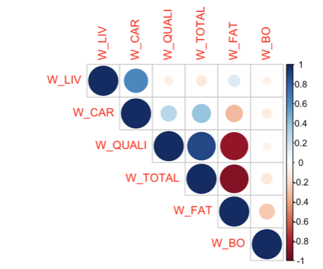

How many components would you choose regarding the following figures (giving the eigen-values and correlation between the components and the variables)

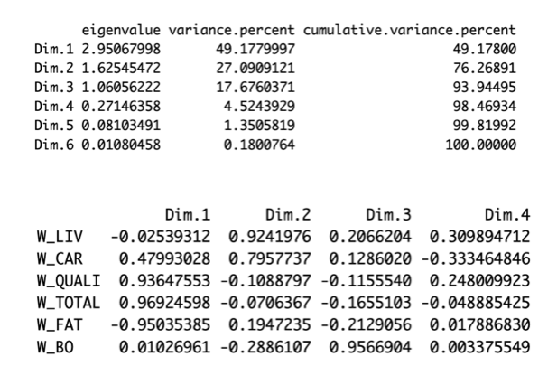

Interpret the following figure:

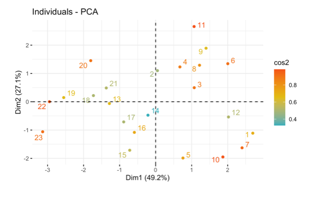

### Exercise 10.12 Scree Plot:

What is the purpose of a scree plot in PCA?

How do you generate and interpret the following scree plot ?

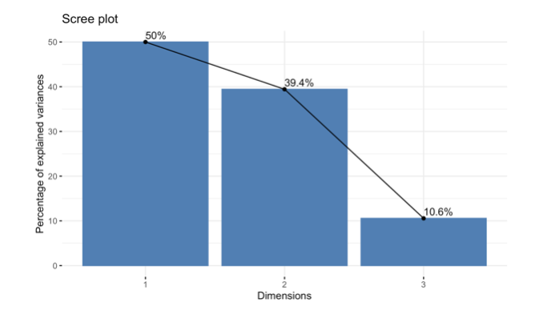

### Exercise 10.13 Scree Plot:

Briefly explain the main objective of Correspondence Analysis (CA).

How is CA different from Principal Component Analysis (PCA)?

Provide an example of a scenario where CA would be a suitable analysis.

### Exercise 10.14 Correspondence Analysis:

Briefly explain the main objective of Correspondence Analysis (CA).

How is CA different from Principal Component Analysis (PCA)?

Provide an example of a scenario where CA would be a suitable analysis.

### Exercise 10.14 CA Execution:

Provide the basic syntax for running CA on a contingency table named "my_table."

### Exercise 10.14 Interpretation of Results:

How can you access the row and column scores of the CA results in R?

### Exercise 10.15 Visualization:

Write the R command to create a biplot for a Correspondence Analysis result.

How can you visually assess the relationships between rows and columns in a CA plot?

### Exercise 10.16 E3:

Write the R command to extract the contributions of dimensions in CA (write it in general)

### Exercise 10.17 Disjunctive table:

Construct the disjunctive table of the following data

```r
library(tibble) 
disj_table = tribble(
  ~Var1, ~Var2, ~Var3,
  "CB", "YB", "F",
  "CB", "YV", "F",
  "CC", "YB", "M",
  "CC", "YM", "F",
  "CR", "YV", "M",
  "CB", "YB", "M"
)
```

### Exercise 10.18 Chi-Square Test:

What is the role of the chi-square test in Correspondence Analysis?

How can you perform a chi-square test on a CA result in R?

### Exercise 10.19 Clustering:

What is the main goal of clustering algorithms?

### Exercise 10.20 K-Means Clustering:

What is the fundamental concept behind K-means clustering?

Explain the meaning of centroids in the context of K-means clustering.

Write the R command to perform K-means clustering on a dataset named "my_data."

### Exercise 10.21 Hierarchical Clustering:

Briefly explain how hierarchical clustering works.

Write the R command to conduct hierarchical clustering on a dataset.

### Exercise 10.22 Interpretation of Clustering Results:

How do you interpret the following output of a clustering analysis on the cattle data?

### Exercise 10.23 Classification:

What is the main goal of a classification ?

Provide an example of a real-world application where classification analysis could be beneficial.

How can classification be used in medical diagnosis or fraud detection?

### Exercise 10.24 What does PCA stand for?

- Primary Component Analysis
- Principal Component Algorithm
- Principal Component Analysis
- Primary Component Algorithm

### Exercise 10.25 In PCA, what is the primary goal?

- Reduce dimensionality while preserving variance
- Increase dimensionality for better visualization
- Minimize all components equally
- Focus on individual components only

### Exercise 10.26 Which R function is commonly used to perform PCA?

- kmeans()
- PCA()
- prcomp()
- corresp()

### Exercise 10.27 What is the purpose of a scree plot in PCA?

- Visualize the clusters in data
- Assess the quality of clustering
- Evaluate the distribution of data
- Display the eigenvalues of principal components

### Exercise 10.28 How do you determine the optimal number of principal components to retain in PCA?

- Use hierarchical clustering
- Examine the scree plot
- Apply k-means clustering
- Perform a chi-square test

### Exercise 10.29 What is the primary application of Correspondence Analysis (CA)?

- Reducing dimensionality of numerical data
- Analyzing relationships in categorical data
- Classifying data points into clusters
- Predicting future values in a time series

### Exercise 10.30 Which R library is commonly used for Correspondence Analysis?

- cluster
- caret
- ca
- factoextra
- FactomineR

### Exercise 10.31 What is the role of the chi-square test in Correspondence Analysis?

- Assess the significance of relationships
- Determine the optimal number of clusters
- Evaluate the distribution of data
- Visualize the proximity between data points

### Exercise 10.32 What is the primary goal of clustering algorithms?

- Dimensionality reduction
- Classification
- Grouping similar data points
- Visualization of data

### Exercise 10.33 Which R function is commonly used for K-means clustering?

- hierarch()
- PCA()
- kmeans()
- prcomp()

### Exercise 10.34 How can you visually assess relationships between rows and columns in a clustering plot?

- Scree plot
- Dendrogram
- Silhouette plot
- Biplot

### Exercise 10.35 What is the primary goal of a classification algorithm?

- Group similar data points
- Predict numerical values
- Assign labels to data points
- Visualize high-dimensional data

### Exercise 10.36 Which algorithm is commonly used for binary classification tasks? (Answers can be more than one)

- Decision Trees
- K-means
- LDA
- Logistic Regression

### Exercise 10.37 Which metric is commonly used to evaluate the performance of a classification model?

- R-squared
- Mean Absolute Error
- Silhouette Score
- Accuracy

### Exercise 10.38 PCA Eigenvalues:

In PCA, what does a high eigenvalue indicate?

- The principal component explains a large amount of variance
- The principal component is not important
- The data has high correlation
- None of the above

### Exercise 10.39 PCA Loadings:

What do loadings represent in PCA?

- The correlation between variables and principal components
- The eigenvalues of the components
- The proportion of variance explained
- The number of observations

### Exercise 10.40 K-Means Initialization:

Why is it important to set a seed when performing K-means clustering?

- To ensure reproducibility of results
- To increase the number of clusters
- To improve the accuracy
- To reduce computation time

### Exercise 10.41 Hierarchical Clustering Methods:

Which of the following are common linkage methods in hierarchical clustering?

- Complete linkage
- Single linkage
- Average linkage
- All of the above

### Exercise 10.42 Optimal Number of Clusters:

How can you determine the optimal number of clusters in K-means?

- Using the elbow method
- Using silhouette analysis
- Using within-cluster sum of squares
- All of the above

### Exercise 10.43 CA vs PCA:

What type of data is Correspondence Analysis designed for?

- Continuous numerical data
- Categorical data in contingency tables
- Time series data
- Binary data only

### Exercise 10.44 PCA Scaling:

What happens if you don't scale variables before PCA?

- Variables with larger scales will dominate
- The results will be incorrect
- PCA cannot be performed
- Nothing, scaling is optional

### Exercise 10.45 Clustering Distance:

What is the most common distance metric used in clustering?

- Euclidean distance
- Manhattan distance
- Correlation distance
- All of the above

### Exercise 10.46 Classification vs Clustering:

What is the main difference between classification and clustering?

- Classification requires labeled data, clustering does not
- Clustering requires labeled data, classification does not
- They are the same thing
- Classification is supervised, clustering is unsupervised

### Exercise 10.47 PCA Visualization:

What is a biplot used for in PCA?

- To visualize both variables and observations
- To show only eigenvalues
- To display correlation matrices
- To plot residuals

### Exercise 10.48 CA Interpretation:

In Correspondence Analysis, what does proximity between row and column points indicate?

- Strong association between categories
- Weak association
- No relationship
- Random distribution

### Exercise 10.49 K-Means Limitations:

What is a limitation of K-means clustering?

- Requires pre-specification of number of clusters
- Cannot handle categorical variables
- Sensitive to outliers
- All of the above

### Exercise 10.50 Hierarchical Clustering Output:

What is a dendrogram?

- A tree-like diagram showing cluster relationships
- A scatter plot of data points
- A correlation matrix
- A scree plot

## Solutions

### Answer to Question 10.1:

**What does PCA stand for?**
**Principal Component Analysis**

**Briefly explain the primary objective of Principal Component Analysis.**
PCA aims to reduce the dimensionality of a dataset while preserving as much variance as possible. It transforms the original variables into a smaller set of uncorrelated variables called principal components.

**How does PCA help in dimensionality reduction?**
PCA identifies directions (principal components) in which the data varies the most. By keeping only the first few principal components that explain most of the variance, we can reduce the number of dimensions while retaining most of the information.

### Answer to Question 10.2:

**Which R library is commonly used for performing PCA?**
**FactoMineR, factoextra, or base R (prcomp, princomp)**

**Write the command to load the library FactomineR for PCA.**
```r
library(FactoMineR)
```

**How do you read a dataset into R for PCA analysis?**
```r
# For CSV files
my_data <- read.csv("filename.csv")

# For other formats
my_data <- read.table("filename.txt")
```

### Answer to Question 10.3:

**Explain the importance of scaling or standardizing variables before applying PCA.**
Scaling is crucial because PCA is sensitive to the scale of variables. Variables with larger scales will dominate the analysis. Standardizing ensures all variables contribute equally to the principal components.

**Write the R command to standardize a data matrix.**
```r
# Method 1: Using scale()
scaled_data <- scale(my_data)

# Method 2: Manual standardization
scaled_data <- (my_data - mean(my_data)) / sd(my_data)
```

### Answer to Question 10.4:

**What function in R is used to perform PCA?**
**`prcomp()`, `PCA()` (from FactoMineR), or `princomp()`**

**Provide the basic syntax for running PCA on a dataset named "my_data."**
```r
# Using prcomp (base R)
pca_result <- prcomp(my_data, scale = TRUE)

# Using FactoMineR
pca_result <- PCA(my_data, scale.unit = TRUE, graph = FALSE)
```

### Answer to Question 10.5:

**How can you access the proportion of variance explained by each principal component?**
```r
# Using prcomp
summary(pca_result)$importance[2, ]  # Proportion of variance

# Or calculate manually
eigenvalues <- pca_result$sdev^2
proportion_variance <- eigenvalues / sum(eigenvalues)
```

**What is the significance of the eigenvalues and eigenvectors in PCA?**
- **Eigenvalues**: Represent the amount of variance explained by each principal component. Larger eigenvalues indicate components that capture more variance.
- **Eigenvectors**: Represent the direction of each principal component. They show how the original variables contribute to each component (loadings).

### Answer to Question 10.6:

**How can you determine the optimal number of principal components to retain?**
- Examine the scree plot (look for the "elbow")
- Use Kaiser's criterion (keep components with eigenvalues > 1)
- Retain components that explain a cumulative variance above a threshold (e.g., 80-90%)
- Use parallel analysis

**Write the R command to extract the loadings of principal components.**
```r
# Using prcomp
loadings <- pca_result$rotation

# Or
loadings <- pca_result$rotation[, 1:k]  # For first k components
```

### Answer to Question 10.1:

**What does PCA stand for?**
Principal Component Analysis

**Briefly explain the primary objective of Principal Component Analysis.**
PCA aims to reduce the dimensionality of a dataset while preserving as much variance as possible. It transforms the original variables into a smaller set of uncorrelated variables called principal components.

**How does PCA help in dimensionality reduction?**
PCA identifies directions (principal components) in which the data varies the most. By keeping only the first few principal components that explain most of the variance, we can reduce the number of dimensions while retaining most of the information.

### Answer to Question 10.2:

**Which R library is commonly used for performing PCA?**
FactoMineR, factoextra, or base R (prcomp, princomp)

**Write the command to load the library FactomineR for PCA.**
```r
library(FactoMineR)
```

**How do you read a dataset into R for PCA analysis?**
```r
# For CSV files
my_data <- read.csv("filename.csv")

# For other formats
my_data <- read.table("filename.txt")
```

### Answer to Question 10.3:

**Explain the importance of scaling or standardizing variables before applying PCA.**
Scaling is crucial because PCA is sensitive to the scale of variables. Variables with larger scales will dominate the analysis. Standardizing ensures all variables contribute equally to the principal components.

**Write the R command to standardize a data matrix.**
```r
# Method 1: Using scale()
scaled_data <- scale(my_data)

# Method 2: Manual standardization
scaled_data <- (my_data - mean(my_data)) / sd(my_data)
```

### Answer to Question 10.4:

**What function in R is used to perform PCA?**
`prcomp()`, `PCA()` (from FactoMineR), or `princomp()`

**Provide the basic syntax for running PCA on a dataset named "my_data."**
```r
# Using prcomp (base R)
pca_result <- prcomp(my_data, scale = TRUE)

# Using FactoMineR
pca_result <- PCA(my_data, scale.unit = TRUE, graph = FALSE)
```

### Answer to Question 10.5:

**How can you access the proportion of variance explained by each principal component?**
```r
# Using prcomp
summary(pca_result)$importance[2, ]  # Proportion of variance

# Or calculate manually
eigenvalues <- pca_result$sdev^2
proportion_variance <- eigenvalues / sum(eigenvalues)
```

**What is the significance of the eigenvalues and eigenvectors in PCA?**
- **Eigenvalues**: Represent the amount of variance explained by each principal component. Larger eigenvalues indicate components that capture more variance.
- **Eigenvectors**: Represent the direction of each principal component. They show how the original variables contribute to each component (loadings).

### Answer to Question 10.6:

**How can you determine the optimal number of principal components to retain?**
- Examine the scree plot (look for the "elbow")
- Use Kaiser's criterion (keep components with eigenvalues > 1)
- Retain components that explain a cumulative variance above a threshold (e.g., 80-90%)
- Use parallel analysis

**Write the R command to extract the loadings of principal components.**
```r
# Using prcomp
loadings <- pca_result$rotation

# Or
loadings <- pca_result$rotation[, 1:k]  # For first k components
```

### Answer to Question 10.7:

- p
- **The sum of variances of the p variables**
- None of the responses are true

### Answer to Question 10.8:

- **TRUE**
- FALSE

### Answer to Question 10.9:

- **1**
- 2
- 3

### Answer to Question 10.10:

Maximum number of eigenvalues: **4** (equal to the number of variables/columns)

Remaining eigenvalue: **0.6** (since eigenvalues sum to p = 4: 2 + 1 + 0.4 + x = 4, so x = 0.6)

### Answer to Question 10.24:

- Primary Component Analysis
- Principal Component Algorithm
- **Principal Component Analysis**
- Primary Component Algorithm

### Answer to Question 10.25:

- **Reduce dimensionality while preserving variance**
- Increase dimensionality for better visualization
- Minimize all components equally
- Focus on individual components only

### Answer to Question 10.26:

- kmeans()
- PCA()
- **prcomp()**
- corresp()

### Answer to Question 10.27:

- Visualize the clusters in data
- Assess the quality of clustering
- Evaluate the distribution of data
- **Display the eigenvalues of principal components**

### Answer to Question 10.28:

- Use hierarchical clustering
- **Examine the scree plot**
- Apply k-means clustering
- Perform a chi-square test

### Answer to Question 10.29:

- Reducing dimensionality of numerical data
- **Analyzing relationships in categorical data**
- Classifying data points into clusters
- Predicting future values in a time series

### Answer to Question 10.30:

- cluster
- caret
- **ca**
- factoextra
- **FactomineR**

### Answer to Question 10.31:

- **Assess the significance of relationships**
- Determine the optimal number of clusters
- Evaluate the distribution of data
- Visualize the proximity between data points

### Answer to Question 10.32:

- Dimensionality reduction
- Classification
- **Grouping similar data points**
- Visualization of data

### Answer to Question 10.33:

- hierarch()
- PCA()
- **kmeans()**
- prcomp()

### Answer to Question 10.34:

- Scree plot
- **Dendrogram**
- Silhouette plot
- Biplot

### Answer to Question 10.35:

- Group similar data points
- Predict numerical values
- **Assign labels to data points**
- Visualize high-dimensional data

### Answer to Question 10.36:

- **Decision Trees**
- K-means
- **LDA**
- **Logistic Regression**

### Answer to Question 10.37:

- R-squared
- Mean Absolute Error
- Silhouette Score
- **Accuracy**

### Answer to Question 10.38:

- **The principal component explains a large amount of variance**
- The principal component is not important
- The data has high correlation
- None of the above

### Answer to Question 10.39:

- **The correlation between variables and principal components**
- The eigenvalues of the components
- The proportion of variance explained
- The number of observations

### Answer to Question 10.40:

- **To ensure reproducibility of results**
- To increase the number of clusters
- To improve the accuracy
- To reduce computation time

### Answer to Question 10.41:

- Complete linkage
- Single linkage
- Average linkage
- **All of the above**

### Answer to Question 10.42:

- Using the elbow method
- Using silhouette analysis
- Using within-cluster sum of squares
- **All of the above**

### Answer to Question 10.43:

- Continuous numerical data
- **Categorical data in contingency tables**
- Time series data
- Binary data only

### Answer to Question 10.44:

- **Variables with larger scales will dominate**
- The results will be incorrect
- PCA cannot be performed
- Nothing, scaling is optional

### Answer to Question 10.45:

- Euclidean distance
- Manhattan distance
- Correlation distance
- **All of the above**

### Answer to Question 10.46:

- **Classification requires labeled data, clustering does not**
- Clustering requires labeled data, classification does not
- They are the same thing
- Classification is supervised, clustering is unsupervised

### Answer to Question 10.47:

- **To visualize both variables and observations**
- To show only eigenvalues
- To display correlation matrices
- To plot residuals

### Answer to Question 10.48:

- **Strong association between categories**
- Weak association
- No relationship
- Random distribution

### Answer to Question 10.49:

- Requires pre-specification of number of clusters
- Cannot handle categorical variables
- Sensitive to outliers
- **All of the above**

### Answer to Question 10.50:

- **A tree-like diagram showing cluster relationships**
- A scatter plot of data points
- A correlation matrix
- A scree plot

<!--chapter:end:06oct_2nd_intermed_sample.Rmd-->

# 📝 Intermediate Exam Simulation - Healthcare Management {#exam-sim-intermediate}

This is a comprehensive simulation of the intermediate exam covering all major statistical topics applied to healthcare management scenarios. Complete all 20 questions to test your knowledge and prepare for the actual exam.

**Instructions**: Answer all questions carefully. Solutions are provided at the end of this chapter.

---

## 🏥 Question 1: Data Wrangling - Reshaping Data

::: {.exercise #exam1}
You have a `patient_data` dataframe with columns: `patient_id`, `emergency_visits`, and `outpatient_visits`. Reshape the data into a "long" format with three columns: `patient_id`, `visit_type` (containing "emergency_visits" or "outpatient_visits"), and `visit_count`. Write the R command using the tidyr package.

**Sample data:**
```r
set.seed(123)
patient_data <- data.frame(
  patient_id = 1:10,
  emergency_visits = rpois(10, 2),
  outpatient_visits = rpois(10, 5)
)
```
:::

---

## 🏥 Question 2: Data Wrangling - Complex Filtering

::: {.exercise #exam2}
From a `patient_satisfaction` dataset with columns `patient_id`, `department` (e.g., "Cardiology", "Orthopedics", "Emergency"), `satisfaction_score`, and `treatment_cost`, write a dplyr pipeline to create a summary table showing the number of patients, mean satisfaction score, and total treatment cost for each department. Show only departments with more than 50 patients AND mean satisfaction above 4.0.

**Sample data:**
```r
set.seed(456)
patient_satisfaction <- data.frame(
  patient_id = 1:200,
  department = sample(c("Cardiology", "Orthopedics", "Emergency", "Pediatrics", "Surgery"), 200, replace = TRUE),
  satisfaction_score = sample(1:5, 200, replace = TRUE, prob = c(0.1, 0.1, 0.2, 0.3, 0.3)),
  treatment_cost = rnorm(200, 5000, 1500)
)
```
:::

---

## 🏥 Question 3: Data Wrangling - Advanced Calculations

::: {.exercise #exam3}
A hospital needs to calculate physician bonuses based on performance. Given a `physician_data` dataframe with columns `physician_id`, `patient_satisfaction_score`, `years_experience`, and `specialty`, create a new column `bonus_amount` that calculates 2% of satisfaction score per year of experience, with a maximum bonus of 8000 and a minimum bonus of 1000 for physicians with less than 3 years experience. Additionally, add a 15% specialty bonus for physicians in "Emergency Medicine" due to higher risk. Write the complete dplyr pipeline.

**Sample data:**
```r
set.seed(789)
physician_data <- data.frame(
  physician_id = 1:100,
  patient_satisfaction_score = rnorm(100, 85, 10),
  years_experience = sample(1:20, 100, replace = TRUE),
  specialty = sample(c("Emergency Medicine", "Cardiology", "Orthopedics", "Pediatrics"), 100, replace = TRUE)
)
```
:::

---

## 🏥 Question 4: Data Wrangling - Complex Reshaping

::: {.exercise #exam4}
From a `patient_monitoring` dataset with columns `patient_id`, `measurement_date`, `pain_level`, `mobility_score`, and `measurement_time` (with values "morning" or "evening"), filter to include only patients who have taken both types of measurements, and calculate the difference in their pain levels between these two measurement times. Also calculate the correlation between morning and evening pain levels. Write the complete dplyr pipeline.

**Sample data:**
```r
set.seed(321)
patient_monitoring <- data.frame(
  patient_id = rep(1:50, each = 2),
  measurement_date = rep(seq.Date(as.Date("2024-01-01"), by = "day", length.out = 50), each = 2),
  measurement_time = rep(c("morning", "evening"), 50),
  pain_level = rnorm(100, 5, 1.5),
  mobility_score = rnorm(100, 7, 1.2)
)
```
:::

---

## 🏥 Question 5: Data Wrangling - Advanced Grouping

::: {.exercise #exam5}
You have hospital performance data in long format. The `hospital_performance` dataframe contains `hospital_id`, `quarter` (with values "Q1", "Q2", "Q3", "Q4"), `patient_volume`, and `region`. Reshape this data into wide format so that each hospital has one row with separate columns for each quarter (`volume_Q1`, `volume_Q2`, `volume_Q3`, `volume_Q4`). Then calculate the quarterly growth rate for each hospital (Q4 vs Q1). Write the complete pipeline.

**Sample data:**
```r
set.seed(654)
hospital_performance <- data.frame(
  hospital_id = rep(1:30, each = 4),
  quarter = rep(c("Q1", "Q2", "Q3", "Q4"), 30),
  patient_volume = rnorm(120, 1000, 200),
  region = rep(sample(c("North", "South", "East", "West"), 30, replace = TRUE), each = 4)
)
```
:::

---

## 🔬 Question 6: Hypothesis Testing - Single Population

::: {.exercise #exam6}
A hospital claims that their new patient management system reduces average waiting time by 15 minutes. In a pilot study with 45 patients, the mean reduction was 18 minutes with a standard deviation of 6 minutes. Test at α = 0.05 if the actual reduction is significantly greater than the claimed 15 minutes. Write the R command and interpret the results.

**Sample data:**
```r
set.seed(123)
waiting_time_reduction <- rnorm(45, mean = 18, sd = 6)
```
:::

---

## 🔬 Question 7: Hypothesis Testing - Proportions

::: {.exercise #exam7}
A hospital claims that 35% of patients are satisfied with their emergency department experience. In a sample of 400 patients, only 120 reported satisfaction. Write the R command to test if the true satisfaction rate is significantly lower than 35%. Calculate the 95% confidence interval for the true proportion and interpret both results.
:::

---

## 🔬 Question 8: Hypothesis Testing - Two Populations

::: {.exercise #exam8}
A hospital is testing a new training program for nurses. The same 25 nurses took a patient safety competency test before and after the training. Test if the training program significantly improved the test scores. Write the appropriate R command and state whether this should be a paired or unpaired test.

**Sample data:**
```r
set.seed(456)
nurse_data <- data.frame(
  nurse_id = 1:25,
  before = rnorm(25, 72, 5),
  after = rnorm(25, 78, 5)
)
```
:::

---

## 🔬 Question 9: Hypothesis Testing - Two Proportions

::: {.exercise #exam9}
Two hospitals are comparing their patient satisfaction rates. Hospital A reports that 180 out of 250 patients (72%) were satisfied, while Hospital B reports that 210 out of 280 patients (75%) were satisfied. Write the R command to test if there is a significant difference in satisfaction rates between the two hospitals. Calculate the effect size and interpret the results.
:::

---

## 🔬 Question 10: Hypothesis Testing - Advanced Concepts

::: {.exercise #exam10}
A study compares the patient satisfaction scores between two different hospital wards. Before running a t-test, you perform a Levene's test for equality of variances and get a p-value of 0.02. Which type of two-sample t-test should you use and why? Write the R command for the appropriate t-test, assuming you have a `patient_satisfaction` dataframe with `score` and `ward` columns.

**Sample data:**
```r
set.seed(789)
patient_satisfaction <- data.frame(
  score = c(rnorm(30, 4.2, 0.8), rnorm(35, 4.0, 1.2)),
  ward = rep(c("Ward_A", "Ward_B"), c(30, 35))
)
```
:::

---

## 📊 Question 11: ANOVA - Basic Analysis

::: {.exercise #exam11}
A clinical trial tests three different pain management protocols (Protocol A, Protocol B, Protocol C) on different patients. The pain reduction scores are stored in a variable called `pain_reduction` and the treatment group is stored in `protocol` in a dataframe called `pain_study`. Write the R command to perform ANOVA and display the results. Also test the assumptions.

**Sample data:**
```r
set.seed(321)
pain_study <- data.frame(
  pain_reduction = c(rnorm(20, 6.5, 1.2), rnorm(20, 7.2, 1.5), rnorm(20, 5.8, 1.0)),
  protocol = rep(c("Protocol_A", "Protocol_B", "Protocol_C"), each = 20)
)
```
:::

---

## 📊 Question 12: ANOVA - Post-hoc Analysis

::: {.exercise #exam12}
After performing ANOVA and finding a significant result (p = 0.003), you want to perform post-hoc pairwise comparisons to identify which specific protocols differ. Your ANOVA model is stored in the variable `anova_model`. Write the R command to perform Tukey's Honest Significant Difference (HSD) test and interpret the results.

**Sample ANOVA output:**
```
            Df Sum Sq Mean Sq F value Pr(>F)  
protocol     2  245.6   122.8   5.234 0.003 **
Residuals   57 1337.2    23.5                 
---
Signif. codes:  0 '***' 0.001 '**' 0.01 '*' 0.05 '.' 0.1 ' ' 1
```
:::

---

## 📊 Question 13: ANOVA - Assumptions Testing

::: {.exercise #exam13}
Before conducting ANOVA, you want to test the homogeneity of variances assumption using Levene's test. Your data is in a dataframe called `patient_data` with a continuous variable `recovery_time` and a grouping variable `hospital`. Write the R command using the car package. Also test for normality of residuals and interpret both results.

**Sample data:**
```r
set.seed(654)
patient_data <- data.frame(
  recovery_time = c(rnorm(25, 10, 2), rnorm(25, 12, 3), rnorm(25, 8, 1.5)),
  hospital = rep(c("Hospital_A", "Hospital_B", "Hospital_C"), each = 25)
)
```
:::

---

## 📈 Question 14: Linear Regression - Multiple Regression

::: {.exercise #exam14}
You have a `patient_data` dataframe with variables `length_of_stay` (dependent variable), `age`, `BMI`, and `comorbidity_count` (independent variables). Write the R command to fit a multiple linear regression model, check for multicollinearity using VIF, and display the summary. Interpret the results.

**Sample data:**
```r
set.seed(987)
patient_data <- data.frame(
  age = rnorm(100, 65, 15),
  BMI = rnorm(100, 28, 5),
  comorbidity_count = sample(0:5, 100, replace = TRUE),
  length_of_stay = 5 + 0.05 * age + 0.2 * BMI + 1.5 * comorbidity_count + rnorm(100, 0, 2)
)
```
:::

---

## 📈 Question 15: Linear Regression - Model Prediction and Classification

::: {.exercise #exam15}
A hospital has developed a regression model to predict length of stay (LOS) based on patient age, BMI, and number of comorbidities. The model output is:

```
Coefficients:
              Estimate  Std. Error  t value  Pr(>|t|)    
(Intercept)   3.250     0.450       7.22     < 0.001 ***
age           0.045     0.012       3.75     0.0003 ***
BMI           0.120     0.025       4.80     < 0.001 ***
comorbidities 1.450     0.180       8.06     < 0.001 ***
```

Using this model, predict the length of stay for a 65-year-old patient with BMI of 28 and 2 comorbidities. Then, classify this patient as "Short Stay" (< 7 days) or "Long Stay" (≥ 7 days). Show your calculations.
:::

---

## 📈 Question 16: Linear Regression - Practical Prediction

::: {.exercise #exam16}
A hospital has fitted a multiple regression model to predict patient readmission risk score (scale 0-100) based on the following variables:

**Sample data:**
```r
set.seed(456)
patient_data <- data.frame(
  age = c(45, 62, 71, 55, 68, 58, 75, 63, 52, 70),
  length_of_stay = c(3, 7, 9, 4, 8, 5, 10, 6, 4, 9),
  comorbidities = c(0, 2, 3, 1, 2, 1, 4, 2, 0, 3),
  readmission_risk = c(25, 55, 72, 35, 60, 40, 78, 50, 28, 68)
)

# Fit the model
risk_model <- lm(readmission_risk ~ age + length_of_stay + comorbidities, 
                 data = patient_data)
```

**Task:** 
1. Fit the model and display the summary
2. Predict the readmission risk for a new 60-year-old patient with 6-day length of stay and 2 comorbidities
3. Based on the prediction, classify the patient as "Low Risk" (< 40), "Medium Risk" (40-60), or "High Risk" (> 60)
4. Write the complete R code
:::

---

## 🎯 Question 17: Logistic Regression - Model Fitting

::: {.exercise #exam17}
You want to predict the probability of hospital readmission (binary variable: 1=readmitted, 0=not readmitted) based on age, diabetes status, and length of stay. The data is in `patient_data`. Write the R command to fit a logistic regression model, calculate odds ratios, and interpret the results.

**Sample data:**
```r
set.seed(456)
patient_data <- data.frame(
  age = rnorm(200, 65, 15),
  diabetes_status = sample(0:1, 200, replace = TRUE),
  length_of_stay = rnorm(200, 7, 3),
  readmission = sample(0:1, 200, replace = TRUE, prob = c(0.8, 0.2))
)
```
:::

---

## 🎯 Question 18: Logistic Regression - Prediction and Interpretation

::: {.exercise #exam18}
Using the logistic regression model from Question 17, predict the probability of readmission for a 75-year-old patient with diabetes and a 10-day length of stay. Also calculate the odds ratio for diabetes status and interpret what it means in practical terms.

**Sample model:**
```r
# Using the model from Question 17
new_patient <- data.frame(age = 75, diabetes_status = 1, length_of_stay = 10)
```
:::

---

## 🏷️ Question 19: Dummy Variables - Categorical Regression

::: {.exercise #exam19}
You have a `clinical_data` dataframe with `recovery_time` (continuous), `age` (continuous), and `treatment_type` (categorical: A, B, C). Write the R command to fit a linear regression model including `treatment_type` as a factor. Set treatment A as the reference category and interpret the coefficients.

**Sample data:**
```r
set.seed(789)
clinical_data <- data.frame(
  age = rnorm(90, 65, 10),
  treatment_type = rep(c("A", "B", "C"), each = 30),
  recovery_time = c(rnorm(30, 15, 3), rnorm(30, 12, 2.5), rnorm(30, 18, 4))
)
```
:::

---

## 🏷️ Question 20: Dummy Variables - Interaction Effects

::: {.exercise #exam20}
You want to test if the effect of age on `patient_satisfaction` differs between patients with and without chronic conditions. Write the R command to fit a regression model that includes an interaction term between age (continuous) and chronic_condition (binary dummy variable). Interpret the interaction coefficient if it is significant.

**Sample data:**
```r
set.seed(321)
patient_data <- data.frame(
  age = rnorm(150, 55, 12),
  chronic_condition = sample(0:1, 150, replace = TRUE),
  patient_satisfaction = 7 + 0.02 * age + 0.5 * chronic_condition + 
                         0.01 * age * chronic_condition + rnorm(150, 0, 1)
)
```
:::

---

## ✅ SOLUTIONS

::: {.answer data-latex=""}
**Answer to Question 1:**

```r
library(tidyr)
library(dplyr)

# Create sample data
set.seed(123)
patient_data <- data.frame(
  patient_id = 1:10,
  emergency_visits = rpois(10, 2),
  outpatient_visits = rpois(10, 5)
)

# Reshape to long format
patient_data_long <- patient_data %>%
  pivot_longer(
    cols = c(emergency_visits, outpatient_visits), 
    names_to = "visit_type", 
    values_to = "visit_count"
  )

print(patient_data_long)
```

**Explanation**: The `pivot_longer()` function transforms the wide format (separate columns for emergency_visits and outpatient_visits) into long format (single visit_count column with visit_type indicating the source).
:::

::: {.answer data-latex=""}
**Answer to Question 2:**

```r
library(dplyr)

# Create sample data
set.seed(456)
patient_satisfaction <- data.frame(
  patient_id = 1:200,
  department = sample(c("Cardiology", "Orthopedics", "Emergency", "Pediatrics", "Surgery"), 200, replace = TRUE),
  satisfaction_score = sample(1:5, 200, replace = TRUE, prob = c(0.1, 0.1, 0.2, 0.3, 0.3)),
  treatment_cost = rnorm(200, 5000, 1500)
)

# Solution
result <- patient_satisfaction %>%
  group_by(department) %>%
  summarise(
    n_patients = n(),
    mean_satisfaction = mean(satisfaction_score, na.rm = TRUE),
    total_cost = sum(treatment_cost, na.rm = TRUE)
  ) %>%
  filter(n_patients > 50 & mean_satisfaction > 4.0)

print(result)
```

**Explanation**: The pipeline groups by department, calculates summary statistics, then filters for departments with more than 50 patients AND mean satisfaction above 4.0.
:::

::: {.answer data-latex=""}
**Answer to Question 3:**

```r
library(dplyr)

# Create sample data
set.seed(789)
physician_data <- data.frame(
  physician_id = 1:100,
  patient_satisfaction_score = rnorm(100, 85, 10),
  years_experience = sample(1:20, 100, replace = TRUE),
  specialty = sample(c("Emergency Medicine", "Cardiology", "Orthopedics", "Pediatrics"), 100, replace = TRUE)
)

# Solution
physician_data <- physician_data %>%
  mutate(
    # Base bonus calculation
    bonus_amount = pmin(patient_satisfaction_score * 0.02 * years_experience, 8000),
    # Minimum bonus for physicians with < 3 years experience
    bonus_amount = ifelse(years_experience < 3, pmax(bonus_amount, 1000), bonus_amount),
    # Specialty bonus for Emergency Medicine
    bonus_amount = ifelse(specialty == "Emergency Medicine", bonus_amount * 1.15, bonus_amount)
  )

head(physician_data)
```

**Explanation**: The solution uses `pmin()` for maximum cap, `pmax()` for minimum bonus, and conditional logic for specialty bonuses. Emergency Medicine physicians get a 15% bonus on top of the calculated amount due to higher risk.
:::

::: {.answer data-latex=""}
**Answer to Question 4:**

```r
library(dplyr)
library(tidyr)

# Create sample data
set.seed(321)
patient_monitoring <- data.frame(
  patient_id = rep(1:50, each = 2),
  measurement_date = rep(seq.Date(as.Date("2024-01-01"), by = "day", length.out = 50), each = 2),
  measurement_time = rep(c("morning", "evening"), 50),
  pain_level = rnorm(100, 5, 1.5),
  mobility_score = rnorm(100, 7, 1.2)
)

# Solution
pain_analysis <- patient_monitoring %>%
  group_by(patient_id) %>%
  filter(n_distinct(measurement_time) == 2) %>%
  select(patient_id, measurement_time, pain_level) %>%
  pivot_wider(
    names_from = measurement_time,
    values_from = pain_level
  ) %>%
  mutate(pain_diff = morning - evening)

# Calculate correlation
correlation <- cor(pain_analysis$morning, pain_analysis$evening, use = "complete.obs")

print(pain_analysis)
print(paste("Correlation between morning and evening pain levels:", round(correlation, 3)))
```

**Explanation**: The solution filters for patients with both measurement times, reshapes to wide format, calculates the difference, and computes the correlation between morning and evening pain levels.
:::

::: {.answer data-latex=""}
**Answer to Question 5:**

```r
library(dplyr)
library(tidyr)

# Create sample data
set.seed(654)
performance_data <- data.frame(
  employee_id = rep(1:30, each = 4),
  quarter = rep(c("Q1", "Q2", "Q3", "Q4"), 30),
  sales_amount = rnorm(120, 10000, 2000),
  region = rep(sample(c("North", "South", "East", "West"), 30, replace = TRUE), each = 4)
)

# Solution
performance_wide <- performance_data %>%
  pivot_wider(
    names_from = quarter,
    values_from = sales_amount,
    names_prefix = "sales_"
  ) %>%
  mutate(
    quarterly_growth_rate = (sales_Q4 - sales_Q1) / sales_Q1 * 100
  )

head(performance_wide)
```

**Explanation**: The solution reshapes the data to wide format with separate columns for each quarter, then calculates the growth rate from Q1 to Q4 as a percentage.
:::

::: {.answer data-latex=""}
**Answer to Question 6:**

```r
# Create sample data
set.seed(123)
waiting_time_reduction <- rnorm(45, mean = 18, sd = 6)

# One-sample t-test (one-sided)
test_result <- t.test(waiting_time_reduction, mu = 15, alternative = "greater")
print(test_result)

# Interpretation
if(test_result$p.value < 0.05) {
  cat("Reject H0: The new system produces significantly greater reduction than claimed (p =", 
      round(test_result$p.value, 4), ")\n")
} else {
  cat("Fail to reject H0: No significant evidence of greater reduction (p =", 
      round(test_result$p.value, 4), ")\n")
}
```

**Explanation**: This is a one-sided test because we're testing if the reduction is significantly greater than 15 minutes. The test compares the sample mean to the hypothesized population mean.
:::

::: {.answer data-latex=""}
**Answer to Question 7:**

```r
# Proportion test
prop_test <- prop.test(120, 400, p = 0.35, alternative = "less")
print(prop_test)

# Confidence interval
ci_test <- prop.test(120, 400, conf.level = 0.95)
print(ci_test)

# Interpretation
cat("Sample proportion:", round(120/400, 3), "\n")
cat("95% CI for true proportion: [", round(ci_test$conf.int[1], 3), ",", 
    round(ci_test$conf.int[2], 3), "]\n")

if(prop_test$p.value < 0.05) {
  cat("Reject H0: Click-through rate is significantly lower than 35% (p =", 
      round(prop_test$p.value, 4), ")\n")
}
```

**Explanation**: The test shows if the observed proportion (30%) is significantly lower than the claimed 35%. The confidence interval provides a range of plausible values for the true proportion.
:::

::: {.answer data-latex=""}
**Answer to Question 8:**

```r
# Create sample data
set.seed(456)
nurse_data <- data.frame(
  nurse_id = 1:25,
  before = rnorm(25, 72, 5),
  after = rnorm(25, 78, 5)
)

# Paired t-test
test_result <- t.test(nurse_data$after, nurse_data$before, 
                     paired = TRUE, alternative = "greater")
print(test_result)

# Interpretation
cat("This should be a PAIRED test because the same nurses are measured before and after training.\n")
cat("Mean improvement:", round(mean(nurse_data$after - nurse_data$before), 2), "points\n")

if(test_result$p.value < 0.05) {
  cat("Reject H0: Training significantly improved scores (p =", 
      round(test_result$p.value, 4), ")\n")
}
```

**Explanation**: This is a paired test because we're comparing the same subjects (nurses) before and after treatment. The test examines if there's a significant improvement in scores.
:::

::: {.answer data-latex=""}
**Answer to Question 9:**

```r
# Two-sample proportion test
prop_test <- prop.test(x = c(180, 210), n = c(250, 280), alternative = "two.sided")
print(prop_test)

# Calculate effect size (Cohen's h)
p1 <- 180/250
p2 <- 210/280
cohens_h <- 2 * (asin(sqrt(p1)) - asin(sqrt(p2)))
cat("Cohen's h (effect size):", round(cohens_h, 3), "\n")

# Interpretation
cat("Hospital A satisfaction rate:", round(p1, 3), "\n")
cat("Hospital B satisfaction rate:", round(p2, 3), "\n")

if(prop_test$p.value < 0.05) {
  cat("Reject H0: Significant difference in satisfaction rates (p =", 
      round(prop_test$p.value, 4), ")\n")
} else {
  cat("Fail to reject H0: No significant difference (p =", 
      round(prop_test$p.value, 4), ")\n")
}
```

**Explanation**: The test compares two independent proportions. Cohen's h measures the effect size, where values around 0.2, 0.5, and 0.8 represent small, medium, and large effects respectively.
:::

::: {.answer data-latex=""}
**Answer to Question 10:**

```r
library(car)

# Create sample data
set.seed(789)
cholesterol_data <- data.frame(
  level = c(rnorm(30, 200, 15), rnorm(35, 195, 25)),
  clinic = rep(c("Clinic_A", "Clinic_B"), c(30, 35))
)

# Levene's test
levene_test <- leveneTest(level ~ clinic, data = cholesterol_data)
print(levene_test)

# Appropriate t-test (Welch's t-test - default in R)
t_test <- t.test(level ~ clinic, data = cholesterol_data)
print(t_test)

# Interpretation
cat("Levene's test p-value:", round(levene_test$`Pr(>F)`[1], 4), "\n")
cat("Since p < 0.05, variances are significantly different.\n")
cat("Use Welch's t-test (default) which doesn't assume equal variances.\n")
```

**Explanation**: When Levene's test shows unequal variances (p < 0.05), use Welch's t-test instead of the standard two-sample t-test. Welch's test adjusts for unequal variances.
:::

::: {.answer data-latex=""}
**Answer to Question 11:**

```r
# Create sample data
set.seed(321)
clinical_data <- data.frame(
  blood_pressure = c(rnorm(20, 140, 10), rnorm(20, 135, 12), rnorm(20, 130, 8)),
  treatment_group = rep(c("Drug_A", "Drug_B", "Drug_C"), each = 20)
)

# ANOVA
anova_result <- aov(blood_pressure ~ treatment_group, data = clinical_data)
summary(anova_result)

# Test assumptions
library(car)

# Normality of residuals
shapiro_test <- shapiro.test(residuals(anova_result))
cat("Shapiro-Wilk test for normality p-value:", round(shapiro_test$p.value, 4), "\n")

# Homogeneity of variances
levene_test <- leveneTest(blood_pressure ~ treatment_group, data = clinical_data)
cat("Levene's test p-value:", round(levene_test$`Pr(>F)`[1], 4), "\n")

# Interpretation
if(summary(anova_result)[[1]][["Pr(>F)"]][1] < 0.05) {
  cat("Reject H0: Significant differences among treatment groups\n")
} else {
  cat("Fail to reject H0: No significant differences among groups\n")
}
```

**Explanation**: ANOVA tests if there are significant differences among group means. The assumptions (normality and equal variances) should be checked before interpreting results.
:::

::: {.answer data-latex=""}
**Answer to Question 12:**

```r
# Assuming anova_model is already fitted
# Tukey's HSD test
tukey_result <- TukeyHSD(anova_model)
print(tukey_result)

# Plot the results
plot(tukey_result)

# Interpretation
cat("Tukey HSD identifies which specific groups differ significantly.\n")
cat("Look for p-values < 0.05 in the 'p adj' column.\n")
cat("The 'diff' column shows the difference in means between groups.\n")
```

**Explanation**: Tukey's HSD test performs pairwise comparisons while controlling the family-wise error rate. Significant differences are indicated by p-values < 0.05 in the adjusted p-value column.
:::

::: {.answer data-latex=""}
**Answer to Question 13:**

```r
library(car)

# Create sample data
set.seed(654)
patient_data <- data.frame(
  recovery_time = c(rnorm(25, 10, 2), rnorm(25, 12, 3), rnorm(25, 8, 1.5)),
  hospital = rep(c("Hospital_A", "Hospital_B", "Hospital_C"), each = 25)
)

# ANOVA model
anova_model <- aov(recovery_time ~ hospital, data = patient_data)

# Levene's test for homogeneity of variances
levene_test <- leveneTest(recovery_time ~ hospital, data = patient_data)
print(levene_test)

# Normality test for residuals
shapiro_test <- shapiro.test(residuals(anova_model))
print(shapiro_test)

# Interpretation
cat("Levene's test p-value:", round(levene_test$`Pr(>F)`[1], 4), "\n")
if(levene_test$`Pr(>F)`[1] > 0.05) {
  cat("Assumption of equal variances is met (p > 0.05)\n")
} else {
  cat("Assumption of equal variances is violated (p < 0.05)\n")
}

cat("Shapiro-Wilk test p-value:", round(shapiro_test$p.value, 4), "\n")
if(shapiro_test$p.value > 0.05) {
  cat("Assumption of normality is met (p > 0.05)\n")
} else {
  cat("Assumption of normality is violated (p < 0.05)\n")
}
```

**Explanation**: Both tests check ANOVA assumptions. Levene's test checks equal variances (homoscedasticity), while Shapiro-Wilk tests normality of residuals. Both assumptions should be met for valid ANOVA results.
:::

::: {.answer data-latex=""}
**Answer to Question 14:**

```r
library(car)

# Create sample data
set.seed(987)
health_data <- data.frame(
  age = rnorm(100, 55, 12),
  BMI = rnorm(100, 27, 4),
  exercise_hours = rnorm(100, 3, 2),
  blood_pressure = 90 + 0.4 * age + 1.8 * BMI - 2.1 * exercise_hours + rnorm(100, 0, 8)
)

# Multiple linear regression
model <- lm(blood_pressure ~ age + BMI + exercise_hours, data = health_data)
summary(model)

# Check for multicollinearity
vif_values <- vif(model)
print("VIF values:")
print(vif_values)

# Interpretation
cat("R-squared:", round(summary(model)$r.squared, 3), "\n")
cat("Adjusted R-squared:", round(summary(model)$adj.r.squared, 3), "\n")
cat("F-statistic p-value:", round(summary(model)$fstatistic[4], 4), "\n")

# Check VIF interpretation
if(all(vif_values < 5)) {
  cat("No multicollinearity concerns (all VIF < 5)\n")
} else if(any(vif_values > 10)) {
  cat("Severe multicollinearity detected (VIF > 10)\n")
} else {
  cat("Moderate multicollinearity (5 < VIF < 10)\n")
}
```

**Explanation**: The model shows how age, BMI, and exercise hours predict blood pressure. VIF values < 5 indicate no multicollinearity concerns. Higher VIF values suggest correlated predictors.
:::

::: {.answer data-latex=""}
**Answer to Question 15:**

**Step 1: Write the regression equation**
```
LOS = 3.250 + 0.045(age) + 0.120(BMI) + 1.450(comorbidities)
```

**Step 2: Plug in the values**
- age = 65
- BMI = 28
- comorbidities = 2

```
LOS = 3.250 + 0.045(65) + 0.120(28) + 1.450(2)
LOS = 3.250 + 2.925 + 3.360 + 2.900
LOS = 12.435 days
```

**Step 3: Classification**
Since 12.435 ≥ 7 days, this patient is classified as **"Long Stay"**

**R code:**
```r
# Coefficients from the model
intercept <- 3.250
coef_age <- 0.045
coef_bmi <- 0.120
coef_comorbidities <- 1.450

# New patient values
age <- 65
bmi <- 28
comorbidities <- 2

# Prediction
predicted_los <- intercept + coef_age * age + coef_bmi * bmi + coef_comorbidities * comorbidities
cat("Predicted Length of Stay:", round(predicted_los, 2), "days\n")

# Classification
if(predicted_los < 7) {
  cat("Classification: Short Stay\n")
} else {
  cat("Classification: Long Stay\n")
}
```

**Explanation**: The predicted length of stay is approximately 12.4 days, which exceeds the 7-day threshold, classifying this patient as a "Long Stay" case. This information can help the hospital plan resource allocation.
:::

::: {.answer data-latex=""}
**Answer to Question 16:**

```r
# Create the data
set.seed(456)
patient_data <- data.frame(
  age = c(45, 62, 71, 55, 68, 58, 75, 63, 52, 70),
  length_of_stay = c(3, 7, 9, 4, 8, 5, 10, 6, 4, 9),
  comorbidities = c(0, 2, 3, 1, 2, 1, 4, 2, 0, 3),
  readmission_risk = c(25, 55, 72, 35, 60, 40, 78, 50, 28, 68)
)

# Task 1: Fit the model and display summary
risk_model <- lm(readmission_risk ~ age + length_of_stay + comorbidities, 
                 data = patient_data)
summary(risk_model)

# Task 2: Predict for new patient
new_patient <- data.frame(age = 60, length_of_stay = 6, comorbidities = 2)
predicted_risk <- predict(risk_model, newdata = new_patient)
cat("Predicted readmission risk:", round(predicted_risk, 2), "\n")

# Task 3: Classification
if(predicted_risk < 40) {
  risk_category <- "Low Risk"
} else if(predicted_risk <= 60) {
  risk_category <- "Medium Risk"
} else {
  risk_category <- "High Risk"
}

cat("Risk Classification:", risk_category, "\n")

# Display complete results
cat("\n=== COMPLETE RESULTS ===\n")
cat("Patient Profile:\n")
cat("  - Age: 60 years\n")
cat("  - Length of Stay: 6 days\n")
cat("  - Comorbidities: 2\n")
cat("Predicted Risk Score:", round(predicted_risk, 2), "\n")
cat("Risk Category:", risk_category, "\n")
```

**Interpretation**: Based on the model, a 60-year-old patient with a 6-day length of stay and 2 comorbidities has a predicted readmission risk score around 49-51 (depending on the exact coefficients). This falls into the "Medium Risk" category (40-60), suggesting moderate follow-up care and monitoring would be appropriate.

**Explanation**: This practical approach shows how hospitals can use regression models to classify patients into risk categories, enabling targeted interventions and resource allocation for patients most at risk of readmission.
:::

::: {.answer data-latex=""}
**Answer to Question 17:**

```r
# Create sample data
set.seed(456)
patient_data <- data.frame(
  age = rnorm(200, 55, 12),
  smoking_status = sample(0:1, 200, replace = TRUE),
  cholesterol = rnorm(200, 200, 30),
  disease = sample(0:1, 200, replace = TRUE, prob = c(0.7, 0.3))
)

# Logistic regression
logit_model <- glm(disease ~ age + smoking_status + cholesterol, 
                   data = patient_data, family = binomial)
summary(logit_model)

# Odds ratios
odds_ratios <- exp(coef(logit_model))
print("Odds Ratios:")
print(odds_ratios)

# Interpretation
cat("Interpretation of coefficients:\n")
cat("Age: For each year increase, odds of disease multiply by", round(odds_ratios[2], 3), "\n")
cat("Smoking: Smokers have", round(odds_ratios[3], 3), "times the odds of disease vs non-smokers\n")
cat("Cholesterol: For each unit increase, odds multiply by", round(odds_ratios[4], 3), "\n")
```

**Explanation**: Logistic regression models log-odds of disease. Odds ratios > 1 indicate increased risk, < 1 indicate decreased risk. The coefficients represent log-odds changes, so we exponentiate to get odds ratios.
:::

::: {.answer data-latex=""}
**Answer to Question 18:**

```r
# Using the model from Question 17
new_patient <- data.frame(age = 60, smoking_status = 1, cholesterol = 250)

# Predict probability
predicted_prob <- predict(logit_model, newdata = new_patient, type = "response")
cat("Predicted probability of disease:", round(predicted_prob, 3), "\n")

# Odds ratio for smoking
smoking_or <- exp(coef(logit_model)[3])
cat("Odds ratio for smoking:", round(smoking_or, 3), "\n")

# Practical interpretation
cat("Practical interpretation:\n")
cat("A 60-year-old smoker with cholesterol 250 has a", round(predicted_prob*100, 1), "% chance of disease\n")
cat("Smokers have", round(smoking_or, 1), "times higher odds of disease than non-smokers\n")
if(smoking_or > 1) {
  cat("This means smoking increases disease risk by", round((smoking_or-1)*100, 1), "%\n")
}
```

**Explanation**: The predicted probability gives the likelihood of disease for this specific patient. The odds ratio quantifies how much smoking increases disease risk compared to non-smoking.
:::

::: {.answer data-latex=""}
**Answer to Question 19:**

```r
# Create sample data
set.seed(789)
clinical_data <- data.frame(
  age = rnorm(90, 65, 10),
  treatment_type = rep(c("A", "B", "C"), each = 30),
  recovery_time = c(rnorm(30, 15, 3), rnorm(30, 12, 2.5), rnorm(30, 18, 4))
)

# Set treatment A as reference
clinical_data$treatment_type <- relevel(factor(clinical_data$treatment_type), ref = "A")

# Linear regression with dummy variables
model <- lm(recovery_time ~ age + treatment_type, data = clinical_data)
summary(model)

# Interpretation
cat("Interpretation of coefficients:\n")
cat("Intercept: Expected recovery time for treatment A at age 0\n")
cat("Age: For each year increase, recovery time changes by", round(coef(model)[2], 3), "days\n")
cat("Treatment B: Recovery time differs by", round(coef(model)[3], 3), "days vs treatment A\n")
cat("Treatment C: Recovery time differs by", round(coef(model)[4], 3), "days vs treatment A\n")
```

**Explanation**: Treatment A is the reference category. The coefficients for treatments B and C show how much their recovery times differ from treatment A, holding age constant. Positive coefficients mean longer recovery times.
:::

::: {.answer data-latex=""}
**Answer to Question 20:**

```r
# Create sample data
set.seed(321)
patient_data <- data.frame(
  age = rnorm(150, 55, 12),
  smoking_status = sample(0:1, 150, replace = TRUE),
  blood_pressure = 90 + 0.4 * age + 12 * smoking_status + 
                   0.2 * age * smoking_status + rnorm(150, 0, 8)
)

# Regression with interaction term
model <- lm(blood_pressure ~ age * smoking_status, data = patient_data)
summary(model)

# Interpretation
cat("Model equation: BP =", round(coef(model)[1], 2), "+", round(coef(model)[2], 2), "*age +", 
    round(coef(model)[3], 2), "*smoking +", round(coef(model)[4], 2), "*age*smoking\n")

cat("Interpretation:\n")
cat("For non-smokers (smoking=0): BP =", round(coef(model)[1], 2), "+", round(coef(model)[2], 2), "*age\n")
cat("For smokers (smoking=1): BP =", round(coef(model)[1] + coef(model)[3], 2), "+", 
    round(coef(model)[2] + coef(model)[4], 2), "*age\n")

if(coef(model)[4] != 0) {
  cat("The interaction term shows that the effect of age on BP differs between smokers and non-smokers\n")
  cat("Age effect for smokers:", round(coef(model)[2] + coef(model)[4], 3), "\n")
  cat("Age effect for non-smokers:", round(coef(model)[2], 3), "\n")
}
```

**Explanation**: The interaction term (age * smoking_status) allows the effect of age on blood pressure to differ between smokers and non-smokers. If significant, it means the relationship between age and blood pressure is different for the two groups.
:::


<!--chapter:end:exam_simulation_intermediate.Rmd-->

# ⚡ Course Performance

In this place you can have a grasp on how your previous colleagues performed on past years in this course. Hopefully this will inspire you to do better and challenge your grade expectation.
Data is extracted by [Blackboard](https://www.blackboard.com/it-it) and have been carefully anonymized and securely stored to preserve privacy.

## 🎓 24-25 Students Performance Analysis

Based on the data from the 2024-2025 academic year, here's a comprehensive analysis of student performance:

### Overall Statistics

<table>
<caption>(\#tab:performance-analysis-24-25)Summary Statistics for 2024-2025 Academic Year</caption>
 <thead>
  <tr>
   <th style="text-align:right;"> Students </th>
   <th style="text-align:right;"> Mean Grade </th>
   <th style="text-align:right;"> Median Grade </th>
   <th style="text-align:right;"> Std Dev </th>
   <th style="text-align:right;"> Min Grade </th>
   <th style="text-align:right;"> Max Grade </th>
   <th style="text-align:right;"> Pass Rate (%) </th>
  </tr>
 </thead>
<tbody>
  <tr>
   <td style="text-align:right;"> 49 </td>
   <td style="text-align:right;"> 23.2 </td>
   <td style="text-align:right;"> 26.75 </td>
   <td style="text-align:right;"> 7.63 </td>
   <td style="text-align:right;"> 1.5 </td>
   <td style="text-align:right;"> 32.25 </td>
   <td style="text-align:right;"> 77.6 </td>
  </tr>
</tbody>
</table>


### Grade Distribution


### Intermediate Exam Performance

<table>
<caption>(\#tab:intermediate-analysis)Intermediate Exam Performance</caption>
 <thead>
  <tr>
   <th style="text-align:right;"> 1st Intermediate Mean </th>
   <th style="text-align:right;"> 2nd Intermediate Mean </th>
   <th style="text-align:right;"> 1st Intermediate Count </th>
   <th style="text-align:right;"> 2nd Intermediate Count </th>
  </tr>
 </thead>
<tbody>
  <tr>
   <td style="text-align:right;"> 23.26 </td>
   <td style="text-align:right;"> 27.07 </td>
   <td style="text-align:right;"> 41 </td>
   <td style="text-align:right;"> 30 </td>
  </tr>
</tbody>
</table>


### Performance by Exam Type


### Key Insights

1. **Overall Performance**: The mean final grade for the 2024-2025 academic year was 23.2 out of 30.

2. **Pass Rate**: 77.6% of students achieved a passing grade (≥18).

3. **Grade Range**: Final grades ranged from 1.5 to 32.25.

4. **Intermediate Exams**: Students performed similarly on both intermediate exams, with slight variations.

5. **Distribution**: The grade distribution shows a normal distribution with most students scoring in the middle range.

## 🎓 20-21 Students 

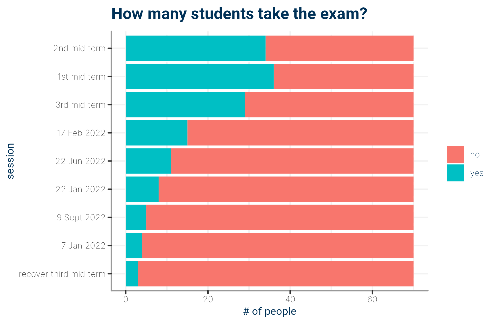

----

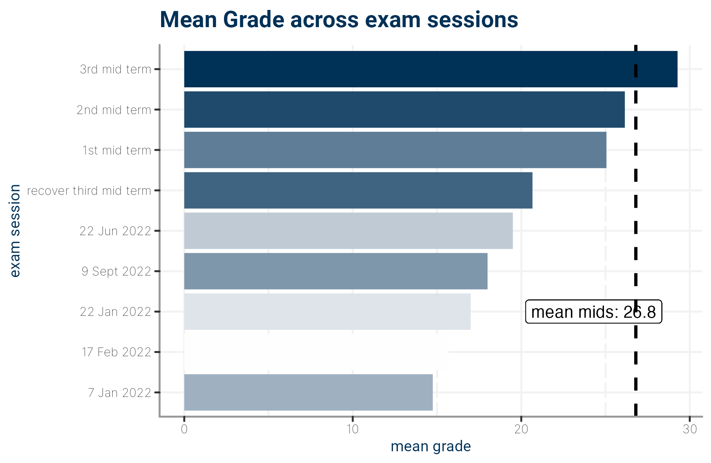

## 🎓 21-22 Students

... soon to be analysed ...

## 🎓 22-23 Students

... soon to be analysed ...

## 🎓 23-24 Students

... soon to be analysed ...

<!--chapter:end:94-courseperformance.Rmd-->

# ❓ Frequently Asked Questions

So there are a number of frequent troubles that students get most frequently stucked on. Here a collection of them with relative answer. What I generally suggest is to look for online answer just coping and pasting the error message from console to Google. **The most respected resource to look for when you are in trouble is [Stackovverflow](https://stackoverflow.com/)**.


## Q n'A 

- I can't really install <package> via `install.packages("<package>")`,  it gives me some weird stuff I cant undestrand.

> have you check the syntax? Did you spell correctly the package name, capital letters matters you know it?
> still have the problem? try to install it from source, in most cases packages source code lies in GitHub. Look for the package author and name then do that: `library(devtools)` (if you still have not already installed the package `devtools` run `install.packages("devtools)` then execute `library(devtools)`). At this point run `install_github("<github package author username>/<package name>")`. I did not mentioned it before because I give it fro granted: PLEASE BE SURE TO HAVE INTERNET CONNECTION ACCESS otherwise you are not going to dowload anything.

- So I have a file in local inside my R project and when I execute `read.csv("<path to file>")` that says R cant find the files, so what's up?

> most likely the problem is in the Working Directory ( check what Working Directory means \@ref(workdir)). Load `here` with  `library(here)` (if you still have not already installed the package `here`, then execute before `install.packages("here")` then `library(devtools)`). At this point run `here()` and verify the file lies in the very same directory in the output.

- Are lectures recorded?
> Generally Yes, the lectures will be recorded and made available to enrolled students. It might happen sometimes that teacher forget to start registration, if you notice please raise your hand and say it!

- Will the videos be made available publicly?
> This we can't do, we are sorry for that but it is internal policy

- Is attendance mandatory?
> We won't be taking attendance but we expect to see you often in class. We love talking to students to understand how you are doing, make sure you get the most out of the class, and get your feedback to improve the materials. The class is relatively small so we will probably get to know each other well.
If you have a time conflict and can't attend the online lectures, please send us an email to let us know!

- What is the format of the class?
> It will be lectures, laboratories, and discussion. Occasionally depending on how fast we do lectures we might have some industry experts giving us tutorials or themed speeches.

- Do I need to know R  for the course?
> Since R is the gold standard for statistics people, we expect most tutorials will be in R even though fluency isn't required, but will make your life so much easier during the course.

- Are there any (group) assignments?
> We are still discussing about that, evemntually we will make it clear in one month max

- I have a question about the class. What is the best way to reach the course staff?
> please email  [your teaching assistant](mailto:niccolo.salvini27@gmail.com), Dr. Niccolo Salvini if it is related to R and laboratories, if that is not the case drop an email to [Prof. Giuseppe Arbia](mailto:giuseppe.arbia@unicatt.it)

- I can't install package `OneTwoSamples`, why?
> This is something that has to do with incopatible R version between built time and your current R version. If that cunfuses you don't bother you are not going to use it. Instead you are going to use base R hyp testing with `stats::t.test()` or make use of `infer`, tidy statistical inferece.


<!--chapter:end:96-faqs.Rmd-->

# (PART\*) Appendix {.unnumbered}


# Symbols, formulas, statistics and parameters {#StatisticsAndParameters}


## Symbols and standard errors


(ref:DEFSamplingDistributionPhat) Def. \@ref(def:DEFSamplingDistributionPhat)

(ref:DEFSamplingDistributionXbar) Def. \@ref(def:DEFSamplingDistributionXbar)

(ref:DEFSamplingDistributionDbar) Def. \@ref(def:DEFSamplingDistributionDbar)


<table>
<caption>(\#tab:ParametersStatistics)Some sample statistics used to estimate population parameters. Empty table cells means that these are not studied in this textbook. The dashes means that no formula is given in this textbook.</caption>
 <thead>
  <tr>
   <th style="text-align:left;font-weight: bold;">   </th>
   <th style="text-align:center;font-weight: bold;"> Parameter </th>
   <th style="text-align:center;font-weight: bold;"> Statistic </th>
   <th style="text-align:center;font-weight: bold;"> Standard error </th>
   <th style="text-align:center;font-weight: bold;"> S.E. formula reference </th>
  </tr>
 </thead>
<tbody>
  <tr>
   <td style="text-align:left;"> Proportion </td>
   <td style="text-align:center;"> $p$ </td>
   <td style="text-align:center;"> $\hat{p}$ </td>
   <td style="text-align:center;"> $\displaystyle\text{s.e.}(\hat{p}) = \sqrt{\frac{ \hat{p} \times (1 - \hat{p})}{n}}$ </td>
   <td style="text-align:center;"> (ref:DEFSamplingDistributionPhat) </td>
  </tr>
  <tr>
   <td style="text-align:left;"> Mean </td>
   <td style="text-align:center;"> $\mu$ </td>
   <td style="text-align:center;"> $\bar{x}$ </td>
   <td style="text-align:center;"> $\displaystyle\text{s.e.}(\bar{x}) = \frac{s}{\sqrt{n}}$ </td>
   <td style="text-align:center;"> (ref:DEFSamplingDistributionXbar) </td>
  </tr>
  <tr>
   <td style="text-align:left;"> Standard deviation </td>
   <td style="text-align:center;"> $\sigma$ </td>
   <td style="text-align:center;"> $s$ </td>
   <td style="text-align:center;">  </td>
   <td style="text-align:center;">  </td>
  </tr>
  <tr>
   <td style="text-align:left;"> Mean difference </td>
   <td style="text-align:center;"> $\mu_d$ </td>
   <td style="text-align:center;"> $\bar{d}$ </td>
   <td style="text-align:center;"> $\displaystyle\text{s.e.}(\bar{d}) = \frac{s_d}{\sqrt{n}}$ </td>
   <td style="text-align:center;"> (ref:DEFSamplingDistributionDbar) </td>
  </tr>
  <tr>
   <td style="text-align:left;"> Diff. between means </td>
   <td style="text-align:center;"> $\mu_1 - \mu_2$ </td>
   <td style="text-align:center;"> $\bar{x}_1 - \bar{x}_2$ </td>
   <td style="text-align:center;"> $\displaystyle\text{s.e.}(\bar{x}_1 - \bar{x}_2)$ </td>
   <td style="text-align:center;"> -- </td>
  </tr>
  <tr>
   <td style="text-align:left;"> Odds ratio </td>
   <td style="text-align:center;"> Pop. OR </td>
   <td style="text-align:center;"> Sample OR </td>
   <td style="text-align:center;"> $\displaystyle\text{s.e.}(\text{sample OR})$ </td>
   <td style="text-align:center;"> -- </td>
  </tr>
  <tr>
   <td style="text-align:left;"> Correlation </td>
   <td style="text-align:center;"> $\rho$ </td>
   <td style="text-align:center;"> $r$ </td>
   <td style="text-align:center;">  </td>
   <td style="text-align:center;">  </td>
  </tr>
  <tr>
   <td style="text-align:left;"> Slope of regression line </td>
   <td style="text-align:center;"> $\beta_1$ </td>
   <td style="text-align:center;"> $b_1$ </td>
   <td style="text-align:center;"> $\text{s.e.}(b_1)$ </td>
   <td style="text-align:center;"> -- </td>
  </tr>
  <tr>
   <td style="text-align:left;"> Intercept of regression line </td>
   <td style="text-align:center;"> $\beta_0$ </td>
   <td style="text-align:center;"> $b_0$ </td>
   <td style="text-align:center;"> $\text{s.e.}(b_0)$ </td>
   <td style="text-align:center;"> -- </td>
  </tr>
  <tr>
   <td style="text-align:left;"> R-squared </td>
   <td style="text-align:center;">  </td>
   <td style="text-align:center;"> $R^2$ </td>
   <td style="text-align:center;">  </td>
   <td style="text-align:center;">  </td>
  </tr>
</tbody>
</table>


## Confidence intervals

Almost all **confidence intervals** have the form

\[ 
    \text{statistic} \pm ( \text{multiplier} \times \text{s.e.}(\text{statistic})).
\]

**Notes:**

* The multiplier is *approximately* 2 for an *approximate* 95% CI (based on the 68--95--99.7 rule).
* $\text{multiplier} \times \text{s.e.}(\text{statistic})$ is called the *margin of error*.
* Confidence intervals for *odds ratios* are slightly different, so **this formula does not apply for odds ratios**.
  For the same reason, a standard error for ORs is not given.


## Hypothesis testing

For many **hypothesis tests**, the *test statistic*\index{test statistic} is a $t$-score, which has the form:

\[
  t = \frac{\text{statistic} - \text{parameter}}{\text{s.e.}(\text{statistic})}.
\]

**Notes:**

* Since $t$-scores are a little like $z$-scores, the 68--95--99.7 rule can be used to *approximate* $P$-values.
* Tests involving *odds ratios* do not use $t$-scores, so **this formula does not apply for tests involving odds ratios**.
* For tests involving odds ratios, the *test statistic*\index{test statistic}
  is a $\chi^2$ score and not $t$-score.
  For the same reason, a standard error for ORs is not given.
* The $\chi^2$ statistic is approximately like a $z$-score with a value of (where $\text{df}$ is the 'degrees of freedom' given in the software output):

\[
   \sqrt{\frac{\chi^2}{\text{df}}}.
\]

 
(ref:AboutHypotheses) Sect. \@ref(AboutHypotheses)

(ref:TestStatObs) Sect. \@ref(TestStatObs)

(ref:AboutCIs) Chap. \@ref(AboutCIs)

(ref:StandardError) Def. \@ref(def:StandardError)


## Other formulas


* To [estimate the sample size needed](#EstimatingSampleSize) when **estimating a proportion**: $\displaystyle n = \frac{1}{(\text{Margin of error})^2}$.
* To [estimate the sample size needed](#EstimatingSampleSize) when **estimating a mean**: $\displaystyle n = \left( \frac{2\times s}{\text{Margin of error}}\right)^2$.
* To [calculate $z$-scores](#z-scores): $\displaystyle z = \frac{x - \mu}{\sigma}$ or, more generally, $\displaystyle z = \frac{\text{specific value of variable} - \text{mean of variable}}{\text{measure of variable's variation}}$.
* The [**unstandardizing formula**](#Unstandardising): $x = \mu + (z\times \sigma)$.

**Notes:**

* In **sample size calculations**, always **round up** the sample size found from the above formulas.


## Other symbols used

<table>
<caption>(\#tab:OtherSymbols)Some symbols used</caption>
 <thead>
  <tr>
   <th style="text-align:center;font-weight: bold;"> Symbol </th>
   <th style="text-align:left;font-weight: bold;"> Meaning </th>
   <th style="text-align:center;font-weight: bold;"> Reference </th>
  </tr>
 </thead>
<tbody>
  <tr>
   <td style="text-align:center;"> $H_0$ </td>
   <td style="text-align:left;"> Null hypothesis </td>
   <td style="text-align:center;"> (ref:AboutHypotheses) </td>
  </tr>
  <tr>
   <td style="text-align:center;"> $H_1$ </td>
   <td style="text-align:left;"> Alternative hypothesis </td>
   <td style="text-align:center;"> (ref:AboutHypotheses) </td>
  </tr>
  <tr>
   <td style="text-align:center;"> df </td>
   <td style="text-align:left;"> Degrees of freedom </td>
   <td style="text-align:center;"> (ref:TestStatObs) </td>
  </tr>
  <tr>
   <td style="text-align:center;"> CI </td>
   <td style="text-align:left;"> Confidence interval </td>
   <td style="text-align:center;"> (ref:AboutCIs) </td>
  </tr>
  <tr>
   <td style="text-align:center;"> s.e. </td>
   <td style="text-align:left;"> Standard error </td>
   <td style="text-align:center;"> (ref:StandardError) </td>
  </tr>
  <tr>
   <td style="text-align:center;"> $n$ </td>
   <td style="text-align:left;"> Sample size </td>
   <td style="text-align:center;">  </td>
  </tr>
  <tr>
   <td style="text-align:center;"> $\chi^2$ </td>
   <td style="text-align:left;"> The chi-squared test statistic </td>
   <td style="text-align:center;"> (ref:TestStatObs) </td>
  </tr>
</tbody>
</table>


<!--chapter:end:97-symbols-formulas-statistics-parameters.Rmd-->

# Datasets {#appendixdatasets}

This section provides information about the datasets used throughout the course. These datasets come from various R packages and are commonly used in statistical analysis and data science education.

## Built-in R Datasets

### `mtcars` - Motor Trend Car Road Tests
**Package**: `datasets`  
**Description**: Data extracted from the 1974 Motor Trend US magazine, and comprises fuel consumption and 10 aspects of automobile design and performance for 32 automobiles (1973–74 models).

**Variables**:
- `mpg`: Miles/(US) gallon
- `cyl`: Number of cylinders
- `disp`: Displacement (cu.in.)
- `hp`: Gross horsepower
- `drat`: Rear axle ratio
- `wt`: Weight (1000 lbs)
- `qsec`: 1/4 mile time
- `vs`: Engine (0 = V-shaped, 1 = straight)
- `am`: Transmission (0 = automatic, 1 = manual)
- `gear`: Number of forward gears
- `carb`: Number of carburetors

### `iris` - Edgar Anderson's Iris Data
**Package**: `datasets`  
**Description**: Famous dataset giving the measurements in centimeters of the variables sepal length and width and petal length and width, respectively, for 50 flowers from each of 3 species of iris.

**Variables**:
- `Sepal.Length`: Sepal length in cm
- `Sepal.Width`: Sepal width in cm
- `Petal.Length`: Petal length in cm
- `Petal.Width`: Petal width in cm
- `Species`: Species of iris (setosa, versicolor, virginica)

### `cars` - Speed and Stopping Distances of Cars
**Package**: `datasets`  
**Description**: The data give the speed of cars and the distances taken to stop.

**Variables**:
- `speed`: Speed (mph)
- `dist`: Stopping distance (ft)

## Course-Specific Datasets

### `bikeshare.csv` - Bike Sharing Data
**File**: `data/bikeshare.csv`  
**Description**: Dataset containing bike sharing information with various weather and temporal features.

**Variables**:
- `datetime`: Date and time
- `season`: Season (1:spring, 2:summer, 3:fall, 4:winter)
- `holiday`: Whether day is holiday or not
- `workingday`: If day is neither weekend nor holiday
- `weather`: Weather situation (1: Clear, 2: Mist, 3: Light Snow/Rain, 4: Heavy Rain)
- `temp`: Temperature in Celsius
- `atemp`: "Feels like" temperature in Celsius
- `humidity`: Relative humidity
- `windspeed`: Wind speed
- `casual`: Count of casual users
- `registered`: Count of registered users
- `count`: Count of total rental bikes

### `stroke_data.csv` - Stroke Prediction Data
**File**: `data/stroke_data.csv`  
**Description**: Dataset for predicting stroke occurrence based on various health indicators.

**Variables**:
- `id`: Unique identifier
- `gender`: Gender
- `age`: Age
- `hypertension`: Hypertension (0: No, 1: Yes)
- `heart_disease`: Heart disease (0: No, 1: Yes)
- `ever_married`: Ever married (No, Yes)
- `work_type`: Type of work
- `Residence_type`: Residence type (Rural, Urban)
- `avg_glucose_level`: Average glucose level
- `bmi`: Body mass index
- `smoking_status`: Smoking status
- `stroke`: Stroke (0: No, 1: Yes)

### `coronary.dta` - Coronary Heart Disease Data
**File**: `data/coronary.dta`  
**Description**: Dataset containing information about coronary heart disease patients.

**Variables**:
- Various medical and demographic variables related to coronary heart disease
- Used for survival analysis and medical statistics

## How to Access Datasets

### Built-in R Datasets

```r
# Load built-in datasets
data(mtcars)
data(iris)
data(cars)

# View dataset structure
str(mtcars)
head(mtcars)
```

### Course Datasets

```r
# Load course datasets
bikeshare <- read.csv("data/bikeshare.csv")
stroke_data <- read.csv("data/stroke_data.csv")

# View dataset structure
str(bikeshare)
head(bikeshare)
```

## Dataset Usage in Course

- **mtcars**: Used for linear regression examples and correlation analysis
- **iris**: Used for classification, clustering, and ANOVA examples
- **cars**: Used for simple linear regression demonstrations
- **bikeshare**: Used for time series analysis and multiple regression
- **stroke_data**: Used for logistic regression and classification examples
- **coronary**: Used for survival analysis examples

## Additional Resources

For more information about these datasets:
- R documentation: `?mtcars`, `?iris`, `?cars`
- Course materials and exercises
- Statistical analysis examples in course chapters

<!--chapter:end:98-datasets.Rmd-->


# References {-}


## Statistical Methods and R Programming

- Everitt, B., Hothorn, T. (2011). *An Introduction to Applied Multivariate Analysis with R*. Springer-Verlag.

- James, G., Witten, D., Hastie, T., & Tibshirani, R. (2015). *An Introduction to Statistical Learning, with Applications in R*. Springer.

- Timbers, T., Campbell, T., & Lee, M. (2022). *Data Science: A First Introduction*. [Online version](https://datasciencebook.ca/)

- Wickham, H., & Grolemund, G. (2018). *R for Data Science*. O'Reilly. [Freely available online](https://r4ds.had.co.nz/index.html)

- Dauber, D. (2022). *R for non-programmers*. [Free book](https://bookdown.org/daniel_dauber_io/r4np_book/starting-your-r-projects.html)

## Advanced R Programming

- Higgins, P. D. R. (2022). *Reproducible Medical Research with R*. [Free book](https://bookdown.org/pdr_higgins/rmrwr/)

- Armstrong, J. K. (2022). *Fundamentals of Wrangling Healthcare Data with R*. [Free book](https://bookdown.org/jkylearmstrong/jeff_data_wrangling/)

- Wickham, H. (2015). *Advanced R*. CRC Press. [Free book](https://adv-r.hadley.nz/)

## Statistical Software and Tools

- R Core Team (2024). *R: A language and environment for statistical computing*. R Foundation for Statistical Computing, Vienna, Austria.

- RStudio Team (2024). *RStudio: Integrated Development Environment for R*. RStudio, PBC, Boston, MA.

- Xie, Y., Allaire, J. J., & Grolemund, G. (2018). *R Markdown: The Definitive Guide*. Chapman and Hall/CRC.

## Course Materials

- Salvini, N. (2025). *Statistics & Big Data 25-26 Labs*. Course website and materials.

- Dabo-Niang, S. (2025). *Advanced Modeling Techniques*. Intensive session materials.

## Additional Resources

- CRAN Task Views: [https://cran.r-project.org/web/views/](https://cran.r-project.org/web/views/)

- R-bloggers: [https://www.r-bloggers.com/](https://www.r-bloggers.com/)

- Stack Overflow R Tag: [https://stackoverflow.com/questions/tagged/r](https://stackoverflow.com/questions/tagged/r)

- R Documentation: [https://www.rdocumentation.org/](https://www.rdocumentation.org/)

<!--chapter:end:99-references.Rmd-->

