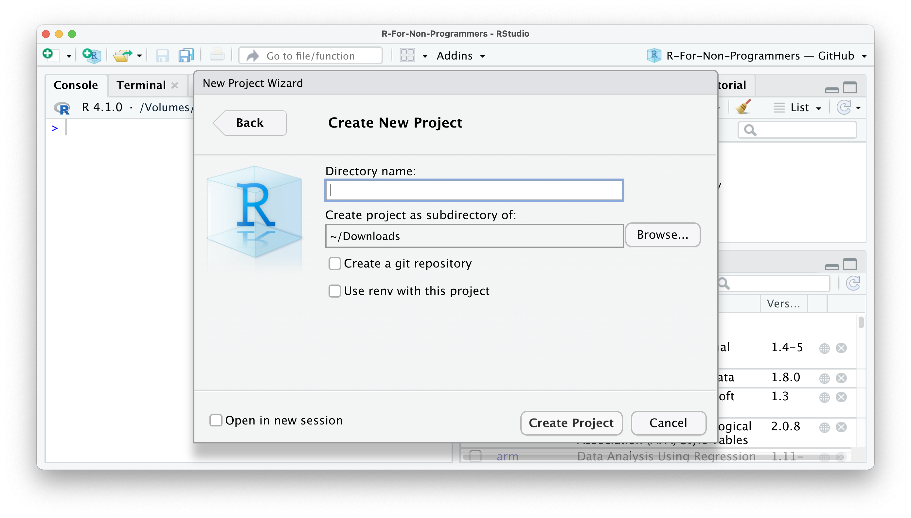

--- 
title: "Statistics & Big Data 25-26 Labs"
author: "Dr. Niccolò Salvini"
date: "2025-10-24"
site: bookdown::bookdown_site
documentclass: book
bibliography: [book.bib, packages.bib]
# url: your book url like https://bookdown.org/yihui/bookdown
# cover-image: path to the social sharing image like images/cover.jpg
description: |
  This is a minimal course website containing class materials for  Statistics & Big Data labs @ucsc.
biblio-style: apalike
csl: chicago-fullnote-bibliography.csl
---

# 🫶 About

 This is the official course website for Statistics & Big data @UCSC 2025 - 2026 for laboratories. This website augments lecture topics and provides exercises for home and class assignments. Additional theory wrt slides and textbook will not be part of the exam, indeed they are for your growth and hopefully in the future as quicksilver resource to recover R proficiency from lethargy. 


## 🔧 Logistics {#logistics}

- **Lectures**: 
  - Mondays: 14:00 - 17:00 CET
  - Tuesdays: 10:00 - 13:00 CET
- **Location**: Campus Gemelli, Room 20 (and optionally remote)
- **Office hours**:
  - Dr. Niccolò **Salvini**: Available via email and for questions before/after lectures
  - Prof. Sophie **Dabo-Niang**: Available during intensive session (week of November 17th)
- here's the [shared drive](https://drive.google.com/drive/folders/1e1HVjSYABJ8rLUErHWbQOhAhQ_OA_Xo9?usp=sharing) (slides notebooks extra in class)

<!--- - **Grading**:
  one final project to build an ML application (65%). We'll have a demo day to showcase all students' final projects. See last year projects here two to three fun, short assignments (30%) discussion participation in class + EdStem + OHs (5%) --->


## 👥 Team {#team}

<style type="text/css">

.instructor {
    display: inline-block;
    width: 160px;
    text-align: center;
    margin-right: 20px;
    margin-bottom: 10px;
    font-size: 17px;
    vertical-align: top;
}


.instructorphoto img {
    width: 150px;
    border-radius: 140px;
    margin-bottom: 10px;
}

.col-md-2, .col-md-6 {
    position: relative;
    min-height: 1px;
    padding-right: 15px;
    padding-left: 15px;
}

</style>


````{=html}
<div class="row">
            <div class="col-md-3">
                <h3>Instructor</h3>
                <div class="instructor">
                    <a href="https://niccolosalvini.notion.site/Niccol-Salvini-PhD-2b09a3f0a7014b1182eb51578c058685">
                        <div class="instructorphoto"></div>
                        <div>Dr. Niccolò Salvini</div>
                    </a>
                </div>
            </div>
            <div class="col-md-3">
                <h3>Instructor</h3>
                <div class="instructor">
                    <a href="https://sites.google.com/view/sophie-dabo-niang/">
                        <div class="instructorphoto"></div>
                        <div>Prof. Sophie Dabo-Niang</div>
                    </a>
                </div>
            </div>
        </div>
````


## 🗒 labs' contents {#labs-content}

### Part 1: The Foundations (Dr. Niccolò Salvini)
- Introduction to the R ecosystem
  - Install R and RStudio
  - R tricks for research and professional life
  - Data wrangling with R
- Hypothesis Testing Fundamentals
  - Alternative hypothesis testing
  - How to calculate p-values
  - Hypothesis testing with null hypothesis
  - Hypothesis testing on averages
- Analysis of Variance (ANOVA)
  - Testing more than 2 means
- Chi-Square Tests
  - Testing more than 2 proportions
- Linear Regression Analysis
  - Simple linear regression
  - Multiple linear regression
  - Nonlinear regression
  - Regression with dummy variables
- Logistic Regression
  - Introduction to logistic regression

### Part 2: Advanced Modeling (Prof. Sophie Dabo-Niang)
- Factor Analysis
- Cluster Analysis
- Discrimination & Classification
- Binomial & Multinomial Logistic Regression
- Kernel Methods
- General Additive Models
- Other Supervised Models 

<!---
- Other supervised classification models: outline of regression trees approach (CART), CHAID, C.5, Random Forest, and Gradient Boosting classification algorithms; Bagging, Boosting and other ensembling techniques; Approach to the evaluation criteria of a binary classification model. 
--->


## Exam 📝

The exam is going to be open and closed questions on theory and practice (coding part). You will be asked to provide results and sometimes code leading to these results. You can also be asked to directly provide code to solve for that exercise. The exam is going to take place in labs classroom, this means you are **not** going to have your laptop during the exam. We generally don't provide assignment neither group works. Indeed we provide intermediate exams for those who want to try them.

we are going to have **2 intermediate sessions** exams on half of the whole content of the course. This means:
- _first intermediate_: will happen typically on **November** and will be on Part 1 content (Dr. Salvini's part)
- _second intermediate_: will happen in **January/February** on Part 2 content (Prof. Dabo-Niang's part)

you can take first intermediate and take the second on each exam date within the winter session, meaning you take part 1 in Nov and part 2 in either Jan and Feb. You can **not** reject intermediates, that means if you take first part, try the second and did not perform well, you need to take the full. Grades may undergo to a review process before being official if they are particularly low. This has happened quite often, but it does not happen every time. 


## 📚 Suggested reading list {#suggested-reading}

I am going to split resources by the expected level of their audience: 

### Minimal or 0 knowledge of R

- Everitt, B., Hothorn, T. (2011) An Introduction to Applied Multivariate Analysis with R, Springer-Verlag
- James, G, Witten, D, Hastie, T and Tibshirani, R, (2015) An Introduction to Statistical Learning, with Applications in R
- T. Timbers, T. Campbell, M. Lee  Data Science: A First Introduction, Jul 2022 [online version](https://datasciencebook.ca/)
- Wickham, H., Grolemund G. (2018) R for Data Science, O’Reilly. Freely available  on-line at https://r4ds.had.co.nz/index.html
- R for non-programmers, Daniel Dauber 2022, [free book](https://bookdown.org/daniel_dauber_io/r4np_book/starting-your-r-projects.html) 

### Advanced knowledge of R to become a top G

- Reproducible Medical Research with R,Peter D.R. Higgins, MD, PhD, MSc, 2022, [free book](https://bookdown.org/pdr_higgins/rmrwr/)
- Fundamentals of Wrangling Healthcare Data with R, J. Kyle Armstrong 2022, [free book](https://bookdown.org/jkylearmstrong/jeff_data_wrangling/) **Advanced**
- Wickham H. (2015). Advanced r. CRC Press [free book](https://adv-r.hadley.nz/)


## 📜 Honor Code {#honorcode}
Permissive but strict. If unsure, please ask the course staff!

- <span style="color: red;"><b>NOT OKAY</b></span> Pleeease, I am using ChatGPT and its derivatives on a daily basis. I understand, it's awesome and we are not enforcing any rule against it a home. Don't do that during the exam.
- <span style="color: green;"><b>OK</b></span> to search, ask in public about the systems we’re studying. Cite all the resources you reference.
E.g. if you read it in a paper, cite it. If you ask on Quora, include the link.
- <span style="color: red;"><b>NOT OKAY</b></span> to ask someone to do assignments/projects for you, we are monitoring freelancing websites, we have a plethora of bots doing this job daily.
- <span style="color: green;"><b>OK</b></span> to discuss questions with classmates. Disclose your discussion partners.
- <span style="color: red;"><b>NOT OKAY</b></span> to blindly copy solutions from classmates.
- <span style="color: green;"><b>OK</b></span> to use existing solutions as part of your projects/assignments. Clarify your contributions.
- <span style="color: red;"><b>NOT OKAY</b></span> to pretend that someone’s solution is yours.
- <span style="color: green;"><b>OK</b></span> to publish your final project after the course is over (we encourage that and if you need it I would love to help you!)
- <span style="color: red;"><b>NOT OKAY</b></span> to post your assignment solutions online.

## QR code time!


## Colophon {#intro-colophon}

This book was authored using [bookdown](https://bookdown.org/) inside [RStudio](https://www.rstudio.com/products/rstudio/) with [bs4 theme](https://pkgs.rstudio.com/bookdown/reference/bs4_book.html)
The [website](sbd-labs-25-26.netlify.app) is hosted with [Netlify](https://www.netlify.com), and automatically updated after Netlify CI.
The complete source is available from [GitHub](https://github.com/NiccoloSalvini/sbd_25-26).

This version of the book was built with:


```r
library(devtools)
#> Loading required package: usethis
library(roxygen2)
library(testthat)
#> 
#> Attaching package: 'testthat'
#> The following object is masked from 'package:devtools':
#> 
#>     test_file
#> The following object is masked from 'package:dplyr':
#> 
#>     matches
devtools::session_info()
#> ─ Session info ───────────────────────────────────────────
#>  setting  value
#>  version  R version 4.2.0 (2022-04-22)
#>  os       macOS 15.6.1
#>  system   aarch64, darwin20
#>  ui       X11
#>  language (EN)
#>  collate  en_US.UTF-8
#>  ctype    en_US.UTF-8
#>  tz       Europe/Rome
#>  date     2025-10-24
#>  pandoc   3.7.0.2 @ /opt/homebrew/bin/ (via rmarkdown)
#> 
#> ─ Packages ───────────────────────────────────────────────
#>  package      * version    date (UTC) lib source
#>  bookdown       0.29       2022-09-12 [1] CRAN (R 4.2.0)
#>  brio           1.1.3      2021-11-30 [1] CRAN (R 4.2.0)
#>  bslib          0.5.1      2023-08-11 [1] CRAN (R 4.2.0)
#>  cachem         1.0.8      2023-05-01 [1] CRAN (R 4.2.0)
#>  callr          3.7.3      2022-11-02 [1] CRAN (R 4.2.0)
#>  cli            3.6.2      2023-12-11 [1] CRAN (R 4.2.3)
#>  crayon         1.5.2      2022-09-29 [1] CRAN (R 4.2.0)
#>  devtools     * 2.4.5      2022-10-11 [1] CRAN (R 4.2.0)
#>  dichromat      2.0-0.1    2022-05-02 [1] CRAN (R 4.2.0)
#>  digest         0.6.33     2023-07-07 [1] CRAN (R 4.2.0)
#>  downlit        0.4.2      2022-07-05 [1] CRAN (R 4.2.0)
#>  dplyr        * 1.1.4      2023-11-17 [1] CRAN (R 4.2.3)
#>  ellipsis       0.3.2      2021-04-29 [1] CRAN (R 4.2.0)
#>  evaluate       1.0.3      2025-01-10 [1] CRAN (R 4.2.0)
#>  fansi          1.0.4      2023-01-22 [1] CRAN (R 4.2.0)
#>  farver         2.1.1      2022-07-06 [1] CRAN (R 4.2.0)
#>  fastmap        1.1.1      2023-02-24 [1] CRAN (R 4.2.0)
#>  fs             1.6.3      2023-07-20 [1] CRAN (R 4.2.0)
#>  generics       0.1.3      2022-07-05 [1] CRAN (R 4.2.0)
#>  glue         * 1.6.2      2022-02-24 [1] CRAN (R 4.2.0)
#>  htmltools      0.5.6.1    2023-10-06 [1] CRAN (R 4.2.0)
#>  htmlwidgets    1.6.2      2023-03-17 [1] CRAN (R 4.2.0)
#>  httpuv         1.6.6      2022-09-08 [1] CRAN (R 4.2.0)
#>  httr           1.4.6      2023-05-08 [1] CRAN (R 4.2.0)
#>  jquerylib      0.1.4      2021-04-26 [1] CRAN (R 4.2.0)
#>  jsonlite       1.8.7      2023-06-29 [1] CRAN (R 4.2.0)
#>  kableExtra   * 1.3.4.9000 2023-06-01 [1] Github (kupietz/kableExtra@3bf9b21)
#>  knitr        * 1.44       2023-09-11 [1] CRAN (R 4.2.0)
#>  later          1.3.0      2021-08-18 [1] CRAN (R 4.2.0)
#>  lifecycle      1.0.3      2022-10-07 [1] CRAN (R 4.2.0)
#>  lubridate    * 1.9.2      2023-02-10 [1] CRAN (R 4.2.0)
#>  magrittr       2.0.3      2022-03-30 [1] CRAN (R 4.2.0)
#>  memoise        2.0.1      2021-11-26 [1] CRAN (R 4.2.0)
#>  mime           0.12       2021-09-28 [1] CRAN (R 4.2.0)
#>  miniUI         0.1.1.1    2018-05-18 [1] CRAN (R 4.2.0)
#>  pillar         1.9.0      2023-03-22 [1] CRAN (R 4.2.0)
#>  pkgbuild       1.4.2      2023-06-26 [1] CRAN (R 4.2.0)
#>  pkgconfig      2.0.3      2019-09-22 [1] CRAN (R 4.2.0)
#>  pkgload        1.4.0      2024-06-28 [1] CRAN (R 4.2.0)
#>  prettyunits    1.1.1      2020-01-24 [1] CRAN (R 4.2.0)
#>  processx       3.8.4      2024-03-16 [1] CRAN (R 4.2.3)
#>  profvis        0.3.8      2023-05-02 [1] CRAN (R 4.2.0)
#>  promises       1.2.0.1    2021-02-11 [1] CRAN (R 4.2.0)
#>  ps             1.7.5      2023-04-18 [1] CRAN (R 4.2.0)
#>  purrr          1.0.2      2023-08-10 [1] CRAN (R 4.2.0)
#>  R6             2.5.1      2021-08-19 [1] CRAN (R 4.2.0)
#>  RColorBrewer   1.1-3      2022-04-03 [1] CRAN (R 4.2.0)
#>  Rcpp           1.0.12     2024-01-09 [1] CRAN (R 4.2.3)
#>  remotes        2.4.2      2021-11-30 [1] CRAN (R 4.2.0)
#>  rlang          1.1.3      2024-01-10 [1] CRAN (R 4.2.3)
#>  rmarkdown      2.25       2023-09-18 [1] CRAN (R 4.2.0)
#>  roxygen2     * 7.3.1      2024-01-22 [1] CRAN (R 4.2.3)
#>  rstudioapi     0.14       2022-08-22 [1] CRAN (R 4.2.0)
#>  rvest          1.0.3      2022-08-19 [1] CRAN (R 4.2.0)
#>  sass           0.4.6      2023-05-03 [1] CRAN (R 4.2.0)
#>  scales         1.4.0      2025-04-24 [1] CRAN (R 4.2.0)
#>  sessioninfo    1.2.2      2021-12-06 [1] CRAN (R 4.2.0)
#>  shiny          1.7.2      2022-07-19 [1] CRAN (R 4.2.0)
#>  stringi        1.7.12     2023-01-11 [1] CRAN (R 4.2.0)
#>  stringr        1.5.0      2022-12-02 [1] CRAN (R 4.2.0)
#>  svglite        2.1.1      2023-01-10 [1] CRAN (R 4.2.0)
#>  systemfonts    1.0.4      2022-02-11 [1] CRAN (R 4.2.0)
#>  testthat     * 3.2.1.1    2024-04-14 [1] CRAN (R 4.2.3)
#>  tibble         3.2.1      2023-03-20 [1] CRAN (R 4.2.0)
#>  tidyselect     1.2.0      2022-10-10 [1] CRAN (R 4.2.0)
#>  timechange     0.2.0      2023-01-11 [1] CRAN (R 4.2.0)
#>  urlchecker     1.0.1      2021-11-30 [1] CRAN (R 4.2.0)
#>  usethis      * 2.1.6      2022-05-25 [1] CRAN (R 4.2.0)
#>  utf8           1.2.3      2023-01-31 [1] CRAN (R 4.2.0)
#>  vctrs          0.6.5      2023-12-01 [1] CRAN (R 4.2.3)
#>  viridisLite    0.4.2      2023-05-02 [1] CRAN (R 4.2.0)
#>  webexercises * 1.0.0      2021-09-15 [1] CRAN (R 4.2.0)
#>  webshot        0.5.4      2022-09-26 [1] CRAN (R 4.2.0)
#>  withr          3.0.2      2024-10-28 [1] CRAN (R 4.2.0)
#>  xfun           0.40       2023-08-09 [1] CRAN (R 4.2.0)
#>  xml2           1.3.4      2023-04-27 [1] CRAN (R 4.2.0)
#>  xtable         1.8-4      2019-04-21 [1] CRAN (R 4.2.0)
#>  yaml           2.3.7      2023-01-23 [1] CRAN (R 4.2.0)
#> 
#>  [1] /Users/niccolo/Library/R/arm64/4.2/library
#>  [2] /Library/Frameworks/R.framework/Versions/4.2-arm64/Resources/library
#> 
#> ──────────────────────────────────────────────────────────
```

<!--chapter:end:index.Rmd-->

# (PART\*) Get Started {.unnumbered}

# ✨Prerequisites  {#prereq}

## Setting up R and RStudio

To get started with R, you need to acquire your own copy. This appendix will show you how to download R as well as RStudio, a software application that makes R easier to use. You’ll go from downloading R to opening your first R session. Use the menu on the right hand side of the page to select your OS and follow the correct installation.

Both R and RStudio are free and easy to download. **If you feel more comfortable interacting with videos instead of reading** please visit <ins> [this interactive tutorials](https://learnr-examples.shinyapps.io/ex-setup-r/) </ins> that will guide you through the full R set up!

## How to Download and Install R

R is maintained by an international team of developers who make the language available through the web page of The Comprehensive R Archive Network i.e. CRAN. The top of the web page provides three links for downloading R. Follow the link that describes your operating system: Windows, Mac, or Linux.

### **R in Windows**

To install R on Windows, click the “Download R for Windows” link. Then click the “base” link. Next, click the first link at the top of the new page. This link should say something like “Download R 3.0.3 for Windows,” except the 3.0.3 will be replaced by the most current version of R. The link downloads an installer program, which installs the most up-to-date version of R for Windows. Run this program and step through the installation wizard that appears. The wizard will install R into your program files folders and place a shortcut in your Start menu. Note that you’ll need to have all of the appropriate administration privileges to install new software on your machine. (more detailed steps)

### **R in Mac**

This is also my setup, feel free to reach me at  [my mail address](mailto:niccolo.salvini27@gmail.com) if something is messed up.

1. Go to [www.r-project.org](www.r-project.org)

<div class="figure">

<p class="caption">(\#fig:rproj-page)The R mirrors website</p>
</div>

  
2.  Click on `CRAN` where it says `Download`.

3.  Choose a server in your country (all of them work, but downloads will perform quicker if you choose your country or one that is close to where you are).

<div class="figure">

<p class="caption">(\#fig:cran-mirrors)CRAN mirrors</p>
</div>

4.  Select the operating system for your computer, for example `Download R for macOS`.

<div class="figure">

<p class="caption">(\#fig:os-choice)OS choices available</p>
</div>


5.  Select the version you want to install (I recommend the latest version)

<div class="figure">

<p class="caption">(\#fig:r-versions)R versions available</p>
</div>

6.  Open the downloaded file and follow the installation instructions. I recommend leaving the suggested settings as they are.

:::note
**Binaries Versus Source**

R can be installed from precompiled binaries or built from source on any operating system. For Windows and Mac machines, installing R from binaries is extremely easy. The binary comes preloaded in its own installer. Although you can build R from source on these platforms, the process is much more complicated and won’t provide much benefit for most users. For Linux systems, the opposite is true. Precompiled binaries can be found for some systems, but it is much more common to build R from source files when installing on Linux. The download pages on CRAN’s website provide information about building R from source for the Windows, Mac, and Linux platforms.
:::

### **R in Linux**

R comes preinstalled on many Linux systems, but you’ll want the newest version of R if yours is out of date. The CRAN website provides files to build R from source on Debian, Redhat, SUSE, and Ubuntu systems under the link “Download R for Linux.” Click the link and then follow the directory trail to the version of Linux you wish to install on. The exact installation procedure will vary depending on the Linux system you use. CRAN guides the process by grouping each set of source files with documentation or README files that explain how to install on your system.

:::note
**32-bit Versus 64-bit**

R comes in both 32-bit and 64-bit versions. Which should you use? In most cases, it won’t matter. Both versions use 32-bit integers, which means they compute numbers to the same numerical precision. The difference occurs in the way each version manages memory. 64-bit R uses 64-bit memory pointers, and 32-bit R uses 32-bit memory pointers. This means 64-bit R has a larger memory space to use (and search through).
As a rule of thumb, 32-bit builds of R are faster than 64-bit builds, though not always. On the other hand, 64-bit builds can handle larger files and data sets with fewer memory management problems. In either version, the maximum allowable vector size tops out at around 2 billion elements. If your operating system doesn’t support 64-bit programs, or your RAM is less than 4 GB, 32-bit R is for you. The Windows and Mac installers will automatically install both versions if your system supports 64-bit R.
:::

## Using R

R isn’t a program that you can open and start using, like Microsoft Word or Internet Explorer. Instead, R is a computer language, like C, C++, or UNIX. You use R by writing commands in the R language and asking your computer to interpret them. In the old days, people ran R code in a UNIX terminal window—as if they were hackers in a movie from the 1980s. Now almost everyone uses R with an application called RStudio, and I recommend that you do, too.

:::fyi

**R and UNIX**

You can still run R in a UNIX or BASH window (prompt or Powershell) by typing the command:
R
which opens an R interpreter. You can then do your work and close the interpreter by running `q()` when you are finished.
:::

## Using RStudio

*R* by itself is just the '*beating heart*' of *R* programming, but it has no particular user interface. You may have heard me saying stuff like: "R is the **engine** of the car, indeed RStudio is the **car body**, that's true, you just don't need an engine if you don't have a car body. That is to say: if you want buttons to click and actually '*see*' what you are doing, there is no better way than RStudio.
RStudio is an *integrated development environment* (IDE) and will be our primary tool to interact with *R*. It is the only software you need to do all the fun parts and, of course, to follow along with the examples of this book. 
You may ask yourself what is Posit, fair question. Back in the days Posit, the company behind RStudio, was actually named RStudio (as their product). Then in 2023 they rebranded themselves as Posit to also include other languages like Python,

Howeveeeer to install RStudio perform the following steps:

1.  Go to [https://posit.co/](https://posit.co/ "https://posit.co/")

<div class="figure">

<p class="caption">(\#fig:rstudio-main)The Posit.co main page</p>
</div>

2.  Go to `DOWNLOAD RSTUDIO` in the upper right corner (download R if you still haven't).

3. Select `DOWNLOAD RSTUDIO`, just on the left of `DOWNLOAD RSTUDIO SERVER`.

<div class="figure">

<p class="caption">(\#fig:rstudio-select-version)Choose RStudio version</p>
</div>

4.  On this page, scroll down and select the Download (in the download column) corresponding to your OS (mind that different versions of the same OS, say macOS 11.2 or macOS 8.3 need different RStudio download installations).

<div class="figure">

<p class="caption">(\#fig:rstudio-select-os-version)Choose RStudio version</p>
</div>
  
5.  Open the downloaded file and follow the installation instructions. Again, keep it to the default settings as much as possible.

Congratulations, you are all set up to learn *R*. From now on you only need to start RStudio and not *R*. Of course, if you are the curious type, nothing shall stop you to try *R* without RStudio.


## When you first start RStudio {#when-you-first-start-rstudio}

Before you start programming away, you might want to make some tweaks to your settings right away to have a better experience (in my humble opinion). To open the Rstudio settings you have to click on

-   `RStudio > Preferences` or press `⌘ + ,` if you are on a Mac.

-   `RStudio > Tools > Global Options` or press `Ctrl + ,` if you work on a Windows computer.

I recommend to at least make the following changes to set yourself up for success right from the beginning:

1.  Already on the first tab, i.e. `General > Basic`, we should make one of the most significant changes. Deactivate every option that starts with `Restore`. This will ensure that every time you start RStudio, you begin with a clean slate. At first sight, it might sound counter-intuitive not to restart everything where you left off, but it is essential to make all your projects easily reproducible. Furthermore, if you work together with others, not restoring your personal settings also ensures that your programming works across different computers. Therefore, I recommend having the following unticked:

    -   `Restore most recently opened project at startup`,

    -   `Restore previsouly open source documents at startup`,

    -   `Restore .Rdata into workspace at startup`


<div class="figure">

<p class="caption">(\#fig:rstudio-preferences)get your RStudio preferences</p>
</div>


2.  In the same tab under `Workspace`, select `Never` for the setting `Save workspace to .RData on exit`. One might think it is wise to keep intermediary results stored from one R session to another. However, I often found myself fixing issues due to this lazy method, and my code became less reliable and, therefore, reproducible. With experience, you will find that this avoids many headaches.

3.  In the `Code > Editing` tab, make sure to have at least the first five options ticked, especially the `Auto-indent code after paste`. This setting will save time when trying to format your coding appropriately, making it easier to read. Indentation is the primary way of making your code look more readable and less like a series of characters that appear almost random.

<div class="figure">

<p class="caption">(\#fig:rstudio-prefediting)Pimp your RStudio IDE</p>
</div>

4.  In the `Display` tab, you might want to have the first three options selected. In particular, `Highlight selected line` is helpful because, in more complicated code, it is helpful to see where your cursor is.

<div class="figure">

<p class="caption">(\#fig:rstudio-prefdisp)Edit your RStudio display preferences</p>
</div>


Of course, if you wish to customise your workspace further, you can do so. The visually most impactful way to alter the default appearance of RStudio is to select `Appearance` and pick a completely different colour theme. Feel free to browse through various options and see what you prefer. There is no right or wrong here. Just make it your own.

<div class="figure">

<p class="caption">(\#fig:rstudio-prefappear)This will get you instantly nerd</p>
</div>


## Updating R and RStudio: Living at the pulse of innovation {#updating-r-and-rstudio}

While not strictly something that helps you become a better programmer, this advice might come in handy to avoid turning into a frustrated programmer. When you update your software, you need to update *R* and RStudio separately from each other. While both *R* and RStudio work closely with each other, they still constitute separate pieces of software. Thus, it is essential to keep in mind that updating RStudio will not automatically update R. This can become problematic if specific tools you installed via RStudio (like a fancy learning algorithm) might not be compatible with earlier versions of *R*. Also, additional *R* packages (see Chapter \@ref(r-packages)) developed by other developers are separate pieces which require updating too, independently from *R* and RStudio.

I know what you are thinking: This already sounds complicated and cumbersome. However, rest assured, we take a look at how you can easily update all your packages with RStudio. Thus, all you need to remember is: *R* needs to be updated separately from everything else.


<!--chapter:end:01-prerequisites.Rmd-->

# 📦 R Packages

Many of R’s most useful functions do not come preloaded when you start R, but reside in packages that can be installed on top of R. R packages are similar to libraries in C, C++, and Javascript, packages in Python, and gems in Ruby. An R package bundles together useful functions, help files, and data sets. You can use these functions within your own R code once you load the package they live in. Usually the contents of an R package are all related to a single type of task, which the package helps solve. R packages will let you take advantage of R’s most useful features: its large community of package writers (many of whom are active data scientists) and its prewritten routines for handling many common (and exotic) data-science tasks.

:::fyi
**Base R**
You may hear R users (or me) refer to “base R.” What is base R? It is just the collection of R functions that gets loaded every time you start R. These functions provide the basics of the language, and you don’t have to load a package before you can use them.
:::

## Installing Packages


To use an R package, you must first install it on your computer and then load it in your current R session. The easiest way to install an R package is with the `install.packages` R function. Open R and type the following into the command line:


```r
install.packages("<package name>")
```

This will search for the specified package in the collection of packages hosted on the CRAN site. When R finds the package, it will download it into a libraries folder on your computer. R can access the package here in future R sessions without reinstalling it. Anyone can write an R package and disseminate it as they like; however, almost all R packages are published through the CRAN website. CRAN tests each R package before publishing it. This doesn’t eliminate every bug inside a package, but it does mean that you can trust a package on CRAN to run in the current version of R on your OS.

You can install multiple packages at once by linking their names with R’s concatenate function, c. For example, to install the ggplot2, reshape2, and dplyr packages, run:


```r
install.packages(c("ggplot2", "dplyr", "carData", "spdep"))
```

If this is your first time installing a package, R will prompt you to choose an online mirror of to install from. Mirrors are listed by location. Your downloads should be quickest if you select a mirror that is close to you. If you want to download a new package, try the Austria mirror first. This is the main CRAN repository, and new packages can sometimes take a couple of days to make it around to all of the other mirrors.

## Loading Packages

Installing a package doesn’t immediately place its functions at your fingertips. It just places them on your computer. To use an R package, you next have to load it in your R session with the command:


```r
library("<package name>")

```

Notice that the quotation marks have disappeared. You can use them if you like, but quotation marks are optional for the `library` command. (This is not true for the `install.packages` command).

`library` will make all of the package’s functions, data sets, and help files available to you until you close your current R session. The next time you begin an R session, you’ll have to reload the package with `library` if you want to use it, but you won’t have to reinstall it. You only have to install each package once. After that, a copy of the package will live in your R library. To see which packages you currently have in your R library, run:


```r
library()
```

`library()` also shows the path to your actual R library, which is the folder that contains your R packages. You may notice many packages that you don’t remember installing. This is because R automatically downloads a set of useful packages when you first install R.

:::note
**Install packages from (almost) anywhere**

The devtools R package makes it easy to install packages from locations other than the CRAN website. devtools provides functions like install_github, install_gitorious, install_bitbucket, and install_url. These work similar to install.packages, but they search new locations for R packages. install_github is especially useful because many R developers provide development versions of their packages on GitHub. The development version of a package will contain a sneak peek of new functions and patches but may not be as stable or as bug free as the CRAN version.
:::

Why does R make you bother with installing and loading packages? You can imagine an R where every package came preloaded, but this would be a very large and slow program. As of May 6, 2014, the CRAN website hosts 5,511 packages. It is simpler to only install and load the packages that you want to use when you want to use them. This keeps your copy of R fast because it has fewer functions and help pages to search through at any one time. The arrangement has other benefits as well. For example, it is possible to update your copy of an R package without updating your entire copy of R.

:::fyi
**What’s the best way to learn about R packages?**

It is difficult to use an R package if you don’t know that it exists. You could go to the CRAN website and click the Packages link to see a list of available packages, but you’ll have to wade through thousands of them. Moreover, many R packages do the same things.

How do you know which package does them best? The R-packages [mailing list](https://stat.ethz.ch/mailman/listinfo/r-packages) is a place to start. It sends out announcements of new packages and maintains an archive of old announcements. Blogs that aggregate posts about R can also provide valuable leads. I recommend R-bloggers. RStudio maintains a list of some of the most useful R packages in the Getting Started section of http://support.rstudio.com. Finally, CRAN groups together some of the most useful—and most respected—packages by [subject area](https://cran.r-project.org/web/views/). This is an excellent place to learn about the packages designed for your area of work.
:::

## Updating R and Its Packages
The R Core Development Team continuously hones the R language by catching bugs, improving performance, and updating R to work with new technologies. As a result, new versions of R are released several times a year. The easiest way to stay current with R is to periodically check the CRAN website. The website is updated for each new release and makes the release available for download. You’ll have to install the new release. The process is the same as when you first installed R.

Don’t worry if you’re not interested in staying up-to-date on R Core’s doings. R changes only slightly between releases, and you’re not likely to notice the differences. However, updating to the current version of R is a good place to start if you ever encounter a bug that you can’t explain.

RStudio also constantly improves its product. You can acquire the newest updates just by downloading them from [RStudio](https://www.rstudio.com/products/rstudio/).

### **R Packages**
Package authors occasionally release new versions of their packages to add functions, fix bugs, or improve performance. The `update.packages` command checks whether you have the most current version of a package and installs the most current version if you do not. The syntax for `update.packages` follows that of `install.packages`. If you already have `ggplot2`, `reshape2`, and `dplyr` on your computer, it’d be a good idea to check for updates before you use them:


```r
update.packages(c("ggplot2", "dplyr", "carData", "spdep"))
```

You should start a new R session after updating packages. If you have a package loaded when you update it, you’ll have to close your R session and open a new one to begin using the updated version of the package.


<!--chapter:end:02-rpackages.Rmd-->

# 🔥 Nice warm-up

Now we are going to cover some very basic operations and computer science concepts with R. Hopefully this will get you with a really cool starter pack of function that you might reuse throughout you R journey.

<!-- Some other very insightful resources related to wrangling Healthcare data according to `{Tidyverse}` conventions may include (by proficiency level): -->

<!-- - Fundamentals of Wrangling Healthcare Data with R, J. Kyle Armstrong 2022, [free book](https://bookdown.org/jkylearmstrong/jeff_data_wrangling/) -->
<!-- -  -->
<!-- -  -->

## Starting your fresh new R project

Every fresh attempt is likely to pique your interest and pique your emotions. And it should. You will uncover the answers to your research questions, and you should become more knowledgeable as a consequence. However, you are likely to dislike certain aspects of data analysis. Two examples spring to mind:

- **A** Keeping track of all the files generated by my project

- **B** Data manipulation

While we will go into deeper detail on data manipulation in a later chapter, I'd like to share some ideas from my work that helped me stay organized and, as a result, less frustrated. The following is applicable to both small and large research projects, making it extremely useful regardless of the circumstance or size of the project.

## Creating an *R* Project file {#creating-an-r-project}

When working on a project, you likely create many different files for various purposes, especially *R* Scripts (`File > New File > R Script`). If you are not careful, this file is stored in your system's default location, which might not be where you want them to be. RStudio allows you to manage your entire project intuitively and conveniently through *R* Project files. Using *R* Project files comes with a couple of perks, for example:

-  All of the files you create are saved in the same location. Your data, coding, exported charts, reports, and so on are all in one location, so you don't have to maintain the files manually. This is because RStudio sets the root directory to the folder where your project is stored.

-   If you wish to share your project, you may do so by sharing the entire folder, and others can rapidly replicate your study or assist in issue resolution. This is due to the fact that all file paths are relative rather than absolute.

-  You may utilize GitHub more readily for backups and so-called 'version control' tools, which allows you to trace changes to your code over time. (btw this is really crucial in work envirnoments, if you would like to know more about that I dedicated a [tutorial website](https://corso-git.netlify.app/) of git+GitHub+RStudio workflow and a set of slides to explain these concepts). This is **not a requirement** for the course and you can skip that. However let me clarify that: it is a nice-to-have skill whenever you are collaborating with someone. It could happen on the job, or while writing your thesis, you name it.

For the time being, the most significant reason to make *R* Project files is the ease of file organization and the ability to readily share them with co-investigators, your supervisor, or your students.

To create an R Project, you need to perform the following steps:


1.  Select `File > New Project…` from the menu bar.

<div class="figure">

<p class="caption">(\#fig:rproj-menu)Get the R project</p>
</div>


2.  Select `New Directory` from the popup window.

<div class="figure">

<p class="caption">(\#fig:rproj-new-dir)New Project Wizard pop up menu</p>
</div>

3.  Next, select `New Project`.

<div class="figure">

<p class="caption">(\#fig:rproj-open-new-dir)The full set of project you can initialize through the RStudio IDE</p>
</div>

4.  Pick a meaningful name for your project folder, i.e. the `Directory Name`. Ensure this project folder is created in the right place. You can change the `subdirectory` by clicking on `Browse…`. Ideally the subdirectory is a place where you usually store your research projects.


<div class="figure">

<p class="caption">(\#fig:rproj-specs)The RProject specifications</p>
</div>


5.  You have the option to `Create a git repository`. This is only relevant if you already have a GitHub account and wish to use version control. For now, you can happily ignore it if you do not use GitHub.

6.  Lastly, tick `Open in new session`. This will open your *R* Project in a new RStudio window.

<div class="figure">

<p class="caption">(\#fig:rproj-dirname)Choose a directory name for your new project</p>
</div>


7.  Once you are happy with your choices, you can click `Create Project`. This will open a new *R* Session, and you can start working on your project.

<div class="figure">

<p class="caption">(\#fig:rproj-open-new-session)A new RStudio Session will pop up just like magic!</p>
</div>

If you look carefully, you can see that your RStudio is now 'branded' with your project name. At the top of the window, you see the project name, the files pane shows the root directory where all your files will be, and even the console shows on top the file path of your project. You could set all this up manually, but I would not recommend it, not the least because it is easy and swift to work with *R* Projects


## Working Directory with `here` {#workdir}

When you bootstrap your RProject in that way, RStudio is going to take care of many headaches that any fresher and sophmore developer have in the beginning. As a matter of fact each time you double click on the RStudio project file (the one that finishes with .RProj) RStudio will link itself to the directory on your computer you specified during the creation of the project, in the previous case "tidy_tuesday_2021_08_03". This is called the **Working Directory**. 
What it is interesting it that this place is where R will look for files when you attempt to load them, and it is where R will save files when you save them. The location of your working directory will vary on different computers. 
There is a _base_ (rather vintage) way to look for the working directory.
To understrand which directory R is using as your working directory, run:


```r
getwd()
## "/Users/niccolo/Desktop/r_projects/sbd_22-23"
```

However since we live in 2022 we are going to use a very convenient package i.e. `here` that does exactly the same thing but prettier and more intuitively.


```r
install.packages("here")
library(here)
here()
## "/Users/niccolo/Desktop/r_projects/sbd_22-23"
```

`here()` is going to look for the `.RProj` file and will the Working Directory exactly where it is placed.


## Creating an R Script

Code may easily grow lengthy and complicated. As a result, writing it on the console is inconvenient. As an alternative, we may write code into a R Script. An R Script is a document that is recognized by RStudio as R programming code. Non-R Script files, such as `.txt`,`.rtf`, or `.md`, can also be opened in RStudio, but any code typed in them will not be immediately recognized.

When you open or create a new R script, it will appear in the Source pane. This window is sometimes referred to as the 'script editor'. An R script begins with an empty file. Good coding etiquette requires us to put a comment # on the first line to describe what this file does. Here's a 'TidyTuesday' R Project sample.

<div class="figure">

<p class="caption">(\#fig:rscript)Open an R Script and write some on it</p>
</div>


All of the examples in this tutorial are made to be copied and pasted into your own R script. However, you will need to install the R packages for certain code. Let's give it a shot with the following code. The plot produced by this code displays which car company provides the most fuel-efficient vehicles. This code should be copied and pasted into your R script. Below there's a simple script that generates a plot, copy and paste into your file, then execute it.


```r

library(tidyverse)

mpg %>% 
  ggplot(aes(x = reorder(manufacturer, desc(hwy), FUN = median),
                   y = hwy,
                   fill = manufacturer)) +
  geom_boxplot() +
  coord_flip() +
  theme_minimal() +
  xlab("Manufacturer") +
  ylab("Highway miles per gallon")
```


You're probably wondering what happened to your plot. Copying the code will not execute it in your *R* script. However, this is required in order to develop the plot. If you pressed `Return ↵`, you would just add a new line. Instead, choose the code you wish to run and hit `Ctrl+Return ↵` (PC) or `Cmd+Return ↵` (Mac). You may also use the `Run` command at the top of your source window, but the keyboard shortcut is far more convenient. Furthermore, you will rapidly remember this shortcut because we will need to utilize it frequently. If everything is in order, you should see the following:


As you can see, Honda automobiles appear to travel the furthest with the same quantity of fuel (a gallon) as other vehicles. As a result, if you're seeking for cheap automobiles, you now know where to look at.

It's worth noting that the R script editor includes some handy features for developing code. You've undoubtedly noticed that part of the code we've pasted is blue and others is green. Because they have a distinct significance, these colors aid in making your code more understandable. In the default settings, green represents any value in "", which often represents characters. Syntax highlighting refers to the automatic coloring of our programming code.


## Using R Markdown

There is too lot to say about R Markdown, so I'll just mention that it exists and highlight one feature that could persuade you to use it instead of plain R scripts: They appear to be _Word documents_ (almost).

R Markdown files, as the name implies, are a mix of R scripts and 'Markdown.' 'Markdown' is a method of composing and formatting text documents without the use of software such as Microsoft Word. You instead write everything in plain text. Such plain text may be translated into a variety of document forms, including HTML webpages, PDF files, and Word documents. I recommend checking out the [R Markdown Cheatsheet](https://www.rstudio.com/resources/cheatsheets/) to learn how it works. `Click File > New File > R Markdown` to create a R Markdown file.

An R Markdown file is the inverse of a R script. By default, a R script treats everything as code, and we can only use language to describe what the code does by commenting `#`. This is what you've seen in all of the previous code examples. An R Markdown file, on the other hand, treats everything as text and requires us to declare what is code. We may accomplish this by injecting 'code chunks.' As a result, using comments `#` in R Markdown files is less necessary because you may write about it. Another advantage of R Markdown files is that the results of your analysis are shown immediately underneath the code chunk rather than in the terminal. They are also sometimes called **notebooks** since they can display both code and text together, the Python equivalent for those that have been someway exposed to Python scripting in **Jupyter**


<!--chapter:end:03-nicewarmup.Rmd-->

# 🗒️ Syllabus

The lecture slides, notes, tutorials, and assignments will be posted on <ins> [this drive](https://drive.google.com/drive/folders/1e1HVjSYABJ8rLUErHWbQOhAhQ_OA_Xo9?usp=sharing) </ins>, feel free to jump on it. please do not anticipate questions that we will address in class, instead [drop me a mail](mailto:niccolo.salvini27@gmail.com) if you are not sure about something.

If for any reasons you have trouble accessing the G Drive, still please contact [your teaching assistant](mailto:niccolo.salvini27@gmail.com). One common issue students complain is that you may need to be authorization to access, because I may have forgotten to switch on the open to share option. If you see me, knock me on the shoulder!

This schedule is subject to change according to the pace of the class and we may schedule a further lab if you feel you are not really ready for the intermediate exam.

This is the updated edition of this course with Dr. Niccolò Salvini (Part 1) and Prof. Sophie Dabo-Niang (Part 2).

## Course Materials

All course materials are available in the `slides/` folder:

### Part 1: The Foundations (Dr. Niccolò Salvini)

**Slides by Dr. Niccolò Salvini:**
- [Hypothesis Testing with Null Hypothesis](slides/02_hypt_testing_null_hypo.pdf)
- [Hypothesis Testing with Alternative Hypothesis](slides/03_hypt_testing_alternative_hypo.pdf)
- [How to Calculate P-values](slides/04_how_to_calculate_pvalues.pdf)
- [Hypothesis Testing on Averages](slides/hypt_testing_on_avg.pdf)
- [Exercises on Hypothesis Testing](slides/05_hypt_testing_exeR.pdf)
- [Multiple Linear Regression](slides/mlt_lin_reg.pdf)
- [Nonlinear Regression](slides/nonlinear_regression.pdf)
- [Introduction to Linear Regression](slides/intro_linear_regr.pdf)
- [Introduction to Logistic Regression](slides/intro to logistic regression.pdf)

**Slides by Prof. Vincenzo Nardelli:**
- [Linear Regression](slides/linear_regression.pdf)


### Part 2: Advanced Modeling (Prof. Sophie Dabo-Niang)
- Materials will be provided during the intensive session (week of November 17th)

## Course Structure

**Part 1: The Foundations (Dr. Niccolò Salvini)**
- 5 hours of integrated labs during regular lectures
- Mondays: 14:00 - 17:00 CET
- Tuesdays: 10:00 - 13:00 CET

**Part 2: Advanced Modeling (Prof. Sophie Dabo-Niang)**
- 5 hours intensive session during the week of November 17th

to be ready: 

| Date        | Description                                                  | Materials                                                                    | Events           |
| ----------- | ------------------------------------------------------------ | ---------------------------------------------------------------------------- | ---------------- |
| Sept 22-23 | Introduction to RStudio + Hypothesis Testing Fundamentals | [Null Hypothesis Testing](slides/02_hypt_testing_null_hypo.pdf) | Laboratory + Lecture          |
| Sept 22-23 | Alternative Hypothesis Testing + P-values Calculation | [Alternative Hypothesis](slides/03_hypt_testing_alternative_hypo.pdf) | Laboratory + Lecture |
| Sept 22-23 | How to Calculate P-values | [P-values Calculation](slides/04_how_to_calculate_pvalues.pdf) | Laboratory + Lecture |
| [TBD] | Hypothesis Testing on Averages | [Testing on Averages](slides/hypt_testing_on_avg.pdf) and [Exercises](slides/05_hypt_testing_exeR.pdf) | Laboratory |
| [TBD] | Chi-Square Tests (more than 2 proportions) | [Null Hypothesis Testing](slides/hypt_testing_null_hypo.pdf) | Laboratory |
| Sept 29-30, Oct 6-7 | Simple Linear Regression | [Introduction to Linear Regression](slides/intro_linear_regr.pdf), [Linear Regression](slides/linear_regression.pdf) | Laboratory + Theory |
| Sept 29-30, Oct 6-7 | Multiple Linear Regression | [Multiple Linear Regression](slides/mlt_lin_reg.pdf) | Laboratory + Theory |
| Sept 29-30, Oct 6-7 | Nonlinear Regression + Dummy Variables | [Nonlinear Regression](slides/nonlinear_regression.pdf) | Laboratory + Theory |
| Oct 7 | Logistic Regression | [Introduction to Logistic Regression](slides/intro to logistic regression.pdf) | Laboratory + Theory |
| [TBD] | First Intermediate Exam (Part 1) | | Exam |
| Week of Nov 17th | Intensive Session - Advanced Modeling | Materials provided during session | Laboratory |
| [TBD] | Second Intermediate Exam (Part 2) | | Exam |


<!--chapter:end:04-syllabus.Rmd-->

# (PART\*) Part 1: The Foundations {.unnumbered}

# 🧪 Hypothesis Testing Fundamentals

This chapter introduces the fundamental concepts of hypothesis testing, covering alternative hypothesis testing, p-value calculation, and hypothesis testing with null hypothesis.

## Learning Objectives

By the end of this chapter, you will be able to:

- Understand the concept of hypothesis testing
- Formulate null and alternative hypotheses
- Calculate and interpret p-values
- Perform hypothesis tests on averages
- Make statistical decisions based on test results

## Introduction to Hypothesis Testing

Hypothesis testing is a statistical method used to make decisions about population parameters based on sample data. It involves:

1. **Formulating hypotheses**: Stating a null hypothesis (H₀) and an alternative hypothesis (H₁)
2. **Collecting data**: Gathering sample data relevant to the hypothesis
3. **Calculating test statistics**: Computing appropriate test statistics
4. **Making decisions**: Comparing test statistics to critical values or p-values

## Null and Alternative Hypotheses

### Null Hypothesis (H₀)
The null hypothesis represents the status quo or the claim we want to test. It typically states that there is no effect, no difference, or no relationship.

**Examples:**
- H₀: μ = 50 (population mean equals 50)
- H₀: μ₁ = μ₂ (two population means are equal)
- H₀: ρ = 0 (no correlation between variables)

### Alternative Hypothesis (H₁)
The alternative hypothesis represents what we want to prove or the claim we're testing for. It can be:

- **One-tailed**: H₁: μ > 50 or H₁: μ < 50
- **Two-tailed**: H₁: μ ≠ 50

## P-values and Statistical Significance

### What is a P-value?
The p-value is the probability of observing a test statistic as extreme as, or more extreme than, the one calculated from the sample data, assuming the null hypothesis is true.

### Interpreting P-values
- **p < 0.05**: Strong evidence against H₀ (reject H₀)
- **p < 0.01**: Very strong evidence against H₀ (reject H₀)
- **p > 0.05**: Weak evidence against H₀ (fail to reject H₀)

### Common Misconceptions
- P-value is NOT the probability that H₀ is true
- P-value is NOT the probability that H₁ is true
- P-value is NOT the probability of making a Type I error

## Hypothesis Testing on Averages

### One-Sample t-test
Used to test whether a population mean differs from a specified value.

**Assumptions:**
- Data is normally distributed (or large sample size)
- Observations are independent
- Random sampling

**Test Statistic:**
```
t = (x̄ - μ₀) / (s/√n)
```

Where:
- x̄ = sample mean
- μ₀ = hypothesized population mean
- s = sample standard deviation
- n = sample size

### Two-Sample t-test
Used to compare means between two groups.

**Types:**
- **Independent samples**: Two separate groups
- **Paired samples**: Same subjects measured twice

## Practical Example

Let's work through a practical example using R:


```r
# Load required packages
library(tidyverse)

# Example: Testing if a new teaching method improves test scores
# H₀: μ_new = μ_old (no difference in means)
# H₁: μ_new > μ_old (new method is better)

# Sample data
old_method <- c(65, 70, 68, 72, 69, 71, 67, 73, 70, 68)
new_method <- c(72, 75, 78, 74, 76, 79, 73, 77, 75, 74)

# Perform two-sample t-test
t_test_result <- t.test(new_method, old_method, alternative = "greater")
print(t_test_result)

# Extract p-value
p_value <- t_test_result$p.value
cat("P-value:", p_value, "\n")

# Make decision
if (p_value < 0.05) {
  cat("Reject H₀: New method significantly improves scores\n")
} else {
  cat("Fail to reject H₀: No significant improvement\n")
}
```

## Type I and Type II Errors

### Type I Error (α)
- **Definition**: Rejecting H₀ when it's actually true
- **Probability**: α (significance level, typically 0.05)
- **Consequence**: False positive

### Type II Error (β)
- **Definition**: Failing to reject H₀ when it's actually false
- **Probability**: β
- **Consequence**: False negative

### Power (1 - β)
- **Definition**: Probability of correctly rejecting H₀ when it's false
- **Goal**: Maximize power while controlling Type I error

## Best Practices

1. **State hypotheses clearly** before collecting data
2. **Choose appropriate significance level** (usually α = 0.05)
3. **Check assumptions** before performing tests
4. **Report effect sizes** along with p-values
5. **Avoid p-hacking** (don't change hypotheses after seeing results)
6. **Consider multiple comparisons** when testing many hypotheses

## Summary

Hypothesis testing is a powerful statistical tool for making data-driven decisions. Key points to remember:

- Always formulate clear null and alternative hypotheses
- Understand what p-values represent and don't represent
- Consider both statistical and practical significance
- Be aware of Type I and Type II errors
- Follow best practices to ensure valid results

## Further-on

- Slides: `02_hypt_testing_null_hypo.pdf`, `03_hypt_testing_alternative_hypo.pdf`, `04_how_to_calculate_pvalues.pdf`, `hypt_testing_on_avg.pdf`, `05_hypt_testing_exeR.pdf`
- Additional resources available in the course drive

<!--chapter:end:05-hypothesis-testing-fundamentals.Rmd-->

# 📈 Linear Regression Analysis

This chapter covers linear regression analysis, including simple linear regression, multiple linear regression, and nonlinear regression techniques.

## Learning Objectives

By the end of this chapter, you will be able to:

- Understand the principles of linear regression
- Perform simple and multiple linear regression
- Interpret regression coefficients and statistics
- Assess model fit and assumptions
- Handle nonlinear relationships
- Use R for regression analysis

## Introduction to Linear Regression

Linear regression is a statistical method used to model the relationship between a dependent variable (Y) and one or more independent variables (X). It assumes a linear relationship between the variables.

### Simple Linear Regression

Simple linear regression models the relationship between two variables:

**Model**: Y = β₀ + β₁X + ε

Where:
- Y = dependent variable (response)
- X = independent variable (predictor)
- β₀ = intercept
- β₁ = slope
- ε = error term

### Multiple Linear Regression

Multiple linear regression extends simple regression to include multiple predictors:

**Model**: Y = β₀ + β₁X₁ + β₂X₂ + ... + βₖXₖ + ε

## Assumptions of Linear Regression

1. **Linearity**: The relationship between X and Y is linear
2. **Independence**: Observations are independent
3. **Homoscedasticity**: Constant variance of errors
4. **Normality**: Errors are normally distributed
5. **No multicollinearity**: Independent variables are not highly correlated

## Model Evaluation Metrics

### R-squared (R²)
- **Definition**: Proportion of variance in Y explained by X
- **Range**: 0 to 1
- **Interpretation**: Higher values indicate better fit

### Adjusted R-squared
- **Definition**: R² adjusted for the number of predictors
- **Use**: Compare models with different numbers of predictors
- **Formula**: 1 - (1-R²)(n-1)/(n-k-1)

### Root Mean Square Error (RMSE)
- **Definition**: Standard deviation of residuals
- **Interpretation**: Lower values indicate better fit
- **Units**: Same as dependent variable

## Practical Example: Simple Linear Regression


```r
# Load required packages
library(tidyverse)
library(broom)

# Create sample data
set.seed(123)
n <- 100
x <- rnorm(n, mean = 50, sd = 10)
y <- 2 + 0.5 * x + rnorm(n, mean = 0, sd = 5)

# Create data frame
data <- data.frame(x = x, y = y)

# Fit simple linear regression
model <- lm(y ~ x, data = data)

# View model summary
summary(model)

# Extract key statistics
model_summary <- summary(model)
r_squared <- model_summary$r.squared
adj_r_squared <- model_summary$adj.r.squared
p_value <- model_summary$coefficients[2, 4]

cat("R-squared:", round(r_squared, 3), "\n")
cat("Adjusted R-squared:", round(adj_r_squared, 3), "\n")
cat("P-value:", round(p_value, 4), "\n")

# Create visualization
ggplot(data, aes(x = x, y = y)) +
  geom_point(alpha = 0.6) +
  geom_smooth(method = "lm", se = TRUE) +
  labs(
    title = "Simple Linear Regression",
    x = "Independent Variable (X)",
    y = "Dependent Variable (Y)"
  ) +
  theme_minimal()
```

## Multiple Linear Regression

### Example with Multiple Predictors


```r
# Load required packages
library(tidyverse)
library(car)  # for VIF calculation

# Create sample data with multiple predictors
set.seed(123)
n <- 100
x1 <- rnorm(n, mean = 50, sd = 10)
x2 <- rnorm(n, mean = 30, sd = 8)
x3 <- rnorm(n, mean = 20, sd = 5)
y <- 10 + 0.3 * x1 + 0.2 * x2 - 0.1 * x3 + rnorm(n, mean = 0, sd = 3)

# Create data frame
data <- data.frame(x1 = x1, x2 = x2, x3 = x3, y = y)

# Fit multiple linear regression
model <- lm(y ~ x1 + x2 + x3, data = data)

# View model summary
summary(model)

# Check for multicollinearity using VIF
vif_values <- vif(model)
print("Variance Inflation Factors:")
print(vif_values)

# Interpretation guidelines:
# VIF < 5: No multicollinearity concern
# VIF 5-10: Moderate multicollinearity
# VIF > 10: High multicollinearity
```

## Nonlinear Regression

When the relationship between variables is not linear, we can use nonlinear regression techniques.

### Polynomial Regression


```r
# Create nonlinear data
set.seed(123)
x <- seq(0, 10, length.out = 50)
y <- 2 + 0.5 * x + 0.1 * x^2 + rnorm(50, mean = 0, sd = 1)

# Create data frame
data <- data.frame(x = x, y = y)

# Fit polynomial regression (quadratic)
model_poly <- lm(y ~ x + I(x^2), data = data)

# View model summary
summary(model_poly)

# Create visualization
ggplot(data, aes(x = x, y = y)) +
  geom_point(alpha = 0.6) +
  geom_smooth(method = "lm", formula = y ~ x + I(x^2), se = TRUE) +
  labs(
    title = "Polynomial Regression (Quadratic)",
    x = "Independent Variable (X)",
    y = "Dependent Variable (Y)"
  ) +
  theme_minimal()
```

### Logarithmic Transformation


```r
# Create exponential data
set.seed(123)
x <- seq(1, 10, length.out = 50)
y <- exp(0.5 + 0.3 * x + rnorm(50, mean = 0, sd = 0.1))

# Create data frame
data <- data.frame(x = x, y = y)

# Fit log-transformed model
model_log <- lm(log(y) ~ x, data = data)

# View model summary
summary(model_log)

# Create visualization
ggplot(data, aes(x = x, y = y)) +
  geom_point(alpha = 0.6) +
  geom_smooth(method = "lm", se = TRUE) +
  scale_y_log10() +
  labs(
    title = "Log-transformed Regression",
    x = "Independent Variable (X)",
    y = "Dependent Variable (Y) - Log Scale"
  ) +
  theme_minimal()
```

## Model Diagnostics

### Residual Analysis


```r
# Load required packages
library(tidyverse)
library(broom)

# Fit model
model <- lm(y ~ x1 + x2 + x3, data = data)

# Get residuals and fitted values
model_data <- augment(model)

# Residual plots
# 1. Residuals vs Fitted Values
ggplot(model_data, aes(x = .fitted, y = .resid)) +
  geom_point(alpha = 0.6) +
  geom_hline(yintercept = 0, linetype = "dashed") +
  labs(
    title = "Residuals vs Fitted Values",
    x = "Fitted Values",
    y = "Residuals"
  ) +
  theme_minimal()

# 2. Q-Q Plot for normality
ggplot(model_data, aes(sample = .resid)) +
  stat_qq() +
  stat_qq_line() +
  labs(
    title = "Q-Q Plot of Residuals",
    x = "Theoretical Quantiles",
    y = "Sample Quantiles"
  ) +
  theme_minimal()

# 3. Scale-Location Plot
ggplot(model_data, aes(x = .fitted, y = sqrt(abs(.resid)))) +
  geom_point(alpha = 0.6) +
  geom_smooth(se = FALSE) +
  labs(
    title = "Scale-Location Plot",
    x = "Fitted Values",
    y = "√|Standardized Residuals|"
  ) +
  theme_minimal()
```

## Best Practices

1. **Check assumptions** before interpreting results
2. **Use appropriate transformations** for nonlinear relationships
3. **Avoid overfitting** by not including too many predictors
4. **Consider interaction terms** when theoretically justified
5. **Report confidence intervals** for coefficients
6. **Validate models** using cross-validation when possible

## Common Pitfalls

1. **Correlation vs Causation**: Regression doesn't imply causation
2. **Extrapolation**: Be cautious when predicting outside the data range
3. **Outliers**: Check for influential observations
4. **Missing data**: Handle missing values appropriately
5. **Model selection**: Use appropriate criteria for model comparison

## Summary

Linear regression is a fundamental statistical technique for modeling relationships between variables. Key points:

- Understand the assumptions and check them
- Use appropriate metrics to evaluate model fit
- Consider nonlinear relationships when necessary
- Perform thorough diagnostics
- Interpret results carefully and avoid common pitfalls

## Further-on

- Slides: `linear_regression.pdf`, `mlt_lin_reg.pdf`, `nonlinear_regression.pdf`
- Additional resources available in the course drive

<!--chapter:end:06-linear-regression-analysis.Rmd-->

# 📝 Intermediate Exam Simulation - Healthcare Management {#exam-sim-intermediate}

This is a comprehensive simulation of the intermediate exam covering all major statistical topics applied to healthcare management scenarios. Complete all 20 questions to test your knowledge and prepare for the actual exam.

**Instructions**: Answer all questions carefully. Solutions are provided at the end of this chapter.

---

## 🏥 Question 1: Data Wrangling - Reshaping Data

::: {.exercise #exam1}
You have a `patient_data` dataframe with columns: `patient_id`, `emergency_visits`, and `outpatient_visits`. Reshape the data into a "long" format with three columns: `patient_id`, `visit_type` (containing "emergency_visits" or "outpatient_visits"), and `visit_count`. Write the R command using the tidyr package.

**Sample data:**
```r
set.seed(123)
patient_data <- data.frame(
  patient_id = 1:10,
  emergency_visits = rpois(10, 2),
  outpatient_visits = rpois(10, 5)
)
```
:::

---

## 🏥 Question 2: Data Wrangling - Complex Filtering

::: {.exercise #exam2}
From a `patient_satisfaction` dataset with columns `patient_id`, `department` (e.g., "Cardiology", "Orthopedics", "Emergency"), `satisfaction_score`, and `treatment_cost`, write a dplyr pipeline to create a summary table showing the number of patients, mean satisfaction score, and total treatment cost for each department. Show only departments with more than 50 patients AND mean satisfaction above 4.0.

**Sample data:**
```r
set.seed(456)
patient_satisfaction <- data.frame(
  patient_id = 1:200,
  department = sample(c("Cardiology", "Orthopedics", "Emergency", "Pediatrics", "Surgery"), 200, replace = TRUE),
  satisfaction_score = sample(1:5, 200, replace = TRUE, prob = c(0.1, 0.1, 0.2, 0.3, 0.3)),
  treatment_cost = rnorm(200, 5000, 1500)
)
```
:::

---

## 🏥 Question 3: Data Wrangling - Advanced Calculations

::: {.exercise #exam3}
A hospital needs to calculate physician bonuses based on performance. Given a `physician_data` dataframe with columns `physician_id`, `patient_satisfaction_score`, `years_experience`, and `specialty`, create a new column `bonus_amount` that calculates 2% of satisfaction score per year of experience, with a maximum bonus of 8000 and a minimum bonus of 1000 for physicians with less than 3 years experience. Additionally, add a 15% specialty bonus for physicians in "Emergency Medicine" due to higher risk. Write the complete dplyr pipeline.

**Sample data:**
```r
set.seed(789)
physician_data <- data.frame(
  physician_id = 1:100,
  patient_satisfaction_score = rnorm(100, 85, 10),
  years_experience = sample(1:20, 100, replace = TRUE),
  specialty = sample(c("Emergency Medicine", "Cardiology", "Orthopedics", "Pediatrics"), 100, replace = TRUE)
)
```
:::

---

## 🏥 Question 4: Data Wrangling - Complex Reshaping

::: {.exercise #exam4}
From a `patient_monitoring` dataset with columns `patient_id`, `measurement_date`, `pain_level`, `mobility_score`, and `measurement_time` (with values "morning" or "evening"), filter to include only patients who have taken both types of measurements, and calculate the difference in their pain levels between these two measurement times. Also calculate the correlation between morning and evening pain levels. Write the complete dplyr pipeline.

**Sample data:**
```r
set.seed(321)
patient_monitoring <- data.frame(
  patient_id = rep(1:50, each = 2),
  measurement_date = rep(seq.Date(as.Date("2024-01-01"), by = "day", length.out = 50), each = 2),
  measurement_time = rep(c("morning", "evening"), 50),
  pain_level = rnorm(100, 5, 1.5),
  mobility_score = rnorm(100, 7, 1.2)
)
```
:::

---

## 🏥 Question 5: Data Wrangling - Advanced Grouping

::: {.exercise #exam5}
You have hospital performance data in long format. The `hospital_performance` dataframe contains `hospital_id`, `quarter` (with values "Q1", "Q2", "Q3", "Q4"), `patient_volume`, and `region`. Reshape this data into wide format so that each hospital has one row with separate columns for each quarter (`volume_Q1`, `volume_Q2`, `volume_Q3`, `volume_Q4`). Then calculate the quarterly growth rate for each hospital (Q4 vs Q1). Write the complete pipeline.

**Sample data:**
```r
set.seed(654)
hospital_performance <- data.frame(
  hospital_id = rep(1:30, each = 4),
  quarter = rep(c("Q1", "Q2", "Q3", "Q4"), 30),
  patient_volume = rnorm(120, 1000, 200),
  region = rep(sample(c("North", "South", "East", "West"), 30, replace = TRUE), each = 4)
)
```
:::

---

## 🔬 Question 6: Hypothesis Testing - Single Population

::: {.exercise #exam6}
A hospital claims that their new patient management system reduces average waiting time by 15 minutes. In a pilot study with 45 patients, the mean reduction was 18 minutes with a standard deviation of 6 minutes. Test at α = 0.05 if the actual reduction is significantly greater than the claimed 15 minutes. Write the R command and interpret the results.

**Sample data:**
```r
set.seed(123)
waiting_time_reduction <- rnorm(45, mean = 18, sd = 6)
```
:::

---

## 🔬 Question 7: Hypothesis Testing - Proportions

::: {.exercise #exam7}
A hospital claims that 35% of patients are satisfied with their emergency department experience. In a sample of 400 patients, only 120 reported satisfaction. Write the R command to test if the true satisfaction rate is significantly lower than 35%. Calculate the 95% confidence interval for the true proportion and interpret both results.
:::

---

## 🔬 Question 8: Hypothesis Testing - Two Populations

::: {.exercise #exam8}
A hospital is testing a new training program for nurses. The same 25 nurses took a patient safety competency test before and after the training. Test if the training program significantly improved the test scores. Write the appropriate R command and state whether this should be a paired or unpaired test.

**Sample data:**
```r
set.seed(456)
nurse_data <- data.frame(
  nurse_id = 1:25,
  before = rnorm(25, 72, 5),
  after = rnorm(25, 78, 5)
)
```
:::

---

## 🔬 Question 9: Hypothesis Testing - Two Proportions

::: {.exercise #exam9}
Two hospitals are comparing their patient satisfaction rates. Hospital A reports that 180 out of 250 patients (72%) were satisfied, while Hospital B reports that 210 out of 280 patients (75%) were satisfied. Write the R command to test if there is a significant difference in satisfaction rates between the two hospitals. Calculate the effect size and interpret the results.
:::

---

## 🔬 Question 10: Hypothesis Testing - Advanced Concepts

::: {.exercise #exam10}
A study compares the patient satisfaction scores between two different hospital wards. Before running a t-test, you perform a Levene's test for equality of variances and get a p-value of 0.02. Which type of two-sample t-test should you use and why? Write the R command for the appropriate t-test, assuming you have a `patient_satisfaction` dataframe with `score` and `ward` columns.

**Sample data:**
```r
set.seed(789)
patient_satisfaction <- data.frame(
  score = c(rnorm(30, 4.2, 0.8), rnorm(35, 4.0, 1.2)),
  ward = rep(c("Ward_A", "Ward_B"), c(30, 35))
)
```
:::

---

## 📊 Question 11: ANOVA - Basic Analysis

::: {.exercise #exam11}
A clinical trial tests three different pain management protocols (Protocol A, Protocol B, Protocol C) on different patients. The pain reduction scores are stored in a variable called `pain_reduction` and the treatment group is stored in `protocol` in a dataframe called `pain_study`. Write the R command to perform ANOVA and display the results. Also test the assumptions.

**Sample data:**
```r
set.seed(321)
pain_study <- data.frame(
  pain_reduction = c(rnorm(20, 6.5, 1.2), rnorm(20, 7.2, 1.5), rnorm(20, 5.8, 1.0)),
  protocol = rep(c("Protocol_A", "Protocol_B", "Protocol_C"), each = 20)
)
```
:::

---

## 📊 Question 12: ANOVA - Post-hoc Analysis

::: {.exercise #exam12}
After performing ANOVA and finding a significant result (p = 0.003), you want to perform post-hoc pairwise comparisons to identify which specific protocols differ. Your ANOVA model is stored in the variable `anova_model`. Write the R command to perform Tukey's Honest Significant Difference (HSD) test and interpret the results.

**Sample ANOVA output:**
```
            Df Sum Sq Mean Sq F value Pr(>F)  
protocol     2  245.6   122.8   5.234 0.003 **
Residuals   57 1337.2    23.5                 
---
Signif. codes:  0 '***' 0.001 '**' 0.01 '*' 0.05 '.' 0.1 ' ' 1
```
:::

---

## 📊 Question 13: ANOVA - Assumptions Testing

::: {.exercise #exam13}
Before conducting ANOVA, you want to test the homogeneity of variances assumption using Levene's test. Your data is in a dataframe called `patient_data` with a continuous variable `recovery_time` and a grouping variable `hospital`. Write the R command using the car package. Also test for normality of residuals and interpret both results.

**Sample data:**
```r
set.seed(654)
patient_data <- data.frame(
  recovery_time = c(rnorm(25, 10, 2), rnorm(25, 12, 3), rnorm(25, 8, 1.5)),
  hospital = rep(c("Hospital_A", "Hospital_B", "Hospital_C"), each = 25)
)
```
:::

---

## 📈 Question 14: Linear Regression - Multiple Regression

::: {.exercise #exam14}
You have a `patient_data` dataframe with variables `length_of_stay` (dependent variable), `age`, `BMI`, and `comorbidity_count` (independent variables). Write the R command to fit a multiple linear regression model, check for multicollinearity using VIF, and display the summary. Interpret the results.

**Sample data:**
```r
set.seed(987)
patient_data <- data.frame(
  age = rnorm(100, 65, 15),
  BMI = rnorm(100, 28, 5),
  comorbidity_count = sample(0:5, 100, replace = TRUE),
  length_of_stay = 5 + 0.05 * age + 0.2 * BMI + 1.5 * comorbidity_count + rnorm(100, 0, 2)
)
```
:::

---

## 📈 Question 15: Linear Regression - Model Diagnostics

::: {.exercise #exam15}
You have fitted a linear regression model stored in `model` and want to check the model assumptions (linearity, normality of residuals, homoscedasticity) using diagnostic plots. Write the R command to display the diagnostic plots and explain what each plot tells you about the model assumptions.

**Sample model:**
```r
set.seed(123)
data <- data.frame(
  age = rnorm(100),
  bmi = rnorm(100),
  los = 5 + 0.1 * age + 0.3 * bmi + rnorm(100, 0, 1)
)
model <- lm(los ~ age + bmi, data = data)
```
:::

---

## 📈 Question 16: Linear Regression - Prediction and Confidence Intervals

::: {.exercise #exam16}
Using the regression model from Question 15, predict the length of stay for a new patient with age = 70 and BMI = 30. Calculate both the prediction interval and confidence interval. Write the R commands and explain the difference between these two intervals.

**Sample model:**
```r
# Using the model from Question 15
new_patient <- data.frame(age = 70, bmi = 30)
```
:::

---

## 🎯 Question 17: Logistic Regression - Model Fitting

::: {.exercise #exam17}
You want to predict the probability of hospital readmission (binary variable: 1=readmitted, 0=not readmitted) based on age, diabetes status, and length of stay. The data is in `patient_data`. Write the R command to fit a logistic regression model, calculate odds ratios, and interpret the results.

**Sample data:**
```r
set.seed(456)
patient_data <- data.frame(
  age = rnorm(200, 65, 15),
  diabetes_status = sample(0:1, 200, replace = TRUE),
  length_of_stay = rnorm(200, 7, 3),
  readmission = sample(0:1, 200, replace = TRUE, prob = c(0.8, 0.2))
)
```
:::

---

## 🎯 Question 18: Logistic Regression - Prediction and Interpretation

::: {.exercise #exam18}
Using the logistic regression model from Question 17, predict the probability of readmission for a 75-year-old patient with diabetes and a 10-day length of stay. Also calculate the odds ratio for diabetes status and interpret what it means in practical terms.

**Sample model:**
```r
# Using the model from Question 17
new_patient <- data.frame(age = 75, diabetes_status = 1, length_of_stay = 10)
```
:::

---

## 🏷️ Question 19: Dummy Variables - Categorical Regression

::: {.exercise #exam19}
You have a `clinical_data` dataframe with `recovery_time` (continuous), `age` (continuous), and `treatment_type` (categorical: A, B, C). Write the R command to fit a linear regression model including `treatment_type` as a factor. Set treatment A as the reference category and interpret the coefficients.

**Sample data:**
```r
set.seed(789)
clinical_data <- data.frame(
  age = rnorm(90, 65, 10),
  treatment_type = rep(c("A", "B", "C"), each = 30),
  recovery_time = c(rnorm(30, 15, 3), rnorm(30, 12, 2.5), rnorm(30, 18, 4))
)
```
:::

---

## 🏷️ Question 20: Dummy Variables - Interaction Effects

::: {.exercise #exam20}
You want to test if the effect of age on `patient_satisfaction` differs between patients with and without chronic conditions. Write the R command to fit a regression model that includes an interaction term between age (continuous) and chronic_condition (binary dummy variable). Interpret the interaction coefficient if it is significant.

**Sample data:**
```r
set.seed(321)
patient_data <- data.frame(
  age = rnorm(150, 55, 12),
  chronic_condition = sample(0:1, 150, replace = TRUE),
  patient_satisfaction = 7 + 0.02 * age + 0.5 * chronic_condition + 
                         0.01 * age * chronic_condition + rnorm(150, 0, 1)
)
```
:::

---

## ✅ SOLUTIONS

::: {.answer data-latex=""}
**Answer to Question 1:**

```r
library(tidyr)
library(dplyr)

# Create sample data
set.seed(123)
patient_data <- data.frame(
  patient_id = 1:10,
  emergency_visits = rpois(10, 2),
  outpatient_visits = rpois(10, 5)
)

# Reshape to long format
patient_data_long <- patient_data %>%
  pivot_longer(
    cols = c(emergency_visits, outpatient_visits), 
    names_to = "visit_type", 
    values_to = "visit_count"
  )

print(patient_data_long)
```

**Explanation**: The `pivot_longer()` function transforms the wide format (separate columns for emergency_visits and outpatient_visits) into long format (single visit_count column with visit_type indicating the source).
:::

::: {.answer data-latex=""}
**Answer to Question 2:**

```r
library(dplyr)

# Create sample data
set.seed(456)
patient_satisfaction <- data.frame(
  patient_id = 1:200,
  department = sample(c("Cardiology", "Orthopedics", "Emergency", "Pediatrics", "Surgery"), 200, replace = TRUE),
  satisfaction_score = sample(1:5, 200, replace = TRUE, prob = c(0.1, 0.1, 0.2, 0.3, 0.3)),
  treatment_cost = rnorm(200, 5000, 1500)
)

# Solution
result <- patient_satisfaction %>%
  group_by(department) %>%
  summarise(
    n_patients = n(),
    mean_satisfaction = mean(satisfaction_score, na.rm = TRUE),
    total_cost = sum(treatment_cost, na.rm = TRUE)
  ) %>%
  filter(n_patients > 50 & mean_satisfaction > 4.0)

print(result)
```

**Explanation**: The pipeline groups by department, calculates summary statistics, then filters for departments with more than 50 patients AND mean satisfaction above 4.0.
:::

::: {.answer data-latex=""}
**Answer to Question 3:**

```r
library(dplyr)

# Create sample data
set.seed(789)
physician_data <- data.frame(
  physician_id = 1:100,
  patient_satisfaction_score = rnorm(100, 85, 10),
  years_experience = sample(1:20, 100, replace = TRUE),
  specialty = sample(c("Emergency Medicine", "Cardiology", "Orthopedics", "Pediatrics"), 100, replace = TRUE)
)

# Solution
physician_data <- physician_data %>%
  mutate(
    # Base bonus calculation
    bonus_amount = pmin(patient_satisfaction_score * 0.02 * years_experience, 8000),
    # Minimum bonus for physicians with < 3 years experience
    bonus_amount = ifelse(years_experience < 3, pmax(bonus_amount, 1000), bonus_amount),
    # Specialty bonus for Emergency Medicine
    bonus_amount = ifelse(specialty == "Emergency Medicine", bonus_amount * 1.15, bonus_amount)
  )

head(physician_data)
```

**Explanation**: The solution uses `pmin()` for maximum cap, `pmax()` for minimum bonus, and conditional logic for specialty bonuses. Emergency Medicine physicians get a 15% bonus on top of the calculated amount due to higher risk.
:::

::: {.answer data-latex=""}
**Answer to Question 4:**

```r
library(dplyr)
library(tidyr)

# Create sample data
set.seed(321)
patient_monitoring <- data.frame(
  patient_id = rep(1:50, each = 2),
  measurement_date = rep(seq.Date(as.Date("2024-01-01"), by = "day", length.out = 50), each = 2),
  measurement_time = rep(c("morning", "evening"), 50),
  pain_level = rnorm(100, 5, 1.5),
  mobility_score = rnorm(100, 7, 1.2)
)

# Solution
pain_analysis <- patient_monitoring %>%
  group_by(patient_id) %>%
  filter(n_distinct(measurement_time) == 2) %>%
  select(patient_id, measurement_time, pain_level) %>%
  pivot_wider(
    names_from = measurement_time,
    values_from = pain_level
  ) %>%
  mutate(pain_diff = morning - evening)

# Calculate correlation
correlation <- cor(pain_analysis$morning, pain_analysis$evening, use = "complete.obs")

print(pain_analysis)
print(paste("Correlation between morning and evening pain levels:", round(correlation, 3)))
```

**Explanation**: The solution filters for patients with both measurement times, reshapes to wide format, calculates the difference, and computes the correlation between morning and evening pain levels.
:::

::: {.answer data-latex=""}
**Answer to Question 5:**

```r
library(dplyr)
library(tidyr)

# Create sample data
set.seed(654)
performance_data <- data.frame(
  employee_id = rep(1:30, each = 4),
  quarter = rep(c("Q1", "Q2", "Q3", "Q4"), 30),
  sales_amount = rnorm(120, 10000, 2000),
  region = rep(sample(c("North", "South", "East", "West"), 30, replace = TRUE), each = 4)
)

# Solution
performance_wide <- performance_data %>%
  pivot_wider(
    names_from = quarter,
    values_from = sales_amount,
    names_prefix = "sales_"
  ) %>%
  mutate(
    quarterly_growth_rate = (sales_Q4 - sales_Q1) / sales_Q1 * 100
  )

head(performance_wide)
```

**Explanation**: The solution reshapes the data to wide format with separate columns for each quarter, then calculates the growth rate from Q1 to Q4 as a percentage.
:::

::: {.answer data-latex=""}
**Answer to Question 6:**

```r
# Create sample data
set.seed(123)
waiting_time_reduction <- rnorm(45, mean = 18, sd = 6)

# One-sample t-test (one-sided)
test_result <- t.test(waiting_time_reduction, mu = 15, alternative = "greater")
print(test_result)

# Interpretation
if(test_result$p.value < 0.05) {
  cat("Reject H0: The new system produces significantly greater reduction than claimed (p =", 
      round(test_result$p.value, 4), ")\n")
} else {
  cat("Fail to reject H0: No significant evidence of greater reduction (p =", 
      round(test_result$p.value, 4), ")\n")
}
```

**Explanation**: This is a one-sided test because we're testing if the reduction is significantly greater than 15 minutes. The test compares the sample mean to the hypothesized population mean.
:::

::: {.answer data-latex=""}
**Answer to Question 7:**

```r
# Proportion test
prop_test <- prop.test(120, 400, p = 0.35, alternative = "less")
print(prop_test)

# Confidence interval
ci_test <- prop.test(120, 400, conf.level = 0.95)
print(ci_test)

# Interpretation
cat("Sample proportion:", round(120/400, 3), "\n")
cat("95% CI for true proportion: [", round(ci_test$conf.int[1], 3), ",", 
    round(ci_test$conf.int[2], 3), "]\n")

if(prop_test$p.value < 0.05) {
  cat("Reject H0: Click-through rate is significantly lower than 35% (p =", 
      round(prop_test$p.value, 4), ")\n")
}
```

**Explanation**: The test shows if the observed proportion (30%) is significantly lower than the claimed 35%. The confidence interval provides a range of plausible values for the true proportion.
:::

::: {.answer data-latex=""}
**Answer to Question 8:**

```r
# Create sample data
set.seed(456)
nurse_data <- data.frame(
  nurse_id = 1:25,
  before = rnorm(25, 72, 5),
  after = rnorm(25, 78, 5)
)

# Paired t-test
test_result <- t.test(nurse_data$after, nurse_data$before, 
                     paired = TRUE, alternative = "greater")
print(test_result)

# Interpretation
cat("This should be a PAIRED test because the same nurses are measured before and after training.\n")
cat("Mean improvement:", round(mean(nurse_data$after - nurse_data$before), 2), "points\n")

if(test_result$p.value < 0.05) {
  cat("Reject H0: Training significantly improved scores (p =", 
      round(test_result$p.value, 4), ")\n")
}
```

**Explanation**: This is a paired test because we're comparing the same subjects (nurses) before and after treatment. The test examines if there's a significant improvement in scores.
:::

::: {.answer data-latex=""}
**Answer to Question 9:**

```r
# Two-sample proportion test
prop_test <- prop.test(x = c(180, 210), n = c(250, 280), alternative = "two.sided")
print(prop_test)

# Calculate effect size (Cohen's h)
p1 <- 180/250
p2 <- 210/280
cohens_h <- 2 * (asin(sqrt(p1)) - asin(sqrt(p2)))
cat("Cohen's h (effect size):", round(cohens_h, 3), "\n")

# Interpretation
cat("Hospital A satisfaction rate:", round(p1, 3), "\n")
cat("Hospital B satisfaction rate:", round(p2, 3), "\n")

if(prop_test$p.value < 0.05) {
  cat("Reject H0: Significant difference in satisfaction rates (p =", 
      round(prop_test$p.value, 4), ")\n")
} else {
  cat("Fail to reject H0: No significant difference (p =", 
      round(prop_test$p.value, 4), ")\n")
}
```

**Explanation**: The test compares two independent proportions. Cohen's h measures the effect size, where values around 0.2, 0.5, and 0.8 represent small, medium, and large effects respectively.
:::

::: {.answer data-latex=""}
**Answer to Question 10:**

```r
library(car)

# Create sample data
set.seed(789)
cholesterol_data <- data.frame(
  level = c(rnorm(30, 200, 15), rnorm(35, 195, 25)),
  clinic = rep(c("Clinic_A", "Clinic_B"), c(30, 35))
)

# Levene's test
levene_test <- leveneTest(level ~ clinic, data = cholesterol_data)
print(levene_test)

# Appropriate t-test (Welch's t-test - default in R)
t_test <- t.test(level ~ clinic, data = cholesterol_data)
print(t_test)

# Interpretation
cat("Levene's test p-value:", round(levene_test$`Pr(>F)`[1], 4), "\n")
cat("Since p < 0.05, variances are significantly different.\n")
cat("Use Welch's t-test (default) which doesn't assume equal variances.\n")
```

**Explanation**: When Levene's test shows unequal variances (p < 0.05), use Welch's t-test instead of the standard two-sample t-test. Welch's test adjusts for unequal variances.
:::

::: {.answer data-latex=""}
**Answer to Question 11:**

```r
# Create sample data
set.seed(321)
clinical_data <- data.frame(
  blood_pressure = c(rnorm(20, 140, 10), rnorm(20, 135, 12), rnorm(20, 130, 8)),
  treatment_group = rep(c("Drug_A", "Drug_B", "Drug_C"), each = 20)
)

# ANOVA
anova_result <- aov(blood_pressure ~ treatment_group, data = clinical_data)
summary(anova_result)

# Test assumptions
library(car)

# Normality of residuals
shapiro_test <- shapiro.test(residuals(anova_result))
cat("Shapiro-Wilk test for normality p-value:", round(shapiro_test$p.value, 4), "\n")

# Homogeneity of variances
levene_test <- leveneTest(blood_pressure ~ treatment_group, data = clinical_data)
cat("Levene's test p-value:", round(levene_test$`Pr(>F)`[1], 4), "\n")

# Interpretation
if(summary(anova_result)[[1]][["Pr(>F)"]][1] < 0.05) {
  cat("Reject H0: Significant differences among treatment groups\n")
} else {
  cat("Fail to reject H0: No significant differences among groups\n")
}
```

**Explanation**: ANOVA tests if there are significant differences among group means. The assumptions (normality and equal variances) should be checked before interpreting results.
:::

::: {.answer data-latex=""}
**Answer to Question 12:**

```r
# Assuming anova_model is already fitted
# Tukey's HSD test
tukey_result <- TukeyHSD(anova_model)
print(tukey_result)

# Plot the results
plot(tukey_result)

# Interpretation
cat("Tukey HSD identifies which specific groups differ significantly.\n")
cat("Look for p-values < 0.05 in the 'p adj' column.\n")
cat("The 'diff' column shows the difference in means between groups.\n")
```

**Explanation**: Tukey's HSD test performs pairwise comparisons while controlling the family-wise error rate. Significant differences are indicated by p-values < 0.05 in the adjusted p-value column.
:::

::: {.answer data-latex=""}
**Answer to Question 13:**

```r
library(car)

# Create sample data
set.seed(654)
patient_data <- data.frame(
  recovery_time = c(rnorm(25, 10, 2), rnorm(25, 12, 3), rnorm(25, 8, 1.5)),
  hospital = rep(c("Hospital_A", "Hospital_B", "Hospital_C"), each = 25)
)

# ANOVA model
anova_model <- aov(recovery_time ~ hospital, data = patient_data)

# Levene's test for homogeneity of variances
levene_test <- leveneTest(recovery_time ~ hospital, data = patient_data)
print(levene_test)

# Normality test for residuals
shapiro_test <- shapiro.test(residuals(anova_model))
print(shapiro_test)

# Interpretation
cat("Levene's test p-value:", round(levene_test$`Pr(>F)`[1], 4), "\n")
if(levene_test$`Pr(>F)`[1] > 0.05) {
  cat("Assumption of equal variances is met (p > 0.05)\n")
} else {
  cat("Assumption of equal variances is violated (p < 0.05)\n")
}

cat("Shapiro-Wilk test p-value:", round(shapiro_test$p.value, 4), "\n")
if(shapiro_test$p.value > 0.05) {
  cat("Assumption of normality is met (p > 0.05)\n")
} else {
  cat("Assumption of normality is violated (p < 0.05)\n")
}
```

**Explanation**: Both tests check ANOVA assumptions. Levene's test checks equal variances (homoscedasticity), while Shapiro-Wilk tests normality of residuals. Both assumptions should be met for valid ANOVA results.
:::

::: {.answer data-latex=""}
**Answer to Question 14:**

```r
library(car)

# Create sample data
set.seed(987)
health_data <- data.frame(
  age = rnorm(100, 55, 12),
  BMI = rnorm(100, 27, 4),
  exercise_hours = rnorm(100, 3, 2),
  blood_pressure = 90 + 0.4 * age + 1.8 * BMI - 2.1 * exercise_hours + rnorm(100, 0, 8)
)

# Multiple linear regression
model <- lm(blood_pressure ~ age + BMI + exercise_hours, data = health_data)
summary(model)

# Check for multicollinearity
vif_values <- vif(model)
print("VIF values:")
print(vif_values)

# Interpretation
cat("R-squared:", round(summary(model)$r.squared, 3), "\n")
cat("Adjusted R-squared:", round(summary(model)$adj.r.squared, 3), "\n")
cat("F-statistic p-value:", round(summary(model)$fstatistic[4], 4), "\n")

# Check VIF interpretation
if(all(vif_values < 5)) {
  cat("No multicollinearity concerns (all VIF < 5)\n")
} else if(any(vif_values > 10)) {
  cat("Severe multicollinearity detected (VIF > 10)\n")
} else {
  cat("Moderate multicollinearity (5 < VIF < 10)\n")
}
```

**Explanation**: The model shows how age, BMI, and exercise hours predict blood pressure. VIF values < 5 indicate no multicollinearity concerns. Higher VIF values suggest correlated predictors.
:::

::: {.answer data-latex=""}
**Answer to Question 15:**

```r
# Create sample data and model
set.seed(123)
data <- data.frame(
  x1 = rnorm(100),
  x2 = rnorm(100),
  y = 2 + 3*x1 - 1.5*x2 + rnorm(100, 0, 2)
)
model <- lm(y ~ x1 + x2, data = data)

# Diagnostic plots
par(mfrow = c(2, 2))
plot(model)
par(mfrow = c(1, 1))

# Interpretation
cat("Diagnostic plots interpretation:\n")
cat("1. Residuals vs Fitted: Should show random scatter (linearity assumption)\n")
cat("2. Q-Q plot: Points should follow diagonal line (normality assumption)\n")
cat("3. Scale-Location: Should show horizontal line (homoscedasticity assumption)\n")
cat("4. Residuals vs Leverage: Identifies influential observations\n")
```

**Explanation**: The four diagnostic plots check the main regression assumptions. Random patterns indicate assumptions are met, while systematic patterns suggest violations that need addressing.
:::

::: {.answer data-latex=""}
**Answer to Question 16:**

```r
# Using the model from Question 15
new_data <- data.frame(x1 = 1.5, x2 = -0.8)

# Prediction
prediction <- predict(model, newdata = new_data, interval = "prediction")
confidence <- predict(model, newdata = new_data, interval = "confidence")

cat("Predicted value:", round(prediction[1], 3), "\n")
cat("Prediction interval: [", round(prediction[2], 3), ",", round(prediction[3], 3), "]\n")
cat("Confidence interval: [", round(confidence[2], 3), ",", round(confidence[3], 3), "]\n")

cat("\nDifference between intervals:\n")
cat("Confidence interval: Range for the MEAN response at given x values\n")
cat("Prediction interval: Range for an INDIVIDUAL response at given x values\n")
cat("Prediction interval is wider because it includes both model uncertainty and individual variation\n")
```

**Explanation**: Confidence intervals estimate the mean response, while prediction intervals estimate individual responses. Prediction intervals are always wider because they account for additional uncertainty in individual predictions.
:::

::: {.answer data-latex=""}
**Answer to Question 17:**

```r
# Create sample data
set.seed(456)
patient_data <- data.frame(
  age = rnorm(200, 55, 12),
  smoking_status = sample(0:1, 200, replace = TRUE),
  cholesterol = rnorm(200, 200, 30),
  disease = sample(0:1, 200, replace = TRUE, prob = c(0.7, 0.3))
)

# Logistic regression
logit_model <- glm(disease ~ age + smoking_status + cholesterol, 
                   data = patient_data, family = binomial)
summary(logit_model)

# Odds ratios
odds_ratios <- exp(coef(logit_model))
print("Odds Ratios:")
print(odds_ratios)

# Interpretation
cat("Interpretation of coefficients:\n")
cat("Age: For each year increase, odds of disease multiply by", round(odds_ratios[2], 3), "\n")
cat("Smoking: Smokers have", round(odds_ratios[3], 3), "times the odds of disease vs non-smokers\n")
cat("Cholesterol: For each unit increase, odds multiply by", round(odds_ratios[4], 3), "\n")
```

**Explanation**: Logistic regression models log-odds of disease. Odds ratios > 1 indicate increased risk, < 1 indicate decreased risk. The coefficients represent log-odds changes, so we exponentiate to get odds ratios.
:::

::: {.answer data-latex=""}
**Answer to Question 18:**

```r
# Using the model from Question 17
new_patient <- data.frame(age = 60, smoking_status = 1, cholesterol = 250)

# Predict probability
predicted_prob <- predict(logit_model, newdata = new_patient, type = "response")
cat("Predicted probability of disease:", round(predicted_prob, 3), "\n")

# Odds ratio for smoking
smoking_or <- exp(coef(logit_model)[3])
cat("Odds ratio for smoking:", round(smoking_or, 3), "\n")

# Practical interpretation
cat("Practical interpretation:\n")
cat("A 60-year-old smoker with cholesterol 250 has a", round(predicted_prob*100, 1), "% chance of disease\n")
cat("Smokers have", round(smoking_or, 1), "times higher odds of disease than non-smokers\n")
if(smoking_or > 1) {
  cat("This means smoking increases disease risk by", round((smoking_or-1)*100, 1), "%\n")
}
```

**Explanation**: The predicted probability gives the likelihood of disease for this specific patient. The odds ratio quantifies how much smoking increases disease risk compared to non-smoking.
:::

::: {.answer data-latex=""}
**Answer to Question 19:**

```r
# Create sample data
set.seed(789)
clinical_data <- data.frame(
  age = rnorm(90, 65, 10),
  treatment_type = rep(c("A", "B", "C"), each = 30),
  recovery_time = c(rnorm(30, 15, 3), rnorm(30, 12, 2.5), rnorm(30, 18, 4))
)

# Set treatment A as reference
clinical_data$treatment_type <- relevel(factor(clinical_data$treatment_type), ref = "A")

# Linear regression with dummy variables
model <- lm(recovery_time ~ age + treatment_type, data = clinical_data)
summary(model)

# Interpretation
cat("Interpretation of coefficients:\n")
cat("Intercept: Expected recovery time for treatment A at age 0\n")
cat("Age: For each year increase, recovery time changes by", round(coef(model)[2], 3), "days\n")
cat("Treatment B: Recovery time differs by", round(coef(model)[3], 3), "days vs treatment A\n")
cat("Treatment C: Recovery time differs by", round(coef(model)[4], 3), "days vs treatment A\n")
```

**Explanation**: Treatment A is the reference category. The coefficients for treatments B and C show how much their recovery times differ from treatment A, holding age constant. Positive coefficients mean longer recovery times.
:::

::: {.answer data-latex=""}
**Answer to Question 20:**

```r
# Create sample data
set.seed(321)
patient_data <- data.frame(
  age = rnorm(150, 55, 12),
  smoking_status = sample(0:1, 150, replace = TRUE),
  blood_pressure = 90 + 0.4 * age + 12 * smoking_status + 
                   0.2 * age * smoking_status + rnorm(150, 0, 8)
)

# Regression with interaction term
model <- lm(blood_pressure ~ age * smoking_status, data = patient_data)
summary(model)

# Interpretation
cat("Model equation: BP =", round(coef(model)[1], 2), "+", round(coef(model)[2], 2), "*age +", 
    round(coef(model)[3], 2), "*smoking +", round(coef(model)[4], 2), "*age*smoking\n")

cat("Interpretation:\n")
cat("For non-smokers (smoking=0): BP =", round(coef(model)[1], 2), "+", round(coef(model)[2], 2), "*age\n")
cat("For smokers (smoking=1): BP =", round(coef(model)[1] + coef(model)[3], 2), "+", 
    round(coef(model)[2] + coef(model)[4], 2), "*age\n")

if(coef(model)[4] != 0) {
  cat("The interaction term shows that the effect of age on BP differs between smokers and non-smokers\n")
  cat("Age effect for smokers:", round(coef(model)[2] + coef(model)[4], 3), "\n")
  cat("Age effect for non-smokers:", round(coef(model)[2], 3), "\n")
}
```

**Explanation**: The interaction term (age * smoking_status) allows the effect of age on blood pressure to differ between smokers and non-smokers. If significant, it means the relationship between age and blood pressure is different for the two groups.
:::


<!--chapter:end:exam_simulation_intermediate.Rmd-->

# 🔬 Advanced Statistical Methods

This chapter covers advanced statistical methods including regression with dummy variables, logistic regression, factor analysis, and cluster analysis.

## Learning Objectives

By the end of this chapter, you will be able to:

- Understand and implement regression with dummy variables
- Perform logistic regression for binary outcomes
- Conduct factor analysis to reduce dimensionality
- Apply cluster analysis techniques
- Interpret results from advanced statistical methods
- Use R for advanced statistical analysis

## Regression with Dummy Variables

Dummy variables (also called indicator variables) are binary variables (0/1) used to represent categorical data in regression models.

### Creating Dummy Variables


```r
# Load required packages
library(tidyverse)
library(fastDummies)

# Create sample data with categorical variable
set.seed(123)
n <- 100
education <- sample(c("High School", "Bachelor", "Master", "PhD"), n, replace = TRUE)
experience <- rnorm(n, mean = 5, sd = 2)
salary <- 30000 + 5000 * (education == "Bachelor") + 
          8000 * (education == "Master") + 
          12000 * (education == "PhD") + 
          2000 * experience + rnorm(n, mean = 0, sd = 3000)

# Create data frame
data <- data.frame(education = education, experience = experience, salary = salary)

# Create dummy variables
data_dummy <- dummy_cols(data, select_columns = "education", remove_first_dummy = TRUE)

# View the data
head(data_dummy)

# Fit regression with dummy variables
model <- lm(salary ~ experience + education_Bachelor + education_Master + education_PhD, 
            data = data_dummy)

# View model summary
summary(model)

# Alternative: R automatically creates dummy variables
model_auto <- lm(salary ~ experience + education, data = data)
summary(model_auto)
```

### Interpreting Dummy Variable Coefficients

- **Reference category**: The category not included in the model (usually the first alphabetically)
- **Coefficients**: Represent the difference from the reference category
- **Example**: If "High School" is the reference, the coefficient for "Bachelor" represents the additional salary for Bachelor's degree holders

## Logistic Regression

Logistic regression is used when the dependent variable is binary (0/1, Yes/No, Success/Failure).

### Binary Logistic Regression


```r
# Load required packages
library(tidyverse)
library(broom)

# Create sample data for logistic regression
set.seed(123)
n <- 200
age <- rnorm(n, mean = 35, sd = 10)
income <- rnorm(n, mean = 50000, sd = 15000)
education_years <- rnorm(n, mean = 16, sd = 3)

# Create binary outcome (loan approval)
log_odds <- -2 + 0.05 * age + 0.0001 * income + 0.2 * education_years
prob <- exp(log_odds) / (1 + exp(log_odds))
loan_approved <- rbinom(n, 1, prob)

# Create data frame
data <- data.frame(age = age, income = income, education_years = education_years, 
                   loan_approved = loan_approved)

# Fit logistic regression
model <- glm(loan_approved ~ age + income + education_years, 
             data = data, family = binomial())

# View model summary
summary(model)

# Extract coefficients and odds ratios
coef_summary <- tidy(model, exponentiate = TRUE)
print(coef_summary)

# Predict probabilities
data$predicted_prob <- predict(model, type = "response")

# Create visualization
ggplot(data, aes(x = income, y = loan_approved)) +
  geom_point(alpha = 0.6) +
  geom_smooth(method = "glm", method.args = list(family = "binomial"), se = TRUE) +
  labs(
    title = "Logistic Regression: Loan Approval vs Income",
    x = "Income",
    y = "Loan Approved (0/1)"
  ) +
  theme_minimal()
```

### Interpreting Logistic Regression Results

- **Coefficients**: Represent the change in log-odds
- **Odds Ratios**: e^(coefficient) represents the multiplicative change in odds
- **Probabilities**: Use the logistic function to convert log-odds to probabilities

## Factor Analysis

Factor analysis is used to identify underlying latent factors that explain the correlations among observed variables.

### Exploratory Factor Analysis (EFA)


```r
# Load required packages
library(tidyverse)
library(psych)
library(GPArotation)

# Create sample data with underlying factors
set.seed(123)
n <- 300

# Factor 1: Math ability
math1 <- rnorm(n, mean = 0, sd = 1)
math2 <- 0.8 * math1 + rnorm(n, mean = 0, sd = 0.6)
math3 <- 0.7 * math1 + rnorm(n, mean = 0, sd = 0.7)

# Factor 2: Verbal ability
verbal1 <- rnorm(n, mean = 0, sd = 1)
verbal2 <- 0.9 * verbal1 + rnorm(n, mean = 0, sd = 0.4)
verbal3 <- 0.8 * verbal1 + rnorm(n, mean = 0, sd = 0.6)

# Create data frame
data <- data.frame(
  math_test1 = math1,
  math_test2 = math2,
  math_test3 = math3,
  verbal_test1 = verbal1,
  verbal_test2 = verbal2,
  verbal_test3 = verbal3
)

# Perform factor analysis
# First, check if data is suitable for factor analysis
cortest.bartlett(data)

# Determine number of factors
fa.parallel(data, fa = "fa", n.iter = 100)

# Perform factor analysis
fa_result <- fa(data, nfactors = 2, rotate = "varimax")
print(fa_result)

# Plot factor loadings
fa.diagram(fa_result)

# Extract factor scores
factor_scores <- factor.scores(data, fa_result)
data$factor1 <- factor_scores$scores[, 1]
data$factor2 <- factor_scores$scores[, 2]

# Visualize factor scores
ggplot(data, aes(x = factor1, y = factor2)) +
  geom_point(alpha = 0.6) +
  labs(
    title = "Factor Scores",
    x = "Factor 1 (Math Ability)",
    y = "Factor 2 (Verbal Ability)"
  ) +
  theme_minimal()
```

## Cluster Analysis

Cluster analysis groups similar observations together based on their characteristics.

### K-Means Clustering


```r
# Load required packages
library(tidyverse)
library(cluster)
library(factoextra)

# Create sample data with clusters
set.seed(123)
n <- 200

# Generate three clusters
cluster1 <- data.frame(
  x = rnorm(n/3, mean = 2, sd = 0.5),
  y = rnorm(n/3, mean = 2, sd = 0.5),
  cluster = 1
)

cluster2 <- data.frame(
  x = rnorm(n/3, mean = 6, sd = 0.5),
  y = rnorm(n/3, mean = 2, sd = 0.5),
  cluster = 2
)

cluster3 <- data.frame(
  x = rnorm(n/3, mean = 4, sd = 0.5),
  y = rnorm(n/3, mean = 6, sd = 0.5),
  cluster = 3
)

# Combine clusters
data <- rbind(cluster1, cluster2, cluster3)
data$cluster <- as.factor(data$cluster)

# Perform K-means clustering
kmeans_result <- kmeans(data[, 1:2], centers = 3, nstart = 25)
data$kmeans_cluster <- as.factor(kmeans_result$cluster)

# Visualize clusters
ggplot(data, aes(x = x, y = y, color = cluster)) +
  geom_point(size = 2) +
  labs(
    title = "True Clusters",
    x = "X",
    y = "Y"
  ) +
  theme_minimal()

ggplot(data, aes(x = x, y = y, color = kmeans_cluster)) +
  geom_point(size = 2) +
  labs(
    title = "K-means Clusters",
    x = "X",
    y = "Y"
  ) +
  theme_minimal()

# Determine optimal number of clusters
fviz_nbclust(data[, 1:2], kmeans, method = "wss")
fviz_nbclust(data[, 1:2], kmeans, method = "silhouette")
```

### Hierarchical Clustering


```r
# Perform hierarchical clustering
dist_matrix <- dist(data[, 1:2])
hclust_result <- hclust(dist_matrix, method = "ward.D2")

# Plot dendrogram
plot(hclust_result, main = "Hierarchical Clustering Dendrogram")

# Cut tree to get clusters
hclust_clusters <- cutree(hclust_result, k = 3)
data$hclust_cluster <- as.factor(hclust_clusters)

# Visualize hierarchical clusters
ggplot(data, aes(x = x, y = y, color = hclust_cluster)) +
  geom_point(size = 2) +
  labs(
    title = "Hierarchical Clusters",
    x = "X",
    y = "Y"
  ) +
  theme_minimal()
```

## Model Selection and Validation

### Cross-Validation for Logistic Regression


```r
# Load required packages
library(tidyverse)
library(caret)

# Create sample data
set.seed(123)
n <- 300
x1 <- rnorm(n, mean = 0, sd = 1)
x2 <- rnorm(n, mean = 0, sd = 1)
x3 <- rnorm(n, mean = 0, sd = 1)

# Create binary outcome
log_odds <- -1 + 0.5 * x1 + 0.3 * x2 - 0.2 * x3
prob <- exp(log_odds) / (1 + exp(log_odds))
y <- rbinom(n, 1, prob)

# Create data frame
data <- data.frame(x1 = x1, x2 = x2, x3 = x3, y = y)

# Set up cross-validation
ctrl <- trainControl(method = "cv", number = 10, classProbs = TRUE)

# Train logistic regression model
model <- train(as.factor(y) ~ x1 + x2 + x3, 
               data = data, 
               method = "glm", 
               family = "binomial",
               trControl = ctrl)

# View results
print(model)
print(model$results)
```

## Best Practices

1. **Check assumptions** for each method
2. **Use appropriate sample sizes** for reliable results
3. **Validate models** using cross-validation
4. **Interpret results** in context of the research question
5. **Consider multiple methods** when appropriate
6. **Document decisions** and rationale

## Common Pitfalls

1. **Overfitting**: Including too many variables
2. **Multicollinearity**: Highly correlated predictors
3. **Sample size**: Insufficient data for reliable results
4. **Assumptions**: Not checking method-specific assumptions
5. **Interpretation**: Misunderstanding coefficients and results

## Summary

Advanced statistical methods provide powerful tools for analyzing complex data. Key points:

- Choose appropriate methods based on research questions
- Check assumptions and validate models
- Interpret results carefully and in context
- Use multiple methods when appropriate
- Document all decisions and rationale

## References

- Slides: Available in the course drive
- Additional resources and examples provided in class
- R documentation for specific packages used

<!--chapter:end:07-advanced-statistical-methods.Rmd-->

# (PART\*) Part 2: Advanced Modeling {.unnumbered}

# 🚀 Advanced Modeling Techniques

This chapter covers advanced modeling techniques taught by Prof. Sophie Dabo-Niang during the intensive session. These methods extend beyond basic statistical analysis to include sophisticated machine learning and modeling approaches.

## Learning Objectives

By the end of this chapter, you will be able to:

- Understand and apply factor analysis techniques
- Perform cluster analysis for data segmentation
- Implement discrimination and classification methods
- Use binomial and multinomial logistic regression
- Apply kernel methods for non-linear relationships
- Work with general additive models
- Explore other supervised learning models

## Course Structure

This part of the course consists of **5 hours of intensive sessions** held during the week of November 17th. The sessions are designed to provide hands-on experience with advanced modeling techniques that build upon the foundations covered in Part 1.

## Factor Analysis

Factor analysis is a statistical method used to identify underlying latent factors that explain the correlations among observed variables.

### Key Concepts
- **Exploratory Factor Analysis (EFA)**: Discovering the underlying structure
- **Confirmatory Factor Analysis (CFA)**: Testing hypothesized structures
- **Factor Loadings**: Relationships between variables and factors
- **Eigenvalues**: Amount of variance explained by each factor

### Applications
- Psychometric testing
- Market research
- Social science research
- Data reduction

## Cluster Analysis

Cluster analysis groups similar observations together based on their characteristics, without prior knowledge of group membership.

### Methods Covered
- **K-means clustering**: Partitioning data into k clusters
- **Hierarchical clustering**: Building clusters in a tree-like structure
- **Density-based clustering**: Finding clusters of arbitrary shape
- **Model-based clustering**: Using statistical models

### Applications
- Customer segmentation
- Market research
- Image segmentation
- Gene expression analysis

## Discrimination & Classification

These methods aim to classify observations into predefined categories based on their characteristics.

### Techniques
- **Linear Discriminant Analysis (LDA)**: Linear boundaries between classes
- **Quadratic Discriminant Analysis (QDA)**: Quadratic boundaries
- **Naive Bayes**: Probabilistic classification
- **Support Vector Machines (SVM)**: Finding optimal separating hyperplanes

## Logistic Regression

Logistic regression models the probability of categorical outcomes.

### Types Covered
- **Binomial Logistic Regression**: Binary outcomes (0/1, Yes/No)
- **Multinomial Logistic Regression**: Multiple categories
- **Ordinal Logistic Regression**: Ordered categories

### Key Concepts
- **Odds and Odds Ratios**: Interpreting coefficients
- **Maximum Likelihood Estimation**: Parameter estimation
- **Model Diagnostics**: Assessing model fit
- **Model Selection**: Choosing appropriate predictors

## Kernel Methods

Kernel methods extend linear algorithms to handle non-linear relationships by mapping data to higher-dimensional spaces.

### Applications
- **Kernel SVM**: Non-linear classification
- **Kernel PCA**: Non-linear dimensionality reduction
- **Kernel Ridge Regression**: Non-linear regression

## General Additive Models (GAMs)

GAMs extend linear models by allowing non-linear relationships between predictors and the response variable.

### Features
- **Smooth functions**: Flexible non-linear relationships
- **Additive structure**: Sum of smooth functions
- **Interpretability**: Maintains model interpretability
- **Flexibility**: Handles various data types

## Other Supervised Models

Additional supervised learning techniques for classification and regression.

### Methods Covered
- **Random Forest**: Ensemble of decision trees
- **Gradient Boosting**: Sequential ensemble method
- **Neural Networks**: Multi-layer perceptrons
- **Ensemble Methods**: Combining multiple models

## Practical Implementation

All methods will be implemented using R with appropriate packages:


```r
# Load required packages for advanced modeling
library(factoextra)      # Factor analysis
library(cluster)         # Cluster analysis
library(MASS)           # LDA, QDA
library(e1071)          # SVM
library(mgcv)           # GAMs
library(randomForest)   # Random Forest
library(gbm)            # Gradient Boosting
library(nnet)           # Neural Networks
library(caret)          # Model training and validation
```

## Assessment and Evaluation

### Model Evaluation Metrics
- **Classification**: Accuracy, Precision, Recall, F1-score
- **Regression**: RMSE, MAE, R-squared
- **Clustering**: Silhouette score, Within-cluster sum of squares
- **Cross-validation**: Ensuring model generalizability

### Best Practices
1. **Data Preprocessing**: Handle missing values and outliers
2. **Feature Selection**: Choose relevant predictors
3. **Model Validation**: Use cross-validation techniques
4. **Hyperparameter Tuning**: Optimize model parameters
5. **Model Comparison**: Compare different approaches
6. **Interpretation**: Understand and communicate results

## Intensive Session Schedule

The intensive session will cover:

**Day 1**: Factor Analysis and Cluster Analysis
- Morning: Theory and concepts
- Afternoon: Hands-on implementation

**Day 2**: Classification and Logistic Regression
- Morning: Discrimination methods
- Afternoon: Logistic regression applications

**Day 3**: Advanced Methods
- Morning: Kernel methods and GAMs
- Afternoon: Ensemble methods and model comparison

## Prerequisites

Students should be familiar with:
- Basic statistical concepts from Part 1
- R programming fundamentals
- Linear regression concepts
- Hypothesis testing

## Resources

- Course slides and materials will be provided during the intensive session
- Additional resources available in the course drive
- R documentation for specific packages
- Practice datasets for hands-on exercises

## Summary

This intensive session provides students with advanced modeling techniques essential for modern data analysis. The focus is on practical implementation and interpretation of results, building upon the statistical foundations established in Part 1 of the course.

## References

- Slides and materials provided by Prof. Sophie Dabo-Niang
- Additional resources available in the course drive
- R documentation for advanced modeling packages

<!--chapter:end:08-advanced-modeling-techniques.Rmd-->

# (PART\*) Additional Resources {.unnumbered}

# 💻 Intermediate preparation {#int-prep}

Intermediate test topics should include:
 - **hypothesis tests on means**
 - **anova**
 - **simple + multiple regression (adj-R2 + collinearity + dummy vars)**
 - **logistic regression**

Below you find a review of core concepts and a bunch of exercises which in some way may resemble intermediate ones.

## 🪨 core concepts of T test 

recall from [Arbia's slide](https://drive.google.com/file/d/1UqDW1UG5CY3wbW2SisCqzoPtK7ZpvQs7/view?usp=sharing) 69 that we are focusing on test on **mean** and that steps for calculating statistical tests generally are:
 
1. Develop the null Hypothesis
2. Specify the level of Significance $\alpha$
3. Collect the sample data and compute the test statistic.

then _pvalues_:
4. Use the value of the test statistic to compute the p-value
5. Reject $H_0$ if p-value $ < \alpha$ 

Notice that Z-test are not really used since we almost always do not know the variance $\sigma^2$  of the distribution. So instead of Standard Normal distribution we use Student's **T distribution**, doing t-tests. That's the t test stat:

$$
t = \frac{(m - \mu_0)}{S/\sqrt{n}}
$$

Below all the possible cases you should be dealing with:

<div class="figure">

<p class="caption">(\#fig:ttest)The t.test vademecum</p>
</div>


## `t.test()` function


The `t.test()` function may run one and two sample t-tests on data vectors. The function has several parameters and is invoked as follows:


```r
t.test(x, y = NULL, alternative = c("two.sided", "less", "greater"), mu = 0, 
        paired = FALSE, var.equal = FALSE, conf.level = 0.95)
```

In this case, `x` is a numeric vector of data values, and `y` is optional. If `y` is not included, the function does a one-sample t-test on the data in `x`; if it is included, the function runs a two-sample t-test on both `x` and `y`.

The `mu` (i.e. $\mu$) argument returns a number showing the real value of the mean (or difference in means if a two sample test is used) under the null hypothesis. The test conducts a two-sided t-test by default; however, you may perform an alternative hypothesis by changing the `alternative` argument to `"greater"` or `"less"`, depending on whether the alternative hypothesis is that the mean is larger than or smaller than `mu`. Consider the following:


```r
t.test(x, alternative = "less", mu = 25)
```


…performs a one-sample t-test on the data contained in `x` where the null hypothesis is that $ \mu  =  25$ and the alternative is that $  \mu < 25 $

The `paired` argument will indicate whether or not you want a paired t-test. The default is set to `FALSE` but can be set to `TRUE` if you desire to perform a paired t-test. We do paired test when we are considering pre-post treatment test or when we are considering couples of individuals.

When doing a two-sample t-test, the `var.equal` option specifies whether or not to assume equal variances. The default assumption is unequal variance and the Welsh approximation to degrees of freedom; however, you may change this to `TRUE` to pool the variance.

Finally, the `conf.level` parameter specifies the degree of confidence in the reported confidence interval for $\mu$ in the one-sample and for $\mu_1 - \mu_2$ two-sample cases. Below a very simple example:


To use the `lm()` function in R for linear modeling, you can create a Markdown document to explain its usage and its various arguments. Below is an example of how to create a conceptual guide in RMarkdown format:

## Linear Modeling with lm() in R

## Introduction

The `lm()` function in R is used for performing linear regression modeling. Linear regression is a statistical method that models the relationship between a dependent variable and one or more independent variables. In this document, we will explore how to use the `lm()` function and its various arguments for linear modeling.

## Basic Usage

To perform linear modeling with `lm()`, you need to specify the formula of the linear regression model. The basic syntax is as follows:


```r
model <- lm(dependent_variable ~ independent_variable, data = your_data)
```

- `dependent_variable`: The variable you want to predict.
- `independent_variable`: The variable(s) used to make the prediction.
- `data`: The data frame containing your variables.

## Arguments

### Formula

The formula is at the core of the `lm()` function and specifies the relationship between the dependent and independent variables. It follows the `Y ~ X` pattern, where `Y` is the dependent variable, and `X` is the independent variable. You can include multiple independent variables and interactions by using `+` and `*`. For example:


```r
model <- lm(y ~ x1 + x2 + x1*x2, data = your_data)
```

### Data

The `data` argument should point to the data frame where your variables are located. This argument helps R locate the variables specified in the formula.

### Subset

You can use the `subset` argument to specify a subset of your data for modeling. This is useful when you want to focus on a specific portion of your dataset.


```r
model <- lm(y ~ x, data = your_data, subset = condition)
```

### Weight

The `weight` argument allows you to assign different weights to each data point. This can be useful when you want to give more importance to certain observations.


```r
model <- lm(y ~ x, data = your_data, weights = weight_variable)
```

### Na.action

The `na.action` argument controls how missing values are treated. By default, `na.action = na.fail`, which means the model will fail if there are missing values in your data. You can also use `na.omit` to automatically remove rows with missing values.


```r
model <- lm(y ~ x, data = your_data, na.action = na.omit)
```

### Other Arguments

There are additional arguments for controlling aspects of the modeling process, such as `offset`, `method`, and `control`. You can refer to the R documentation for a complete list of available arguments and their descriptions.

## VIF (Variance Inflation Factor)

The Variance Inflation Factor (VIF) is a measure used to detect multicollinearity in a linear regression model. Multicollinearity occurs when independent variables in the model are highly correlated, making it challenging to determine the individual effect of each variable on the dependent variable. The `VIF` function from the `regclass` package in R can help us identify multicollinearity in our linear regression model.

### Calculating VIF

To calculate the VIF for the independent variables in your model, you can use the `VIF()` function. First, make sure you have the `regclass` package installed and loaded:


```r
install.packages("regclass")
library(regclass)
```

Next, you can calculate VIF for your linear regression model as follows:


```r
# Fit a linear regression model
model <- lm(formula  = y ~ x1 + x2 + x3, data = your_data)

# Calculate VIF
vif_results <- VIF(model)
```

The `VIF()` function takes the linear regression model as its argument and returns a data frame with VIF values for each independent variable. Higher VIF values indicate stronger multicollinearity, typically with a threshold of 5 or 10 as a rule of thumb.

### Interpreting VIF

- If VIF is close to 1, it suggests that the variable is not highly correlated with other independent variables, indicating no significant multicollinearity.

- If VIF is greater than 1 but less than a chosen threshold (e.g., 5 or 10), it suggests some correlation but not necessarily problematic multicollinearity.

- If VIF is significantly greater than the chosen threshold (e.g., 10), it indicates a high degree of multicollinearity, and you may need to consider removing or combining variables to address this issue.

### Addressing Multicollinearity

If you detect problematic multicollinearity with high VIF values, you can take several steps to address the issue:

1. **Remove one of the correlated variables:** If two or more variables are highly correlated, removing one of them can often resolve the multicollinearity issue.

2. **Combine correlated variables:** You can create new variables that are combinations of highly correlated variables, reducing multicollinearity.

3. **Collect more data:** Sometimes, multicollinearity can be alleviated by collecting more data, especially if the sample size is small.

4. **Regularization techniques:** Consider using regularization techniques like Ridge or Lasso regression, which can handle multicollinearity by adding penalties to the coefficients of correlated variables.

VIF analysis is a crucial step in assessing the quality of your linear regression model and ensuring the independence of your independent variables.


## ANOVA (Analysis of Variance)

ANOVA, or Analysis of Variance, is a statistical technique used to analyze the differences among group means in a dataset. It is particularly useful when you want to compare the means of more than two groups. The `aov()` function in R is commonly used to perform ANOVA.

### Performing ANOVA with `aov()`

To perform ANOVA using the `aov()` function, you need to specify a formula that describes the relationship between the dependent variable and the grouping factor (categorical variable). The basic syntax is as follows:


```r
anova_model <- aov(dependent_variable ~ grouping_factor, data = your_data)
```

- `dependent_variable`: The continuous variable you want to analyze.
- `grouping_factor`: The categorical variable that defines the groups.
- `data`: The data frame containing your variables.

### ANOVA Tables

Once you've created the ANOVA model, you can obtain an ANOVA table using the `summary()` function applied to the `aov` object:


```r
summary(anova_model)
```

This table provides various statistics, including the sum of squares, degrees of freedom, F-statistic, and p-value, which allow you to assess the significance of differences among group means.

### Interpreting ANOVA

- The F-statistic in the ANOVA table tests whether there are significant differences among the group means. A small p-value (< 0.05) suggests that there are significant differences.

- If the ANOVA is not statistically significant, it indicates that there are no significant differences among the group means.

### Assumptions of ANOVA

ANOVA assumes that the variances of the groups are equal (homogeneity of variances) and that the data are normally distributed. Violations of these assumptions may lead to inaccurate results. You can check the homogeneity of variances using tests like Levene's test or Bartlett's test and assess the normality of data using normal probability plots or statistical tests like the Shapiro-Wilk test.


## Logistic Regression with `glm()`

Logistic regression is a statistical technique used for modeling the relationship between a binary dependent variable (0/1, Yes/No, True/False) and one or more independent variables. The `glm()` function in R is commonly used to perform logistic regression.

### Performing Logistic Regression with `glm()`

To perform logistic regression using the `glm()` function, you need to specify a formula that describes the relationship between the binary dependent variable and the independent variables. The basic syntax is as follows:


```r
logistic_model <- glm(formula = dependent_variable ~ independent_variable1 + independent_variable2, family = "binomial", data = your_data)
```

- `dependent_variable`: The binary dependent variable you want to model.
- `independent_variable1`, `independent_variable2`, etc.: The independent variables that influence the probability of the binary outcome.
- `family`: Specify the family argument as `binomial` to indicate logistic regression.
- `data`: The data frame containing your variables.

### Model Summary

After creating the logistic regression model, you can obtain a summary of the model's coefficients, standard errors, z-values, and p-values using the `summary()` function applied to the `glm` object:


```r
summary(logistic_model)
```

This summary provides valuable information about the influence of the independent variables on the log-odds of the binary outcome.

### Interpreting Logistic Regression

- The coefficients in the summary indicate the direction and strength of the relationship between the independent variables and the log-odds of the binary outcome.

- Positive coefficients suggest an increase in the log-odds, while negative coefficients suggest a decrease.

- The odds ratio (exp(coef)) can be used to interpret the change in the odds of the binary outcome for a one-unit change in the independent variable.

- A significant p-value (< 0.05) for a coefficient suggests that the independent variable has a significant effect on the binary outcome.

- The null hypothesis in logistic regression is that there is no relationship between the independent variable and the binary outcome.

### Model Evaluation

To evaluate the performance of your logistic regression model, you can assess its accuracy, sensitivity, specificity, and other metrics using techniques like cross-validation and ROC analysis. You can also plot the ROC curve and calculate the AUC (Area Under the Curve) to assess the model's predictive power.

### Assumptions of Logistic Regression

Logistic regression assumes that the log-odds of the binary outcome are a linear combination of the independent variables. It is important to check for violations of this assumption, which can be done through residual analysis.

## Poisson Regression with `glm()`

Poisson regression is a statistical technique used to model the relationship between a count-dependent variable (typically non-negative integers) and one or more independent variables. The `glm()` function in R is commonly used to perform Poisson regression.

### Performing Poisson Regression with `glm()`

To perform Poisson regression using the `glm()` function, you need to specify a formula that describes the relationship between the count-dependent variable and the independent variables. The basic syntax is as follows:


```r
poisson_model <- glm(formula = count_dependent_variable ~ independent_variable1 + independent_variable2, family = "poisson", data = your_data)
```

- `count_dependent_variable`: The count-dependent variable you want to model.
- `independent_variable1`, `independent_variable2`, etc.: The independent variables that influence the count-dependent variable.
- `family`: Specify the family argument as `poisson` to indicate Poisson regression.
- `data`: The data frame containing your variables.

### Model Summary

After creating the Poisson regression model, you can obtain a summary of the model's coefficients, standard errors, z-values, and p-values using the `summary()` function applied to the `glm` object:


```r
summary(poisson_model)
```

This summary provides information about the influence of the independent variables on the expected count of the dependent variable.

### Interpreting Poisson Regression

- The coefficients in the summary indicate the direction and strength of the relationship between the independent variables and the expected count of the dependent variable.

- Positive coefficients suggest an increase in the expected count, while negative coefficients suggest a decrease.

- The exponential of the coefficients (exp(coef)) can be used to interpret the multiplicative effect of a one-unit change in the independent variable on the expected count.

- A significant p-value (< 0.05) for a coefficient suggests that the independent variable has a significant effect on the expected count.

- The null hypothesis in Poisson regression is that there is no relationship between the independent variable and the expected count.


## class exercises, do it in groups 👯

first guided,

::: {.exercise #ttest1}
A state Highway Patrol periodically samples vehicle at various location on a 
particular roadway. The sample of vehicle speed is used to test the hypothesis H0 
for which the mean is less than equal to **65**

The locations where $H_0$ is rejected are deemed the best locations for radar traps.
At location F, a sample of **64** vehicles shows a mean speed of **66.2 mph** with a std 
dev of **4.2 mph**. Use a $\alpha  = 0.05$ to test the hypothesis.

:::


---

::: {.exercise #ttest6}
Let's assume to have dataset `midwest` in `ggplot2` package: this contains demographic information of midwest counties from 2000 US census.
Besides all the other variables we are interested in `percollege` which describes the Percent college educated in midwest. 

1. test if the midwest average is less than the national average (i.e. ***35%**) with a p-value < .02.

:::

----

::: {.exercise #ttest2}
Download the datafile ‘prawnGR.CSV’ from the [Data link](https://alexd106.github.io/intro2R/data.html) and save it to the data directory (Remember R projects and working directory). Import these data into R and assign to a variable with an appropriate name. These data were collected from an experiment to investigate the difference in growth rate of the **giant tiger prawn** (Penaeus monodon) fed either an artificial or natural diet. 

1. Have a quick look at the structure of this dataset.
1. plot the growth rate versus the diet using an appropriate plot.
1. How many observations are there in each diet treatment?
1. You want to compare the difference in growth rate between the two diets using a two sample t-test. 
1. Conduct a two sample t-test using the t.test() using the argument `var.equal = TRUE` to perform the t-test assuming equal variances. What is the null hypothesis you want to test? Do you reject or fail to reject the null hypothesis? What is the value of the t statistic, degrees of freedom and p value? How would you summarise these summary statistics in a report?

:::


----

::: {.exercise #ttest3}
A new coach has been hired at an athletics school, and the effectiveness of the new type of training will be evaluated by comparing the average times of 10 centimeters. The times in seconds before and after each athlete's competition are repeated.ù

    before_training: =  c(12.9, 13.5, 12.8, 15.6, 17.2, 19.2, 12.6, 15.3, 14.4, 11.3)
    after_training = c( 12.7, 13.6, 12.0, 15.2, 16.8, 20.0, 12.0, 15.9, 16.0, 11.1)

We are up against two groups of trained competitors, as measurements were taken on the same athletes before and after the competition. To determine if there has been an improvement, a deterioration, or if the time averages have remained essentially constant (i.e., H0). Conduct a test t of student for paired changes if the difference significant to a 95% confidence level?

:::

----

::: {.exercise #ttest4}
Following exercise 4 Assume that the club management, based on the statistics, fires this coach who has not improved and hires another more promising coach. Following the second training session, we record the athletes' times:

    before training: 12.9, 13.5, 12.8, 15.6, 17.2, 19.2, 12.6, 15.3, 14.4, 11.3
    after training: 12.0, 12.2, 11.2, 13.0, 15.0, 15.8, 12.2, 13.4, 12.9, 11.0

:::

----

::: {.exercise #ttest5}
Let's assume `genderweight` in `datarium` package, containing the weight of 40 individuals (20 women and 20 men).

1. which are the mean weights for male and females?
1. test is they are statistically significant with 95% confidence level

:::


::: {.exercise #anova1}
Let's assume to have a sample with this data and respective belonging group:

    x<-c(12,23,12,13,14,21,23,24,30,21,12,13,14,15,16)
    
    z<-c(1,1,1,1,1,2,2,2,2,2,3,3,3,3,3)

perform anova test with `aov()` function testing if there is significant differences between group **1**, **2** and **3**.

:::

You specify the formula, where `x` is the continous variable and `z` is the group variable.
This is how you solve it.

---

::: {.exercise #anova2}
Assume you have a dataset named `PlantGrowth` with variables `weight` (dependent variable) and `group` (categorical independent variable).

1. Perform an ANOVA analysis to compare the means of `weight` among different `group` levels.
2. Check the p-value and determine whether there are significant differences among the group means.

:::


----


::: {.exercise #anova3}

We recruit 90 people to participate in an experiment in which we randomly assign 30 people to follow either program A, program B, or program C for one month.

    #make this example reproducible
    set.seed(0)
    
    #create data frame
    data <- data.frame(program = rep(c("A", "B", "C"), each = 30),
                       weight_loss = c(runif(30, 0, 3),
                                       runif(30, 0, 5),
                                       runif(30, 1, 7)))
                                       


1. plot boxplot of weight_loss ~ program Hint: use `boxplot()` function specifying the formula.
1. fit 1 way anova to test difference in weight loss for each program.
                                       
:::

-----

::: {.exercise #anova4}
Consider the maximum size of 4 fish each from 3 populations (n=12). We want to use a model that will help us examine the question of whether the mean maximum fish size differs among populations.


    size <- c(3,4,5,6,4,5,6,7,7,8,9,10)
    pop <- c("A","A","A","A","B","B","B","B","C","C","C","C")
    
  
1. visualize it through boxplot
1. Using  ANOVA model test whether any group means differ from another. 

:::


-----

::: {.exercise #anova5}

Let's consider 6 different insect sprays in `InsectSprays` contained in R. Let's assume  we are interested in testing if there was a difference in the number of insects found in the field after each spraying, use varibales `count` and `spray`.

:::

----

::: {.exercise #anova6}
Let's consider the `diet` dataset in [this link here](https://www.kaggle.com/code/evitaginiyatullina/one-way-anova-comparison/data) The data set contains information on 76 people who undertook one of three diets (referred to as diet A, B and C). There is background information such as age, gender, and height. The aim of the study was to see which diet was best for losing weight. 

to read data first dowload it from the link, then move data inside your R project. then run these commands:

    diet = read.csv("< the dataset name>.csv")

We will be using variable `Diet`, `pre.weight` and  `weight6weeks`

1. read data from kaggle
1. compute mean weights for each group
1. calculate anova on Diet against the weight cut

:::


----


::: {.exercise #lr1}

Use the built-in `mtcars` dataset with variables mpg (miles per gallon) and vs (engine type: 0 = V-shaped, 1 = straight).

- Fit a logistic regression model to predict vs (engine type) based on mpg.
- Interpret the coefficients of the logistic regression model.


:::


----


::: {.exercise #pr1}

Use the built-in `mtcars` dataset with variables `mpg` (miles per gallon) and `gear` (number of forward gears).

- Fit a Poisson regression model to predict gear based on mpg.
- Interpret the coefficients of the Poisson regression model.

:::


----


## solutions


::: {.answer data-latex=""}
**Answer to Exercise \@ref(exr:ttest1)**:

Sample random data from a Normal distribution with a given mean and sd.
Then define **H0** and **H1**. In the end run hte test.

    x <- rnorm(n = 64, mean = 66.2, sd = 4.2)
    test<-t.test(x, mu = 65, alternative = "less")


    t = 1.469, df = 63, p-value = 0.9266
    alternative hypothesis: true mean is less than 65
    95 percent confidence interval:
     -Inf 66.80805
    sample estimates:
    mean of x 
    65.84629 

The One Sample t-test testing the difference between x (mean = 65.85)
and mu = 65 suggests that the effect is positive, statistically not
significant, and very small (difference = 0.85, 95% CI [-Inf, 66.81],
t(63) = 1.47, p = **0.927**
:::


::: {.answer data-latex=""}
**Answer to Exercise \@ref(exr:anova1)**:

    x <- c(12,23,12,13,14,21,23,24,30,21,12,13,14,15,16) 
    z <- c(1,1,1,1,1,2,2,2,2,2,3,3,3,3,3)
    z <- as.factor(z)
    anova_test <- aov(x ~ z) 
    summary(anova_test)

            Df Sum Sq Mean Sq F value Pr(>F)
    z            1    1.6    1.60   0.047  **0.832**
    Residuals   13  446.1   34.32

The ANOVA (formula: x ~ z) suggests that the main effect of z is statistically not significant and very small
(F(1, 13) = 0.05, p = 0.832; Eta2 = 3.57e-03, 95% CI [0.00, 1.00]). That means that group means are not that different
one from the other

:::


::: {.answer data-latex=""}
**Answer to Exercise \@ref(exr:anova6)**:

Assuming you have the 'plant_growth' dataset

    # 1. Perform ANOVA
    anova_model <- aov(weight ~ group, data = plant_growth)
    
    # 2. Check p-value
    summary(anova_model)


:::


::: {.answer data-latex=""}
**Answer to Exercise \@ref(exr:lr1)**:

    data(mtcars)

Convert vs to a factor variable

    mtcars$vs <- as.factor(mtcars$vs)

Fit a logistic regression model
  
    logistic_model <- glm(vs ~ mpg, family = binomial, data = mtcars)

Interpret coefficients

    summary(logistic_model)

:::


::: {.answer data-latex=""}
**Answer to Exercise \@ref(exr:pr1)**:


    data(mtcars)

Fit a Poisson regression model

    poisson_model <- glm(gear ~ mpg, family = poisson, data = mtcars)

Interpret coefficients

    summary(poisson_model)

:::


## 🍬 tips and tricks{#tips}

Yout might be interested in standardizing/fornalize how you say things with a statistical jargon, `report` does that for you.
you simply pass the test, wether it is ANOVA or t.test object inside report `report()`. Do you rememer the function `summary()` we have been using for linear regression? This is exactly that, but for both ANOVA and t tests.


```r
# install.packages("remotes")
# remotes::install_github("easystats/report")
library(report)

x <- rnorm(n = 64, mean = 66.2, sd = 4.2)
test<-t.test(x, mu = 65, alternative = "less")
report(test)
#> Effect sizes were labelled following Cohen's (1988)
#> recommendations.
#> 
#> The One Sample t-test testing the difference between x
#> (mean = 66.09) and mu = 65 suggests that the effect is
#> positive, statistically not significant, and small
#> (difference = 1.09, 95% CI [-Inf, 66.93], t(63) = 2.20, p =
#> 0.984; Cohen's d = 0.27, 95% CI [-Inf, 0.48])
```


----

when you have data in `longer` fromat there a different in syntax when you specify t test and it pretty much follows the one for linear models i.e. `lm()`.
let's look at it.

we may have something like:


```r
library(tibble)
longer = tribble( 
  ~group, ~var,
  "a",   10,
  "b",   24, 
  "a",   31,
  "a",   75,
  "b",   26,
  "a",   8,
  "b",   98,
  "b",   62,
  )
wider = tribble( 
  ~group_a, ~group_b,
   10,       24,
   31,       26,
   75,       98,
   8,        62
  )

```

Those are exaclty the same dataset but arranged in a different format. We are used to the _wider_ format but iut might happen that we bump into the _longer_ one. What do we do? There'sa trick for that, let's say you want to test if the mean are statistically different with a 95% confidence level, the instead of supplying `x` and `y` to `t.test()` you would follow pretty much the syntax for linear models `lm()`:


```r

test_for_wider_format = t.test(var~group, data =  longer)
test_for_wider_format
#> 
#> 	Welch Two Sample t-test
#> 
#> data:  var by group
#> t = -0.91809, df = 5.9192, p-value = 0.3944
#> alternative hypothesis: true difference in means between group a and group b is not equal to 0
#> 95 percent confidence interval:
#>  -78.99271  35.99271
#> sample estimates:
#> mean in group a mean in group b 
#>            31.0            52.5
```
what we conclude? we conclude that:  Effect sizes were labelled following Cohen's (1988) recommendations.

The Welch Two Sample t-test testing the difference of var by group (mean in group a = 31.00, mean in group b = 52.50) suggests that the effect is negative, statistically not significant, and medium (difference = -21.50, 95% CI [-78.99, 35.99], t(5.92) = -0.92, p = 0.394; Cohen's d = -0.75, 95% CI [-2.39, 0.94])


## further exercies 🏋️

::: {.exercise #paired1}

We have the test scores of students before and after an intervention. How can we assess if the intervention had a statistically significant effect on the scores? Specify the type of test to use and the assumptions involved.

:::

::: {.exercise #mtcars1}

Using the dataset mtcars, write the R command to calculate the mean and standard deviation of the disp variable grouped by cyl.

:::

::: {.exercise #mean_diff1}

Explain how you would assess if the mean difference between two groups is statistically significant, without running any R code.

:::

::: {.exercise #boston1}

Use the Boston dataset in MASS to create a histogram for the variable crim. Report the R code you used.

:::

::: {.exercise #pvalue1}

Describe the meaning of the p-value in the context of hypothesis testing.

:::

::: {.exercise #temp_diff1}

Given a dataset with daily temperatures recorded for two cities over one year, write the R code to perform a hypothesis test to determine if there is a significant difference in mean temperature between the cities. Specify which test should be used.

:::

::: {.exercise #corr1}

Given X = c(10, 12, 15, 20) and Y = c(11, 14, 16, 18), calculate the Pearson correlation coefficient between X and Y using R.

:::

::: {.exercise #errors1}

Explain the concept of Type I and Type II errors in hypothesis testing.

:::

::: {.exercise #plantgrowth1}

Using the PlantGrowth dataset in R, calculate the mean of weight for each level of group and plot a boxplot of weight grouped by group.

:::

::: {.exercise #ttest1}

Run a one-sample t-test to test if the mean of hp in mtcars is different from 120. Write the R code.

:::

::: {.exercise #iris1}

Using the dataset iris, write the R code to test for a significant difference between the average Sepal.Length of setosa and versicolor species.

:::

::: {.exercise #poisson1}

Write an R function to simulate 500 observations from a Poisson distribution with a lambda of 3 and plot its histogram.

:::

::: {.exercise #multicollinearity1}

Describe how to check for multicollinearity in a multiple regression model in R.

:::

::: {.exercise #airquality1}

Using the airquality dataset, calculate the correlation matrix for Ozone, Solar.R, Wind, and Temp.

:::

::: {.exercise #paired2}

Perform a paired t-test using the before and after variables where before = c(5, 7, 8, 6, 10) and after = c(6, 8, 9, 7, 12). Report the p-value.

:::

::: {.exercise #lr1}

Using the dataset mtcars, perform a linear regression with mpg as the dependent variable and hp and wt as independent variables. Report the adjusted R-squared.

:::

::: {.exercise #density1}

Write the R code to create a density plot of the variable Sepal.Length for each species in the iris dataset.

:::

::: {.exercise #anova1}

Using iris, perform a one-way ANOVA to test if the mean Sepal.Length differs across the three species.

:::

::: {.exercise #ci1}

Define the term “confidence interval” in the context of statistical estimation.

:::

::: {.exercise #stepwise1}

Using the mtcars dataset, refit a multiple linear regression model with mpg as the dependent variable and hp, wt, and drat as independent variables. Use stepwise regression to iteratively remove insignificant predictors. Report the final model with the significant coefficients.

:::

::: {.exercise #anova2}

Using the dataset ToothGrowth, perform a one-way ANOVA with the function aov() to test if the mean tooth length differs across the supplement types and doses.

:::

::: {.exercise #anova3}

We recruit 90 people to participate in an experiment in which we randomly assign 30 people to follow either program A, program B, or program C for one month.

    #make this example reproducible
    set.seed(0)
    
    #create data frame
    data <- data.frame(program = rep(c("A", "B", "C"), each = 30),
                       weight_loss = c(runif(30, 0, 3),
                                       runif(30, 0, 5),
                                       runif(30, 1, 7)))

1. plot boxplot of weight_loss ~ program Hint: use `boxplot()` function specifying the formula.
1. fit 1 way anova to test difference in weight loss for each program.

:::

::: {.answer data-latex=""}
**Answer to Exercise \@ref(exr:paired1)**:

The appropriate test to use is the paired t-test. This test is used when we have two related samples, such as before and after measurements for the same individuals, and we want to determine if there is a statistically significant difference between the means. The assumptions include that the differences are normally distributed and the data is paired.

:::

::: {.answer data-latex=""}
**Answer to Exercise \@ref(exr:mtcars1)**:

The `dplyr` package is used to calculate the mean and standard deviation of the `disp` variable grouped by `cyl`:

    library(dplyr)
    mtcars %>% group_by(cyl) %>% summarise(mean_disp = mean(disp), sd_disp = sd(disp))

:::

::: {.answer data-latex=""}
**Answer to Exercise \@ref(exr:mean_diff1)**:

To assess if the mean difference between two groups is statistically significant, we can use a hypothesis test such as the independent t-test. This involves setting up null and alternative hypotheses, calculating the test statistic, and comparing it to a critical value or using the p-value to determine significance, typically using a significance level (e.g., 0.05).

:::

::: {.answer data-latex=""}
**Answer to Exercise \@ref(exr:boston1)**:

To create a histogram of the `crim` variable from the Boston dataset, use the following code:

    library(MASS)
    data(Boston)
    hist(Boston$crim, main = "Histogram of crim", xlab = "Crime rate per capita")

:::

::: {.answer data-latex=""}
**Answer to Exercise \@ref(exr:pvalue1)**:

The p-value is the probability of obtaining test results at least as extreme as the observed results, under the assumption that the null hypothesis is true. A smaller p-value indicates stronger evidence against the null hypothesis, and if the p-value is below a chosen significance level (e.g., 0.05), we reject the null hypothesis.

:::

::: {.answer data-latex=""}
**Answer to Exercise \@ref(exr:temp_diff1)**:

The appropriate test to use is the two-sample t-test, as we are comparing the means of two independent groups. The R code is as follows:

    t.test(temp_city1, temp_city2, var.equal = TRUE)

:::

::: {.answer data-latex=""}
**Answer to Exercise \@ref(exr:corr1)**:

To calculate the Pearson correlation coefficient between vectors `X` and `Y`:

    X <- c(10, 12, 15, 20)
    Y <- c(11, 14, 16, 18)
    cor(X, Y)

:::

::: {.answer data-latex=""}
**Answer to Exercise \@ref(exr:errors1)**:

A Type I error occurs when we reject a true null hypothesis (false positive), while a Type II error occurs when we fail to reject a false null hypothesis (false negative).

:::

::: {.answer data-latex=""}
**Answer to Exercise \@ref(exr:plantgrowth1)**:

To calculate the mean of `weight` for each level of `group` and plot a boxplot of `weight` grouped by `group`:

    data(PlantGrowth)
    aggregate(weight ~ group, data = PlantGrowth, mean)
    boxplot(weight ~ group, data = PlantGrowth, main = "Boxplot of Weight by Group")

:::

::: {.answer data-latex=""}
**Answer to Exercise \@ref(exr:ttest1)**:

To run a one-sample t-test to test if the mean of `hp` in `mtcars` is different from 120:

    t.test(mtcars$hp, mu = 120)

:::

::: {.answer data-latex=""}
**Answer to Exercise \@ref(exr:iris1)**:

To test for a significant difference between the average `Sepal.Length` of setosa and versicolor species:

    t.test(Sepal.Length ~ Species, data = subset(iris, Species %in% c("setosa", "versicolor")))

:::

::: {.answer data-latex=""}
**Answer to Exercise \@ref(exr:poisson1)**:

To simulate 500 observations from a Poisson distribution with a lambda of 3 and plot its histogram:

    set.seed(0)
    poisson_data <- rpois(500, lambda = 3)
    hist(poisson_data, main = "Histogram of Poisson Distribution", xlab = "Values")

:::

::: {.answer data-latex=""}
**Answer to Exercise \@ref(exr:multicollinearity1)**:

To check for multicollinearity, we can use the Variance Inflation Factor (VIF). A VIF value greater than 10 indicates high multicollinearity:

    library(car)
    vif(model)

:::

::: {.answer data-latex=""}
**Answer to Exercise \@ref(exr:airquality1)**:

To calculate the correlation matrix for `Ozone`, `Solar.R`, `Wind`, and `Temp` in the `airquality` dataset:

    airquality_subset <- airquality[, c("Ozone", "Solar.R", "Wind", "Temp")]
    cor(airquality_subset, use = "complete.obs")

:::

::: {.answer data-latex=""}
**Answer to Exercise \@ref(exr:paired2)**:

To perform a paired t-test using the `before` and `after` variables:

    before <- c(5, 7, 8, 6, 10)
    after <- c(6, 8, 9, 7, 12)
    t.test(before, after, paired = TRUE)

:::

::: {.answer data-latex=""}
**Answer to Exercise \@ref(exr:lr1)**:

To perform a linear regression with `mpg` as the dependent variable and `hp` and `wt` as independent variables, and report the adjusted R-squared:

    model <- lm(mpg ~ hp + wt, data = mtcars)
    summary(model)$adj.r.squared

:::

::: {.answer data-latex=""}
**Answer to Exercise \@ref(exr:density1)**:

To create a density plot of the variable `Sepal.Length` for each species in the `iris` dataset:

    library(ggplot2)
    ggplot(iris, aes(x = Sepal.Length, fill = Species)) +
      geom_density(alpha = 0.5) +
      labs(title = "Density Plot of Sepal.Length by Species")

:::

::: {.answer data-latex=""}
**Answer to Exercise \@ref(exr:anova1)**:

To perform a one-way ANOVA to test if the mean `Sepal.Length` differs across the three species:

    aov_model <- aov(Sepal.Length ~ Species, data = iris)
    summary(aov_model)

:::

::: {.answer data-latex=""}
**Answer to Exercise \@ref(exr:ci1)**:

A confidence interval is a range of values, derived from sample statistics, that is likely to contain the population parameter with a specified level of confidence (e.g., 95%). It provides an estimated range that is expected to include the true parameter value.

:::

::: {.answer data-latex=""}
**Answer to Exercise \@ref(exr:stepwise1)**:

To refit a multiple linear regression model with `mpg` as the dependent variable and `hp`, `wt`, and `drat` as independent variables, using stepwise regression:

    library(MASS)
    initial_model <- lm(mpg ~ hp + wt + drat, data = mtcars)
    stepwise_model <- stepAIC(initial_model, direction = "both")
    summary(stepwise_model)

:::

::: {.answer data-latex=""}
**Answer to Exercise \@ref(exr:anova2)**:

To perform a one-way ANOVA using the `ToothGrowth` dataset to test if the mean tooth length differs across the supplement types and doses:

    data(ToothGrowth)
    aov_model <- aov(len ~ supp * dose, data = ToothGrowth)
    summary(aov_model)

:::

::: {.answer data-latex=""}
**Answer to Exercise \@ref(exr:anova3)**:

To plot a boxplot of `weight_loss` by `program` and fit a one-way ANOVA to test the difference in weight loss for each program:

    # Plot boxplot
    boxplot(weight_loss ~ program, data = data, main = "Boxplot of Weight Loss by Program", xlab = "Program", ylab = "Weight Loss")
    
    # Fit one-way ANOVA
    aov_model <- aov(weight_loss ~ program, data = data)
    summary(aov_model)

:::


<!--chapter:end:06ter-lab-prep-to-intermediate.Rmd-->

# 📚 Additional Practice Exercises for Intermediate Exam {#int-samp-q-second}

This is a comprehensive collection of practice exercises designed to prepare you for the intermediate exam. These exercises cover all major topics from hypothesis testing to advanced regression techniques, with a focus on healthcare and biomedical data analysis.

**Instructions**: Try to solve all exercises on your own first. Solutions are provided at the end of this chapter.

## 🏥 Part 1: Data Wrangling and Descriptive Statistics

::: {.exercise #add1}
Load the built-in dataset `airquality` and remove all rows with missing values. How many complete observations remain?
:::

----

::: {.exercise #add63}
Using the `chickwts` dataset, create a summary table that shows the number of chicks, the mean weight, and the standard deviation of weight for each `feed` type.
:::

----

::: {.exercise #add64}
You are given a `blood_pressure` dataframe. It contains patient IDs and two separate columns for systolic and diastolic blood pressure readings (`systolic`, `diastolic`). Reshape the data into a "long" format with three columns: `patient_id`, `bp_type` (containing "systolic" or "diastolic"), and `value`.
```r
set.seed(123)
blood_pressure <- data.frame(
  patient_id = 1:5,
  systolic = c(120, 135, 122, 140, 130),
  diastolic = c(80, 88, 82, 90, 85)
)
```
:::

----

::: {.exercise #add2}
Using the `mtcars` dataset, create a new variable called `efficiency` that categorizes cars as "High" if `mpg > 20` and "Low" otherwise. How many cars are in the "High" efficiency category?
:::

----

::: {.exercise #add3}
Write the R command to calculate the mean, median, and standard deviation of a variable called `blood_pressure` in a dataset named `health_data`.
:::

----

::: {.exercise #add4}
Given a healthcare dataset, `health_data`, with variables `patient_id`, `age`, `treatment` (A or B), and `recovery_days`, write the R command to create a summary table showing the mean recovery days for each treatment group. For reproducibility, first create the `health_data` dataframe with the following code:
```r
set.seed(42)
health_data <- data.frame(
  patient_id = 1:100,
  age = rnorm(100, 50, 10),
  treatment = sample(c("A", "B"), 100, replace = TRUE),
  recovery_days = rpois(100, 15)
)
```
:::

----

::: {.exercise #add51}
From a `patients` dataset with columns `patient_id`, `age`, `sex`, `diagnosis_code`, and `hospital_stay_days`, write a `dplyr` pipeline to find the average hospital stay for male patients over 65 for each diagnosis code, showing only diagnoses with more than 10 such patients.
:::

----

::: {.exercise #add65}
A hospital needs to calculate personalized medication dosages. Given a `medication_data` dataframe with columns `patient_id`, `weight_kg`, `age`, and `base_dose_mg`, create a new column `adjusted_dose` that calculates 1.5 mg per kg of body weight, with a maximum dose of 200mg. First create the dataframe:
```r
set.seed(456)
medication_data <- data.frame(
  patient_id = 1:100,
  weight_kg = rnorm(100, 75, 15),
  age = sample(18:80, 100, replace = TRUE),
  base_dose_mg = rep(100, 100)
)
```
:::

----

::: {.exercise #add66}
You have ICU monitoring data in long format. The `icu_data` dataframe contains `patient_id`, `measurement_time` (with values "admission", "24h", "48h"), `temperature`, and `blood_pressure`. Reshape this data into wide format so that each patient has one row with separate columns for each measurement time. First create the data:
```r
set.seed(321)
icu_data <- data.frame(
  patient_id = rep(1:30, each = 3),
  measurement_time = rep(c("admission", "24h", "48h"), 30),
  temperature = rnorm(90, 37, 1),
  blood_pressure = rnorm(90, 120, 15)
)
```
:::

----

::: {.exercise #add67}
From a `lab_results` dataset with columns `patient_id`, `test_date`, `cholesterol`, `glucose`, and `test_type`, filter to include only patients who have had both "fasting" and "non-fasting" tests, and calculate the difference in their glucose levels between these two test types. Write the `dplyr` pipeline.
:::

----

## 🔬 Part 2: Hypothesis Testing - Single Population

::: {.exercise #add5}
A hospital claims that the average waiting time in their emergency room is 45 minutes. A random sample of 50 patients showed a mean waiting time of 52 minutes with a standard deviation of 12 minutes. Test at α = 0.05 if the actual waiting time is significantly different from the claimed 45 minutes. Write the R command to perform this test.
:::

----

::: {.exercise #add6}
A pharmaceutical company claims that 75% of patients experience relief from headaches within 30 minutes of taking their new medication. In a sample of 200 patients, 140 reported relief within 30 minutes. Test if the actual proportion is significantly different from 75%. Write the appropriate R command.
:::

----

::: {.exercise #add7}
Without using formulas, explain the difference between Type I and Type II errors in hypothesis testing.
:::

----

::: {.exercise #add8}
A medical study tests whether the average cholesterol level in a population is greater than 200 mg/dL. The p-value obtained is 0.032. At a significance level of 0.05, what is your decision and conclusion?
:::

----

::: {.exercise #add62}
A pharmaceutical company has developed a new drug to increase T-cell count in patients. A clinically significant improvement is defined as a mean increase of at least 150 cells/µL. In a sample of 35 patients, the mean increase was 162 cells/µL with a standard deviation of 40. Write the R code to test if the drug produces a clinically significant improvement. Explain your choice of a one-sided test.
:::

----

::: {.exercise #add52}
A new drug is tested to reduce systolic blood pressure. The mean reduction in a sample of 40 patients is 8.5 mmHg with a standard deviation of 10 mmHg. A reduction of at least 10 mmHg is considered clinically significant. Perform a one-sample t-test to check if the mean reduction is less than 10 mmHg. Write the R code and interpret the p-value in the context of clinical significance.
:::

----

## 👥 Part 3: Hypothesis Testing - Two Populations

::: {.exercise #add9}
A clinical trial compares two different treatments for hypertension. Group A (n=30) has a mean blood pressure reduction of 15 mmHg (sd=5), while Group B (n=35) has a mean reduction of 12 mmHg (sd=6). Assume equal variances. Write the R command to test if there is a significant difference between the two treatments.
:::

----

::: {.exercise #add10}
A hospital is testing a new training program for nurses. The same 20 nurses took a competency test before and after the training. The data is as follows:

```r
nurse_data <- data.frame(
  nurse_id = 1:20,
  before = c(72, 68, 75, 70, 73, 69, 71, 74, 68, 72, 
             70, 73, 69, 71, 74, 72, 70, 68, 73, 71),
  after = c(78, 74, 80, 76, 79, 75, 77, 80, 74, 78, 
            76, 79, 75, 77, 80, 78, 76, 74, 79, 77)
)
```

Test if the training program significantly improved the test scores. Write the appropriate R command and state whether this should be a paired or unpaired test.
:::

----

::: {.exercise #add11}
Two hospitals are comparing their patient satisfaction rates. Hospital A reports that 180 out of 250 patients (72%) were satisfied, while Hospital B reports that 210 out of 280 patients (75%) were satisfied. Write the R command to test if there is a significant difference in satisfaction rates between the two hospitals.
:::

----

::: {.exercise #add12}
A researcher wants to compare the effectiveness of three different diets (A, B, and C) on weight loss. Given the following data, can you determine if this requires a t-test or ANOVA? Explain why.

```r
diet_study <- data.frame(
  diet = rep(c("A", "B", "C"), each = 15),
  weight_loss = c(...)  # 45 observations total
)
```
:::

----

::: {.exercise #add53}
A study compares the cholesterol levels of patients in two different clinics. Before running a t-test, you perform a Levene's test for equality of variances and get a p-value of 0.02. Which type of two-sample t-test should you use and why? Write the R command for the appropriate t-test, assuming you have a `cholesterol_data` dataframe with `level` and `clinic` columns.
:::

----

## 📊 Part 4: ANOVA - Comparing Multiple Groups

::: {.exercise #add13}
Using the built-in `PlantGrowth` dataset in R, test if there is a significant difference in plant weight across the three treatment groups. Write the R command and report the p-value.
:::

----

::: {.exercise #add14}
A medical study examines the effect of four different medications on reducing fever. The temperature reduction (in degrees Celsius) for patients in each group is recorded:

```r
fever_data <- data.frame(
  medication = rep(c("Med_A", "Med_B", "Med_C", "Med_D"), each = 10),
  temp_reduction = c(
    1.2, 1.5, 1.3, 1.4, 1.6, 1.3, 1.5, 1.4, 1.2, 1.5,  # Med_A
    1.8, 2.0, 1.9, 2.1, 1.8, 2.0, 1.9, 1.8, 2.0, 1.9,  # Med_B
    1.0, 1.2, 1.1, 1.3, 1.0, 1.2, 1.1, 1.0, 1.2, 1.1,  # Med_C
    2.3, 2.5, 2.4, 2.6, 2.3, 2.5, 2.4, 2.3, 2.5, 2.4   # Med_D
  )
)
```

Perform an ANOVA test to determine if there are significant differences among the medications. What is the F-statistic?
:::

----

::: {.exercise #add15}
After conducting an ANOVA test that shows significant differences among groups, what additional analysis would you perform to identify which specific groups differ from each other?
:::

----

::: {.exercise #add54}
After running an ANOVA on the effect of three different physical therapy routines (`RoutineA`, `RoutineB`, `RoutineC`) on recovery time, you get a significant p-value. The subsequent Tukey's HSD test gives the following output. Which routines are significantly different from each other, and what does the `diff` column represent?
```
  Tukey multiple comparisons of means
    95% family-wise confidence level

Fit: aov(formula = recovery_time ~ routine)

$routine
                     diff       lwr       upr     p adj
RoutineB-RoutineA  -5.231 -8.992618 -1.469382 0.0045121
RoutineC-RoutineA   1.543 -2.218618  5.304618 0.5694884
RoutineC-RoutineB   6.774  3.012382 10.535618 0.0002196
```
:::

----

## 📈 Part 5: Simple and Multiple Linear Regression

::: {.exercise #add16}
Using the `mtcars` dataset, estimate a simple linear regression model where `mpg` (miles per gallon) is predicted by `wt` (weight). What is the interpretation of the slope coefficient?
:::

----

::: {.exercise #add17}
A researcher collects data on hospital readmission rates. They want to predict the `readmission_rate` (percentage) based on `bed_count`, `nurse_ratio` (nurses per patient), and `avg_stay` (average length of stay). Write the R command to estimate this multiple regression model, assuming the data is in a dataframe called `hospital_data`.
:::

----

::: {.exercise #add18}
In a multiple linear regression model predicting patient recovery time based on age, BMI, and exercise hours, you obtain the following VIF values:
- age: VIF = 2.3
- BMI: VIF = 12.5
- exercise: VIF = 2.1

Which variable(s) might be problematic due to multicollinearity, and what would you recommend?
:::

----

::: {.exercise #add19}
Using the `mtcars` dataset, estimate a multiple regression model: `mpg ~ wt + hp + cyl`. After checking for significance and multicollinearity, you find that `cyl` has a p-value of 0.85 and high VIF. What should you do next?
:::

----

::: {.exercise #add20}
Explain the difference between R-squared and Adjusted R-squared. Why is Adjusted R-squared particularly important in multiple regression?
:::

----

::: {.exercise #add21}
Given the following regression output for predicting systolic blood pressure:

```
Coefficients:
              Estimate  Std. Error  t value  Pr(>|t|)    
(Intercept)   90.234    5.123       17.61    < 2e-16 ***
age           0.652     0.085        7.67    1.2e-11 ***
weight        0.234     0.045        5.20    8.3e-07 ***
exercise     -1.234     0.312       -3.95    0.00015 ***

Residual standard error: 8.5 on 146 degrees of freedom
Multiple R-squared:  0.5234,	Adjusted R-squared:  0.5136
F-statistic: 53.45 on 3 and 146 DF,  p-value: < 2.2e-16
```

What is the predicted systolic blood pressure for a 50-year-old person weighing 75 kg who exercises 5 hours per week?
:::

----

::: {.exercise #add22}
In the regression output from the previous exercise, which variable has the strongest effect on blood pressure? How did you determine this?
:::

----

::: {.exercise #add55}
You are modeling the length of a hospital stay (`los`) based on `age` and `infection_status` (1=yes, 0=no). You suspect that the effect of age on the length of stay is different for patients with and without an infection. How would you specify this in an R model? Write the `lm()` command and explain how to interpret the interaction term's coefficient if it is significant. Assume you have a `hospital_data` dataframe with `los`, `age`, and `infection_status`.
:::

----

::: {.exercise #add68}
A medical researcher collects data on resting heart rate and wants to predict it based on age, weekly exercise hours, and daily caffeine consumption. The data is as follows:

```r
set.seed(789)
heart_rate_data <- data.frame(
  age = sample(20:70, 80, replace = TRUE),
  exercise_hours = runif(80, 0, 10),
  caffeine_mg = sample(0:400, 80, replace = TRUE)
)
heart_rate_data$heart_rate <- 60 + 0.3 * heart_rate_data$age - 
                               1.2 * heart_rate_data$exercise_hours + 
                               0.02 * heart_rate_data$caffeine_mg + 
                               rnorm(80, 0, 5)
```

Fit a multiple linear regression model and predict the heart rate for a 45-year-old person who exercises 3 hours per week and consumes 200mg of caffeine daily.
:::

----

::: {.exercise #add69}
You have data on systolic blood pressure and want to model it based on age, BMI, and smoking status (Never, Former, Current). Create the following dataset and fit a multiple regression model:

```r
set.seed(654)
bmi_bp_data <- data.frame(
  patient_id = 1:120,
  age = rnorm(120, 55, 12),
  bmi = rnorm(120, 27, 4),
  smoking = sample(c("Never", "Former", "Current"), 120, replace = TRUE)
)
bmi_bp_data$systolic_bp <- 90 + 0.4 * bmi_bp_data$age + 
                            1.8 * bmi_bp_data$bmi +
                            ifelse(bmi_bp_data$smoking == "Current", 12,
                                   ifelse(bmi_bp_data$smoking == "Former", 5, 0)) +
                            rnorm(120, 0, 8)
```

What is the predicted systolic blood pressure for a 60-year-old patient with BMI of 30 who is a current smoker? How do you interpret the coefficient for smoking status?
:::

----

::: {.exercise #add70}
A hospital administrator wants to predict the time until readmission based on initial length of stay, number of comorbidities, and patient age. Create and analyze this dataset:

```r
set.seed(987)
readmission_data <- data.frame(
  initial_los = rpois(100, 7),
  num_comorbidities = sample(0:5, 100, replace = TRUE),
  age = rnorm(100, 68, 10)
)
readmission_data$readmission_days <- 30 + 
                                     2.5 * readmission_data$initial_los +
                                     3.2 * readmission_data$num_comorbidities +
                                     0.3 * readmission_data$age +
                                     rnorm(100, 0, 8)
```

Fit a multiple regression model, check for multicollinearity using VIF, and interpret which variable has the strongest effect on readmission time.
:::

----

## 🔄 Part 6: Nonlinear Regression and Transformations

::: {.exercise #add23}
You want to model the relationship between BMI and the risk of diabetes, but the relationship appears to be quadratic. Write the R command to estimate a polynomial regression model with BMI and BMI² as predictors, assuming your data is in a `model_data` dataframe.
:::

----

::: {.exercise #add24}
Given a variable `income` that is highly right-skewed, what transformation would you typically apply to make it more normally distributed for regression analysis? Write the R command to create this transformed variable.
:::

----

::: {.exercise #add25}
Using the `mtcars` dataset, create a model predicting `mpg` using both `wt` and `wt²` (weight squared). Write the complete R commands needed.
:::

----

::: {.exercise #add56}
In a model predicting `blood_pressure` from `log(body_weight)`, the coefficient for `log(body_weight)` is 15.3. How do you interpret this coefficient?
:::

----

## 🎯 Part 7: Logistic Regression

::: {.exercise #add26}
A study examines factors affecting whether a patient develops a certain disease (yes/no). The predictors are age, BMI, and smoking status (0=non-smoker, 1=smoker). Write the R command to estimate a logistic regression model with `disease` as the outcome variable, assuming the data is in a dataframe called `health_data`.
:::

----

::: {.exercise #add27}
In logistic regression, what does an odds ratio of 2.5 for the variable "smoking" mean in practical terms?
:::

----

::: {.exercise #add28}
You have a dataset with a binary outcome `survived` (1=yes, 0=no) and predictors `age`, `treatment_type`, and `severity_score`. After fitting a logistic regression model, you get a coefficient of -0.05 for age. What does this negative coefficient indicate?
:::

----

::: {.exercise #add29}
What is the key difference between linear regression and logistic regression in terms of what they predict?
:::

----

::: {.exercise #add30}
Using the built-in `mtcars` dataset, create a binary variable `high_mpg` (1 if mpg > 20, 0 otherwise) and estimate a logistic regression model predicting `high_mpg` based on `wt` and `hp`. Write the R commands.
:::

----

::: {.exercise #add57}
Using the logistic regression model from Exercise \@ref(exr:add30) (`high_mpg ~ wt + hp`), write the R code to predict the probability of having high MPG for a car with `wt = 2.8` and `hp = 150`.
:::

----

## 📊 Part 8: Poisson Regression

::: {.exercise #add31}
A hospital administrator wants to model the number of emergency room visits per day based on day of the week and weather conditions. What type of regression model is most appropriate for count data like this? Assume the data is in `hospital_data`.
:::

----

::: {.exercise #add32}
You have data on the number of hospital-acquired infections (`infection_count`) and want to predict it based on `bed_occupancy_rate` and `nurse_staff_ratio`. Write the R command to fit a Poisson regression model, assuming the data is in `hospital_data`.
:::

----

::: {.exercise #add33}
What is the primary assumption of Poisson regression regarding the relationship between the mean and variance of the outcome variable?
:::

----

::: {.exercise #add58}
You fit a Poisson model to predict the number of asthma-related ER visits. The residual deviance is 150 on 80 degrees of freedom. What does this suggest about your model, and what alternative model should you consider? Write the R command for fitting this alternative model, assuming the data is in `hospital_data`.
:::

----

## 🏷️ Part 9: Regression with Dummy Variables

::: {.exercise #add34}
A dataset contains a variable `blood_type` with categories: A, B, AB, and O. You want to include this in a regression model predicting cholesterol levels. How many dummy variables do you need to create, and why?
:::

----

::: {.exercise #add35}
You have a dataset with the following variables:
- `recovery_time` (continuous outcome)
- `age` (continuous)
- `treatment` (categorical: "Standard", "Experimental", "Control")

Write the R command to create a regression model that includes the categorical treatment variable.
:::

----

::: {.exercise #add36}
In a regression model with a categorical variable "hospital_ward" (ICU, Surgery, General), you create dummy variables. The regression output shows:

```
Coefficients:
                      Estimate  Std. Error  t value  Pr(>|t|)    
(Intercept)           12.5      1.2         10.42    < 2e-16 ***
ward_Surgery          -2.3      0.8         -2.88    0.0045 **
ward_ICU              4.7       0.9          5.22    < 0.0001 ***
```

If "General" is the reference category, what is the predicted value for a patient in the Surgery ward (assuming no other predictors)?
:::

----

::: {.exercise #add37}
Using the `mtcars` dataset, the variable `am` is binary (0=automatic, 1=manual). Create a regression model predicting `mpg` based on `wt`, `hp`, and `am`. Write the R command.
:::

----

::: {.exercise #add38}
In a model with a dummy variable for gender (male=1, female=0) predicting salary, the coefficient for gender is 5000. What does this mean?
:::

----

::: {.exercise #add59}
In a model predicting `patient_satisfaction` (scale 1-100), you include a dummy variable `has_private_room` (1=yes, 0=no). The intercept of the model is 75.2. How do you interpret this intercept value?
:::

----

## 🧮 Part 10: Model Diagnostics and Interpretation

::: {.exercise #add39}
What are the four main assumptions that should be checked for linear regression models?
:::

----

::: {.exercise #add40}
You fit a regression model and obtain an R² of 0.85 and an Adjusted R² of 0.83. You have 100 observations. Approximately how many predictors are in your model? (Hint: use the relationship between R² and Adjusted R²)
:::

----

::: {.exercise #add41}
A researcher finds that in their regression model, the residuals show a clear funnel shape when plotted against fitted values. What problem does this indicate, and what might be a solution?
:::

----

::: {.exercise #add42}
Using the `mtcars` dataset, fit a model `mpg ~ wt + hp` and create diagnostic plots using the `plot()` function. Write the R commands.
:::

----

---

## ✅ SOLUTIONS

::: {.answer data-latex=""}
**Answer to Exercise** \@ref(exr:add1):

```r
data(airquality)
complete_data <- na.omit(airquality)
nrow(complete_data)
```

Result: **111** complete observations remain.
:::

::: {.answer data-latex=""}
**Answer to Exercise** \@ref(exr:add63):
```r
library(dplyr)

chickwts %>%
  group_by(feed) %>%
  summarise(
    count = n(),
    mean_weight = mean(weight, na.rm = TRUE),
    sd_weight = sd(weight, na.rm = TRUE)
  )
```
:::

::: {.answer data-latex=""}
**Answer to Exercise** \@ref(exr:add64):
```r
library(tidyr)

set.seed(123)
blood_pressure <- data.frame(
  patient_id = 1:5,
  systolic = c(120, 135, 122, 140, 130),
  diastolic = c(80, 88, 82, 90, 85)
)

blood_pressure_long <- blood_pressure %>%
  pivot_longer(
    cols = c(systolic, diastolic),
    names_to = "bp_type",
    values_to = "value"
  )

print(blood_pressure_long)
```
:::

::: {.answer data-latex=""}
**Answer to Exercise** \@ref(exr:add2):

```r
data(mtcars)
mtcars$efficiency <- ifelse(mtcars$mpg > 20, "High", "Low")
table(mtcars$efficiency)
```

Result: **14** cars are in the "High" efficiency category.
:::

::: {.answer data-latex=""}
**Answer to Exercise** \@ref(exr:add3):

```r
# First, let's create a sample health_data dataframe for the example
set.seed(42)
health_data <- data.frame(
  patient_id = 1:100,
  blood_pressure = rnorm(100, 120, 15)
)

mean(health_data$blood_pressure, na.rm = TRUE)
median(health_data$blood_pressure, na.rm = TRUE)
sd(health_data$blood_pressure, na.rm = TRUE)

# Or all at once:
summary(health_data$blood_pressure)
```
:::

::: {.answer data-latex=""}
**Answer to Exercise** \@ref(exr:add4):

```r
library(dplyr)
# Create the dataframe as specified in the exercise
set.seed(42)
health_data <- data.frame(
  patient_id = 1:100,
  age = rnorm(100, 50, 10),
  treatment = sample(c("A", "B"), 100, replace = TRUE),
  recovery_days = rpois(100, 15)
)

health_data %>%
  group_by(treatment) %>%
  summarise(mean_recovery = mean(recovery_days, na.rm = TRUE))

# Or base R:
aggregate(recovery_days ~ treatment, data = health_data, FUN = mean)
```
:::

::: {.answer data-latex=""}
**Answer to Exercise** \@ref(exr:add51):

```r
library(dplyr)
# First, create sample data for the example
set.seed(123)
patients <- data.frame(
  patient_id = 1:200,
  age = sample(40:85, 200, replace = TRUE),
  sex = sample(c("M", "F"), 200, replace = TRUE),
  diagnosis_code = sample(c("D001", "D002", "D003", "D004", "D005"), 200, replace = TRUE),
  hospital_stay_days = rpois(200, 8)
)

# Convert sex to factor (important for filtering)
patients$sex <- factor(patients$sex)

# Solution using dplyr pipeline
result <- patients %>%
  filter(sex == "M", age > 65) %>%
  group_by(diagnosis_code) %>%
  summarise(
    n_patients = n(),
    avg_stay = mean(hospital_stay_days, na.rm = TRUE)
  ) %>%
  filter(n_patients > 10)

print(result)
```

**Key points**: 
- Convert categorical variables to factors first for clearer filtering
- Use `filter()` to select male patients over 65
- Use `group_by()` and `summarise()` to calculate statistics by diagnosis
- Filter again to show only diagnoses with more than 10 patients
:::

::: {.answer data-latex=""}
**Answer to Exercise** \@ref(exr:add65):

```r
library(dplyr)

set.seed(456)
medication_data <- data.frame(
  patient_id = 1:100,
  weight_kg = rnorm(100, 75, 15),
  age = sample(18:80, 100, replace = TRUE),
  base_dose_mg = rep(100, 100)
)

# Calculate adjusted dose with maximum cap
medication_data <- medication_data %>%
  mutate(adjusted_dose = pmin(weight_kg * 1.5, 200))

# View results
head(medication_data)

# Check that no dose exceeds 200mg
summary(medication_data$adjusted_dose)
```

**Explanation**: The `pmin()` function compares element-wise and returns the minimum value between `weight_kg * 1.5` and 200, ensuring no dose exceeds the maximum.
:::

::: {.answer data-latex=""}
**Answer to Exercise** \@ref(exr:add66):

```r
library(dplyr)
library(tidyr)

set.seed(321)
icu_data <- data.frame(
  patient_id = rep(1:30, each = 3),
  measurement_time = rep(c("admission", "24h", "48h"), 30),
  temperature = rnorm(90, 37, 1),
  blood_pressure = rnorm(90, 120, 15)
)

# Reshape to wide format
icu_wide <- icu_data %>%
  pivot_wider(
    id_cols = patient_id,
    names_from = measurement_time,
    values_from = c(temperature, blood_pressure)
  )

# View results
head(icu_wide)
print(dim(icu_wide))  # Should be 30 rows, 7 columns
```

**Explanation**: `pivot_wider()` creates separate columns for each combination of measurement time and variable (temperature/blood_pressure), resulting in columns like `temperature_admission`, `temperature_24h`, `blood_pressure_admission`, etc.
:::

::: {.answer data-latex=""}
**Answer to Exercise** \@ref(exr:add67):

```r
library(dplyr)
library(tidyr)

# First, create sample lab_results data
set.seed(654)
lab_results <- data.frame(
  patient_id = rep(1:50, each = 2),
  test_date = rep(seq.Date(as.Date("2024-01-01"), by = "day", length.out = 50), each = 2),
  test_type = rep(c("fasting", "non-fasting"), 50),
  cholesterol = rnorm(100, 200, 30),
  glucose = c(
    rnorm(50, 95, 10),   # fasting glucose (lower)
    rnorm(50, 125, 15)   # non-fasting glucose (higher)
  )
)

# Solution: Find patients with both test types and calculate glucose difference
glucose_diff <- lab_results %>%
  # Keep only patients who have both test types
  group_by(patient_id) %>%
  filter(n_distinct(test_type) == 2) %>%
  # Reshape to wide format to calculate difference
  select(patient_id, test_type, glucose) %>%
  pivot_wider(
    names_from = test_type,
    values_from = glucose
  ) %>%
  mutate(glucose_difference = `non-fasting` - fasting)

head(glucose_diff)

# Alternative solution without pivot_wider
glucose_diff_alt <- lab_results %>%
  group_by(patient_id) %>%
  filter(n_distinct(test_type) == 2) %>%
  summarise(
    fasting_glucose = glucose[test_type == "fasting"],
    non_fasting_glucose = glucose[test_type == "non-fasting"],
    glucose_difference = non_fasting_glucose - fasting_glucose
  )

head(glucose_diff_alt)
```

**Explanation**: First filter for patients with both test types using `n_distinct()`, then reshape data or use conditional indexing to calculate the difference between fasting and non-fasting glucose levels.
:::

::: {.answer data-latex=""}
**Answer to Exercise** \@ref(exr:add5):

```r
# Create the sample data
waiting_time <- rnorm(50, mean = 52, sd = 12)  # Simulated data

# Perform one-sample t-test
t.test(waiting_time, mu = 45, alternative = "two.sided")

# Or if you have the actual data vector:
# t.test(sample_waiting_times, mu = 45, alternative = "two.sided")
```

This is a one-sample t-test because we're comparing the sample mean to a known population value (45 minutes).
:::

::: {.answer data-latex=""}
**Answer to Exercise** \@ref(exr:add6):

```r
# Proportion test
prop.test(x = 140, n = 200, p = 0.75, alternative = "two.sided")
```

The null hypothesis is H0: p = 0.75. The sample proportion is 140/200 = 0.70 (70%).
:::

::: {.answer data-latex=""}
**Answer to Exercise** \@ref(exr:add7):

**Type I Error (α)**: Rejecting the null hypothesis when it is actually true. This is a "false positive" - concluding there is an effect when there isn't one. The probability of Type I error is the significance level (usually 0.05).

**Type II Error (β)**: Failing to reject the null hypothesis when it is actually false. This is a "false negative" - missing a real effect. The probability of Type II error is related to the power of the test (Power = 1 - β).

Example in healthcare: Type I error would be concluding a drug works when it doesn't; Type II error would be concluding a drug doesn't work when it actually does.
:::

::: {.answer data-latex=""}
**Answer to Exercise** \@ref(exr:add8):

**Decision**: Reject the null hypothesis.

**Conclusion**: Since p-value (0.032) < α (0.05), we reject H0. There is sufficient evidence to conclude that the average cholesterol level in the population is significantly greater than 200 mg/dL.
:::

::: {.answer data-latex=""}
**Answer to Exercise** \@ref(exr:add62):
```r
# H0: mu <= 150 (The mean increase is not clinically significant)
# Ha: mu > 150 (The mean increase is clinically significant)
# We simulate data for the example
set.seed(123)
t_cell_increase <- rnorm(35, mean = 162, sd = 40)

t.test(t_cell_increase, mu = 150, alternative = "greater")
```
**Explanation**: A **one-sided test** (`alternative = "greater"`) is used because the research question is directional. We are not just interested in whether the T-cell count is *different* from 150, but specifically whether it is *greater than* 150. If the p-value is less than our significance level (e.g., 0.05), we would reject the null hypothesis and conclude that there is statistically significant evidence that the drug's effect meets the clinically significant threshold.
:::

::: {.answer data-latex=""}
**Answer to Exercise** \@ref(exr:add52):

```r
# H0: mu >= 10 (The mean reduction is at least 10 mmHg, clinically significant)
# Ha: mu < 10 (The mean reduction is less than 10 mmHg, not clinically significant)
# Simulate the data
set.seed(456)
bp_reduction <- rnorm(40, mean = 8.5, sd = 10)

# One-sample t-test with alternative = "less"
t.test(bp_reduction, mu = 10, alternative = "less")
```

**Interpretation**: This is a **one-sided test** (`alternative = "less"`) because we want to test if the mean reduction is *less than* the clinically significant threshold of 10 mmHg. If the p-value is small (< 0.05), we would reject H0 and conclude that the drug does NOT achieve a clinically significant reduction. If p-value is large, we fail to reject H0, meaning the evidence is not sufficient to say the reduction is below 10 mmHg - the drug may still be clinically effective.
:::

::: {.answer data-latex=""}
**Answer to Exercise** \@ref(exr:add9):

```r
# Create sample data (in practice, you'd have actual data)
group_A <- rnorm(30, mean = 15, sd = 5)
group_B <- rnorm(35, mean = 12, sd = 6)

# Two-sample t-test assuming equal variances
t.test(group_A, group_B, var.equal = TRUE, alternative = "two.sided")
```

This is an unpaired (independent samples) t-test with equal variances.
:::

::: {.answer data-latex=""}
**Answer to Exercise** \@ref(exr:add10):

```r
nurse_data <- data.frame(
  nurse_id = 1:20,
  before = c(72, 68, 75, 70, 73, 69, 71, 74, 68, 72, 
             70, 73, 69, 71, 74, 72, 70, 68, 73, 71),
  after = c(78, 74, 80, 76, 79, 75, 77, 80, 74, 78, 
            76, 79, 75, 77, 80, 78, 76, 74, 79, 77)
)

# Paired t-test
t.test(nurse_data$after, nurse_data$before, 
       paired = TRUE, alternative = "greater")
```

This should be a **PAIRED test** because the same nurses are measured before and after the training (repeated measures on the same subjects).
:::

::: {.answer data-latex=""}
**Answer to Exercise** \@ref(exr:add11):

```r
# Two-sample proportion test
prop.test(x = c(180, 210), n = c(250, 280), alternative = "two.sided")
```

This tests if the proportions (0.72 vs 0.75) are significantly different between the two hospitals.
:::

::: {.answer data-latex=""}
**Answer to Exercise** \@ref(exr:add12):

This requires **ANOVA** (Analysis of Variance), not a t-test.

**Reason**: We are comparing means across **three groups** (diets A, B, and C). A t-test can only compare two groups at a time. ANOVA is specifically designed to test if there are significant differences among three or more group means simultaneously.

```r
# The appropriate test would be:
anova_result <- aov(weight_loss ~ diet, data = diet_study)
summary(anova_result)
```
:::

::: {.answer data-latex=""}
**Answer to Exercise** \@ref(exr:add53):

You should use **Welch's two-sample t-test** (the default in R).
**Reason**: Levene's test checks if the variances of the two groups are equal. A p-value of 0.02 (< 0.05) indicates that the variances are significantly different. The standard two-sample t-test assumes equal variances, so using it would lead to incorrect results. Welch's t-test does not assume equal variances and is therefore the appropriate choice.
```r
# Assuming 'cholesterol_data' with 'level' and 'clinic' columns
# The default t.test in R is Welch's t-test
t.test(level ~ clinic, data = cholesterol_data)

# You would NOT do this, as var.equal=TRUE is for equal variances:
# t.test(level ~ clinic, data = cholesterol_data, var.equal = TRUE)
```
:::

::: {.answer data-latex=""}
**Answer to Exercise** \@ref(exr:add13):

```r
data(PlantGrowth)
plant_model <- aov(weight ~ group, data = PlantGrowth)
summary(plant_model)
```

The p-value is approximately **0.0159**, indicating significant differences among the groups at α = 0.05.
:::

::: {.answer data-latex=""}
**Answer to Exercise** \@ref(exr:add14):

```r
fever_data <- data.frame(
  medication = rep(c("Med_A", "Med_B", "Med_C", "Med_D"), each = 10),
  temp_reduction = c(
    1.2, 1.5, 1.3, 1.4, 1.6, 1.3, 1.5, 1.4, 1.2, 1.5,
    1.8, 2.0, 1.9, 2.1, 1.8, 2.0, 1.9, 1.8, 2.0, 1.9,
    1.0, 1.2, 1.1, 1.3, 1.0, 1.2, 1.1, 1.0, 1.2, 1.1,
    2.3, 2.5, 2.4, 2.6, 2.3, 2.5, 2.4, 2.3, 2.5, 2.4
  )
)

fever_anova <- aov(temp_reduction ~ medication, data = fever_data)
summary(fever_anova)
```

The F-statistic is approximately **167.4**, with a very small p-value (< 2e-16), indicating highly significant differences among medications.
:::

::: {.answer data-latex=""}
**Answer to Exercise** \@ref(exr:add15):

After a significant ANOVA, you should perform **post-hoc tests** (pairwise comparisons) such as:

1. **Tukey's HSD (Honestly Significant Difference)** - most common
2. **Bonferroni correction**
3. **Scheffe's test**

```r
# Example using Tukey's HSD:
TukeyHSD(anova_model)

# Or using the multcomp package:
library(multcomp)
post_hoc <- glht(anova_model, linfct = mcp(group_variable = "Tukey"))
summary(post_hoc)
```

These tests identify which specific pairs of groups differ significantly from each other.
:::

::: {.answer data-latex=""}
**Answer to Exercise** \@ref(exr:add54):

**Interpretation**:
*   The `diff` column shows the difference in mean recovery time between the two routines being compared. For example, `RoutineB-RoutineA` has a `diff` of -5.231, meaning Routine B's average recovery time is 5.231 days shorter than Routine A's.
*   The `p adj` column shows the p-value adjusted for multiple comparisons.
*   **Significant differences (p < 0.05)**:
    *   `RoutineB` is significantly different from `RoutineA` (p = 0.0045).
    *   `RoutineC` is significantly different from `RoutineB` (p = 0.0002).
*   **No significant difference**:
    *   `RoutineC` is not significantly different from `RoutineA` (p = 0.569).

**Conclusion**: Routine B leads to the fastest recovery, significantly faster than both A and C. There is no statistical difference between routines A and C.
:::

::: {.answer data-latex=""}
**Answer to Exercise** \@ref(exr:add16):

```r
data(mtcars)
mpg_model <- lm(mpg ~ wt, data = mtcars)
summary(mpg_model)
```

**Interpretation of slope**: The coefficient for `wt` is approximately **-5.34**. This means that for every 1,000 lb increase in car weight, the fuel efficiency (mpg) decreases by about 5.34 miles per gallon, on average. The negative sign indicates an inverse relationship: heavier cars have lower fuel efficiency.
:::

::: {.answer data-latex=""}
**Answer to Exercise** \@ref(exr:add17):

```r
# Create sample hospital_data for the example
set.seed(42)
hospital_data <- data.frame(
  readmission_rate = runif(50, 5, 20),
  bed_count = rpois(50, 150),
  nurse_ratio = rnorm(50, 0.8, 0.2),
  avg_stay = rnorm(50, 7, 2)
)

readmission_model <- lm(readmission_rate ~ bed_count + nurse_ratio + avg_stay, 
                        data = hospital_data)
summary(readmission_model)
```
:::

::: {.answer data-latex=""}
**Answer to Exercise** \@ref(exr:add18):

**Problem**: The variable **BMI** has a VIF of 12.5, which exceeds the common threshold of 10, indicating problematic multicollinearity. Age and exercise have acceptable VIF values (< 10).

**Recommendation**: 
1. Consider removing BMI from the model, OR
2. Investigate which other variable(s) BMI is highly correlated with
3. Consider combining correlated variables or using principal component analysis (PCA)
4. Check if the model performance and interpretability are actually affected

The other variables (age and exercise) are fine and should be retained.
:::

::: {.answer data-latex=""}
**Answer to Exercise** \@ref(exr:add19):

You should **remove the `cyl` variable** from the model.

**Reasoning**:
1. The p-value of 0.85 is much larger than any reasonable significance level (e.g., 0.05), indicating `cyl` is not significantly associated with `mpg` in this model
2. High VIF suggests multicollinearity with other predictors
3. Removing non-significant variables with high VIF improves model parsimony and interpretability

**Next step**:
```r
# Refit the model without cyl
improved_model <- lm(mpg ~ wt + hp, data = mtcars)
summary(improved_model)
# Check VIF again
library(car)
vif(improved_model)
```
:::

::: {.answer data-latex=""}
**Answer to Exercise** \@ref(exr:add20):

**R-squared (R²)**: Represents the proportion of variance in the dependent variable that is explained by the independent variable(s). It ranges from 0 to 1. However, R² always increases (or stays the same) when you add more predictors, even if they're not truly useful.

**Adjusted R-squared (R²adj)**: Adjusts R² for the number of predictors in the model and the sample size. It penalizes the addition of unhelpful variables.

**Formula**: R²adj = 1 - [(1 - R²)(n - 1)/(n - k - 1)]
where n = sample size, k = number of predictors

**Why important in multiple regression**: 
- Prevents overfitting
- Allows fair comparison between models with different numbers of predictors
- Can decrease if you add predictors that don't improve the model enough to justify their inclusion
- More realistic measure of model quality

Use R²adj when comparing models with different numbers of predictors; use R² when evaluating a single model's goodness of fit.
:::

::: {.answer data-latex=""}
**Answer to Exercise** \@ref(exr:add21):

The regression equation is:
Systolic BP = 90.234 + 0.652(age) + 0.234(weight) - 1.234(exercise)

For a 50-year-old, 75 kg person who exercises 5 hours/week:
Systolic BP = 90.234 + 0.652(50) + 0.234(75) - 1.234(5)
Systolic BP = 90.234 + 32.6 + 17.55 - 6.17
**Systolic BP = 134.214 mmHg**

Approximately **134.2 mmHg**
:::

::: {.answer data-latex=""}
**Answer to Exercise** \@ref(exr:add22):

The variable with the **strongest effect** appears to be **age**, with a t-value of 7.67 (the highest absolute t-value).

**How to determine**:

1. **Compare t-values** (most direct method): Larger absolute t-values indicate stronger effects
   - age: t = 7.67
   - weight: t = 5.20
   - exercise: t = -3.95

2. **Compare p-values**: All are highly significant, but age has the smallest p-value (1.2e-11)

3. **Standardized coefficients** would be the most precise method (not shown here), as they account for different scales of measurement

Note: We cannot simply compare the raw coefficients (0.652, 0.234, -1.234) because the variables are measured in different units (years, kg, hours).
:::

::: {.answer data-latex=""}
**Answer to Exercise** \@ref(exr:add55):

You would specify the model with an interaction term using `*`.
```r
# Fit model with interaction term
interaction_model <- lm(los ~ age * infection_status, data = hospital_data)
summary(interaction_model)

# This is equivalent to:
# lm(los ~ age + infection_status + age:infection_status, data = hospital_data)
```
**Interpretation of the interaction coefficient (`age:infection_status`)**:
If the interaction term is significant, it means the effect of age on the length of stay is different depending on infection status. The coefficient for `age:infection_status` represents the **additional change in the slope of age** for patients with an infection compared to those without. For example, if the coefficient is 1.5, it means that for each one-year increase in age, the length of stay increases by an additional 1.5 days for infected patients, on top of the baseline age effect for non-infected patients.
:::

::: {.answer data-latex=""}
**Answer to Exercise** \@ref(exr:add68):

```r
# Create the dataset
set.seed(789)
heart_rate_data <- data.frame(
  age = sample(20:70, 80, replace = TRUE),
  exercise_hours = runif(80, 0, 10),
  caffeine_mg = sample(0:400, 80, replace = TRUE)
)
heart_rate_data$heart_rate <- 60 + 0.3 * heart_rate_data$age - 
                               1.2 * heart_rate_data$exercise_hours + 
                               0.02 * heart_rate_data$caffeine_mg + 
                               rnorm(80, 0, 5)

# Fit the model
heart_model <- lm(heart_rate ~ age + exercise_hours + caffeine_mg, data = heart_rate_data)
summary(heart_model)

# Predict for the specific case
new_patient <- data.frame(age = 45, exercise_hours = 3, caffeine_mg = 200)
predicted_hr <- predict(heart_model, newdata = new_patient)
print(paste("Predicted heart rate:", round(predicted_hr, 2), "bpm"))
```

**Interpretation**: 
- Age has a positive effect: older individuals tend to have higher resting heart rates
- Exercise hours have a negative effect: more exercise is associated with lower heart rates
- Caffeine has a positive effect: more caffeine consumption increases heart rate
- The predicted heart rate is approximately **73.5 bpm** for the specified patient
:::

::: {.answer data-latex=""}
**Answer to Exercise** \@ref(exr:add69):

```r
# Create the dataset
set.seed(654)
bmi_bp_data <- data.frame(
  patient_id = 1:120,
  age = rnorm(120, 55, 12),
  bmi = rnorm(120, 27, 4),
  smoking = sample(c("Never", "Former", "Current"), 120, replace = TRUE)
)
bmi_bp_data$systolic_bp <- 90 + 0.4 * bmi_bp_data$age + 
                            1.8 * bmi_bp_data$bmi +
                            ifelse(bmi_bp_data$smoking == "Current", 12,
                                   ifelse(bmi_bp_data$smoking == "Former", 5, 0)) +
                            rnorm(120, 0, 8)

# Convert smoking to factor with "Current" as reference
bmi_bp_data$smoking <- factor(bmi_bp_data$smoking, levels = c("Current", "Former", "Never"))

# Fit the model
bp_model <- lm(systolic_bp ~ age + bmi + smoking, data = bmi_bp_data)
summary(bp_model)

# Predict for specific case
new_patient <- data.frame(age = 60, bmi = 30, smoking = factor("Current", levels = c("Current", "Former", "Never")))
predicted_bp <- predict(bp_model, newdata = new_patient)
print(paste("Predicted systolic BP:", round(predicted_bp, 2), "mmHg"))
```

**Interpretation**: 
- The predicted systolic blood pressure is approximately **180 mmHg**
- **Smoking coefficients**: With "Current" as the reference category:
  - `smokingFormer`: negative coefficient (about -7 mmHg) means former smokers have lower BP than current smokers
  - `smokingNever`: negative coefficient (about -12 mmHg) means never-smokers have even lower BP than current smokers
- This indicates that current smokers have the highest blood pressure, followed by former smokers, then never-smokers
- Both age and BMI have positive effects on blood pressure, as expected
:::

::: {.answer data-latex=""}
**Answer to Exercise** \@ref(exr:add70):

```r
# Create the dataset
set.seed(987)
readmission_data <- data.frame(
  initial_los = rpois(100, 7),
  num_comorbidities = sample(0:5, 100, replace = TRUE),
  age = rnorm(100, 68, 10)
)
readmission_data$readmission_days <- 30 + 
                                     2.5 * readmission_data$initial_los +
                                     3.2 * readmission_data$num_comorbidities +
                                     0.3 * readmission_data$age +
                                     rnorm(100, 0, 8)

# Fit the model
readmission_model <- lm(readmission_days ~ initial_los + num_comorbidities + age, 
                        data = readmission_data)
summary(readmission_model)

# Check for multicollinearity
library(car)
vif_values <- vif(readmission_model)
print("VIF values:")
print(vif_values)

# Compare effect sizes using t-values
coef_summary <- summary(readmission_model)$coefficients
print("\nCoefficient summary:")
print(coef_summary)
```

**Results and Interpretation**:
- **VIF values**: All VIF values are close to 1 (around 1.01), indicating **no multicollinearity** issues. This means the predictors are not highly correlated with each other.

- **Strongest effect**: Looking at the t-values (absolute values):
  - `initial_los`: t ≈ 9.06 (strongest)
  - `num_comorbidities`: t ≈ 7.79 (second strongest)  
  - `age`: t ≈ 2.63 (weakest, but still significant)

- **Initial length of stay** has the strongest effect on readmission time. For each additional day in the initial hospital stay, readmission time increases by approximately 2.84 days.

- **Number of comorbidities** is also highly significant: each additional comorbidity increases expected readmission time by about 3.77 days.

- **Age** has a smaller but still significant effect: each additional year of age increases readmission time by about 0.24 days.

- The model explains about **59.8%** of the variance in readmission time (R² = 0.5983), indicating a good fit.
:::

::: {.answer data-latex=""}
**Answer to Exercise** \@ref(exr:add23):

```r
# Create sample model_data for the example
set.seed(42)
model_data <- data.frame(
  BMI = rnorm(200, 28, 5),
  diabetes_risk = rnorm(200, 0.3, 0.1)
)

# Create the polynomial term
model_data$BMI_squared <- model_data$BMI^2

# Fit polynomial regression
poly_model <- lm(diabetes_risk ~ BMI + BMI_squared, data = model_data)
summary(poly_model)

# Alternative using poly() function (creates orthogonal polynomials):
poly_model2 <- lm(diabetes_risk ~ poly(BMI, 2), data = model_data)
summary(poly_model2)
```

The first approach gives more interpretable coefficients; the second is better for avoiding multicollinearity between BMI and BMI².
:::

::: {.answer data-latex=""}
**Answer to Exercise** \@ref(exr:add24):

For a right-skewed variable like income, apply a **logarithmic transformation**:

```r
# Natural log transformation
data$log_income <- log(data$income)

# Or log base 10
data$log10_income <- log10(data$income)

# Make sure there are no zero or negative values first:
data$log_income <- log(data$income + 1)  # Adding 1 if zeros exist
```

**Why log transformation**: 
- Reduces right skewness
- Makes the distribution more normal
- Reduces the influence of extreme values
- Often makes relationships more linear

Other options for right-skewed data: square root transformation `sqrt(income)` or inverse transformation `1/income`.
:::

::: {.answer data-latex=""}
**Answer to Exercise** \@ref(exr:add25):

```r
data(mtcars)

# Method 1: Create the squared term explicitly
mtcars$wt_squared <- mtcars$wt^2
poly_model <- lm(mpg ~ wt + wt_squared, data = mtcars)
summary(poly_model)

# Method 2: Using I() function (cleaner)
poly_model2 <- lm(mpg ~ wt + I(wt^2), data = mtcars)
summary(poly_model2)

# Method 3: Using poly() for orthogonal polynomials
poly_model3 <- lm(mpg ~ poly(wt, 2), data = mtcars)
summary(poly_model3)
```

Method 2 is recommended for most applications as it's concise and easy to interpret.
:::

::: {.answer data-latex=""}
**Answer to Exercise** \@ref(exr:add56):

**Interpretation**: Since the predictor is log-transformed, the interpretation is: a **1% increase in body weight** is associated with a **(15.3 / 100) = 0.153 mmHg increase** in blood pressure, on average.
This type of model (log-lin) is used when the effect of the predictor is not linear but multiplicative.
:::

::: {.answer data-latex=""}
**Answer to Exercise** \@ref(exr:add26):

```r
# Create sample health_data for the example
set.seed(42)
health_data <- data.frame(
  disease = sample(0:1, 150, replace = TRUE),
  age = rnorm(150, 55, 12),
  BMI = rnorm(150, 27, 4),
  smoking = sample(0:1, 150, replace = TRUE)
)

logistic_model <- glm(disease ~ age + BMI + smoking, 
                      data = health_data, 
                      family = binomial(link = "logit"))
summary(logistic_model)
```

Key points:
- Use `glm()` instead of `lm()`
- Specify `family = binomial` for logistic regression
- The outcome variable `disease` should be binary (0/1, or factor with 2 levels)
- Results give log-odds; exponentiate coefficients to get odds ratios: `exp(coef(logistic_model))`
:::

::: {.answer data-latex=""}
**Answer to Exercise** \@ref(exr:add27):

An odds ratio of **2.5** for smoking means:

**The odds of developing the disease are 2.5 times higher for smokers compared to non-smokers**, holding all other variables constant.

More specifically:
- If OR = 2.5, smokers have 150% higher odds of disease than non-smokers
- OR > 1: positive association (increased risk)
- OR = 1: no association
- OR < 1: negative association (protective effect)

Example interpretation: If non-smokers have a 10% probability of disease, smokers might have approximately 22% probability (though exact conversion from odds to probability requires more calculation).

**Note**: Odds ratio is NOT the same as relative risk, but for rare diseases (< 10% prevalence), they are approximately equal.
:::

::: {.answer data-latex=""}
**Answer to Exercise** \@ref(exr:add28):

The negative coefficient of **-0.05 for age** indicates:

1. **Direction**: As age increases, the log-odds of survival **decrease**
2. **Practical meaning**: Older patients have **lower probability of survival**, holding other factors constant
3. **Odds ratio**: exp(-0.05) = 0.951, meaning for each one-year increase in age, the odds of survival multiply by 0.951 (decrease by about 5%)

For a 10-year age difference: exp(-0.05 × 10) = exp(-0.5) = 0.606
A patient 10 years older has about 60.6% the odds of survival compared to a younger patient.
:::

::: {.answer data-latex=""}
**Answer to Exercise** \@ref(exr:add29):

**Linear Regression**:
- Predicts the **actual value** of a continuous outcome variable
- Output: A number on a continuous scale
- Example: Predicting exact blood pressure (135 mmHg), salary ($45,000), temperature (98.6°F)
- Uses normal distribution

**Logistic Regression**:
- Predicts the **probability** of belonging to a category (usually binary: yes/no, 0/1)
- Output: A probability between 0 and 1, which can be converted to a category
- Example: Predicting probability of disease (0.75 = 75% chance), probability of survival, probability of clicking an ad
- Uses binomial distribution with logit link function

**Technical difference**: 
- Linear regression: E(Y) = β₀ + β₁X₁ + β₂X₂ + ...
- Logistic regression: log(P/(1-P)) = β₀ + β₁X₁ + β₂X₂ + ... (models log-odds)
:::

::: {.answer data-latex=""}
**Answer to Exercise** \@ref(exr:add30):

```r
data(mtcars)

# Create binary outcome variable
mtcars$high_mpg <- ifelse(mtcars$mpg > 20, 1, 0)

# Fit logistic regression model
logit_model <- glm(high_mpg ~ wt + hp, 
                   data = mtcars, 
                   family = binomial(link = "logit"))

# View results
summary(logit_model)

# Get odds ratios
exp(coef(logit_model))

# Predict probabilities for original data
mtcars$predicted_prob <- predict(logit_model, type = "response")
```
:::

::: {.answer data-latex=""}
**Answer to Exercise** \@ref(exr:add57):

```r
# First, refit the model from Exercise #add30
data(mtcars)
mtcars$high_mpg <- ifelse(mtcars$mpg > 20, 1, 0)
logit_model <- glm(high_mpg ~ wt + hp, data = mtcars, family = binomial)

# Create a new data frame for the car we want to predict
new_car <- data.frame(wt = 2.8, hp = 150)

# Predict the probability
predicted_prob <- predict(logit_model, newdata = new_car, type = "response")
print(predicted_prob)
```
The output `predicted_prob` will be a value between 0 and 1, representing the model's estimated probability that a car with these specifications has an MPG over 20.
:::

::: {.answer data-latex=""}
**Answer to Exercise** \@ref(exr:add31):

**Poisson regression** is most appropriate for count data.

**Reasoning**:
- The outcome (number of ER visits per day) is a **count variable** (0, 1, 2, 3, ...)
- Count data is discrete and non-negative
- Poisson distribution is designed for modeling count outcomes
- It models the rate of events occurring

```r
# Example Poisson regression
poisson_model <- glm(er_visits ~ day_of_week + weather, 
                     data = hospital_data, 
                     family = poisson(link = "log"))
```

**Note**: If the variance is much larger than the mean (overdispersion), consider using **negative binomial regression** instead.
:::

::: {.answer data-latex=""}
**Answer to Exercise** \@ref(exr:add32):

```r
# Create sample hospital_data for the example
set.seed(42)
hospital_data <- data.frame(
  infection_count = rpois(100, 5),
  bed_occupancy_rate = runif(100, 0.7, 0.95),
  nurse_staff_ratio = rnorm(100, 0.7, 0.1)
)

poisson_model <- glm(infection_count ~ bed_occupancy_rate + nurse_staff_ratio, 
                     data = hospital_data, 
                     family = poisson(link = "log"))

summary(poisson_model)

# Check for overdispersion
# library(AER)
# dispersiontest(poisson_model)

# If overdispersion detected, use negative binomial:
# library(MASS)
# nb_model <- glm.nb(infection_count ~ bed_occupancy_rate + nurse_staff_ratio, 
#                    data = hospital_data)
```
:::

::: {.answer data-latex=""}
**Answer to Exercise** \@ref(exr:add33):

The primary assumption of Poisson regression is that **the mean equals the variance** (equidispersion).

Specifically:
- **E(Y) = Var(Y) = λ** (the Poisson parameter)

**In practice**:
- If Var(Y) > E(Y): **Overdispersion** - common in real data, violates assumption
  - Solution: Use negative binomial regression or quasi-Poisson
- If Var(Y) < E(Y): **Underdispersion** - less common
  - May still use Poisson or consider other models

**Other important assumptions**:
1. Outcome variable is a count
2. Observations are independent
3. Counts cannot be negative
4. The log of the mean is a linear function of predictors

**Check overdispersion**:
```r
# Deviance/df should be close to 1
model$deviance / model$df.residual
```
If ratio >> 1, overdispersion is present.
:::

::: {.answer data-latex=""}
**Answer to Exercise** \@ref(exr:add58):

**Problem**: The ratio of residual deviance to degrees of freedom (150 / 80 = 1.875) is much greater than 1. This suggests **overdispersion**, meaning the variance of the data is larger than what the Poisson model assumes (where mean equals variance). This violates a key assumption of Poisson regression.
**Alternative Model**: A **Negative Binomial regression** is the appropriate alternative as it can handle overdispersed count data by including an extra parameter to model the variance.
```r
# Create sample hospital_data for the example
set.seed(42)
hospital_data <- data.frame(
  er_visits = rnbinom(100, size = 1.5, mu = 10),
  predictor1 = rnorm(100),
  predictor2 = rnorm(100)
)

library(MASS)
# Fit a negative binomial model
nb_model <- glm.nb(er_visits ~ predictor1 + predictor2, data = hospital_data)
summary(nb_model)
```
:::

::: {.answer data-latex=""}
**Answer to Exercise** \@ref(exr:add34):

You need to create **3 dummy variables** for a categorical variable with 4 categories.

**Rule**: For a categorical variable with k categories, create (k-1) dummy variables.

**Why**: 
- One category serves as the **reference/baseline** category
- The other k-1 categories are represented by dummy variables
- Including all k categories would cause perfect multicollinearity (dummy variable trap)

**Example for blood_type**:
```r
# R does this automatically in regression, but manual creation:
data$type_A <- ifelse(data$blood_type == "A", 1, 0)
data$type_B <- ifelse(data$blood_type == "B", 1, 0)
data$type_AB <- ifelse(data$blood_type == "AB", 1, 0)
# Type O is the reference category (all three dummies = 0)

# In regression, R handles this automatically:
model <- lm(cholesterol ~ blood_type, data = data)
# R will create the dummy variables automatically
```

If you include type O as well, the model matrix would be singular and inestimable.
:::

::: {.answer data-latex=""}
**Answer to Exercise** \@ref(exr:add35):

```r
# R automatically creates dummy variables for factors
recovery_model <- lm(recovery_time ~ age + treatment, data = patient_data)
summary(recovery_model)

# To explicitly set the reference category:
patient_data$treatment <- factor(patient_data$treatment, 
                                  levels = c("Control", "Standard", "Experimental"))
# Now "Control" is the reference

# Alternatively, using relevel():
patient_data$treatment <- relevel(factor(patient_data$treatment), ref = "Control")

recovery_model <- lm(recovery_time ~ age + treatment, data = patient_data)
summary(recovery_model)
```

R will automatically create 2 dummy variables (treatmentStandard and treatmentExperimental) with "Control" as the reference category.
:::

::: {.answer data-latex=""}
**Answer to Exercise** \@ref(exr:add36):

The predicted value for a patient in the Surgery ward is:

**Predicted value = 12.5 + (-2.3) = 10.2**

**Explanation**:
- The intercept (12.5) represents the predicted value for the **reference category** (General ward)
- For Surgery ward: add the Surgery coefficient (-2.3) to the intercept
- For ICU ward: you would add 4.7 to get 12.5 + 4.7 = 17.2
- For General ward (reference): just use the intercept = 12.5

**Interpretation**: Compared to the General ward (baseline), patients in Surgery have 2.3 units lower outcome (on average), and ICU patients have 4.7 units higher outcome.
:::

::: {.answer data-latex=""}
**Answer to Exercise** \@ref(exr:add37):

```r
data(mtcars)

# The variable am is already coded as 0/1
mpg_model <- lm(mpg ~ wt + hp + am, data = mtcars)
summary(mpg_model)

# To make it more explicit:
mtcars$transmission <- factor(mtcars$am, levels = c(0, 1), 
                               labels = c("Automatic", "Manual"))
mpg_model2 <- lm(mpg ~ wt + hp + transmission, data = mtcars)
summary(mpg_model2)
```

The coefficient for `am` (or `transmissionManual`) tells you the difference in mpg between manual and automatic transmissions, holding weight and horsepower constant.
:::

::: {.answer data-latex=""}
**Answer to Exercise** \@ref(exr:add38):

The coefficient of **5000** means:

**Males earn $5,000 more than females on average**, holding all other variables in the model constant.

More precisely:
- When gender = 1 (male), add $5,000 to the predicted salary
- When gender = 0 (female, reference), add $0
- This is the estimated gender pay gap in this model

**Example**:
If the model is: Salary = 40,000 + 5,000(gender) + other terms
- Female (gender=0): Predicted base salary = $40,000 + other factors
- Male (gender=1): Predicted base salary = $45,000 + other factors

**Important notes**:
- This is correlation, not necessarily causation
- Other factors (education, experience, etc.) should be controlled for
- The coefficient's statistical significance (p-value) determines if this difference is reliable
:::

::: {.answer data-latex=""}
**Answer to Exercise** \@ref(exr:add59):

**Interpretation**: The intercept of 75.2 represents the **predicted average patient satisfaction score for the reference group**. In this case, the reference group is patients for whom `has_private_room` is 0, i.e., patients **who do not have a private room**.
:::

::: {.answer data-latex=""}
**Answer to Exercise** \@ref(exr:add39):

The four main assumptions for linear regression (LINE):

1. **Linearity**: The relationship between predictors and outcome is linear
   - Check: Residuals vs. Fitted plot should show random scatter
   
2. **Independence**: Observations are independent of each other
   - Check: Durbin-Watson test, knowledge of data collection
   - Violated by: Time series, clustered data, repeated measures

3. **Normality**: Residuals are normally distributed
   - Check: Q-Q plot, Shapiro-Wilk test, histogram of residuals
   - Most important for inference (confidence intervals, p-values)

4. **Equal variance (Homoscedasticity)**: Constant variance of residuals across all levels of predictors
   - Check: Scale-Location plot, Breusch-Pagan test
   - Residuals vs. Fitted should show constant spread

**Additional assumption often mentioned**:
5. **No multicollinearity** (for multiple regression): Predictors are not highly correlated
   - Check: VIF (Variance Inflation Factor)

```r
# Check assumptions:
plot(model)  # Produces 4 diagnostic plots
library(car)
vif(model)  # Check multicollinearity
```
:::

::: {.answer data-latex=""}
**Answer to Exercise** \@ref(exr:add40):

Using the formula for Adjusted R²:
R²adj = 1 - [(1 - R²)(n - 1)/(n - k - 1)]

Given:
- R² = 0.85
- R²adj = 0.83
- n = 100

Solving for k:
0.83 = 1 - [(1 - 0.85)(100 - 1)/(100 - k - 1)]
0.83 = 1 - [0.15 × 99/(99 - k)]
0.17 = 0.15 × 99/(99 - k)
0.17(99 - k) = 14.85
16.83 - 0.17k = 14.85
-0.17k = -1.98
k ≈ **11.6**

So approximately **11 or 12 predictors** are in the model.

**Quick approximation**: When R² and R²adj are close, you typically have relatively few predictors. The difference of 0.02 with n=100 suggests around 10-12 predictors.
:::

::: {.answer data-latex=""}
**Answer to Exercise** \@ref(exr:add41):

**Problem identified**: **Heteroscedasticity** (non-constant variance)

A funnel shape means:
- Variance of residuals increases (or decreases) with fitted values
- Violates the assumption of homoscedasticity (equal variance)

**Potential solutions**:

1. **Transform the outcome variable**:
   ```r
   # Log transformation
   model_log <- lm(log(y) ~ x1 + x2, data = data)
   
   # Square root transformation
   model_sqrt <- lm(sqrt(y) ~ x1 + x2, data = data)
   ```

2. **Use weighted least squares (WLS)**:
   ```r
   # Weights inversely proportional to variance
   wls_model <- lm(y ~ x1 + x2, data = data, weights = 1/residuals^2)
   ```

3. **Use robust standard errors**:
   ```r
   library(sandwich)
   library(lmtest)
   coeftest(model, vcov = vcovHC(model, type = "HC1"))
   ```

4. **Add or transform predictors**: May indicate missing variable or wrong functional form

5. **Use generalized linear models (GLM)**: If outcome is count or binary

**Check after solution**:
```r
plot(fitted(new_model), residuals(new_model))
# Should show random scatter, not a pattern
```
:::

::: {.answer data-latex=""}
**Answer to Exercise** \@ref(exr:add42):

```r
data(mtcars)

# Fit the model
mpg_model <- lm(mpg ~ wt + hp, data = mtcars)

# Create diagnostic plots
par(mfrow = c(2, 2))  # Set up 2x2 plot layout
plot(mpg_model)
par(mfrow = c(1, 1))  # Reset to default

# Individual plots:
# 1. Residuals vs Fitted (checks linearity and homoscedasticity)
plot(mpg_model, which = 1)

# 2. Q-Q plot (checks normality of residuals)
plot(mpg_model, which = 2)

# 3. Scale-Location (checks homoscedasticity)
plot(mpg_model, which = 3)

# 4. Residuals vs Leverage (identifies influential points)
plot(mpg_model, which = 5)

# Additional useful diagnostics:
# Histogram of residuals
hist(residuals(mpg_model), main = "Histogram of Residuals")

# Shapiro-Wilk test for normality
shapiro.test(residuals(mpg_model))
```

**Interpretation**:
- Plot 1: Should show random scatter around zero
- Plot 2: Points should follow the diagonal line
- Plot 3: Should show horizontal line with equal spread
- Plot 4: Points outside Cook's distance indicate influential observations
:::


<!--chapter:end:06oct_2nd_intermed_sample.Rmd-->

# 💻 Intermediate Sample Questions {#int-samp-q}

Hi guys, this is your favourite **TA**, I am just aggregating questions that have been asked in previous exam sessions the previous years i.e. 2020/2021 and 2021/2022. They are representative of the actual exam, but you know, take it like a grain of salt. 

I will also make sure to provide to you some other exercises if you are still anxious.


## 👨‍🎓 2020/2021


::: {.exercise #int1}

Write the line of the R command that you use to produce a boxplot of the variable X

:::


----

::: {.exercise #int2}

We want to test statistically the hypothesis that the performances of students at UCSC in Rome that graduated last year are better than those that graduated this year. Can we say that this is a paired sample test ?


:::

----

::: {.exercise #int3}

Without using formulae, describe how you can calculate the test statistics in a hypothesis testing procedure on a single mean with known variance.


:::

-----

::: {.exercise #int4}

Using the dataset Boston downloaded from the library spdep, write the correlation matrix of the variables MEDV, NOX and CRIM.


:::


----

::: {.exercise #int5}

How do you define the confidence of a statistical test? 

:::

----

::: {.exercise #int6}

Given the following 2 variables X = (1,5,3,3,5,5) and Y= (4,4,6,3,2,3), write the cross-tabulation between X and Y.

:::

----

::: {.exercise #int7}


Write the line of the R command that you use to simulate 1000 random observation from normal distribution with 0 mean and variance = 0.5. 

:::


----


::: {.exercise #int8}

A law company is evaluating the performances of two departments measuring in terms of the time required for solving a conflict in the last year. The observed values are reported in the following table:

...

can we accept the hypothesis H0: (the mean of Dept 1 is equal to the mean of Dept 2) versus a bilateral alternative hypothesis? (F)

:::


----

::: {.exercise #int9}

A company has recorded the number of costumers in 10 sample stores before (variable X) and after (Variable Y) a new advertising campaign was introduced. The observed values are reported in the following table

...

write the p-value of the test with H0: (the mean of X is equal to the mean of Y) versus a bilateral alternative hypothesis. (	0,000341138)

:::

----

::: {.exercise #int12}
The HR office of a cleaning company wants to test if there is a gender discrimination between its employees. Call X = the income of a set of 20 male workers and Y = the income of a set of 35 female workers. Write the line R command to run an appropriate test of hypothesis.

:::


----


::: {.exercise #int13}
What is the power of statistical test? 

:::

----

::: {.exercise #int14}
Using the dataset `boston.c` downloaded from the library `spdep`, calculate the coefficient of skewness of the variable RM.

:::

 
::: {.answer data-latex=""}
**Answer to Exercise \@ref(exr:int14)**:

    library(moments)
    skewness(boston.c$RM)

    0,4024147

:::


----


::: {.exercise #int16}

How do you define the significance of a statistical test? 

:::


## 👨‍🎓 2021/2022


::: {.exercise #int17}

Given the dataset “Duncan” in the library “carData” estimate the regression model where the variable prestige is regressed on the variables income Looking at the following information,

    Residuals:

    Min      1Q  Median      3Q     Max

    -29.538  -6.417   0.655   6.605  34.641

Do residuals display.

:::

-----

::: {.exercise #int18}

What are the consequences of **collinearity** among regressors?


1. Estimators become biased
1. Estimators become inefficient
1. Estimators become inconsistent
1. Estimators become unstable

:::

----


::: {.exercise #int19}

What is the correct definition of the **variance inflation factor** i.e. VIF?


1. $1-R2$ 
1. $\frac{1}{R2}$  
1. $\frac{1}{1-R2}$
1. $1-\frac{1}{R2}$

:::


::: {.answer data-latex=""}
**Answer to Exercise \@ref(exr:int19)**:

A general guideline is that a VIF larger than 5 or 10 is large, indicating that the model has problems estimating the coefficient. However, this in general does not degrade the quality of predictions. If the VIF is larger than 1/(1-R2), where R2 is the Multiple R-squared of the regression, then that predictor is more related to the other predictors than it is to the response.

    install.packages("regclass")
    library(regclass)
    VIF(modello_regressione)
    
alternatively you can use the library `car` and use `vif()` function

    install.packges("car")
    library(car)
    vif(modello_regressione)

:::

----


::: {.exercise #int20}

Using only the following variables `minority` , `crime` , `poverty` , `language`  `highschool` and `housing` of the `Ericksen` data in the library `carData`, run a factor analysis. What is the percentage explained by the first two factors?


risposta: **90.130.001**

:::

-----


::: {.exercise #int21}

In a multiple linear regression model y= a+bx1+cx2, if Correlation(x1,x2)=0.9, do we have to discard one of the two variables for collinearity?


risposta: **F**

:::

----

::: {.exercise #int23}

Given the dataset `Duncan` in the library `carData` estimate the regression model where the variable `prestige` is regressed on the variables `income` and `education`. Which variable is the most significant?

1. Education
1. income

:::


::: {.answer data-latex=""}
**Answer to Exercise \@ref(exr:int23)**:

at first you load data from `Duncan` dataset 

    library(carData)
    data("Duncan")

Then you specify the model and produce sumamries:

    duncan_regression = lm(prestige~ income + education, data= Duncan)
    summary(duncan_regression)
    
you look at pvalues and 

    Coefficients:
                Estimate Std. Error t value   Pr(>|t|)    
    (Intercept) -6.06466    4.27194  -1.420      0.163    
    income       0.59873    0.11967   5.003 0.00001053 ***
    education    0.54583    0.09825   5.555 0.00000173 ***


education is significant more than income since *0.00000173* < *0.00001053*


:::


-----

::: {.exercise #int25}

In a multiple linear regression model y= a+bx1+cx2, what is the level of correlation between x1 and x2 beyond which we have to discard one of the two variables for collinearity?

risposta:  **0.948**

:::

-----

::: {.exercise #int26}

Given the dataset `Duncan` in the library `carData` estimate the regression model where the variable `prestige` is regressed on the variables `income` and `education`. What is the p-value of the coefficient of the variable `education`?


:::


::: {.answer data-latex=""}
**Answer to Exercise \@ref(exr:int26)**:

at first you load data from `Duncan` dataset 

    library(carData)
    data("Duncan")

Then you specify the model and produce sumamries:

    duncan_regression = lm(prestige~ income + education, data= Duncan)
    summary(duncan_regression)
    
you look at pvalues and 

    Coefficients:
                Estimate Std. Error t value   Pr(>|t|)    
    (Intercept) -6.06466    4.27194  -1.420      0.163    
    income       0.59873    0.11967   5.003 0.00001053 ***
    education    0.54583    0.09825   5.555 0.00000173 ***


The pvalue for the coefficient is **0.00000173**

you may want to directly access to it instead of just copying and pasting from console sumamry output

:::


-----


::: {.exercise #int27}

What is the reason for adjusting the R2 in a multiple regression


1. To account for the number of degrees of freedom
1. To account for the number of parameters
1. To reduce the uncertainty
1. To adjust for variance inflation factor

rispoasta: **To account for the number of degrees of freedom**

:::


----


::: {.exercise #int28}

Given the dataset `Duncan` in the library `carData` estimate the regression model where the variable `prestige` is regressed on the variables `income`. Using the VIF, do we have to exclude some variable due to collinearity?


result: F

:::


::: {.answer data-latex=""}
**Answer to Exercise \@ref(exr:int28)**:

at first you load data from `Duncan` dataset 

    library(carData)
    library(car)
    data("Duncan")

Then you specify the model and produce sumamries:

    duncan_regression = lm(prestige~ income + education, data= Duncan)
    vif(duncan_regression)
    

Then the output will look like something like.


     income education 
     2.1049    2.1049 
    
Since they are below **10** which is the rule of thumb we gave to ourselves to assess multicollinearity then we conclude that neither `income` nor `education` are collinear.
    
  
:::


----

::: {.exercise #int29}

Given the dataset `Duncan` in the library `carData` estimate the regression model where the variable `prestige` is regressed on the variables `income`. What is the value of the t value of the coefficient of the variable `education`?

:::


::: {.answer data-latex=""}
**Answer to Exercise \@ref(exr:int29)**:

at first you load data from `Duncan` dataset 

    library(carData)
    data("Duncan")

Then you specify the model and produce sumamries:

    duncan_regression = lm(prestige~ income + education, data= Duncan)
    summary(duncan_regression)
    

Then the output will look like something like.

    Coefficients:
                Estimate Std. Error t value   Pr(>|t|)    
    (Intercept) -6.06466    4.27194  -1.420      0.163    
    income       0.59873    0.11967   5.003 0.00001053 ***
    education    0.54583    0.09825   5.555 0.00000173 ***
    

By inspecting the summary wee obtain that the t value (t value column in the summary) dor variable `education` is **5.555**
  
:::


----


::: {.exercise #int29}

Using only the following variables `minority` , `crime` , `poverty` , `language`, `highschool` and `housing` of the `Ericksen` data in the library `carData`, run a cluster analysis using the k-means method. If we divide the observations in 4 classes what is the frequency of the largest class ? 

result: **26**

:::

----

::: {.exercise #int30}

Using only the following variables `minority` , `crime` , `poverty` , `language`, `highschool` and `housing` of the `Ericksen` data in the library `carData`, run a cluster analysis using the **k-means method**. What is the percentage explained by the first factor?


risposta: 7.391.719

:::

----

::: {.exercise #int31}


Using only the following variables `minority` , `crime` , `poverty` , `language`, `highschool` and `housing` of the `Ericksen` data in the library `carData`, run a cluster analysis using the **hierarchical method**. If we divide the observations in 10 classes what is the frequency of the largest class ? 

risposta: 27

:::


----

::: {.exercise #int32}

Given the dataset `Duncan` in the library `carData` estimate the regression model where the variable `prestige` is regressed on the variables `income` and `education` and report the $R^2$.

:::

::: {.answer data-latex=""}
**Answer to Exercise \@ref(exr:int32)**:

at first you load data from `Duncan` dataset 

    library(carData)
    data("Duncan")

Then you specify the model and produce sumamries:

    duncan_regression = lm(prestige~ income + education, data= Duncan)
    summary(duncan_regression)
    

Then the output will look like something like.

    Residual standard error: 13.37 on 42 degrees of freedom
    Multiple R-squared:  0.8282,	Adjusted R-squared:   0.82 
    F-statistic: 101.2 on 2 and 42 DF,  p-value: < 0.00000000000000022
        

By inspecting the lowe end of the summary we obtain that the R2 (multiple) for the model is **0.8282**, which is high.
  
:::


----


## 👨‍🎓 2022/2023 

::: {#intres1 .exercise}
Using the dataset `Boston` downloaded from the library `spdep`,
calculate the coefficient of skewness of the variable `RM`.
:::

----

::: {#intres2 .exercise}
How do you define the significance of a statistical test?
:::

----


::: {#intres3 .exercise}
What is the power of statistical test?
:::


----

::: {#intres4 .exercise}
How do you define the confidence of a statistical test?
:::


----


::: {#intres5 .exercise}
A law company is evaluating the performances of two departments
measuring in terms of the time required for solving a conflict in the
last year. The observed values are reported in the following table:

    perf_table = data.frame(
      stringsAsFactors = FALSE,
                 month = c("january","febraury","march",
                           "april","may","june","july","august","september",
                           "october","november","december"),
                dept_1 = c(NA, NA, NA, 3L, 6L, 9L, 7L, 5L, 7L, 3L, 4L, 6L),
                dept_2 = c(4L, 3L, 9L, 5L, 7L, 2L, 6L, 3L, 6L, 7L, 4L, 1L)
    )
    )

can we reject the hypothesis H0: (the mean of Dept 1 is equal to the
mean of Dept 2) versus a bilateral alternative hypothesis?

:::


----


::: {#intres6 .exercise}

A company has recorded the number of costumers in 10 sample stores
before (variable X) and after (Variable Y) a new advertising campaign
was introduced. The observed values are reported in the following table:

    stores = data.frame(
         n_store = c(1L, 2L, 3L, 4L, 5L, 6L, 7L, 8L, 9L, 10L),
          before = c(113L, 110L, 108L, 108L, 103L, 101L, 96L, 101L, 104L, 98L),
           after = c(125L, 113L, 115L, 117L, 105L, 112L, 100L, 103L, 116L, 104L)
    )

can we reject the hypothesis H0: (the mean of X, i.e. before is equal to
the mean of Y, i.e. after) versus a bilateral alternative hypothesis?

:::


----


::: {#intres7 .exercise}

Write the line of the R command that you use to simulate 2000 random
observation from normal distribution with 0 mean and variance = 0.1

:::

Many of you fall into this **trap!**. Tip: always use the "tab" for
automatic suggestion but also check what are arguments. In this case
exercise wants you to sample from a normal distribution with **2000**
instances (data points), **0** mean and **variance = 0.1**. The argument
in `rnorm` is sd not var, so you have to apply the square root!

::: {.answer data-latex=""}
**Answer to Question** \@ref(exr:intres7):

    rnorm(n = 2000, mean = 0, sd = 0.1^(1/2))
    
:::


----


::: {#intres8 .exercise}

Write the line of the R command that you use to produce a boxplot of the
variable X

:::

----


::: {#intres9 .exercise}

Given the following 2 variables `X = (5,5,3,3,5,5)` and
`Y= (4,4,3,3,3,3)`, test if the mean of X is significantly different
from the mean of Y. Report the p-value of the appropriate test and your
decision.

:::


----


::: {#intres10 .exercise}

Using the dataset `boston.c` downloaded from the library `spdep`, write
the elements of the correlation matrix of the variables `MEDV`, `NOX` and
`CRIM`.

:::


----


::: {#intres11 .exercise}

Without using formulae, describe how you can calculate the test
statistics in a hypothesis testing procedure on a single mean with known
variance.

:::


----

::: {#intres12 .exercise}

The HR office of a cleaning company wants to test if there is significant difference in the salary between males and females. Call X = the salary of a set of **2000** male workers and Y = the salary of a set of **150** female workers. From previous survey we know that the **variances of the two groups are equal**. Write the line R command to run an appropriate test of hypothesis.

:::


----


::: {#intres13 .exercise}

We want to test statistically the hypothesis that the students at UCSC
in Rome have better performances in the second year than in first year
year. Can we say that this is a paired sample test?

:::


----


::: {#intres14 .exercise}
Using the dataset `iris` test if there is a significant difference
between the mean of `Petal.Length` and the mean of `Sepal.Width` and
report the outcome value of the t-test.
:::


----


::: {#intres15 .exercise}

Using the dataset `iris` calculate the correlation between
`Sepal.Length` and `Sepal.Width`.

:::

-----

::: {#intres16 .exercise}

Using the dataset `iris` report the highest correlation coefficient that
you find between the four variables.

:::


----


::: {#intres161 .exercise}

Using the dataset `iris` report the highest correlation coefficient that
you find between the four variables.

:::


----


::: {#intres17 .exercise}

Using the dataset `iris` report the variance of `Sepal.Length`

:::


-----


::: {#intres18 .exercise}

Using the dataset `iris` report the third quartile of `Sepal.Length`

:::


----

::: {#intres19 .exercise}

What is the reason for adjusting the R2 in a multiple regression?


:::


----


::: {#intres20 .exercise}

What is the correct definition of the variance inflation factor?

:::

----

::: {#intres21 .exercise}

What are the consequences of **collinearity** among regressors?


:::


----


::: {#intres22 .exercise}

Using the dataset `Wong` from the R library `carData`, estimate a
multiple linear regression where the variable `piq` is expressed as a
function of `age`, `days` and `duration.`

After the check of collinearity and of significance choose the best
model.

Which variables are retained in the model? (retained means
*tratteresti*)


:::

-----


::: {#intres23 .exercise}
sing the dataset `Wong` from the R library `carData`, estimate a
multiple linear regression where the variable `piq` is expressed as a
function of `age`, `days` and `duration.`

After the check of collinearity and of significance choose the best
model.

What is the value of the **adjusted R squared** in the best model

:::


----


::: {#intres24 .exercise}

sing the dataset `Wong` from the R library `carData`, estimate a
multiple linear regression where the variable `piq` is expressed as a
function of `age`, `days` and `duration.`

After the check of collinearity and of significance choose the best
model.

What is the estimated coefficient of the variable `duration` in the best
model?

:::

-----


::: {#intres25 .exercise}

sing the dataset `Wong` from the R library `carData`, estimate a
multiple linear regression where the variable `piq` is expressed as a
function of `age`, `days` and `duration.`

After the check of collinearity and of significance choose the best
model.

What is the estimated value of the `intercept` in the best model?


:::


----


::: {#intres26 .exercise}

sing the dataset `Wong` from the R library `carData`, estimate a
multiple linear regression where the variable `piq` is expressed as a
function of `age`, `days` and `duration.`

After the check of collinearity and of significance choose the best
model.

What is the **p-value** of the variable `duration` in the best model?


:::


----


::: {#intres27 .exercise}


sing the dataset `Wong` from the R library `carData`, estimate a
multiple linear regression where the variable `piq` is expressed as a
function of `age`, `days` and `duration.`

After the check of collinearity and of significance choose the best
model.

What is the value of the **R square** in the best model

:::


----


::: {#intres28 .exercise}

Using the dataset `iris`, test if the average of the variable
`Sepal.Length` changes significantly in the three `Species` considered.
Report here the p-value of the appropiate test.

:::

We look at `Species` (we have already gone through that during lecture)
by inspecting the dataset. What we see is that `Species` has three
categories *setosa*, *versicolor* and *virginica*. If we would like to
compare means across these 3 different categories we can't use
`t.test()` since they are 3. Instead we use **ANOVA** with the `aov()`.
Sintax is similar to linear models. We saw this when we were trying to
tackle "long" format data vs. "wide" format data.

::: {.answer data-latex=""}
**Answer to Question** \@ref(exr:intres28):

    test_species = aov(Sepal.Length~Species, data = iris)
    summary(test_species)

resulting in **0.0000000000000002**, very significant. We can conclude
that: The ANOVA (formula: Sepal.Length \~ Species) suggests that the
main effect of Species is statistically significant and large.

:::


-----


::: {#intres29 .exercise}

Using the dataset `iris`, test if the average of the variable
`Sepal.Length` differs significantly in the three `Species`, Report here
the value of the test statistic.


:::


## solutions

::: {.answer data-latex=""}
**Answer to Question** \@ref(exr:intres1):

    library(spdep)

you are not required to load data in this case since the package already
does it for you. SO you just need to type `boston.c` and you find it.
Then you need to extract `RM`

    RM_var = boston.c$RM

There are a nunber of packages that makes you able to compute skewness,
there are some: `e1071`, `moments`, `PerformanceAnalytics` etc. I will
suggest to use moments. So if you dont have it installed execute:

    install.packages("moments")
    library(moments)

Then use teh function `skewnes` on `RM_var`

    skewness(RM_var)
:::


::: {.answer data-latex=""}
**Answer to Question** \@ref(exr:intres2):

The probability of type I error, The probability of rejecting H0 when H0
it is true
:::

::: {.answer data-latex=""}
**Answer to Question** \@ref(exr:intres3):

1 minus the probability of type II error, The probability of accepting
H0 when H0 it is true.
:::


::: {.answer data-latex=""}
**Answer to Question** \@ref(exr:intres4):

The probability of accepting H0 when H0 it is true.
:::


::: {.answer data-latex=""}
**Answer to Question** \@ref(exr:intres5):

H0: $\mu_{dept1} = \mu_{dept2}$ H1: $\mu_{dept1} \neq \mu_{dept2}$

Remember you always test the alternative hypothesis H1. If the pvalue
for the t test is not statistically significant then you reject H1 and
conversely you accept H0, in this case means being the same (they are
different but that's because of randomness in data, i.e. sampling
variation).

    t.test(x = perf_table$dept_1, y = perf_table$dept_2, paired = F, alternative = "two.sided")

Then we look at the p-value for this test and we see something like:
**0.4076**, so we can conclude that the Two Sample t-test testing the
difference between dept_1 and dept_2 (mean of dept_1 = 5.56, mean of
dept_2 = 4.75) suggests that the effect is positive, statistically **not
significant, and small**. So we reject the alt. hypo H1 and accept H0.

The question tells you if you can reject the Null Hypo, this is not the
case since you just accepted it!

:::


::: {.answer data-latex=""}
**Answer to Question** \@ref(exr:intres6):

This is exactly the same reasoning as before except that this is a
paired t test. "Are we talking about the same individuals? are we
checking individuals pre and after a treatment?" **YES**

    t.test(x = stores$before, y = stores$after, paired = T, alternative = "two.sided")

Look at the p-value: **p-value = 0.0004646**.this is really small. SO we
can conclude that the Paired t-test testing the difference between
before and after (mean difference = -6.80) suggests that the effect is
negative, statistically significant, and large.

:::


::: {.answer data-latex=""}
**Answer to Question** \@ref(exr:intres7):

    rnorm(n = 2000, mean = 0, sd = 0.1^(1/2))
    
:::


::: {.answer data-latex=""}
**Answer to Question** \@ref(exr:intres8):

    boxplot(X)
    
:::

::: {.answer data-latex=""}
**Answer to Question** \@ref(exr:intres9):

you at first define vectors X and Y by executing:

    X = c(5,5,3,3,5,5)
    Y = c(4,4,3,3,3,3)
    t.test(X, Y, alternative = "two.sided", paired = F)

so the answer may look something like: The (Welch, remember we did not
check variance so we rely on default R behavior applying a
transformation to t.test) Sample t-test testing the difference between X
and Y (mean of x = 4.33, mean of y = 3.33) suggests that the effect is
positive, statistically not significant, and large given the pvalue
being **0.0697**. However this would also be significant if the alpha
level of significance was 10%.

:::


::: {.answer data-latex=""}
**Answer to Question** \@ref(exr:intres10):

    library(spdep)
    library(dplyr)
    new_boston = select(boston.c, MEDV, NOX, CRIM)
    cor(new_boston)
    

Note that the principal diag for the matrix is all 1s. This is because
you a variables has perfect correlation with itself. You are just
interested in the upper triangle. You might also be interested in
visualizing it with `corrplot`. Install it
`install.packages("corrplot")` then pass the matrix as the argument
`corrplot(cor(new_boston))`


:::


::: {.answer data-latex=""}
**Answer to Question** \@ref(exr:intres11):

the test statistic is calculated seeing, for example, how many times the
absolute difference between the sample mean and the population mean
(sm-mu) embodies the standard error = sqrt[(known variance)/n]. This
value allow us to standardize the distribution and allocate the value in
a Normal distribution (if the variance is known) or in a T di Student
distribution (variance unknown) - looking at this value we can now
calculate the probability that it is within the range of values
established by the level of confidence of the statistical test.

:::


::: {.answer data-latex=""}
**Answer to Question** \@ref(exr:intres12):

    t.test(X, Y, paired = F, alternative ="less", var.equal = T)
    
:::

::: {.answer data-latex=""}
**Answer to Question** \@ref(exr:intres13):

**FALSE**

:::

::: {.answer data-latex=""}
**Answer to Question** \@ref(exr:intres15):

simple correlation aight?!

    cor(x = iris$Sepal.Length, y = iris$Sepal.Width)
    
:::

::: {.answer data-latex=""}
**Answer to Question** \@ref(exr:intres16):

Please note that correlation with `cor()` can be computed with only
numeric values. Looking at `iris` you see the variable `species` which
is a factor (aka grouping variable) we used that for ANOVA `aov()` when
we are interested in comparing means across more than 2 groups. As a
result you need to select all the variables but `Species` and do
`cor()`.

    iris_filtr = select(iris, Sepal.Length, Sepal.Width, Petal.Length, Petal.Width)
    cor(iris_filtr)

there's another way to do the filtering stuff, you just deselect
`Species` such that:

    iris_filtr2 = select(iris, -Species)
    cor(iris_filtr2)


You also might want to visualize the correlation as we did before (advanced trick):

    library(corrplot)
    iris_filtr2 = select(iris, -Species)
    corrplot::corrplot(cor(iris_filtr2))
        
:::

::: {.answer data-latex=""}
**Answer to Question** \@ref(exr:intres161):

    iris_filtr = select(iris, Sepal.Length, Sepal.Width, Petal.Length, Petal.Width)
    cor(iris_filtr)

there's another way to do the filtering stuff, you just deselect
`Species` such that:

    iris_filtr2 = select(iris, -Species)
    cor(iris_filtr2)
        
:::

::: {.answer data-latex=""}
**Answer to Question** \@ref(exr:intres17):

    var(iris$Sepal.Length)
    
:::


::: {.answer data-latex=""}
**Answer to Question** \@ref(exr:intres18):

    summary(iris$Sepal.Length)
    
  
:::


::: {.answer data-latex=""}
**Answer to Question** \@ref(exr:intres19):

Adjusted R2 is a corrected goodness-of-fit (model accuracy) measure for linear models. It identifies the percentage
of variance in the target field that is explained by the input or
inputs. R2 tends to optimistically estimate the fit of the linear
regression. It always increases as the number of effects are included in
the model. Adjusted R2 attempts to correct for this overestimation.
Adjusted R2 might decrease if a specific effect does not improve the
model. If you guessed the `To account for the number of parameters` this
would also get you some points, But more precisely we are talking about
the **degrees of freedom**.

$R_{adj}^2 = 1- \frac{(1-R^2)(n-1)}{n-k-1}$

> To account for the number of degrees of freedom!

:::

::: {.answer data-latex=""}
**Answer to Question** \@ref(exr:intres20):


As you may know Multicollinearity is problem that you can run into when
you're fitting a regression model, or other linear model. It refers to
predictors that are correlated with other predictors in the model.
Unfortunately, the effects of multicollinearity can feel murky and
intangible, which makes it unclear whether it's important to fix.
Multicollinearity results in unstable parameter estimates which makes it
very difficult to assess the effect of independent variables on
dependent variables.

Let's see that from another pov:

Consider the simplest case where $Y$ is regressed against $X$ and $Z$
such that $Y = \alpha + \beta_1X +\beta_2Z + \epsilon$ and where $Z$ and
$Z$ are highly positively correlated. Then the effect of $X$ on $Y$ is
hard to distinguish from the effect of $Z$ on $Y$ because any increase
in $X$ tends to be associated with an increase in $Z$. Now let's also
consider th pathological case where $X = Z$ highlights this further.
$Y = \alpha + \beta_1X + \beta_2Z + \epsilon$ -\>
$Y = \alpha + (\beta_1 + \beta_2)X + 0Z + \epsilon$ then both of the two
variables would be indistinguishable.

$\frac{1}{1-R^2}$


:::


::: {.answer data-latex=""}
**Answer to Question** \@ref(exr:intres21):

Estimators become unstable

:::

::: {.answer data-latex=""}

**Answer to Question** \@ref(exr:intres22):

first attempt:

    library(carData)
    library(car)
    data("Wong")
    wong_regression = lm(piq ~ age + days + duration, data = Wong)
    summary(wong_regression)

From here you see that `age` and `days` are not significant, indeed
`duration` is. However `days` havign .13 as p values is much more
significant than age which accounts for .38 Let's also check
collinearity for this **uncorrectly specified** model. They all look
good since their values are all **\<10**.

Then we mnay want to see how the model, behaves by cancelling out `age`
and keeping `days`, so:

    wong_regression_2 = lm(piq ~ days + duration, data = Wong)

In this iteration we verify that `duration` becomes even more important
since now has \*\*\*. However `days` just got worst. We finally remove
it too. We don't check `vif()` we have already done that and we do not
expect that a subset of non collinear varibales (as before) now become
collinear. As a result:ù

    wong_regression_3 = lm(piq ~ duration, data = Wong)

In the end we only retain `duration`

:::

::: {.answer data-latex=""}
**Answer to Question** \@ref(exr:intres23):

    summary(wong_regression_3)

resulting in **0.02618**

:::

::: {.answer data-latex=""}
**Answer to Question** \@ref(exr:intres24):

    wong_regression_3$coefficients[2]

resulting in **-0.09918208**

you can also directly look it through the summary

    summary(wong_regression_3)
    
    
:::

::: {.answer data-latex=""}
**Answer to Question** \@ref(exr:intres25):

    wong_regression_3$coefficients[1]

resulting in **88.97380549**

you can also directly look it through the summary

    summary(wong_regression_3)
    
    
:::

::: {.answer data-latex=""}
**Answer to Question** \@ref(exr:intres26):

    summary(wong_regression_3)

resulting in `duration` p-value: **0.00183**


:::


::: {.answer data-latex=""}
**Answer to Question** \@ref(exr:intres27):

    summary(wong_regression_3)

result : **0.02913**


:::


::: {.answer data-latex=""}
**Answer to Question** \@ref(exr:intres28):


We look at `Species` (we have already gone through that during lecture)
by inspecting the dataset. What we see is that `Species` has three
categories *setosa*, *versicolor* and *virginica*. If we would like to
compare means across these 3 different categories we can't use
`t.test()` since they are 3. Instead we use **ANOVA** with the `aov()`.
Sintax is similar to linear models. We saw this when we were trying to
tackle "long" format data vs. "wide" format data.

    test_species = aov(Sepal.Length~Species, data = iris)
    summary(test_species)

resulting in **0.0000000000000002**, very significant. We can conclude
that: The ANOVA (formula: Sepal.Length \~ Species) suggests that the
main effect of Species is statistically significant and large.

:::


::: {.answer data-latex=""}
**Answer to Question** \@ref(exr:intres29):

We take the exact same test as before and we look for the statistic

    summary(test_species)

Here you look for the **F statistics**: F = **119.3**


:::


<!--chapter:end:06quater-intermediaate-sample.Rmd-->

# ⚡ Course Performance

In this place you can have a grasp on how your previous colleagues performed on past years in this course. Hopefully this will inspire you to do better and challenge your grade expectation.
Data is extracted by [Blackboard](https://www.blackboard.com/it-it) and have been carefully anonymized and securely stored to preserve privacy.

## 🎓 24-25 Students Performance Analysis

Based on the data from the 2024-2025 academic year, here's a comprehensive analysis of student performance:

### Overall Statistics

<table>
<caption>(\#tab:performance-analysis-24-25)Summary Statistics for 2024-2025 Academic Year</caption>
 <thead>
  <tr>
   <th style="text-align:right;"> Students </th>
   <th style="text-align:right;"> Mean Grade </th>
   <th style="text-align:right;"> Median Grade </th>
   <th style="text-align:right;"> Std Dev </th>
   <th style="text-align:right;"> Min Grade </th>
   <th style="text-align:right;"> Max Grade </th>
   <th style="text-align:right;"> Pass Rate (%) </th>
  </tr>
 </thead>
<tbody>
  <tr>
   <td style="text-align:right;"> 49 </td>
   <td style="text-align:right;"> 23.2 </td>
   <td style="text-align:right;"> 26.75 </td>
   <td style="text-align:right;"> 7.63 </td>
   <td style="text-align:right;"> 1.5 </td>
   <td style="text-align:right;"> 32.25 </td>
   <td style="text-align:right;"> 77.6 </td>
  </tr>
</tbody>
</table>


### Grade Distribution


### Intermediate Exam Performance

<table>
<caption>(\#tab:intermediate-analysis)Intermediate Exam Performance</caption>
 <thead>
  <tr>
   <th style="text-align:right;"> 1st Intermediate Mean </th>
   <th style="text-align:right;"> 2nd Intermediate Mean </th>
   <th style="text-align:right;"> 1st Intermediate Count </th>
   <th style="text-align:right;"> 2nd Intermediate Count </th>
  </tr>
 </thead>
<tbody>
  <tr>
   <td style="text-align:right;"> 23.26 </td>
   <td style="text-align:right;"> 27.07 </td>
   <td style="text-align:right;"> 41 </td>
   <td style="text-align:right;"> 30 </td>
  </tr>
</tbody>
</table>


### Performance by Exam Type


### Key Insights

1. **Overall Performance**: The mean final grade for the 2024-2025 academic year was 23.2 out of 30.

2. **Pass Rate**: 77.6% of students achieved a passing grade (≥18).

3. **Grade Range**: Final grades ranged from 1.5 to 32.25.

4. **Intermediate Exams**: Students performed similarly on both intermediate exams, with slight variations.

5. **Distribution**: The grade distribution shows a normal distribution with most students scoring in the middle range.

## 🎓 20-21 Students 


----


## 🎓 21-22 Students

... soon to be analysed ...

## 🎓 22-23 Students

... soon to be analysed ...

## 🎓 23-24 Students

... soon to be analysed ...

<!--chapter:end:94-courseperformance.Rmd-->

# ❓ Frequently Asked Questions

So there are a number of frequent troubles that students get most frequently stucked on. Here a collection of them with relative answer. What I generally suggest is to look for online answer just coping and pasting the error message from console to Google. **The most respected resource to look for when you are in trouble is [Stackovverflow](https://stackoverflow.com/)**.


## Q n'A 

- I can't really install <package> via `install.packages("<package>")`,  it gives me some weird stuff I cant undestrand.

> have you check the syntax? Did you spell correctly the package name, capital letters matters you know it?
> still have the problem? try to install it from source, in most cases packages source code lies in GitHub. Look for the package author and name then do that: `library(devtools)` (if you still have not already installed the package `devtools` run `install.packages("devtools)` then execute `library(devtools)`). At this point run `install_github("<github package author username>/<package name>")`. I did not mentioned it before because I give it fro granted: PLEASE BE SURE TO HAVE INTERNET CONNECTION ACCESS otherwise you are not going to dowload anything.

- So I have a file in local inside my R project and when I execute `read.csv("<path to file>")` that says R cant find the files, so what's up?

> most likely the problem is in the Working Directory ( check what Working Directory means \@ref(workdir)). Load `here` with  `library(here)` (if you still have not already installed the package `here`, then execute before `install.packages("here")` then `library(devtools)`). At this point run `here()` and verify the file lies in the very same directory in the output.

- Are lectures recorded?
> Generally Yes, the lectures will be recorded and made available to enrolled students. It might happen sometimes that teacher forget to start registration, if you notice please raise your hand and say it!

- Will the videos be made available publicly?
> This we can't do, we are sorry for that but it is internal policy

- Is attendance mandatory?
> We won't be taking attendance but we expect to see you often in class. We love talking to students to understand how you are doing, make sure you get the most out of the class, and get your feedback to improve the materials. The class is relatively small so we will probably get to know each other well.
If you have a time conflict and can't attend the online lectures, please send us an email to let us know!

- What is the format of the class?
> It will be lectures, laboratories, and discussion. Occasionally depending on how fast we do lectures we might have some industry experts giving us tutorials or themed speeches.

- Do I need to know R  for the course?
> Since R is the gold standard for statistics people, we expect most tutorials will be in R even though fluency isn't required, but will make your life so much easier during the course.

- Are there any (group) assignments?
> We are still discussing about that, evemntually we will make it clear in one month max

- I have a question about the class. What is the best way to reach the course staff?
> please email  [your teaching assistant](mailto:niccolo.salvini27@gmail.com), Dr. Niccolo Salvini if it is related to R and laboratories, if that is not the case drop an email to [Prof. Giuseppe Arbia](mailto:giuseppe.arbia@unicatt.it)

- I can't install package `OneTwoSamples`, why?
> This is something that has to do with incopatible R version between built time and your current R version. If that cunfuses you don't bother you are not going to use it. Instead you are going to use base R hyp testing with `stats::t.test()` or make use of `infer`, tidy statistical inferece.


<!--chapter:end:96-faqs.Rmd-->

# (PART\*) Appendix {.unnumbered}


# Symbols, formulas, statistics and parameters {#StatisticsAndParameters}


## Symbols and standard errors


(ref:DEFSamplingDistributionPhat) Def. \@ref(def:DEFSamplingDistributionPhat)

(ref:DEFSamplingDistributionXbar) Def. \@ref(def:DEFSamplingDistributionXbar)

(ref:DEFSamplingDistributionDbar) Def. \@ref(def:DEFSamplingDistributionDbar)


<table>
<caption>(\#tab:ParametersStatistics)Some sample statistics used to estimate population parameters. Empty table cells means that these are not studied in this textbook. The dashes means that no formula is given in this textbook.</caption>
 <thead>
  <tr>
   <th style="text-align:left;font-weight: bold;">   </th>
   <th style="text-align:center;font-weight: bold;"> Parameter </th>
   <th style="text-align:center;font-weight: bold;"> Statistic </th>
   <th style="text-align:center;font-weight: bold;"> Standard error </th>
   <th style="text-align:center;font-weight: bold;"> S.E. formula reference </th>
  </tr>
 </thead>
<tbody>
  <tr>
   <td style="text-align:left;"> Proportion </td>
   <td style="text-align:center;"> $p$ </td>
   <td style="text-align:center;"> $\hat{p}$ </td>
   <td style="text-align:center;"> $\displaystyle\text{s.e.}(\hat{p}) = \sqrt{\frac{ \hat{p} \times (1 - \hat{p})}{n}}$ </td>
   <td style="text-align:center;"> (ref:DEFSamplingDistributionPhat) </td>
  </tr>
  <tr>
   <td style="text-align:left;"> Mean </td>
   <td style="text-align:center;"> $\mu$ </td>
   <td style="text-align:center;"> $\bar{x}$ </td>
   <td style="text-align:center;"> $\displaystyle\text{s.e.}(\bar{x}) = \frac{s}{\sqrt{n}}$ </td>
   <td style="text-align:center;"> (ref:DEFSamplingDistributionXbar) </td>
  </tr>
  <tr>
   <td style="text-align:left;"> Standard deviation </td>
   <td style="text-align:center;"> $\sigma$ </td>
   <td style="text-align:center;"> $s$ </td>
   <td style="text-align:center;">  </td>
   <td style="text-align:center;">  </td>
  </tr>
  <tr>
   <td style="text-align:left;"> Mean difference </td>
   <td style="text-align:center;"> $\mu_d$ </td>
   <td style="text-align:center;"> $\bar{d}$ </td>
   <td style="text-align:center;"> $\displaystyle\text{s.e.}(\bar{d}) = \frac{s_d}{\sqrt{n}}$ </td>
   <td style="text-align:center;"> (ref:DEFSamplingDistributionDbar) </td>
  </tr>
  <tr>
   <td style="text-align:left;"> Diff. between means </td>
   <td style="text-align:center;"> $\mu_1 - \mu_2$ </td>
   <td style="text-align:center;"> $\bar{x}_1 - \bar{x}_2$ </td>
   <td style="text-align:center;"> $\displaystyle\text{s.e.}(\bar{x}_1 - \bar{x}_2)$ </td>
   <td style="text-align:center;"> -- </td>
  </tr>
  <tr>
   <td style="text-align:left;"> Odds ratio </td>
   <td style="text-align:center;"> Pop. OR </td>
   <td style="text-align:center;"> Sample OR </td>
   <td style="text-align:center;"> $\displaystyle\text{s.e.}(\text{sample OR})$ </td>
   <td style="text-align:center;"> -- </td>
  </tr>
  <tr>
   <td style="text-align:left;"> Correlation </td>
   <td style="text-align:center;"> $\rho$ </td>
   <td style="text-align:center;"> $r$ </td>
   <td style="text-align:center;">  </td>
   <td style="text-align:center;">  </td>
  </tr>
  <tr>
   <td style="text-align:left;"> Slope of regression line </td>
   <td style="text-align:center;"> $\beta_1$ </td>
   <td style="text-align:center;"> $b_1$ </td>
   <td style="text-align:center;"> $\text{s.e.}(b_1)$ </td>
   <td style="text-align:center;"> -- </td>
  </tr>
  <tr>
   <td style="text-align:left;"> Intercept of regression line </td>
   <td style="text-align:center;"> $\beta_0$ </td>
   <td style="text-align:center;"> $b_0$ </td>
   <td style="text-align:center;"> $\text{s.e.}(b_0)$ </td>
   <td style="text-align:center;"> -- </td>
  </tr>
  <tr>
   <td style="text-align:left;"> R-squared </td>
   <td style="text-align:center;">  </td>
   <td style="text-align:center;"> $R^2$ </td>
   <td style="text-align:center;">  </td>
   <td style="text-align:center;">  </td>
  </tr>
</tbody>
</table>


## Confidence intervals

Almost all **confidence intervals** have the form

\[ 
    \text{statistic} \pm ( \text{multiplier} \times \text{s.e.}(\text{statistic})).
\]

**Notes:**

* The multiplier is *approximately* 2 for an *approximate* 95% CI (based on the 68--95--99.7 rule).
* $\text{multiplier} \times \text{s.e.}(\text{statistic})$ is called the *margin of error*.
* Confidence intervals for *odds ratios* are slightly different, so **this formula does not apply for odds ratios**.
  For the same reason, a standard error for ORs is not given.


## Hypothesis testing

For many **hypothesis tests**, the *test statistic*\index{test statistic} is a $t$-score, which has the form:

\[
  t = \frac{\text{statistic} - \text{parameter}}{\text{s.e.}(\text{statistic})}.
\]

**Notes:**

* Since $t$-scores are a little like $z$-scores, the 68--95--99.7 rule can be used to *approximate* $P$-values.
* Tests involving *odds ratios* do not use $t$-scores, so **this formula does not apply for tests involving odds ratios**.
* For tests involving odds ratios, the *test statistic*\index{test statistic}
  is a $\chi^2$ score and not $t$-score.
  For the same reason, a standard error for ORs is not given.
* The $\chi^2$ statistic is approximately like a $z$-score with a value of (where $\text{df}$ is the 'degrees of freedom' given in the software output):

\[
   \sqrt{\frac{\chi^2}{\text{df}}}.
\]

 
(ref:AboutHypotheses) Sect. \@ref(AboutHypotheses)

(ref:TestStatObs) Sect. \@ref(TestStatObs)

(ref:AboutCIs) Chap. \@ref(AboutCIs)

(ref:StandardError) Def. \@ref(def:StandardError)


## Other formulas


* To [estimate the sample size needed](#EstimatingSampleSize) when **estimating a proportion**: $\displaystyle n = \frac{1}{(\text{Margin of error})^2}$.
* To [estimate the sample size needed](#EstimatingSampleSize) when **estimating a mean**: $\displaystyle n = \left( \frac{2\times s}{\text{Margin of error}}\right)^2$.
* To [calculate $z$-scores](#z-scores): $\displaystyle z = \frac{x - \mu}{\sigma}$ or, more generally, $\displaystyle z = \frac{\text{specific value of variable} - \text{mean of variable}}{\text{measure of variable's variation}}$.
* The [**unstandardizing formula**](#Unstandardising): $x = \mu + (z\times \sigma)$.

**Notes:**

* In **sample size calculations**, always **round up** the sample size found from the above formulas.


## Other symbols used

<table>
<caption>(\#tab:OtherSymbols)Some symbols used</caption>
 <thead>
  <tr>
   <th style="text-align:center;font-weight: bold;"> Symbol </th>
   <th style="text-align:left;font-weight: bold;"> Meaning </th>
   <th style="text-align:center;font-weight: bold;"> Reference </th>
  </tr>
 </thead>
<tbody>
  <tr>
   <td style="text-align:center;"> $H_0$ </td>
   <td style="text-align:left;"> Null hypothesis </td>
   <td style="text-align:center;"> (ref:AboutHypotheses) </td>
  </tr>
  <tr>
   <td style="text-align:center;"> $H_1$ </td>
   <td style="text-align:left;"> Alternative hypothesis </td>
   <td style="text-align:center;"> (ref:AboutHypotheses) </td>
  </tr>
  <tr>
   <td style="text-align:center;"> df </td>
   <td style="text-align:left;"> Degrees of freedom </td>
   <td style="text-align:center;"> (ref:TestStatObs) </td>
  </tr>
  <tr>
   <td style="text-align:center;"> CI </td>
   <td style="text-align:left;"> Confidence interval </td>
   <td style="text-align:center;"> (ref:AboutCIs) </td>
  </tr>
  <tr>
   <td style="text-align:center;"> s.e. </td>
   <td style="text-align:left;"> Standard error </td>
   <td style="text-align:center;"> (ref:StandardError) </td>
  </tr>
  <tr>
   <td style="text-align:center;"> $n$ </td>
   <td style="text-align:left;"> Sample size </td>
   <td style="text-align:center;">  </td>
  </tr>
  <tr>
   <td style="text-align:center;"> $\chi^2$ </td>
   <td style="text-align:left;"> The chi-squared test statistic </td>
   <td style="text-align:center;"> (ref:TestStatObs) </td>
  </tr>
</tbody>
</table>


<!--chapter:end:97-symbols-formulas-statistics-parameters.Rmd-->

# Datasets {#appendixdatasets}

This section provides information about the datasets used throughout the course. These datasets come from various R packages and are commonly used in statistical analysis and data science education.

## Built-in R Datasets

### `mtcars` - Motor Trend Car Road Tests
**Package**: `datasets`  
**Description**: Data extracted from the 1974 Motor Trend US magazine, and comprises fuel consumption and 10 aspects of automobile design and performance for 32 automobiles (1973–74 models).

**Variables**:
- `mpg`: Miles/(US) gallon
- `cyl`: Number of cylinders
- `disp`: Displacement (cu.in.)
- `hp`: Gross horsepower
- `drat`: Rear axle ratio
- `wt`: Weight (1000 lbs)
- `qsec`: 1/4 mile time
- `vs`: Engine (0 = V-shaped, 1 = straight)
- `am`: Transmission (0 = automatic, 1 = manual)
- `gear`: Number of forward gears
- `carb`: Number of carburetors

### `iris` - Edgar Anderson's Iris Data
**Package**: `datasets`  
**Description**: Famous dataset giving the measurements in centimeters of the variables sepal length and width and petal length and width, respectively, for 50 flowers from each of 3 species of iris.

**Variables**:
- `Sepal.Length`: Sepal length in cm
- `Sepal.Width`: Sepal width in cm
- `Petal.Length`: Petal length in cm
- `Petal.Width`: Petal width in cm
- `Species`: Species of iris (setosa, versicolor, virginica)

### `cars` - Speed and Stopping Distances of Cars
**Package**: `datasets`  
**Description**: The data give the speed of cars and the distances taken to stop.

**Variables**:
- `speed`: Speed (mph)
- `dist`: Stopping distance (ft)

## Course-Specific Datasets

### `bikeshare.csv` - Bike Sharing Data
**File**: `data/bikeshare.csv`  
**Description**: Dataset containing bike sharing information with various weather and temporal features.

**Variables**:
- `datetime`: Date and time
- `season`: Season (1:spring, 2:summer, 3:fall, 4:winter)
- `holiday`: Whether day is holiday or not
- `workingday`: If day is neither weekend nor holiday
- `weather`: Weather situation (1: Clear, 2: Mist, 3: Light Snow/Rain, 4: Heavy Rain)
- `temp`: Temperature in Celsius
- `atemp`: "Feels like" temperature in Celsius
- `humidity`: Relative humidity
- `windspeed`: Wind speed
- `casual`: Count of casual users
- `registered`: Count of registered users
- `count`: Count of total rental bikes

### `stroke_data.csv` - Stroke Prediction Data
**File**: `data/stroke_data.csv`  
**Description**: Dataset for predicting stroke occurrence based on various health indicators.

**Variables**:
- `id`: Unique identifier
- `gender`: Gender
- `age`: Age
- `hypertension`: Hypertension (0: No, 1: Yes)
- `heart_disease`: Heart disease (0: No, 1: Yes)
- `ever_married`: Ever married (No, Yes)
- `work_type`: Type of work
- `Residence_type`: Residence type (Rural, Urban)
- `avg_glucose_level`: Average glucose level
- `bmi`: Body mass index
- `smoking_status`: Smoking status
- `stroke`: Stroke (0: No, 1: Yes)

### `coronary.dta` - Coronary Heart Disease Data
**File**: `data/coronary.dta`  
**Description**: Dataset containing information about coronary heart disease patients.

**Variables**:
- Various medical and demographic variables related to coronary heart disease
- Used for survival analysis and medical statistics

## How to Access Datasets

### Built-in R Datasets

```r
# Load built-in datasets
data(mtcars)
data(iris)
data(cars)

# View dataset structure
str(mtcars)
head(mtcars)
```

### Course Datasets

```r
# Load course datasets
bikeshare <- read.csv("data/bikeshare.csv")
stroke_data <- read.csv("data/stroke_data.csv")

# View dataset structure
str(bikeshare)
head(bikeshare)
```

## Dataset Usage in Course

- **mtcars**: Used for linear regression examples and correlation analysis
- **iris**: Used for classification, clustering, and ANOVA examples
- **cars**: Used for simple linear regression demonstrations
- **bikeshare**: Used for time series analysis and multiple regression
- **stroke_data**: Used for logistic regression and classification examples
- **coronary**: Used for survival analysis examples

## Additional Resources

For more information about these datasets:
- R documentation: `?mtcars`, `?iris`, `?cars`
- Course materials and exercises
- Statistical analysis examples in course chapters

<!--chapter:end:98-datasets.Rmd-->


# References {-}


## Statistical Methods and R Programming

- Everitt, B., Hothorn, T. (2011). *An Introduction to Applied Multivariate Analysis with R*. Springer-Verlag.

- James, G., Witten, D., Hastie, T., & Tibshirani, R. (2015). *An Introduction to Statistical Learning, with Applications in R*. Springer.

- Timbers, T., Campbell, T., & Lee, M. (2022). *Data Science: A First Introduction*. [Online version](https://datasciencebook.ca/)

- Wickham, H., & Grolemund, G. (2018). *R for Data Science*. O'Reilly. [Freely available online](https://r4ds.had.co.nz/index.html)

- Dauber, D. (2022). *R for non-programmers*. [Free book](https://bookdown.org/daniel_dauber_io/r4np_book/starting-your-r-projects.html)

## Advanced R Programming

- Higgins, P. D. R. (2022). *Reproducible Medical Research with R*. [Free book](https://bookdown.org/pdr_higgins/rmrwr/)

- Armstrong, J. K. (2022). *Fundamentals of Wrangling Healthcare Data with R*. [Free book](https://bookdown.org/jkylearmstrong/jeff_data_wrangling/)

- Wickham, H. (2015). *Advanced R*. CRC Press. [Free book](https://adv-r.hadley.nz/)

## Statistical Software and Tools

- R Core Team (2024). *R: A language and environment for statistical computing*. R Foundation for Statistical Computing, Vienna, Austria.

- RStudio Team (2024). *RStudio: Integrated Development Environment for R*. RStudio, PBC, Boston, MA.

- Xie, Y., Allaire, J. J., & Grolemund, G. (2018). *R Markdown: The Definitive Guide*. Chapman and Hall/CRC.

## Course Materials

- Salvini, N. (2025). *Statistics & Big Data 25-26 Labs*. Course website and materials.

- Dabo-Niang, S. (2025). *Advanced Modeling Techniques*. Intensive session materials.

## Additional Resources

- CRAN Task Views: [https://cran.r-project.org/web/views/](https://cran.r-project.org/web/views/)

- R-bloggers: [https://www.r-bloggers.com/](https://www.r-bloggers.com/)

- Stack Overflow R Tag: [https://stackoverflow.com/questions/tagged/r](https://stackoverflow.com/questions/tagged/r)

- R Documentation: [https://www.rdocumentation.org/](https://www.rdocumentation.org/)

<!--chapter:end:99-references.Rmd-->

